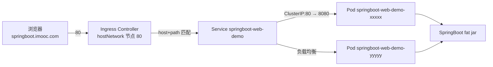

## 纲要

- SpringBoot Web 服务同样先看清代码：配置、启动类、Controller 三层都极简
- pom 里 spring-boot-maven-plugin 负责把所有依赖打成可执行 fat jar，直接 `java -jar` 就能起
- 本地先用 `java -jar` 把服务跑起来并验证接口返回，再谈镜像
- 基础镜像继续沿用 openjdk:8，SpringBoot 应用不需要额外运行时依赖
- 一个 spring-boot-maven-plugin 打出来的包就是全部运行文件，COPY 进镜像即可
- Web 服务对外提供接口，服务发现策略直接选 Ingress，前面已经把入口铺好了
- 一套完整配置是 Deployment + Service + Ingress 三段，各管一层，缺一不可
- Service 的 selector 必须与 Deployment 的 label 对应，这是三段配置串起来的关键

## 代码长什么样

第二个迁移场景是完全基于 SpringBoot 开发的 Web 服务。

先看配置，只有两项：应用名叫 `springboot-web-demo`，服务端口 8080。

启动类上挂 `@SpringBootApplication` 注解，通过 main 方法把 SpringBoot 项目跑起来。Controller 更简单，是一个 `@RestController`，对外暴露一个 `/hello/hello` 接口，可以传一个 `name` 参数进去，返回的是 `hello name` 加上一句 `i'm springbootwebdemocontroller`。

pom 里依赖也少：一个 `spring-boot-starter-parent` 父依赖，一个 `spring-boot-starter-web`，有这两个就足够在启动的时候自动提供 Web 服务了。

这里有个必须注意的 plugin——`spring-boot-maven-plugin`。它的作用是把最终的所有包、所有依赖文件打成一个包，打完之后直接用 `java -jar` 就能把应用启动起来，不用再手工拼 classpath。

## 本地先把服务跑通

到主节点上把项目打包，确认产物：

```bash
cd imooc-k8s-demo/springbootwebdemo
mvn clean package
ls -lh target/*.jar
```

产出的 jar 明显比普通 jar 大一圈，这就是 plugin 打的 fat jar。拆开看一眼里面有什么：

```bash
jar tf target/springboot-web-demo-1.0.jar | head -30
```

能看到 `BOOT-INF/lib` 目录下塞了好多依赖 jar，配置文件 `application.properties` 也在里面，自己写的 `DemoController.class` 也在。也就是说**这一个包就是服务运行需要的全部文件**，不用再单独拷配置文件。

本地跑起来验证：

```bash
java -jar target/springboot-web-demo-1.0.jar
curl "http://192.155.20.50:8080/hello/hello?name=michael"
# 返回：hello michael, i'm springbootwebdemocontroller
```

页面正常返回，服务本身没问题，可以往下走。

```text
springbootwebdemo 项目结构
├── pom.xml
│   ├── spring-boot-starter-parent
│   ├── spring-boot-starter-web
│   └── spring-boot-maven-plugin（打可执行 fat jar）
├── src
│   └── main
│       ├── java
│       │   └── com/imooc/k8s
│       │       ├── ServiceApplication.java（@SpringBootApplication）
│       │       └── controller/DemoController.java（/hello/hello）
│       └── resources
│           └── application.yml（server.port: 8080）
└── target
    └── springboot-web-demo-1.0.jar（fat jar，镜像里唯一需要的文件）
```

## 做镜像

第一步还是基础镜像。这个服务同样是 Java 程序，不依赖别的环境，沿用上一节那个 openjdk 八版本基础镜像就行。

第二步是运行相关文件。前面已经看清楚了，只有一个 fat jar，连配置文件都不用单独给——配置在 jar 里。

第三步写 Dockerfile，比定时任务那条更简洁，因为不需要拼 classpath，直接 `java -jar`：

```dockerfile
FROM openjdk:8

COPY springboot-web-demo-1.0.jar /app/springboot-web.jar

ENTRYPOINT ["java", "-jar", "/app/springboot-web.jar"]
```

COPY 到 `/app` 下取个短名，ENTRYPOINT 三条参数：java、-jar、jar 包路径。构建并本地验证：

```bash
docker build -t springboot-web:1 .
docker run -it -p 8080:8080 springboot-web:1
```

容器能正常起来、接口能访问，说明镜像没问题。然后推到私有仓库：

```bash
docker tag springboot-web:1 hub.imooc.com/library/springbootweb:v1
docker push hub.imooc.com/library/springbootweb:v1
```

镜像这一侧就完工了。

## 确定服务发现策略

接着是第二大步。这次跟定时任务不同——它是个 Web 服务，要对外提供接口，别人会主动来调它。

前面服务发现那一节的结论直接套用：对外提供服务的入口用 Ingress。而且入口已经在上一节铺好了，Controller 就以 hostNetwork 跑在指定节点上、占着 80 端口，现在要做的是把规则指过来。

## 三段配置各管一层

一份完整配置包含三段：Deployment、Service、Ingress。三者职责完全不同，串起来才是一条可用链路。

```yaml
apiVersion: apps/v1
kind: Deployment
metadata:
  name: springboot-web-demo
  namespace: default
spec:
  replicas: 1
  selector:
    matchLabels:
      app: springboot-web-demo
  template:
    metadata:
      labels:
        app: springboot-web-demo
    spec:
      containers:
        - name: springboot-web
          image: hub.imooc.com/library/springbootweb:v1
          ports:
            - containerPort: 8080
---
apiVersion: v1
kind: Service
metadata:
  name: springboot-web-demo
  namespace: default
spec:
  type: ClusterIP
  selector:
    app: springboot-web-demo
  ports:
    - port: 80
      targetPort: 8080
---
apiVersion: networking.k8s.io/v1
kind: Ingress
metadata:
  name: springboot-web-demo
  namespace: default
spec:
  ingressClassName: nginx
  rules:
    - host: springboot.imooc.com
      http:
        paths:
          - path: /
            pathType: Prefix
            backend:
              service:
                name: springboot-web-demo
                port:
                  number: 80
```

逐段说明：

**Deployment。** 定义一个叫 `springboot-web-demo` 的 Deployment，跑一个实例。`selector.matchLabels` 和 `template.metadata.labels` 都是 `app: springboot-web-demo`，Pod 模板里的 label 就是后面被选中、被 Service 引用的那层身份。容器里配了 `containerPort: 8080`，正好对应 SpringBoot 配置里的服务端口。

**Service。** 因为配 Ingress 的时候要指定后端 Service，所以这一段不能省。类型是默认的 ClusterIP，`port: 80`、`targetPort: 8080`——Service 自己的端口是 80，转发到容器的 8080。Service 的 selector 要**跟 Deployment 的名字对应上，名字写一样**，这样它才能找到 Deployment 管理下的那些 Pod。

**Ingress。** 配一个域名 `springboot.imooc.com`，再配一个路径，这个域名下所有路径的转发都指向 `springboot-web-demo` 这个 Service，servicePort 对应 Service 定义的 80。

三段之间的连接点其实就两个：Deployment 的 label 被 Service 的 selector 选中，Service 的名字被 Ingress 的 backend 引用。

```text
三段配置的串联关系
├── Deployment/springboot-web-demo
│   ├── podTemplate labels: app=springboot-web-demo
│   └── containerPort: 8080（SpringBoot 实际监听）
│
├── Service/springboot-web-demo
│   ├── selector: app=springboot-web-demo  ← 命中上面 Pod 的 label
│   ├── port: 80（集群内访问入口）
│   └── targetPort: 8080 → 转发到容器
│
└── Ingress/springboot-web-demo
    ├── host: springboot.imooc.com
    ├── path: /（Prefix）
    └── backend service: springboot-web-demo，port 80  ← 命中上面 Service
```



## 应用并验证

```bash
kubectl apply -f springboot-web.yaml
kubectl get pod -l app=springboot-web-demo -o wide
```

Pod 进入 Running 状态。本机配一条 hosts 指向 Controller 所在的节点：

```bash
echo "192.155.20.120 springboot.imooc.com" | sudo tee -a /etc/hosts
```

浏览器打开 `http://springboot.imooc.com/hello/hello?name=michael`，返回内容和本地跑的一模一样：

```
hello michael, i'm springbootwebdemocontroller
```

到这一步，一个 SpringBoot Web 服务就顺利迁移到集群上了。

## API 速览

| 能力 | 集群里该用什么 | 做法要点 |
| --- | --- | --- |
| 运行 SpringBoot 进程 | Deployment | Pod 模板 label 就是被选中的身份 |
| 对外提供集群内入口 | ClusterIP Service | selector 要与 Deployment 名字对应 |
| 声明端口用途 | containerPort | 对应 SpringBoot 的 server.port |
| 域名暴露到外面 | Ingress | host + path 指向后端 Service 名 |
| 服务发现策略选择 | Ingress（对外）/ ClusterIP（对内） | 有外部调用方才需要 Ingress |
| 镜像取自 | 私有仓库 | 打 tag 后 push，节点不用现拉 |
| 配置随包走 | spring-boot-maven-plugin | fat jar 自带配置与依赖，不用单独 COPY 配置文件 |
| ENTRYPOINT 写法 | exec 数组 `java -jar` | 直接收到停止信号，进程即 1 号进程 |

## Demo 示例

### 1. 从打包到镜像

```bash
# 打包并确认产物
cd imooc-k8s-demo/springbootwebdemo
mvn clean package
jar tf target/springboot-web-demo-1.0.jar | grep -E "BOOT-INF/lib|application"

# 本地跑通
java -jar target/springboot-web-demo-1.0.jar &
curl "http://127.0.0.1:8080/hello/hello?name=michael"

# 构建镜像
cat > Dockerfile <<'EOF'
FROM openjdk:8
COPY springboot-web-demo-1.0.jar /app/springboot-web.jar
ENTRYPOINT ["java", "-jar", "/app/springboot-web.jar"]
EOF
docker build -t springboot-web:1 .
docker run -it --rm -p 8080:8080 springboot-web:1

# 推仓库
docker tag springboot-web:1 hub.imooc.com/library/springbootweb:v1
docker push hub.imooc.com/library/springbootweb:v1
```

### 2. 三段配置一次 apply

```bash
kubectl apply -f springboot-web.yaml

# 三段分别确认
kubectl get deploy -l app=springboot-web-demo
kubectl get svc springboot-web-demo
kubectl get ingress springboot-web-demo

# 看后端有没有接上（ENDPOINTS 列不能空）
kubectl describe svc springboot-web-demo
kubectl get endpoints springboot-web-demo
```

### 3. 接口验证与排障

```bash
# 集群内从某个 Pod 里直接调，验证全链路
kubectl run curl-test --image=curlimages/curl --rm -it --restart=Never -- \
  curl -s http://springboot-web-demo/hello/hello?name=michael

# 带 Host 头从入口直接打
curl -s http://192.155.20.120/hello/hello?name=michael -H "Host: springboot.imooc.com"

# 看应用日志
kubectl logs -l app=springboot-web-demo -f

# 看是镜像拉不到还是起不来
kubectl describe pod -l app=springboot-web-demo | tail -20
```

### 4. 扩副本看负载均衡

```bash
kubectl scale deploy springboot-web-demo --replicas=3
kubectl get pod -l app=springboot-web-demo -o wide

# 连续请求，观察打到不同 Pod 上
for i in 1 2 3 4 5 6; do
  curl -s "http://192.155.20.120/hello/hello?name=michael" -H "Host: springboot.imooc.com"
  kubectl get pod -l app=springboot-web-demo --no-headers -o custom-columns=:metadata.name | head -1
done
```

### 总结

SpringBoot 应用的迁移路径跟定时任务一致：先做镜像，再写集群配置，中间那步都是"确定服务发现策略"。

spring-boot-maven-plugin 打出来的 fat jar 自带全部依赖与配置，是镜像里唯一需要的文件，`java -jar` 一条命令就能起，不用再拼 classpath。

发布到集群前的铁律仍然是在本地先把服务跑通并验证接口返回，能省掉大量在集群里查日志的时间。

Web 服务对外提供接口，服务发现走 Ingress；入口 Controller 已在前面以 hostNetwork 形式占住节点 80 端口，这里只需要把规则指过去。

Deployment、Service、Ingress 三段缺一不可：Deployment 管 Pod 与容器端口，Service 给集群内一个稳定的 80 入口，Ingress 把域名映射到 Service。

串起三段的关键是两个对应：Service 的 selector 命中 Deployment Pod 的 label，Ingress 的 backend service 名字写对 Service 的名字，写错一个就是空端点。

镜像统一走私有仓库，节点上不用现拉公网镜像，构建一次到处复用。

