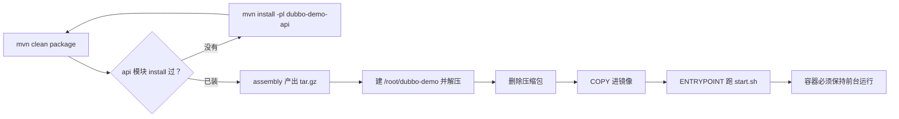

## 纲要

- Dubbo 服务由 api 模块定义接口、provider 模块实现，配置比 SpringBoot 类多得多
- dubbo 配置里有注册中心地址和服务端口，服务把地址端口都公告上去供他人调用
- 传统非 SpringBoot 服务没法用 `java -jar` 一行起，得自己拼 classpath 与参数
- 打包靠 maven-jar、resources、assembly 三个插件配合，最终产出 tar.gz 而非单个 jar
- 打包前要先 `mvn install` 把 api 模块装进本地仓库，否则 provider 报找不到依赖
- assembly 描述文件决定输出结构：lib 放依赖 jar、conf 放配置、bin 放启停脚本
- 启动脚本会做进程与端口检查、拼 classpath、后台拉起并回显 PID；停止脚本杀 PID 并轮询确认
- 构建镜像时先把 tar.gz 解压到工作目录，这是与 SpringBoot fat jar 最大的不同
- 启动脚本本身是后台运行的，直接当 ENTRYPOINT 会让容器秒退，必须改成前台运行

## 代码与配置长什么样

第三个迁移场景是传统的 Dubbo 服务。Java 代码很简单，只有一个类。

接口 `DemoService` 定义在 api 模块里，定义了一个 `sayHello` 方法；provider 模块继承并实现它，里面加一行日志，把传入的名字拼回去返回。这块没什么好说的。

配置就多了。看 provider 的配置：Dubbo 的 spring 配置里声明了实现类 `DemoServiceImpl`，并把实现类跟要暴露的接口对应起来——这是 Dubbo 传统的 XML 配置方式，老项目一般这么配。

再往下是一个 `dubbo.properties` 基础配置文件，里面有应用名，还有注册中心 zk 的地址。如果环境里已经有现成的 zk，直接拿来用；没有的话可以自己跑一个。配置里还指定了 spring 配置文件的位置 `classpath:spring/provider.xml`，以及 protocol 名字和对外提供服务的端口。

这几点要理解清楚：

- **需要一个注册中心**，相当于一块公告板。服务启动时把自己的信息写到公告板上，其他人从公告板上拿到你的信息才能调你
- **对外要有一个端口**。服务会把提供服务的地址和端口都公告出去，调用方拿到具体地址再发起访问

最后一点跟前面两个场景差别很大：这个传统服务可能有很多类、很多配置文件，还要依赖各种各样的 jar。SpringBoot 能自动打包成一个 fat jar，但传统服务没有用 SpringBoot，打包这件事就得靠一堆 maven 插件自己兜。

## 打包为什么麻烦

这次我们自己定义整个 package 过程。

**要包含哪些资源。** 源码目录下的 xml 和 properties 配置文件要包含进来；`src/main/bin` 目录下放的是启动和停止服务用的脚本——因为它不是 SpringBoot 项目，没法用简单的 `java -jar`，得自己拼好 classpath、拼好各种参数，这一系列复杂操作就封装在脚本里；`resources` 下所有配置文件也都要，并且单独放到构建结果的 conf 目录里。

**几个插件的配合：**

| 插件 | 作用 |
| --- | --- |
| maven-jar-plugin | 打自己的代码时排除配置文件，因为配置已经单独放到 conf 目录 |
| maven-compiler-plugin | 编译插件，可按环境调整 JDK 版本 |
| maven-resources-plugin | package 阶段帮忙做文件 copy |
| maven-assembly-plugin | 装配插件，依赖一个描述文件决定怎么装配，**最关键的一个** |

装配插件的输出由描述文件说了算，描述文件里指定了最终输出格式 tar.gz，还列了一串文件清单：把 `project/bin` 拷到输出的 bin 目录，把 `project/conf` 拷到输出的 conf 目录，依赖 jar 拷到输出的 lib 目录。

**启停脚本干了什么。** 启动脚本先取脚本所在目录和它的上一级，拼出配置目录；然后从 conf 下的 dubbo.properties 里按属性取到 `server.name` 和 `server.port`（同样的取法取两遍）。接着做几项检查：server.name 取不到就认为应用非法；查一下同样应用的进程是否已存在，存在就报 `already started`；用 `ss -lnt` 看 server.port 有没有被监听，大于零说明端口已被占用。

检查完拼出日志目录并创建，拼出 lib 目录，用 `ls` 加 `sed` 把每个 jar 拼成完整 classpath 放进变量，再拼一些 javaOption（debug 模式下加 debug 参数）。然后输出"启动服务"，用后台方式把 java 跑起来，通过 `-D` 定义 server.name，后面跟一堆 java 参数，classpath 指定两个：confDIR 配置文件目录，加上前面拼出来的所有 jar，最后跟启动类，输出重定向到日志文件。最后 `ps` 查到进程 PID 打印出来。

停止脚本跟启动差不多，取变量、判断 server.name，检查进程——进程不存在就提示没启动、不用停；否则拿到 PID，`kill` 掉，然后不断轮询确认这个 PID 真的没了，全停掉才输出 OK。

## 本地先跑通

流程还是老三样：基础镜像、运行文件、构建镜像。先做第二项——把运行文件找出来。

进到项目里的 dubbo-demo，直接 package 会报 `could not find dubbo-demo-api`，因为 api 模块还没装进本地仓库。先把 api 装了，再回去 package：

```bash
cd imooc-k8s-demo/dubbo-demo
mvn install -pl dubbo-demo-api
mvn clean package
```

看 target 输出了什么，最终应该是一个 `.tar.gz`。注意这是压缩文件，不能用 jar 命令看，得用 tar：

```bash
tar -ztf target/dubbo-demo.tar.gz
```

里面结构一目了然：lib 下有很多依赖 jar，conf 下有配置文件，bin 下有脚本。这个压缩包里已经包含了服务运行需要的全部文件。

解压出来先本地跑一遍：

```bash
mkdir -p /root/dubbo-demo && tar -xzf target/dubbo-demo.tar.gz -C /root/dubbo-demo
cd /root/dubbo-demo
./bin/start.sh
```

启动后看有没有 log 目录和日志文件，`logs` 下的 `dubbo.log` 里会出现 `dubbo service started`：

```bash
tail -f logs/dubbo.log
# 确认端口，dubbo.properties 里配的是 20880
ss -lnt | grep 20880
```

Dubbo 自带 telnet 治理能力，直接连上端口试调用：

```bash
telnet localhost 20880
# 列出服务
ls
# 看接口
ps
# 调方法，一个参数（在 telnet 会话内执行）
# 下面这条是在 telnet 会话里发给 Dubbo telnet 服务的命令，不是 shell 命令：
#   invoke DemoService.sayHello("dick")
```

返回了结果，说明 Dubbo 服务正常。再用脚本停掉：

```bash
./bin/stop.sh
ss -lnt | grep 20880   # 端口应当没了
```

到这一步，运行文件就确认齐了。

## 构建镜像

下一步构建镜像。这里有个新问题：我们这次的产物是**一个压缩包**，不能像 SpringBoot 那样直接 COPY 一个 jar。得先建个目录、把文件移进去、解压、把压缩包删掉，剩下的才是要放进镜像的文件。

这一步操作虽然不复杂，但每次都来一遍很啰嗦，频繁用的话就写个脚本，把 maven package、建目录、解压串起来一次做完。

```bash
#!/bin/bash
set -e
mvn clean package
PKG=$(ls target/*.tar.gz)
rm -rf /root/dubbo-demo
mkdir -p /root/dubbo-demo
tar -xzf "$PKG" -C /root/dubbo-demo
rm -f "$PKG"
ls -R /root/dubbo-demo | head -20
```

Dockerfile 第一行照旧 FROM 那个 openjdk 基础镜像，COPY 到 /root 下，ENTRYPOINT 执行 `/root/bin/start.sh`：

```dockerfile
FROM openjdk:8
COPY dubbo-demo /root/dubbo-demo
ENTRYPOINT ["/root/bin/start.sh"]
```

```text
dubbo-demo 构建产物结构
├── target
│   └── dubbo-demo.tar.gz（assembly 插件产出）
│       ├── bin
│       │   ├── start.sh（拼 classpath、拉起 java）
│       │   └── stop.sh（kill PID 并轮询确认）
│       ├── conf
│       │   ├── dubbo.properties（应用名、zk 地址、端口 20880）
│       │   └── spring/provider.xml（Dubbo 接口与实现类绑定）
│       └── lib（全部依赖 jar，由拼 classpath 的脚本遍历）
└── 镜像内落点
    └── /root/dubbo-demo（解压后的同构目录）
```



## 一个必须避开的坑

照上面写完先 apply 一遍大概率会发现问题：容器起来没多久就退了。

原因是 `start.sh` 本身是**后台运行**的——脚本里用后台方式把 java 拉起来，脚本自己立刻输出两行就退出了。而容器的生命周期跟 ENTRYPOINT 里那个进程绑定：ENTRYPOINT 这个进程退了，容器就跟着退。所以脚本一退，容器就没了。

修法很直接：进到镜像里把脚本改一改，让它**前台运行**——把后台运行那部分去掉即可，脚本后面那些拼参数、重定向日志的逻辑都没意义了。

改完再构建、再跑，容器就能常驻。这类问题在把传统脚本搬进容器时特别常见，判断标准就一条：**ENTRYPOINT 指定的进程必须前台常驻**，后台起进程的脚本一律要先改造。

```bash
# 定位问题容器为什么退出
kubectl get pod -l app=dubbo-demo
kubectl logs dubbo-demo-xxxxx
kubectl describe pod dubbo-demo-xxxxx | tail -15
# 结尾那句 Reason 是 Completed、退出码 0，基本就是主进程自己退了
```

注意这一节只走到"镜像能跑起来"为止。Dubbo 服务真正进集群还要解决服务发现策略——它不是给浏览器访问的，而是被其他 Dubbo 消费者调用，注册中心怎么对接、Pod 重启后地址怎么更新，那是下一节的事。

## API 速览

| 能力 | 做法 | 要点 |
| --- | --- | --- |
| 打传统服务包 | maven-assembly-plugin | 输出 tar.gz，含 lib、conf、bin 三块 |
| 决定包结构 | assembly 描述文件 | 指定 tar.gz 及每个目录的来源 |
| 本地仓库依赖 | `mvn install -pl` | 先装 api 模块，provider 才编得过 |
| 配置与代码分离 | maven-jar-plugin 排除配置 | 配置单独进 conf 目录 |
| 生产目录结构 | bin/start.sh + stop.sh | 自拼 classpath，不能用 `java -jar` |
| 端口连通验证 | `ss -lnt` + telnet 连 20880 | Dubbo 自带 ls / ps / invoke 命令 |
| 镜像里放文件 | 先建目录再解压 | 压缩包不能直接 COPY 当运行文件 |
| 容器常驻 | 把后台脚本改前台 | ENTRYPOINT 进程一退容器就退 |

## Demo 示例

### 1. 完整打包脚本

```bash
#!/bin/bash
set -e

# 1) 先把 api 模块装进本地仓库
mvn install -pl dubbo-demo-api

# 2) 打包
mvn clean package

# 3) 准备镜像根目录
TARGET_DIR=/root/dubbo-demo
PKG=$(ls target/*.tar.gz | head -1)
rm -rf "$TARGET_DIR"
mkdir -p "$TARGET_DIR"

# 4) 解压、删压缩包
tar -xzf "$PKG" -C "$TARGET_DIR"
rm -f "$PKG"

# 5) 关键：把后台脚本改成前台
sed -i 's|nohup java |java |' "$TARGET_DIR"/bin/start.sh
tail -5 "$TARGET_DIR"/bin/start.sh

echo "构建目录就绪：$TARGET_DIR"
```

### 2. 镜像构建

```bash
cp -r /root/dubbo-demo .
cat > Dockerfile <<'EOF'
FROM openjdk:8
COPY dubbo-demo /root/dubbo-demo
ENTRYPOINT ["/root/bin/start.sh"]
EOF

docker build -t dubbo-demo:1 .
docker run -it --rm --name dubbo-test dubbo-demo:1
# 容器不再秒退，且 20880 在监听
```

### 3. 本地验证全流程

```bash
# 启动
bin/start.sh
tail -f logs/dubbo.log        # 出现 dubbo service started
ss -lnt | grep 20880          # LISTEN 状态

# 调用
telnet 192.155.20.50 20880
# 进入 telnet 会话后，下面三条是发给 Dubbo telnet 服务的命令，不是 shell 命令：
#   ls
#   ps
#   invoke DemoService.sayHello("dick")

# 停止
bin/stop.sh
ss -lnt | grep 20880          # 端口已释放
```

### 4. Dockerfile 里的前台化思路

改造前，脚本末尾类似这样（后台拉起，脚本立即结束）：

```bash
nohup java \
  -Dserver.name=dubbo-demo \
  -cp "confDIR:$(ls lib | sed 's|^|lib/|' | tr '\n' ':')" \
  com.imooc.DubboDemo > logs/stdout.log 2>&1 &
echo $! > logs/dubbo.pid
echo "started pid $!"
```

改造后，直接前台跑，脚本就不会自己退出：

```bash
exec java \
  -Dserver.name=dubbo-demo \
  -cp "confDIR:$(ls lib | sed 's|^|lib/|' | tr '\n' ':')" \
  com.imooc.DubboDemo > logs/stdout.log 2>&1
```

用 `exec` 替换掉当前 shell 进程，java 直接接管 PID 1，不仅不会退出，还能保证 `kubectl stop` 发出的终止信号原样传给 java，避免进程收不到信号直接被杀。

### 总结

传统 Dubbo 服务的迁移套路与前两个场景一致，但运行文件的形态变了：不是 fat jar，而是 assembly 打出的 tar.gz。

打包前必须先 `mvn install` 把 api 模块装进本地仓库，否则 provider 会因为找不到依赖直接编译失败。

maven-assembly-plugin 是这套流程的核心，它的描述文件决定输出是 tar.gz，以及 lib、conf、bin 三个目录各装什么。

非 SpringBoot 服务靠 start.sh 拼 classpath 与 java 参数启动，脚本里带了进程与端口的合法性检查，本地验证可以完整走一遍启停。

镜像里不能直接用压缩包，要先建目录、解压、删包；这一串操作值得写成脚本，避免每次手工来。

最容易踩的坑是启动脚本后台运行，导致 ENTRYPOINT 一退出容器就停，改造办法是去掉后台、用 exec 让 java 前台接管 PID 1。

这一节只把镜像和常驻进程做通，Dubbo 服务的注册中心对接与集群内服务发现是下一节的重点。

