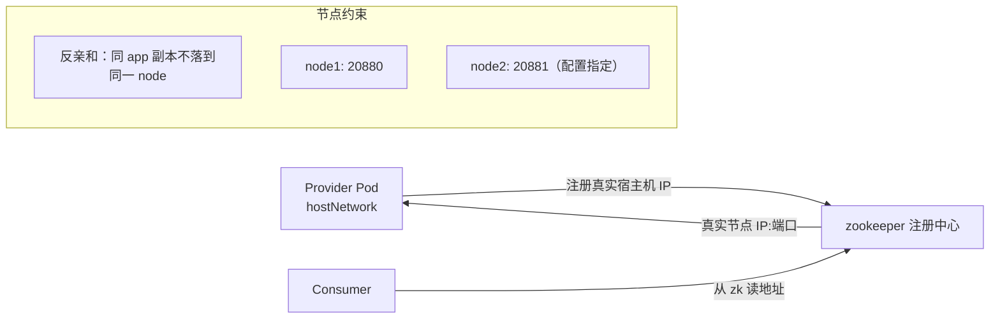

## 纲要

- 停止脚本用的是不带参数的 kill，默认发的是 15 号 SIGTERM 信号
- 容器停止时 Docker 发的同样是 SIGTERM，与脚本行为天然一致，不用额外改造优雅退出
- Dubbo 收到 SIGTERM 会自动收尾：停止接新请求、通知客户端下线、处理完存量请求
- 容器里跑脚本有两个地方要改：ps 的 no-heading 参数不兼容，重定向到文件的输出看不到
- 桥接模式下 provider 注册的是容器 IP，集群外的消费者拿这个地址根本访问不到
- 桥接模式的替代路子是文件挂载主机 IP 进容器，但麻烦且性能不如 host 模式
- hostNetwork 让 provider 直接注册真实宿主机 IP，问题消失，代价是端口直接占用主机
- 多副本会互相抢端口，靠 hostNetwork 加节点反亲和把实例打散到不同节点
- 端口决策权收到集群配置层：用环境变量传端口，脚本 sed 替换 dubbo.properties 后生效

## 优雅退出这件事不用额外做

先回顾上一节那个 stop.sh：它最终停止的方式是给进程发了一个不带参数的信号，默认就是给这个 PID 发 15 号信号，也就是 SIGTERM。

而 Docker 在容器停止时，给容器主进程发的同样是一个 SIGTERM 信号。这两者撞在了一起，所以不需要为优雅退出额外写什么。

流程是这样的：程序在前台运行时，Docker 会给这个主进程发一个 SIGTERM。程序收到之后，Dubbo 内部会自己做收尾——不再接受新的请求、通知各个客户端它已经下线、同时把手上现有的请求处理完，然后才真正退出。这是 Dubbo 内部自动实现的链路。

要做的就是让 SIGTERM 顺利传给 java，而集群停容器发的正是这个信号，所以这条链路天然是通的，优雅退出的问题直接被规避掉了。

## 构建镜像时脚本要改两处

```bash
docker build -t dubbo-demo:v1 .
docker run -it dubbo-demo:v1
```

第一次跑会报错，指向 `ps` 那条命令——容器里这个 ps 跟宿主机上的不是一个版本，`no-heading` 参数不认。

其实在容器里运行根本不需要做这个进程检查，容器本身已经保证没有同应用的其他进程，所以 `no-heading` 这样参数整个去掉就行。

改完再跑一次，又发现它一直停在那里不动。原因在脚本本身：打印完那一行之后，接下来就直接去运行主程序了，并且把输出全部重定向到了日志文件中，所以前台什么都看不到。

这倒不是故障，两种处理方式都行：

- 保持现状，看日志的时候进容器里看那个日志文件，或者用 `kubectl logs` 把标准输出拉出来
- 把输出重定向去掉，让所有输出都走容器的标准输出，重新构建再跑，日志就能直接打印出来

后一种更省事，`kubectl logs` 直接能看到 `dubbo server started`。镜像到这里就做好了。

```text
容器内启动链路
├── /root/bin/start.sh（ENTRYPOINT）
│   ├── 校验 server.name / server.port（去掉 ps 相关检查）
│   ├── sed 替换 conf/dubbo.properties 里的端口
│   ├── 拼 classpath（conf + lib 下所有 jar）
│   ├── exec java（前台，接 PID 1）
│   └── 输出重定向到 logs/stdout.log
└── 探针与停止
    ├── 存活探针读日志或探端口
    └── kubectl delete pod → Docker 发 SIGTERM → Dubbo 优雅下线
```

## Dubbo 的服务发现困境

接下来是这次迁移真正棘手的地方——**服务发现策略**。

Dubbo 依赖注册中心（ zookeeper ）。流程图是这样的：provider 把自己登记到 zk 这块"公告板"上，consumer 从 zk 读出来 provider 的信息，拿到地址去调用。

问题就出在"地址"这两个字上。如果 provider 跑在一个容器里，它注册上去的是**容器 IP**，比如 `172.22.x.x`。这个 IP 确实能通——但对的是集群内部。consumer 如果在集群内，访问这个 Pod IP 没问题；可**如果 consumer 在集群外，这个 IP 根本访问不到**，注册中心里的这个地址就成了一条死路。

以前很多公司把 Dubbo 搬进 Docker 都撞上过类似的坑，感觉用哪种服务发现策略都不那么对。试过很多种方案之后，这里选的是 **host 模式**。

如果使用桥接模式，不是不能解决，但要绕：在容器启动时给它一个环境变量，环境变量里指定它所在宿主机的真实 IP。可这个环境变量本身也不好弄——Pod 启动时并不知道自己的宿主机 IP 是多少，只能通过文件挂载的方式，在宿主机上写一个文件（比如把主机 IP 写到一个 env 文件里），再把这个文件挂进容器，容器从文件里取真实 IP。

这条路能走通，但一来确实麻烦，二来性能也不如 host 模式。

## host 模式与它的端口冲突

host 模式相当于在主机上直接运行了一个 provider，跟那台机器裸跑的效果完全一样。它拿到的是真实 IP，直接把真实 IP 写进去注册，前面那个"注册容器 IP 别人访问不到"的问题就不存在了。

但 host 模式带来一个新问题：**端口是直接监听在主机上的**。比如 20880，它会实打实占住宿主机的 20880。如果同一个节点上还跑着另一个 Dubbo 服务，那两个 20880 就会撞车，这就是端口冲突。

既然选了 host 模式，就必须保证每台宿主机上的 Dubbo 端口都不一样。

难点在于执行者是人：不能要求每个应用方自己限定"你只能用这个端口"，万一人家忘改了、或者新来的人不知道要改，这个风险就藏下来了。所以得换个思路——**把改端口的权力从应用方收回到集群配置层**。

具体做法是：在 Kubernetes 的配置里给一个环境变量，比如 `dubboPort=20881`，配置完这个环境变量，服务启动时的端口就变成 20881。

怎么实现？脚本里想得到这个值：脚本里什么事都能做，而且还能改 `dubbo.properties` 那个配置文件——把里面的端口替换掉就行了。

## 让脚本支持自定义端口

改造点在 start.sh 里，位置是**校验 serverPort 之前**：得先确定 serverPort 的值，因为它可能被改掉。

```bash
# 取原始端口
SERVER_NAME=$(grep server.name conf/dubbo.properties | sed 's/.*=//')
SERVER_PORT=$(grep server.port conf/dubbo.properties | sed 's/.*=//')

# 如果集群配置里指定了端口，就替换掉配置文件里的
if [ -n "$DUBBO_PORT" ]; then
  sed -i "s/server\.port=.*/server.port=${DUBBO_PORT}/" conf/dubbo.properties
  SERVER_PORT=${DUBBO_PORT}
fi

# 后续校验沿用替换后的值，下面这段照旧
if [ -z "$SERVER_NAME" ]; then
  echo "server.name is empty, invalid app"
  exit 1
fi
```

这样脚本就支持了自定义端口，端口的规划权落在了管理集群配置的人手里，甚至可以随机生成一批不重复的端口，从根上避免冲突。

## Deployment 配置

镜像推上去之后写配置。这份配置和之前 SpringBoot 那次结构相似，但多了两个关键东西：

```yaml
apiVersion: apps/v1
kind: Deployment
metadata:
  name: dubbo-demo
  namespace: default
spec:
  replicas: 2
  selector:
    matchLabels:
      app: dubbo-demo
  template:
    metadata:
      labels:
        app: dubbo-demo
    spec:
      hostNetwork: true
      affinity:
        podAntiAffinity:
          requiredDuringSchedulingIgnoredDuringExecution:
            - labelSelector:
                matchExpressions:
                  - key: app
                    operator: In
                    values:
                      - dubbo-demo
              topologyKey: kubernetes.io/hostname
      containers:
        - name: dubbo-demo
          image: hub.imooc.com/library/dubbo-demo:v1
          env:
            - name: DUBBO_PORT
              value: "20881"
```

一处是 **hostNetwork 网络模式**设为 true，让 Pod 直接用宿主机网络。

另一处是 affinity 亲和性调度，这里先不细讲调度策略的原理，只看它的目的：让 Dubbo 多实例的情况下**不会调度在同一个节点上**，从而避免端口冲突。多副本各占一台机器，20880 或自定义端口就各自不打架了。这块配置的具体原理后面会单独展开讲调度策略。

容器里还配了环境变量 DUBBO_PORT。注意程序默认端口写的是 20880，先试着不定义这个变量，看它是不是还能正常起来。



## 实测两种端口

不定义环境变量先跑一遍：

```bash
kubectl apply -f dubbo.yaml
kubectl get pod -l app=dubbo-demo -o wide
# 落在 120 上
kubectl exec dubbo-demo-xxxxx -- ss -lnt | grep 20880
# 或直接在 120 节点上看
ss -lnt | grep 20880
telnet 192.155.20.120 20880
# # 下面这条是在 telnet 会话里发给 Dubbo telnet 服务的命令，不是 shell 命令：
#   invoke DemoService.sayHello("dick")
```

服务正常，20880 起来了。

再试定义环境变量，端口能不能随配置走：

```bash
kubectl set env deploy/dubbo-demo DUBBO_PORT=20881
```

第一次改完报错，`can't convert int to the string`——原因是配置里那个环境变量的值没加双引号，env 的值必须是字符串类型，不加引号就报这个错。补上双引号再改。

改完观察：

```bash
kubectl get pod -l app=dubbo-demo -o wide
ss -lnt | grep 20880   # 已经没了
ss -lnt | grep 20881   # 新的端口在监听
```

落在 121 上的那个实例，20880 已经没有监听，20881 起来了，跟预期完全一致。再去 telnet 121 的 20881 调一次，同样通。

这说明端口已经可以随集群配置随时调整，不用再去翻应用的配置文件。

## API 速览

| 能力 | 做法 | 要点 |
| --- | --- | --- |
| 优雅退出 | 什么都不用改 | 容器停止发的 SIGTERM 与脚本一致 |
| 容器里跑脚本 | 去掉 ps 的 no-heading 检查 | 容器内不需要进程检查 |
| 日志可观测 | 输出走标准输出 | 别重定向到文件，否则看不到 `kubectl logs` |
| provider 注册真实 IP | hostNetwork: true | 消费方能拿到可达地址 |
| 桥接模式兼容做法 | 文件挂载宿主机 IP | 麻烦且性能差，仅作备选 |
| 多副本不抢端口 | podAntiAffinity + topologyKey | 把实例按 hostname 打散 |
| 端口集中管理 | 环境变量 DUBBO_PORT | 脚本里 sed 替换 dubbo.properties |
| env 值类型 | 必须加双引号 | 写成数字会报 int 转 string 失败 |

## Demo 示例

### 1. 脚本改造片段

```bash
# start.sh 开头，校验之前
SERVER_NAME=$(grep server.name conf/dubbo.properties | sed 's/.*=//')
SERVER_PORT=$(grep server.port conf/dubbo.properties | sed 's/.*=//')

if [ -n "$DUBBO_PORT" ]; then
  echo "use dubbo port from env: $DUBBO_PORT"
  sed -i "s/server\.port=.*/server.port=${DUBBO_PORT}/" conf/dubbo.properties
  SERVER_PORT=${DUBBO_PORT}
fi

if [ -z "$SERVER_NAME" ]; then
  echo "server.name is empty, invalid app"
  exit 1
fi
```

### 2. 带反亲和与 hostNetwork 的完整配置

```yaml
apiVersion: apps/v1
kind: Deployment
metadata:
  name: dubbo-demo
  namespace: default
spec:
  replicas: 2
  selector:
    matchLabels:
      app: dubbo-demo
  template:
    metadata:
      labels:
        app: dubbo-demo
    spec:
      hostNetwork: true
      dnsPolicy: ClusterFirstWithHostNet
      affinity:
        podAntiAffinity:
          requiredDuringSchedulingIgnoredDuringExecution:
            - labelSelector:
                matchExpressions:
                  - key: app
                    operator: In
                    values:
                      - dubbo-demo
              topologyKey: kubernetes.io/hostname
      containers:
        - name: dubbo-demo
          image: hub.imooc.com/library/dubbo-demo:v1
          env:
            - name: DUBBO_PORT
              value: "20881"
          ports:
            - name: dubbo
              containerPort: 20881
              hostPort: 20881
```

用 hostNetwork 时建议顺便把 `dnsPolicy` 设成 `ClusterFirstWithHostNet`，否则 Pod 会用宿主机的 DNS 解析，集群内服务名可能解析不了。

### 3. 改端口与验证

```bash
# 第一次忘了加引号，会报 can't convert int to string
kubectl set env deploy/dubbo-demo DUBBO_PORT=20881

# 正确写法，值加双引号
kubectl set env deploy/dubbo-demo DUBBO_PORT="20881"

# 看落在哪些节点、各自监听什么端口
kubectl get pod -l app=dubbo-demo -o wide
for ip in 192.155.20.120 192.155.20.121; do
  echo "== $ip =="
  ssh root@$ip "ss -lnt | grep -E '20880|20881'"
done

# 调用验证
telnet 192.155.20.121 20881
> ls
# 下面这条是在 telnet 会话里发给 Dubbo telnet 服务的命令，不是 shell 命令：
#   invoke DemoService.sayHello("dick")
```

### 4. 排障清单

```bash
# 一、容器为什么退出（Completed 说明主进程自己退了）
kubectl describe pod -l app=dubbo-demo | tail -15
kubectl logs -l app=dubbo-demo --tail=50

# 二、端口到底监听在哪
kubectl exec -l app=dubbo-demo -- ss -lnt | grep -E '20880|20881'

# 三、注册到 zk 的地址是不是真实节点 IP
kubectl exec -l app=dubbo-demo -- hostname -i
# 输出应当是该节点的 IP，而不是 172.22.x.x

# 四、反亲和有没有生效（两个 Pod 要在不同节点）
kubectl get pod -l app=dubbo-demo -o wide
```

### 总结

容器停止时发的是 SIGTERM，和停止脚本用的信号一致，所以 Dubbo 服务的优雅退出不需要额外改造，Dubbo 自己会在收到信号后停止接新请求、通知客户端下线并跑完存量请求。

容器里跑传统脚本要改两处：去掉不兼容的 ps 参数，以及别把输出重定向到文件，让日志走标准输出才能被 `kubectl logs` 看到。

桥接模式下 provider 注册容器 IP，集群外的消费者拿到这个地址访问不了，这是 Dubbo 进容器最常踩的坑。

文件挂载宿主机 IP 是一种补救办法，但麻烦且性能不如 host 模式；hostNetwork 让 provider 直接注册真实节点 IP，问题根源被消除。

host 模式的代价是端口直接占宿主机端口，多副本调度到同一节点就会冲突，要配节点反亲和把实例打散到不同机器。

端口不该由应用方各自去改，应该在集群配置层用环境变量统一管理，脚本里 sed 替换配置文件后生效，改端口只动一处配置。

环境变量的值必须写成字符串（加双引号），写成裸数字会触发 int 转 string 失败。

hostNetwork 场景下记得把 dnsPolicy 设为 ClusterFirstWithHostNet，否则集群内服务名解析会失效。

