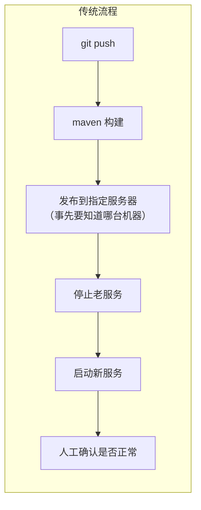
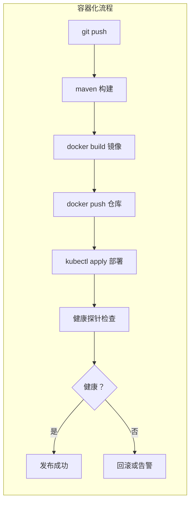

## 纲要

- 手动流程是 maven 打包、build 镜像、push 仓库、调 kubectl 控制集群，属于反复手工操作
- 开发、部署、测试本身就是不断重复的迭代过程，所以必须做成 CI/CD 自动化
- 传统工具链由代码仓库、构建工具、持续集成工具和配套脚本四部分拼成
- 没有集群时的发布是：提交代码、构建、发布到指定机器、调脚本先停后起
- 传统流程的四个硬伤：服务间断、环境不可控、发布结果难判定、多环境反复构建
- 容器化后的流程多出两件事：先 build 并 push 镜像，再部署之后做健康检查
- 健康探针由集群提供，每个应用可以配置自己的检查方式，能明确判定成功还是失败
- 镜像一次构建、多环境运行，前提是把环境相关配置抽离出去，不再写死在代码里

## 现在的问题是全靠手

前面把集群搭起来了，也把各种类型的服务调度进去了。但回头看每一步操作：手动执行 maven package，手动 build 镜像，push 到仓库，再调 kubectl 去控制集群完成一次新调度。

实际开发里，开发、部署、测试这个过程是**不断重复、不断迭代**的。重复的活交给人做，既慢又容易出错，所以这件事必须自动化，也就是熟悉的 CI/CD：持续集成与持续交付部署。

这一章先聊常见的 CI/CD 工具，以及在有集群之前和有了集群之后流程各是什么样、变化在哪，然后拿前面的代码把整套流程实跑一遍。每家公司组织架构和业务特征不同，落地时肯定有不少个性化东西，这里提供的是一套可借鉴的思路。

## 工具链本来就有

CI/CD 早在集群出现之前就已经存在很久了，一路发展到今天，也催生了周边一堆成熟工具：

| 环节 | 典型工具 |
| --- | --- |
| 代码仓库 | git、GitLab |
| 构建工具 | maven |
| 持续集成 | Jenkins |
| 特殊任务 | 各种配套 shell 脚本 |

有这些工具打底，再结合一些脚本完成持续集成里的特殊工作，几乎就能做出想要的持续集成效果——代码预编译、构建、静态检查、单元测试，发布到指定服务器等等，都能覆盖。

## 没有集群时的流程

拿一个 Web 服务举例，传统流程是这样走的：

代码仓库提交 git 代码 → 用 maven 工具构建 → 把构建结果发布到**指定的一台服务器**上。

"指定"这两个字是关键。做发布之前必须先知道这个服务要发布在哪台机器，并且要事先在这台机器上把对应的 Web 服务器（比如 Tomcat）搭好。所以一般来讲，**每个服务都要有一个固定的节点**。

发布之后就是调脚本：先停止服务，再启动服务，也就是停掉老的、启动新的，用脚本完成重启。



### 这套流程藏着几个硬伤

**一是服务间断。** 因为同一台机器上同时跑两个实例可能会有冲突，只能先停再起。可停掉不保证立刻能起得来，中间必然有一段间隔，这段时间服务就是不可用的。

**二是环境不可控。** 发布用的服务器一般是实体机或者虚拟机，上面通常不止跑一个服务，可能是几个，甚至十几个几十个。环境资源不宽松，一台机器很多人共用，别人改了这台机器的 DNS、配了 hostname、或者 Etcd 里绑了某个域名，都可能影响到你的服务。环境到底什么状态，你说了不算。

**三是发布结果难判定。** 调用启动脚本之后，脚本执行完了，程序是不是真的能正常提供服务，其实没法确定。启动过程中可能抛一个 `ClassNotFoundException`，可能报 `NoProvider`，各种错都可能。很难用统一脚本判断出服务真实状态，只能显示"成功"之后再回过头去看到底出了什么问题。这事很烦人，而且会把服务间断的时间拖长——如果内网环境里正有人在跑重要测试，这个问题就相当严重了。

**四是多套环境反复构建。** 公司环境一般不止一套：开发环境 dev、测试环境 test、预发布环境 pre、准生产环境 preProduct、生产环境 prod。每套环境的服务都得重新构建一遍——开发环境部署自己验证，没问题了再构建一份给测试验证，一步一层往下走。每个环境都构建，非常耗时耗力。

## 有了容器和集群之后

前面的步骤其实并没有大变。代码仓库照样提交，构建照样用 maven。变的是构建之后那一段：

- 构建完项目，**打镜像**，用 docker 命令构建镜像
- 镜像构建完 **push 到镜像仓库**，镜像和仓库都准备好了
- 然后才是用 Kubernetes 在集群上部署这个项目，一条 apply 把 Deployment 拉起来
- 但部署并没有结束——得检查这个项目是不是健康的。集群自身就带健康检查机制，每个应用都可以配置自己的检查方式
- 调集群的 API 做健康检查，检查过了就成功，没过就失败



### 好处落在哪几处

**环境稳定。** Dockerfile 把运行环境和程序一起固化下来，进程都跑在一个独立的操作系统里，所有东西都跟镜像相关，一成不变。别人动不了你的运行基础。

**服务不间断。** 集群本身就保证了高可用。滚动部署的时候，哪怕只有一个实例，也是先启动新的、确认成功之后再停掉原有的实例，客户端请求始终打在健康的服务上，不会出现空档。

**一次构建，多环境运行。** 这是针对"每套环境都重新构建"那个问题来的。用了容器之后可以一个镜像一路走下来：从开发、测试到预发、上线，用的都是最开始打出来的那一个镜像。

当然这个做法对应用本身有要求——**代码里不能写死环境相关的东西**，要把环境相关的配置抽离出去，比如放到配置中心，也可以放到集群的 ConfigMap 里，选一个公共的存储空间。

这样做还有个附带的收益是稳定性提高：从开发开始测，测试接着测，测的都是同一个镜像。要是每个环境都重新构建，虽然内网测试过了，到准生产环境很可能就过不了，因为构建结果本来就不一样。

```text
两种流程的落点对比
├── 传统（无集群）
│   ├── git push → maven 构建
│   ├── 产出：一个 war / jar
│   ├── 发布：scp 到固定某台机器
│   ├── 前提：那台机器上已手工装好 Tomcat / 环境
│   ├── 动作：脚本 stop → start
│   ├── 风险：服务间断、环境被别人改、启动失败难判定
│   └── 每套环境各构建一次（dev/test/pre/prod）
└── 容器化 + 集群
    ├── git push → maven 构建
    ├── 产出：一个镜像，一次构建
    ├── 发布：kubectl apply，节点由调度器决定
    ├── 前提：环境全在镜像里，节点只提供容器运行时
    ├── 动作：滚动更新，先起新后停旧
    ├── 收益：不断服、环境稳定、有健康探针可判定
    └── 多环境复用同一镜像，配置走 ConfigMap / 配置中心
```

## API 速览

| 能力 | 集群里该用什么 | 做法要点 |
| --- | --- | --- |
| 流水线编排 | Jenkins / GitLab CI | 串起构建、打镜像、推送、部署、检查 |
| 代码构建 | maven | 传统服务与 SpringBoot 都按各自方式打 |
| 产物固化 | docker build | 镜像把运行环境与程序绑死 |
| 制品中转 | 私有镜像仓库 | 构建一次推送一次，多环境共用 |
| 部署发布 | kubectl apply / rollout | 用 Deployment 声明期望状态 |
| 发布结果判定 | 健康探针 | 每个应用配置自己的检查方式 |
| 配置抽离 | ConfigMap / 配置中心 | 代码里不写死环境相关项 |
| 多环境复用 | 同一个镜像 tag | 配置靠挂载注入，而不是重新构建 |

## Demo 示例

### 1. 一条流水线脚本把各步骤串起来

```bash
#!/bin/bash
set -e

# 1) 构建
mvn clean package -DskipTests

# 2) 打镜像、打 tag 用 commit id，保证可追溯
IMAGE="hub.imooc.com/library/springboot-web:${GIT_COMMIT:0:8}"
docker build -t "$IMAGE" .

# 3) 推仓库
docker push "$IMAGE"

# 4) 部署，用镜像 tag 区分环境
kubectl set image deploy/springboot-web-demo \
  springboot-web="$IMAGE"
kubectl rollout status deploy/springboot-web-demo

# 5) 发布完看健康状态
kubectl get pod -l app=springboot-web-demo
kubectl describe deploy/springboot-web-demo | grep -A3 Conditions
```

`set -e` 保证任何一步失败就中断，配合后面的 `rollout status`，整条流水线是"能判定成功还是失败"的，不再像传统脚本那样"执行完就显示成功"。

### 2. 给应用配上自己的健康检查

```yaml
apiVersion: apps/v1
kind: Deployment
metadata:
  name: springboot-web-demo
spec:
  replicas: 2
  selector:
    matchLabels:
      app: springboot-web-demo
  template:
    metadata:
      labels:
        app: springboot-web-demo
    spec:
      containers:
        - name: springboot-web
          image: hub.imooc.com/library/springboot-web:latest
          ports:
            - containerPort: 8080
          readinessProbe:
            httpGet:
              path: /hello/hello
              port: 8080
            initialDelaySeconds: 5
            periodSeconds: 10
          livenessProbe:
            httpGet:
              path: /actuator/health
              port: 8080
            initialDelaySeconds: 15
            periodSeconds: 20
```

就绪探针通过之前，Service 不会把流量引过来——这就是"先起新的、确认健康再停旧的"能成立的基础。

### 3. 环境差异靠配置注入而不是重新构建

```yaml
apiVersion: v1
kind: ConfigMap
metadata:
  name: springboot-web-config
data:
  application.yml: |
    server:
      port: 8080
    spring:
      dubbo:
        registry:
          address: zookeeper://192.155.20.90:2181
---
apiVersion: apps/v1
kind: Deployment
metadata:
  name: springboot-web-demo
spec:
  template:
    spec:
      containers:
        - name: springboot-web
          image: hub.imooc.com/library/springboot-web:latest
          volumeMounts:
            - name: config
              mountPath: /config
      volumes:
        - name: config
          configMap:
            name: springboot-web-config
```

开发、测试、生产用同一个镜像，环境差异全在 ConfigMap 里，换环境只换配置。

### 4. 流水线里最该加的三条检查

```bash
# 一、发布前确认镜像存在
docker pull "$IMAGE" || exit 1

# 二、发布后等副本就绪，超过时间直接失败
kubectl rollout status deploy/springboot-web-demo --timeout=120s

# 三、确认后端端点真的接上了，而不是副本起来了就完事
kubectl get endpoints springboot-web-demo
kubectl run check --image=curlimages/curl --rm -it --restart=Never -- \
  curl -s -o /dev/null -w "%{http_code}" http://springboot-web-demo/hello/hello
```

### 总结

手动发布是构建、打镜像、推仓库、调 kubectl 四步串起来，重复且易错，天然要被 CI/CD 接管。

传统工具链是代码仓库加构建工具加持续集成工具再加配套脚本，功能上已经能覆盖编译、静态检查、单测和发布。

没有集群时代的发布要先确定发布到哪台机器、机器提前装好运行环境，然后脚本先停再起，这一停一起中间必然产生服务间断。

传统流程的四个硬伤是：停起之间服务间断、共用机器导致环境不可控、脚本执行完无法判定程序是否真的可用、每套环境各构建一次耗时耗力。

容器化流程在构建之后多了打镜像与推镜像两步，部署之后多了健康检查一步，成败有明确判定而不是"显示成功"。

集群带来的三项收益分别是：镜像固化让环境稳定、滚动更新让服务不断、探针让健康状态可判断。

一次构建多环境运行的前提是把环境相关配置抽离到配置中心或 ConfigMap，代码里不能写死环境项，这样还能避免不同环境构建结果不一致导致的"测试过了准生产挂了"。

