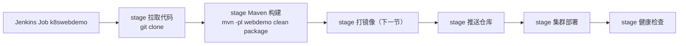

## 纲要

- 目标是把代码提交、编译构建、打镜像、推仓库、集群部署、健康检查整条链路串成自动流程
- 基础环境先备齐：代码仓库、Java 运行环境、Maven 构建环境
- Jenkins 用独立发布包跑，本质是 `java -jar` 一个 war 包，指定 http 端口即可
- 首次启动会在日志里给出初始管理员密码，也可在主目录下的 secrets 文件里查看
- 初始化走安装推荐插件，耗时较长，绿色表示已完成
- Jenkins 里所有工作都由任务 job 完成，建 CI/CD 流程就是建一个 job
- 任务类型选流水线 Pipeline，脚本里用 stage 分阶段，每个阶段有自己的名字
- 第一阶段用 git 拉代码，控制台里看到 git clone 和 Finished SUCCESS 才算通
- 第二阶段直接用本机 mvn 命令构建，首次执行要等 Maven 拉本地仓库依赖

## 把整条链路跑通

这一节把流程完整走一遍：从代码提交 → maven 编译构建 → 打镜像 → 推镜像到仓库 → 用集群部署 → 通过健康检查收尾。目标就是让这一整条**自动跑起来**。

主串这条线的是 Jenkins。先把基础环境准备好：

| 环节 | 用途 | 谁来准备 |
| --- | --- | --- |
| 代码仓库 | 拉代码 | 用 gitee、github 或自建 gitlab，都可以 |
| Java 环境 | 跑 Jenkins 本体 | 服务器装 JDK |
| Maven 环境 | 构建项目 | 服务器装 Maven |
| Jenkins | 流水线编排 | 本节重点部署 |

前三项自己搞定。以 120 这台机器为例，先确认工具可用：

```bash
git --version
java -version
mvn --version
```

三个都能正常输出版本，基础环境就齐了。最后一步装 Jenkins——大部分人用过它，但没亲手部署过，这里一起装一遍。

## 安装 Jenkins

到官网 jenkins.io。首页两个大按钮，文档和下载，第一次来先看文档。左边有指南，会讲 Jenkins 一些基础用法和主要特性，比如 Pipeline。

指南里对机器的基本要求：最小 256 兆内存，最好再多一些，要有实际可用磁盘空间，并且预先准备 Java 环境。Docker 只有在用容器方式运行时才需要。

运行方式第一步是下载一个发布包。之前已经下过，省时间直接启动：

```bash
# 后台方式启动，war 包用 java -jar 跑，指定 http 端口 8080
nohup java -jar jenkins.war --httpPort=8080 --backendListeners=http > /var/log/jenkins.log 2>&1 &

# 看启动日志
tail -f /var/log/jenkins.log
```

日志里会提示一个初始管理员密码，复制下来记好；如果没记下来，也可以到当前用户主目录下 `~/.jenkins/secrets/` 里的初始化密码文件查看。

浏览器访问 `http://192.155.20.120:8080`：

1. 输入刚才那个初始密码，继续
2. 进入安装和初始化，默认选"安装推荐的插件"。有特殊需要可以后面自己选插件，或者装完再手动下载；这里点默认的就行，它会把常用插件一个个下载安装好，初始化时间比较长，耐心等，绿色表示这个插件装完了
3. 这个演示里主要用到 git、maven、pipeline 三个
4. 插件装完创建自己的用户，比如 michael，设密码、确认、填邮箱，继续
5. 提示一个 Jenkins URL，不用改，继续
6. 完成，Jenkins is ready

## 第一个 Job

Jenkins 里一个重要概念是**任务 job**，它所有的工作都是通过 job 完成的。所以要做一套 CI/CD 流程，第一步就是创建一个 job。

点新建任务，先输名字：这个任务用来做哪个项目、哪个模块的自动化构建和部署，这里选 webdemo 这个模块，名字就叫 `k8swebdemo`。

名字定完之后选类型，这里选**流水线 Pipeline**，确定，进入这个 job 的配置页。

配置页里有 Pipeline script，右边有个下拉框，列了 helloworld、git+maven 这些基本示例。helloworld 极简，git+maven 那个 demo 给出了写 Pipeline 最基本的框架：

- 先定义一些变量
- 然后有若干个 stage 步骤
- 每个 stage 有自己的名字
- 步骤里可以写指令，比如用 git 拉代码、用 sh 调 Linux 脚本
- 每个 stage 用大括号分隔

基本的就这么些，更多语法参考官方文档里的方法与例子。这里以这个为基准，留一个 pipeline stage，开始写脚本。

第一步还是拉代码，先用它的命令把代码拉下来。仓库位置在 gitee 上，把地址复制进来：

```groovy
pipeline {
    agent any

    stages {
        stage('拉取代码') {
            steps {
                git branch: 'main',
                    url: 'https://gitee.com/imooc/imooc-k8sdemo.git'
            }
        }
    }
}
```

保存，点"立即构建"，看构建过程：点那个小圆球能看到基本输出，状态是 running，能看到它在哪个目录下工作、用 git clone 把代码拉下来了，最后 `Finished SUCCESS`。

不放心的话去 Jenkins 的工作目录看一眼，下面有很多模块，所有代码都已经下载下来，第一步就算通了。

## 第二个阶段：Maven 构建

回到配置继续写。拉完代码第二步要用 maven 构建。maven 工具那块不需要，直接用本机的 mvn 命令：

```groovy
pipeline {
    agent any

    stages {
        stage('拉取代码') {
            steps {
                git branch: 'main',
                    url: 'https://gitee.com/imooc/imooc-k8sdemo.git'
            }
        }

        stage('Maven 构建') {
            steps {
                sh '''
                    mvn -pl webdemo -nm clean package
                '''
            }
        }
    }
}
```

`-pl webdemo` 指定模块，`-nm` 表示同时构建依赖模块，最后 `clean package` 打一个包。构建成功这一步就算走通了。

保存再跑一次。Maven 构建这一步耗时比较长，因为要先把本地仓库缺的依赖拉全，所以要耐心等一会儿。



```text
120 机器上的部署落点
├── jenkins.war（发布包，java -jar 启动）
├── ~/.jenkins（Jenkins 主目录）
│   ├── secrets/initialAdminPassword（初始管理员密码）
│   └── workspace/k8swebdemo（每个 job 一个工作目录）
│       └── 模块代码，git clone 下来的全部内容
├── /var/log/jenkins.log（启动与运行日志）
└── Pipeline 阶段
    ├── stage 拉取代码
    ├── stage Maven 构建
    └── stage 打镜像 → 推仓库 → 部署 → 健康检查
```

## API 速览

| 能力 | 用什么 | 要点 |
| --- | --- | --- |
| 流水线编排 | Jenkins Pipeline 任务 | 所有工作由 job 承载，类型选 Pipeline |
| 脚本语法 | stage 大括号分块 | stage 有名字，steps 里写指令 |
| 拉代码 | `git branch / url` | 仓库可以是 gitee、github 或自建 |
| 跑 Linux 命令 | `sh '...'` | 直接用执行机上的命令，不用配工具 |
| 构建 | 本机 mvn | 指定模块，首次执行要拉依赖 |
| 启动服务 | `java -jar jenkins.war --httpPort` | war 包就是个 Java 应用 |
| 初始密码 | 启动日志或 secrets 文件 | 两处都能拿到 |
| 插件安装 | 推荐插件一次装齐 | 常用的是 git、maven、pipeline |

## Demo 示例

### 1. 启动与初始化

```bash
# 后台启动
nohup java -jar jenkins.war --httpPort=8080 --backendListeners=http > /var/log/jenkins.log 2>&1 &

# 取初始密码
grep -A2 "initial admin password" /var/log/jenkins.log
# 或者
cat ~/.jenkins/secrets/initialAdminPassword
```

### 2. 第一个 job 的两阶段脚本

```groovy
pipeline {
    agent any

    stages {
        stage('拉取代码') {
            steps {
                echo '开始拉取代码'
                git branch: 'main',
                    url: 'https://gitee.com/imooc/imooc-k8sdemo.git'
            }
        }

        stage('Maven 构建') {
            steps {
                echo '开始 Maven 构建'
                sh 'mvn -pl webdemo -nm clean package'
            }
        }
    }
}
```

### 3. 构建过程怎么观察

```bash
# 控制台输出里关注这两行
# Finished SUCCESS  表示阶段通过
# ERROR: Error cloning repository  就是地址或权限有问题
```

页面上点构建号左侧的小圆球进控制台。想在命令行里确认产物，直接看工作目录：

```bash
ls ~/.jenkins/workspace/k8swebdemo/webdemo/target/*.jar
```

### 4. 常见失败点

```bash
# 一、端口不通，先确认进程在不在
ps -ef | grep jenkins.war | grep -v grep
ss -lnt | grep 8080

# 二、拉不到代码，先在本机验证地址可用性
git ls-remote https://gitee.com/imooc/imooc-k8sdemo.git

# 三、Maven 构建慢，是正常的首次拉依赖，别急
# 可以先在机器上手工跑一次把仓库喂热
mvn -pl webdemo -nm clean package

# 四、插件没装上导致 pipeline 报错，回插件管理补装
```

### 总结

CI/CD 落地的第一步是把 Jenkins 装起来，跑法就是 `java -jar` 一个 war 包指定端口，本意是个普通 Java 服务。

 Jenkins 部署前要备好代码仓库、Java 环境和 Maven 环境三个基础件，执行机上命令可用，Pipeline 里才能直接 sh。

初始管理员密码在启动日志里给，也可以在jenkins 主目录的 secrets 文件里翻，两条路都能拿到。

初始化建议直接装推荐插件，耗时较长但省事，这个演示真正用到的是 git、maven、pipeline 三个。

Jenkins 的所有工作都挂在任务 job 上，做自动化流程就是建一个 job，任务类型选流水线 Pipeline。

Pipeline 脚本的基本骨架是定义变量、若干 stage，每个 stage 带名字，steps 里写 git 拉代码或 sh 跑命令，stage 之间用大括号分隔。

第一阶段用 git 指令把代码 clone 到工作目录，控制台出现 `git clone` 与 `Finished SUCCESS` 才算这一步通过。

第二阶段直接用本机 mvn 指定模块打包，不用在 Jenkins 里额外配 Maven 工具，首次执行慢是正常的依赖下载过程。

