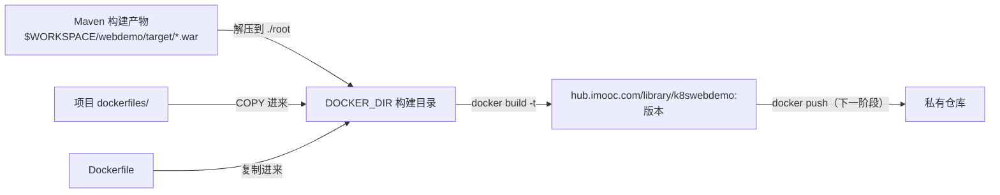

## 纲要

- 代码拉下来、Maven 构建成功之后，下一步是把构建结果做进镜像，这个 stage 叫 build image
- 通用构建脚本放在 `/root/scripts/buildimage.sh`，供整个流水线复用
- 先在 Pipeline 脚本里定义 BUILD_DIR 环境变量作为构建工作目录
- JOB_NAME 与 WORKSPACE 是 Jenkins 自动注入的环境变量，不用自己声明
- 从 $WORKSPACE 下的模块目录到 target 里找 war 包，找不到就直接退出并返回 1
- 解压 war 到构建目录，再把 Dockerfile 与它依赖的文件一起搬过来
- 项目里单开一个 dockerfiles 目录统一放镜像依赖，Dockerfile 里用固定相对路径 COPY
- 镜像 tag 不能写死，要用构建号之类的动态版本号，保证每次构建产物可区分

## 第三个阶段：把构建结果做成镜像

回到脚本编辑，前两个阶段都通过了，接下来该做镜像——把构建结果放进镜像里。这个 stage 就叫 build image，同样用一个脚本去做：脚本放在 `/root/scripts` 下的 `buildimage.sh`，构建 Web 项目的通用脚本。

先保存一下，去机器上看看这个脚本和目录在不在，目录没有就先建一个，然后开始写。

### 先想清楚脚本需要什么

脚本要构建一个镜像，总得有个工作目录放 Dockerfile 和相关文件。这个基础目录最好做成变量，在 Pipeline 脚本里定义一个环境变量 `BUILD_DIR`，比如 `/root/buildworkspace`。定义完，后面所有脚本里都能引用这个变量。

还要定义一个 Docker 构建目录 `DOCKER_DIR`，就指向这个基础目录。另外 `JOB_NAME` 这个环境变量我们并没有定义——有些环境变量是 Jenkins 自带的，像 `JOB_NAME`，大写加下划线的格式，指的就是 Jenkins 最上面那个任务名，这里就是 `k8swebdemo`。

### 目录与产物位置都先判空

拿到工作目录先做两件事：判空、确保存在。如果 `BUILD_DIR` 是空的，打印 `BUILD_DIR is not set` 然后返回 1 退出；如果目录不存在就创建出来。目录没问题就打印一下当前工作目录。

产物要从 Jenkins 的构建结果里取。Jenkins 有个环境变量 `WORKSPACE`，就是当前这个 job 的工作空间，代码就在它下面。代码下面还有一级模块，也就是编译阶段用到的那个 `webdemo`，所以再定义个变量 `MODULE_NAME` 表示模块名，别的地方要用到模块名时直接引用它。

于是源码目录就是 `$WORKSPACE/$MODULE_NAME`。从里面的 `target` 下去找 war 包，先判存不存在：不存在就没必要往下走了，打印 `target war file not exist` 并退出，退出值为 1。

### 组装文件并构建

检查通过就把文件解压到构建目录：进入 `DOCKER_DIR`，把以前的垃圾清掉，然后把 war 解压到当前目录下的 `root`。

接下来还需要一个 Dockerfile，直接把 Dockerfile 挪过来。Dockerfile 依赖的文件也得跟着来，比如绝大多数项目会有的一个启动文件。

这里顺手做个**目录规范化**的改造：原来 Dockerfile 里写的是 `COPY target/xxx.war /root/xxx.war`，但现在文件是解压到跟 `root` 同级的目录，`target` 这个前缀就不合适了。更好的做法是——在项目里单开一个 `dockerfiles` 目录，把所有镜像依赖的文件都放进去，启动文件也放进去，Dockerfile 改成从 `dockerfiles` 里拷，比如 `COPY dockerfiles/start.sh ...`，并且 `COPY root` 而不是带 `target` 前缀。

这么一来，文件多的时候都能归到 `dockerfiles` 里统一管理，项目结构不会显得乱。所有项目都按这个标准来：约定好的目录名 `$DOCKER_DIR/dockerfiles`。

脚本里判断如果这个目录存在，就把这个文件夹挪到构建目录，直接用。

### 镜像 tag 要动态生成

东西备齐就能 `docker build -t` 了。镜像名是 `hub.imooc.com/library/${JOB_NAME}:版本`。

版本怎么写？写死肯定不行——每次构建都打同一个版本，那每次构建出来的东西就分不清了，这不可接受。所以得给它生成一个版本号。



## 完整脚本

```bash
#!/bin/bash

# ---------- 0. 参数与目录准备 ----------
# BUILD_DIR 由 Pipeline 的环境变量注入
if [ -z "${BUILD_DIR}" ]; then
  echo "BUILD_DIR is not set"
  return 1 2>/dev/null || exit 1
fi

# 不存在就创建
if [ ! -d "${BUILD_DIR}" ]; then
  mkdir -p "${BUILD_DIR}"
fi

# Docker 构建目录默认就是基础目录
DOCKER_DIR=${DOCKER_DIR:-${BUILD_DIR}}
MODULE_NAME=${MODULE_NAME:-webdemo}
VERSION=${VERSION:-latest}

echo "docker workspace: ${DOCKER_DIR}"

# ---------- 1. 定位 Jenkins 构建产物 ----------
# WORKSPACE 是 Jenkins 自带变量，指向当前 job 的工作空间
JENKINS_DIR=${WORKSPACE}/${MODULE_NAME}
echo "jenkins dir: ${JENKINS_DIR}"

WAR_FILE=$(ls ${JENKINS_DIR}/target/*.war 2>/dev/null | head -1)
if [ -z "${WAR_FILE}" ]; then
  echo "target war file not exist"
  exit 1
fi
echo "war file: ${WAR_FILE}"

# ---------- 2. 组装镜像上下文 ----------
cd ${DOCKER_DIR} || exit 1
rm -rf ./root
mkdir -p ./root

# 解压 war，内容落到 ./root 下
unzip -q "${WAR_FILE}" -d ./root

# Dockerfile 与依赖文件一起搬进来
cp "${JENKINS_DIR}/Dockerfile" . 2>/dev/null || true

# dockerfiles 目录是约定目录，存在就整体搬过来
if [ -d "${JENKINS_DIR}/dockerfiles" ]; then
  cp -r "${JENKINS_DIR}/dockerfiles" .
fi

ls -l

# ---------- 3. 构建镜像 ----------
IMAGE="hub.imooc.com/library/${JOB_NAME}:${VERSION}"
docker build -t "${IMAGE}" .
echo "image built: ${IMAGE}"
```

这个脚本对同一个流水线里的所有 Web 模块都能复用，差别只在 `MODULE_NAME` 和 `VERSION` 两个变量上。

```text
目录结构对照
├── Jenkins 工作空间（$WORKSPACE）
│   └── webdemo（$MODULE_NAME）
│       ├── Dockerfile（COPY root / dockerfiles/start.sh）
│       ├── dockerfiles（约定目录，镜像依赖统一放这里）
│       │   └── start.sh
│       └── target
│           └── xxx.war（Maven 产物）
└── 构建工作目录（$DOCKER_DIR）
    ├── Dockerfile（从项目复制过来）
    ├── dockerfiles（从项目复制过来）
    ├── root（war 解压后的内容，即镜像里 /root 的原型）
    └── 镜像 tag: hub.imooc.com/library/k8swebdemo:版本
```

## Pipeline 里怎么接上

构建目录和版本号都在 Pipeline 脚本的环境变量里定义，这样脚本与流水线解耦：

```groovy
pipeline {
    agent any

    environment {
        BUILD_DIR = '/root/buildworkspace'
    }

    stages {
        stage('拉取代码') {
            steps {
                git branch: 'main',
                    url: 'https://gitee.com/imooc/imooc-k8sdemo.git'
            }
        }

        stage('Maven 构建') {
            steps {
                sh 'mvn -pl webdemo -nm clean package'
            }
        }

        stage('构建镜像') {
            steps {
                sh 'bash /root/scripts/buildimage.sh'
            }
        }
    }
}
```

## API 速览

| 能力 | 做法 | 要点 |
| --- | --- | --- |
| 构建工作目录 | Pipeline 里定义 BUILD_DIR 环境变量 | 脚本里引用，不写死路径 |
| 任务名 | 用 Jenkins 自带 JOB_NAME | 大写加下划线，自动注入 |
| 工作空间 | 用 Jenkins 自带 WORKSPACE | 代码与产物都在这里 |
| 模块名 | 定义 MODULE_NAME 环境变量 | 多处复用同一变量 |
| 产物校验 | `ls target/*.war` 判空 | 拿不到就退出并返回 1 |
| 解压 | `unzip -q war -d ./root` | 与 Dockerfile 的 COPY 路径对齐 |
| 依赖归置 | 项目内 dockerfiles 目录 | Dockerfile 用相对路径 COPY |
| 镜像 tag | `${JOB_NAME}:${VERSION}` | 版本不能写死，用构建号动态生成 |

## Demo 示例

### 1. 项目侧先做目录规范化

```text
webdemo 模块
├── Dockerfile
├── dockerfiles
│   └── start.sh        （镜像内启动脚本）
└── pom.xml
```

Dockerfile 对应改成相对路径，不再依赖 target 前缀：

```dockerfile
FROM tomcat:9-jdk8-openjdk

COPY root /usr/local/tomcat/webapps/
COPY dockerfiles/start.sh /root/start.sh

ENTRYPOINT ["/root/start.sh"]
```

### 2. 版本号怎么生成

```groovy
pipeline {
    agent any

    environment {
        BUILD_DIR = '/root/buildworkspace'
    }

    stages {
        stage('构建镜像') {
            steps {
                script {
                    // 用构建号做版本，每次构建唯一
                    env.VERSION = "${env.BUILD_NUMBER}"
                }
                sh 'bash /root/scripts/buildimage.sh'
            }
        }
    }
}
```

构建号每次自增，天然满足"每次构建产物可区分"；回滚时直接指定某个构建号的镜像即可。

```bash
# 手动验证同一条命令在本机能跑通
WORKSPACE=/root/.jenkins/workspace/k8swebdemo \
BUILD_DIR=/root/buildworkspace \
JOB_NAME=k8swebdemo \
VERSION=42 \
bash /root/scripts/buildimage.sh
```

### 3. 排障要点

```bash
# 一、构建目录没建出来或变量没传进去，先打印看
echo "BUILD_DIR=$BUILD_DIR WORKSPACE=$WORKSPACE JOB_NAME=$JOB_NAME"

# 二、war 找不到，八成是模块名写错或包名变了
ls $WORKSPACE/webdemo/target/*.war

# 三、构建上下文里少了文件，docker build 会以找不到文件直接失败
ls -l $DOCKER_DIR

# 四、镜像打出来在本地
docker images | grep k8swebdemo

# 五、构建失败时 Jenkins 控制台里能看到脚本的退出码，非零即失败
```

### 总结

镜像构建是流水线的第三个阶段，把 Maven 产物、Dockerfile 和依赖文件在构建目录里组装成一个上下文，再 docker build 出去。

通用脚本放 `/root/scripts/buildimage.sh`，模块名、版本号这类会变的东西走环境变量或 Pipeline 注入，脚本本身保持复用。

BUILD_DIR 是 Pipeline 定义的环境变量，JOB_NAME 和 WORKSPACE 是 Jenkins 自带的，后者直接指向当前任务的工作空间，产物就得从它下面取。

产物校验不能省：war 包找不到就直接打印提示并返回 1，让流水线明确失败，而不是带个残缺上下文去构建。

项目里单开 dockerfiles 目录统一放镜像依赖，Dockerfile 用相对路径 COPY，文件再多也不会把项目结构搞乱。

Dockerfile 里别再写带 target 前缀的路径——解压后的产物已经在 ./root，COPY 的目标路径要与之一一对齐。

镜像 tag 用 `${JOB_NAME}:${VERSION}`，版本取构建号之类的动态值，写死会导致每次构建产物无法区分、也无法回滚。

