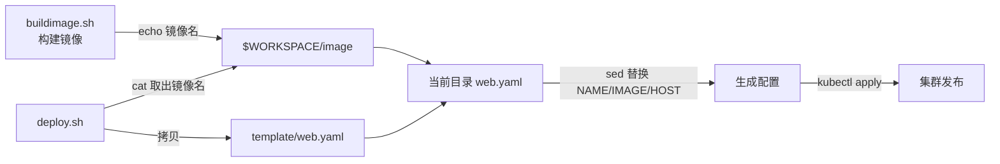

## 纲要

- 版本号按年月日时分秒生成，保证每次构建不重样
- 镜像名抽成 IMAGE 变量，build 与 push 都用它，构建前先打印正在构建
- 三个常见失败：脚本没执行权限、docker build 漏了结尾的点、push 时仓库没登录
- 镜像推上去不等于完事，还要调集群完成发布，这一步由 deploy.sh 承担
- 应用结构一致时可以用同一份配置模板，把差异项抽成变量，每次更新前填值
- 模板文件放 /root/scripts/template 下且不能改动，用 dirname 取脚本目录再拷贝
- NAME 直接取 Jenkins 内置的 JOB_NAME
- 上一个阶段产出的镜像名靠工作空间里的文件传给下一个脚本，实现脚本间通讯
- HOST 在 Pipeline 里定义为环境变量，每个模块给自己的域名

## 先生成不重复的版本号

前面说到版本不能写死。这次按年月日时分秒的格式生成一个版本号，保证不会重复：

```bash
VERSION=${VERSION:-$(date +%Y%m%d%H%M%S)}
```

把版本填进镜像名。构建与推送统一提取成一个变量 `IMAGE`，build 与 push 都用这一个对象，build 之前先打印一行"正在构建镜像"，整个脚本看起来就完整了：

```bash
IMAGE="hub.imooc.com/library/${JOB_NAME}:${VERSION}"

echo "building image: ${IMAGE}"
docker build -t ${IMAGE} .
docker push ${IMAGE}
```

## 三次失败，三个坑

保存、构建：

**第一次失败，permission denied。** 脚本没有执行权限，给它加上：

```bash
chmod +x /root/scripts/buildimage.sh
```

**第二次失败。** 工作目录打出来了，镜像也打出去了，但 `docker build` 报命令错误——命令漏了结尾的那个点。那个点代表构建上下文，不加它 docker 不知道去哪儿找 Dockerfile：

```bash
docker build -t ${IMAGE} .
```

**第三次失败，卡在 push。** push 没有权限，需要先登录私有仓库。把仓库地址复制下来，用户名密码填好，**只在 Jenkins 这台机器上登录一次**就行：

```bash
docker login hub.imooc.com
```

再重试，镜像成功 push 上去，镜像构建这一阶段就算完了。

但还没完事——到现在为止根本没有调用过集群，服务还没有真正更新。

## 发布这一步：先做配置模板

最后一步是用集群把服务发布起来，也就是写一个 `deploy.sh`。

用命令行敲 kubectl apply、create，是通过一个配置文件创建的；更新的时候同样可以通过配置文件。如果应用结构都一样、服务发现也没什么特殊，那确实可以用这种方式更新。

关键在于：需要有一份**配置文件模板**，把每个应用不一样的地方抽成变量，每次更新前把这些变量填进去，就能自动生成一个专属配置文件再更新上去。

模板先找个地方放：在 scripts 下建一个 `template` 目录，里面放一个 `web.yaml`。把之前那次用的配置（Deployment、Service、Ingress 三段）复制过来作为模板，逐个字段看哪些要变成变量：

- **名字**：先写成一个变量 `NAME`，之前配置里所有 `webdemo` 的地方都能替换成它——用脚本批量替换即可
- **镜像名**：每次都不同，起个变量叫 `IMAGE`
- **端口**：8080、Service 的 80 这些不变，每个应用都一样，不用抽
- **域名**：不可能所有应用共用一个域名，起个变量叫 `HOST`

从头看到尾，要改的其实不多：NAME、IMAGE、HOST 三个变量。

## 拿到三个变量的值

第一个，NAME 就是 webdemo，可以直接用 Jenkins 内置的环境变量 `JOB_NAME`。

第二个，IMAGE 是上一阶段 buildimage 构建出来的，构建完并没有告诉任何人，脚本拿不到。解决办法是**用本地文件通讯**：把镜像名 echo 到一个文件里，写到工作空间下，比如 `$WORKSPACE/image`；下一个脚本从这个文件把内容取出来，就拿到镜像名了。

第三个，`HOST` 在 Pipeline 脚本里再定义一个环境变量就行，比如 `HOST=k8sweb.imooc.com`。

三个变量都拿到了，先打印出来核对一遍，再去做替换。

## 模板不能动，只拷贝

模板的原始文件绝对不能就地修改——后面其他模块还要用。所以只是把它拷贝一份到当前构建目录，再在副本上替换：

模板位置就在脚本自己所在目录下的 `template` 里，用 `dirname` 命令取到当前脚本运行的目录，拼上 `template/web.yaml`，拷到当前目录。



```text
/root/scripts 目录结构
├── buildimage.sh          （构建镜像，产出后写 $WORKSPACE/image）
├── deploy.sh              （发布，读 $WORKSPACE/image）
└── template
    └── web.yaml           （模板，占位符 __NAME__ / __IMAGE__ / __HOST__）
        └── 被 deploy.sh 拷贝到构建目录后做替换
```

## 完整脚本

```bash
#!/bin/bash

# ---------- 1. 准备变量 ----------
# NAME 直接取 Jenkins 内置变量
NAME=${JOB_NAME}

# 镜像名从上一个阶段写进工作空间的文件里取出来
IMAGE=$(cat ${WORKSPACE}/image)

# HOST 由 Pipeline 的环境变量注入
HOST=${HOST}

echo "name=$NAME"
echo "image=$IMAGE"
echo "host=$HOST"

# ---------- 2. 拷贝模板 ----------
# 模板不能就地改，拷一份到当前目录再替换
SCRIPT_DIR=$(dirname "$0")
cp "${SCRIPT_DIR}/template/web.yaml" ./web.yaml

# ---------- 3. 替换变量 ----------
sed -i "s|__NAME__|${NAME}|g"  ./web.yaml
sed -i "s|__IMAGE__|${IMAGE}|g" ./web.yaml
sed -i "s|__HOST__|${HOST}|g"   ./web.yaml

cat ./web.yaml

# ---------- 4. 发布 ----------
kubectl apply -f ./web.yaml
```

模板长这样，只有三处占位符：

```yaml
apiVersion: apps/v1
kind: Deployment
metadata:
  name: __NAME__
  namespace: default
spec:
  replicas: 1
  selector:
    matchLabels:
      app: __NAME__
  template:
    metadata:
      labels:
        app: __NAME__
    spec:
      containers:
        - name: __NAME__
          image: __IMAGE__
          ports:
            - containerPort: 8080
---
apiVersion: v1
kind: Service
metadata:
  name: __NAME__
  namespace: default
spec:
  type: NodePort
  selector:
    app: __NAME__
  ports:
    - port: 80
      targetPort: 8080
---
apiVersion: networking.k8s.io/v1
kind: Ingress
metadata:
  name: __NAME__
  namespace: default
spec:
  ingressClassName: nginx
  rules:
    - host: __HOST__
      http:
        paths:
          - path: /
            pathType: Prefix
            backend:
              service:
                name: __NAME__
                port:
                  number: 80
```

buildimage.sh 末尾把镜像名落盘：

```bash
IMAGE="hub.imooc.com/library/${JOB_NAME}:${VERSION}"
echo "building image: ${IMAGE}"
docker build -t ${IMAGE} .
docker push ${IMAGE}
echo "${IMAGE}" > ${WORKSPACE}/image
```

Pipeline 补上 HOST 环境变量：

```groovy
pipeline {
    agent any

    environment {
        BUILD_DIR = '/root/buildworkspace'
        HOST      = 'k8sweb.imooc.com'
    }

    stages {
        stage('拉取代码') {
            steps {
                git branch: 'main',
                    url: 'https://gitee.com/imooc/imooc-k8sdemo.git'
            }
        }
        stage('Maven 构建') {
            steps {
                sh 'mvn -pl webdemo -nm clean package'
            }
        }
        stage('构建镜像') {
            steps {
                sh 'bash /root/scripts/buildimage.sh'
            }
        }
        stage('推送并发布') {
            steps {
                sh 'bash /root/scripts/deploy.sh'
            }
        }
    }
}
```

## API 速览

| 能力 | 做法 | 要点 |
| --- | --- | --- |
| 动态版本 | `date +%Y%m%d%H%M%S` | 每次构建唯一，可回滚 |
| 镜像名复用 | IMAGE 变量 | build 与 push 用同一个对象 |
| 执行权限 | chmod +x | 否 Permission denied |
| 构建上下文 | `docker build -t x .` | 结尾的点不能漏 |
| 私有仓库 | docker login | 只需在流水线机器上登录一次 |
| 任务名取用 | JOB_NAME | Jenkins 内置，直接当 NAME |
| 脚本间传参 | 工作空间下写文件 | 上阶段落盘，下阶段 cat 出来 |
| 配置模板 | template/web.yaml + dirname 拷贝 | 原始模板不动，只改副本 |
| 变量注入 | 变量替换 Pipeline 的 env | HOST 这类按模块区分的放这里 |

## Demo 示例

### 1. 从构建到发布的完整编排

```groovy
pipeline {
    agent any

    environment {
        BUILD_DIR = '/root/buildworkspace'
        HOST      = 'k8sweb.imooc.com'
    }

    stages {
        stage('拉取代码') {
            steps {
                git branch: 'main',
                    url: 'https://gitee.com/imooc/imooc-k8sdemo.git'
            }
        }
        stage('Maven 构建') {
            steps { sh 'mvn -pl webdemo -nm clean package' }
        }
        stage('构建镜像') {
            steps { sh 'bash /root/scripts/buildimage.sh' }
        }
        stage('推送并发布') {
            steps { sh 'bash /root/scripts/deploy.sh' }
        }
    }
}
```

### 2. 本地跑一遍验证

```bash
# 先登录私有仓库
docker login hub.imooc.com

# 手动喂一遍变量，避免每次都走完整流水线
WORKSPACE=/root/.jenkins/workspace/k8swebdemo \
JOB_NAME=k8swebdemo \
HOST=k8sweb.imooc.com \
bash /root/scripts/deploy.sh
```

### 3. 发布后确认

```bash
kubectl get deploy,svc,ingress
kubectl get pod -l app=k8swebdemo -o wide
kubectl describe ingress | grep -A3 Rules
kubectl logs -l app=k8swebdemo --tail=30
```

### 4. 排障清单

```bash
# 一、镜像名没传给 deploy，先看文件有没有写进去
cat $WORKSPACE/image

# 二、kubectl apply 报 already exists，不重名就用 apply，避免 create 失败
kubectl apply -f ./web.yaml

# 三、模板占位符没替换干净，直接看生成后的文件
grep -n "__" ./web.yaml

# 四、域名没生效，确认 Ingress 的 host 与客户端 Host 头一致
curl -s -o /dev/null -w "%{http_code}\n" http://192.155.20.120/ -H "Host: k8sweb.imooc.com"

# 五、部署后副本没起来，看事件与探针
kubectl describe pod -l app=k8swebdemo | tail -20
```

### 总结

版本号按年月日时分秒生成，镜像名抽成 IMAGE 变量贯穿 build 与 push，构建前打印提示，让流水线日志可读。

三类高频失败分别是：脚本没加执行权限、docker build 结尾漏了上下文那个点、push 前没登录私有仓库。

镜像推上去只是到仓库为止，真正让服务更新的是 deploy.sh，它会把配置模板渲染成当前应用的配置再提交给集群。

配置模板把差异项抽成变量：NAME、IMAGE、HOST 三处替换即可，端口这类各应用一致的部分保持常量。

NAME 直接用 Jenkins 内置环境变量 JOB_NAME，省掉一次人工传参。

上阶段产出的镜像名通过工作空间里的 image 文件传给下阶段，这是流水线里脚本之间最简单的通讯方式。

模板文件只拷贝不改动，用 dirname 定位脚本所在目录再拼 template 路径，保证其他模块复用同一份模板。

