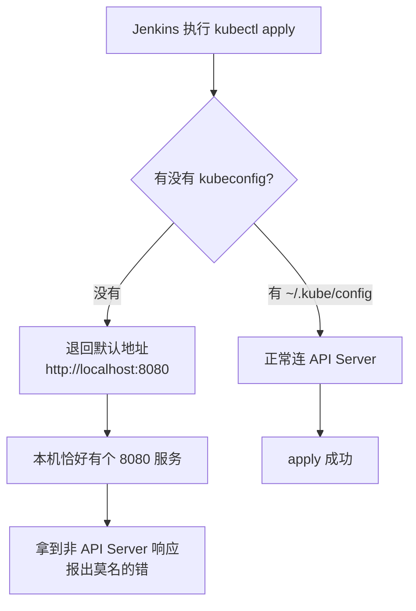
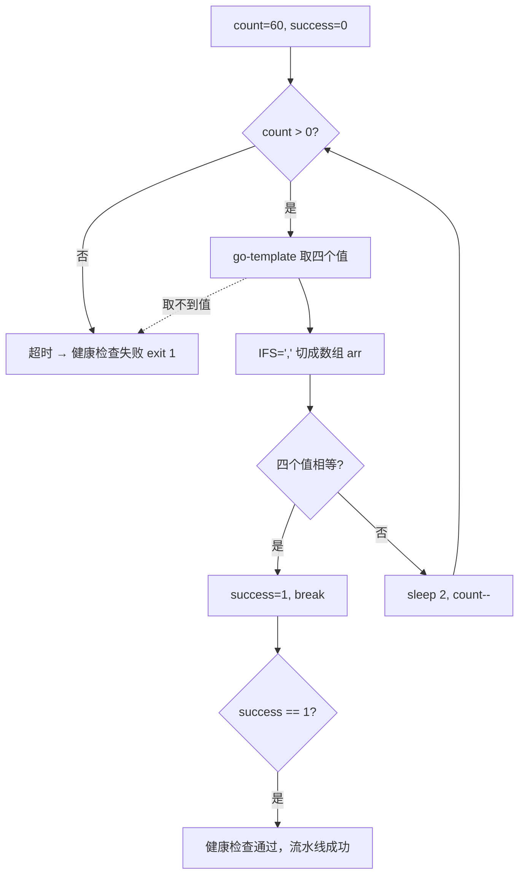

# Kubernetes 生产实践: CI/CD 实践（4）—— kubectl 配置踩坑与发布后的健康检查脚本

上一篇把 `deploy.sh` 的骨架搭出来了：拷贝模板、替换 NAME/IMAGE/HOST、`kubectl apply`。这一节把它跑通并补上最后一块短板。

结论先给：**`kubectl apply` 返回成功只代表"清单被 API Server 收下了"，不代表新服务已经能对外提供服务。** 真正可靠的流水线必须在 apply 之后做一次健康检查：Deployment 的 `replicas` / `updatedReplicas` / `readyReplicas` / `availableReplicas` 四个值全部相等才算部署完成。另外 Jenkins 机器上如果没配 kubeconfig，`kubectl` 会默认去连本机 8080，报一个看起来完全不相关的错。

## 纲要

- 拷贝模板前先删掉当前目录的同名文件，避免旧配置残留
- 三段 `sed` 替换 NAME / IMAGE / HOST，apply 前先 cat 出来核对
- kubectl 没配 kubeconfig 时默认连本地 8080，返回的是本机服务的响应
- 把 `~/.kube/config` 放到 Jenkins 机器上，流水线才能真正操作集群
- 验收标准：Deployment 的镜像版本与新构建的版本一致
- 四个副本数字段全部相等才算健康
- 用 `-o go-template` 一次取出四个字段，逗号分隔
- 循环 60 次、每次 sleep 2 秒，超时即失败退出
- shell 里 `IFS=','` 才能把逗号串切成数组逐个比较
- apply 后立刻取状态可能取到更新前的旧值
- 更靠谱的做法：比对 `metadata.annotations` 里的 `deployment.kubernetes.io/revision`

## 拷贝模板之前先删干净

脚本所在目录下的 `template/web.yaml` 要拷到当前目录。如果当前目录已经存在同名文件，直接 copy 会被旧的覆盖不干净，所以先删再拷：

```bash
rm -f ./web.yaml
cp "${SCRIPT_DIR}/template/web.yaml" ./web.yaml
```

## 三段替换与 apply

替换逻辑与上一篇一致，三个占位符分别换成 NAME、IMAGE、HOST，apply 之前先把结果打印出来，方便从 Jenkins 控制台直接核对这一次生成的配置对不对：

```bash
sed -i "s|__NAME__|${NAME}|g"  ./web.yaml
sed -i "s|__IMAGE__|${IMAGE}|g" ./web.yaml
sed -i "s|__HOST__|${HOST}|g"   ./web.yaml

cat ./web.yaml

kubectl apply -f ./web.yaml
```

## 第一次跑：一个莫名其妙的异常

保存脚本、触发构建，拉代码、Maven 构建、打镜像、push 镜像一路通过，deploy 阶段却抛异常。从日志看变量都没问题：

```text
name=k8swebdemo
image=hub.imooc.com/library/k8swebdemo:20261005110432
host=k8sweb.imooc.com
copy success
ready to apply
error: ...
```

打印点已经定位到 **apply 这一步**。手动执行同一条命令试试：

```bash
kubectl get deploy
kubectl get pod
```

返回了一个完全不像 kubectl 报的错误。原因很快就清楚了：**这台 Jenkins 机器上没有配置 kubectl 的认证文件**。

`kubectl` 在找不到 kubeconfig 时，会退回到默认行为：**访问 `http://localhost:8080`**。而本机恰好起了一个监听 8080 的服务，于是 kubectl 把这个本机的 8080 当成了 API Server 的 8080，拿到的是本机服务返回的响应，自然解析不出 Deployment 列表。



## 修复：把 kubeconfig 放到能读到的位置

把集群的 `config` 文件复制到 Jenkins 这台机器上，放进 kubectl 默认读取的路径：

```bash
mkdir -p /root/.kube
cp config /root/.kube/config
kubectl get node
```

重新构建一次，推镜像、发布全部通过，异常消失。

```text
/root/.kube/
└── config          API Server 地址 + 证书 + 用户凭据（从 master 节点拷过来）
```

> `kubectl` 读取配置的优先级：`--kubeconfig` 参数 > `$KUBECONFIG` 环境变量 > `~/.kube/config`。Jenkins 的 slave 是以某个系统用户跑脚本的，**这个用户对不对得上 HOME 目录**，是这类问题排查时的第一件事。

## 验收：镜像版本确实更新了

发布完了要证明它真的生效。本次构建出的版本号是 `20261005110432`，去集群里查这个 Deployment 用的镜像：

```bash
kubectl get deploy k8swebdemo -o wide
kubectl get deploy k8swebdemo -o jsonpath='{.spec.template.spec.containers[0].image}'
```

```text
hub.imooc.com/library/k8swebdemo:20261005110432
```

**版本对得上，说明整条流水线是真的把新镜像送进集群了。** 到这里流程才算基本走通。

## 但还有一件事没做：健康检查

`apply` 执行成功只能说明 API Server 收下了清单，**不能保证新的服务可以正常对外提供服务**。所以还要把健康检查的过程加进 `deploy.sh`。

先明确"什么是健康"：

| Deployment 的 status 字段 | 含义 |
| --- | --- |
| `replicas` | 期望的副本数（也就是 `spec.replicas`） |
| `updatedReplicas` | 已经更新到新版本模板的副本数 |
| `readyReplicas` | 已经通过就绪探针的副本数 |
| `availableReplicas` | 已经可用（超过 `minReadySeconds`）的副本数 |

**当这四个值全部相等时才认为应用处于健康状态。** 只要有一个对不上，说明还有副本卡在旧版本、或者还没通过就绪探针。

用 `-o go-template` 一次性把这四个字段取出来，逗号分隔：

```bash
kubectl get deploy k8swebdemo -o go-template='{{.status.replicas}},{{.status.updatedReplicas}},{{.status.readyReplicas}},{{.status.availableReplicas}}'
```

```text
1,1,1,1
```

## 循环检查的实现

更新是需要时间的，不可能 apply 完立刻就全部就绪。所以需要一个循环：**最多检查 60 次，每 2 秒一次，超时就判失败。**



完整脚本：

```bash
#!/usr/bin/env bash

# ---------- 健康检查 ----------
COUNT=60
SUCCESS=0

while [ ${COUNT} -gt 0 ]; do
    # 一次取出四个副本数字段，逗号分隔
    REPLICAS=$(kubectl get deploy "${NAME}" \
        -o go-template='{{.status.replicas}},{{.status.updatedReplicas}},{{.status.readyReplicas}},{{.status.availableReplicas}}')

    echo "replicas=${REPLICAS}"

    # 逗号分隔转换成数组
    IFS=','
    ARR=(${REPLICAS})
    unset IFS

    if [ ${ARR[0]} -eq ${ARR[1]} ] && [ ${ARR[1]} -eq ${ARR[2]} ] && [ ${ARR[2]} -eq ${ARR[3]} ]; then
        echo "health check success"
        SUCCESS=1
        break
    fi

    sleep 2
    COUNT=$((COUNT - 1))
done

if [ ${SUCCESS} -ne 1 ]; then
    echo "health check failed"
    exit 1
fi
```

两个容易忽略的点：

- **`IFS=','`** —— shell 默认按空白切串，不设 `IFS` 就没法把逗号串变成数组；
- **成功标记 `SUCCESS`** —— 循环走完却不代表成功，退出前必须判断一次标记位，失败要 `exit 1`，否则 Jenkins 会误报构建成功。

## apply 之后立刻检查，其实是有坑的

上面的循环是在 `apply` 之后立刻开始的。**指令刚传给 API Server，转头就再去取 Deployment 的信息，这时候取到的很可能是更新之前的旧值** —— 四个值恰好相等，于是脚本认为检查通过，实际上部署根本还没开始。

两种解法：

| 方式 | 做法 | 评价 |
| --- | --- | --- |
| 简单 | apply 之后先 `sleep 5` 再开始检查 | 快，但只是"等一个大概够用的时间" |
| 靠谱 | 比对 `deployment.kubernetes.io/revision` 注解 | 精确，版本号变化说明更新确实发生了 |

第二种才是万无一失的：Deployment 的 `metadata.annotations` 里有一条 `deployment.kubernetes.io/revision`，**每进行一次更新，这个值就会加一**。在开始之前取一次，apply 之后再取一次，比对两者是否发生变化，确认变化后再做健康检查：

```bash
REV_BEFORE=$(kubectl get deploy "${NAME}" \
    -o go-template='{{index .metadata.annotations "deployment.kubernetes.io/revision"}}')

kubectl apply -f ./web.yaml

REV_AFTER=$(kubectl get deploy "${NAME}" \
    -o go-template='{{index .metadata.annotations "deployment.kubernetes.io/revision"}}')

echo "revision: ${REV_BEFORE} -> ${REV_AFTER}"
```

```text
/root/scripts
├── buildimage.sh                构建并推送镜像，产出写进 $WORKSPACE/image
├── deploy.sh                    拷贝模板 + 替换 + apply + 健康检查
└── template
    └── web.yaml                 占位符 __NAME__ / __IMAGE__ / __HOST__
```

## 跑通之后的完整日志

重新构建一次，deploy 阶段开始后每 2 秒打印一行 replicas，很快四个值就全部相等：

```text
copy success
ready to apply
deployment.apps/k8swebdemo configured
replicas=1,1,1,0
replicas=1,1,1,1
health check success
Finished: SUCCESS
```

## API 速览

| 能力 | API / 命令 | 要点 |
| --- | --- | --- |
| 取 Deployment 副本数 | `-o go-template='{{.status.replicas}}'` | 四个 status 字段一次取全 |
| 取镜像版本 | `-o jsonpath='{.spec.template.spec.containers[0].image}'` | 验收新镜像是否生效 |
| 取 revision 注解 | `go-template` + `index .metadata.annotations "..."` | 注解 key 带斜杠必须走 index |
| 脚本内切分 goes 串 | `IFS=','` + 数组赋值 | 用完 `unset IFS` 还原 |
| 超时控制 | COUNT 循环 + `sleep 2` | 60 次 × 2 秒 = 最多 2 分钟 |
| 失败退出 | `exit 1` | 非零退出码 Jenkins 才会标红 |
| kubeconfig 路径 | `~/.kube/config` | 优先级 `--kubeconfig` > `$KUBECONFIG` > 默认 |
| 部署前的 kubectl 常错 | 默认连 localhost:8080 | 本机有服务时会报看不懂的错 |

## Demo 示例

### 1. deploy.sh 完整版

```bash
#!/usr/bin/env bash
set -e

NAME=${JOB_NAME}
IMAGE=$(cat "${WORKSPACE}/image")
HOST=${HOST}

echo "name=${NAME}"
echo "image=${IMAGE}"
echo "host=${HOST}"

SCRIPT_DIR=$(dirname "$0")
rm -f ./web.yaml
cp "${SCRIPT_DIR}/template/web.yaml" ./web.yaml

sed -i "s|__NAME__|${NAME}|g"  ./web.yaml
sed -i "s|__IMAGE__|${IMAGE}|g" ./web.yaml
sed -i "s|__HOST__|${HOST}|g"   ./web.yaml

cat ./web.yaml
kubectl apply -f ./web.yaml

# ---------- 健康检查 ----------
COUNT=60
SUCCESS=0

while [ ${COUNT} -gt 0 ]; do
    REPLICAS=$(kubectl get deploy "${NAME}" \
        -o go-template='{{.status.replicas}},{{.status.updatedReplicas}},{{.status.readyReplicas}},{{.status.availableReplicas}}')
    echo "replicas=${REPLICAS}"

    IFS=','
    ARR=(${REPLICAS})
    unset IFS

    if [ ${ARR[0]} -eq ${ARR[1]} ] && [ ${ARR[1]} -eq ${ARR[2]} ] && [ ${ARR[2]} -eq ${ARR[3]} ]; then
        echo "health check success"
        SUCCESS=1
        break
    fi

    sleep 2
    COUNT=$((COUNT - 1))
done

if [ ${SUCCESS} -ne 1 ]; then
    echo "health check failed"
    exit 1
fi
```

### 2. 本机验证一遍健康检查逻辑

```bash
NAME=k8swebdemo

# 单独看四个字段
kubectl get deploy ${NAME} \
  -o go-template='{{.status.replicas}},{{.status.updatedReplicas}},{{.status.readyReplicas}},{{.status.availableReplicas}}'

# 看 revision 有没有变
kubectl get deploy ${NAME} \
  -o go-template='{{index .metadata.annotations "deployment.kubernetes.io/revision"}}'
```

### 3. 排障清单

```bash
# 一、kubectl 报看不懂的错，先确认它连的是谁
kubectl config view --minify | grep server

# 二、确认 kubeconfig 真的被读到了
ls -l /root/.kube/config
kubectl get node

# 三、四个值一直不相等，看哪个副本卡住了
kubectl get pod -l app=k8swebdemo -o wide
kubectl describe deploy k8swebdemo | tail -20

# 四、go-template 写错语法会原样输出模板串，单独跑一次确认
kubectl get deploy k8swebdemo -o go-template='{{.status.readyReplicas}}'

# 五、镜像版本没变，说明 __IMAGE__ 占位符没被替换掉
grep -n "image:" ./web.yaml
```

### 总结

`kubectl apply` 成功只代表清单被接收，**不代表新服务可用**，所以流水线必须在发布之后补一次健康检查。

健康判据是 Deployment 的 `replicas`、`updatedReplicas`、`readyReplicas`、`availableReplicas` 四个值全部相等，可以用一条 `-o go-template` 一次取全。

更新有耗时，要用「循环 + `sleep 2` + 最多 60 次」的超时机制，并且用 `SUCCESS` 标记位在循环结束后判成败，失败必须 `exit 1`。

shell 里默认按空白切串，逗号串要变数组必须先 `IFS=','`，用完 `unset IFS` 还原。

apply 之后立刻取状态会取到更新前的旧值，简单做法是 `sleep 5`，更靠谱的是比对 `deployment.kubernetes.io/revision` 注解，它每次更新都会加一。

Jenkins 机器上没配 kubeconfig 时，`kubectl` 会默认连 `http://localhost:8080`，如果本机恰好有服务占着 8080，就会报出一个完全不相干的错——这是本节最耗时间的一个坑。

