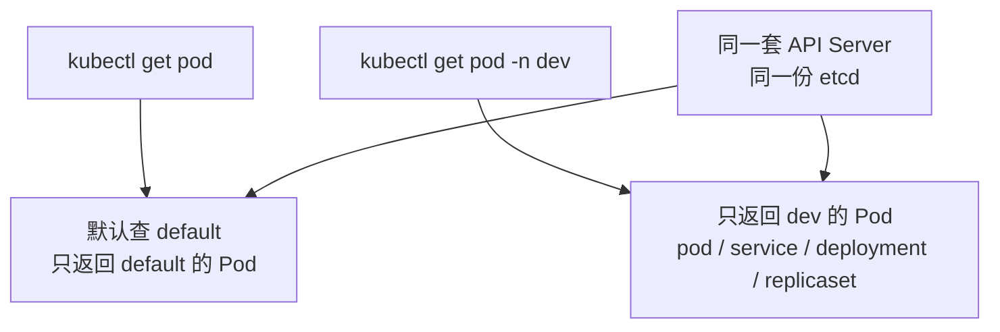
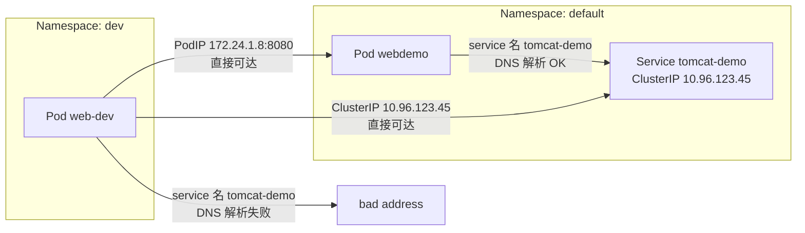
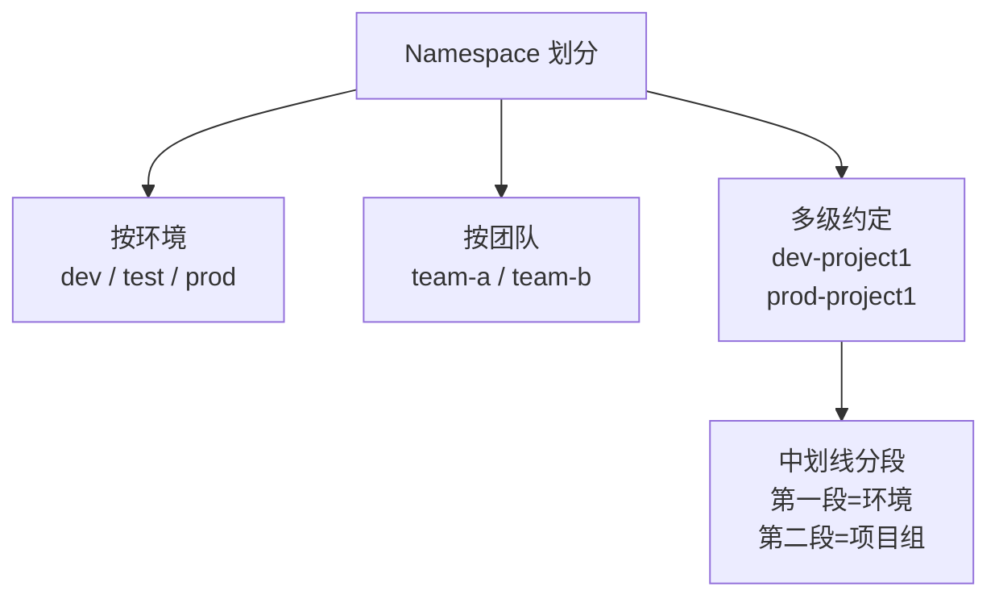

# Kubernetes 生产实践: Namespace —— 集群的共享与隔离，以及 service IP 为什么跨命名空间还能通

集群搭起来了、服务迁上去了、CI/CD 也跑通了，但要把 Kubernetes 用好，这些才刚开始。这一节拆第一个重要概念：**Namespace（命名空间）**。

结论先给：**Namespace 的核心是隔离，而且是对"名字"的隔离，不是网络上的物理隔离。** 同一个 Namespace 里能通过服务名互相访问；跨 Namespace 服务名解析不到（`resolv.conf` 的 search 域不一样），但**直接拿 ClusterIP 或 PodIP 访问是通的**。此外它的另一半能力是资源配额隔离（CPU / 内存），那部分放在 Resource 一节细讲。

## 纲要

- Namespace 的核心作用是隔离，分资源对象隔离与资源配额隔离两类
- 集群启动即自带 `default`，不指定就落在这里
- 建 Namespace：`kubectl create namespace dev` 或直接 apply 一份清单
- 资源清单里加一行 `metadata.namespace` 就指定了归属
- 不加 `-n` 只看得见 `default`，隔离性肉眼可见
- 同一 Namespace 内：服务名可解析、可访问
- 跨 Namespace：服务名解析失败，但 ClusterIP 仍然通
- PodIP 同样与 Namespace 无关，直接访问也通
- 所以 Namespace 的隔离是**名字的隔离**，这是刻意设计的灵活性
- 每次敲 `-n dev` 太累？用 kubeconfig 的 **context 绑定命名空间**
- 真正的权限收敛要从**用户 + RBAC** 做起，不能只靠 context
- 划分方式：按环境、按团队、按团队多层级时用中划线串起来

## 两类隔离

Namespace 的字面意思在 Java 的 package、C++ 的 namespace 里都见过，**作用完全一致：隔离。**

在 Kubernetes 里可以分成两部分看：

| 隔离类型 | 隔离什么 | 例子 |
| --- | --- | --- |
| 资源对象隔离 | Service / Deployment / Pod 这些对象被分组，组与组之间**感知不到对方的存在** | `kubectl get pod` 只看得到当前命名空间的 Pod |
| 资源配额隔离 | CPU、内存等资源的使用上限 | 限制某个 Namespace 总共能用多少 CPU/内存；也可以限制每个 Pod 最多申请 2G 内存 |

配额这部分的细节留给下一节的 Resource 去讲，这一节先把第一种隔离摸清楚。

## 集群自带的 default 命名空间

Kubernetes 集群启动后会自动创建一个名为 `default` 的命名空间：

```bash
kubectl get namespaces
```

```text
NAME              STATUS   AGE
default           Active   12d
kube-node-lease   Active   12d
kube-public       Active   12d
kube-system       Active   12d
```

不指定命名空间时，创建的 Deployment / Service / Pod 全部落在 `default` 里。下面两条命令结果完全一样：

```bash
kubectl get pod
kubectl get pod -n default
```

## 创建自己的 Namespace

Namespace 本身也是 Kubernetes 的一种资源，同样用配置文件描述：

```yaml
apiVersion: v1
kind: Namespace
metadata:
  name: dev
```

复制到 master 节点上创建：

```bash
kubectl create -f namespace-dev.yaml
kubectl get namespaces
```

```text
NAME              STATUS   AGE
default           Active   12d
dev               Active   3s
```

## 在指定 Namespace 里建一套服务

准备一份 `web-dev.yaml`，内容和之前的 `webdemo` 几乎一模一样，**唯一区别是每个资源的 `metadata` 里都加了 `namespace: dev`**，Ingress 的 `host` 也换成了 `web-dev`：

```yaml
apiVersion: apps/v1
kind: Deployment
metadata:
  name: web-dev
  namespace: dev
spec:
  replicas: 1
  selector:
    matchLabels:
      app: web-dev
  template:
    metadata:
      labels:
        app: web-dev
    spec:
      containers:
        - name: springboot-web
          image: springboot-web:v1
          ports:
            - containerPort: 8080
---
apiVersion: v1
kind: Service
metadata:
  name: web-dev
  namespace: dev
spec:
  type: NodePort
  selector:
    app: web-dev
  ports:
    - port: 80
      targetPort: 8080
---
apiVersion: networking.k8s.io/v1
kind: Ingress
metadata:
  name: web-dev
  namespace: dev
spec:
  ingressClassName: nginx
  rules:
    - host: web-dev.imooc.com
      http:
        paths:
          - path: /
            pathType: Prefix
            backend:
              service:
                name: web-dev
                port:
                  number: 80
```

```text
namespace-dev/
├── namespace-dev.yaml   Namespace 定义，name: dev
└── web-dev.yaml         Deployment + Service + Ingress
                         每段 metadata 都带 namespace: dev
                         Ingress 的 host 改成 web-dev.imooc.com
```

创建之后直接 `kubectl get pod`：**什么都看不到**，看到的还是 `default` 里的那些。

```bash
kubectl create -f web-dev.yaml
kubectl get pod              # 看不到 dev 里的 Pod
kubectl get pod -n dev       # 只有 dev 里的这一个
kubectl get all -n dev       # dev 下所有资源
```



`kubectl get all -n dev` 会把 dev 下的 Deployment、Pod、Service、ReplicaSet 都列出来 —— **ReplicaSet 是隐藏在 Deployment 下面的一层概念，平时不用特别关注。**

隔离性已经很明显了：**不加 `-n` 看到的是 default；加了 `-n dev` 才看得到 dev，而且只看得到 dev。**

## 隔离性到底有多彻底？

上面只是"看不见"，真正的服务之间能不能互访才关键。四种情况逐一验证：

| 场景 | 结果 | 原因 |
| --- | --- | --- |
| 同 Namespace，用 service 名 | 通 | 同 search 域，DNS 可解析 |
| 跨 Namespace，用 service 名 | **不通** | search 域不同，解析不到 |
| 跨 Namespace，用 ClusterIP | **通** | ClusterIP 是集群内真实可达的地址 |
| 跨 Namespace，用 PodIP + 端口 | **通** | PodIP 同样是集群内真实可达的地址 |

### 同一 Namespace 下：服务名可解析

在 `default` 的 Pod 里访问同命名空间的服务 `tomcat-demo`：

```bash
kubectl exec -it webdemo-xxx -- sh

ping tomcat-demo
wget tomcat-demo
```

DNS 能正常解析到 ClusterIP，`wget` 也能正常下载回响应，没有问题。

### 跨 Namespace：服务名解析失败

进到 `dev` 命名空间下的 Pod。**注意 `kubectl exec` 访问 dev 的 Pod 也必须带 `-n dev`**，否则它会在 default 里找这个 Pod，直接 `pod not found`：

```bash
POD_DEV=$(kubectl get pod -n dev -l app=web-dev -o jsonpath='{.items[0].metadata.name}')

kubectl exec -it "$POD_DEV" -- sh         # Error from server (NotFound): pods not found
kubectl exec -it "$POD_DEV" -n dev -- sh  # 正确：跨 ns 必须带 -n
```

进去之后再 ping `tomcat-demo`（它在 default 下）：

```bash
ping tomcat-demo
# ping: bad address 'tomcat-demo'
```

**解析不到。** 看一眼 Pod 里的 DNS 配置就明白了：

```bash
cat /etc/resolv.conf
```

```text
nameserver 10.96.0.10
search dev.svc.cluster.local svc.cluster.local cluster.local
options ndots:5
```

**在 `default` 命名空间下，search 域是 `default.svc.cluster.local`；在 `dev` 下就是 `dev.svc.cluster.local`。** 搜索范围不一样，所以名字上天然隔离 —— 这就是 Kubernetes 实现 Namespace 隔离的关键手段之一。

### 但 ClusterIP 照样通

在 `default` 下拿到 `tomcat-demo` 的 ClusterIP：

```bash
kubectl get service
# tomcat-demo   ClusterIP   10.96.123.45
```

回到 `dev` 的 Pod 里，直接用 IP 访问：

```bash
wget 10.96.123.45
```

**能正常下载。ClusterIP 的访问与命名空间无关**，Namespace 并不会拦 IP 层的流量。

### PodIP 也一样

```bash
kubectl get pod -o wide
# tomcat-demo-xxx   172.24.1.8
```

在 dev 的 Pod 里访问 PodIP + 容器端口：

```bash
wget 172.24.1.8:8080
```

同样通。**PodIP 与 ServiceIP 一样，都是集群内可达地址，与 Namespace 无关。**



**结论：Namespace 的隔离是对名字的隔离，并不是物理的网络隔离。** 这种设计非常灵活 —— 想让两个命名空间的服务互通，直接用 IP（或者跨命名空间的 FQDN `svc.ns.svc.cluster.local`）访问即可。

## 不想每次敲 `-n dev`：用 context 绑定命名空间

如果某个开发人员只有 dev 的权限，每次都要带 `-n dev` 挺烦的。有没有办法让他在执行时不带参数、而且只能看到 dev 的资源？

**有 —— kubeconfig 里的 context 可以指定命名空间。**

回忆一下搭建集群时生成 `kubectl config` 的步骤，里面有 `set-context` 和 `use-context` 两步。**在 set-context 时指定 `--namespace`，这个上下文就属于该命名空间**；之后 `use-context` 切换过去即可。

先备份配置，再动手：

```bash
cp /root/.kube/config /root/.kube/config.bak
```

设置带命名空间的上下文（user 沿用现有配置，只多加 `--namespace`）：

```bash
kubectl config set-context ctx-dev \
  --cluster=kubernetes \
  --user=admin \
  --namespace=dev \
  --kubeconfig=/root/.kube/config
```

切换到它：

```bash
kubectl config use-context ctx-dev
```

验证：

```bash
kubectl get pod
```

**现在只剩一个 Pod，就是 dev 下的那个** —— 跟之前敲 `kubectl get pod -n dev` 的结果一模一样。通过上下文的设置，当前用户完全"沉浸"在了 dev 命名空间里。

```text
/root/.kube/
├── config          当前生效配置（含 clusters / users / contexts / current-context）
├── config.bak      改动前的备份，出问题能回滚
└── contexts
    └── ctx-dev     cluster=kubernetes, user=admin, namespace=dev
```

> **context 只是省事的默认命名空间，不是权限边界。** 上例用的还是 `admin` 用户，它能看全集群的东西。真要做到"dev 用户看不见其他 Namespace"，**必须从用户开始：为每个 Namespace 建独立用户，再配对应的 RBAC 授权**。这部分工作不算困难但量不小，本节点到为止。

## Namespace 怎么划分

常见的三种方式：

| 划分维度 | 例子 | 适用 |
| --- | --- | --- |
| 按环境 | `dev` / `test` / `prod` | 开发人员可在 dev 随意发布，test 由 QA 操作 |
| 按团队/项目组 | `team-a` / `team-b` | 每个团队有自己的空间和资源，空间内随意操作 |
| 多级（团队 + 环境） | `dev-project1` / `prod-project1` | Namespace 本身是扁平字符串，靠约定格式模拟层级 |

前两种都是单维度的划分。Namespace 本身只是一个字符串，**没有父子关系、没有继承概念**，所以当某个 Namespace 下服务多到需要再细分时，可以在命名上做文章：**用中划线分段，第一段表示环境（dev/test/prod），第二段表示项目组**，以此支持多级划分。



## API 速览

| 能力 | API / 命令 | 要点 |
| --- | --- | --- |
| 列出命名空间 | `kubectl get namespaces`（缩写 `ns`） | 集群自带 default / kube-system 等 |
| 创建命名空间 | `kubectl create namespace dev` | 也可以 apply 一份 `kind: Namespace` 清单 |
| 指定归属 | `metadata.namespace: dev` | Deployment / Service / Ingress 每段都要写 |
| 查看指定空间资源 | `kubectl get pod -n dev` | 不加 `-n` 只看 default |
| 查看某空间全部资源 | `kubectl get all -n dev` | 含 Deployment / RS / Pod / Service |
| 进容器 | `kubectl exec -it POD -n dev -- sh` | **跨 ns 的 Pod 必须带 `-n`**，否则 NotFound |
| 看 DNS 配置 | `cat /etc/resolv.conf` | search 域 = `<ns>.svc.cluster.local` |
| 跨 ns 全域名访问 | `service.ns.svc.cluster.local` | 名字隔离下互通的标准做法 |
| 绑定默认 ns | `kubectl config set-context ... --namespace=dev` | 先备份 `~/.kube/config` |
| 切换上下文 | `kubectl config use-context ctx-dev` | 只改默认值，不改权限 |

## Demo 示例

### 1. 完整走一遍 Namespace

```bash
#!/usr/bin/env bash
set -e

# 1. 创建命名空间
kubectl create -f namespace-dev.yaml
kubectl get ns

# 2. 在 dev 里建整套服务
kubectl create -f web-dev.yaml

# 3. 体验隔离：不加 -n 看不见
echo "--- default ---"
kubectl get pod
echo "--- dev ---"
kubectl get pod -n dev
kubectl get all -n dev
```

### 2. 四种互访场景实测

```bash
# 场景一：同一命名空间，服务名可解析
kubectl exec -it webdemo-xxxxx -- sh -c 'ping -c 1 tomcat-demo'

# 场景二：跨命名空间，服务名解析失败（注意 exec 要带 -n dev）
kubectl exec -it web-dev-xxxxx -n dev -- sh -c 'ping -c 1 tomcat-demo'

# 场景三：跨命名空间，ClusterIP 可访问
SVC_IP=$(kubectl get svc tomcat-demo -o jsonpath='{.spec.clusterIP}')
kubectl exec -it web-dev-xxxxx -n dev -- sh -c "wget -qO- ${SVC_IP}"

# 场景四：跨命名空间，PodIP + 端口可访问
POD_IP=$(kubectl get pod -l app=tomcat-demo -o jsonpath='{.items[0].status.podIP}')
kubectl exec -it web-dev-xxxxx -n dev -- sh -c "wget -qO- ${POD_IP}:8080"
```

### 3. 把默认命名空间固定在 dev

```bash
cp /root/.kube/config /root/.kube/config.bak

kubectl config set-context ctx-dev \
  --cluster=kubernetes \
  --user=admin \
  --namespace=dev

kubectl config use-context ctx-dev

kubectl get pod        # 只剩 dev 下的 Pod
kubectl config get-contexts
```

### 总结

Namespace 的核心作用是隔离，分成**资源对象隔离**和**资源配额隔离**两类，后者在 Resource 一节展开。

集群启动自带 `default`，不指定命名空间的对象都会落进去；资源清单里加一行 `metadata.namespace` 即可指定归属。

**跨命名空间的本质隔离是"名字的隔离"**：`resolv.conf` 的 search 域不同导致服务名解析失败，但 **ClusterIP 和 PodIP 依然可达**。要互通就用全限定域名 `service.ns.svc.cluster.local` 或直接走 IP。

`kubectl exec` 访问其他命名空间的 Pod 时必须带 `-n`，否则会报 `pods not found`。

用 `kubectl config set-context ... --namespace=dev` + `use-context` 可以把默认命名空间钉死，省掉每次敲 `-n`；但 **context 改的是默认值而不是权限**，真正的权限收敛需要独立用户配合 RBAC。

Namespace 是扁平字符串没有层级，需要多级划分时用中划线分段约定：`dev-project1`、`prod-project1`。

