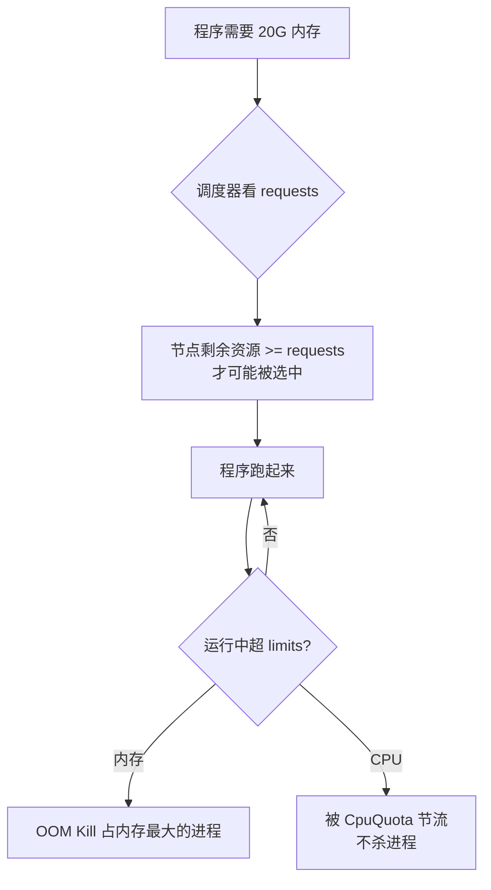
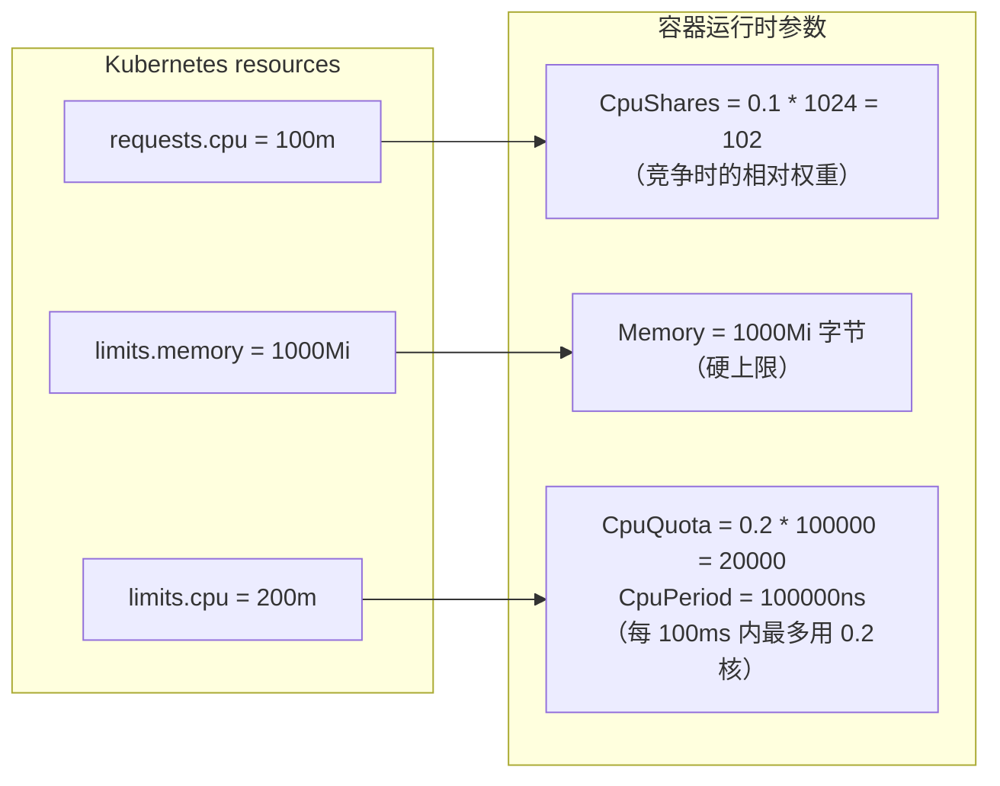
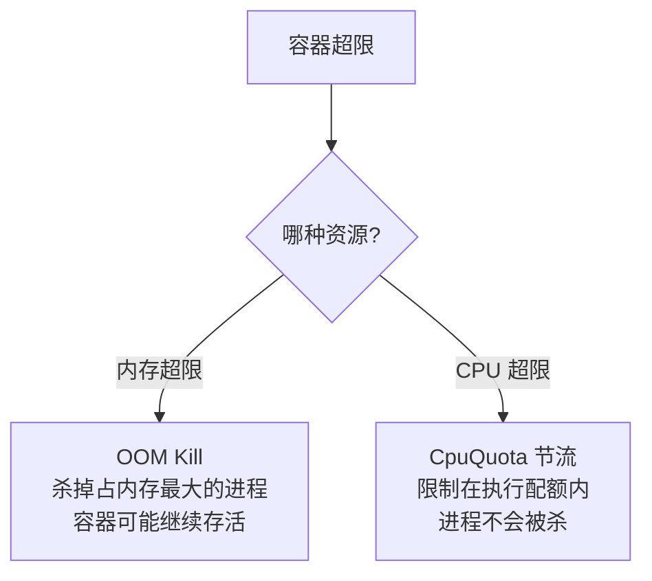

# Kubernetes 生产实践: Resources 资源管理（上）—— requests/limits 与 Docker cgroup 参数的映射关系

上一节讲了 Namespace 的第一类隔离，这一节补上第二类：**资源配额隔离**。主角是容器上的 `resources` 字段。

结论先给：**`requests` 参与调度决策，是"被预留"的资源；`limits` 是硬上限，超限会被限制甚至杀进程。** 更关键的是，这两个字段最终会翻译成 cgroup 参数交给容器运行时 —— `requests.cpu` → `CpuShares`（竞争时的**相对权重**），`limits.memory` → `Memory`（硬上限），`limits.cpu` → `CpuQuota`/`CpuPeriod`（时间片配额）。理解这层映射，才明白为什么改个内存值 Pod 会重启。

## 纲要

- Kubernetes 的资源类型：CPU、内存、GPU、持久化存储
- 为什么需要资源限制：调度前不知道需求会导致调度到资源不足的节点
- 一个程序吃光整台机器内存 → 必须有上限
- `requests`：容器希望能被完全保证的资源量，**调度器用它算最优节点**
- `limits`：容器能使用的资源上限，节点资源竞争时据此决策
- 单位别写错：内存的 `Mi` **必须大写 M**，小写 `mi` 就变成 CPU 单位了
- CPU 的 `m` 是千分之一核，100m = 0.1 核
- 节点资源从 kubelet 上报，`describe node` 看 Capacity 与 Allocated
- **改 resources 会触发 Pod 重建**，因为底层依赖容器的隔离机制
- `docker inspect` 看四个关键参数的换算
- 内存超限：OOM 杀掉容器内占内存最大的进程，容器未必重启
- CPU 超限：不会杀进程，只会被 `CpuQuota` 掐住

## Kubernetes 管哪些资源

目前 Kubernetes 的 resources 包括 **CPU、内存、GPU、持久化存储** 四类：

| 资源类型 | 状态 | 说明 |
| --- | --- | --- |
| CPU | 最基础最常用 | 本节核心 |
| 内存 | 最基础最常用 | 本节核心 |
| GPU | 持续完善中，偏实验性质 | 用得少，本节略过 |
| 持久化存储 | 设计和使用差异较大 | 单独小节讲 |

## 为什么要限制资源

集群里每个节点上的 **kubelet** 会收集节点信息上报给 API Server，其中就包含资源信息 —— 有多少核 CPU、多少 G 内存。

设想一个服务要跑起来，最简单的做法是随便找个节点 `docker run`。**但如果这个程序需要占 20G 内存，而调度到的节点只有 16G，显然起不来。** 所以 Kubernetes 最好事先知道这个程序要占多大内存，再匹配手里的节点，挑一个资源充足的调度上去。

程序跑起来之后还有第二个问题：**同节点上跑着很多程序，其中一个突然触发 bug 开始疯狂吃内存，最终整台服务器内存被吃光，所有服务一起挂。** 这显然不能接受。

于是资源限制的核心设计出来了：**至少保证（requests） + 最高上限（limits）**。CPU 和内存都可以设这两个值。



| 字段 | 含义 | 谁在用 |
| --- | --- | --- |
| `requests` | 容器希望被分配、**可以被完全保证**的资源量 | **调度器**用它参与调度策略计算，找到最优节点 |
| `limits` | 容器能使用的**资源上限** | 节点资源不足、发生竞争时参考它做决策（比如杀谁） |

## 配置长什么样

在容器配置里有一个 `resources` 字段，下面分别是 `requests` 和 `limits`，再往下各有一个 `memory` 和 `cpu`：

```yaml
spec:
  containers:
    - name: springboot-web
      image: springboot-web:v1
      resources:
        requests:
          memory: 100Mi
          cpu: 100m
        limits:
          memory: 100Mi
          cpu: 200m
```

上面的配置表示：**这个容器最少需要 100 兆内存、0.1 核 CPU；最多能用 100 兆内存、0.2 核 CPU。**

```text
容器资源清单结构
└── spec.template.spec.containers[]
    └── resources                        资源声明的入口
        ├── requests                     参与调度：最少要保证多少
        │   ├── memory: 100Mi            内存下限
        │   └── cpu: 100m                0.1 核
        └── limits                       硬上限：最多能用多少
            ├── memory: 100Mi            内存上限
            └── cpu: 200m                0.2 核
```

> 这几个值都是**绝对值**：不管宿主机是 1 核还是 100 核，`cpu: 200m` 就是 0.2 核；不管机器是 1G 还是 100G 内存，`memory: 100Mi` 就是 100 兆。

### 单位千万别写错

单位是最容易踩的坑：

| 资源 | 写法 | 含义 |
| --- | --- | --- |
| 内存 | `100Mi` | 100 兆（`1024 * 1024` 字节），**M 必须大写** |
| 内存 | `1Gi` | 1 G 内存 |
| CPU | `100`（不带单位） | 100 个 CPU 核心 |
| CPU | `100m` | 0.1 核（**1 核 = 1000m**） |

> **内存的 `m` 写成小写（`mi`）会被误当成 CPU 单位**，配出来的值就完全错了。`Mi` / `Gi` 是内存，`m` 是 CPU，记住这个区分。

## 看节点还剩多少资源

配置生效之后，可以先看看节点上还剩多少资源：

```bash
kubectl get node
kubectl describe node node-120
```

`describe` 里能看到 `Allocated resources`，当前已经分配的资源：

```text
Allocated resources:
  Resource           Requests    Limits
  cpu                250m (3%)   0 (0%)
  memory             0 (0%)      0 (0%)
```

这 250m CPU 是被 **calico** 占掉的（calico 的清单里限制了 250m CPU）。

再往上还有两段信息：

| 字段 | 含义 |
| --- | --- |
| `Capacity` | 机器的**硬件资源**：CPU 8 核、内存约 16G、磁盘若干 |
| `Allocatable` | **可分配给服务的资源** = Capacity 减去预留给系统和 kubelet 的部分 |

## 改资源会重启 Pod，为什么

把内存从 100Mi 调到 500Mi、limits 调到 1Gi 试一下：

```bash
kubectl edit deploy web-dev
kubectl get pod -n dev -w
```

**能看到新的 Pod 起来、老的 Pod 停掉 —— 修改 resources 会导致 Pod 重建。**

原因不难理解：**这套限制本身依赖的就是容器的隔离机制（cgroup），必须重新启动一个容器，才能把这些隔离参数加进去。**

## 映射到底层：四个 Docker 参数

既然底层是容器，就去看看这些限制对应了容器的哪些参数。先找到 Pod 跑在哪台机器上、容器叫什么：

```bash
kubectl get pod -n dev -o wide
CONTAINER_ID=$(docker ps | grep webdemo | awk '{print $1}')
docker inspect "$CONTAINER_ID"
```

```text
resources 到容器参数的映射
├── .spec.resources.requests.cpu  100m  → CpuShares    102
├── .spec.resources.limits.memory 1000Mi → Memory       1048576000
├── .spec.resources.limits.cpu    200m  → CpuQuota     20000
└── (固定值)                            → CpuPeriod    100000
```

### 1. `CpuShares` ← `requests.cpu`

```
CpuShares = requests.cpu(核) * 1024 = 0.1 * 1024 = 102.4
```

**这是一个相对权重**，作用是当节点上发生 CPU 竞争时，决定分配给容器的 CPU 比例。

比如两个容器的 `requests.cpu` 分别设成 1 和 2，那它们对应的 `CpuShares` 就是 1024 和 2048；**资源竞争时容器运行时会尝试按 1:2 的比例把 CPU 分给这两个容器。**

### 2. `Memory` ← `limits.memory`

```
Memory = limits.memory(字节) = 1000 * 1024 * 1024
```

容器运行时**直接用 limits 里的内存值作为硬上限**。

### 3. `CpuQuota` / `CpuPeriod` ← `limits.cpu`

```
CpuQuota  = limits.cpu(核) * 100000 = 0.2 * 100000 = 20000
CpuPeriod = 100000 ns（默认值，即 100 毫秒）
```

**这两个是一对，要连起来读：在 100 毫秒的周期内，最多分配给这个容器 20000 的 CPU 量（也就是 0.2 核）。**



## 内存超 limits 会怎样

把 `requests.memory` 和 `limits.memory` 都调小到 100Mi，然后写一个简单的程序去吃内存：

```bash
kubectl exec -it "$POD" -n dev -- sh
```

```bash
STR="0123456789012345678901234567890123456789012345678901234567890123456789012345678901234567890123456789"
for i in 1 2 3 4 5 6 7 8 9 10; do
    STR="${STR}${STR}"
    sleep 0.1
    echo "size is now doubled"
done
```

每 0.1 秒把这个字符串扩大一倍。只有 100Mi，很快就爆了：

```text
Killed
```

**注意：这个进程被 kill 了，但容器并没有退出**，容器里其他还在跑的程序不受影响。

**这说明内存超限的处理方式是：OOM 杀掉容器里占用内存最大的那个进程，而不是一定要重启整个容器。**

## CPU 超 limits 会怎样

CPU 的行为和内存完全不同。把 `limits.cpu` 设成 4，然后在容器里用 `dd` 循环占 CPU：

```bash
# 在容器里开多个死循环
dd if=/dev/zero of=/dev/null &
dd if=/dev/zero of=/dev/null &
dd if=/dev/zero of=/dev/null &
dd if=/dev/zero of=/dev/null &
```

在宿主机上观察：

```bash
docker stats "$CONTAINER_ID"
```

```text
CONTAINER           CPU %               MEM USAGE / LIMIT
xxxxxxxxxxxx        400.5%              285MiB / 4GiB
```

**开到 4 个进程时 CPU 到了 400% 多，再加一个还是 400% 多一点** —— 被 `CpuQuota` 死死掐在这个值上。

**CPU 超限不会被杀进程，只会被节流。** 这是 CPU（可压缩资源）与内存（不可压缩资源）处理方式的本质区别。



## API 速览

| 能力 | API / 命令 | 要点 |
| --- | --- | --- |
| 声明资源 | `resources.requests` / `resources.limits` | 都支持 cpu 与 memory |
| 查看节点余量 | `kubectl describe node NODE` | 看 `Allocatable` 与 `Allocated resources` |
| 硬件资源总量 | 同上，`Capacity` | Has 减去系统预留才是 Allocatable |
| 找容器 inspect | `docker ps \| grep NAME` 拿 ID 后 `docker inspect ID` | 验证 limits 落地的唯一办法 |
| CPU 权重换算 | `requests.cpu * 1024` | 相对值，只在竞争时生效 |
| CPU 配额换算 | `limits.cpu * 100000`（配 100000ns 周期） | 绝对值，硬性节流 |
| 内存硬上限 | `limits.memory` 字节数 | 超限触发 OOM Kill |
| 观察使用量 | `docker stats` | CPU 百分比可直接与 `limits.cpu` 换算的上限核对 |

## Demo 示例

### 1. 一份带 resources 的完整清单

```yaml
apiVersion: apps/v1
kind: Deployment
metadata:
  name: web-dev
  namespace: dev
spec:
  replicas: 1
  selector:
    matchLabels:
      app: web-dev
  template:
    metadata:
      labels:
        app: web-dev
    spec:
      containers:
        - name: springboot-web
          image: springboot-web:v1
          ports:
            - containerPort: 8080
          resources:
            requests:
              memory: 100Mi
              cpu: 100m
            limits:
              memory: 1000Mi
              cpu: 200m
```

### 2. 验证 cgroup 参数换算

```bash
# 1. 找到 Pod 所在节点上的容器
kubectl get pod -n dev -o wide
CONTAINER_ID=$(docker ps --format '{{.ID}}\t{{.Names}}' | grep webdemo | awk '{print $1}')

# 2. 一次性取出四个关键参数
docker inspect "$CONTAINER_ID" --format '{{.HostConfig.CpuShares}}'
docker inspect "$CONTAINER_ID" --format '{{.HostConfig.Memory}}'
docker inspect "$CONTAINER_ID" --format '{{.HostConfig.CpuQuota}}'
docker inspect "$CONTAINER_ID" --format '{{.HostConfig.CpuPeriod}}'
```

```bash
# 3. 反推：1000Mi 的 limits.memory 换算回 Mi
echo $((1048576000 / 1024 / 1024))
# 1000
```

### 3. 两种超限行为的对比实验

```bash
# === 内存超限 → OOM Kill ===
kubectl exec -it "$POD" -n dev -- sh
# 容器里：
#   STR=<一个较长字符串>
#   for i in 1 2 3 4 5 6 7 8 9 10; do STR="${STR}${STR}"; sleep 0.1; echo doubled; done
# 结果：Killed —— 只有这个进程死掉，容器还在

# === CPU 超限 → 节流 ===
kubectl exec -it "$POD" -n dev -- sh
# 容器里连续起多个 dd 死循环
#   dd if=/dev/zero of=/dev/null &
# 宿主机观察：docker stats 里 CPU% 卡在上限附近，进程不死
```

### 总结

Kubernetes 的资源类型有 CPU、内存、GPU、持久化存储四类，本节聚焦最基础也最常用的 CPU 和内存。

资源限制的核心设计是 `requests` 与 `limits`：**requests 给调度器用**（节点剩余要能满足它才可能被选中），**limits 给运行时兜底**（超了就限制或杀进程）。

单位要写对：内存用 **`Mi` / `Gi`（M 必须大写，小写会被当成 CPU 单位）**，CPU 用 `m`（1000m = 1 核），不带单位表示整数个核心。

这两个值会被翻译成 cgroup 参数：`requests.cpu * 1024` → `CpuShares`（竞争时的相对权重）、`limits.memory` → `Memory`（硬上限）、`limits.cpu * 100000` → `CpuQuota`（配默认 100000ns 的 `CpuPeriod`，表示每 100ms 最多用这么多）。

**修改 resources 一定会触发 Pod 重建**，因为隔离参数必须在容器启动时注入。

超限的处理方式分资源而定：**内存超限是 OOM Kill 掉容器里占内存最大的那个进程**（容器本身不一定重启）；**CPU 超限则是被 `CpuQuota` 节流，进程不会被杀**。

