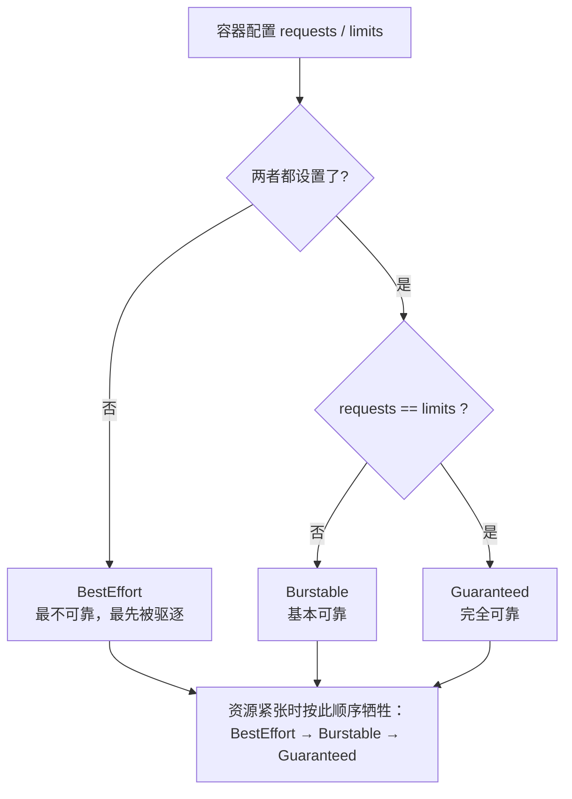
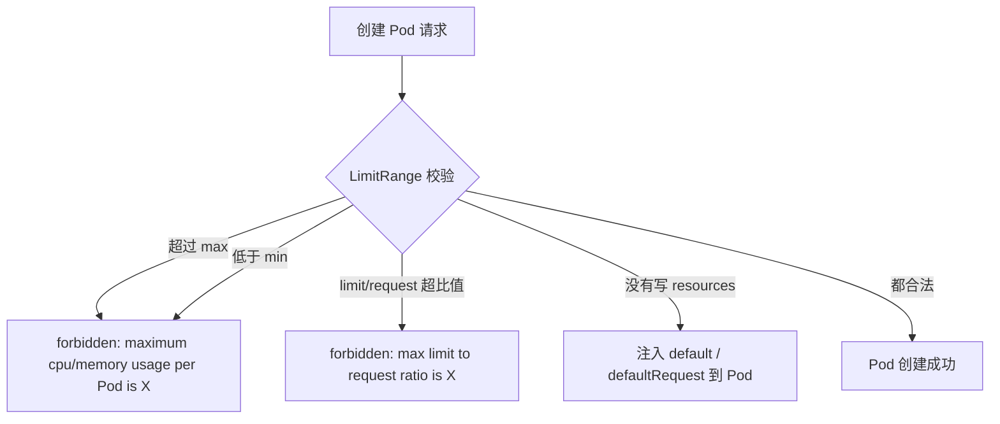
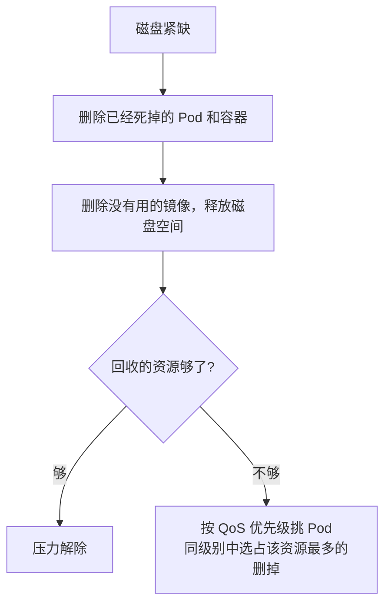
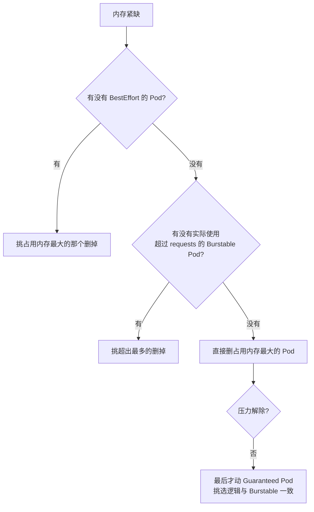

# Kubernetes 生产实践: Resources 资源管理（下）—— LimitRange、ResourceQuota 与 Pod 驱逐策略

上半篇把 `requests` / `limits` 落到容器参数的映射讲清楚了。但**只靠每个容器自己声明是不够的** —— 有人会把内存 `request` 写成 100G（实际只用 1G），有人写成 `request: 1G` + `limit: 100G`，还有人干脆什么都不写。这些错误/不合理的配置，得由平台侧兜住。

结论先给：**LimitRange 管"单个 Pod / 容器的取值范围"（含默认值），ResourceQuota 管"整个 Namespace 的总量"，两者都不够时再由 kubelet 的驱逐策略兜底保节点稳定。** 而服务的可靠性等级（QoS）不需要手动标注，Kubernetes 直接根据 `requests` 与 `limits` 的关系自动判定。

## 纲要

- CPU 是可压缩资源，超限只会被少分；内存不可压缩，超限直接被杀
- QoS 三档：**Guaranteed / Burstable / BestEffort**
- `requests == limits` 就是最高等级，两者都不写就是最低等级
- 等级由系统自动判定而非手工指定：牺牲灵活性换稳定性
- CPU 竞争时按 `requests` 比例分配，与 `limits` 无关
- LimitRange：范围限制 + 默认值，按 Namespace 生效
- `maxLimitRequestRatio` 限制 limit 与 request 的最大比值
- `type: Pod` 不能有默认值（一个 Pod 里可能有多个容器）
- 默认值注入的是 **Pod**，Deployment 的清单不会变
- ResourceQuota：限制整个 Namespace 的资源总量与对象数量
- Pod 驱逐：软阈值 + 宽限期，硬阈值立即触发
- 驱逐顺序按 QoS 等级，从 BestEffort 开始

## CPU 与内存的本质区别

接着上半篇的实验往下说：CPU 开到 4 核上限后，再多开进程也只是停在 400% 多，**进程不会被杀**；内存超了则直接被 kill。

**因为 CPU 是可压缩资源（compressible），内存不是。** CPU 占用多了就少分你一点，内存一旦超了没法"少给"，只能杀进程。这个区别决定了后面一系列处理策略的差异。

## QoS：服务可靠性等级由 requests/limits 自动决定

`requests` 和 `limits` 的值不是孤立的，**它们共同决定了服务的可靠性等级**：

| 配置方式 | QoS 等级 | 含义 |
| --- | --- | --- |
| `requests` == `limits`（且都设置了） | **Guaranteed** | 完全可靠，等级最高 |
| 都设置了，但两者不相等 | **Burstable** | 比较可靠 |
| 两个值都没设置 | **BestEffort** | 最不可靠，**没有资源时第一个被干掉的就是它** |

**不设置任何资源限制的配置是不推荐的** —— 它意味着这个服务随时可能被牺牲掉。

当出现资源竞争需要处理时，**按上面的优先级选择杀谁**。注意 CPU 出现竞争时不会杀 Pod：CPU 可压缩，多占了就少分一点；**少分多少取决于 `requests`，`requests` 大的多分一点，与 `limits` 无关。**



**为什么不让用户直接指定安全等级，而是根据 requests/limits 反推？** 这种策略确实少了一些灵活性，但换来了稳定性和简单性：重要的服务就把 `requests` 和 `limits` 设成一样，**给它留足资源就等于给它稳定性**。如果允许随意指定等级，难免出现"本该特别安全的服务被配成了低优先级"，资源照样被别人抢走。

## 三类不合理的配置

到此为止说的都是"怎么给单个容器限制资源"。设想几种情况：

| 场景 | 问题 |
| --- | --- |
| 节点内存只有 4G，有人把 `requests.memory` 设成 5G | **永远调度不起来** |
| `requests` 写 100G，实际只用 1G | 资源被一个人占住，别人没法用 |
| `requests: 1G` + `limits: 100G` | **内存波动太大**，没人知道这个应用到底要用多少 |

为了防止这些错误或不合理的配置，Kubernetes 提供了一种资源对象：**LimitRange**。

## LimitRange：范围限制 + 默认值

LimitRange 也是用配置文件描述的，**它是针对 Namespace 生效的** —— 在一个 Namespace 下设置范围限制和默认值：

```yaml
apiVersion: v1
kind: LimitRange
metadata:
  name: test-limits
  namespace: test
spec:
  limits:
    - type: Pod
      max:
        cpu: 4
        memory: 2Gi
      min:
        cpu: 100m
        memory: 100Mi
      maxLimitRequestRatio:
        cpu: 3
        memory: 2
    - type: Container
      default:
        cpu: 300m
        memory: 200Mi
      defaultRequest:
        cpu: 200m
        memory: 100Mi
      max:
        cpu: 2
        memory: 1Gi
      min:
        cpu: 100m
        memory: 100Mi
      maxLimitRequestRatio:
        cpu: 3
        memory: 2
```

```text
LimitRange: spec.limits[]
├── type: Pod                        对整个 Pod 求和后的限制
│   ├── max:  cpu 4 / memory 2Gi     上限
│   ├── min:  cpu 100m / memory 100Mi 下限
│   └── maxLimitRequestRatio: cpu 3 / memory 2   limit/request 最大比值
└── type: Container                  单个容器的限制
    ├── default:         cpu 300m / memory 200Mi   没写 limits 时的默认值
    ├── defaultRequest:  cpu 200m / memory 100Mi   没写 requests 时的默认值
    ├── max / min                                  上下限
    └── maxLimitRequestRatio                       比值上限
```

几个要点：

- **`maxLimitRequestRatio`** —— 限制同一份配置里 `limit` 最多比 `request` 大多少倍。上例 CPU 是 3 倍、内存是 2 倍，超过就直接创建失败；
- **Pod 类型没有默认值**，Container 类型才有。因为 **Pod 是逻辑概念，里面可能包含多个容器** —— 一个容器能给它默认值，多个容器怎么给？所以只能做整体限制，不能给默认；
- **`default` 就是默认的 limit**，`defaultRequest` 是默认的 request。当服务没有配置资源限制时，会使用这里的值。

### 默认值落在 Pod 上，不是 Deployment 上

先建一个新 Namespace `test`（LimitRange 是针对 Namespace 的），然后创建 LimitRange：

```bash
kubectl create namespace test
kubectl create -f limit-range.yaml -n test
kubectl describe limits -n test
```

拿一个**完全没有 resources 配置**的 Deployment 去试：

```bash
kubectl create -f web-test.yaml -n test
kubectl get deploy -n test
```

看 Deployment 的详情：

```bash
kubectl get deploy web-test -n test -o yaml | grep -A5 resources
```

**发现 `containers` 下面的 `resources` 是空的。** 是不是没生效？

再看 Pod：

```bash
kubectl get pod -n test -o yaml | grep -A8 resources
```

**Pod 下面有了 `resources` 配置，limits 的 CPU/内存、requests 的 CPU/内存，跟 Namespace 里配置的默认值完全一致。**

这说明：**默认值被加在了 Pod 的配置里，而没有体现在 Deployment 上** —— Deployment 仍然和原始的清单保持一致。查问题时要盯着 Pod 看，别被 Deployment 的空 `resources` 误导。

### 比值超限：直接 forbidden

配一个不成比例的：`requests.memory: 100Mi`，`limits.memory: 1Gi`（10 倍，超过限制的 2 倍）：

```bash
kubectl get pod -n test
kubectl describe rs web-test-xxxxx -n test
```

Deployment 的 `UP-TO-DATE` 一直是 0，ReplicaSet 的事件里有一条：

```text
Error creating: pods "web-test-xxxxx" is forbidden:
  cpu max limit to request ratio is 3, but provided ratio is 20.000000
  memory max limit to request ratio is 2, but provided ratio is 10.000000
```

**Pod 创建失败，比例限制生效了。**

### 绝对值超限：同样 forbidden

比例没问题了（500Mi / 1Gi），再测超限 —— CPU 设 3、内存 3Gi（上限是 2 / 2Gi）：

```text
Error creating: pods "web-test-xxxxx" is forbidden:
  maximum cpu usage per Pod is 2, but limit is 3
  maximum memory usage per Pod is 2Gi, but limit is 3Gi
```



## ResourceQuota：给 Namespace 划总量

用 LimitRange 可以把单个 Pod / 容器都控制住。但**多个团队共用一个集群时，还得合理分配资源，不能让一个团队把资源占满。**

**ResourceQuota（资源配额）** 解决这个问题：**给每一个 Namespace 做各种维度的限制。**

```yaml
apiVersion: v1
kind: ResourceQuota
metadata:
  name: compute-resources
  namespace: test
spec:
  hard:
    pods: "4"
    requests.cpu: "2"
    requests.memory: 4Gi
    limits.cpu: "4"
    limits.memory: 8Gi
```

**这一类是对 CPU 和内存的配额**（Pod 最多 4 个、requests.cpu 最多 2 核、requests.memory 最多 4Gi、limits.cpu 4 核、limits.memory 8Gi）。

除了计算资源，还可以**限制对象数量**（`object-counts`）：

```yaml
apiVersion: v1
kind: ResourceQuota
metadata:
  name: object-counts
  namespace: test
spec:
  hard:
    configmaps: "10"
    persistentvolumeclaims: "4"
    replicationcontrollers: "20"
    secrets: "10"
    services: "10"
```

```text
Namespace: test 的配额体系
├── LimitRange test-limits            单个 Pod / Container 的取值范围与默认值
│   ├── type: Pod       max / min / maxLimitRequestRatio
│   └── type: Container default / defaultRequest / max / min / ratio
└── ResourceQuota                     整个 Namespace 的总量
    ├── compute-resources             pods / requests.cpu,memory / limits.cpu,memory
    └── object-counts                 configmaps / pvc / rc / secrets / services
```

> 两类限制可以写在同一个 ResourceQuota 里，但**功能上还是分开的**，拆成两个便于维护。

创建与查看：

```bash
kubectl apply -f compute-resources.yaml -n test
kubectl apply -f object-counts.yaml -n test

kubectl get quota -n test
kubectl describe quota compute-resources -n test
```

`describe` 能同时看到**当前使用量**和**限制量**，一眼判断资源是不是饱和了。

实测：把 `web-test` 的副本数改成 5（配额是 4 个 Pod）：

```bash
kubectl scale deploy web-test --replicas=5 -n test
kubectl get deploy -n test
```

```text
NAME       DESIRED   CURRENT   UP-TO-DATE   AVAILABLE
web-test   5         5         5            4
```

**DESIRED 是 5，但只运行起来 4 个。** 再 `describe quota compute-resources`，能看到 `pods` 的 used 是 4、hard 也是 4 —— **已经满了，不会再跑第五个。**

同理，内存或 CPU 达到上限时也不会再调度新 Pod 上去。

## 最后一环：Pod 驱逐（Eviction）

各种配额都配好了，从 Container、Pod 到 Namespace 层层设限，是不是就万无一失了？

**答案是：不是。**

不停地调度新服务，最终很可能有些节点会达到饱和。**当一些服务实际使用的内存大于它的 `requests` 时，就很有可能导致当前节点的物理内存不足** —— 达到系统设定的阈值后，内核会开始杀进程，**甚至可能把 dockerd 杀掉**，严重影响系统稳定性。

于是 kubelet 加入了 **Pod 驱逐策略** 来保证节点稳定：**每个节点上的 kubelet 持续监控主机资源使用情况，一旦资源紧缺，就主动停止一个或多个 Pod 来回收资源。**

什么时候驱逐、驱逐谁，由一组参数控制：

```yaml
evictionSoft:
  memory.available: 1.5Gi
evictionSoftGracePeriod:
  memory.available: 1m30s
evictionHard:
  memory.available: 100Mi
  nodefs.available: 1Gi
  nodefs.inodesFree: 5%
```

| 类型 | 行为 | 例子 |
| --- | --- | --- |
| **软阈值** `eviction-soft` | 不是马上驱逐，配合宽限期使用 | 可用内存持续 **1 分 30 秒** 都小于 1.5Gi 才开始驱逐 |
| **硬阈值** `eviction-hard` | 条件满足**立刻**开始驱逐 | 内存 < 100Mi / 磁盘 < 1Gi / inode 剩余 < 5% |

### 磁盘紧缺时怎么处理



### 内存紧缺时怎么挑

顺序非常明确：



**这套顺序翻译过来就是：先牺牲完全不可靠的，再牺牲实际用量超过声明的，最后才轮到最可靠的。** 驱逐策略非常重要，**生产环境可以说是必备配置**。

> 想复现的话，可以给 web 服务加一个吃内存的 controller：通过 URL 传一个 memory 参数，让 Java 程序在堆里申请这么大的内存 —— 这比在 shell 里滚字符串更贴近真实场景。

## API 速览

| 能力 | API / 命令 | 要点 |
| --- | --- | --- |
| QoS 等级判定 | `requests` / `limits` 的组合 | 相等=Guaranteed，不等=Burstable，都不写=BestEffort |
| 范围限制 | `kind: LimitRange` | 针对 Namespace 生效 |
| 比值限制 | `maxLimitRequestRatio` | 限制 limit 最大是 request 的几倍 |
| 默认值 | `default` / `defaultRequest` | 只对 `type: Container` 有效 |
| 查看范围内的限制 | `kubectl describe limits -n NS` | Namespace 下所有 LimitRange |
| 总量配额 | `kind: ResourceQuota` | `spec.hard` 里写指标 |
| 计算类配额 | `requests.cpu` / `limits.memory` / `pods` | request/limit 分别限额 |
| 对象数配额 | `configmaps` / `services` / `secrets` / `persistentvolumeclaims` | 防止刷资源对象 |
| 查看配额用量 | `kubectl describe quota NAME -n NS` | used 与 hard 并列，判断是否饱和 |
| 软驱逐 | `eviction-soft` + `eviction-soft-grace-period` | 持续超过宽限期才动手 |
| 硬驱逐 | `eviction-hard` | 立即触发 |

## Demo 示例

### 1. 一次配齐 LimitRange + ResourceQuota

```bash
#!/usr/bin/env bash
set -e

kubectl create namespace test

# 单 Pod / Container 的取值范围与默认值
kubectl apply -f limit-range.yaml -n test
kubectl describe limits -n test

# Namespace 总量：计算资源
kubectl apply -f compute-resources.yaml -n test

# Namespace 总量：对象数量
kubectl apply -f object-counts.yaml -n test

kubectl get quota -n test
```

### 2. 验证默认值只落在 Pod 上

```bash
kubectl apply -f web-test.yaml -n test

echo "--- Deployment 上的 resources（预期为空）---"
kubectl get deploy web-test -n test -o jsonpath='{.spec.template.spec.containers[0].resources}'

echo
echo "--- Pod 上的 resources（预期已被注入默认值）---"
POD=$(kubectl get pod -n test -o jsonpath='{.items[0].metadata.name}')
kubectl get pod "$POD" -n test -o jsonpath='{.spec.containers[0].resources}'
```

### 3. 触发两类 forbidden

```bash
# 一、limit/request 比值超限 -> 改 web-test.yaml 后 apply
kubectl apply -f web-test.yaml -n test
RS=$(kubectl get rs -n test -o jsonpath='{.items[0].metadata.name}')
kubectl describe rs "$RS" -n test
# Error creating: pods "web-test-xxx" is forbidden:
#   cpu max limit to request ratio is 3, but provided ratio is 20.000000

# 二、绝对值超过 max -> 同样从 describe rs 看事件
# Error creating: pods "web-test-xxx" is forbidden:
#   maximum cpu usage per Pod is 2, but limit is 3
#   maximum memory usage per Pod is 2Gi, but limit is 3Gi
```

### 4. 打满 Namespace 配额

```bash
kubectl scale deploy web-test --replicas=5 -n test
kubectl get deploy -n test
# DESIRED 5，但 AVAILABLE 只有 4 —— pods 配额已满

kubectl describe quota compute-resources -n test
# pods: 4/4  limits.cpu / limits.memory 同样接近上限
```

### 总结

CPU 是**可压缩资源**（超限只少分，不杀进程，按 `requests` 比例分配），内存是**不可压缩资源**（超限直接 OOM Kill），这个区别贯穿了所有资源管理策略。

**QoS 等级不需要手工标注**：`requests == limits` 就是 Guaranteed，两者不等是 Burstable，都不写是 BestEffort。等级由系统反推而非指定，牺牲了灵活性但避免了配错。

**LimitRange 按 Namespace 限定单个 Pod/Container 的取值范围**，包括 max/min、`maxLimitRequestRatio`（limit 与 request 的最大比值），以及 `default` / `defaultRequest` 默认值 —— **默认值只能配在 Container 类型上（Pod 里可能多个容器没法给默认），且会被注入到 Pod 而非 Deployment 上。**

**ResourceQuota 管整个 Namespace 的总量**，既可以限计算资源（`requests.cpu`、`limits.memory`、`pods`），也可以限对象数量（`services`、`secrets`、`configmaps` 等）；超配额时 Pod 直接不调度。

最后一层保险是 **kubelet 的 Pod 驱逐**：软阈值 + 宽限期，硬阈值立即执行；驱逐顺序严格按 BestEffort → Burstable（优先实际用量超出 requests 最多的）→ Guaranteed。这一项在生产环境属于必备配置。

