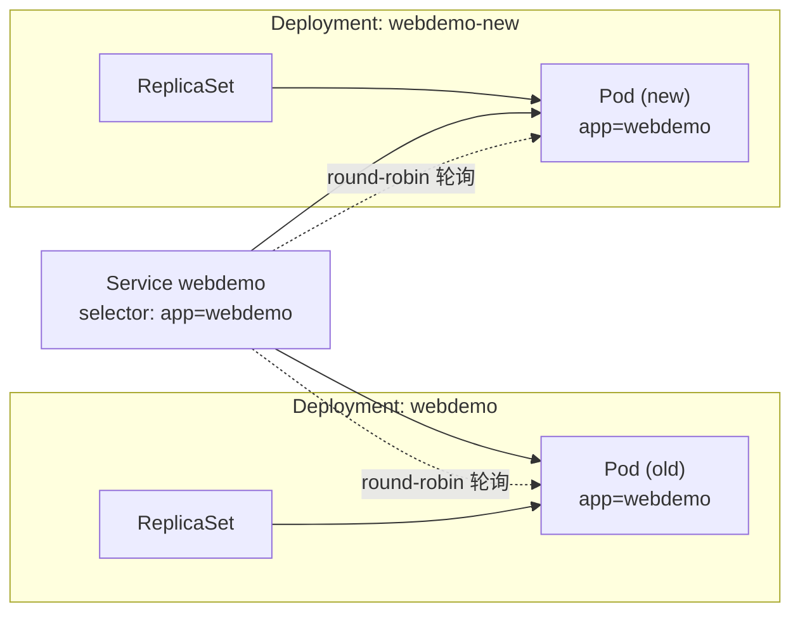
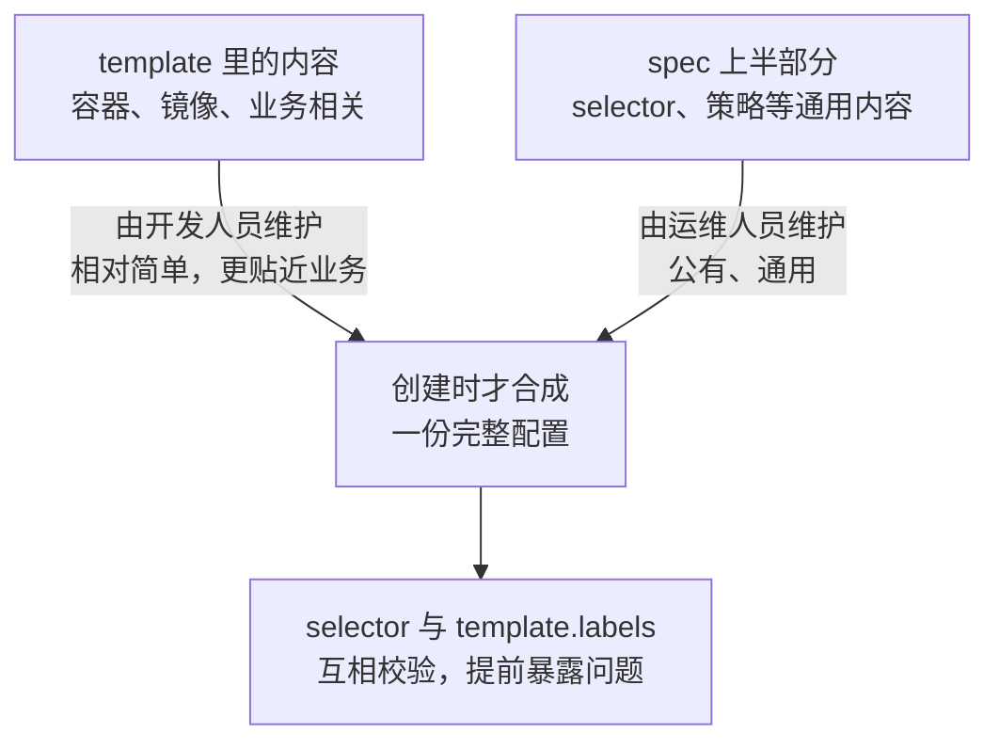
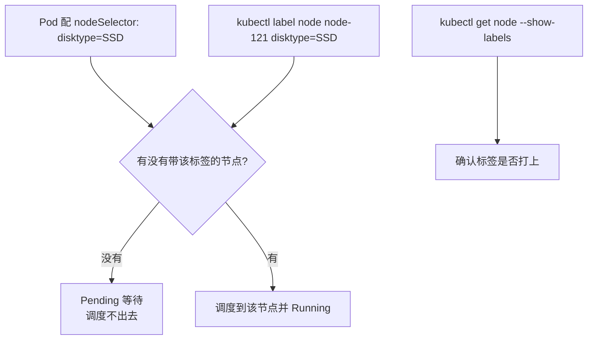

# Kubernetes 生产实践: Label —— 小标签大作为：selector、matchExpressions 与 nodeSelector

Label 看起来是 Kubernetes 里最简单的东西：**一个 `key=value` 键值对，值完全自己定义。** 但它的用法极其灵活，几乎所有高级能力（滚动更新、灰度、调度约束、网络策略）都建立在它之上。

结论先给：**Label 是静态的，真正让它发挥作用的是 selector（选择器）。** 要理解三个关键行为：**Deployment 的 `selector` 与 `template.labels` 必须完全一致**；**Service 的 `selector` 会把所有带该标签的 Pod 都纳进来，与 Pod 属于哪个 Deployment 无关**；**selector 一旦创建就不可修改**，这是 Kubernetes 刻意设的防错措施。

## 纲要

- Label 的本质是自定义的 `key=value`，可以贴到各种资源上
- 同一标签可以贴多个资源，同一资源也可以有任意多个标签
- Deployment 靠 `selector.matchLabels` 认领自己的 Pod
- `selector` 与 `template.labels` 不一致会直接报错
- 两个 Deployment 用相同 label 也不冲突，选择器各自独立
- **Service 的 selector 会选中所有带该标签的 Pod**，跨 Deployment 也一样
- 于是同一个 Service 可以把流量轮询到两个不同版本 —— 灰度的基础
- `matchExpressions` 支持 In / NotIn / Exists / DoesNotExist
- `matchLabels` 与 `matchExpressions` 同时存在是 **AND** 关系
- 上下两处都配 label 是为了 **PodPreset** 的分工与校验
- **selector 创建后不可修改**，必须先删再建
- `kubectl get pod -l` 支持逗号AND、`in` / `notin` 集合运算
- Label 也能贴到 Node 上，配合 `nodeSelector` 做调度约束

## Label 是什么

Label 的本质就是**一个 `key=value`，两个值都由自己定义**。它非常灵活：

- 可以贴到 **Pod、Deployment、Service、Node** 等各种各样的资源上（"贴"这个说法很形象）；
- **同一个标签可以贴到多个资源上**；
- **同一个资源也可以有任意多个不同的标签**。

这种规则设定让 Kubernetes 可以用标签做很多事情。常见用法：

| 场景 | 标签例子 |
| --- | --- |
| 副本控制器认领 Pod | `app: webdemo` |
| Service 发现后端 Pod | `app: webdemo` |
| 区分节点能力 | `cpu: better`、`disk: better` |
| 区分应用类型 | `type: frontend`、`type: backend` |

## 静态的标签 + 动态的选择器

标签本身是静态的，**贴上就完事了**。那它是怎么被利用起来的？Kubernetes 设计了另一个概念与之配合：**selector（选择器）**。

看一份 Deployment：

```yaml
apiVersion: apps/v1
kind: Deployment
metadata:
  name: webdemo-new
  namespace: dev
spec:
  replicas: 1
  selector:
    matchLabels:
      app: webdemo
  template:
    metadata:
      labels:
        app: webdemo
    spec:
      containers:
        - name: springboot-web
          image: springboot-web:v1
```

```text
Deployment 里 Label 的两处位置
└── spec
    ├── selector.matchLabels     app: webdemo   ← 我负责哪些 Pod
    │   └── (实际作用在中间的 ReplicaSet 上)
    └── template.metadata.labels app: webdemo   ← 我创建出来的 Pod 带什么标签
        └── spec.containers[]                      容器名、镜像等
```

> Deployment 和 Pod 之间其实还有一层 **ReplicaSet（副本控制器）**，Kubernetes 从 1.6 之后有意把这一层对用户隐藏了。**真正作用 `selector` 的是 ReplicaSet**，Deployment 只是暴露同一套写法。

**如果 `selector` 的 key/value 与 `template.labels` 不一致会怎样？** 改一个试试：

```text
The Deployment "webdemo" is invalid: spec.template.metadata.labels:
  Invalid value: map[string]string{"app":"demox"}:
  `selector` does not match template `labels`
```

**报得明明白白：selector 与 template 不一致。** 这两处必须一模一样，否则副本控制器创建出来的 Pod 不在自己的选择范围内，就没人管理它 —— 这是一个错误的配置。

## 两个 Deployment 用同一个标签，会冲突吗

把 Deployment 的名字改成 `webdemo-new` 再创建一份：

```bash
kubectl apply -f web-demo-new.yaml -n dev
kubectl get deploy -n dev
```

```text
NAME          READY   UP-TO-DATE   AVAILABLE   AGE
webdemo       1/1     1            1           10m
webdemo-new   1/1     1            1           5s
kubectl get pod -n dev
# 2 个 Pod 都在跑
```

**两个 Deployment 的 Pod 都用了 `app: webdemo` 这个标签，但没有冲突。**

因为 **selector 是归属于某一个 Deployment（实际是它下面的 ReplicaSet）的**，相当于在上一层就把它们区分开了；不同 Deployment 下面虽然选择了相同的 key/value，彼此之间不可见、不冲突。

## Service 才是真正"跨 Deployment"的那个

但 **Service 不一样。** Service 里也有一个 selector：

```yaml
apiVersion: v1
kind: Service
metadata:
  name: webdemo
  namespace: dev
spec:
  type: NodePort
  ports:
    - port: 80
      targetPort: 8080
  selector:
    app: webdemo
```

Service 的 key/value 就是 label 的 key 和 value，**通过它就能发现所有带这个标签的 Pod。**

既然 Deployment 之间是不冲突的，那 Service 会不会把新旧两个 Deployment 的 Pod 混在一起？做个实验：分别修改两个 Pod 里的静态页，一个写 `hello from old`，一个写 `hello from new`，然后访问 Service 暴露的地址：

```text
刷新 1：hello from new
刷新 2：hello from old
刷新 3：hello from new
刷新 4：hello from old
```

**典型的 round-robin 轮询。Service 把请求负载均衡到了两个 Deployment 上。**



**Service 只在乎标签，不在乎这个 Pod 是哪个 Deployment 创建的。** 两个完全不同的页面看起来奇怪，但**当同一个服务有多个版本、需要让一部分用户看这个版本、另一部分用户看那个版本时，这个特性就非常有用了** —— 这正是灰度发布的实现基础。

## 不只是相等匹配：matchExpressions

以上都是"相等"比较（`app = webdemo`）。除此之外还有**条件操作** —— key 在不在某个范围内、不等于某个值等等。

在 `matchLabels` 的同一级可以配置 `matchExpressions`：

```yaml
spec:
  selector:
    matchLabels:
      app: webdemo
    matchExpressions:
      - key: group
        operator: In
        values:
          - dev
          - test
```

| operator | 含义 |
| --- | --- |
| `In` | key 的值在 `values` 列表里 |
| `NotIn` | key 的值不在 `values` 列表里 |
| `Exists` | 存在这个 key 即可 |
| `DoesNotExist` | 不存在这个 key |

**当 `matchLabels` 和 `matchExpressions` 同时存在时，它们之间是"与"的关系** —— 既要 `app=webdemo`，又要 `group` 的值在 `dev` 或 `test` 里。

> 写 `matchExpressions` 时留意缩进，`values` 是 `operator` 的同级而不是下面一级，少个空格就会报语法错。

### 表达式里的 key 也必须在 template.labels 里

配完 `matchExpressions` 直接 apply：

```text
The Deployment "webdemo-new" is invalid:
  `selector` does not match template `labels`
```

原因和之前一样：**selector 选不中 template，说明选出来的 Pod 不属于自己，这样的配置没有意义。** 所以在 `template.metadata.labels` 里补上这个标签：

```yaml
  template:
    metadata:
      labels:
        app: webdemo
        group: dev       # 值等于 dev 或 test 都满足 In 条件
```

### 为什么两处都要配？

看起来是重复配置，**为什么不能只配一处共用**？

大部分情况下确实可以只配一份。但 Kubernetes 这样设计是为了更大的灵活性 —— 有一个东西叫 **PodPreset（Pod 预设）**：



**template 这一坨交给一波人维护（更适合开发），上面的通用部分交给另一波人维护（比如运维）；当应用真正要被创建时，才以某种方式组合成一份完整配置。** 这时候两处配置的对应关系就能起到非常好的**校验作用**，可以预先避免一些问题。

## selector 创建后不允许修改

接着 apply 一次：

```text
The Deployment "webdemo-new" is invalid: spec.selector:
  Invalid value: ...: field is immutable
```

注意这次报错和之前不同了 —— **没有 "does not match" 的问题，只剩下 "field is immutable"。**

**也就是说 selector 一旦创建，就不能随便修改。** 这是 Kubernetes 防止出错的一种措施：**selector 定义了这个控制器管理哪些 Pod，一旦定义就不应该被改变。**

真要改怎么办？**先 delete 掉旧的，再 create 新的**：

```bash
kubectl delete -f web-demo-new.yaml -n dev
kubectl apply -f web-demo-new.yaml -n dev
```

## 命令行里也能用 label 过滤

除了在配置文件里使用，`kubectl` 命令也可以直接按标签过滤资源：

```bash
# 单条件
kubectl get pod -l group=dev -n dev

# 多条件（逗号分隔 = AND）
kubectl get pod -l app=webdemo,group=dev -n dev

# 集合运算 In
kubectl get pod -l 'group in (dev,test)' -n dev

# 集合运算 NotIn —— 把不带 group 标签的旧 Pod 筛出来
kubectl get pod -l 'group notin (dev)' -n dev
```

| 写法 | 效果 |
| --- | --- |
| `-l key=value` | 精确匹配 |
| `-l k1=v1,k2=v2` | 多个条件同时满足 |
| `-l 'key in (a,b)'` | 值属于集合 |
| `-l 'key notin (a)'` | 值不属于集合 |

## Node 上的 Label 与 nodeSelector

最后还有一种用法：**Label 可以贴在 Node 上**，用来区分节点。前面提到的 `cpu: better`、`disk: better`、`type: frontend` 就是干这个的。

在 Pod 的 `containers` 同级配置 `nodeSelector`：

```yaml
spec:
  containers:
    - name: springboot-web
      image: springboot-web:v1
  nodeSelector:
    disktype: SSD
```

apply 之后看 Pod：**新的 Pod 一直处于 Pending。**

```bash
kubectl get pod -n dev
# webdemo-new-xxxxx   0/1   Pending   0   2m
```

**因为没有找到合适的节点** —— `nodeSelector` 要求调度到 `disktype=SSD` 的节点上，而集群里还没有带这个标签的节点。

手动给节点打标签：

```bash
kubectl label node node-121 disktype=SSD
kubectl get node --show-labels
```

```text
node-121   Ready   <none>   12d   v1.18.0   disktype=SSD
```

再看 Pod：**已经 Running，并且就落在 node-121 上。**



```text
Label 的四种作用位置
├── Deployment.spec.selector            认领 Pod（校验 + 不可变）
├── Deployment.spec.template.labels      给创建出的 Pod 打标签
├── Service.spec.selector                跨 Deployment 选择后端 Pod
└── Pod.spec.nodeSelector                约束 Pod 能调度到哪些 Node
```

## API 速览

| 能力 | API / 命令 | 要点 |
| --- | --- | --- |
| 给资源打标签 | `kubectl label node NODE key=value` | 节点标签是调度约束的基础 |
| 查看标签 | `kubectl get node --show-labels` | 也可以看 Pod / Service 的 `-o wide` 或 yaml |
| 覆盖已有标签 | `kubectl label node NODE key=value --overwrite` | 不加会报 already has a value |
| 选择器（相等） | `selector.matchLabels` | 最常用 |
| 选择器（集合） | `selector.matchExpressions` + operator | In / NotIn / Exists / DoesNotExist |
| 两者并存 | 同时写 | **AND 关系** |
| 按标签过滤 | `kubectl get pod -l k=v` | 支持逗号AND与 in/notin |
| 节点调度约束 | `spec.nodeSelector` | 与 `containers` 同级 |
| 不匹配报错 | `selector does not match template labels` | 上下两处 key/value 必须一致 |
| 不可变报错 | `spec.selector: field is immutable` | 只能 delete 后重建 |

## Demo 示例

### 1. 一份刻意错配的清单（用来看两个报错）

```yaml
apiVersion: apps/v1
kind: Deployment
metadata:
  name: webdemo-new
  namespace: dev
spec:
  replicas: 1
  selector:
    matchLabels:
      app: webdemo
    matchExpressions:
      - key: group
        operator: In
        values:
          - dev
          - test
  template:
    metadata:
      labels:
        app: webdemo
        # 注释掉 group 这一行，apply 时会看到：
        #   `selector` does not match template `labels`
        group: dev
    spec:
      containers:
        - name: springboot-web
          image: springboot-web:v1
          ports:
            - containerPort: 8080
```

### 2. Service 跨 Deployment 负载均衡的验证

```bash
# 一、两份 Deployment 共用 app=webdemo 标签
kubectl apply -f web-demo-old.yaml -n dev
kubectl apply -f web-demo-new.yaml -n dev
kubectl get pod -n dev -o wide

# 二、分别改两个 Pod 里的静态页，方便肉眼区分
POD_OLD=$(kubectl get pod -n dev -l group=old -o jsonpath='{.items[0].metadata.name}')
POD_NEW=$(kubectl get pod -n dev -l group=dev  -o jsonpath='{.items[0].metadata.name}')
kubectl exec -it "$POD_OLD" -n dev -- sh -c 'echo "hello from old" > /usr/local/tomcat/webapps/examples/index.html'
kubectl exec -it "$POD_NEW" -n dev -- sh -c 'echo "hello from new" > /usr/local/tomcat/webapps/examples/index.html'

# 三、反复访问 Service 暴露的地址，观察轮询
for i in 1 2 3 4 5 6; do
  curl -s http://74.xxx.xxx.xxx/examples/index.html
done
# hello from new / hello from old / hello from new / hello from old ...
```

### 3. nodeSelector 的完整验证

```bash
# 一、Pod 配了 nodeSelector 但没有匹配节点 -> Pending
kubectl apply -f web-node-selector.yaml -n dev
kubectl get pod -n dev
kubectl describe pod -n dev | tail -5     # 0/N nodes are available: N node(s) didn't match node selector

# 二、给节点打标签
kubectl label node node-121 disktype=SSD
kubectl get node --show-labels

# 三、Pod 自动被调度过去
kubectl get pod -n dev -o wide
```

### 总结

Label 的本质是自定义的 `key=value`，可以贴到 Pod / Deployment / Service / Node 等各种资源上；**同一标签可贴多个资源，同一资源也可有多个标签。**

标签本身是静态的，真正让它发挥作用的是 **selector**。Deployment 用 `spec.selector.matchLabels` 认领 Pod，**必须与 `template.metadata.labels` 完全一致**，否则报 `selector does not match template labels`。

**两个 Deployment 用相同标签也不冲突**（选择器各自独立），但 **Service 的 selector 会跨 Deployment 选中所有带该标签的 Pod**，轮询分发 —— 这是灰度/多版本发布的底层基础。

除了相等匹配还有 `matchExpressions`（In / NotIn / Exists / DoesNotExist），**与 `matchLabels` 同时存在时是 AND 关系**；表达式里的 key 也必须在 template.labels 中存在。

上下两处都要配看似重复，是为了支持 **PodPreset** 的分工场景（template 由开发维护、通用部分由运维维护），组合时还能互相校验。

**selector 一旦创建就不可修改（`field is immutable`）**，这是防错设计，确实要改只能先 delete 再 apply。

用 `-l` 可以在命令行过滤资源，支持逗号 AND 以及 `in` / `notin` 集合运算；给 Node 打标签配合 `spec.nodeSelector` 则可以约束 Pod 的调度目标。

