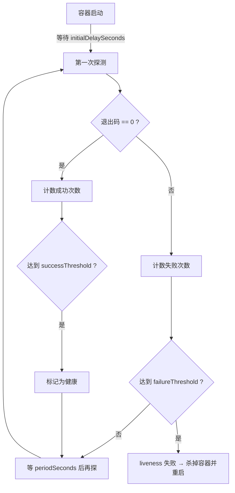
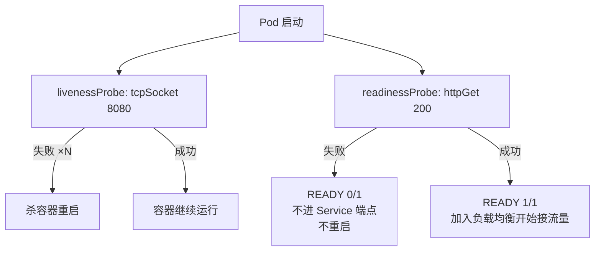
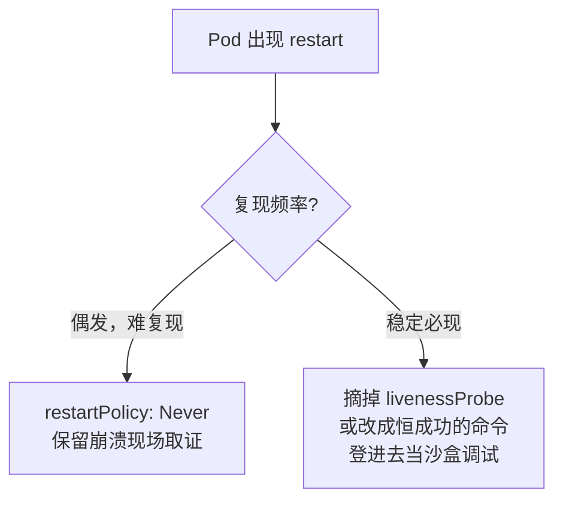

# Kubernetes 生产实践: 健康检查 —— livenessProbe 与 readinessProbe 的分工、三种探测方式与无限重启陷阱

集群里跑了一堆服务，Kubernetes 是怎么知道它们是否正常？

答案非常粗暴：**只要入口程序不退出，就认为你是正常的。** 所谓入口程序就是 entrypoint 指定的那个 —— 也就是**容器里 PID 为 1 的进程**。这个判断显然太简单，于是健康检查（probe）应运而生。

结论先给：**livenessProbe 负责"该不该重启你"，readinessProbe 负责"该不该把流量给你"。** 只用前者是不够的 —— 进程活着、端口也监听了，但应用还没初始化完成时 Service 就会把流量打过来，用户看到的就是转圈。本节还会踩一个真实的高频坑：**`initialDelaySeconds` 配得太小会陷入无限重启**。

## 纲要

- 默认的健康检查粗糙到只看 PID 1 是否退出
- 杀掉业务进程容器不会重启，杀掉入口程序才会
- Service 会自动摘除端口已不存在的后端
- 三种探测方式：`exec` / `httpGet` / `tcpSocket`
- `exec` 靠命令退出码判断：0 成功，非 0 失败
- `httpGet` 只有 **200** 才算成功，301/302 都算失败
- `tcpSocket` 只判断端口是否监听
- 六个时间参数的含义与取值建议
- liveness 失败 → 杀容器并重建，Pod **不会重新调度，一直在同一台机器**
- **readiness 失败 → 只是从负载均衡里摘掉，不重启**
- 合理地组合：TCP 查存活 + HTTP 查就绪
- `AVAILABLE` 字段由 readiness 决定
- `initialDelaySeconds` 小于应用启动时间 → 无限重启
- 排障策略：偶发重启改 `restartPolicy: Never` 保留现场；必现时摘掉探针做沙盒

## 没有健康检查时是什么样

拿一个没有健康检查的 Pod 做实验，进去看一眼：

```bash
kubectl exec -it webdemo-xxxxx -n dev -- sh

ps -ef                    # 有一个 java 进程
netstat -lntp | grep 8080 # 8080 在监听
```

浏览器访问正常。**现在把 java 进程（PID 14）杀掉：**

```bash
kill 14
ps -ef                    # java 进程已经没有了
```

再刷新浏览器：**再也刷不到这个旧页面的内容了，只会返回新的那个服务。**

这说明两点：

1. **Service 在负载均衡时会自动把端口已经不存在的后端排除掉**（8080 不再监听就不再往它身上轮询），这算是很智能的兜底；
2. **容器本身还是正常运行状态** —— 因为当前 shell（容器里的 PID 1 的阻塞点）没退出，Kubernetes 认为一切正常。

再看入口程序。查看 Dockerfile 里的 `ENTRYPOINT`，一般会是一个 `start.sh`，它最后执行了 `tail -f` 把自己阻塞住：

```text
ENTRYPOINT
└── start.sh
    ├── 启动 java 进程
    └── tail -f <某个文件>     ← PID 1 阻塞在这里，也是入口程序最后的驻留点
```

**把 `tail` 这个进程杀掉：**

```bash
kill 15
```

马上 shell 就退出了。再进去看进程，java 起来了、tail 也起来了：

```bash
kubectl get pod -n dev
# NAME            READY   STATUS    RESTARTS   AGE
# webdemo-xxxxx   1/1     Running   1          5m
```

**RESTARTS 等于 1，说明刚刚重启过一次。** 因为**入口程序运行结束了、容器就退出了。**

**这就是没有健康检查时的全部逻辑：只有入口程序退出，Kubernetes 才会重启 Pod；进程假死、端口挂掉、业务卡死，它一概不知。**

## 第一种：exec 探针

先看配置。**健康检查是针对容器的，所以配置和容器在同一级：**

```yaml
spec:
  containers:
    - name: springboot-web
      image: springboot-web:v1
      livenessProbe:
        exec:
          command:
            - sh
            - -c
            - ps -ef | grep java | grep -v grep
        initialDelaySeconds: 10
        periodSeconds: 10
        failureThreshold: 2
        successThreshold: 1
        timeoutSeconds: 5
```

这里的判断方式是**执行一条命令**：用 `ps` 找 java 进程，找到了就认为存活，找不到就认为不正常。

**判断依据是 shell 的退出值：每一条命令执行完都有退出码，等于 0 说明执行成功，非 0 说明执行失败。** 健康检查失败后的动作是**重启 Pod** —— 连进程都不存活了，问题已经很严重，必须重启。

### 六个时间参数

| 参数 | 含义 | 建议 |
| --- | --- | --- |
| `initialDelaySeconds` | 容器启动后**等待多久**才开始第一次探测 | **必须大于应用的预计启动时间**，给足 buffer |
| `periodSeconds` | 探测间隔 | 重要应用短一点，不重要就长一点（间隔越短性能消耗越大） |
| `failureThreshold` | **连续失败几次**才判定彻底失败 | 别配 1，给 2~3 次机会 |
| `successThreshold` | 从失败恢复到成功需要连续成功几次 | 一般 1 即可 |
| `timeoutSeconds` | 单次探测的最长等待时间 | 超时同样算失败，涉及网络的命令尤其要配 |



> 为什么 `initialDelaySeconds` 必须存在：**容器刚起来的时候，这条命令多半会执行失败**（进程还没起来），所以要等容器状态稳定了再开始探测。

### 验证

```bash
kubectl apply -f web-liveness.yaml -n dev
kubectl describe pod -n dev | grep -A8 Liveness
```

`describe` 里能看到 `Liveness` 这一段和对应的参数，说明配置生效了。

进到容器里手动执行那条命令看看：

```bash
ps -ef | grep java | grep -v grep
echo $?        # 0
# 改成一个不存在的进程名
ps -ef | grep aaaa | grep -v grep
echo $?        # 非 0
```

现在把 java 杀掉：

```bash
kill 14
```

**等一会儿（要连续两次失败），exec 进去的命令行会自动退出** —— 说明容器被干掉了。查看：

```bash
kubectl get pod -n dev
# webdemo-xxxxx   1/1   Running   1   6m
kubectl describe pod webdemo-xxxxx -n dev
```

```text
Events:
  Type     Reason     Message
  Normal   Killing    Killing container with id docker://xxx: Container failed liveness probe
```

**`Container failed liveness probe` —— 因为存活探针失败，容器被杀掉并重新创建。**

## 第二种：httpGet 探针

第二种方式的整体结构完全一样，只有探测类型不同：

```yaml
livenessProbe:
  httpGet:
    path: /examples/index.html
    port: 8080
    scheme: HTTP
  initialDelaySeconds: 5
  periodSeconds: 5
  failureThreshold: 1
```

`httpGet` 支持的参数：

| 参数 | 含义 | 注意 |
| --- | --- | --- |
| `path` | 要访问的应用路径 | 必须是一个能返回 **200** 的页面 |
| `port` | **容器本身的真实端口** | 不是 Service 端口，也不是 Ingress 端口 |
| `scheme` | HTTP / HTTPS | 默认 HTTP |

**判断标准：HTTP 返回 200 认为正常；不是 200 一律认为失败** —— 包括被 filter 拦掉、301/302 跳转。**所以选探测路径时一定要挑一个确实返回 200 的页面。**

### 无限重启陷阱

上面的配置 `initialDelaySeconds: 5`、`failureThreshold: 1` —— 5 秒后开始检查，失败一次就判死。apply 之后：

```bash
kubectl get pod -n dev
# webdemo-xxxxx   0/1   Running   2   1m
# 一会儿再看，已经 RESTARTS 7 了
```

浏览器访问一直在转圈。describe 一下：

```text
Events:
  Warning  Unhealthy  Liveness probe failed:
    Get http://172.24.1.9:8080/examples/index.html:
    net/http: request canceled (Client.Timeout exceeded while awaiting headers)
```

**原因就是这个应用 5 秒钟之内起不来。** 于是形成死循环：**重启 → 等 5 秒 → 检查失败 → 重启 → 再等 5 秒……**


**这是很多团队上 Kubernetes 时都遇到过的经典问题。配置健康检查一定要注意时间：**

- **`initialDelaySeconds` 要比预计启动时间多给一点** —— 预计 30 秒启动，就配 40~45 秒；
- **`failureThreshold` 别配 1**，第一次没过再给一次机会，配 2 甚至 3。

这样就避免了由于参数配置不当导致的程序异常。

### 岔开一句：为什么 Service 会把流量打到"半启动"的容器上

刚才浏览器访问时 Service 确实把请求转发过去了（不像第一次进程直接被杀那样被摘掉）。**因为容器的 8080 端口很快就处于 listening 状态**，但应用还在初始化。**Service 并不知道它能不能真的响应，只得先把它加进负载均衡试一试**，于是用户就访问到了还没初始化完的实例。

这种情况和"进程死掉导致端口不存在"不同，Service 没法自动规避 —— **解决办法是 readinessProbe。**

## 第三种：tcpSocket 探针

一共就三种健康检查方式，第三种是 TCP：

```yaml
livenessProbe:
  tcpSocket:
    port: 8080
  initialDelaySeconds: 10
  periodSeconds: 10
```

配置最简单 —— **检查端口是不是处于 Listen 状态。**

```text
三种探测方式对比
├── exec       执行一条命令，看退出码是否为 0
├── httpGet    访问 path:port，看状态码是否为 200
└── tcpSocket  连接 port，看端口是否监听
```

顺带补一个知识点：**容器重启时始终在同一台机器上**，不会一会儿飘到这儿一会儿飘到那儿 —— **重启不经过调度器重新调度。**

## readinessProbe：解决"能连但不能用"

回到半启动的问题。把 livenessProbe 那段复制一份，**改名字为 `readinessProbe`**：

```yaml
spec:
  containers:
    - name: springboot-web
      image: springboot-web:v1
      livenessProbe:
        tcpSocket:
          port: 8080
        initialDelaySeconds: 40
        periodSeconds: 10
      readinessProbe:
        httpGet:
          path: /examples/index.html
          port: 8080
        initialDelaySeconds: 40
        periodSeconds: 10
        failureThreshold: 3
```

**readinessProbe 的配置和 livenessProbe 一模一样，三种方式、各个参数都一样，只是作用完全不同：**

| 探针 | 失败后的动作 | 语义 |
| --- | --- | --- |
| **livenessProbe** | **杀掉容器并重启** | 程序不行了，必须重启恢复 |
| **readinessProbe** | **从 Service 的端点列表里摘掉** | 程序还活着，但现在还不能对外提供服务 |



上面这个组合是很典型的用法：**用 TCP 检测端口判断它是不是活着，用 HTTP 访问真实页面判断它是不是可以被用户访问。**

apply 之后观察：

```bash
kubectl get pod -n dev -w
# webdemo-xxxxx   0/1   Running   0   10s   ← Running 但还没 READY
# webdemo-xxxxx   1/1   Running   0   46s   ← 通过就绪检查
```

**它是 Running 状态，但没有 READY** —— 说明还没通过就绪检查。在整个过程中浏览器始终可以访问到正常服务，不会再出现那个 "mooc/404" 页面。

> 注意：重启之后之前在容器里手工改的静态页就消失了，因为那是容器可写层的东西。

另外，Deployment 的 `AVAILABLE` 字段就是**由 readiness 决定的**：

```bash
kubectl get deploy -n dev
# NAME      READY   UP-TO-DATE   AVAILABLE
# webdemo   1/1     1            1        ← readiness 通过才是 1
```

**`AVAILABLE` 为 0 说明这个 Pod 没有通过就绪检查。**

## 两个实战排障策略

最后分享两个处理重启类问题的小策略：

| 场景 | 做法 | 目的 |
| --- | --- | --- |
| **偶发重启**（几天、几十天发生一次） | 把 `restartPolicy` 从 `Always` 改成 **`Never`** | 健康失败时不重启，**保留现场**，可以拿到更多数据追查问题 |
| **稳定必现**（根本起不来） | **去掉 `livenessProbe`**，或改成 `ls` 这种永远成功的命令 | 让容器不被重启，**直接登录进去当沙盒调试** |



## API 速览

| 能力 | API / 命令 | 要点 |
| --- | --- | --- |
| 存活探针 | `containers[].livenessProbe` | 失败即重启容器 |
| 就绪探针 | `containers[].readinessProbe` | 失败只是摘流量，不重启 |
| 命令探测 | `probe.exec.command` | 退出码 0 才算成功 |
| HTTP 探测 | `probe.httpGet.{path,port,scheme}` | 只有 200 算成功，**port 是容器端口** |
| TCP 探测 | `probe.tcpSocket.port` | 只看端口是否监听 |
| 首次延迟 | `initialDelaySeconds` | **必须大于应用启动时间** |
| 探测间隔 | `periodSeconds` | 越短消耗越大 |
| 失败门槛 | `failureThreshold` | 别配 1，建议 2~3 |
| 成功门槛 | `successThreshold` | 一般 1 |
| 单次超时 | `timeoutSeconds` | 超时算失败 |
| 看探针是否生效 | `kubectl describe pod` | 找 `Liveness` / `Readiness` 段 |
| 看失败原因 | `kubectl describe pod` 的 Events | `Container failed liveness probe` |
| 保留现场 | `restartPolicy: Never` | 偶发问题取证用 |

## Demo 示例

### 1. 三段式探针的完整清单

```yaml
apiVersion: apps/v1
kind: Deployment
metadata:
  name: webdemo
  namespace: dev
spec:
  replicas: 1
  selector:
    matchLabels:
      app: webdemo
  template:
    metadata:
      labels:
        app: webdemo
    spec:
      containers:
        - name: springboot-web
          image: springboot-web:v1
          ports:
            - containerPort: 8080
          livenessProbe:
            tcpSocket:
              port: 8080
            initialDelaySeconds: 40
            periodSeconds: 10
            failureThreshold: 3
          readinessProbe:
            httpGet:
              path: /examples/index.html
              port: 8080
            initialDelaySeconds: 40
            periodSeconds: 10
            failureThreshold: 3
            timeoutSeconds: 5
```

### 2. 手动验证 exec 探针的退出码

```bash
POD=$(kubectl get pod -n dev -l app=webdemo -o jsonpath='{.items[0].metadata.name}')
kubectl exec -it "$POD" -n dev -- sh

# 容器内：
ps -ef | grep java | grep -v grep
echo $?      # 0 -> 探活成功

ps -ef | grep aaaa | grep -v grep
echo $?      # 非 0 -> 探活失败
```

### 3. 完整观察一次 liveness 失败

```bash
kubectl apply -f web-liveness.yaml -n dev

# 一、确认探针已生效
kubectl describe pod -n dev | grep -A8 -E 'Liveness|Readiness'

# 二、手动杀掉业务进程，触发连续失败
POD=$(kubectl get pod -n dev -l app=webdemo -o jsonpath='{.items[0].metadata.name}')
kubectl exec -it "$POD" -n dev -- kill 14

# 三、等待 failureThreshold 次失败后查看事件
kubectl describe pod "$POD" -n dev | tail -20
# Killing container ... Container failed liveness probe
kubectl get pod -n dev      # RESTARTS 变成 1
```

### 4. 复现无限重启并修掉

```bash
# 复现：把 initialDelaySeconds 调小到 5、failureThreshold 调到 1
kubectl apply -f web-http-bad.yaml -n dev
kubectl get pod -n dev -w        # RESTARTS 持续增长
kubectl describe pod -n dev | tail -20
# Liveness probe failed: Get http://.../examples/index.html:
#   net/http: request canceled (Client.Timeout exceeded while awaiting headers)

# 修复：延迟给足 + 失败次数放宽
kubectl apply -f web-http-good.yaml -n dev
kubectl get pod -n dev -w
```

### 总结

没有健康检查时 Kubernetes 只看 **PID 1 是否退出**：业务进程挂了容器照跑，只有入口程序结束才会重启 Pod。

三种探测方式各有适用场景：**`exec` 看命令退出码（0 成功）、`httpGet` 看状态码（只有 200 成功，注意 port 是容器端口不是 Service 端口）、`tcpSocket` 只看端口是否监听**；六个时间参数里 **`initialDelaySeconds` 必须大于应用预计启动时间**，`failureThreshold` 别配 1。

**最常见的坑就是这两个参数配得太激进，导致"重启 → 探测失败 → 重启"的无限循环**，生产上表现为服务一直在转圈。

**livenessProbe 失败 = 杀容器重启（且不重新调度，始终在同一台机器）；readinessProbe 失败 = 只从 Service 端点摘除，不重启。** 后者专门解决"端口已监听但应用还没初始化完就被 Service 加进负载均衡"的问题。

经典组合是 **TCP 查存活 + HTTP 查就绪**；Deployment 的 `AVAILABLE` 字段直接反映 readiness 状态。

排障时的两个实用手段：**偶发重启改 `restartPolicy: Never` 保留现场取证；稳定必现时摘掉 livenessProbe 或换成恒成功的命令，把容器当沙盒登录进去调试。**

