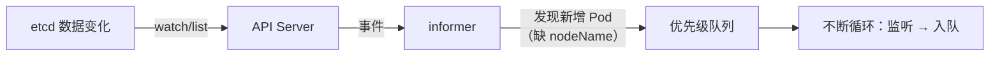
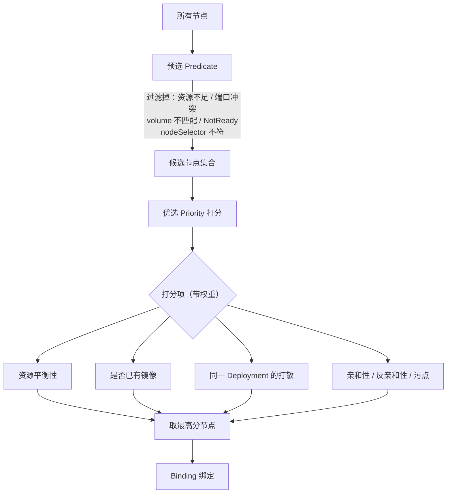
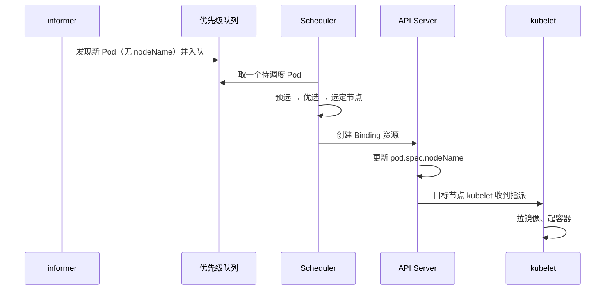
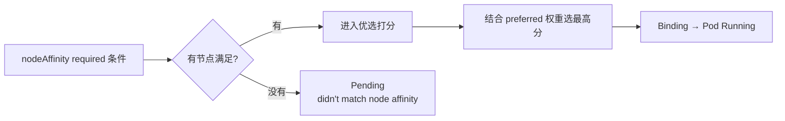

# Kubernetes 生产实践: Scheduler 调度（上）—— 调度器内部流程与 nodeAffinity 亲和性

前面反复用 Deployment 把服务跑到了某个 worker 节点上。但集群有那么多节点，**它是怎么选中其中一个的？** 这一节拆 Pod 的调度策略。

结论先给：**Scheduler 的核心流程是「优先级队列 + 本地 Cache + 两级筛选」**：informer 把待调度 Pod 放进优先级队列，调度器借助 Cache 里的节点快照做**预选（Predicate，过滤不满足条件的节点）**和**优选（Priority，给候选节点打分取最高分）**，最后通过 Binding 资源把结果写回 `pod.spec.nodeName`。用户能干预的主要是预选和优选环节 —— 比如 **nodeAffinity**。

## 纲要

- 调度器依赖 etcd + API Server 这两个模块
- 优先级队列：Pod 不对等，重要的先出队
- informer 通过 API Server 监听数据变化，发现新增 Pod 就丢进队列
- **新增的 Pod 少一个 `spec.nodeName`，调度后才会补上**
- Cache 缓存节点列表与详情，避免每个 Pod 都去请求 API Server
- 预选策略 Predicate：过滤掉不满足要求的节点
- 优选策略 Priority：给候选节点打分，取最高分
- 打分项很多且各有权重：资源平衡、镜像是否已存在、同 Deployment 是否已调度等
- Binding 也是一种资源，写回后由对应节点的 kubelet 拉起容器
- nodeAffinity 的两种语义：required（必须）与 preferred（最好）
- `nodeSelectorTerms` 是数组，**多个 term 之间是"或"**
- 每个 term 里的多个 `matchExpressions` 之间是**"且"**
- 配错标签会一直 Pending，`describe pod` 能看到原因

## 调度架构全景

先把调度流程图画出来。集群肯定有一个 **etcd** 数据中心，还有一个中枢 —— 最重要的大脑 **API Server**，它会与 etcd 交互。**这两个模块与调度器紧密关联。**

下面是一个大框，表示 **scheduler**：

```text
┌─────────────┐        ┌──────────────────────────────────────┐
│   etcd      │<──────>│            API Server                │
└─────────────┘        └──────────┬───────────────────────────┘
                                  │  watch / list        ▲ binding
                                  ▼                      │
┌──────────────────────────────────────────────────────────────┐
│                         Scheduler                            │
│  ┌──────────┐   ┌────────────────┐   ┌──────────────────┐   │
│  │ informer │──▶│ 优先级队列      │──▶│  Cache（节点快照）│   │
│  │ 监听变化  │   │ 待调度 Pod 列表 │   │  预选 → 优选      │   │
│  └──────────┘   └────────────────┘   └──────────────────┘   │
└──────────────────────────────────────────────────────────────┘
```

## 第一步：怎么知道要调度哪个 Pod

调度首先要知道要把哪个 Pod 调度走。Kubernetes 设计了一个队列来表示：**优先级队列，用于存储等待调度的 Pod 列表**。

**为什么是优先级队列？** 因为**每个 Pod 并不是对等的** —— 有的服务很重要，有的没那么重要。优先级高的 Pod 需要提前被调度，也就是提前出队。

谁来往队列里放消息？也是 Scheduler 的一个模块，叫 **informer**：



**informer 会通过 API Server 去监听 etcd 的数据变化**，比如发现有新增的 Pod。

**新增的 Pod 和普通 Pod 有什么区别？** 有 —— **新增的 Pod 少一个叫 `spec.nodeName` 的配置。** 可以验证：

```bash
kubectl get pod -n dev -o yaml | grep nodeName
```

已经调度过的 Pod 在 `spec` 下面有 `nodeName` 字段。**这个字段在 Pod 刚创建的时候是不存在的**，只有在经过调度器调度、确定了跑在哪个节点上之后才会被加上去。

informer 发现待调度的 Pod，把信息放进优先级队列，工作就完成了 —— 它之后就一直在「监听 → 入队」这个简单循环里。

## 第二步：节点信息从哪来

Pod 信息有了，接下来要决定调度到哪个节点。**得先知道手里有哪些节点、每个节点的详细情况。**

这些信息从 API Server 拿是对的，**但如果每调度一个 Pod 都去 API Server 请求很多信息，性能肯定差。** 于是 Kubernetes 设计了一个 **Cache**：

```text
Scheduler Cache 里缓存的内容
├── 节点列表                 都有哪些节点
└── 每个节点的详细信息
    ├── CPU / 内存 / 磁盘空间   剩余可分配资源
    ├── 节点上有哪些镜像         是否已有待运行镜像
    ├── 节点上运行了哪些 Pod
    └── 每个 Pod 的详细信息
```

从 API Server 拿到想要的数据全部缓存起来。这样节点数据和 Pod 数据都有了，就可以正式开始调度。

## 第三步：两级筛选

调度过程主要分两步。

### 预选策略 Predicate

**第一步用来初步过滤掉不符合需求的节点，叫预选策略（Predicate）。** 它包括：

| 检查项 | 说明 |
| --- | --- |
| 剩余 CPU / 内存 | 最基本，必须满足 Pod 的 requests |
| 端口冲突 | 节点上端口不能重复占用 |
| volume 类型匹配 | Pod 声明的存储类型必须可行 |
| `nodeSelector` 规则 | 前面讲过的标签约束 |
| 节点状态 | **必须 Ready**，NotReady 直接排除 |
| 亲和性 / 反亲和性 / 污点 | 后面要讲的约束都要满足 |

**总之，预选就是找到不满足要求的节点，把它们统统排除掉**，剩下的都是可以调度的候选。

### 优选策略 Priority

**第二步对上一步筛出来的 Node 进行评分。** 评分比较复杂，有很多项，每项还有各自的权重，比如：

- 整体的 CPU、内存资源**平衡性**；
- **Node 上是否存在需要运行的镜像**（有镜像就不用重新拉，是加分项）；
- **同一个 Deployment 下的 Pod 是否已经调度到该节点**（用于打散）；
- 亲和性、反亲和性、污点等同样参与加权计算。

**一项一项统计之后，对每个 Pod 得到每个候选节点的评分，选择最高分的 Node 作为最终调度目标。**



## 第四步：绑定

节点选中之后，Pod 和节点就对应上了，它们之间要建立一个**绑定关系（Binding）**。

**Binding 也是 Kubernetes 的一种资源。** 建立绑定之后，会把绑定信息告诉 API Server；**API Server 负责去更新 Pod 的 `spec.nodeName` 字段**，然后指派给目标节点上的 kubelet,**由 kubelet 把服务真正拉起来**。



## 这套流程和我们有什么关系

有人会问：调度流程是 Kubernetes 自己定义好的，跟使用者有什么关系？

关系很大。**前面讲 Label 时在 Deployment 里配的 `nodeSelector`（选择 `disktype=SSD` 的节点），就是在这个流程的"预选策略"这一步完成过滤的。**

除了 nodeSelector，还有很多跟调度相关的配置，下面开始实践。

## nodeAffinity：节点亲和性

先看一份配置 `web-node.yaml`。它跟之前的 webdemo 基本一样，只是多了这一块：

```yaml
apiVersion: apps/v1
kind: Deployment
metadata:
  name: webdemo-node
  namespace: dev
spec:
  replicas: 1
  selector:
    matchLabels:
      app: webdemo
  template:
    metadata:
      labels:
        app: webdemo
    spec:
      containers:
        - name: springboot-web
          image: springboot-web:v1
          ports:
            - containerPort: 8080
      affinity:
        nodeAffinity:
          requiredDuringSchedulingIgnoredDuringExecution:
            nodeSelectorTerms:
              - matchExpressions:
                  - key: kubernetes.io/arch
                    operator: In
                    values:
                      - amd64
          preferredDuringSchedulingIgnoredDuringExecution:
            - weight: 1
              preference:
                matchExpressions:
                  - key: disktype
                    operator: NotIn
                    values:
                      - SSD
```

```text
spec.affinity.nodeAffinity
├── requiredDuringSchedulingIgnoredDuringExecution    必须满足
│   └── nodeSelectorTerms[]                           多个 term 之间是「或」
│       └── matchExpressions[]                        多个表达式之间是「且」
│           └── { key, operator, values }            In / NotIn / Exists / DoesNotExist
└── preferredDuringSchedulingIgnoredDuringExecution   最好满足
    └── [] 每一项
        ├── weight: 1                                 权重（打分时的占比）
        └── preference.matchExpressions[]             同样是 key/operator/values
```

### 两种语义

名字很长，拆开看就清楚了：

| 字段 | 含义 | 不满足时 |
| --- | --- | --- |
| `requiredDuringScheduling...` | **必须**满足下面这些条件才能调度 | Pod 一直 Pending |
| `preferredDuringScheduling...` | **最好**满足 | 仍然可以调度，只是在打分时影响权重 |

**`preferred` 每项都有一个 `weight`（权重），表示在多个"最好"之间的占比。** 它没有必要设计成"且/或"的逻辑关系 —— 因为它本来就不是硬性要求，需要的是权重而不是强一致的逻辑。

> 名字里的 `IgnoredDuringExecution` 表示：**这些规则只在调度时（Scheduling）生效，Pod 运行起来之后节点标签变了也不管。**

### operator 与 Label 那节一致

`key` 是节点标签的名字，`operator` 支持 `In`、`NotIn`、`Exists` 等，`values` 是一个数组 —— 和前面 Label 一节讲的是同一套写法。

### 验证必须条件

例子里 required 指定的是 `kubernetes.io/arch In [amd64]`。**这是一个 Kubernetes 自动生成的标签**，看一眼：

```bash
kubectl get node node-120 -o yaml | grep -A5 labels
```

```yaml
labels:
  beta.kubernetes.io/arch: amd64
  beta.kubernetes.io/os: linux
  kubernetes.io/arch: amd64
  kubernetes.io/hostname: node-120
  kubernetes.io/os: linux
```

也就是说：**这个 Pod 需要运行在 CPU 架构是 amd64 的机器上**，显然所有节点都满足。

preferred 指定的是 `disktype NotIn [SSD]`，即最好不要是 SSD 节点。看结果：

```bash
kubectl get pod -n dev -o wide
# webdemo-node-xxxxx   1/1   Running   0   30s   node-120
```

**落在 node-120 上。** 而 node-121 才有 `disktype=SSD` 标签，node-120 没有 —— **配置生效了。**

### 配错标签：Pending

把 required 里的架构要求随便改成一个不存在的值：

```yaml
          requiredDuringSchedulingIgnoredDuringExecution:
            nodeSelectorTerms:
              - matchExpressions:
                  - key: kubernetes.io/arch
                    operator: In
                    values:
                      - arm999
```

apply 之后：

```bash
kubectl get pod -n dev
# webdemo-node-xxxxx   0/1   Pending   0   2m
kubectl describe pod webdemo-node-xxxxx -n dev
```

```text
Events:
  Type     Reason            Message
  Warning  FailedScheduling  0/2 nodes are available:
           2 node(s) didn't match node selector / node affinity
```

**新的 Pod 处于 Pending 状态**，`describe` 显示原因是没有节点匹配 node affinity —— 预选阶段把所有节点都排除了，自然没得调度。



## API 速览

| 能力 | API / 配置 | 要点 |
| --- | --- | --- |
| 看 Pod 被调度到哪 | `kubectl get pod -o wide` | 也就是 `spec.nodeName` |
| 看字段原文 | `kubectl get pod -o yaml \| grep nodeName` | 调度前没有这个值 |
| 看节点标签 | `kubectl get node NODE -o yaml \| grep -A5 labels` | 含 `kubernetes.io/arch` 等内置标签 |
| 节点亲和性 | `spec.affinity.nodeAffinity` | 位于 Pod 模板的 spec 下 |
| 硬约束 | `requiredDuringSchedulingIgnoredDuringExecution` | 不满足则 Pending |
| 软约束 | `preferredDuringSchedulingIgnoredDuringExecution` | 带 `weight`，只影响打分 |
| 选择条件 | `nodeSelectorTerms[].matchExpressions[]` | term 之间是或，表达式之间是且 |
| 匹配算符 | `In` / `NotIn` / `Exists` / `DoesNotExist` | 与 Label 一节一致 |
| 调度失败排查 | `kubectl describe pod` | `didn't match node selector` / `node affinity` |

## Demo 示例

### 1. 完整清单：一个「或」+「且」的组合示例

```yaml
apiVersion: apps/v1
kind: Deployment
metadata:
  name: webdemo-node
  namespace: dev
spec:
  replicas: 1
  selector:
    matchLabels:
      app: webdemo
  template:
    metadata:
      labels:
        app: webdemo
    spec:
      containers:
        - name: springboot-web
          image: springboot-web:v1
          ports:
            - containerPort: 8080
      affinity:
        nodeAffinity:
          # 必须：架构是 amd64
          requiredDuringSchedulingIgnoredDuringExecution:
            nodeSelectorTerms:
              - matchExpressions:
                  - key: kubernetes.io/arch
                    operator: In
                    values: [amd64]
              # 再写一个 term —— 两个 term 之间是「或」的关系
              - matchExpressions:
                  - key: node-role.kubernetes.io/master
                    operator: Exists
          # 最好：不是 SSD 节点，权重 1
          preferredDuringSchedulingIgnoredDuringExecution:
            - weight: 1
              preference:
                matchExpressions:
                  - key: disktype
                    operator: NotIn
                    values: [SSD]
```

### 2. 观察调度结果

```bash
kubectl apply -f web-node.yaml -n dev

# 落在哪个节点
kubectl get pod -n dev -o wide

# 对比两个节点的标签，确认 preferred 是否起了作用
kubectl get node node-120 -o jsonpath='{.metadata.labels}'
kubectl get node node-121 -o jsonpath='{.metadata.labels}'
```

### 3. 制造 Pending 并排查

```bash
# 把 required 里的 values 改成一个不存在的架构
kubectl apply -f web-node-bad.yaml -n dev

kubectl get pod -n dev
POD=$(kubectl get pod -n dev -o jsonpath='{.items[-1].metadata.name}')
kubectl describe pod "$POD" -n dev | tail -10
# FailedScheduling: 0/2 nodes are available: 2 node(s) didn't match node affinity

# 改回来之前，先确认节点到底有哪些标签
kubectl get node --show-labels
```

### 总结

Scheduler 的依赖只有两个：**etcd**（数据中心）和 **API Server**（大脑）；调度器自身由 informer、优先级队列、Cache 三个主要部件构成。

**informer 通过 API Server 监听数据变化**，发现新增 Pod（特征是**没有 `spec.nodeName`**）就放进优先级队列；队列之所以区分优先级，是因为 **Pod 之间不对等，重要的要先被调度**。

**Cache 缓存了节点列表和每个节点的 CPU/内存/磁盘、已有镜像、运行中 Pod 等详情**，避免每次调度都去请求 API Server —— 这是性能上的关键设计。

调度本身是**两级筛选**：**预选 Predicate 过滤掉资源不足、端口冲突、volume 不匹配、NotReady、不满足 nodeSelector/亲和性的节点**；**优选 Priority 给候选节点打分**（资源平衡性、镜像是否已存在、同 Deployment 打散、亲和性等带权项），取最高分。

结果通过 **Binding 资源**写回 API Server，由 API Server 更新 `pod.spec.nodeName`，再由目标节点的 kubelet 拉起容器。

**nodeAffinity 提供了 required（必须，不满足就 Pending）和 preferred（最好，靠 weight 影响打分）两种语义**；`nodeSelectorTerms` 多个 term 之间是**或**，term 内多个 `matchExpressions` 之间是**且**。配错了就 `describe pod` 看 FailedScheduling 的原因。

