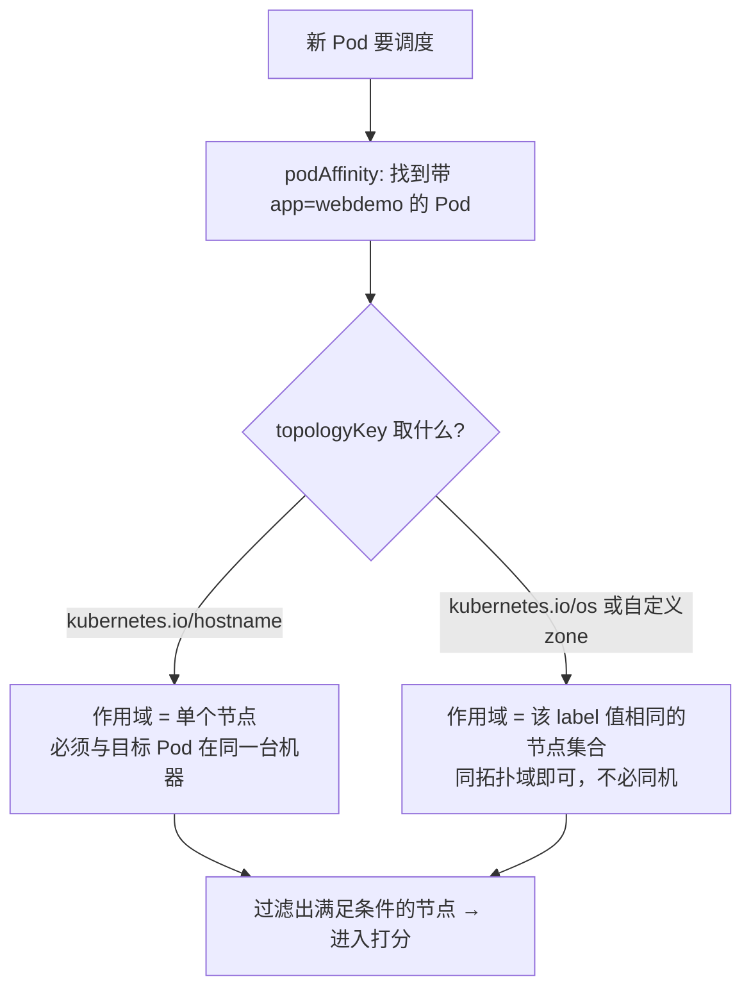
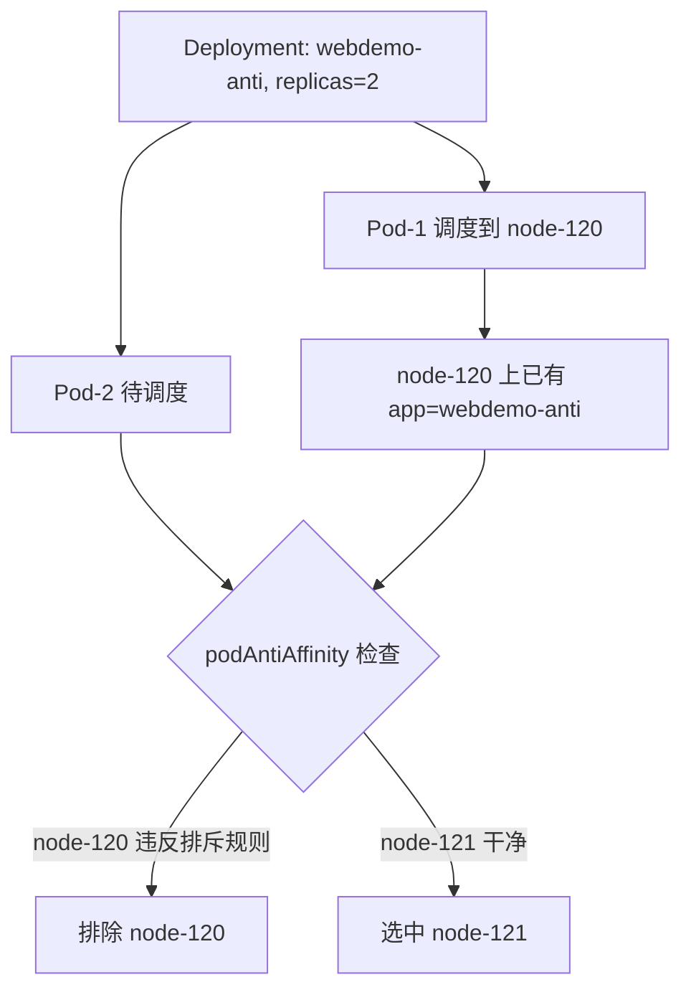
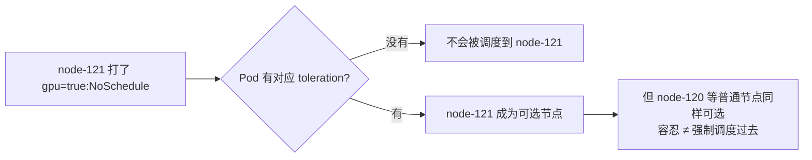

# Kubernetes 生产实践: Scheduler 调度（下）—— podAffinity 反亲和打散、taint 与 toleration

上一节讲了节点亲和性（nodeAffinity），这一节讲另外三种调度手段：**Pod 亲和性、Pod 反亲和性，以及污点与容忍。**

结论先给：**nodeAffinity 是"我要被调度到哪类节点"，taint 反过来是"节点拒绝谁"；podAffinity / podAntiAffinity 则是"我要不要跟某个 Pod 在一起"，靠 `topologyKey` 界定作用域。** 生产上最高频的用法是 podAntiAffinity 的自排斥 —— **让同一个 Deployment 的多个副本不要落在同一台机器上**。另外要记住：**toleration 只是"容忍"，不代表"一定要去"。**

## 纲要

- nodeAffinity 的 preferred 不满足也可以正常调度
- podAffinity 处理的是 **Pod 与 Pod** 之间的亲和关系，作用于一定**区域范围**
- `topologyKey` 是关键词，取节点上一个 label 的名字来界定范围
- `kubernetes.io/hostname` 就是最常见的取值 —— 范围缩小到"同一个节点"
- podAntiAffinity 与 affinity 语义相反，两者可以同时配置
- **经典写法：反亲和自己，replicas 打散到不同节点**
- 反亲和与副本数组合不好会互相排斥导致 Pending
- taint 与 nodeAffinity 相反：**让 Node 去拒绝 Pod**
- 三种 effect：NoSchedule / PreferNoSchedule / NoExecute
- NoExecute 会驱逐已运行的 Pod，还能设容忍时间
- 典型场景：专用节点、特殊硬件（GPU / SSD）机器
- 打了污点后，即使是 preferred 也不会被选中
- toleration 的 `effect` 必须配，且要和污点的 effect 一致
- toleration 只是容忍，不代表只会调度到那个节点

## 先复习：preferred 不满足也没关系

把 nodeAffinity 的 preferred 条件改成 `disktype In [SSDxxxx]`（明显不存在的值）试试：

```yaml
preferredDuringSchedulingIgnoredDuringExecution:
  - weight: 1
    preference:
      matchExpressions:
        - key: disktype
          operator: In
          values: [SSDxxxx]
```

容器很快就跑起来了。**这说明 preferred 只是"最好是什么样"，找不到也没关系。**

## podAffinity：Pod 与 Pod 的亲和性

节点的亲和性很好理解 —— 想调度到哪类节点、不想调度到哪类节点。**Pod 的亲和性处理的是一定区域范围内，一个 Pod 跟其他 Pod 的亲和关系**：想跟某些 Pod 运行在一起，或者不想跟某些 Pod 运行在一起。

```yaml
spec:
  affinity:
    podAffinity:
      requiredDuringSchedulingIgnoredDuringExecution:
        - labelSelector:
            matchExpressions:
              - key: app
                operator: In
                values: [webdemo]
          topologyKey: kubernetes.io/hostname
      preferredDuringSchedulingIgnoredDuringExecution:
        - weight: 1
          podAffinityTerm:
            labelSelector:
              matchExpressions:
                - key: app
                  operator: In
                  values: [webdemo-node]
            topologyKey: kubernetes.io/hostname
```

```text
spec.affinity.podAffinity
├── requiredDuringSchedulingIgnoredDuringExecution[]   必须
│   ├── labelSelector.matchExpressions[]               目标 Pod 的标签条件
│   └── topologyKey                                    作用域：取节点 label 的名字
└── preferredDuringSchedulingIgnoredDuringExecution[]  最好
    ├── weight                                         权重
    └── podAffinityTerm                                结构同 required 那一项
```

### topologyKey 是关键

**`topologyKey` 的值对应节点上一个 label 的名字。** 每个节点都有 `kubernetes.io/hostname` 这个标签（就是节点的主机名），所以这里配置它，**限制范围就是"节点"这一层**。



上面的配置翻译过来：**这个 Pod 要跟 `app=webdemo` 的 Pod 运行在同一个节点上。**

实测：Pod 跑到了 node-120，而 node-120 上确实跑着 `webdemo-node`（以及同样使用 `app=webdemo` 标签的其它 Pod）。两个节点上都有符合的 Pod，所以它可以调度到任意一个满足条件的位置。

preferred 倾向于跟 `app=webdemo-node` 的 Pod 同节点，看结果 —— `webdemo-node` 在 node-120，新 Pod 也在 node-120，**实现了 preferred。**

> 当然 preferred 也有可能实现不了：**如果 node-120 资源已经满了，它就只能掉到 node-121 上。**

### 条件不满足：Pending

把 required 里的 `app` 值改成 `webdemo2`（肯定不存在）：

```bash
kubectl get pod -n dev
# webdemo-pod-xxxxx   0/1   Pending   0   1m
```

**处于 Pending 状态，说明找不到符合条件的 Pod 它就不运行** —— 这也反证了 **required 确实是强制的**。

## podAntiAffinity：不要跟它在一起

Pod 除了亲和性调度，还有**反亲和性 —— podAntiAffinity**。亲和性和反亲和性**可以同时配置，两者不冲突**（这里为了方便演示先改成只用反亲和）。

```yaml
spec:
  affinity:
    podAntiAffinity:
      requiredDuringSchedulingIgnoredDuringExecution:
        - labelSelector:
            matchExpressions:
                - key: app
                  operator: In
                  values: [webdemo-node]
          topologyKey: kubernetes.io/hostname
```

意思是：**不要跟 `app=webdemo-node` 的 Pod 运行在一起。** 之前它在 node-120，新 Pod 就被赶到了 node-121。

### 最实用的写法：反亲和自己

还有一种非常常见的配置 —— **把 labelSelector 的 value 写成它自己的 Pod 标签**，也就是**它不想跟自己运行在同一台机器上**：

```yaml
apiVersion: apps/v1
kind: Deployment
metadata:
  name: webdemo-anti
  namespace: dev
spec:
  replicas: 2
  selector:
    matchLabels:
      app: webdemo-anti
  template:
    metadata:
      labels:
        app: webdemo-anti
    spec:
      containers:
        - name: springboot-web
          image: springboot-web:v1
          ports:
            - containerPort: 8080
      affinity:
        podAntiAffinity:
          requiredDuringSchedulingIgnoredDuringExecution:
            - labelSelector:
                matchExpressions:
                  - key: app
                    operator: In
                    values: [webdemo-anti]
              topologyKey: kubernetes.io/hostname
```

把 `replicas` 改成 2 看效果：**一个在 node-120，一个在 node-121，被分开了。**



**当某些服务不想跑在同一台机器上时（避免单机故障一次性打掉所有副本），就用这种设置。**

### 会翻车的组合

如果想反过来让尽量跑在同一台机器上，把 `podAntiAffinity` 改成 `podAffinity` 直接 apply —— 结果却 **Pending** 了，很奇怪。

```bash
kubectl describe pod webdemo-anti-xxxxx -n dev
```

```text
FailedScheduling: 0/2 nodes are available: 2 node(s) didn't match inter pod anti-affinity rules
```

**原因：之前那批 Pod 配置的还是反亲和（排斥），已经存在的这些 Pod 会排斥新 Pod。** 于是僵住了 —— **只有两个节点、却指定了两个实例**，无论怎么放都会踩到已存在 Pod 的排斥规则。

两种解法：

| 解法 | 做法 |
| --- | --- |
| 加节点 | 三个节点配两个实例就没这个问题了 |
| 先删再建 | `kubectl delete -f xxx.yaml` 然后重新 apply，**旧 Pod 完全停止后新 Pod 才创建**，此时两副本都在同一个节点上 |

## 污点与容忍：让 Node 去拒绝 Pod

前面讲的 nodeAffinity 是在 Pod 上定义属性，让它能/不能被调度到某些节点。**最后一种调度策略思路恰好相反 —— 污点（taint）是让 Node 去拒绝 Pod。**

可以通过在 Node 上设置一个或多个污点来拒绝 Pod 运行，**除非某些 Pod 明确声明了能容忍这些污点，否则它们不可运行在该节点上。**

典型场景：

| 场景 | 做法 |
| --- | --- |
| 专用节点 | 某些节点只想给特定类型的应用用，打上污点后普通 Pod 就调度不上来 |
| 特殊硬件 | GPU / SSD 这类设备机器很少，不想给一般 Pod 用，Pod 需要用就配好污点容忍 |

### 打污点

```bash
kubectl taint node node-121 gpu=true:NoSchedule
```

语法是 `kubectl taint node <节点> <key>=<value>:<effect>`。三种 effect：

| effect | 含义 |
| --- | --- |
| `NoSchedule` | **调度器不会把 Pod 调度到这个节点上** |
| `PreferNoSchedule` | 最好不要把 Pod 调度到这个节点上（软约束） |
| `NoExecute` | 除了不调度，**已经运行在该节点上的 Pod 会被驱逐**；不设容忍时间就立刻驱逐，也可以设置成比如 30 分钟后再驱逐 |

### 打了污点之后，preferred 也不管用

给 node-121 打上 `gpu=true:NoSchedule` 后，看一个 preferred `disktype In [SSD]` 的例子 —— **node-121 才有 SSD 标签**，按常理应该倾向 node-121。

实际结果：`webdemo-node` 还是运行在 node-120 上。

**因为 node-121 打了污点，没有容忍它的 Pod 无论如何也上不去** —— preferred 只是加分，过不了污点这一关。

### 配置容忍

污点容忍也是**跟 `containers` 同一级**配置：

```yaml
spec:
  containers:
    - name: springboot-web
      image: springboot-web:v1
      ports:
        - containerPort: 8080
  tolerations:
    - key: gpu
      operator: Equal
      value: "true"
      effect: NoSchedule
```

```text
spec.tolerations[]
├── key        对应打污点时的 key（gpu）
├── operator   Equal（值相等才算） / Exists（只要 key 存在，与值无关）
├── value      对应污点的 value（Equal 时才需要）
└── effect     必须配，且要与打污点时的 effect 完全一致（NoSchedule）
```

两个关键点：

1. **`operator` 有两种**：`Equal`（保持不变时才生效）、`Exists`（**只要这个 key 存在就生效，与值无关**）；
2. **`effect` 一定要配置，并且值要跟打污点时写的一模一样**（这里是 `NoSchedule`）。

apply 之后，这个 Pod 运行到了 node-121 —— **容忍生效了。**

### 容忍 ≠ 必须去

那它是不是一定要运行在 node-121 呢？把副本数改成 3 试试：

```text
webdemo-tol-aaa   1/1   Running   node-121
webdemo-tol-bbb   1/1   Running   node-121
webdemo-tol-ccc   1/1   Running   node-120
```

**有一个实例跑在了 node-120 上。** 说明 **污点容忍只是"我能忍"，而不是"我一定要跟你在一起"** —— 其他节点该调度还是会调度。



## API 速览

| 能力 | API / 命令 | 要点 |
| --- | --- | --- |
| Pod 亲和性 | `spec.affinity.podAffinity` | 想跟哪些 Pod 在一起 |
| Pod 反亲和性 | `spec.affinity.podAntiAffinity` | 不要跟哪些 Pod 在一起 |
| 作用域 | `topologyKey` | 取节点 label 名，`kubernetes.io/hostname` = 同节点 |
| 目标 Pod 条件 | `labelSelector.matchExpressions` | key / operator / values |
| 软性亲和 | `preferredDuringScheduling...` + `weight` | 打分加权，不满足也能调度 |
| 打污点 | `kubectl taint node NODE key=value:NoSchedule` | 三种 effect |
| 取消污点 | `kubectl taint node NODE key-` | 注意结尾的减号 |
| 配置容忍 | `spec.tolerations[]` | 与 `containers` 同级 |
| 宽容对待存在性 | `operator: Exists` | key 存在即可，不看 value |
| 必须一致 | `effect` | 必须与污点 effect 完全相同 |
| 调度失败排查 | `kubectl describe pod` | `didn't match inter pod anti-affinity rules` |

## Demo 示例

### 1. 副本打散（生产最常用的反亲和写法）

```yaml
apiVersion: apps/v1
kind: Deployment
metadata:
  name: webdemo-anti
  namespace: dev
spec:
  replicas: 2
  selector:
    matchLabels:
      app: webdemo-anti
  template:
    metadata:
      labels:
        app: webdemo-anti
    spec:
      containers:
        - name: springboot-web
          image: springboot-web:v1
          ports:
            - containerPort: 8080
      affinity:
        podAntiAffinity:
          requiredDuringSchedulingIgnoredDuringExecution:
            - labelSelector:
                matchExpressions:
                  - key: app
                    operator: In
                    values: [webdemo-anti]
              topologyKey: kubernetes.io/hostname
```

```bash
kubectl apply -f web-anti.yaml -n dev
kubectl get pod -n dev -o wide -l app=webdemo-anti
# 两个副本落在不同的节点上
```

### 2. 污点 + 容忍的完整闭环

```bash
# 一、给 SSD/GPU 节点打污点，拒绝普通 Pod
kubectl taint node node-121 gpu=true:NoSchedule
kubectl describe node node-121 | grep -A5 Taints

# 二、先证明普通 Pod 上不去（含 preferred）
kubectl apply -f web-prefer-ssd.yaml -n dev
kubectl get pod -n dev -o wide        # 仍然在 node-120

# 三、配了容忍后再试
kubectl apply -f web-toleration.yaml -n dev
kubectl get pod -n dev -o wide -l app=webdemo-tol   # 落在 node-121

# 四、扩容证明「容忍 ≠ 强制」
kubectl scale deploy webdemo-tol --replicas=3 -n dev
kubectl get pod -n dev -o wide -l app=webdemo-tol   # node-121 两个 + node-120 一个

# 五、清理污点
kubectl taint node node-121 gpu-
```

### 3. 反亲和导致的 Pending 排查

```bash
kubectl apply -f web-affinity-conflict.yaml -n dev
kubectl get pod -n dev

POD=$(kubectl get pod -n dev -o jsonpath='{.items[-1].metadata.name}')
kubectl describe pod "$POD" -n dev | tail -12
# FailedScheduling: 0/2 nodes are available:
#   2 node(s) didn't match inter pod anti-affinity rules

# 解法：先删干净再重建
kubectl delete -f web-affinity-conflict.yaml -n dev
kubectl apply -f web-affinity-conflict.yaml -n dev
kubectl get pod -n dev -o wide
```

### 总结

nodeAffinity 的 preferred 不满足完全不影响调度，找不到"最好"就退而求其次；**required 不满足则直接 Pending。**

**podAffinity / podAntiAffinity 描述 Pod 与 Pod 的关系，靠 `topologyKey` 界定作用域** —— 取 `kubernetes.io/hostname` 就把范围锁定到"同一台机器"，换成 zone 类标签则是"同一拓扑域"。

最实用的写法是 **podAntiAffinity 配上自己的标签**：限制同一 Deployment 的多个副本不要落在同一节点，避免单点故障一次带走全部副本。注意这种写法在**节点数少于副本数**时会互相排斥导致 Pending，改配置前最好先删除旧 Pod 再重建。

**污点（taint）与 nodeAffinity 的思路相反：它由 Node 主动拒绝 Pod**。三种 effect 分别是 `NoSchedule`（不调度）、`PreferNoSchedule`（最好不调度）、`NoExecute`（连已运行的 Pod 也要驱逐，可配容忍时间）。

典型用途是**专用节点和特殊硬件节点**（GPU / SSD）。节点一旦打了污点，**即使 Pod 的 preferred 指向它也不会被选中** —— 污点优先于打分。

**tolerations 必须保证 `effect` 与污点完全一致**，`operator` 可以用 `Equal`（值相等）或 `Exists`（只看 key 存在与否）；**容忍只表示"可以去"，不表示"只去那里"，扩容时副本照样会落到普通节点上。**

