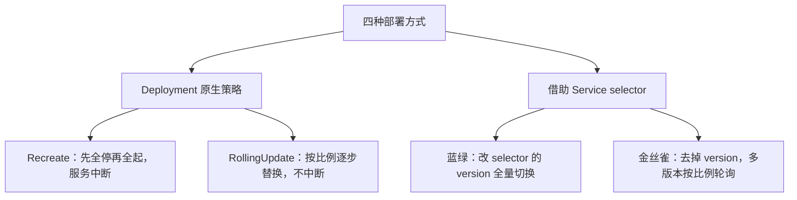
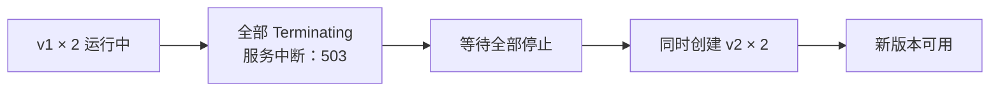
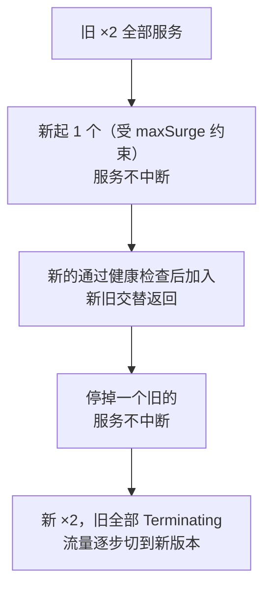
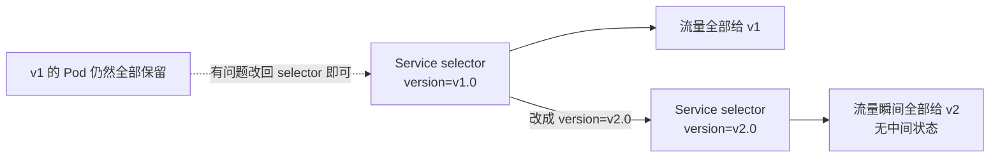
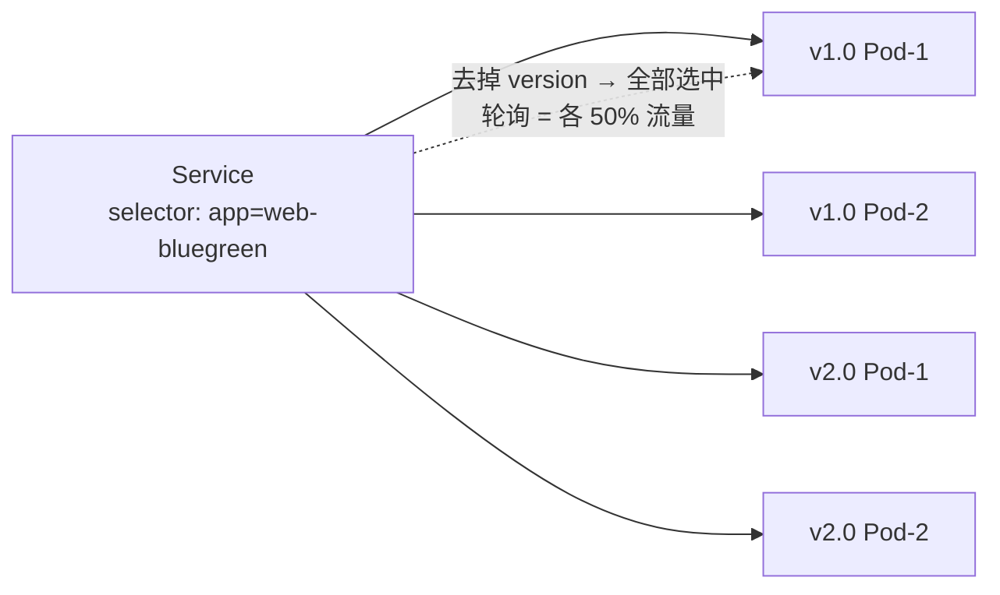

# Kubernetes 生产实践: 部署策略详解 —— 重建、滚动更新、蓝绿与金丝雀

前面更新服务一直用同一种方式：**改 Deployment 配置，然后 `kubectl apply -f`**。这是最基本也最常见的一种，叫**滚动更新（RollingUpdate）**。除此之外还有哪些选择？

结论先给：**四种部署方式分成两类 —— Recreate 和 RollingUpdate 是 Deployment 自己支持的部署策略（`spec.strategy.type`）；蓝绿部署和金丝雀部署则是利用 Service 的 label selector 机制，结合多个 Deployment 完成。** 前者原生、后者灵活：**金丝雀只要把 Service 的 selector 去掉版本标签，流量就按比例在多个版本间轮询**，这是最省事的 A/B 测试方案。

## 纲要

- 四种部署方式及其归属：两种是 Deployment 策略，两种是利用 Service selector
- Recreate：**先全部停旧，再全部起新**，服务会中断
- Recreate 适用场景不多：资源紧张且要求实例分散时
- RollingUpdate 的两个参数：`maxSurge` 与 `maxUnavailable`
- 不配置时的默认值就是 RollingUpdate + 25% / 25%
- 滚动过程中会有新旧版本交替的一段时间，但服务不中断
- `kubectl rollout pause` 暂停滚动，用来验证第一个新实例
- `kubectl rollout resume` 恢复、`kubectl rollout undo` 回滚
- 蓝绿：新旧 Deployment 并存，靠**改 Service selector 的 version** 瞬间切流量
- 蓝绿的回滚同样只是把 selector 改回去
- 金丝雀：**去掉 selector 里的 version**，让新旧版本同时被选中
- 控制实例数比例就能控制流量比例（1/10 实例 ≈ 10% 流量）

## 四类部署的定位

| 部署方式 | 归属 | 核心机制 |
| --- | --- | --- |
| **Recreate（重建）** | Deployment 原生支持 | `spec.strategy.type: Recreate` |
| **RollingUpdate（滚动更新）** | Deployment 原生支持 | `spec.strategy.type: RollingUpdate` |
| **蓝绿部署** | 非原生 | 两个 Deployment 并存 + 切 Service 的 selector |
| **金丝雀部署** | 非原生 | 多版本 Pod 共用一个 Service 的 selector |



## 一、Recreate 重建

配置里多了一处 `spec.strategy`：

```yaml
apiVersion: apps/v1
kind: Deployment
metadata:
  name: web-recreate
  namespace: dev
spec:
  replicas: 2
  strategy:
    type: Recreate
  selector:
    matchLabels:
      app: web-recreate
  template:
    metadata:
      labels:
        app: web-recreate
    spec:
      containers:
        - name: springboot-web
          image: springboot-web:v1
          ports:
            - containerPort: 8080
```

配好 Ingress（`web-recreate.imooc.com`）后浏览器访问正常。随便改点东西触发更新 —— 比如给 `template.metadata.labels` 加一个 `type: webapp`：

```bash
kubectl apply -f web-recreate.yaml -n dev
kubectl get pod -n dev
```

```text
NAME                           READY   STATUS        RESTARTS   AGE
web-recreate-xxxxx             1/1     Terminating   0          5m
web-recreate-yyyyy             1/1     Terminating   0          5m
```

**两个旧 Pod 正在 Terminating，一个新的都没创建。** 这时候访问：

```text
503 Service Temporarily Unavailable
```

**Nginx 返回了 503，服务已经不正常了。** 等旧的彻底停止之后，新的一批 Pod 才同时起来：

```text
web-recreate-zzzzz   0/1   ContainerCreating   0   2s
web-recreate-wwwww   0/1   ContainerCreating   0   2s
web-recreate-zzzzz   1/1   Running             0   15s
web-recreate-wwwww   1/1   Running             0   15s
```



**特点和代价都很清楚：不管有几个实例，必须把旧实例全部先停掉，停完再同时启动新的，过程中服务是间断的。**

**这种部署方式使用场景并不多。** 想得到的典型场景：**资源不太充足**时 —— 比如有 5 个节点、一个服务跑 5 个实例、并且要求这 5 个实例不能落在同一个节点上。这种约束下用滚动更新会互相卡住，**用 Recreate 可以同时把全部实例停掉再同时起来**，测试环境里求快速重启就很好用。

## 二、RollingUpdate 滚动更新

```yaml
spec:
  replicas: 2
  strategy:
    type: RollingUpdate
    rollingUpdate:
      maxSurge: 25%
      maxUnavailable: 25%
```

| 参数 | 含义 | 例子 |
| --- | --- | --- |
| `maxSurge` | 滚动过程中**最多可以超出期望实例数多少**（百分比或绝对数） | 4 个实例 + 25% → **每次最多多启动 1 个** |
| `maxUnavailable` | 滚动过程中**最多允许多少个实例不可用** | 4 个实例 25% → **至少要保证 3 个可用** |

两者都支持百分比（带 `%`）或直接写具体数值（去掉百分号，`maxSurge: 1` 就是最多超出 1 个实例）。

### 默认值

之前写的 Deployment 都没配 `strategy`，它怎么滚动的？随便看一个：

```bash
kubectl get deploy doubledemo -o yaml | grep -A6 strategy
```

```yaml
strategy:
  rollingUpdate:
    maxSurge: 25%
    maxUnavailable: 25%
  type: RollingUpdate
```

**不配置的话就走这套默认值：`type: RollingUpdate` + 25% / 25%。**

### 观察滚动过程：服务不中断

先把 service、ingress 建起来，然后**另开一个窗口写个脚本，每 0.2 秒访问一次**，用来观察是否有中断：

```bash
while true; do
  curl -s http://web-rollingupdate.imooc.com/hello?name=michael
  echo
  sleep 0.2
done
```

现在改镜像触发升级（`boot-web:v1` → `springboot-web:v1`，两个镜像都有 `/hello` 接口，假设后者是前者的升级版本），apply 后看 Pod：

```text
web-rollingupdate-new   0/1   ContainerCreating   0   2s     ← 新的在起
web-rollingupdate-old   1/1   Running             0   5m     ← 还在服务
```

**这一整轮访问全部正常返回，`hellomichael` 一直在输出，没有出现 503 或超时。**

再等一会儿：

```text
web-rollingupdate-new   1/1   Running     0   20s
web-rollingupdate-old2  1/1   Terminating 0   5m
```

**这段时间是新旧版本交替返回** —— 这就是滚动部署的特征：



**在整个升级过程中访问没有间断，只是在升级过程中有一段时间会交替访问新旧服务。** 这对无状态服务很友好，但要求你的应用**能容忍两个版本同时在线**。

### pause / resume / undo：给滚动更新加一个"人工 checkpoint"

滚动更新真正好用的是这两个命令组合。

改回镜像再 apply，趁新的 Pod 还在起来的时候**暂停它**：

```bash
kubectl rollout pause deploy web-rollingupdate -n dev
kubectl get pod -n dev
# 一个旧版本 Running + 一个新版本 Running，第三个被卡住不再继续
```

**当前处于一个稳定状态：有新版本可用、也有旧版本可用。** 这时候反复访问，会间歇访问到两个服务 —— **这正好给了你一个测试机会**：

```bash
while true; do curl -s http://web-rollingupdate.imooc.com/hello?name=michael; echo; sleep 0.2; done
```

> 典型用法：**有 10 个实例的服务，滚动到第一个实例启动就 pause 掉**，先验证新版本有没有问题；没问题再继续。

确认没问题，恢复：

```bash
kubectl rollout resume deploy web-rollingupdate -n dev
```

**剩下的实例马上挂上来，旧的被删掉**，访问结果全部变成新版本。

如果发现新版本确实有问题，直接回滚：

```bash
kubectl rollout undo deploy web-rollingupdate -n dev
```

**回滚的过程和升级过程完全一样**，也是按同样的比例（不超出 maxSurge / maxUnavailable 的范围）逐步替换。

```bash
kubectl rollout status  deploy web-rollingupdate -n dev   # 看滚动进度
kubectl rollout history deploy web-rollingupdate -n dev   # 看历史版本
```

| 命令 | 作用 |
| --- | --- |
| `kubectl rollout pause deploy NAME` | 暂停滚动，保留新旧混合状态用于验证 |
| `kubectl rollout resume deploy NAME` | 恢复滚动，继续完成替换 |
| `kubectl rollout undo deploy NAME` | 回滚到上一个版本 |
| `kubectl rollout status deploy NAME` | 查看滚动进度 |
| `kubectl rollout history deploy NAME` | 查看历史版本 |

## 三、蓝绿部署

上面讲的是一个 Deployment 改自己的配置。**蓝绿部署保持原有的 Deployment 方式不动**（可以是 Recreate 也可以是 RollingUpdate），**在原有的 Deployment 之上再新建一个 Deployment**：原有的叫绿色，新建的叫蓝色；等蓝色的所有 Pod 都启动并通过测试之后，**通过修改 Service 的 selector 把流量切到新 Deployment 上**。

关键在于**多了一个版本标签**。原来的清单里 Pod 模板的 labels 除了 `app` 还有一个 `version: v1.0`：

```yaml
spec:
  strategy:
    type: RollingUpdate
  replicas: 2
  template:
    metadata:
      labels:
        app: web-bluegreen
        version: v1.0
```

Service 的 selector 里也就多这一个 `version`：

```yaml
spec:
  selector:
    app: web-bluegreen
    version: v1.0
```

```text
蓝绿部署的资源关系
├── Deployment web-bluegreen   template.labels: app=web-bluegreen, version=v1.0
├── (新建) web-bluegreen-v2    template.labels: app=web-bluegreen, version=v2.0
├── Service   web-bluegreen    selector: app=web-bluegreen, version=v1.0  ← 切流量的开关
└── Ingress   web-bluegreen    对外域名不变
```

### 切流量

复制一份 Deployment，把**名字改成 v2、镜像改掉、`version` 改成 v2.0** —— 这就是一个全新的 Deployment。**注意这份配置里只有 Deployment，没有 Service 和 Ingress（它们保持不动）。**

```bash
kubectl apply -f bluegreen-v2.yaml -n dev
kubectl get pod -n dev
# 4 个 Pod，两个版本的 Deployment 同时在跑
```

这时候访问 —— **还是原来的 springboot 版本，没有任何变化**，因为 Service 的 selector 还指向 v1.0。

现在**改 Service 的 selector**，只改一个值：

```yaml
spec:
  selector:
    app: web-bluegreen
    version: v2.0
```

```bash
kubectl apply -f bluegreen-service.yaml -n dev
```

观察访问结果：**马上变成新版本了，没有交替过程，从旧版本直接切到新版本。**



**回滚也一样简单** —— 把 selector 的 version 改回 v1.0，立刻切回去。

所以蓝绿部署上线时，**旧版本一般要和新版本并行运行一段时间**；确认新版本没问题才删掉旧版本，甚至可以一直留着，直到上线下一个版本时才把它替换掉。

命名上可以更形象：**Deployment 名字不要带版本号，直接叫 `blue`，下次上线改成 `green`，再下次改回 `blue`** —— 时刻保持线上有两个版本的 Deployment，来回交替替换。

## 四、金丝雀部署

在蓝绿部署的基础上，**只要简单修改一下 selector，它就变成了金丝雀部署**：

```yaml
spec:
  selector:
    app: web-bluegreen      # 去掉 version
```

**把 `version` 去掉之后，所有 `app=web-bluegreen` 的 Pod 都会被选中。** apply 之后观察：

```text
返回 v2 / 返回 v1 / 返回 v2 / 返回 v1 ...
```

**版本开始不断交替了。** 因为 Service 现在把这四个 Pod 全选上了，round-robin 轮询就把请求平均分发到了两个版本。



### 用实例数控制流量比例

金丝雀的实际用法：**做了一个新功能但不确定好不好用时，Deployment 原有 10 个实例，新创建一个只有 1 个实例的版本**。这样它拿到的流量就只有约 10%，**从而让这个小功能在不影响大量用户的情况下完成验证** —— 也就是常说的 A/B 测试。

```text
实例数 vs 流量
├── v1 Deployment: replicas=9  → 约 90% 流量
└── v2 Deployment: replicas=1  → 约 10% 流量
```

> 这套"穷人版"方案虽然粗糙，但胜在简单好用。**如果要做精细的 AB 测试、小流量分发，用 Istio 这类工具会更合适**；不过那套东西需要做的工作多得多、也重量得多，原理上跟这里讲的完全是两条路。

## API 速览

| 能力 | API / 命令 | 要点 |
| --- | --- | --- |
| 重建策略 | `spec.strategy.type: Recreate` | 先全停再全起，过程中 503 |
| 滚动策略 | `spec.strategy.type: RollingUpdate` | 默认值 |
| 超出上限 | `rollingUpdate.maxSurge` | 百分比或绝对数 |
| 不可用上限 | `rollingUpdate.maxUnavailable` | 保证剩余实例数 |
| 暂停滚动 | `kubectl rollout pause deploy NAME` | 留新旧混合状态做验证 |
| 恢复滚动 | `kubectl rollout resume deploy NAME` | 与 pause 配对 |
| 回滚 | `kubectl rollout undo deploy NAME` | 过程与升级一致 |
| 查看进度 | `kubectl rollout status deploy NAME` | 判断是否完成 |
| 蓝绿切流量 | 改 Service 的 `spec.selector.version` | 瞬间全量切换 |
| 金丝雀 | Service selector **去掉 version** | 多版本被同时选中，按实例数轮询 |
| 版本标签 | `template.metadata.labels.version` | 蓝绿/金丝雀的核心 |

## Demo 示例

### 1. 一份完整的滚动更新配置

```yaml
apiVersion: apps/v1
kind: Deployment
metadata:
  name: web-rollingupdate
  namespace: dev
spec:
  replicas: 4
  strategy:
    type: RollingUpdate
    rollingUpdate:
      maxSurge: 25%
      maxUnavailable: 25%
  selector:
    matchLabels:
      app: web-rollingupdate
  template:
    metadata:
      labels:
        app: web-rollingupdate
    spec:
      containers:
        - name: springboot-web
          image: springboot-web:v1
          ports:
            - containerPort: 8080
          readinessProbe:
            httpGet:
              path: /hello
              port: 8080
            initialDelaySeconds: 20
            periodSeconds: 10
```

> **滚动更新必须配 readinessProbe**：新的 Pod 只有"就绪"了才会被加入 Service 端点列表，旧 Pod 才会继续退役。没配就绪探针，流量可能会打到还没初始化完的新实例上。

### 2. 边滚动边观测服务是否中断

```bash
# 终端一：持续探测
while true; do
  DATE=$(date +%H:%M:%S)
  RESP=$(curl -s -m 3 http://web-rollingupdate.imooc.com/hello?name=michael)
  echo "${DATE} ${RESP}"
  sleep 0.2
done

# 终端二：触发升级
kubectl set image deploy web-rollingupdate springboot-web=boot-web:v1 -n dev
kubectl rollout status deploy web-rollingupdate -n dev
```

### 3. pause → 验证 → resume / undo

```bash
# 触发升级后立刻暂停
kubectl set image deploy web-rollingupdate springboot-web=springboot-web:v1 -n dev
kubectl rollout pause deploy web-rollingupdate -n dev

# 此时新旧版本混合，可以验证新版本
kubectl get pod -n dev -o wide

# 没问题 -> 继续
kubectl rollout resume deploy web-rollingupdate -n dev

# 有问题 -> 回滚
kubectl rollout undo deploy web-rollingupdate -n dev
kubectl rollout status deploy web-rollingupdate -n dev
```

### 4. 蓝绿 → 金丝雀的一步切换

```bash
# 一、v1 与原 Service（selector 带 version=v1.0）
kubectl apply -f bluegreen-v1.yaml -n dev
kubectl apply -f bluegreen-svc.yaml -n dev

# 二、新建 v2 Deployment（名字与 version 都改掉）
kubectl apply -f bluegreen-v2.yaml -n dev
kubectl get pod -n dev -L version        # 两个版本并存

# 三、蓝绿：改 selector 全量切换
kubectl patch svc web-bluegreen -n dev -p '{"spec":{"selector":{"app":"web-bluegreen","version":"v2.0"}}}'

# 四、金丝雀：去掉 selector 里的 version
kubectl patch svc web-bluegreen -n dev -p '{"spec":{"selector":{"app":"web-bluegreen"}}}'

# 观察流量比例
for i in $(seq 1 10); do curl -s http://web-bluegreen.imooc.com/hello?name=michael; echo; done
```

### 总结

四种部署方式分成两类：**Recreate 与 RollingUpdate 是 Deployment 原生支持的策略**（配在 `spec.strategy`），**蓝绿与金丝雀是利用 Service 的 label selector 配合多个 Deployment 实现的。**

**Recreate 先把旧实例全部停掉再起新的，过程中服务必然 503**；适用场景不多，典型是资源紧张且要求实例分散时的快速重启。

**RollingUpdate 靠 `maxSurge`（最多超出多少）和 `maxUnavailable`（最多不可用多少）控制节奏**，不配置时的默认值就是 25% / 25%；**过程中新旧版本会有一段交替期，但访问不中断**。

**`rollout pause` / `resume` / `undo` 是滚动更新的实用组合**：滚到第一个实例就暂停验证，没问题再 resume，有问题直接 undo（回滚过程与升级过程一样按比例进行）。

**蓝绿部署保持两个完整版本并存，靠修改 Service selector 里的 version 一键全量切换**，回滚也只是把 selector 改回去；上线后旧版本通常要并行跑一段时间， Deployment 可以按 blue / green 交替命名。

**金丝雀部署只要把 Service selector 里的 version 去掉**，新旧 Pod 就被同时选中并按实例数轮询 —— **实例数比例就是流量比例**（1 个新实例 + 9 个旧实例 ≈ 10% 流量），是最省事的 A/B 测试方案。

