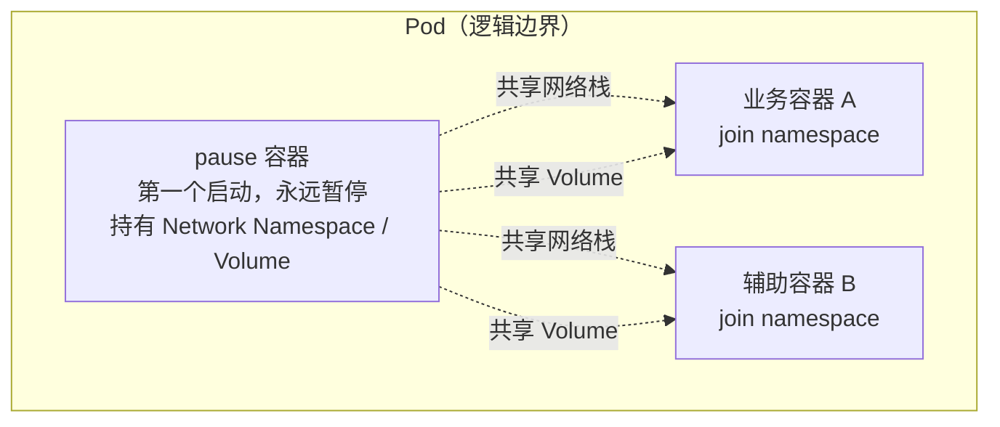
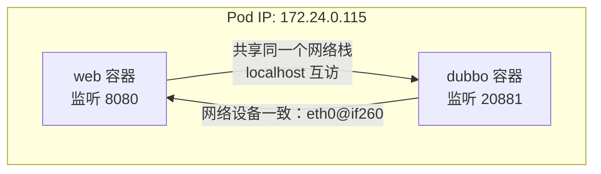
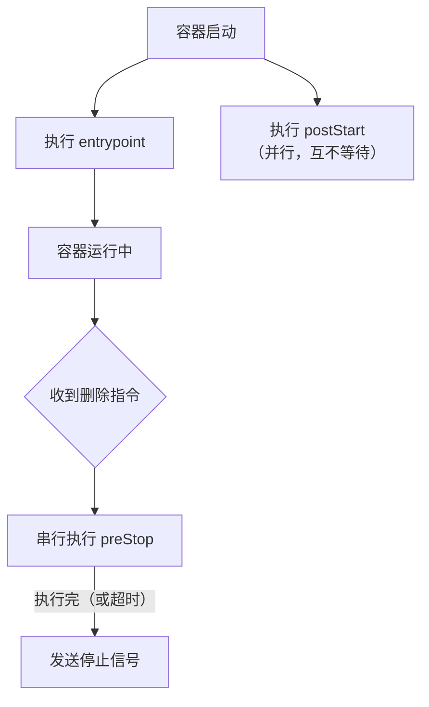
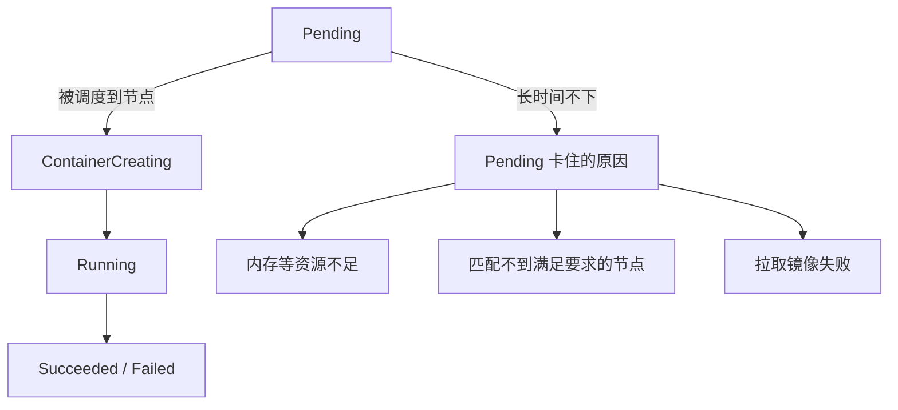

# Kubernetes 生产实践: 深入 Pod（上）—— pause 容器、共享 network/volume、hostAliases 与 lifecycle

Pod 讲过很多次了，但到底什么才是 Pod？**为什么不直接用容器，非要弄出 Pod 这一层？** 这一节把 Pod 的点点滴滴讲清楚。

结论先给：**Pod 物理上并不存在，它是一个逻辑概念；它的本质就是「共享同一个 Network Namespace 和同一组 Volume」的一组容器。** 为了让这组容器对等（而不是谁依赖谁的启动顺序），Kubernetes 引入了 **`pause` 容器作为基础设施容器** —— 每个 Pod 都有、第一个启动、永远暂停、几乎不占资源，其它容器 join 到它的 namespace 上。

理解了这层设计，**哪些配置应该写在 Pod 级别、哪些写在容器级别**就一目了然了：`volumes`、`hostAliases`、`hostNetwork`、`hostPID` 都在 Pod 级别，只有 `resources`、`lifecycle` 这类才是容器级别。

## 纲要

- 为什么要有 Pod：容器是单进程模型，多个服务共机时的调度问题
- Pod 是**最小的原子调度单位**，按整个 Pod 的资源需求来调度
- Pod 是逻辑概念，**物理上并不存在一个叫 Pod 的边界**，隔离仍在容器层面
- Pod 的本质：**共享 Network Namespace + 共享 Volume**
- `docker run --net=xxx --volumes-from=xxx` 也能做，但**引入了启动顺序依赖**
- `pause` 容器：不用声明、第一个启动、永远暂停、镜像只有一两百 K
- 实测：两个容器 IP 相同、网卡相同、`localhost` 互相可达
- `volumes` 定义在 **Pod 层面**，所有容器都能挂载
- 典型多容器模型：主力容器 + 辅助容器（日志采集）
- `/etc/hosts` 由 Pod 管理，自定义要靠 `spec.hostAliases`
- `hostNetwork` / `hostPID` 等 namespace 相关项全在 Pod 级别
- Pod 的很多字段不可修改，**习惯先 delete 再 create**
- `lifecycle.postStart` 与 entrypoint **并行**，`preStop` **串行且会等待**
- Pod 生命周期：Pending → ContainerCreating → Running

## 为什么需要 Pod

设想一个场景：**很多情况下我们有多个服务、多个应用要同时运行在一台机器上。** 但容器是**单进程模型** —— 一个容器里跑多个服务违背了容器的设计原则，是后患无穷的做法。

那多个容器怎么被调度到同一台机器？举个例子：

```text
某节点剩余内存：2.5G
待调度的三个服务：每个 1G
├── 调度第 1 个：剩 1.5G  ✓
├── 调度第 2 个：剩 0.5G  ✓
└── 调度第 3 个：内存不足  ✗
```

**如果一个容器一个容器去调度，在调度层面肯定会有问题。** 而 Pod 是 Kubernetes 里最小的调度单位、原子单位，**调度是按整个 Pod 的资源需求来做的**，这个问题就迎刃而解了。

不过 Pod 肯定不只是为了解决这个问题而设计的 —— 这个问题用别的手段也能绕过去，没必要大动干戈设计一个 Pod 出来。**Pod 对 Kubernetes 有更重要的作用。**

## Pod 的本质

**Pod 其实只是一个逻辑概念，在物理机上并不真实存在一个叫做 Pod 的东西，没有 Pod 的边界。** 真正处理隔离的还是容器层面 —— cgroup、namespace。

**Pod 的本质就是：共享了同一个 Network Namespace，共享了同一组 Volume。**

看到这里可能会想：**共享网络、共享存储而已，用 `docker run` 也能做到吧？**

```bash
docker run --net=container:xxx  ...   # 指定共享网络
docker run --volumes-from=xxx   ...   # 指定共享存储
```

看着还真可以。**但这样有一个潜在问题：这种方式对容器的启动顺序有要求** —— 必须先起被依赖的那个容器。**这样多个容器就不是一个对等的关系了，处理起来非常复杂。**

于是轮到 Pod 出场，它用了一个**中间容器**，也就是常见的 **`pause` 容器**：



- **这个容器不需要在配置中显式声明，每个 Pod 都会有，并且第一个启动的就是它；**
- **配置文件中定义的容器都是通过 join network namespace 的方式跟 pause 容器关联在一起的。**

担心多一个容器影响性能？完全不用担心：

| 特性 | 说明 |
| --- | --- |
| 状态 | `pause` 就是"暂停"，**永远处于暂停状态，啥也不做**，不占用计算资源 |
| 镜像大小 | **只有一两百 K**，也不占什么内存 |

## 实测一：共享 Network Namespace

用一份 `pod-network.yaml` 验证。**注意它的 `kind` 是 `Pod`（不是 Deployment）—— 直接定义一个 Pod，配置更简单，相当于 Deployment 里的 template 部分：**

```yaml
apiVersion: v1
kind: Pod
metadata:
  name: pod-network
  namespace: dev
spec:
  containers:
    - name: web
      image: springboot-web:v1
      ports:
        - containerPort: 8080
    - name: dubbo
      image: dubbo-demo:v1
      ports:
        - containerPort: 20881
```

```text
Pod vs Deployment 的写法对照
├── Deployment
│   ├── metadata / replicas / selector
│   └── spec.template            ← Pod 模板
│       └── metadata.labels + spec.containers
└── Pod (kind: Pod)
    ├── metadata
    └── spec                     ← 就是上面那个 template 的内容
        └── containers[]
```

创建后看它跑在哪个节点，到那个节点上 `docker ps`：

```bash
kubectl create -f pod-network.yaml -n dev
kubectl get pod -o wide -n dev
docker ps | grep network
```

```text
CONTAINER ID   IMAGE                        CREATED        STATUS
a1b2c3d4e5f6   k8s.gcr.io/pause:3.2         26 秒之前       Up 26 seconds
f6e5d4c3b2a1   dubbo-demo:v1                24 秒之前       Up 24 seconds
1a2b3c4d5e6f   springboot-web:v1            24 秒之前       Up 24 seconds
```

**pause 容器是最先起来的（26 秒前），之后才启动了两个自定义容器** —— 这就是它的启动顺序。

### 在 dubbo 容器里能看到 tomcat 的端口

进到 dubbo 容器：

```bash
kubectl exec -it pod-network -n dev -c dubbo -- sh

netstat -lntp
# tcp   0.0.0.0:20881   dubbo
# tcp   0.0.0.0:8080    tomcat
```

**在 dubbo 容器里能看到两个服务各自的监听端口。** 试试能不能直接访问：

```bash
wget -qO- http://localhost:8080/
# 404
```

**返回 404 —— 说明在 dubbo 容器里可以访问到 tomcat 容器的服务。** 这就证明了**容器之间共享网络，可以通过 `localhost` 互相通讯。**

再看看 IP 和网络设备：

```bash
ip addr    # 172.24.0.115
ip link    # 1: lo  124: eth0@if260
```

到 tomcat 容器里看 —— **IP 同样是 172.24.0.115，网络设备也一模一样。**



**它们共享的是 Pod 唯一的那一个 IP 地址。**

## 实测二：共享 Volume

看 `pod-volume.yaml`。同样两个容器（web + dubbo），**最下面多了一个 `volumes`**：

```yaml
apiVersion: v1
kind: Pod
metadata:
  name: pod-volume
  namespace: dev
spec:
  containers:
    - name: web
      image: springboot-web:v1
      volumeMounts:
        - name: share-volume
          mountPath: /share/web
    - name: dubbo
      image: dubbo-demo:v1
      volumeMounts:
        - name: share-volume
          mountPath: /share/dubbo
  volumes:
    - name: share-volume
      hostPath:
        path: /data/share
```

```text
spec
├── containers[]                 容器级别
│   ├── web   → volumeMounts: share-volume → /share/web
│   └── dubbo → volumeMounts: share-volume → /share/dubbo
└── volumes[]                    ← Pod 级别（缩进只有 2 个空格）
    └── share-volume: hostPath /data/share
```

**注意 `volumes` 这一级的缩进只有两个空格，说明它的定义是放在 Pod 层面的。一旦 Pod 设置了这个 volume，Pod 里所有的容器都可以共同使用它。**

> 这个例子本身没那么贴切（web 和 dubbo 完全没必要放在一个 Pod 里共享目录）。**真实业务中比较常见的多容器 Pod 往往是"一个是主力、一个是辅助"** —— 比如日志采集容器和业务容器**共享同一个日志目录**：业务容器负责写日志，采集容器负责把日志发给 Kafka 或 ES 保存起来。

验证共享：在 dubbo 容器的 `/share/dubbo` 下建一个文件：

```bash
kubectl exec -it pod-volume -n dev -c dubbo -- sh
touch /share/dubbo/abc
```

到 tomcat 容器的 `/share/web` 下看：

```bash
kubectl exec -it pod-volume -n dev -c web -- ls /share/web
# abc
```

**能看到同一个文件 —— Volume 共享成立。**

## /etc/hosts 是 Pod 级别管理的

对这两个 Pod 执行：

```bash
kubectl exec -it pod-volume -n dev -c web   -- cat /etc/hosts
kubectl exec -it pod-volume -n dev -c dubbo -- cat /etc/hosts
```

**两个容器的 hosts 文件是一模一样的，并且跟当前宿主机的 hosts 不一样。**

**说明 hosts 文件是 Pod 负责创建的** —— 也就是说 **hosts 文件由 Pod 管理，而不是容器自己管理。**

因此：**要自定义 hosts 时，不能直接去修改容器里的 hosts 文件。** Pod 的设计要求"一个 Pod 下所有容器的 hosts 永远保持一致"，在容器层面改就破坏了这个一致性。

正确做法是在 **Pod 层面的 spec 下定义 `hostAliases`**：

```yaml
spec:
  hostAliases:
    - ip: "10.155.20.120"
      hostnames:
        - web.imooc.com
        - web2.imooc.com
```

> 踩过一个坑：**字段名是 `hostnames`（有 s），写成 `hostname` 会报错。**

另外 **Pod 和 Deployment 不太一样：修改 Pod 的很多字段会报不可修改。所以操作 Pod 时的习惯是先删除再创建。**

```bash
kubectl delete -f pod-volume.yaml -n dev
kubectl create -f pod-volume.yaml -n dev
kubectl exec -it pod-volume -n dev -c web -- cat /etc/hosts
# 10.155.20.120   web.imooc.com  web2.imooc.com
```

**两个容器里都能看到这条 hosts 配置。**

## namespace 相关的配置全在 Pod 级别

除了网络部分在 Pod 级别管理，**所有 Linux namespace 相关的东西也都属于 Pod 级别。** 继续在 `spec` 下级加：

```yaml
spec:
  hostNetwork: true
  hostPID: true
```

| 字段 | 含义 |
| --- | --- |
| `hostNetwork` | 是否使用宿主机的网络（Network Namespace） |
| `hostPID` | 是否使用宿主机的 PID Namespace |

delete 再 create，进到容器里：

```bash
kubectl exec -it pod-volume -n dev -c dubbo -- ps -ef
# 看到一大堆系统进程 —— 说明用了宿主机的进程空间

kubectl exec -it pod-volume -n dev -c dubbo -- netstat -lntp
# 看到很多宿主机的监听端口 —— 说明用了宿主机的网络
```

```text
到底哪些配置该写在哪一层
├── Pod 级别（spec 直接下级）
│   ├── volumes / volumeMounts 的定义源
│   ├── hostAliases              自定义 hosts
│   ├── hostNetwork / hostPID    共享宿主机 namespace
│   └── nodeSelector / affinity / tolerations
└── 容器级别（containers[] 下级）
    ├── image / ports / env
    ├── resources                requests / limits
    └── lifecycle                postStart / preStop
```

**以后需要在这些方面做调整时一定小心，别在容器层面去做，那样肯定是错的。**

## lifecycle：容器级别的生命周期钩子

一个很有用的容器级别参数 —— **`lifecycle`，定义在 container 下面**：

```yaml
    - name: web
      image: springboot-web:v1
      lifecycle:
        postStart:
          exec:
            command: ["/bin/sh", "-c", "logger web starting"]
        preStop:
          exec:
            command: ["/bin/sh", "-c", "sleep 3 && logger web stopping"]
```

| 钩子 | 执行时机 | 与主进程的关系 |
| --- | --- | --- |
| `postStart` | 容器启动之后 | **与 entrypoint 并行执行**，没有等待关系 |
| `preStop` | 容器停止之前 | **串行**：先执行这条命令，**等它执行完才发停止信号** |



**因为 postStart 是并行的，千万不要把"依赖容器完全启动之后才能做的事"放这里**，那样一定会出问题。

preStop 会等待脚本执行完。**如果脚本执行时间非常长，它也不会一直等 —— 有超时，超时就自动跳过。**

### 验证

重建 Pod，进到容器里看系统日志：

```bash
kubectl delete -f pod-volume.yaml -n dev
kubectl create -f pod-volume.yaml -n dev
kubectl exec -it pod-volume -n dev -c web -- tail /var/log/messages
# web starting
```

**postStart 生效了。**

现在 delete 掉 —— **却看不到 `web stopping`。** 为什么？**因为这条脚本执行得非常快，执行完立刻就把容器停掉了，屏幕缓冲区还没来得及刷新容器就被杀掉了。**

给 preStop 加一个 `sleep 3` 模拟执行耗时，重建后再次删除：**这回删除速度明显变慢了，日志里也打印出了 `web stopping`。**

**preStop 一般是用来做容器的优雅退出的** —— 把之前练习里粗暴的停机方式改成这种写法，会优雅很多。

## Pod 的生命周期

既然提到了生命周期，顺便说一说 Pod 的生命周期状态流转：



| 状态 | 含义 |
| --- | --- |
| **Pending** | **最开始的状态，Pod 还没有被调度。** 内存不足、匹配不到节点、拉不到镜像都会导致长时间卡在这里 |
| **ContainerCreating** | **Pod 已被调度，找到合适的机器了**，正在进行容器/ Pod 的初始化。一般持续不久 |
| **Running** | 最常见 —— 运行中 |

## API 速览

| 能力 | API / 配置 | 要点 |
| --- | --- | --- |
| 直接定义 Pod | `kind: Pod` | 相当于 Deployment 里的 template 部分 |
| 共享网络 | Pod 自动实现 | 容器内用 `localhost` 互访即可 |
| 声明存储 | `spec.volumes[]` | **Pod 级别**，缩进在 spec 直接下级 |
| 挂载存储 | `containers[].volumeMounts[]` | name 与 volumes 对应 |
| 自定义 hosts | `spec.hostAliases[].{ip,hostnames}` | **字段名是 hostnames，带 s** |
| 共享宿主机网络 | `spec.hostNetwork: true` | Pod 级别 |
| 共享宿主机 PID | `spec.hostPID: true` | Pod 级别 |
| 启动后钩子 | `containers[].lifecycle.postStart` | **与 entrypoint 并行** |
| 停止前钩子 | `containers[].lifecycle.preStop` | **串行，会等待；有超时** |
| 优雅退出 | preStop 里 sleep + 收尾脚本 | 比直接停机优雅 |
| 修改 Pod 字段 | 多数字段不可变 | 习惯先 delete 再 create |
| 看 pause 容器 | 到节点上 `docker ps \| grep pause` | 它是最先启动的那个 |

## Demo 示例

### 1. 一份把本节要点都装进去的 Pod

```yaml
apiVersion: v1
kind: Pod
metadata:
  name: pod-volume
  namespace: dev
spec:
  hostAliases:
    - ip: "10.155.20.120"
      hostnames:
        - web.imooc.com
  containers:
    - name: web
      image: springboot-web:v1
      ports:
        - containerPort: 8080
      volumeMounts:
        - name: share-volume
          mountPath: /share/web
      lifecycle:
        postStart:
          exec:
            command: ["/bin/sh", "-c", "logger web starting"]
        preStop:
          exec:
            command: ["/bin/sh", "-c", "sleep 3 && logger web stopping"]
    - name: dubbo
      image: dubbo-demo:v1
      ports:
        - containerPort: 20881
      volumeMounts:
        - name: share-volume
          mountPath: /share/dubbo
  volumes:
    - name: share-volume
      hostPath:
        path: /data/share
```

### 2. 逐项验证

```bash
# 一、pause 容器最先起来
NODE=$(kubectl get pod pod-volume -n dev -o jsonpath='{.spec.nodeName}')
echo "Pod 在节点：$NODE"
# ssh 到该节点后：
#   docker ps | grep -E 'pause|pod-volume'

# 二、共享网络：IP 相同、localhost 互访
kubectl exec -it pod-volume -n dev -c dubbo -- sh -c 'ip addr; netstat -lntp'
kubectl exec -it pod-volume -n dev -c dubbo -- sh -c 'wget -qO- http://localhost:8080/'

# 三、共享 Volume：一边写一边看
kubectl exec -it pod-volume -n dev -c dubbo -- touch /share/dubbo/abc
kubectl exec -it pod-volume -n dev -c web   -- ls /share/web

# 四、hostAliases 生效（注意 Pod 字段不可变，先删再建）
kubectl exec -it pod-volume -n dev -c dubbo -- cat /etc/hosts

# 五、lifecycle 钩子
kubectl exec -it pod-volume -n dev -c web -- tail /var/log/messages
kubectl delete -f pod-volume.yaml -n dev
```

> 注意：`docker ps` / `ip addr` / `netstat` 这些命令依赖容器里是否有对应工具，没有的话用 `kubectl describe pod` 看 Pod IP，或用 `nsenter` 进到容器网络命名空间。

### 总结

**Pod 的诞生首先解决了调度问题** —— 容器是单进程模型，逐个调度会在资源碎片场景下失败；**Pod 是最小的原子调度单位，按整个 Pod 的资源需求调度。**

**Pod 是逻辑概念，物理上不存在 Pod 边界**，隔离依然在容器层面；**它的本质就是一组共享同一 Network Namespace 和同一组 Volume 的容器。**

用 `docker run --net` / `--volumes-from` 也能做成同样的事，但**会带来容器启动顺序的依赖，容器之间不再对等** —— 这正是 **`pause` 容器**存在的意义：不用声明、第一个启动、永远暂停、镜像只有一两百 K，其它容器 join 到它的 namespace。

实测验证了三点：**两个容器 IP 与网卡完全一致、`localhost` 可以互访、`volumes`（定义在 Pod 层级）可以让两个容器共享文件。**

**`/etc/hosts` 以及 `hostNetwork` / `hostPID` 这类 namespace 相关的东西都在 Pod 级别管理**，不能到容器里去改 hosts —— 要自定义就用 `spec.hostAliases`（**字段名 `hostnames` 别写漏 s**）。**Pod 的很多字段不可修改，操作习惯是先 delete 再 create。**

**`lifecycle` 是容器级别的钩子**：`postStart` 与 entrypoint **并行**（不能放依赖服务已启动的逻辑），`preStop` **串行且会等待**（超时才跳过），是做优雅退出的正确位置。

Pod 生命周期从 **Pending**（未被调度）到 **ContainerCreating**（已找到节点，正在初始化）再到 **Running**。

