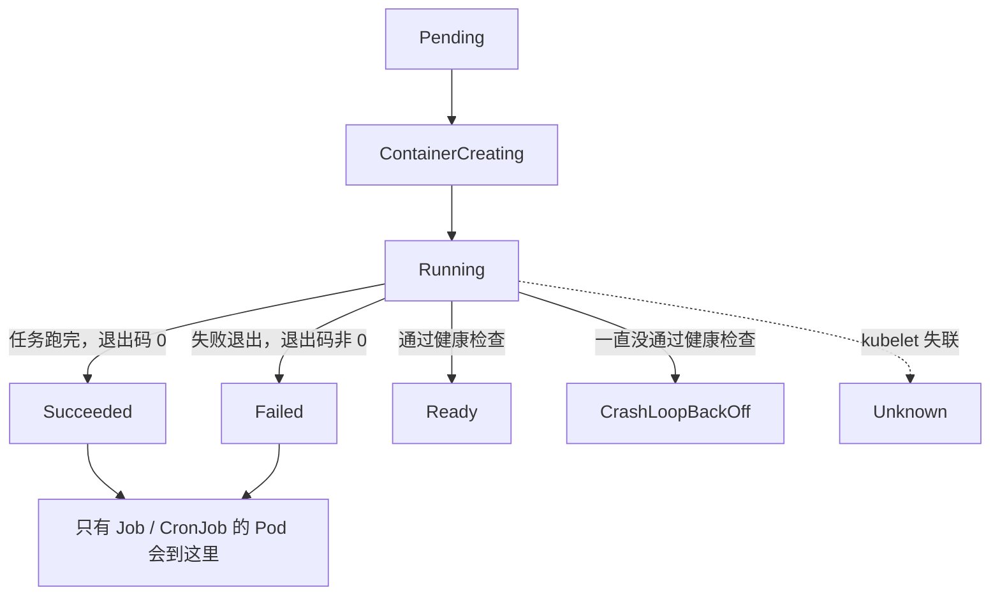
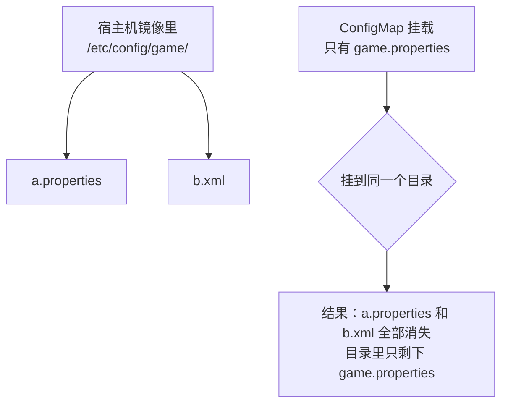

# Kubernetes 生产实践: 深入 Pod（下）—— Projected Volume 与 Secret / ConfigMap / Downward API

上半篇讲完 Pod 的设计与共享/隔离，这一节补两件事：**Pod 的完整状态集合**，以及 Pod 里非常重要也很常用的一个功能 —— **Projected Volume（投射数据卷）**。

结论先给：**Projected Volume 不是用来挂载宿主机目录、也不是给容器之间共享存储的，它是由 Kubernetes 在项目启动时「投射」进 Pod 的一种轻量级 Volume。** 官方预定义了三种用法：**Secret（加密数据）、ConfigMap（非加密配置）、Downward API（Pod 自身的元数据）**。这三兄弟的用法高度一致，区别只在数据来源。

## 纲要

- Pod 完整状态：Pending / ContainerCreating / Running / Succeeded / Failed
- `Succeeded` 与 `Failed` **只有 Job / CronJob 类型的 Pod 会达到**
- 退出码 0 → Succeeded，非 0 → Failed
- `Ready`：长期运行的应用通过健康检查后的状态
- `CrashLoopBackOff`：一直启动失败，退避时间随失败次数递增
- `Unknown`：kubelet 与 API Server 之间的通讯出问题
- Projected Volume 是 API Server **投射**给 Pod 的轻量卷
- **Secret**：存密钥类加密数据，**落在 etcd 里**
- ServiceAccount 的本质就是一个 Secret
- 自建 Secret 的 `type` 是 **`Opaque`**
- Secret 改完会被**自动同步**到容器里（有短暂延迟）
- **ConfigMap**：存不需要加密的配置，用法与 Secret 基本一致
- ConfigMap 挂载的是**目录**，会覆盖目标目录原有内容
- ConfigMap 的另一种用法：**注入环境变量**（`configMapKeyRef`）
- **Downward API**：让程序读到 Pod 对象自身的信息
- 字段名是 **Downward** API，别看成 download

## Pod 的完整状态

接着上半篇的状态流转往下说。Running 之后：



| 状态 | 含义 | 触发条件 |
| --- | --- | --- |
| **Succeeded** | 成功状态 | Pod 运行结束、正常退出，**容器退出值为 0** |
| **Failed** | 失败状态 | **退出值非 0** |
| **Ready** | 就绪 | 长期运行的应用，**通过了健康检查** |
| **CrashLoopBackOff** | 崩溃循环补偿 | 一直没通过健康检查，Pod 处于等待状态，**错误次数越多等待时间越久** |
| **Unknown** | 未知 | **API Server 没有收到 Pod 相关信息的汇报**，一般是 kubelet 与 API Server 之间的通讯出了问题 |

> **`Succeeded` 和 `Failed` 只有 Job / CronJob 类型的 Pod 会达到**，Deployment 管的是长期运行的应用，不会走到这两个状态。

**一旦处于 CrashLoopBackOff，就说明服务一直处于启动失败的状态** —— 这是排查时最直白的一个信号。

## Projected Volume 是什么

既然加了 "projected"，它就和前面说的 Volume 不是一回事：**不是用来挂载宿主机目录的，也不是用来在容器之间共享存储的。**

**它是一种比较轻量级的 Volume，由 Kubernetes 在 Pod 启动时投射到 Pod 里。** 打个比方：**Kubernetes 知道这个 Pod 需要一个什么文件，就在你启动的时候把这个文件给你扔过来了**，程序里直接读这个文件来用。

按应用场景，Kubernetes 预先定义好了三种使用方式：

```text
Projected Volume 的三种用法
├── Secret         存放密钥等加密数据
├── ConfigMap      存放不需要加密的配置
└── Downward API   让程序读到 Pod 对象自身的信息
```

看到这三个词可能觉得眼熟 —— 但可能不知道**它们的实现原理都是这个 Projected Volume**。

## 一、Secret

从名字就知道它是**用来存放密钥之类的加密数据**的。存在哪儿？**肯定是在 etcd 里 —— 它是 Kubernetes 唯一具有存储能力的组件。**

一般用来存用户名、密码之类。Kubernetes 自己也有很多地方在用 Secret：

```bash
kubectl get secret
kubectl describe secret default-token-xxxxx
```

```text
Name:         default-token-xxxxx
Type:         kubernetes.io/service-account-token

Data
====
ca.crt:     1066 bytes    ← 一长串字符串
namespace:  7 bytes
token:      ...
```

**数据都像是 base64 加密的（从结尾的 `=` 能看出来）**，类型是 `kubernetes.io/service-account-token`，也就是**给 ServiceAccount 用的 Secret**。

### ServiceAccount 的本质就是一个 Secret

看 Pod 的用法 —— Kubernetes 会**把这个 secret 自动加入到每一个 Pod 里**。随便 describe 一个 Pod，能看到它定义了一个 volume，名字恰好就是那个 token：

```yaml
# kubectl describe pod 里看到的挂载片段（节选，两份 key 已对齐为可解析形式）
volumeMounts:
  - mountPath: /var/run/secrets/kubernetes.io/serviceaccount
    name: default-token-xxxxx
    readOnly: true
volumes:
  - name: default-token-xxxxx
    secret:
      defaultMode: 420
      secretName: default-token-xxxxx
```

到容器里的这个挂载目录看：

```bash
ls /var/run/secrets/kubernetes.io/serviceaccount
# ca.crt   namespace   token
cat /var/run/secrets/kubernetes.io/serviceaccount/token
# 是 base64 解密之后的内容
```

**挂载出来的三个文件与 Secret 里定义的三个 key 完全一致，内容是解密后的数据。**

> 之前讲认证授权时也提到过 ServiceAccount —— **它的本质就是 Secret，用于跟 API Server 交互时做授权。**

### 自建 Secret

```yaml
apiVersion: v1
kind: Secret
metadata:
  name: dbpass
type: Opaque
data:
  username: aW1vb2M=          # echo -n imooc | base64
  password: bW9vYzEyMw==
```

```text
Secret 清单结构
├── apiVersion / kind: Secret
├── type: Opaque              不透明的 —— 自己用的 Secret 都是这个类型
│                             内置类型才用 kubernetes.io/service-account-token 等
└── data                      key/value，value 必须是 base64
    ├── username
    └── password
```

base64 的生成方式很简单：

```bash
echo -n imooc | base64
# aW1vb2M=
```

> **注意 `echo` 要加 `-n`**，否则会把结尾的换行一起编码进去，密码就多了个字符。

创建完成后，**相当于把这个配置写到了 etcd 里**。怎么用呢？还是得靠 Pod：

```yaml
apiVersion: v1
kind: Pod
metadata:
  name: pod-secret
spec:
  containers:
    - name: web
      image: springboot-web:v1
      volumeMounts:
        - name: db-secret
          mountPath: /db-secret
  volumes:
    - name: db-secret
      projected:
        sources:
          - secret:
              name: dbpass
```

```bash
kubectl create -f pod-secret.yaml
kubectl exec -it pod-secret -- ls /db-secret
# password  username
kubectl exec -it pod-secret -- cat /db-secret/username
# imooc
```

**程序就可以通过访问这个目录下的文件拿到用户名和密码去连数据库了。**

### Secret 最大的杀伤力：可以热更新

如果用户名或密码配错了怎么办？**这是它非常强大的一个地方 —— 可以直接修改这个 Secret：**

```yaml
data:
  username: aW1vb2M=
  password: aW1vb2M=       # 改成和用户名一样
```

```bash
kubectl apply -f secret.yaml
sleep 10
kubectl exec -it pod-secret -- cat /db-secret/password
# imooc
```

**等一小段时间的延迟之后，容器里的文件内容就被更新了。相当于可以动态修改容器里面的配置**，而不用重建 Pod。

## 二、ConfigMap

ConfigMap 与 Secret 的原理和用法**基本是一致的**，主要区别是：**ConfigMap 用来存储不需要加密的数据** —— 比如应用的一些启动参数、配置项等等。

### 从文件创建

现有一个 `game.properties` 配置文件，**想把它放到集群里，最好的方式就是使用 ConfigMap**：

```bash
kubectl create configmap webgame --from-file=game.properties
kubectl get cm webgame -o yaml
```

```yaml
apiVersion: v1
kind: ConfigMap
metadata:
  name: webgame
data:
  game.properties: |
    enemies=aliens
    lives=3
    enemies.cheat=true
    enemies.cheat.level=noGoodRotten
    secret.code.passphrase=UUDDLRLRBABAS
```

**`data` 里 key 是 `game.properties`，后面跟着一个竖线 `|`，表示下面的多行内容都属于这个文件。** 当然**从文件创建并不是 ConfigMap 独有的能力**，Secret 也一样支持（`--from-file`），而且 ConfigMap 还可以直接用 yaml 文件 `kubectl create -f` 创建。

### 在 Pod 里挂载

```yaml
apiVersion: v1
kind: Pod
metadata:
  name: pod-game
spec:
  containers:
    - name: web
      image: springboot-web:v1
      volumeMounts:
        - name: game
          mountPath: /etc/config/game
  volumes:
    - name: game
      configMap:
        name: webgame
```

```bash
kubectl exec -it pod-game -- ls /etc/config/game
# game.properties
kubectl exec -it pod-game -- cat /etc/config/game/game.properties
# 与 from-file 时的内容一模一样
```

**程序就可以通过访问这个配置文件拿到它的属性值了。**

### 一个容易踩的坑：挂载会覆盖整个目录

有人会想：**那我是不是可以把 `/root/config` 下面那些附件之类全都通过 ConfigMap 注入进去？**

**这个是不行的。** 看上面这个挂载：`/etc/config/game` 是一个**目录**，里面只有 `game.properties` 一个文件。

**如果把它映射到已经存在的目录，它会把这个目录直接覆盖掉** —— 不是替换目录里的某一个文件，而是整个目录被 mount 进去的内容完全取代。



### ConfigMap 也可以热更新

```bash
kubectl edit cm webgame       # 把 enemies.cheat 改成 false
```

容器那边每隔 5 秒 cat 一次：

```bash
while true; do cat /etc/config/game/game.properties; sleep 5; done
```

**很快就变成了新值，延迟不算大。**

### 第二种用法：注入环境变量

除了挂载成文件，ConfigMap 还有另一类用法 —— **通过环境变量注入**。下面这份 Pod **完全没有 `volumes`**，只有一个环境变量：

```yaml
apiVersion: v1
kind: Pod
metadata:
  name: pod-env
spec:
  containers:
    - name: web
      image: springboot-web:v1
      env:
        - name: LOG_LEVEL
          valueFrom:
            configMapKeyRef:
              name: config-map
              key: loglevel
```

```yaml
apiVersion: v1
kind: ConfigMap
metadata:
  name: config-map
data:
  javaoptions: "-Xmx512m"
  loglevel: "debug"
```

```bash
kubectl exec -it pod-env -- env | grep LOG
# LOG_LEVEL=debug
```

**环境变量的值已经被设置到容器里了，程序可以通过环境变量访问到这个值。**

### 第三种用法：注入容器启动参数

还有一种写法：**先用同样的方式定义出环境变量，再把这个环境变量放进容器的启动命令里：**

```yaml
    - name: web
      image: springboot-web:v1
      command: ["/bin/sh", "-c", "java $(JAVA_OPTS) -jar /app.jar"]
      env:
        - name: JAVA_OPTS
          valueFrom:
            configMapKeyRef:
              name: config-map
              key: javaoptions
```

```bash
kubectl exec -it pod-cmd -- ps -ef
# java -Xmx512m -jar /app.jar     ← 最大内存已经传到了启动参数里
```

**本质仍然是环境变量方案** —— 环境变量可以在 `command` 里通过 `$()` 取到。

## 三、Downward API

最后一个和前两个不太一样。**它的主要作用是让我们在程序中可以取到 Pod 对象本身的一些相关信息。**

> 容易看错：**是 Downward API（`downwardAPI`），不是 download API。**

```yaml
apiVersion: v1
kind: Pod
metadata:
  name: pod-downwardapi
  labels:
    app: pod-downwardapi
    type: webapp
spec:
  containers:
    - name: web
      image: springboot-web:v1
      volumeMounts:
        - name: podinfo
          mountPath: /etc/podinfo
  volumes:
    - name: podinfo
      projected:
        sources:
          - downwardAPI:
              items:
                - path: labels
                  fieldRef:
                    fieldPath: metadata.labels
                - path: name
                  fieldRef:
                    fieldPath: metadata.name
                - path: namespace
                  fieldRef:
                    fieldPath: metadata.namespace
                - path: mem-request
                  resourceFieldRef:
                    containerName: web
                    resource: requests.memory
```

```text
downwardAPI 能取的内容
├── fieldRef.metadata.labels       Pod 上定义的所有标签
├── fieldRef.metadata.name         Pod 自己的名字
├── fieldRef.metadata.namespace    Pod 所在的命名空间
└── resourceFieldRef               容器的计算资源
    ├── resource: requests.memory / limits.memory / requests.cpu ...
    └── containerName              必须指定是哪个容器
```

挂载到 `/etc/podinfo` 之后看一眼：

```bash
kubectl exec -it pod-downwardapi -- ls /etc/podinfo
# labels  mem-request  name  namespace

kubectl exec -it pod-downwardapi -- cat /etc/podinfo/labels
# app="pod-downwardapi"
# type="webapp"

kubectl exec -it pod-downwardapi -- cat /etc/podinfo/namespace
# default

kubectl exec -it pod-downwardapi -- cat /etc/podinfo/mem-request
# 取到的是本机全部内存（这个 Pod 没有定义 requests.memory，默认即为无限制）
```

**没有定义 `requests.memory` 时，取到的是宿主机的全部内存**（比如 16G）。

> Downward API 支持的字段还有很多，用的时候查一下官方文档即可。

## API 速览

| 能力 | API / 命令 | 要点 |
| --- | --- | --- |
| 投射卷声明 | `volumes[].projected.sources[]` | Secret / ConfigMap / Downward API 三选一或组合 |
| 查看内置 Secret | `kubectl get secret` | `default-token-xxxxx` 是 ServiceAccount 用的 |
| base64 编码 | `echo -n imooc \| base64` | **必须加 `-n`，别把换行编进去** |
| 自建 Secret | `type: Opaque` | 自己用的都是这个类型 |
| Secret 热更新 | `kubectl apply -f secret.yaml` | 容器内文件自动更新，有短暂延迟 |
| 从文件建 ConfigMap | `kubectl create configmap NAME --from-file=xxx` | 文件名即为 key |
| 查看 ConfigMap | `kubectl get cm NAME -o yaml` | 简写 `cm` |
| ConfigMap 挂载 | `volumes[].configMap.name` | **挂载的是目录，会覆盖目标目录** |
| 注入环境变量 | `env[].valueFrom.configMapKeyRef` | 指定 name + key |
| 注入启动参数 | `command` 里用 `$(ENV_NAME)` | 本质还是环境变量 |
| Downward API | `downwardAPI.items[].fieldRef.fieldPath` | **是 Downward，不是 download** |
| 取容器资源 | `resourceFieldRef` + `containerName` | requests/limits 的 cpu/memory |

## Demo 示例

### 1. Secret 从创建到热更新

```bash
# 一、准备 base64 凭据
echo -n imooc    | base64     # aW1vb2M=
echo -n mooc123  | base64     # bW9vYzEyMw==

# 二、创建 Secret 并挂载到 Pod
kubectl apply -f secret.yaml
kubectl apply -f pod-secret.yaml

kubectl exec -it pod-secret -- ls /db-secret
kubectl exec -it pod-secret -- sh -c 'cat /db-secret/username; echo; cat /db-secret/password'

# 三、改密码并观察热更新
kubectl patch secret dbpass -p '{"data":{"password":"aW1vb2M="}}'
sleep 10
kubectl exec -it pod-secret -- cat /db-secret/password
```

### 2. ConfigMap 的三种用法

```bash
# 用法一：挂成配置文件
kubectl create configmap webgame --from-file=game.properties
kubectl get cm webgame -o yaml
kubectl apply -f pod-game.yaml
kubectl exec -it pod-game -- cat /etc/config/game/game.properties

# 热更新验证
kubectl edit cm webgame
kubectl exec -it pod-game -- cat /etc/config/game/game.properties

# 用法二：注入环境变量
kubectl apply -f pod-env.yaml
kubectl exec -it pod-env -- env | grep LOG_LEVEL

# 用法三：注入容器启动参数
kubectl apply -f pod-cmd.yaml
kubectl exec -it pod-cmd -- ps -ef
```

### 3. Downward API 读取 Pod 自身信息

```yaml
apiVersion: v1
kind: Pod
metadata:
  name: pod-downwardapi
  labels:
    app: pod-downwardapi
    type: webapp
spec:
  containers:
    - name: web
      image: springboot-web:v1
      resources:
        requests:
          memory: 256Mi
      volumeMounts:
        - name: podinfo
          mountPath: /etc/podinfo
  volumes:
    - name: podinfo
      projected:
        sources:
          - downwardAPI:
              items:
                - path: labels
                  fieldRef:
                    fieldPath: metadata.labels
                - path: name
                  fieldRef:
                    fieldPath: metadata.name
                - path: namespace
                  fieldRef:
                    fieldPath: metadata.namespace
                - path: mem-request
                  resourceFieldRef:
                    containerName: web
                    resource: requests.memory
```

```bash
kubectl apply -f pod-downwardapi.yaml
kubectl exec -it pod-downwardapi -- sh -c 'for f in /etc/podinfo/*; do echo "== $f"; cat $f; echo; done'
# == /etc/podinfo/labels       app="pod-downwardapi"  type="webapp"
# == /etc/podinfo/name         pod-downwardapi
# == /etc/podinfo/namespace    default
# == /etc/podinfo/mem-request  268435456
```

### 总结

Pod 的完整状态里，**`Succeeded` / `Failed` 只有 Job、CronJob 类型的 Pod 能达到**（看容器退出码 0 / 非 0）；长期运行的应用通过健康检查后是 **`Ready`**；**一直起不来就是 `CrashLoopBackOff`（失败次数越多退避越久）**；**`Unknown` 说明 kubelet 与 API Server 之间的通讯断了**。

**Projected Volume 不是共享存储，而是 Kubernetes 在 Pod 启动时投射进去的轻量级 Volume**，官方预定义了三种用法。

**Secret 存加密数据，落在 etcd 里（`type: Opaque`）**；ServiceAccount 的本质就是 Secret（那个 `default-token`），自动挂进每个 Pod 供 API Server 授权使用。**Secret 支持热更新** —— 改完 apply，容器里的文件会在短暂延迟后自动同步。

**ConfigMap 用法基本相同，但存的是不需要加密的配置**；可以从文件创建、挂载成配置文件、**注入环境变量（`configMapKeyRef`）、还可以在 `command` 里当作启动参数使用**。挂载时要注意：**它挂载的是目录，会覆盖目标目录的原有内容**，不能指望只替换其中一个文件。

**Downward API 让程序读到 Pod 对象自身的信息**（labels / name / namespace / 容器资源），字段名是 **Downward** API 别写错成 download。

