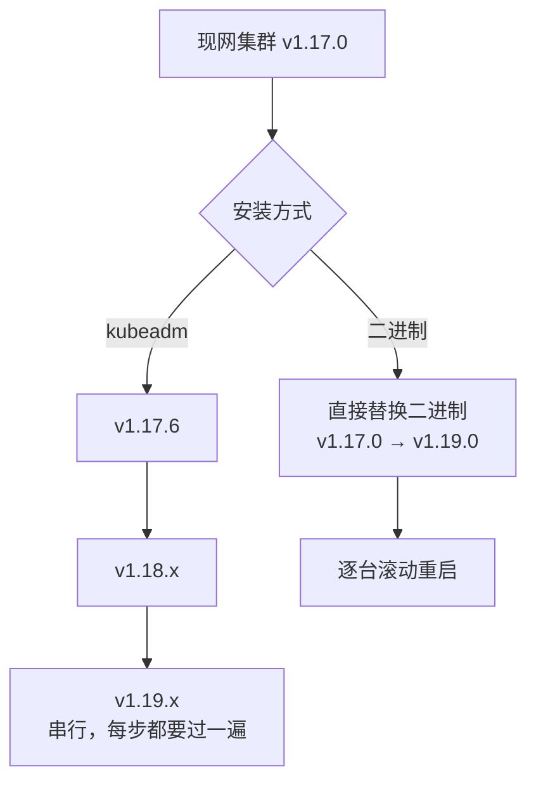
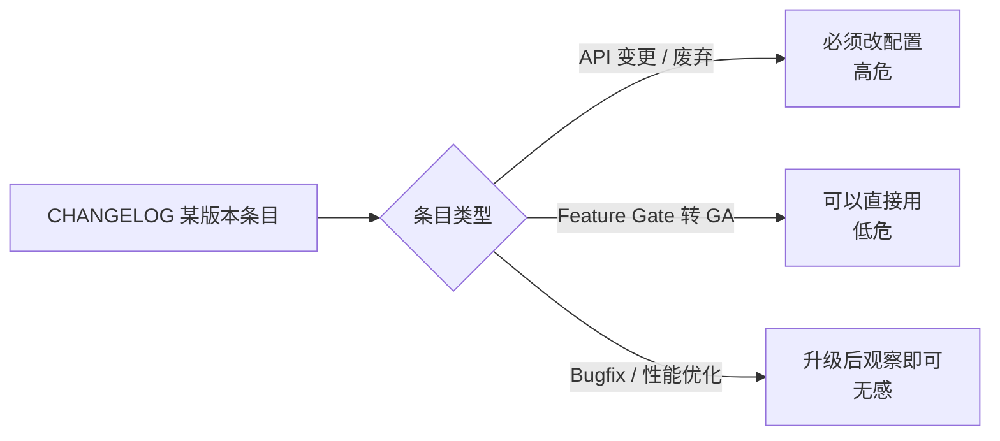
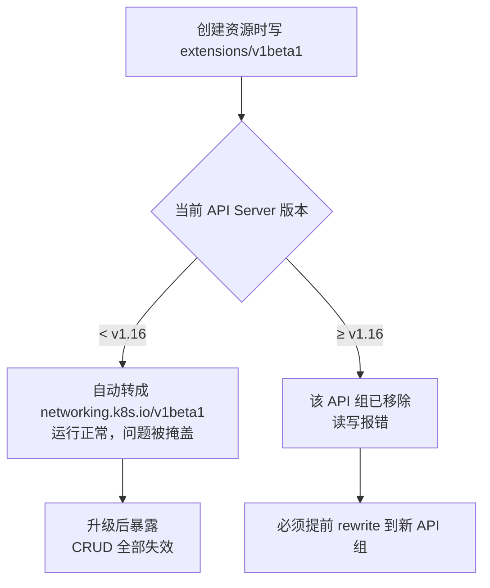
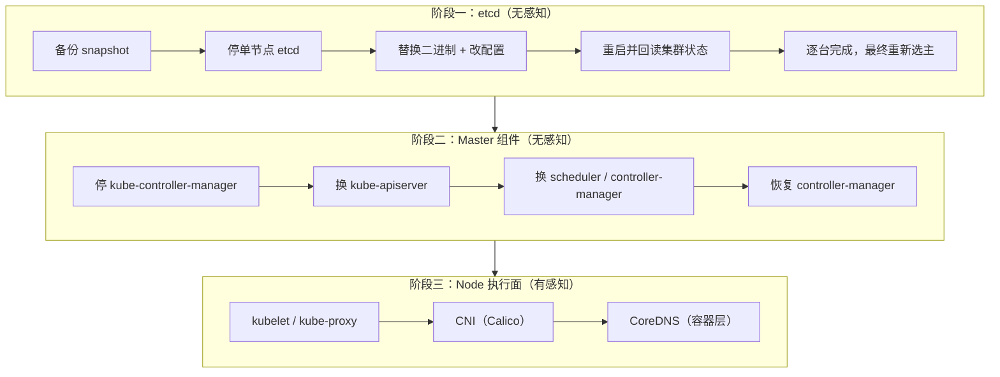
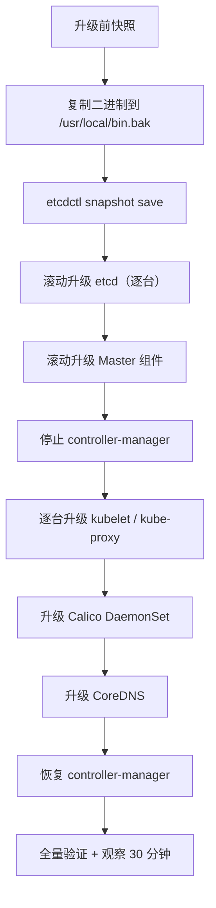

# Kubernetes 集群部署: 二进制升级到 1.19 的版本策略与升级路径规划

升级是**运维周期里风险最高的常规操作**之一：它不像装新集群，装坏了删掉重来；升级是**在跑着的业务上动刀**。

这一节解决三件事：升级路径怎么选（kubeadm 与二进制的差别）、跨版本升级会不会踩 API 兼容坑、以及升级顺序为什么必须是「etcd → Master → Node」。

结论先给：

- **kubeadm 只能逐小版本串行升**，v1.17.0 → v1.19.0 在 kubeadm 下要分段走完 v1.17.6 → v1.18.x → v1.19.x，且中途不能跳；
- **二进制安装可以直接替换二进制文件跨大版本升**，这是它最大的价值；
- 但跨版本一定伴随 **API 版本废弃**，`extensions/v1beta1` 这类老 API 从 v1.16 起就已被移除，升到 v1.19 前必须先做存量资源的 API 体检。

## 纲要

- 升级方式选型：kubeadm 逐版本 vs 二进制跨版本
- Kubernetes 的版本发布节奏与版本号含义
- 跨版本升级的第一颗雷：API 版本废弃
- 升级顺序为什么是 etcd → Master → Node
- 升级前置清单与回滚预案
- 一次完整的升级流程演示

## 升级方式选型

两种安装方式，决定了两条完全不同的升级路径。

| 维度 | kubeadm | 二进制（kubeadm 之外手动部署） |
| --- | --- | --- |
| 升级入口 | `kubeadm upgrade apply` | 停服务 → 覆盖二进制 → 重启 |
| 版本跨度 | **只能逐小版本**（1.17.0→1.17.6→1.18.x→1.19.x） | 可跨大版本直接替换 |
| 控制面配置校验 | 自动比对 kubeadm 配置 | 需人工比对 changelog 里的参数变更 |
| 证书处理 | 自动续期 / 更新 | 需手动或依赖 TLS Bootstrap 自动续期 |
| 出错成本 | `kubeadm upgrade --rollback` 可回退 | 靠二进制目录备份回退 |
| 适合场景 | 标准化、可复现 | **已有历史集群、需跨版本、节点规模大** |



二进制方式真的更简单，但**「更简单」的前提是你在测试环境完整演练过一遍**。因为跳过的正是 kubeadm 帮你做的那套参数校验。

## 版本发布节奏与版本号含义

Kubernetes 大致**每三个月发布一个次版本（minor）**。v1.17 之后是 v1.18，v1.18 发布过程中 v1.19 已进 alpha / beta，再往后进入 GA（稳定版）。

版本号的语义：

| 后缀 | 含义 | 能否上生产 |
| --- | --- | --- |
| `vX.Y.Z-alpha.N` | 内测，功能随时改 | 否 |
| `vX.Y.Z-beta.N` | 公测，特性趋向稳定但仍可能变 | 仅评估 |
| `vX.Y.Z` | GA 稳定版 | 是 |

**升级目标要选 GA 版，不要为了「抢新」把 beta 版直接推生产。** 演示环境可以用 beta 摸清新特性，生产只对 GA。

每个次版本发布时官方都会产出一个 `CHANGELOG`，这是升级前**唯一可靠的依据**：



读 changelog 的窍门是**从下往上读**：最下面（最早的版本）是改动最密集的，上面只是修修补补。重点抓两类条目 —— `Deprecated` / `Removed` 的参数，以及 `Feature Gate` 状态变化。

## 跨版本升级的第一颗雷：API 版本废弃

这是跨大版本升级最容易翻车的地方，而且**它不会在你升级的那一刻报错，而是让存量资源的增删改查全部失效**。

典型场景：

- v1.16 之前，Ingress、NetworkPolicy、PodSecurityPolicy 等资源可以写在 `extensions/v1beta1` 下；
- 从 **v1.16 起，`extensions/v1beta1` 中的这些 API 被移除**，必须改写到专用 API 组；
- 更麻烦的是：低版本集群写 `v1beta1` 时会自动转换，所以问题被**静默掩盖**了，直到升上来才发现**老资源读不出来、也改不动**。



排查手法很直接，拿生产的 yaml 全量 grep 一遍：

```bash
# 找出所有还在用 extensions/v1beta1 的资源清单
grep -rl "extensions/v1beta1" /etc/kubernetes/manifests /opt/deploy 2>/dev/null

# 确认当前集群里存量对象用了哪些 apiVersion
kubectl get ingress,networkpolicy -A -o jsonpath='{range .items[*]}{.apiVersion}{"\n"}{end}' | sort | uniq -c
```

**这一步必须在升 Master 之前做完**，否则升级过程中发现读不出来，只能回滚。

## 升级顺序：etcd → Master → Node

升级不是「一起换掉」，而是有严格先后。核心原则是：**数据层不动业务，控制面先换，再换执行面**。



顺序的理由：

| 阶段 | 停掉是否有影响 | 理由 |
| --- | --- | --- |
| etcd | **无影响** | 只停一台，其余节点接管读；写请求会短暂阻塞 |
| Master 组件（apiserver / scheduler / controller-manager） | **无影响** | 反过来，apiserver 停了整个集群就废了，所以要**逐台停、逐台起**；controller-manager 建议先整体停掉防版本错配 |
| kubelet / kube-proxy / Calico | **有影响** | 换二进制时容器可能被判定为「需重建」而重启；CNI 挂了会造成网络闪断 |
| CoreDNS | 有影响 | 纯容器层， rolling update 会短暂丢解析 |

**Controller Manager 为什么要先停**：升级过程中若 Node 异常导致 Pod 漂移，而 controller-manager 版本又与 kubelet 不一致，控制面会认为「节点/csr/状态是旧的」从而**循环重建 Pod**，把本来一次重启放大成雪崩。正确姿势是 —— 原地升级 kubelet 时停掉 controller-manager，等全部节点升完再拉起。

## 升级前置清单

| 检查项 | 命令 | 通过标准 |
| --- | --- | --- |
| etcd 集群健康 | `etcdctl endpoint health -w table` | 全部 `true` |
| 所有 Node Ready | `kubectl get node` | 无 `NotReady` |
| 控制面组件存活 | `kubectl get pod -n kube-system` | 无 `CrashLoopBackOff` |
| 存量 API 已无废弃组 | 见上节 grep | 无 `extensions/v1beta1` 命中 |
| 磁盘余量（含 etcd） | `df -h /var/lib/etcd` | 剩余 > 2 倍当前 etcd 数据量 |
| 已做快照 | `etcdctl snapshot save` | 快照文件落盘并**拷到别处** |
| 时间同步 | `timedatectl` | 所有节点一致 |



二进制部署的目录结构（升级前先确认你的布局）：

```text
/usr/local/bin/                 # 控制面 + 节点组件二进制
├── kube-apiserver
├── kube-controller-manager
├── kube-scheduler
├── kubelet
├── kube-proxy
├── etcd
└── etcdctl

/etc/kubernetes/                # 配置与证书
├── ssl/                        # 所有组件证书私钥
│   ├── ca.pem
│   ├── etcd-server.pem
│   ├── kube-apiserver.pem
│   └── kubelet-client.pem
├── etcd/
│   └── etcd.conf               # 数据面：etcd 自身配置
├── apiserver/                  # kube-apiserver 参数
├── controller-manager/
├── scheduler/
├── kubelet/
├── proxy/                      # kube-proxy 参数
└── manifests/                  # 静态 Pod 清单（apiserver/scheduler/controller-manager 走 kubelet 自举）

/var/lib/etcd/                  # etcd 数据目录
/var/log/kubernetes/            # 各组件日志
```

**升级前第一件事**：把整个 `/usr/local/bin` 打包备份（或至少把 `kube-apiserver`、`kubelet`、`etcd` 三个主二进制另存一份）。二进制回退是 `cp` 回去 + `systemctl restart`，成本远低于 etcd 数据回退。

## Demo 示例

一个升级前置检查脚本，把「前置清单」自动化。它只做**只读检查**，不会动集群，可以放心在升级前一天跑。

```bash
#!/usr/bin/env bash
# upgrade-precheck.sh —— 二进制 Kubernetes 升级前置体检
set -uo pipefail

ETCD_ENDPOINTS="https://10.0.0.11:2379,https://10.0.0.12:2379,https://10.0.0.13:2379"
ETCD_CERT="/etc/kubernetes/ssl/etcd-server.pem"
ETCD_KEY="/etc/kubernetes/ssl/etcd-server-key.pem"
ETCD_CA="/etc/kubernetes/ssl/ca.pem"
ETCD_DATA_DIR="/var/lib/etcd"

rc=0
hr() { printf '\n=== %s ===\n' "$*"; }
ok()  { printf '  [OK]   %s\n' "$*"; }
bad() { printf '  [FAIL] %s\n' "$*"; rc=1; }

hr "1. etcd 集群健康"
export ETCDCTL_API=3
export ETCDCTL_CA_CERT=$ETCD_CA
export ETCDCTL_CERT=$ETCD_CERT
export ETCDCTL_KEY=$ETCD_KEY
if etcdctl --endpoints="$ETCD_ENDPOINTS" endpoint health -w table; then
  ok "etcd endpoint health"
else
  bad "etcd endpoint health —— 必须全绿才能继续"
fi

hr "2. etcd 数据目录磁盘余量（需 > 当前数据量 2 倍）"
used=$(du -sm "$ETCD_DATA_DIR" 2>/dev/null | awk '{print $1}')
avail=$(df -Pm "$ETCD_DATA_DIR" 2>/dev/null | awk 'NR==2{print $4}')
echo "  已用 ${used}M   可用 ${avail}M"
if [ -n "$avail" ] && [ "$avail" -gt $((used * 2)) ]; then
  ok "磁盘余量充足"
else
  bad "磁盘余量不足，升级后 etcd 可能因空间不足拒绝写入"
fi

hr "3. Node 状态"
notready=$(kubectl get node --no-headers -o custom-columns=:metadata.name,:status.conditions 2>/dev/null \
  | awk '$2 !~ /^.*Ready$/ {print $1}')
if [ -z "$notready" ]; then
  ok "所有 Node Ready"
else
  bad "存在非 Ready 节点: $(echo $notready | tr '\n' ' ')"
fi

hr "4. 存量对象是否仍使用 extensions/v1beta1"
legacy=$(kubectl get ingress,networkpolicy -A -o json 2>/dev/null \
  | tr ',' '\n' | grep -c 'extensions/v1beta1')
if [ "${legacy:-0}" -eq 0 ]; then
  ok "无 legacy apiVersion 对象"
else
  bad "发现 ${legacy} 处 extensions/v1beta1，升级前必须 rewrite 到 networking.k8s.io/v1"
fi

hr "5. 控制面 Pod 状态"
if kubectl get pod -n kube-system 2>/dev/null | grep -q CrashLoopBackOff; then
  bad "kube-system 存在 CrashLoopBackOff，先修复再升级"
else
  ok "kube-system 无异常重启"
fi

hr "6. etcd 快照可写"
snap="/tmp/etcd-pre-upgrade-$(date +%Y%m%d%H%M%S).db"
if etcdctl --endpoints="$ETCD_ENDPOINTS" snapshot save "$snap" >/dev/null 2>&1; then
  ok "快照已保存: $snap"
  echo "  记得 cp 到另一台机器: scp $snap backup@10.0.0.254:/data/etcd-backup/"
else
  bad "快照创建失败"
fi

echo
if [ $rc -eq 0 ]; then
  echo "前置检查全部通过，可以开始升级。"
else
  echo "前置检查未通过，请勿升级。"
fi
exit $rc
```

升级时的逐台操作模板（以 kube-apiserver 为例）：

```bash
# 1) 备份旧二进制（每台都要做）
mkdir -p /usr/local/bin.bak/$(date +%F)
cp /usr/local/bin/kube-apiserver /usr/local/bin.bak/$(date +%F)/

# 2) 停服务
systemctl stop kube-apiserver

# 3) 覆盖新二进制
install -m 755 kubernetes-server-linux-amd64/kube-apiserver /usr/local/bin/
install -m 755 kubernetes-server-linux-amd64/kubectl /usr/local/bin/

# 4) 按 changelog 补/改参数（示例：controller-manager 的 --address 已废弃，改用 --bind-address）
sed -i 's#--address=127.0.0.1#--bind-address=0.0.0.0#' /etc/kubernetes/controller-manager/kube-controller-manager.conf

# 5) 起服务并确认版本
systemctl start kube-apiserver
kubectl version -o yaml | grep -A1 serverVersion
```

**失败排查点**（每一阶段都可能踩）：

| 现象 | 原因 | 处理 |
| --- | --- | --- |
| 组件起不来，报 `unknown flag` | 新二进制删除了老参数 | 按 changelog 对照，删掉/替换该 flag |
| 组件起不来，报 `port already in use` | 上一版没停干净 | `ps aux \| grep kube-` 查残留，kill 后再启 |
| etcd 起不来，日志报节点版本不一致 | 逐台升级中间态 | 正常，等最后一台起来会自动收敛 |
| 升级后 Pod 全部重建重启 | kubelet 版本变化导致 Pod hash 变化 | 业务侧做 PodDisruptionBudget，或改为先 drain 再升级 |
| 升级后 `kubectl get ingress` 报错 | 资源还在 `extensions/v1beta1` | 回到上一节的 rewrite 步骤 |
| 升级后集群无解析 | CoreDNS 未升或 Corefile 被覆盖丢失 | 检查 `cm -n kube-system coredns` 的 Corefile |

## API 速览

| 能力 | 做法 |
| --- | --- |
| 看某版本的变更条目 | 读 `CHANGELOG-<version>.md`，从下往上读 |
| 判断 API 是否废弃 | `kubectl api-resources -o wide \| grep <group>` |
| 改存量资源 API 版本 | 改 yaml 的 `apiVersion` 后 `kubectl apply --force` 重建 |
| 查当前 etcd 健康 | `etcdctl endpoint health`（需 `ETCDCTL_API=3` + 证书） |
| etcd 备份 | `etcdctl snapshot save <file>` |
| 逐台升级 etcd | 停 → 换二进制 → 改日志/参数 → 启 → `endpoint health` |
| 二进制回退 | `cp` 旧版本回 `/usr/local/bin` → `systemctl restart <component>` |
| 控制面版本核对 | `kubectl version`（`serverVersion.gitVersion`） |

## 总结

跨大版本升级不是「下载新二进制丢进去」，而是一套有前置条件的作业流程。

- **先选路径**：kubeadm 只能逐小版本串行；二进制可以跨版本，但省下的那些校验要自己补回来。
- **先排雷**：`extensions/v1beta1` 之类的废弃 API 是最隐蔽的坑，它在老集群里能读能改，一升级就全废，必须升级前 rewrite。
- **按顺序走**：etcd → Master 组件 → kubelet/kube-proxy → CNI → CoreDNS；原地升级 kubelet 时先把 controller-manager 停掉，避免版本错配导致 Pod 循环重建。
- **先演练**：生产升级前必须在测试环境完整跑一遍，二进制升级只有几秒，但配置不兼容的报错会拖到几十分钟。
- **先备份**：二进制目录 + etcd 快照两份都要有，且快照要拷到别的机器。

