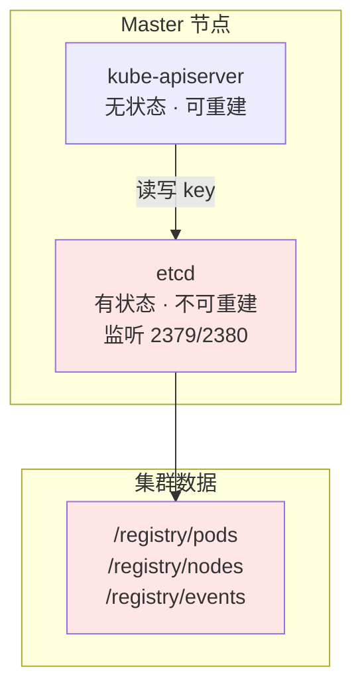
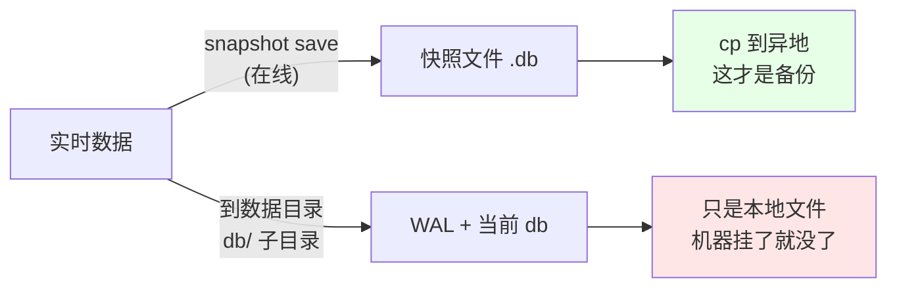
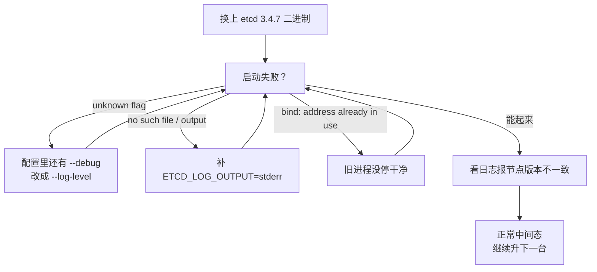
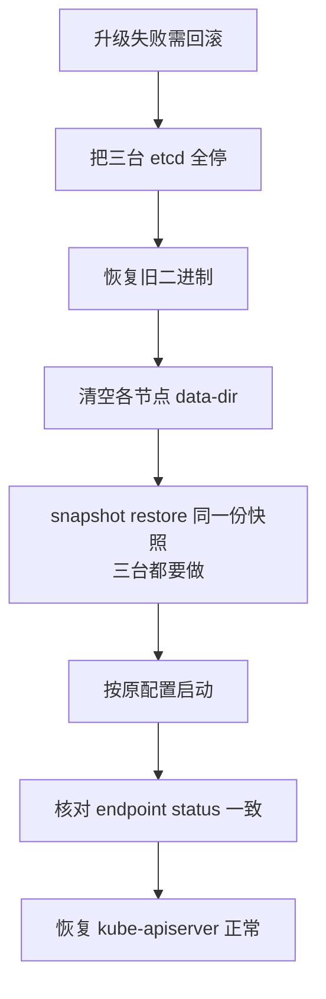

# Kubernetes 集群部署: etcd 集群 3.3 到 3.4 的滚动升级与快照备份

etcd 是 Kubernetes 的**唯一有状态组件**，也是整个集群里唯一不能随便重建的东西 —— 控制面所有组件都是无状态的，删了能重新拉起，etcd 删了数据是找不回来的（除非有备份）。

这一节讲两件事：**快照怎么备**，以及 **3.3 → 3.4 的滚动升级怎么做**。

结论先给：

- 升级 etcd 四步走：**打快照 → 传新包 → 停单节点 → 换二进制 + 改配置 + 重启**，逐台来，全程不用停机；
- 升级顺序是 **先从节点、后主节点**，因为 3.4 节点能兼容 3.3 节点，反过来不行；
- 3.3 → 3.4 真正会卡住你的不是数据格式，而是**日志参数变了**（3.4 换成 zap 日志层），启动失败基本都报在这一行。

## 纲要

- etcd 在集群里的位置与升级风险
- 升级前：快照怎么打、怎么验、怎么存
- etcdctl 双向认证下的正确用法
- 3.3 → 3.4 的配置差异
- 滚动升级时序（先从后主）
- 升级中的异常与回滚
- 升级后验证

## etcd 的位置与升级风险

二进制安装的集群里，etcd 通常**由 systemd 直接托管**，不跑在 Pod 里，这点和 kubeadm 安装的容器化 etcd 不同。



风险点集中在两处：

| 风险 | 触发条件 | 后果 |
| --- | --- | --- |
| 快照失效 | 只 save 到本机磁盘 | 机器故障 = 数据全丢 |
| 集群写不可用 | 一次停两台以上 | 控制面报 `etcdserver: too many errors` |
| 版本错配 |  Upgrade 中途断网/中断 | 节点版本不一致，等最后一台起来自动收敛 |

**升级一定要在非业务时段做**，这是硬要求：etcd 单节点重启期间，`kube-apiserver` 对它的 **读写会短暂阻塞**（不是报错，是超时等待），如果恰好有写操作撞上，API 请求会变慢甚至 504。

## 升级前：快照怎么打

etcd 的快照有两个层次：



**「备份一台就够了」不等于「备份一份就够」**：集群三台，只需在一台节点上save一次（数据是全量的），但 save 出来的文件**必须立刻 `scp` 到第三台机器或对象存储**，否则等于没备。

### etcdctl 在双向认证下怎么调

集群装的是双向 TLS，不指定证书 `etcdctl` 连不上。而且 `ETCDCTL_API` 默认是 2，老 API 里没有 `snapshot save` 语义一致的行为，**必须先切到 3**。

```bash
export ETCDCTL_API=3
export ETCDCTL_CA_CERT="/etc/etcd/ssl/ca.pem"
export ETCDCTL_CERT="/etc/etcd/ssl/etcd-server.pem"
export ETCDCTL_KEY="/etc/etcd/ssl/etcd-server-key.pem"
export ETCDCTL_ENDPOINTS="https://10.0.0.11:2379,https://10.0.0.12:2379,https://10.0.0.13:2379"
```

几个容易写错的细节：

- 证书目录在 `/etc/etcd/ssl`，不是 `/etc/kubernetes/ssl` —— 二进制部署通常给 etcd 单独一套 CA；
- 参数要用**等号**（`--cacert=/path`），不是空格分开；
- `ETCDCTL_API=3` 是**进程级环境变量**，写进 `~/.bashrc` 或者在命令前临时 export，别指望它全局生效；
- 忘了 `ETCDCTL_API=3` 会看到 `Error: unknown command "snapshot" for "etcdctl"`。

**`--help` 一定要会看**（课程里反复强调这条）：命令记不住就查，别靠猜。

```bash
etcdctl snapshot save --help          # 看 save 子命令的参数
etcdctl snapshot --help               # 看 snapshot 组
etcdctl endpoint health -h
```

三个高频子命令：

| 子命令 | 用途 |
| --- | --- |
| `etcdctl snapshot save <file>` | 在线备份，不阻塞读写 |
| `etcdctl snapshot restore <file>` | 离线恢复（**会新建数据目录，需要先清空**） |
| `etcdctl endpoint status -w table` | 看节点版本 / 是否是主（leader）/ 数据revision |

```bash
etcdctl endpoint status -w table
```

输出里 `IsLeader: true` 那一行就是主节点，`DBSize` 是当前数据量，`Epoch` 和 `RaftIndex` 可以用来对比各节点数据是否一致。

### 打快照

```bash
# 推荐写法：带 -w table 看结果，带 --endpoints 指定任一存活节点
etcdctl --endpoints="https://10.0.0.11:2379" snapshot save /data/backup/etcd-20220610-2301.db

# 看快照元数据
etcdctl snapshot status /data/backup/etcd-20220610-2301.db
```

`snapshot status` 会告诉你快照里 **revision 范围**和真实数据大小，用它来确认快照不是空壳（DBSize 明显小于平时就说明没备上）。

```text
/data/backup/
├── etcd-20220610-2301.db      # 快照本体
├── etcd-20220610-2301.db.sha256   # 校验和（etcdctl 生成）
└── checksum.txt               # 我们自己的 md5 清单
```

**然后把文件搬走**：

```bash
scp /data/backup/etcd-20220610-2301.db backup@10.0.0.254:/data/etcd-backup/
```

## 3.3 与 3.4 的配置差异

3.3 → 3.4 的**数据格式是兼容的**（都不用导数据），真正变的是**日志与部分实验性参数**。这也是升级当天唯一踩到的坑 —— 换完二进制一启动就 failures。

3.3 的 `/etc/etcd/ssl/../etcd.conf`（systemd 用的 EnvironmentFile）：

```bash
# etcd 3.3 版本配置
ETCD_NAME="etcd-1"
ETCD_DATA_DIR="/var/lib/etcd"
ETCD_LISTEN_PEER_URLS="https://10.0.0.11:2380"
ETCD_LISTEN_CLIENT_URLS="https://10.0.0.11:2379,https://127.0.0.1:2379"
ETCD_ADVERTISE_CLIENT_URLS="https://10.0.0.11:2379"
ETCD_INITIAL_ADVERTISE_PEER_URLS="https://10.0.0.11:2380"
ETCD_INITIAL_CLUSTER="etcd-1=https://10.0.0.11:2380,etcd-2=https://10.0.0.12:2380,etcd-3=https://10.0.0.13:2380"
ETCD_INITIAL_CLUSTER_STATE="existing"
ETCD_INITIAL_CLUSTER_TOKEN="k8s-cluster-token"

ETCD_HEARTBEAT_INTERVAL="100"
ETCD_ELECTION_TIMEOUT="1000"

ETCD_ENABLE_V2="true"
```

3.4 的对应配置，**变更点只有一行**：

```bash
# etcd 3.4 版本配置
ETCD_NAME="etcd-1"
ETCD_DATA_DIR="/var/lib/etcd"
ETCD_LISTEN_PEER_URLS="https://10.0.0.11:2380"
ETCD_LISTEN_CLIENT_URLS="https://10.0.0.11:2379,https://127.0.0.1:2379"
ETCD_ADVERTISE_CLIENT_URLS="https://10.0.0.11:2379"
ETCD_INITIAL_ADVERTISE_PEER_URLS="https://10.0.0.11:2380"
ETCD_INITIAL_CLUSTER="etcd-1=https://10.0.0.11:2380,etcd-2=https://10.0.0.12:2380,etcd-3=https://10.0.0.13:2380"
ETCD_INITIAL_CLUSTER_STATE="existing"
ETCD_INITIAL_CLUSTER_TOKEN="k8s-cluster-token"

ETCD_HEARTBEAT_INTERVAL="100"
ETCD_ELECTION_TIMEOUT="1000"

# 3.4 新增：显式指定日志输出（zap 日志层）
# 老版本用 --debug / 隐式 stderr，3.4 起日志走统一的 logger 配置
ETCD_LOG_OUTPUT="stderr"
ETCD_LOG_LEVEL="info"
```

关键差异说明：

| 项 | 3.3 | 3.4 | 影响 |
| --- | --- | --- | --- |
| 日志层 | capnslog | **zap** | 日志格式变了，日志采集正则要跟着改 |
| `--debug` | 布尔开关 | **已废弃** → `--log-level=debug` | 再用会报 unknown flag |
| `--log-output` | 默认 stderr | 显式配置更稳 | 3.4 上漏配会在某些 systemd 环境下丢日志 |
| v2 API | 默认支持 | `--enable-v2` 开关 | 3.4 仍可用，3.5 才移除；k8s 完全不用 v2 |
| 数据格式 | 相同 | 相同 | **无需导出导入** |



## 滚动升级时序

**规则：一次只停一台；先升从节点，最后升主节点。**

理由：3.4 的节点可以和 3.3 节点组成混合集群（3.4 server 能跟 3.3 peer 通信），但**反过来不成立** —— 如果把主节点先换成 3.4，剩下两台还是 3.3，leader 与 follower 版本倒挂，可能出现 `incompatible version` 拒绝 Joining。所以标准顺序是：


时序表：

| 步骤 | 动作 | 影响 | 预计耗时 |
| --- | --- | --- | --- |
| 1 | 打快照并搬运 | 无 | 1~3 分钟 |
| 2 | 停从节点 etcd-2 | 剩余两台仍可写 | < 5 秒 |
| 3 | 换二进制、改配置、启动 | 集群短暂失去一个成员 | < 10 秒 |
| 4 | `endpoint health` 全绿 | 无 | 几秒 |
| 5 | 同上处理 etcd-3 | 同 | — |
| 6 | 停主节点 etcd-1 | **触发重新选主**，写请求阻塞数百毫秒 | < 10 秒 |
| 7 | 换 + 启 etcd-1 | 三节点重新收敛 | — |
| 8 | `endpoint status` 三台版本一致 | 无 | — |

完整命令序列（在 etcd-2 上执行）：

```bash
# ---------- 0. 前置：确认健康
export ETCDCTL_API=3
ETCDCTL_CA_CERT=/etc/etcd/ssl/ca.pem ETCDCTL_CERT=/etc/etcd/ssl/etcd-server.pem \
ETCDCTL_KEY=/etc/etcd/ssl/etcd-server-key.pem
ETCD="etcdctl --endpoints=https://10.0.0.11:2379,https://10.0.0.12:2379,https://10.0.0.13:2379"

$ETCD endpoint health -w table
$ETCD endpoint status -w table      # 记住谁是 leader

# ---------- 1. 停止
systemctl stop etcd

# ---------- 2. 备份旧二进制
mkdir -p /usr/local/bin.bak/20220610
cp /usr/local/bin/etcd /usr/local/bin/etcdctl /usr/local/bin.bak/20220610/

# ---------- 3. 下发新包并覆盖
install -m 755 /tmp/etcd-v3.4.7-linux-amd64/etcd    /usr/local/bin/etcd
install -m 755 /tmp/etcd-v3.4.7-linux-amd64/etcdctl /usr/local/bin/etcdctl
/usr/local/bin/etcd --version | head -3             # 确认是 3.4.7

# ---------- 4. 按上面差异表改配置
sed -i 's/^#ETCD_LOG_OUTPUT/#ETCD_LOG_OUTPUT/' /etc/etcd/etcd.conf
grep -q ETCD_LOG_OUTPUT /etc/etcd/etcd.conf || echo 'ETCD_LOG_OUTPUT="stderr"' >> /etc/etcd/etcd.conf
grep -q ETCD_LOG_LEVEL  /etc/etcd/etcd.conf || echo 'ETCD_LOG_LEVEL="info"'   >> /etc/etcd/etcd.conf

# ---------- 5. 启动并观察
systemctl start etcd
sleep 5
journalctl -u etcd -n 50 --no-pager | grep -iE "ready to serve|published|error|version"

# 日志里出现 "ready to serve client requests" 即完成
```

## 升级中的异常与回滚

| 现象 | 判断 | 处理 |
| --- | --- | --- |
| 日志报 `the server is older than the cluster` | 这是**被回退**的告警，不是升级 | 说明里面有更 Sy的新节点，等它起来 |
| 日志报 `remote peer had higher revision` | 正常中间态 | 新节点落后会追数据，等几秒 |
| 日志报 `the node has stopped serving` | 还没收敛完 | 不要急着操作下一台，等 health 绿 |
| 起不来报 `unknown flag: --enable-v2` | 3.4 仍支持，但拼错/多写了 | 从 `etcd --help` 查正确 flag 名 |
| 起不来报 `permission denied` | `install -m 755` 没执行到位 | 检查 `/usr/local/bin/etcd` 权限 |
| 起不来报 `listen tcp 10.0.0.11:2380: bind: address already in use` | 旧进程残留 | `ps -ef \| grep etcd` kill 掉再启 |
| 三台都起不来 /  quorum lost | 停了超过半数 | **立刻停手**：先确保所有节点能起来，再考虑 restore |

**回滚**：etcd 3.4 **不支持从 3.4 直接降回 3.3 平滑运行**（版本倒挂会拒绝服务）。真要回滚只有一条路：



```bash
# 快照恢复模板（三台各执行一次，且 data-dir 必须为空）
export ETCDCTL_API=3
export ETCD_UNSUPPORTED_ARCH=""
systemctl stop etcd
rm -rf /var/lib/etcd/*

etcdctl \
  --name etcd-1 \
  --data-dir /var/lib/etcd \
  --initial-cluster-token k8s-cluster-token \
  --initial-cluster etcd-1=https://10.0.0.11:2380,etcd-2=https://10.0.0.12:2380,etcd-3=https://10.0.0.13:2380 \
  --initial-cluster-state new \
  --cert-file /etc/etcd/ssl/etcd-server.pem \
  --key-file /etc/etcd/ssl/etcd-server-key.pem \
  --trusted-ca-file /etc/etcd/ssl/ca.pem \
  snapshot restore /data/backup/etcd-20220610-2301.db

systemctl start etcd
```

注意 `--initial-cluster-state new`，restore 出来的集群必须按**全新集群**身份拉起，否则成员注册对不上。

## 升级后验证

```bash
# 1. 三台版本一致
$ETCD endpoint status -w table
#   Endpoint                  Health   IsLeader   DBSize   ... Version
#   https://10.0.0.11:2379    true     false      25MB         3.4.7
#   https://10.0.0.12:2379    true     false      25MB         3.4.7
#   https://10.0.0.13:2379    true     true       25MB         3.4.7

# 2. 控制面对 etcd 的读写正常
kubectl get node
kubectl get pod -A | tail -5

# 3. 数据 revision 继续增长（说明写入链路通了）
$ETCD endpoint status -w fields --endpoints=https://10.0.0.11:2379 | grep Revision
$ETCD endpoint status -w fields --endpoints=https://10.0.0.13:2379 | grep Revision
```

判断标准很简单：**`kubectl` 能正常读写 + 各节点 revision 差值不超过一个心跳周期**。

## API 速览

| 能力 | 命令 |
| --- | --- |
| 列健康状态 | `etcdctl endpoint health -w table` |
| 看 leader 与版本 | `etcdctl endpoint status -w table` |
| 打快照 | `etcdctl snapshot save <file>` |
| 查快照内容 | `etcdctl snapshot status <file>` |
| 恢复快照 | `etcdctl snapshot restore <file> --name ... --data-dir ... --initial-cluster-state new` |
| 查子命令用法 | `etcdctl snapshot save --help` |
| 指定证书 | `--cacert --cert --key`（或用 `ETCDCTL_*` 环境变量） |
| 切 API 版本 | `export ETCDCTL_API=3`（v2 下 snapshot 语义不同） |
| 看服务日志 | `journalctl -u etcd -f --no-pager` |

## Demo 示例

一个把「升级前检查 + 快照 + 单台滚动升级」串起来的脚本，支持 `-n <节点序号>` 指定要升的节点，可反复执行（幂等）。

```bash
#!/usr/bin/env bash
# etcd-rolling-upgrade.sh —— etcd 3.3 → 3.4 滚动升级（单节点）
# 用法: ./etcd-rolling-upgrade.sh [1|2|3]
set -euo pipefail

NODE_ID="${1:-1}"
PEER_HOST="10.0.0.1${NODE_ID}"
CLIENT_HOST="10.0.0.1${NODE_ID}"
OLD_VER="3.3.18"
NEW_VER="3.4.7"
PKG_DIR="/tmp/etcd-v${NEW_VER}-linux-amd64"
CONF="/etc/etcd/etcd.conf"
DATA_DIR="/var/lib/etcd"
BAK_ROOT="/usr/local/bin.bak"
SNAP_DIR="/data/backup"

export ETCDCTL_API=3
export ETCDCTL_CA_CERT=/etc/etcd/ssl/ca.pem
export ETCDCTL_CERT=/etc/etcd/ssl/etcd-server.pem
export ETCDCTL_KEY=/etc/etcd/ssl/etcd-server-key.pem
ETCDCTL_BIN="/usr/local/bin/etcdctl"
ENDPOINTS="https://10.0.0.11:2379,https://10.0.0.12:2379,https://10.0.0.13:2379"

log() { printf '\n[etcd-upgrade] %s\n' "$*"; }
die() { printf '\n[etcd-upgrade] ERROR: %s\n' "$*" >&2; exit 1; }

log "0/6 当前版本检查"
CUR=$("$ETCDCTL_BIN" --endpoints="$ENDPOINTS" endpoint status -w fields \
      2>/dev/null | awk -F'"' '/"Version"/{print $4}' | head -1)
echo "  本次要升级的节点 ${NODE_ID} 当前二进制版本: ${CUR:-未知}"
[ -f "${PKG_DIR}/etcd" ] || die "新包不存在: ${PKG_DIR}/etcd，先下载解压"

log "1/6 集群健康 + 打快照"
$ETCDCTL_BIN --endpoints="$ENDPOINTS" endpoint health -w table | tee /tmp/health-before.txt
grep -q "true" /tmp/health-before.txt || die "升级前集群不健康，终止"

SNAP="${SNAP_DIR}/etcd-$(date +%Y%m%d-%H%M%S).db"
$ETCDCTL_BIN --endpoints="https://${CLIENT_HOST}:2379" snapshot save "$SNAP"
echo "  快照: $SNAP"
$ETCDCTL_BIN snapshot status "$SNAP" | head -5
log "  立即拷贝到异地（这一步不能省）"
scp "$SNAP" backup@10.0.0.254:"${SNAP_DIR}/" || die "异地拷贝失败，回滚并排查"
log "1/6 快照完成"

log "2/6 停止本节点 etcd"
systemctl stop etcd
sleep 2
pgrep -x etcd >/dev/null && die "etcd 进程仍在，检查 systemd"

log "3/6 备份旧二进制 + 覆盖新二进制"
BAK="${BAK_ROOT}/$(date +%F)-${CUR}"
mkdir -p "$BAK"
[ -f /usr/local/bin/etcd ] && cp /usr/local/bin/etcd /usr/local/bin/etcdctl "$BAK/"
install -m 755 "${PKG_DIR}/etcd"     /usr/local/bin/etcd
install -m 755 "${PKG_DIR}/etcdctl"  /usr/local/bin/etcdctl
/usr/local/bin/etcd --version | head -2
echo "  旧版本已备份到 $BAK"

log "4/6 按 3.4 差异改配置（日志参数）"
grep -q '^ETCD_LOG_OUTPUT' "$CONF" || printf '\nETCD_LOG_OUTPUT="stderr"\nETCD_LOG_LEVEL="info"\n' >> "$CONF"
grep -q 'ETCD_LOG_OUTPUT'  "$CONF" || die "配置写入失败"
grep -nE 'ETCD_LOG_OUTPUT|ETCD_LOG_LEVEL|ETCD_DATA_DIR|ETCD_NAME' "$CONF"

log "5/6 启动并等待收敛"
systemctl start etcd
for i in $(seq 1 30); do
  if "$ETCDCTL_BIN" --endpoints="https://${CLIENT_HOST}:2379" endpoint health >/dev/null 2>&1; then
    echo "  第 ${i} 次探测：本节点已就绪"
    break
  fi
  sleep 2
done
"$ETCDCTL_BIN" --endpoints="$ENDPOINTS" endpoint health -w table

log "6/6 校验新版本"
NEW=$("$ETCDCTL_BIN" --endpoints="https://${CLIENT_HOST}:2379" endpoint status -w fields \
        | awk -F'"' '/"Version"/{print $4}' | head -1)
echo "  本节点现在版本: $NEW"
[ "$NEW" = "3.4.7" ] || die "版本不是 ${NEW_VER}，请检查二进制与 systemd 启动参数"
$ETCDCTL_BIN --endpoints="$ENDPOINTS" endpoint status -w table

log "节点 ${NODE_ID} 升级完成（${OLD_VER} -> ${NEW_VER}）"
log "提示：先升从节点，最后升 IsLeader=true 的那台"
```

## 总结

etcd 升级是整条升级链路里**唯一会碰到数据的环节**，其余组件都是换文件重启。

- **先备后升**：`snapshot save` 只是第一步，必须 `scp` 到别的机器，并 `snapshot status` 确认不是空壳。
- **先从后主**：3.4 能带 3.3，3.3 带不动 3.4；主节点留到最后，减少重新选主次数。
- **一次一台**： quorum 是 3 节点容忍坏 1 台，同时停两台就写死。
- **日志参数是唯一的真坑**：3.4 换 zap 日志层，配置文件补 `ETCD_LOG_OUTPUT="stderr"` 与 `ETCD_LOG_LEVEL="info"`，排查用 `journalctl -u etcd`。
- **回滚就是 restore**：3.4 无法平滑降回 3.3，真出事要三台清空 data-dir 统一 `snapshot restore`，所以快照必须在动手前就有。

