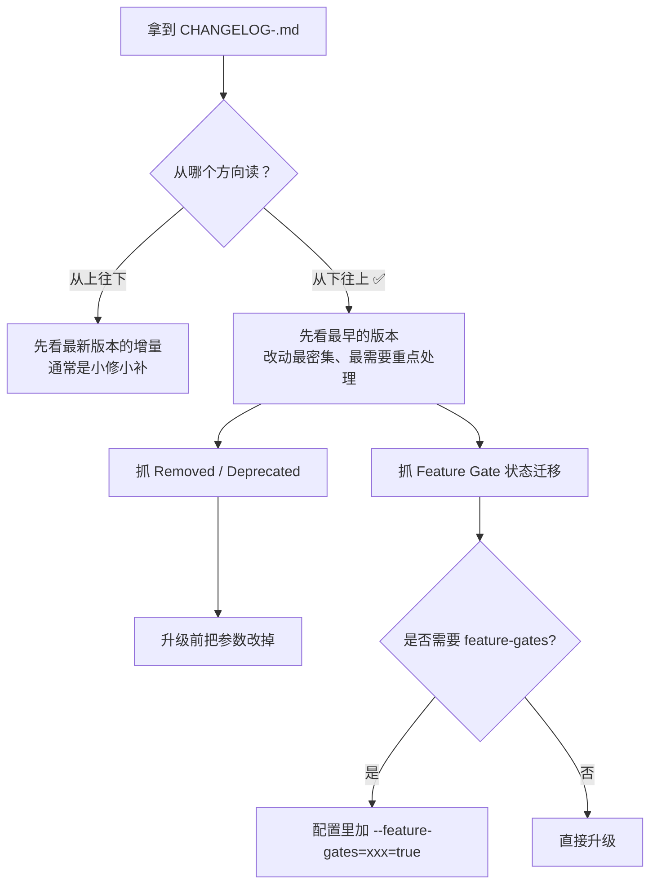
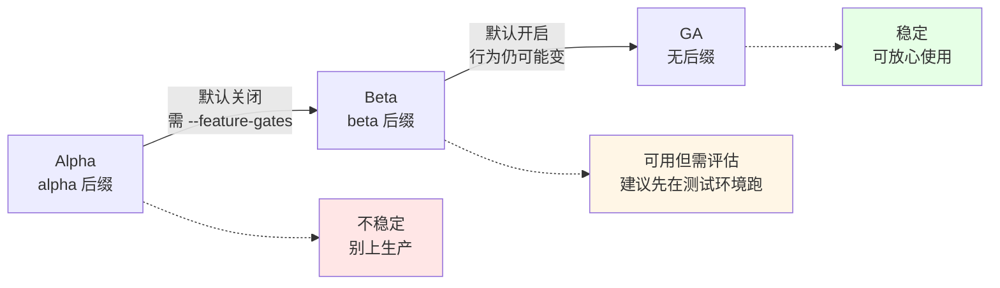
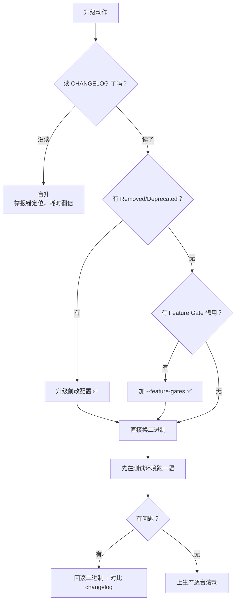
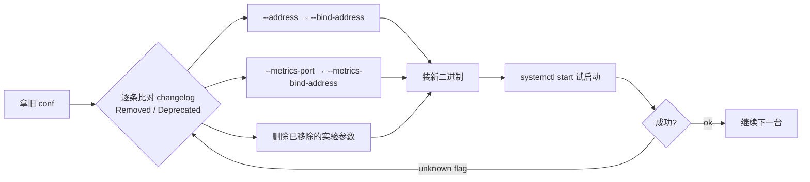
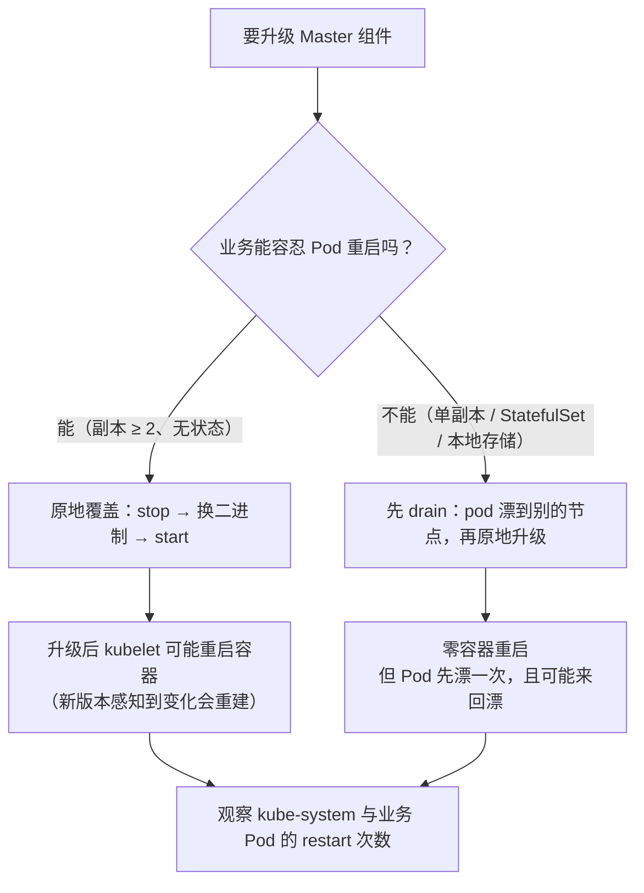

# Kubernetes 集群部署: Kubernetes 1.19 变更点解读与升级前参数体检

升级 Master 之前，有两件事必须先做完：**读懂目标版本的 CHANGELOG**，以及**把废参数从配置里清出去**。这两步跳过，升级就变成盲跳 —— 组件起不来只能靠 `unknown flag` 一行行猜。

这一节讲：CHANGELOG 该怎么读、v1.19 有哪些必须知道的变更、以及一个能跑的参数体检脚本。

结论先给：

- CHANGELOG 从**下往上**读，最下面（最早版本）改动最密集，重点抓 `Removed` / `Deprecated` 和 `Feature Gate` 状态变化；
- v1.19 里对二进制部署影响最大的三类是 **Ingress 升到 `networking.k8s.io/v1`**、**controller-manager / kube-proxy 参数改名**、**部分 CSI 能力转 GA**；
- **先本地原地升级、升级完观察容器是否重启**；要是不想重启，就先 `kubectl drain` 把 Pod 迁走再升 —— 两者只能选一个，不能又要零重启又要不漂移。

## 纲要

- CHANGELOG 的正确读法
- 版本成熟度三段式：alpha / beta / GA
- v1.19 变更清单：按「必改 / 可选 / 增强」三档
- 参数改名对照表（controller-manager、kube-proxy、kubelet）
- Ingress 从 v1beta1 迁到 v1 的写法变化
- 升级 Master 的两种姿势：原地覆盖 vs 先 drain
- 升级前参数体检脚本

## CHANGELOG 的正确读法

每个次版本发布时，官方都会发一份 CHANGELOG。它的结构是**按版本号从新到旧排列**，每个版本下再分 `Highly Important Updates`、`Features`、`Bug Fixes`、`Deprecations` 等小节。



读的时候抓两类条目：

| 条目特征 | 含义 | 要不要改 |
| --- | --- | --- |
| `Deprecated` / `Removed` | 参数或 API 被废弃/移除 | **必须改**，否则起不来 |
| `... goes to GA` | 特性转正，可直接使用 | 可以用了，注意默认值可能变 |
| `... moved to beta` / `alpha` | 特性仍在试验阶段 | 需要 `--feature-gates` 才生效 |
| `Default Changed` | 默认值变化 | **最容易漏**，靠配置继承的行为会悄悄变 |
| `Fixed` / `Optimized` | 修 bug / 优化 | 升级后观察即可 |

顺手带一句：中文社区（K8s 中文社区、Docker 中文社区）会整理部分版本的中文更新说明，英文吃力时可以当补充，**但最终还是要以官方 CHANGELOG 为准**。

## 版本成熟度三段式

理解 alpha / beta / GA，才能判断「这个新特性现在能不能用」。



| 成熟度 | 命名 | 默认 | 生产可用 |
| --- | --- | --- | --- |
| Alpha | `v1.19.0-alpha.1` | 关闭，要加 gate | 否 |
| Beta | `v1.19.0-beta.1` | 多数已开启 | 评估后可用 |
| GA | `v1.19.0` | 开启 | 是 |

一个版本里**同时存在多种成熟度**，所以读 CHANGELOG 时要分清「哪个特性是哪个状态」。演示环境可以用 beta 摸底，生产只认 GA。

## v1.19 变更清单

按对二进制部署的**实际冲击**分三档（具体条目以官方 CHANGELOG 为准，下表是重点项归纳）：

### 必改档（不升会报错 / 功能失效）

| 变更 | 影响 | 处理 |
| --- | --- | --- |
| **Ingress 支持 `networking.k8s.io/v1`** | v1beta1 上的部分字段（如 `backend` 结构）写法不同 | 存量 Ingress 提前 rewrite |
| **`extensions/v1beta1` 相关 API 已移除** | Ingress / NetworkPolicy / PodSecurityPolicy 读写失败 | 统一改到 `networking.k8s.io/*`、`policy/*` |
| **kube-controller-manager `--address` 废弃** | 启动报 unknown flag | 换成 `--bind-address` |
| **kube-proxy 的 health/metrics 参数调整** | 启动报 unknown flag | 改用 `--healthz-bind-address` / `--metrics-bind-address` |
| **`--insecure-port` 类参数进一步收敛** | 安全上下文收紧 | 显式配置 `--secure-port` + 认证授权 |

### 可选档（想用才开 gate）

| 特性 | 需要什么 | 用途 |
| --- | --- | --- |
| **PVC `dataSource`（VolumeSnapshot 通用化）** | `--feature-gates=...=true` | 从快照恢复 PVC，适配自定义存储 |
| **Pod 级 `runAsUser` / `runAsGroup` / `fsGroup`** | `--feature-gates=...=true` | 指定 Pod 运行的用户/用户组/文件组 |
| **通用临时卷（Generic Ephemeral Volume）** | feature gate | 不用先建 PVC 就能用临时存储 |
| **kube-scheduler 多配置（Scheduling Profile）** | `--config` 指定多套 profile | Pod 用 `spec.schedulerName` 选策略 |

### 增强档（升级后自动生效）

| 特性 | 状态 | 说明 |
| --- | --- | --- |
| **CSI Driver / Block Volume 转正** | GA | 通用块存储可直接用 |
| **Windows 容器 `runAsUserName`** | GA | Windows 节点场景 |
| **EndpointSlice 转 beta** | beta | Service 后端拓扑更细，配合拓扑路由 |
| **kube-scheduler 多 profile 可配置** | 能力增强 | 一个集群并存多种调度策略 |
| **临时容器 / `kubectl debug`** | 默认可用 | 不用再手写临时容器 yaml |



## 参数改名对照表

二进制部署最大的麻烦就是**参数散在各个 conf 文件里**，升级时只换二进制不换参数，第一个报错就是 `unknown flag`。

```text
/etc/kubernetes/                    # Master 侧配置
├── apiserver/
│   ├── kube-apiserver.conf         # 主进程参数 + TLS 配置
│   └── audit-policy.yaml           # 审计策略（非必须）
├── controller-manager/
│   └── kube-controller-manager.conf
├── scheduler/
│   └── kube-scheduler.conf
├── ssl/                            # 证书
│   ├── ca.pem / ca-key.pem
│   ├── kube-apiserver.pem / -key.pem
│   ├── kube-controller-manager.pem
│   ├── scheduler.pem
│   ├── kubelet.pem / kubelet-client.pem
│   └── aggregate-admin.pem         # 聚合层（metrics-server）用
├── manifests/                      # 控制面静态 Pod（kubelet 自举）
│   ├── kube-apiserver.yaml
│   ├── kube-scheduler.yaml
│   └── kube-controller-manager.yaml
└── etcd/
    └── etcd.conf

/usr/local/bin/                     # 二进制
├── kube-apiserver
├── kube-controller-manager
├── kube-scheduler
├── kubelet
├── kube-proxy
├── kubectl
└── etcd / etcdctl
```

常见需要跟进的参数（**以目标版本 CHANGELOG 为准，下表是按版本演进整理的常见项**）：

| 组件 | 旧写法（可能已废弃） | 新写法 |
| --- | --- | --- |
| kube-controller-manager | `--address=127.0.0.1` | `--bind-address=0.0.0.0` |
| kube-controller-manager | `--master=127.0.0.1:8080` | `--kubeconfig=/etc/kubernetes/xxx.kubeconfig` |
| kube-scheduler | `--master=...` | `--kubeconfig=...` |
| kube-proxy | `--healthz-port` / `--metrics-port` 直接生效 | `--healthz-bind-address` / `--metrics-bind-address` 显式指定 |
| kubelet | `--experimental-...`（若干实验参数） | 转正或移除后按新名字写 |
| 任意组件 | `--insecure-port=8080` | 关闭或改 `--secure-port` + 认证 |
| 任意组件 | `-v=0` | 日志级别保持 `-v=2`（排障时才临时 `-v=4`） |



**手法建议**：先在测试环境按目标版本装一套（或直接拿一台 Master 做原地演练），把每个组件启起来看有没有报错，把正确的参数清单固化下来，再推生产。

## Ingress 从 v1beta1 迁到 v1

这是 v1.19 里**唯一会影响日常业务配置**的 API 变化。`networking.k8s.io/v1` 与 v1beta1 的字段结构不同，不是简单改个 API 组。

v1beta1 写法：

```yaml
apiVersion: networking.k8s.io/v1beta1
kind: Ingress
metadata:
  name: web-inline
  namespace: default
spec:
  rules:
    - host: www.example.com
      http:
        paths:
          - path: /
            backend:
              serviceName: web-svc
              servicePort: 80
```

v1 写法：

```yaml
apiVersion: networking.k8s.io/v1
kind: Ingress
metadata:
  name: web-inline
  namespace: default
spec:
  rules:
    - host: www.example.com
      http:
        paths:
          - path: /
            pathType: Prefix
            backend:
              service:
                name: web-svc
                port:
                  number: 80
```

差异对照：

| 维度 | `networking.k8s.io/v1beta1` | `networking.k8s.io/v1` |
| --- | --- | --- |
| 后端字段 | `backend.serviceName` + `backend.servicePort` | `backend.service.name` + `backend.service.port.{number\|name}` |
| 路径类型 | 无（隐式） | **必须给 `pathType`**：`Exact` / `Prefix` / `ImplementationSpecific` |
| IngressClass | 靠 `kubernetes.io/ingress.class` 注解 | 可用 `spec.ingressClassName`（控制器支持后） |
| 默认后端 | `backend.default` | `defaultBackend` |

```bash
# 批量导出存量 Ingress，人工核对后 rewrite
kubectl get ingress -A -o yaml > /tmp/ingress-all.yaml

# 统计还在用老 API 组的数量
kubectl get ingress -A -o json 2>/dev/null | \
  python3 -c "import sys,json; d=json.load(sys.stdin); \
  print(len([i for i in d.get('items',[]) if i['apiVersion']=='networking.k8s.io/v1beta1']))"

# 逐个应用新版本
kubectl apply -f /tmp/ingress-v1/
```

**迁移原则**：先 rewrite **全部**存量 Ingress，再升 apiserver。顺序反了会出现「读得出来、改不动」的半残状态。

## 升级 Master 的两种姿势

这是本节最后、也是最容易选错的一个决策点。



对比：

| 维度 | 原地升级（in-place） | 先 drain 再升级 |
| --- | --- | --- |
| 容器重启次数 | 可能 1 次（升级后重建） | 0 次（若目标节点已就绪） |
| 业务影响 | 短瞬断 | 一次完整的漂移，PrefStop 可优雅退出 |
| 适用对象 | 无状态、副本 ≥ 2 | 单副本、有状态、绑定节点的业务 |
| Controller Manager | **先停掉**再升 | 保持运行（它需要继续调度） |
| 风险 | 组件重启瞬间 apiserver 短暂不可用 | 多节点时 Pod 可能来回漂，重启次数反而变多 |

关于「kubelet 升级后容器会不会重启」：老版本 kubelet 升级完一定会重建自己节点上的容器；新版本如果**升级动作足够快**（在健康检查周期 —— 默认探测间隔 10s、失败 5 次才判定不健康、约 50s 才重启 —— 之内完成），可能来不及感知，容器就不重启。**这是运气，不是保证**，所以不能拿它当方案。

```bash
# 想稳妥就用 drain（注意 --ignore-daemonsets，避免 DaemonSet 死循环）
NODE=node-01
kubectl drain "$NODE" --ignore-daemonsets --delete-emptydir-data \
  --grace-period=60
# ... 升级 kubelet / kube-proxy / 控制面组件 ...
kubectl uncordon "$NODE"
```

`--ignore-daemonsets` 必须带：CNI（Calico）、CNI ("_net")、node-exporter 这些 DaemonSet 的 Pod 带 `node-role.kubernetes.io/master:NoSchedule` 容忍，会一直赖在 Master 上；如果不忽略，drain 会把它们反复踢了又拉，变成死循环。

## Demo 示例

升级前的**参数体检脚本**：扫一遍所有组件的 conf 文件，把 known 废弃参数列出来，输出一份待改清单。只读、不修改任何配置。

```bash
#!/usr/bin/env bash
# kube-precheck-params.sh —— 升级前参数体检（只读）
set -uo pipefail

CONF_DIRS="/etc/kubernetes/controller-manager /etc/kubernetes/scheduler /etc/kubernetes/apiserver /etc/kubernetes/proxy /etc/kubernetes/kubelet /etc/etcd"
# 已知在新版本被移除/改名的参数：参数名 -> 新参数名
declare -A DEPRECATED=(
  ["--address"]="--bind-address"
  ["--metrics-port"]="--metrics-bind-address"
  ["--healthz-port"]="--healthz-bind-address"
  ["--insecure-port"]="（已移除，改用 --secure-port + 认证）"
  ["--legacy-token-auth-file"]="（已移除）"
  ["--experimental-allocatable-override"]="（已移除）"
)

hr() { printf '\n=== %s ===\n' "$*"; }

hr "0. 收集配置文件"
MAPFILE=()
for d in $CONF_DIRS; do
  [ -d "$d" ] || continue
  while IFS= read -r f; do MAPFILE+=("$f"); done < <(find "$d" -type f \( -name '*.conf' -o -name '*.yaml' -o -name '*.kubeconfig' \) 2>/dev/null)
done
printf '找到 %d 个配置文件\n' "${#MAPFILE[@]}"
printf '%s\n' "${MAPFILE[@]}"

hr "1. 疑似废弃参数扫描"
FOUND=0
for f in "${MAPFILE[@]}"; do
  while IFS= read -r line; do
    flag=$(printf '%s' "$line" | sed -n 's/^[[:space:]]*\(--[a-z0-9-]*\).*/\1/p')
    [ -z "$flag" ] && continue
    if [ -n "${DEPRECATED[$flag]:-}" ]; then
      printf '  [%s] %s:%s\n      旧参数: %s\n      建议改成: %s\n' "$flag" "$f" "" "$flag" "${DEPRECATED[$flag]}"
      FOUND=$((FOUND + 1))
    fi
  done < "$f"
done
[ "$FOUND" -eq 0 ] && printf '  未发现已知废弃参数\n'

hr "2. Ingress API 组扫描（v1.19 前必须迁到 networking.k8s.io/v1）"
kubectl get ingress -A -o json 2>/dev/null | \
  python3 -c "
import sys, json
d = json.load(sys.stdin)
for i in d.get('items', []):
    if i.get('apiVersion') == 'networking.k8s.io/v1beta1':
        print('  老版本 Ingress 需迁移: %s/%s' % (i['metadata']['namespace'], i['metadata']['name']))
"

hr "3. 控制面 Pod 是否跑了静态 Pod（说明是二进制/静态 Pod 部署）"
ls /etc/kubernetes/manifests/ 2>/dev/null | sed 's/^/  /' || true

hr "4. 各组件当前版本"
for b in kube-apiserver kube-controller-manager kube-scheduler kubelet kube-proxy etcd; do
  v=$(/usr/local/bin/"$b" --version 2>/dev/null | head -1)
  printf '  %-26s %s\n' "$b" "${v:-未安装/路径不在 /usr/local/bin}"
done
kubectl version --short 2>/dev/null || kubectl version

hr "5. feature-gates 现状"
grep -rho -- '--feature-gates=[^ "]*' ${CONF_DIRS} 2>/dev/null | sort -u | sed 's/^/  /' || true
printf '\n（以上为空说明未启用任何 gate；新特性要看 changelog 决定要不要开）\n'
```

升级后**验证**用的命令：

```bash
# 各组件版本一致性
/usr/local/bin/kube-apiserver --version
/usr/local/bin/kube-controller-manager --version
/usr/local/bin/kube-scheduler --version
kubectl version

# 控制面静态 Pod 是否重新拉起成功（静态 Pod 由 kubelet 管理，名字带后缀）
kubectl get pod -n kube-system | grep -E 'kube-apiserver|kube-controller|kube-scheduler'

# 参数是否真的生效（看正在运行的命令行）
ps -ef | grep -E 'kube-apiserver|kube-controller-manager|kube-scheduler' | grep -v grep

# 日志有没有恐慌
journalctl -u kube-apiserver -n 100 --no-pager | grep -iE 'unknown flag|invalid|fatal' || echo "  无异常"
```

## API 速览

| 能力 | 做法 |
| --- | --- |
| 看某版本更新条目 | 读 `CHANGELOG-<version>.md`，从下往上 |
| 判断特性成熟度 | 看版本号后缀 `alpha` / `beta` / 无后缀 |
| 开/关试验特性 | 组件参数 `--feature-gates=Name=true,Other=false` |
| 查参数是否被支持 | `<binary> --help \| grep <flag>` |
| 迁 Ingress 到 v1 | 改 `apiVersion` + 改 `backend.service.*` 结构 + 补 `pathType` |
| 找废弃参数 | `kubectl get pod -n kube-system -o yaml` 里看实际命令行 |
| 逐台下线节点 | `kubectl drain <node> --ignore-daemonsets --delete-emptydir-data` |
| 恢复可调度 | `kubectl uncordon "$NODE"` |
| 看组件日志 | `journalctl -u <component> -f --no-pager` |

## 总结

读 CHANGELOG 是升级的第一道工序，不是可有可无的仪式。

- **从下往上读 CHANGELOG**，改动最密集的在最早的版本，重点抓 `Removed` / `Deprecated` 与默认值变化。
- **分清 alpha / beta / GA**：alpha 要开 gate 别上生产，GA 才能放心用；演示环境可以先摸底。
- **v1.19 的三类必查项**：Ingress 迁 `networking.k8s.io/v1`、`controller-manager`/`kube-proxy` 参数改名、CSI 相关能力转正。
- **升级顺序不能反**：先把所有存量 Ingress/资源 rewrite 到新 API 组，再升 apiserver；否则会变成「读得出来、改不动」。
- **原地升级还是先 drain，二选一**：原地升级偶发容器重建，drain 会漂移一次但零重启；drain 时 `--ignore-daemonsets` 必带，还有原地升级 kubelet 的场合要先把 kube-controller-manager 停掉。

