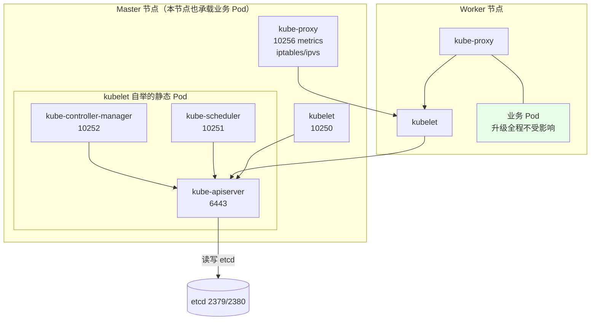
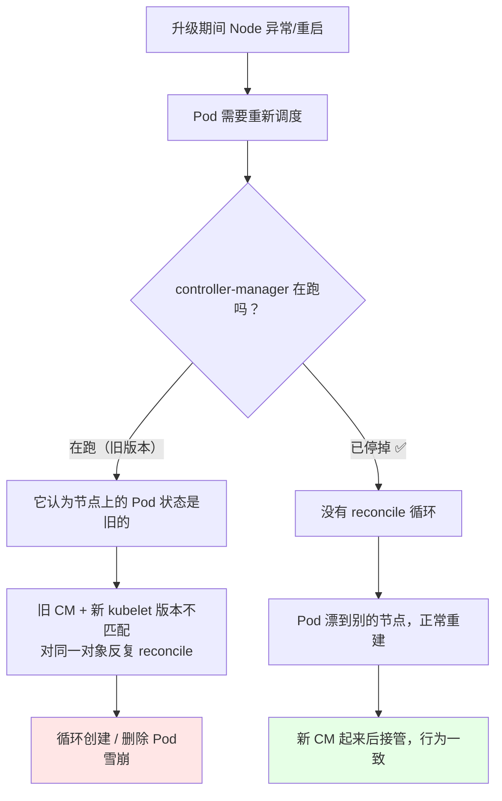
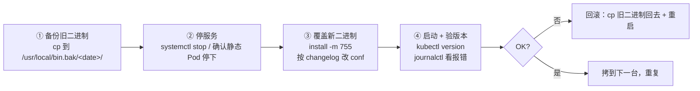
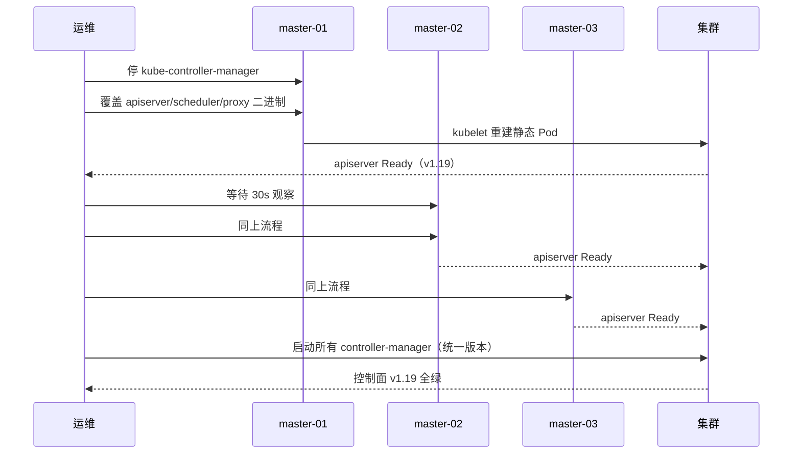

# Kubernetes 集群部署: Master 控制面组件的逐台升级实操

etcd 升完，接着升控制面。这一节只做一件事：**把 Master 上的 kube-apiserver、kube-controller-manager、kube-scheduler、kube-proxy 逐台换成新版本**。

结论先给：

- 控制面升级对 Node 上的 Pod **零影响**（Node 上业务容器不动），所以可以放心在原地做；
- 但**kube-controller-manager 要先停、最后起** —— 升级期间如果 Node 异常导致 Pod 漂移，版本错配的控制面会**无限循环重建 Pod**；
- 真正的坑不是换二进制，是**参数**：v1.19 里 controller-manager 的 `--address` 已废弃、kube-proxy 的 health/metrics 参数要改，漏一条就 `unknown flag` 起不来。

## 纲要

- 控制面组件清单与它们的启动方式
- 为什么要先把 controller-manager 停掉
- 升级四步：备份 → 停 → 换 → 验
- 参数变更的定点处理
- 逐台滚动与并发控制
- 升级后验证与回滚

## 控制面组件清单

二进制部署下，Master 上的组件有两种启动方式，升级动作因此不同：

| 组件 | 启动方式 | 升级动作 | 停掉的影响 |
| --- | --- | --- | --- |
| kube-apiserver | **静态 Pod**（`/etc/kubernetes/manifests/` 由 kubelet 管） | 换二进制 + 等 kubelet 重建静态 Pod | 整个集群不可用 |
| kube-controller-manager | 静态 Pod 或 systemd 托管 | 换二进制 + 重启 | 副本控制器暂停，Pod 不再自愈 |
| kube-scheduler | 静态 Pod 或 systemd 托管 | 换二进制 + 重启 | 新 Pod 不调度，已跑的不受影响 |
| kube-proxy | systemd（每个 Node 都有） | 换二进制 + 重启 | 该节点 Service 转发短暂失效 |
| kubelet | systemd（每个 Node 都有） | 见 Node 升级章节 | 该节点被标记 NotReady |



要点：**静态 Pod 没有 `systemctl`**，改完 `/usr/local/bin/kube-apiserver` 之后，kubelet 会在检测到二进制变化后自动重建静态 Pod 容器。这一点和 kubeadm 的容器化方案一致，反而比纯 systemd 托管省事。

```text
/etc/kubernetes/manifests/          # kubelet 监控这些文件，变了就重建容器
├── kube-apiserver.yaml
├── kube-controller-manager.yaml
└── kube-scheduler.yaml
# 文件里 image: k8s.gcr.io/kube-apiserver:v1.17.0 这种写法在二进制部署里是占位
# 真正跑的版本取决于 /usr/local/bin/kube-apiserver
```

## 为什么先把 controller-manager 停掉

这是控制面升级里**最反直觉、也最值钱**的一条经验。



升级策略与 controller-manager 的关系：

| 升级姿势 | 是否停 controller-manager | 原因 |
| --- | --- | --- |
| **原地升级**（in-place） | **停掉**，全节点升完再起 | 没有调度需求，防止 reconcile 循环 |
| **先 drain 再升级** | **保持运行** | 需要它把 Pod 调度/漂移到别的节点 |
| 有状态业务绑定 Node | 原地升级，不停 | 不能漂移，只能让它重启一次 |

**顺序建议**：

1. 停 `kube-controller-manager`（在升级的 Master 上）；
2. 升 `kube-apiserver`；
3. 升 `kube-scheduler`；
4. 升 `kube-proxy`；
5. 全部 Master 升完 + Node 升完；
6. **再统一把 controller-manager 拉起来**。

## 升级四步

四步走，每一步都不能省：



### ① 备份

```bash
DATE=$(date +%F)
mkdir -p /usr/local/bin.bak/${DATE}
cp -a /usr/local/bin/kube-apiserver \
      /usr/local/bin/kube-controller-manager \
      /usr/local/bin/kube-scheduler \
      /usr/local/bin/kube-proxy \
      /usr/local/bin.bak/${DATE}/
ls -l /usr/local/bin.bak/${DATE}/
```

备份**每台都要做** —— 三台 Master 的二进制是各自独立的，别以为在 A 上备过就等于有回滚。

### ② 停服务

```bash
# 静态 Pod 方式：先让 kubelet 停掉（直接 kill 容器会被 kubelet 拉回来）
# 用 systemd 托管的方式
systemctl stop kube-controller-manager kube-scheduler kube-proxy

# 确认没有残留
ps -ef | grep -E 'kube-apiserver|kube-scheduler|kube-controller-manager|kube-proxy' | grep -v grep
```

如果是静态 Pod 部署（ kube-apiserver / controller-manager / scheduler 走 kubelet），改二进制后**不需要手动停**，kubelet 自己会检测到变化并重建容器；但 kube-proxy 如果是 systemd 起的，要自己停。

### ③ 覆盖 + 改参数

```bash
# 解包新版本控制面
tar -xf kubernetes-server-linux-amd64.tar.gz -C /tmp
cd /tmp/kubernetes/server/bin

install -m 755 kube-apiserver           /usr/local/bin/
install -m 755 kube-controller-manager  /usr/local/bin/
install -m 755 kube-scheduler           /usr/local/bin/
install -m 755 kubectl                  /usr/local/bin/

# 立刻确认版本，别等到一起启动才发现下错包
/usr/local/bin/kube-apiserver --version
/usr/local/bin/kube-controller-manager --version
/usr/local/bin/kube-scheduler --version
```

然后按 CHANGELOG 处理参数。三个最常见的：

```bash
# kube-controller-manager：--address 已废弃 → --bind-address
sed -i 's#--address=127.0.0.1#--bind-address=0.0.0.0#' \
  /etc/kubernetes/controller-manager/kube-controller-manager.conf

# kube-proxy：health / metrics 参数显式指定
sed -i 's#--healthz-port=10256#--healthz-bind-address=0.0.0.0 --healthz-port=10256#' \
  /etc/kubernetes/proxy/kube-proxy.conf
sed -i 's#--metrics-port=10249#--metrics-bind-address=0.0.0.0 --metrics-port=10249#' \
  /etc/kubernetes/proxy/kube-proxy.conf

# 实际生效的命令行对照一下
grep -E '(--address|--bind-address|--feature-gates)' /etc/kubernetes/*/*.conf
```

**覆盖-y 的坑**：`cp -i` 遇到同名文件会问「是否覆盖」，脚本里会一直卡住；要么加 `\cp`，要么用 `install`（默认覆盖，不提示）。批量操作统一用 `install`。

### ④ 启动 + 验

```bash
systemctl start kube-apiserver kube-controller-manager kube-scheduler kube-proxy
sleep 10

# 版本核对（serverVersion 变化说明 apiserver 已换新）
kubectl version -o yaml | grep -A2 serverVersion

# 静态 Pod 是否重建成功
kubectl get pod -n kube-system -o wide | grep -E 'apiserver|controller|scheduler'

# 日志里有没有 unknown flag
journalctl -u kube-apiserver -n 100 --no-pager | grep -iE 'unknown flag|invalid|fatal|failed'
```

日志里出现下面这条，说明版本已经换过来了：

```text
I0610 22:41:07.882345   1 server.go:522] Version: v1.19.0
```

## 逐台滚动与并发控制

三台 Master，**绝不能同时操作**：apiserver 一旦全停，整个集群不可用（包括 kubectl、CNI、Dashboard 全部挂）。

| 轮次 | 节点 | 操作 | 集群状态 |
| --- | --- | --- | --- |
| 1 | master-01 | 停 CM → 换 apiserver → 换 scheduler → 换 kube-proxy → 起 | 部分 API 短暂不可用 |
| 2 | 等 30s 观察 | | apiserver 重新就绪 |
| 3 | master-02 | 同上 | 正常（有 2 台旧版） |
| 4 | master-03 | 同上 | 三台全部 v1.19 |
| 5 | 全集群 | 统一启动 controller-manager（若前面停过） | 完全正常 |



## 升级后验证

```bash
# 1. 版本一致
for b in kube-apiserver kube-controller-manager kube-scheduler; do
  printf '%-30s %s\n' "$b" "$(/usr/local/bin/$b --version | head -1)"
done
kubectl version --short

# 2. 静态 Pod 全部 Running 且 Restart 次数不异常
kubectl get pod -n kube-system -o wide | grep -E 'apiserver|controller|scheduler|proxy'

# 3. 调度与副本控制器都活着
kubectl get cs                       # 各组件 Healthy
kubectl create deploy verify --image=nginx:1.19 --replicas=2
kubectl get deploy verify            # AVAILABLE=2 说明 controller-manager 正常
kubectl delete deploy verify

# 4. Node 仍然 Ready（控制面重启不影响 kubelet 上报）
kubectl get node

# 5. 集群 DNS 还能解析（顺带验证 kube-proxy 转发）
kubectl run dns-test --image=busybox:1.32 --rm -it --restart=Never -- nslookup kubernetes
```

## Demo 示例

一个幂等的 Master 组件升级脚本，接收节点序号，可重复执行；带**失败即停**（set -e）与**逐项校验**。

```bash
#!/usr/bin/env bash
# upgrade-master.sh —— 单台 Master 控制面组件升级（幂等）
# 用法: ./upgrade-master.sh 1     # 1/2/3 对应 master-0{1,2,3}
set -euo pipefail

NODE="${1:?用法: $0 <1|2|3>}"
HOST="10.0.0.${NODE}"
PKG="kubernetes-server-linux-amd64.tar.gz"
TMP="/tmp/k8s-upgrade"
BAK_ROOT="/usr/local/bin.bak"

# 需要升级的二进制与其 conf
BINARIES=(kube-apiserver kube-controller-manager kube-scheduler kube-proxy)
CONFS=(
  /etc/kubernetes/controller-manager/kube-controller-manager.conf
  /etc/kubernetes/scheduler/kube-scheduler.conf
  /etc/kubernetes/proxy/kube-proxy.conf
)

log() { printf '\n[master-%s] %s\n' "$NODE" "$*"; }
die() { printf '\n[master-%s] ERROR: %s\n' "$NODE" "$*" >&2; exit 1; }

log "0. 前置校验"
[ "$(hostname -s)" = "master-0${NODE}" ] || echo "  提示: 本机 hostname 不是 master-0${NODE}"
for b in "${BINARIES[@]}"; do
  [ -f "/tmp/k8s/${b}" ] || die "缺少新二进制 /tmp/k8s/${b}（先解压再跑）"
done
kubectl get node "${HOST}" >/dev/null 2>&1 || die "节点 ${HOST} 不在集群中"

log "1. 备份旧二进制"
DATE=$(date +%F)
BAK="${BAK_ROOT}/${DATE}"
mkdir -p "$BAK"
for b in "${BINARIES[@]}"; do
  [ -f "/usr/local/bin/${b}" ] && cp -a "/usr/local/bin/${b}" "$BAK/"
done
echo "  已备份: $(ls ${BAK} | tr '\n' ' ')"

log "2. 停 controller-manager（防 reconcile 循环）"
systemctl stop kube-controller-manager 2>/dev/null || echo "  controller-manager 非 systemd 管理，跳过（静态 Pod 由 kubelet 处理）"
for b in kube-controller-manager kube-scheduler kube-proxy; do
  if pgrep -x "$b" >/dev/null; then
    systemctl stop "$b" || true
    pkill -x "$b" || true
  fi
done
sleep 2
pgrep -x kube-controller-manager >/dev/null && die "controller-manager 仍在运行"

log "3. 覆盖新二进制"
install -d -m 755 "$TMP"
for b in "${BINARIES[@]}"; do
  install -m 755 "/tmp/k8s/${b}" "/usr/local/bin/${b}"
  printf '  %-26s %s\n' "$b" "$(/usr/local/bin/${b} --version 2>/dev/null | head -1)"
done

log "4. 按 changelog 处理废弃参数"
# controller-manager: --address -> --bind-address
if grep -q -- '--address=' "${CONFS[0]}" 2>/dev/null; then
  sed -i 's/--address=[0-9./]*\([[:space:]]\)/--bind-address=0.0.0.0\1/' "${CONFS[0]}"
  echo "  controller-manager: --address -> --bind-address"
fi
# kube-proxy: health / metrics 显式绑定地址
for f in "${CONFS[@]}"; do
  [ -f "$f" ] || continue
  grep -q -- '--metrics-port=' "$f" && \
    sed -i 's/--metrics-port=/--metrics-bind-address=0.0.0.0 --metrics-port=/' "$f"
  grep -q -- '--healthz-port=' "$f" && \
    sed -i 's/--healthz-port=/--healthz-bind-address=0.0.0.0 --healthz-port=/' "$f"
done
grep -nE '(--bind-address|--metrics-port|--healthz-port)' "${CONFS[@]}" 2>/dev/null || echo "  无匹配项（可能未使用该写法）"

log "5. 启动并等就绪"
systemctl start kube-apiserver kube-controller-manager kube-scheduler kube-proxy 2>/dev/null || true
# 静态 Pod 交给 kubelet，轮询等待
for i in $(seq 1 60); do
  if kubectl get pod -n kube-system -o json 2>/dev/null | \
       python3 -c "
import sys,json
d=json.load(sys.stdin)
hit=[p for p in d.get('items',[])
     if p['metadata']['name'].startswith('kube-apiserver')
     and p['status']['phase']=='Running'
     and p['spec']['nodeName']=='${HOST}']
sys.exit(0 if hit else 1)
"; then
    echo "  第 ${i} 次探测：apiserver 已 Running"
    break
  fi
  sleep 3
done

log "6. 校验"
kubectl version --short
kubectl get pod -n kube-system -o wide | grep -E 'apiserver|scheduler|controller-manager'
journalctl -u kube-apiserver -n 200 --no-pager | grep -iE 'unknown flag|invalid flag|fatal' \
  && die "apiserver 启动有报错，回滚二进制到 $BAK" || echo "  apiserver 日志无 unknown flag"

log "master-0${NODE} 控制面升级完成"
log "剩余动作: 等 30s 观察 → 换下一台 → 全部完成后统一启动 controller-manager"
```

回滚（单台）：

```bash
# 1. 停服务
systemctl stop kube-apiserver kube-controller-manager kube-scheduler kube-proxy
# 2. 换回旧二进制（注意目录要一致）
# 下面命令中的变量按你的集群环境赋值后再执行
cp -a /usr/local/bin.bak/$DATE/kube-apiserver /usr/local/bin/
cp -a /usr/local/bin.bak/$DATE/kube-controller-manager /usr/local/bin/
cp -a /usr/local/bin.bak/$DATE/kube-scheduler      /usr/local/bin/
cp -a /usr/local/bin.bak/$DATE/kube-proxy          /usr/local/bin/
# 3. conf 也一并回滚（如果改过）
# 4. 起服务
systemctl start kube-apiserver kube-controller-manager kube-scheduler kube-proxy
# 5. 确认
kubectl version --short
```

## API 速览

| 能力 | 命令 |
| --- | --- |
| 看服务端版本 | `kubectl version -o yaml \| grep -A2 serverVersion` |
| 看组件健康 | `kubectl get cs`（CE 1.19 后为 `kubectl get componentstatuses`） |
| 看静态 Pod 落在哪台 | `kubectl get pod -n kube-system -o wide \| grep apiserver` |
| 看某组件实际命令行 | `ps -ef \| grep kube-apiserver` 或 `kubectl get pod -n kube-system -o yaml` |
| 组件日志 | `journalctl -u kube-apiserver -n 200 --no-pager` |
| 查参数是否支持 | `/usr/local/bin/kube-apiserver --help \| grep <flag>` |
| 二进制版本 | `/usr/local/bin/kube-apiserver --version` |
| 确认调度恢复 | `kubectl create deploy verify --image=nginx --replicas=2` |

## 总结

控制面升级是整个升级链路里**影响面最大、但步骤最机械**的一段。

- **先备份每台二进制**：`cp -a` 到 `/usr/local/bin.bak/<date>/`，回滚就是拷回去，成本最低。
- **controller-manager 先停、全集群升完再起**：原地升级场景下这是防 Pod 循环重建的关键动作；走 drain 路线则相反，需要它继续调度。
- **换二进制必须配改参数**：`--address` → `--bind-address`、kube-proxy 的 health/metrics 显式绑地址，一条漏了就是 `unknown flag`。
- **逐台来，别并发**：apiserver 全停 = 集群全停；每换完一台等 30s 看静态 Pod 是否 Running。
- **静态 Pod 不用手动停**：改完 `/usr/local/bin/kube-apiserver`，kubelet 自己会重建容器；真正需要 `systemctl` 的是 systemd 托管的 kube-proxy。

