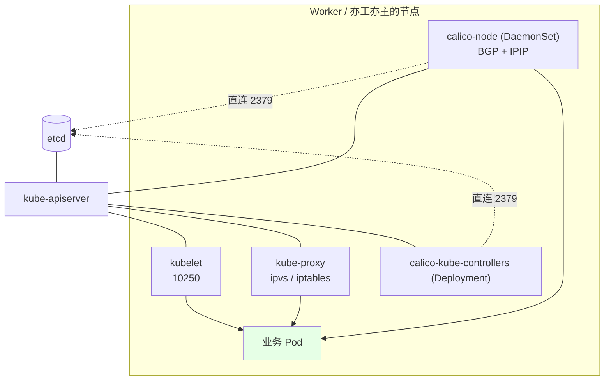
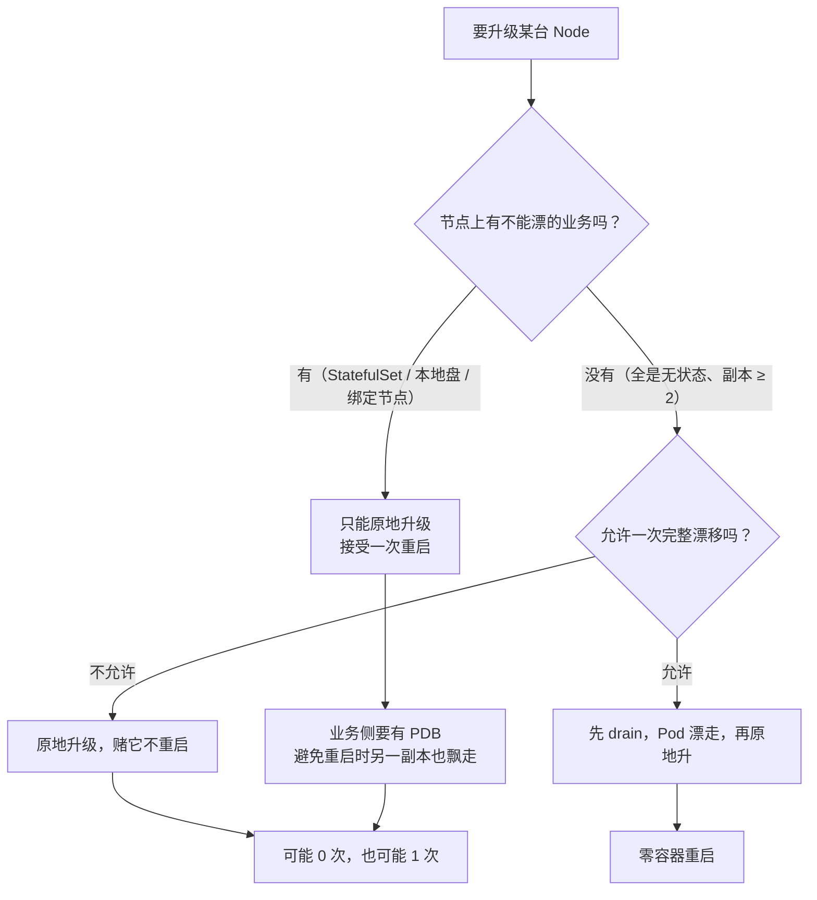
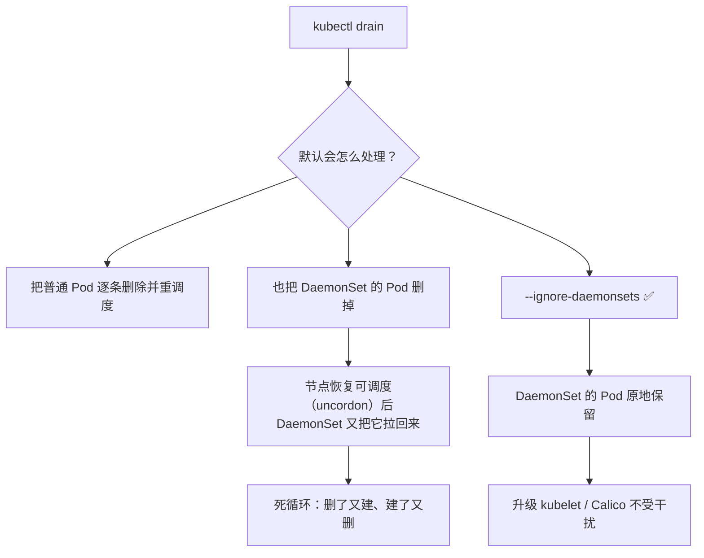
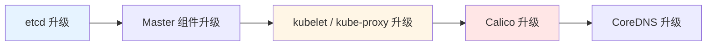
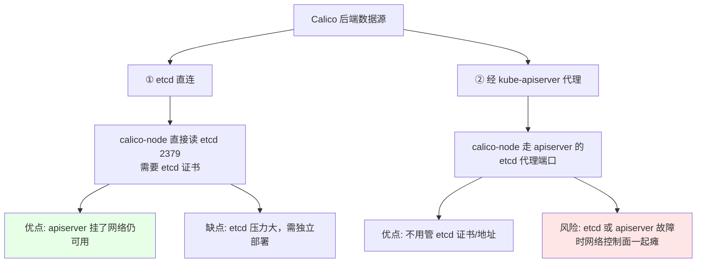
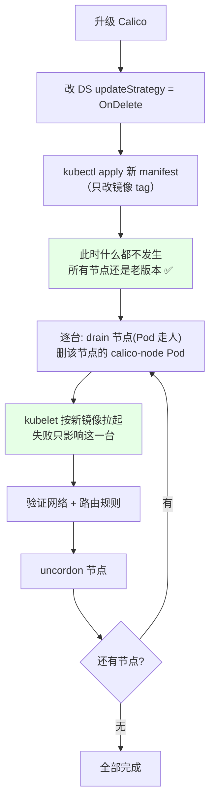
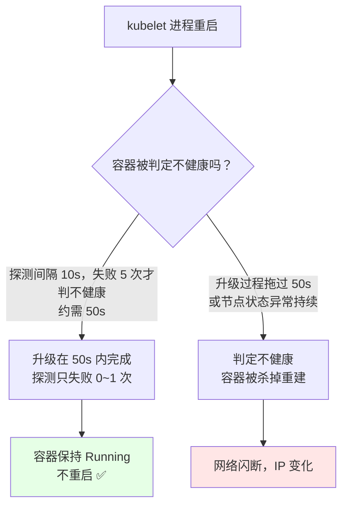

# Kubernetes 集群部署: Node 端 kubelet 升级与 Calico 网络插件版本校准

Node 这层是升级链路里**唯一真正会碰到业务**的一段：kubelet 重启会让节点短暂 NotReady，Calico 重启会造成网络闪断。

这一节讲两件事：**kubelet / kube-proxy 怎么升**（原地 or 先 drain），以及 **Calico 网络插件怎么在不惊动全集群的前提下升级到新版本**。

结论先给：

- **原地升级 kubelet 时，容器「有可能」不重启** —— 因为 Calico 的健康探测是 10s 一次、连续失败 5 次才判定不健康（约 50s），升级太快它来不及判定。**这是运气不是方案**；
- Calico 升级前把 DaemonSet 的 `updateStrategy` 改成 `OnDelete`，升级动作就变成「手动决定它在哪台节点生效」，风险收敛到一个节点；
- Calico 走 **etcd 直连** 而不是经 apiserver 代理 —— 后者在 etcd / apiserver 同时异常时会出现「网络不通」，这是线上真实踩过的坑。

## 纲要
- Node 端组件与升级影响面
- 原地升级 vs 先 drain：怎么选
- drain 的三个坑（`--ignore-daemonsets`、就地 vs 漂移、DaemonSet 死循环）
- kubelet / kube-proxy 原地升级步骤
- Calico 的两种 datastore 接法及其风险
- Calico 升级：OnDelete 策略与滚动节奏
- 升级后网络验证

本次涉及的目录结构（Node 升级涉及的落盘结构）：

```text
├── bin/            # kubelet、kube-proxy 二进制，替换前先备份
├── cfg/            # kubelet.conf、bootstrap.kubeconfig
├── ssl/            # kubelet 客户端证书，注意证书 SAN 要带新节点
└── cni/            # Calico 插件二进制与 10-calico.conflist
```


## Node 端组件与影响面



| 组件 | 升级方式 | 升级影响 | 感知时间 |
| --- | --- | --- | --- |
| kubelet | 换二进制 + `systemctl restart kubelet` | 节点被标记为 `NotReady` 一段时间 | 立即（取决于健康检查周期） |
| kube-proxy | 换二进制 + 重启 | 该节点 Service 转发规则重建，可能有毫秒级丢包 | 立即 |
| calico-node（DaemonSet） | 改镜像 tag + 滚动替换 | **网络闪断**，Pod 间不通 | 取决于探测周期（~50s） |
| calico-kube-controllers | Deployment 滚动更新 | 策略同步暂停 | 几十秒 |

MySQL、Redis 这类**有状态、绑定节点的业务，原地升级风险极高**：它们不能漂移，升级 kubelet 一定伴随重启，等于给自己制造一次计划内宕机。这种场景只能等维护窗口。

## 原地升级 vs 先 drain

上一节讲 Master 时给过结论，Node 侧逻辑一样，但**适用条件更严**：



| 维度 | 原地升级 | 先 drain |
| --- | --- | --- |
| 容器重启 | 0~1 次（不可预测） | 1 次（在别的节点上） |
| 业务中断 | 短瞬断 | Pod 一次完整漂移（PrefStop + 就绪探针可做到零请求中断） |
| 适用 | 有状态、绑定节点 | 无状态、副本 ≥ 2 |
| 复杂度 | 低 | 中（要处理 DaemonSet） |

## drain 的三个坑

`kubectl drain` 是标准动作，但默认参数会给你挖坑：

```bash
NODE=node-01
kubectl drain "$NODE" --ignore-daemonsets --delete-emptydir-data --grace-period=60
kubectl uncordon "$NODE"
```



三个坑：

| 坑 | 现象 | 正确做法 |
| --- | --- | --- |
| **忘带 `--ignore-daemonsets`** | drain 反复删除/重建 calico-node、node-exporter，进入死循环 | 必须带 |
| **Master 也当 Worker 用** | Master 上有 DaemonSet 的 Pod 带 `node-role.kubernetes.io/master:NoSchedule` 容忍，drain 会把它们踢走 | 同样用 `--ignore-daemonsets` 跳过 |
| **用了 cordon 而不是 drain** | `kubectl cordon` 只设不可调度，**不驱逐已有 Pod**，升级 kubelet 照样重启容器 | 要零重启就用 `drain`；只不想接新 Pod 才用 `cordon` |

另外 `--delete-emptydir-data` 会删掉 `emptyDir` 卷里的数据 —— 用之前确认这个节点上没有依赖 emptyDir 的临时数据 Pod。

## kubelet / kube-proxy 原地升级

```bash
# ---------- 1. 备份（每台都要）
DATE=$(date +%F); mkdir -p /usr/local/bin.bak/${DATE}
cp -a /usr/local/bin/kubelet /usr/local/bin/kube-proxy /usr/local/bin.bak/${DATE}/

# ---------- 2. 确认节点状态
kubectl get node "$NODE"                 # 必须 Ready
kubectl cordon "$NODE"                   # 先别接新 Pod（drain 会顺带做）

# ---------- 3. 停 kubelet（Pod 会在这个阶段被驱逐，取决于 --grace-period）
systemctl stop kubelet

# ---------- 4. 换二进制
install -m 755 /tmp/k8s/kubelet   /usr/local/bin/kubelet
install -m 755 /tmp/k8s/kube-proxy /usr/local/bin/kube-proxy
/usr/local/bin/kubelet --version

# ---------- 5. 参数变更（若有）
# TLS Bootstrap、CNI 插件路径等参数在新版本若改名，按 changelog 调整
grep -nE '(--cni-bin-dir|--cni-conf-dir|--node-ip|--pod-infra-container-image)' \
  /usr/local/bin/../etc/kubernetes/kubelet.conf 2>/dev/null || true

# ---------- 6. 重启 kubelet（kubelet 起不来不会立刻 NotReady，它有节点状态上报宽限）
systemctl restart kubelet
systemctl enable kubelet

# ---------- 7. 恢复
kubectl uncordon "$NODE"
kubectl get node "$NODE"
```

**kubelet 版本错配的硬约束**：`kubelet` 与 `kube-apiserver` 的版本差**不得超过一个 minor 版本**。v1.19 的 kubelet 配 v1.17 的 apiserver 是允许的一（最多差 1），但 v1.19 kubelet 配 v1.16 就超了。所以 **Node 升级必须在 Master 升完之后再做**，顺序不能倒。



## Calico 的两种 datastore 接法

这是升级 Calico 之前**必须搞清的前提**，选错了升级只是引信。



| 维度 | etcd 直连 | 经 apiserver 代理 |
| --- | --- | --- |
| 证书 | 需要给 calico-node 挂 etcd 证书 | 不需要 |
| etcd 地址 | manifest 里显式写 `ETCD_ENDPOINTS` | 由 apiserver 转发 |
| apiserver 故障时 | **网络不受影响** | 网络控制面受影响 |
| etcd 故障时 | 网络规则停止更新，**已有 Pod 网络仍通** | 可能连带网络不通 |
| 大规模集群 | 建议 etcd 独立部署、扩成员 | apiserver 压力更大 |
| 同时开了 NetworkPolicy | **推荐 etcd 直连** | 不推荐 |

**真实踩坑记录**：某套集群跑在 OpenStack 虚拟化上，Calico 走 apiserver 代理；一次 etcd 全挂，结果**每台宿主机上的容器网络全部不通**。同一套软件搬到物理机后，走 etcd 直连，etcd 全挂对已建好的 Pod 网络**没有任何影响**（只是新建 Pod 时拿不到 IP 分配）。

结论：**生产环境、特别是同时用 Calico 做 NetworkPolicy 的集群，选 etcd 直连**。节点规模特别大（>50 节点）时，manifest 里还会多出一个负责横向承载连接数的组件（Typha），不要省。

```bash
# 确认当前 Calico 用的是哪种接法
kubectl get pod -n kube-system -o yaml | grep -iE 'ETCD_ENDPOINTS|etcd_ca|CALICO_IPV4POOL_CIDR'
kubectl get pod -n kube-system -o wide | grep -E 'calico|typha'
```

## Calico 升级：OnDelete 策略

Calico 是 DaemonSet，默认 `updateStrategy: RollingUpdate`。**滚动更新在新版本拉起失败时会「刹不住」** —— 节点会被逐个替换，故障节点越多越难回头。

正确姿势：升级前把策略改成 `OnDelete`，让替换动作变成**逐台手动触发**。



manifest 里改两处：

```yaml
apiVersion: apps/v1
kind: DaemonSet
metadata:
  name: calico-node
  namespace: kube-system
spec:
  updateStrategy:
    type: OnDelete        # 原来是 RollingUpdate，升级期间先改成 OnDelete
  template:
    spec:
      containers:
        - name: calico-node
          image: docker.io/calico/node:v3.14.1      # 从 v3.11.1 升到 v3.14.1
          env:
            - name: ETCD_ENDPOINTS
              value: "https://10.0.0.11:2379,https://10.0.0.12:2379,https://10.0.0.13:2379"
            - name: ETCD_CA_FILE
              value: "/calico-secrets/ca.crt"
            - name: CLUSTER_TYPE
              value: "k8s,bgp"
            - name: CALICO_IPV4POOL_CIDR
              value: "172.16.0.0/16"
            - name: CALICO_IPV4POOL_IPIP
              value: "Always"
```

```bash
# 1. 拉官方 manifest（注意选 amd64，别下成 arm64）
#    版本: v3.11.1 -> v3.14.1（跨了 3 个小版本，务必先读对应 Release 说明）
curl -O https://docs.projectcalico.org/archive/v3.14/manifests/calico-etcd.yaml

# 2. 先把 updateStrategy 改成 OnDelete
sed -i 's/type: RollingUpdate/type: OnDelete/' calico-etcd.yaml

# 3. 把镜像 tag 换成目标版本（node 与 node-driver-registry 都要改）
sed -i 's#docker.io/calico/node:v3.11.1#docker.io/calico/node:v3.14.1#g' calico-etcd.yaml
sed -i 's#docker.io/calico/cni:v3.11.1#docker.io/calico/cni:v3.14.1#g' calico-etcd.yaml

# 4. 填入 etcd 证书（base64 后的证书串）
sed -i 's#\#ETCD_CA_CRT#ETCD_CA_CRT#' calico-etcd.yaml
kubectl -n kube-system create secret generic calico-etcd-secrets \
  --from-file=etcd-ca.crt=/etc/etcd/ssl/ca.crt \
  --from-file=etcd-cert=/etc/etcd/ssl/etcd-server.pem \
  --from-file=etcd-key=/etc/etcd/ssl/etcd-server-key.pem \
  --dry-run=client -o yaml | kubectl apply -f -

# 5. 应用（此刻不会动任何节点）
kubectl apply -f calico-etcd.yaml

# 6. 确认仍是老版本在跑
kubectl get pod -n kube-system -o wide | grep calico-node
```

然后逐台推进：

```bash
NODE=node-01
kubectl drain $NODE --ignore-daemonsets --delete-emptydir-data --grace-period=60
kubectl delete pod -n kube-system -l k8s-app=calico-node --field-selector spec.nodeName=$NODE
# 等新 Pod Running 且 READY
kubectl -n kube-system rollout status daemonset/calico-node
kubectl uncordon $NODE
```

**Calico 的兼容性约束**：calico-node 与 calico/cni 的**版本必须一致**，`calico-kube-controllers` 也要同版本；跨小版本升级前先读官方的升级说明（3.11 → 3.14 中间有配置字段迁移，例如旧版的 `calico-config` ConfigMap 字段在新版有增删）。

## 为什么 Calico 升级常常「没有重启容器」

课程里那个现象很值得解释：换完 kubelet 二进制后，容器**并没有重启**。

原因是 calico-node 的存活探测节奏：



calico-node 的探测走 **8080 端口的 HTTP 接口**（存活与就绪各一个路径）；节点异常时它还能容忍 300s 不漂移。所以：

- **升级快 → 不重启（运气好）**
- **升级慢 / 拉镜像卡住 → 探测失败 5 次 → 重启（网络闪断）**

这两个结果都应视为可能，方案里要按「会重启」来设计（业务多副本 + PDB），不能按「不会重启」来设计。

## 升级后网络验证

```bash
# 1. calico-node 全部 Running，且分布到每台节点
kubectl get pod -n kube-system -o wide | grep calico-node

# 2. 路由规则已按新版本重建
ip route | grep -c 'cali'          # 每个 Pod 一条
ip route | head -5

# 3. 跨节点 Pod 互访（挑两台不同节点各起一个 Pod）
kubectl run net-a --image=busybox:1.32 --rm -it --restart=Never -- sh -c \
  "wget -qO- -T3 $POD_IP_B ; echo ok"
kubectl exec net-b -- ping -c 3 "$POD_IP_A"

# 4. Service 转发正常（对应 kube-proxy 已升）
kubectl create svc clusterip net-test --tcp=80:80 -e run=net-test 2>/dev/null || true
kubectl run curl-test --image=busybox:1.32 --rm -it --restart=Never -- wget -qO- -T3 net-test

# 5. NetworkPolicy 仍生效（新老版本都要能挡住）
kubectl apply -f /tmp/deny-all.yaml
kubectl run net-c --image=busybox:1.32 --rm -it --restart=Never -- wget -qO- -T3 net-a
# 期望: 超时（被策略挡住）
```

## Demo 示例

一个串起「kubelet 原地升级 + Calico OnDelete 逐台升级」的脚本。

```bash
#!/usr/bin/env bash
# upgrade-node-calico.sh —— 单节点 kubelet + Calico 升级（幂等）
# 用法: ./upgrade-node-calico.sh <node-name> <calico-image-tag>
set -euo pipefail

    # 执行前先给下面的占位变量赋值，如 NODE_NAME=node1，否则变量为空会导致命令行为不符合预期
NODE="${1:?用法: $0 ${NODE_NAME} ${CALICO_TAG}}"
CALICO_TAG="${2:-v3.14.1}"
NEW_KUBELET_VERSION="${K8S_VERSION:-v1.19.0}"
TMP="/tmp/k8s-upgrade"
BAK="/usr/local/bin.bak/$(date +%F)"

log() { printf '\n[upgrade %s] %s\n' "$NODE" "$*"; }
die() { printf '\n[upgrade %s] ERROR: %s\n' "$NODE" "$*" >&2; exit 1; }

log "0. 前置校验"
kubectl get node "$NODE" >/dev/null 2>&1 || die "节点 $NODE 不存在"
kubectl get node "$NODE" | grep -q ' Ready' || die "节点 $NODE 非 Ready，先修复再升级"
[ -f /tmp/k8s/kubelet ] || die "缺少新 kubelet 二进制: /tmp/k8s/kubelet"
kubectl get pod -n kube-system -l k8s-app=calico-node -o name >/dev/null 2>&1 \
  || echo "  提示: 未找到 calico-node 标签（确认 DS 的 label key）"

log "1. 节点下线（不接新 Pod，不驱逐已有 Pod）"
kubectl cordon "$NODE"

log "2. drain（跳过 DaemonSet，避免反复删建死循环）"
kubectl drain "$NODE" --ignore-daemonsets --delete-emptydir-data --grace-period=60 || echo "  已有 Pod 无家可归，可接受"

log "3. 备份旧 kubelet / kube-proxy"
mkdir -p "$BAK"
[ -f /usr/local/bin/kubelet ] && cp -a /usr/local/bin/kubelet "$BAK/"
[ -f /usr/local/bin/kube-proxy ] && cp -a /usr/local/bin/kube-proxy "$BAK/"

log "4. 原地升级 kubelet / kube-proxy"
systemctl stop kubelet kube-proxy
install -m 755 /tmp/k8s/kubelet    /usr/local/bin/kubelet
install -m 755 /tmp/k8s/kube-proxy /usr/local/bin/kube-proxy
/usr/local/bin/kubelet --version
[[ "$(/usr/local/bin/kubelet --version)" == *"${NEW_KUBELET_VERSION#v}"* ]] \
  && echo "  kubelet 已升级到 ${NEW_KUBELET_VERSION}" || echo "  ⚠ 版本名与预期不一致，请核对"

log "5. 启动并等待节点 Ready"
systemctl restart kubelet kube-proxy
systemctl enable kubelet
for i in $(seq 1 30); do
  kubectl get node "$NODE" 2>/dev/null | grep -q ' Ready' \
    && { echo "  第 ${i} 次探测: 节点已 Ready"; break; }
  sleep 5
done
kubectl get node "$NODE"

log "6. Calico: 确认 DS 已是 OnDelete（否则先改）"
DS=$(kubectl -n kube-system get ds -o jsonpath='{range .items[*]}{.metadata.name}{"\n"}{end}' | grep calico-node | head -1)
[ -n "$DS" ] || die "未找到 calico-node DaemonSet"
kubectl -n kube-system get ds "$DS" -o jsonpath='{.spec.updateStrategy.type}{"\n"}'
kubectl -n kube-system patch ds "$DS" -p \
  '{"spec":{"updateStrategy":{"type":"OnDelete"}}}' 
echo "  updateStrategy 已设为 OnDelete"

log "7. Calico: 更新镜像 tag（此刻不会替换任何 Pod）"
kubectl -n kube-system set image ds/"$DS" \
  calico-node=docker.io/calico/node:"${CALICO_TAG}" \
  calico-node-driver-registry=docker.io/calico/node:"${CALICO_TAG}"
kubectl -n kube-system get ds "$DS" -o jsonpath='{.spec.template.spec.containers[*].image}{"\n"}'

log "8. Calico: 触发本节点替换"
kubectl -n kube-system delete pod -l k8s-app=calico-node --field-selector spec.nodeName="$NODE"
for i in $(seq 1 30); do
  READY=$(kubectl -n kube-system get pod -l k8s-app=calico-node \
            --field-selector spec.nodeName="$NODE" \
            -o jsonpath='{range .items[*]}{.status.phase}{" "}{end}' 2>/dev/null)
  case "$READY" in *Running*) break ;; esac
  sleep 5
done
kubectl -n kube-system get pod -l k8s-app=calico-node -o wide | grep "$NODE"

log "9. 网络校验"
echo "  本机 cali 路由条数: $(ip route | grep -c cali)"
echo "  calico-node 版本: $(kubectl -n kube-system get pod -l k8s-app=calico-node \
        --field-selector spec.nodeName="$NODE" -o jsonpath='{.items[0].spec.containers[0].image}')"

log "10. 恢复调度"
kubectl uncordon "$NODE"
kubectl get node "$NODE"

log "$NODE 升级完成（kubelet ${NEW_KUBELET_VERSION} / calico ${CALICO_TAG}）"
log "提示: 剩余节点重复本脚本；全部完成后核对 kubelet 与 apiserver 版本差 ≤ 1 个 minor"
```

## API 速览

| 能力 | 命令 |
| --- | --- |
| 设不可调度 | `kubectl cordon <node>` |
| 驱逐并恢复 | `kubectl drain <node> --ignore-daemonsets` / `kubectl uncordon "$NODE"` |
| 只看 DaemonSet 别换 | drain 时必带 `--ignore-daemonsets` |
| 查 calico-node 分布 | `kubectl get pod -n kube-system -o wide \| grep calico-node` |
| 改 DaemonSet 更新策略 | `kubectl -n kube-system patch ds calico-node -p '{"spec":{"updateStrategy":{"type":"OnDelete"}}}'` |
| 只替换本节点 Pod | `kubectl -n kube-system delete pod -l k8s-app=calico-node --field-selector spec.nodeName=<node>` |
| 看 DS 滚动状态 | `kubectl -n kube-system rollout status ds/calico-node` |
| 看容器路由 | `ip route \| grep cali` |
| 查 Calico 数据源 | `kubectl get pod -n kube-system -o yaml \| grep -i ETCD_ENDPOINTS` |

## 总结

Node 层是升级链路里唯一会碰到业务的环节，节奏和前面几段完全不是一回事。

- **先判业务性质**：无状态且副本 ≥ 2 → 先 drain 再升，零重启；有状态或绑定节点 → 只能原地升，接受一次重启，并把业务侧的 PDB 配好。
- **drain 必带 `--ignore-daemonsets`**：否则 calico-node、node-exporter 会被反复删建进入死循环。
- **kubelet 与 apiserver 版本差 ≤ 1 个 minor**，所以 Node 必须在 Master 升级之后再做。
- **Calico 先改 `OnDelete` 再 apply**：升级动作从「自动滚全集群」变成「逐台手动触发」，单台失败不外溢。
- **Calico 走 etcd 直连而非 apiserver 代理**：后者在 etcd / apiserver 同时异常时会导致容器网络全部不通；同时开了 NetworkPolicy 的集群尤其要这么选。

