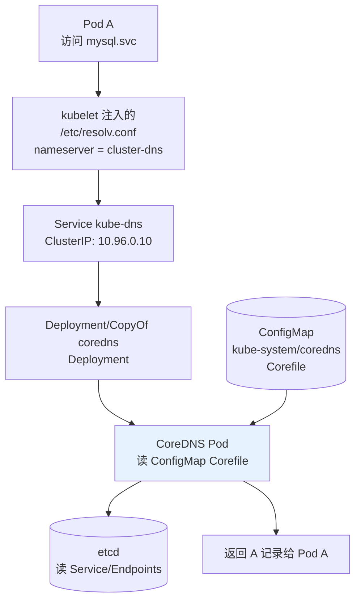
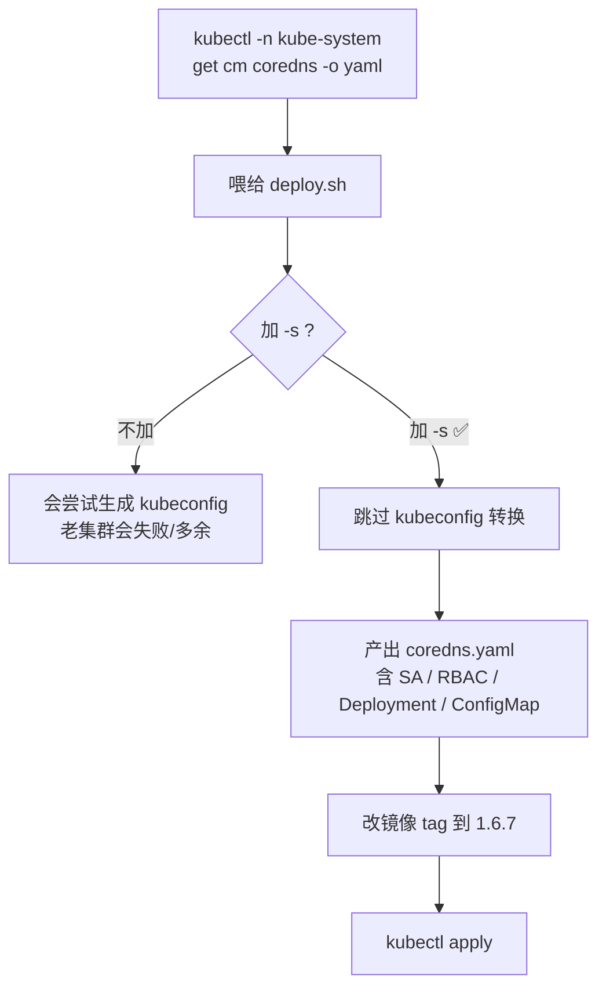
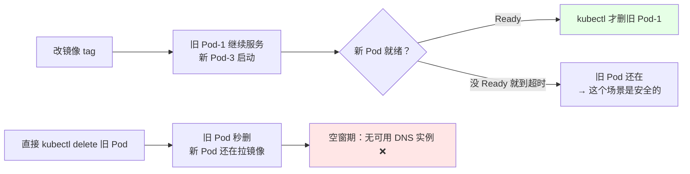
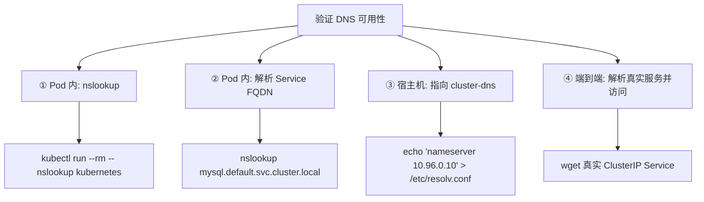

# Kubernetes 集群部署: CoreDNS 从 1.6.6 升级到 1.6.7 的容器化流程

到 CoreDNS 这一步，升级链路（etcd → Master → Node → Calico → CoreDNS）就收尾了。它和其他几段有个本质区别：**CoreDNS 是纯容器层，没有二进制要换**。

结论先给：

- 升级动作只有「**换镜像 tag + apply 新清单**」，风险极低，但**必须在非业务时段做**（滚动更新期间会出现「老的没了、新的还没就绪」的空窗）；
- 二进制部署的集群**没有 kubeadm 生成的现成 yaml**，要用 CoreDNS 仓库里的 `deploy.sh -s` 从集群现状反向生成；
- 生成的清单里那个一次性 kubeconfig 文件要**手动删掉** —— 它只是转换过程的副产品，留在 `kube-system` 里没意义。

## 纲要

- CoreDNS 在集群里的位置与依赖关系
- 二进制集群里的 CoreDNS 从哪来
- 升级前置：备份三样东西
- deploy.sh 生成新清单
- 替换与滚动过程
- 解析验证（Pod 内 + 宿主机两条路径）
- 常见异常

## CoreDNS 的位置

集群 DNS 是 Service 发现的地基，所有 `ServiceName` 解析都走它。



链路上任何一环断掉，表现都是同一件事：**业务报 `could not resolve host`**。所以升级前后都要会验证。

| 组件 | 作用 | 升级影响 |
| --- | --- | --- |
| ConfigMap `coredns` | 存 `Corefile`（DNS 配置） | 丢了 = DNS 不工作 |
| Deployment `coredns` | 跑 2 个 CoreDNS 副本 | 滚动期间解析中断 |
| Service `kube-dns` | 固定 ClusterIP，供 kubelet 的 `--cluster-dns` 使用 | 删了要重建，IP 可能变 |

## 二进制集群里的 CoreDNS 从哪来

kubeadm 安装的集群，`kubeadm init` 会直接产出一份现成的 `coredns.yaml`（完整写着 SA / ClusterRole / Deployment / ConfigMap）。**二进制部署没有这一步**，yaml 通常是当时手工 apply 的，散落在某个目录里。

官方 CoreDNS 仓库（github.com/coredns/deployment）里有一个 `deploy.sh`，作用是把集群里现有的 CoreDNS 配置**反向生成**一份独立可迁移的 yaml。

```text
~/coredns-deployment/
├── deploy.sh                       # 转换脚本
├── README.md
└── deployment/
    └── yaml/
        ├── coredns.yaml            # 转换产物（kubeadm 风格的原始 yaml）
        ├── coredns.yaml.sed        # 上面这份执行 sed 后的结果
        ├── kubeconfig-coredns.yaml # 转换副产品：RBAC 用的 kubeconfig
        └── coredns-configmap.yaml  # 单独抽出的 Corefile
```

```bash
# 拉源码（课程演示时已提前拉好；实际用 git clone）
git clone https://github.com/coredns/deployment.git
cd ~/coredns-deployment

# 生成 yaml（老集群 < 1.17 需要 -s 跳过 kubeconfig 生成）
kubectl -n kube-system get cm coredns -o yaml > deployment/yaml/coredns-configmap.yaml
./deploy.sh -f deployment/yaml/coredns-configmap.yaml -s
```

`-s`（skip）参数的作用：旧版本 CoreDNS 的 yaml 里带一段由 kubeadm 生成的 kubeconfig，`-s` 让脚本**跳过这段的转换**。二进制部署的集群要升级的场景，这基本是必选项。



## 升级前置：备份三样

容器化的升级也要备份，而且备份的对象和二进制不一样：

| 备份对象 | 命令 | 为什么 |
| --- | --- | --- |
| Deployment / ConfigMap | `kubectl -n kube-system get deploy coredns cm coredns -o yaml > bak.yaml` | 回滚就是 apply 回去 |
| 当前 Corefile | `kubectl -n kube-system get cm coredns -o yaml \| tee /tmp/corefile-bak.yaml` | Corefile 一旦被覆盖丢失，DNS 直接废 |
| kube-dns Service | `kubectl -n kube-system get svc kube-dns -o yaml > /tmp/svc-bak.yaml` | 万一要重建，IP 要对得上 |

```bash
BAK=/tmp/coredns-upgrade-$(date +%Y%m%d-%H%M%S); mkdir -p "$BAK"

kubectl -n kube-system get deploy coredns       -o yaml > "$BAK/deploy-coredns.yaml"
kubectl -n kube-system get cm    coredns        -o yaml > "$BAK/cm-coredns.yaml"
kubectl -n kube-system get svc   kube-dns       -o yaml > "$BAK/svc-kube-dns.yaml"
kubectl -n kube-system get sa    coredns        -o yaml > "$BAK/sa-coredns.yaml"
kubectl -n kube-system get clusterrolebinding system:coredns -o yaml > "$BAK/crb-coredns.yaml"

# 顺手备份一份到别的机器
tar zcf "$BAK.tar.gz" -C "$(dirname "$BAK")" "$(basename "$BAK")" && scp ...
```

**回滚极简单**：`kubectl apply -f "$BAK/..."` 回去，或者 `kubectl -n kube-system set image deploy/coredns coredns=registry.k8s.io/coredns:1.6.6`。这就是容器化运维最大的好处。

## 改版本并替换

```bash
# 1. 看当前版本
kubectl -n kube-system get deploy coredns -o jsonpath='{.spec.template.spec.containers[*].image}'
#   registry.k8s.io/coredns:1.6.6

# 2. 改镜像 tag（三条路径任选其一）
kubectl -n kube-system set image deploy/coredns coredns=registry.k8s.io/coredns:1.6.7
# 或改 yaml 后 apply
sed -i 's#coredns:1.6.6#coredns:1.6.7#' deployment/yaml/coredns.yaml
kubectl apply -f deployment/yaml/coredns.yaml

# 3. 删掉转换过程产生的一次性 kubeconfig（二进制集群本来就没有这个用户）
kubectl delete -f deployment/yaml/kubeconfig-coredns.yaml 2>/dev/null || echo "  该文件不存在，可忽略"

# 4. 看滚动过程
kubectl -n kube-system rollout status deploy/coredns --timeout=3m
kubectl -n kube-system get pod -n kube-system -l k8s-app=coredns -o wide
```

滚动策略这块有个**要注意的时序问题**：



结论：**用 `set image` 或 `apply` 触发滚动更新，不要手动 `delete` 旧 Pod**。手动删会让「新 Pod 拉镜像」和「旧 Pod 已消失」撞在一起，中间出现解析中断。这也解释了为什么课程里观察到「老的被直接删掉了，不够好」。

另外，**升级一定要在非业务时段做**。DNS 虽然 Tolerance 高（客户端有重试），但滚动期间如果恰好有集中解析（定时批处理、服务启动瞬间），还是会造成明显超时。

## 解析验证

两层验证：Pod 内（真实业务路径）和宿主机（网络/healthcheck 路径）。



### ① Pod 内解析集群内置服务

```bash
kubectl run dns-test --image=busybox:1.32 --rm -it --restart=Never -- \
  nslookup kubernetes
# Server:        10.96.0.10
# Address:       10.96.0.10:53
# Name:   kubernetes.default.svc.cluster.local
# Address: 10.96.0.1
```

### ② 解析自定义 Service 的 FQDN

```bash
kubectl create deploy nginx --image=nginx:1.19 --replicas=2
kubectl expose deploy nginx --port=80 --target-port=80

kubectl run dns-test --image=busybox:1.32 --rm -it --restart=Never -- \
  nslookup nginx.default.svc.cluster.local
```

### ③ 宿主机直接指向集群 DNS

kubelet 给每个 Pod 注入的 `/etc/resolv.conf` 是这样的：

```text
nameserver 10.96.0.10
search default.svc.cluster.local svc.cluster.local cluster.local
options ndots:5
```

把 `nameserver` 指向集群 DNS，宿主机（或其 healthcheck 容器）就能解析集群内 Service：

```bash
# 临时测试（改前先 cp 一份）
cp /etc/resolv.conf /etc/resolv.conf.bak
echo "nameserver 10.96.0.10" > /etc/resolv.conf

nslookup kubernetes.default.svc.cluster.local
dig @10.96.0.10 nginx.default.svc.cluster.local +short

# 测完还原
cp /etc/resolv.conf.bak /etc/resolv.conf
```

`options ndots:5` 的意思是：查询名里**点少于 5 个**就先补 `search` 后缀再逐级试。这是 DNS 慢查询的常见来源 —— **一般业务访问外部域名时，不要写少于 5 个点**（如 `mysql`，会先试 `mysql.default.svc.cluster.local`、`mysql.svc.cluster.local`、`mysql.cluster.local`，再试 `mysql`，4 次无效查询）。这个行为由 Corefile 里的 `ndots` 控制。

### ④ 端到端

```bash
kubectl run curl-test --image=busybox:1.32 --rm -it --restart=Never -- \
  wget -qO- -T3 http://nginx
```

## 常见异常

| 现象 | 原因 | 处理 |
| --- | --- | --- |
| `nslookup` 报 `no servers could be reached` | Pod 里没拿到 `/etc/resolv.conf` | 检查 kubelet `--cluster-dns` 是否配了 |
| `nslookup` 报 `couldn't get address for 'dns://'` | CoreDNS Pod 全挂 | `kubectl get pod -n kube-system -l k8s-app=coredns` |
| 解析偶发超时 | 滚动更新中间态 | 等滚动结束再测；非业务时段升级 |
| CoreDNS 报 `plugin/kubernetes: no Kubernetes config file found` | deploy.sh 生成时漏了 kubeconfig 或 RBAC | 补上 ClusterRoleBinding `system:coredns` |
| 升级后解析变慢 | Corefile 里的 `cache` / `ndots` 默认值变了 | diff 新旧 Corefile，把旧的补回去 |
| Service 解析正常、Pod 名解析不了 | 没有 StatefulSet 的 Pod 记录（Pod IP 不注册 DNS） | 属预期，集群 DNS 只解析 Service 与 StatefulSet 稳定域名 |
| ClusterIP 变了 | 误删了 kube-dns Service 又重建 | 比对备份的 svc yaml，改回 `--cluster-dns` 指向的 IP |

Corefile 的对照（升级前后要 diff 一遍）：

```yaml
apiVersion: v1
kind: ConfigMap
metadata:
  name: coredns
  namespace: kube-system
data:
  Corefile: |
    .:53 {
        errors
        health
        ready
        kubernetes cluster.local in-addr.arpa ip6.arpa {
          pods insecure
          fallthrough in-addr.arpa ip6.arpa
        }
        prometheus :9153
        cache 30
        loop
        reload
        loadbalance
    }
```

## API 速览

| 能力 | 命令 |
| --- | --- |
| 看 CoreDNS 镜像版本 | `kubectl -n kube-system get deploy coredns -o jsonpath='{.spec.template.spec.containers[*].image}'` |
| 改镜像 | `kubectl -n kube-system set image deploy/coredns coredns=<repo>:<tag>` |
| 看滚动进度 | `kubectl -n kube-system rollout status deploy/coredns` |
| 看 Corefile | `kubectl -n kube-system get cm coredns -o jsonpath='{.data.Corefile}'` |
| 从集群反向生成 yaml | `./deploy.sh -f <configmap.yaml> -s` |
| 触发滚动更新 | `kubectl apply -f coredns.yaml`（**别手动 delete 旧 Pod**） |
| Pod 内解析 | `kubectl run dns-test --image=busybox:1.32 --rm -it --restart=Never -- nslookup <svc>` |
| 宿主机解析 | `dig @<cluster-dns> <svc>.<ns>.svc.cluster.local +short` |
| 看 Pod 注入的 resolv | `kubectl exec <pod> -- cat /etc/resolv.conf` |

## Demo 示例

一个完整的 CoreDNS 升级脚本：备份 → 生成新 yaml → 改 tag → apply → 验证 → 可选回滚。

```bash
#!/usr/bin/env bash
# upgrade-coredns.sh —— CoreDNS 1.6.6 → 1.6.7 升级（含回滚开关）
# 用法: ./upgrade-coredns.sh [rollback]
set -euo pipefail

OLD_TAG="${OLD_TAG:-1.6.6}"
NEW_TAG="${NEW_TAG:-1.6.7}"
NS="${NS:-kube-system}"
REPO="${REPO:-registry.k8s.io/coredns}"
SRC_DIR="${SRC_DIR:-$HOME/coredns-deployment}"
WORK="$(mktemp -d)"

log() { printf '\n[coredns-upgrade] %s\n' "$*"; }
die() { printf '\n[coredns-upgrade] ERROR: %s\n' "$*" >&2; exit 1; }

# ------------------------------------------------------------------ 回滚
if [ "${1:-}" = "rollback" ]; then
  log "回滚到 ${OLD_TAG}"
  kubectl -n "$NS" set image deploy/coredns coredns="${REPO}:${OLD_TAG}"
  kubectl -n "$NS" rollout status deploy/coredns --timeout=3m
  log "回滚完成"
  exit 0
fi

# ------------------------------------------------------------------ 前置
log "0. 前置校验"
kubectl -n "$NS" get deploy coredns >/dev/null 2>&1 || die "未找到 deploy/coredns"
CUR=$(kubectl -n "$NS" get deploy coredns -o jsonpath='{.spec.template.spec.containers[*].image}')
echo "  当前镜像: $CUR"
[ -d "$SRC_DIR" ] || die "缺少源码目录 $SRC_DIR（git clone coredns/deployment）"
command -v dig >/dev/null || echo "  提示: 本机没有 dig，宿主机验证会跳过"

log "1. 备份"
BAK="/tmp/coredns-upgrade-$(date +%Y%m%d-%H%M%S)"; mkdir -p "$BAK"
for r in deploy coredns; do
  kubectl -n "$NS" get "$r" coredns -o yaml > "$BAK/${r}-coredns.yaml"
done
kubectl -n "$NS" get svc kube-dns -o yaml > "$BAK/svc-kube-dns.yaml" 2>/dev/null || true
kubectl -n "$NS" get cm coredns -o jsonpath='{.data.Corefile}' > "$BAK/Corefile"
echo "  备份目录: $BAK"
tar zcf "$BAK.tar.gz" -C /tmp "$(basename "$BAK")"
echo "  打包: /tmp/$(basename "$BAK").tar.gz"

log "2. 生成新清单（从集群现状反向转换，-s 跳过 kubeconfig）"
kubectl -n "$NS" get cm coredns -o yaml > "$WORK/coredns-configmap.yaml"
( cd "$SRC_DIR" && ./deploy.sh -f "$WORK/coredns-configmap.yaml" -s )
cp "$SRC_DIR"/deployment/yaml/coredns.yaml "$WORK/coredns-new.yaml"
[ -f "$WORK/coredns-new.yaml" ] || die "deploy.sh 未产出 yaml"
grep -nE 'kind:|image:|name: coredns' "$WORK/coredns-new.yaml" | head -20

log "3. 改镜像 tag 到 ${NEW_TAG}"
sed -i "s#${REPO}:${OLD_TAG}#${REPO}:${NEW_TAG}#g" "$WORK/coredns-new.yaml"
grep -n "image:" "$WORK/coredns-new.yaml" || true
cp "$WORK/coredns-new.yaml" "$BAK/coredns-new.yaml"

log "4. 应用（触发滚动更新，不要手动 delete 旧 Pod）"
kubectl apply -f "$WORK/coredns-new.yaml"
kubectl -n "$NS" delete -f "$SRC_DIR/deployment/yaml/kubeconfig-coredns.yaml" 2>/dev/null \
  || echo "  无一次性 kubeconfig，跳过"

log "5. 等滚动完成"
kubectl -n "$NS" rollout status deploy/coredns --timeout=3m

log "6. 验证"
kubectl -n "$NS" get pod -l k8s-app=coredns -o wide
NEW_IMG=$(kubectl -n "$NS" get deploy coredns -o jsonpath='{.spec.template.spec.containers[*].image}')
echo "  当前镜像: $NEW_IMG"
[[ "$NEW_IMG" == *":"$NEW_TAG ]] || die "镜像未更新到 ${NEW_TAG}"

echo "  6.1 内置服务解析"
kubectl run dns-test --image=busybox:1.32 --rm -it --restart=Never -- \
  nslookup kubernetes 2>&1 | tail -6

echo "  6.2 自定义 Service 解析"
kubectl create deploy nginx-upg --image=nginx:1.19 --replicas=2 >/dev/null 2>&1
kubectl expose deploy nginx-upg --port=80 >/dev/null 2>&1
kubectl run dns-test --image=busybox:1.32 --rm -it --restart=Never -- \
  nslookup nginx-upg.default.svc.cluster.local 2>&1 | tail -6

echo "  6.3 端到端访问"
PODIP=$(kubectl get pod -l app=nginx-upg -o jsonpath='{range .items[*]}{.status.podIP}{"\n"}{end}' | head -1)
kubectl run curl-test --image=busybox:1.32 --rm -it --restart=Never -- \
  wget -q -O - -T3 "http://${PODIP}" >/dev/null && echo "  访问 Pod IP OK"

log "7. 清理验证用资源"
kubectl delete deploy nginx-upg svc/nginx-upg >/dev/null 2>&1 || true

log "CoreDNS 升级完成（${OLD_TAG} -> ${NEW_TAG}）"
log "回滚方式: $0 rollback   或   kubectl -n $NS set image deploy/coredns coredns=${REPO}:${OLD_TAG}"
```

## 总结

CoreDNS 是升级链路的最后一环，也是**最容易在验证环节偷懒**的一环。

- **备份三件套**：Deployment、ConfigMap（Corefile）、kube-dns Service。容器化的回滚成本极低，但前提是你有那份备份。
- **二进制集群要用 `deploy.sh -s` 反向生成 yaml**，`-s` 跳过 kubeconfig 转换，生成的清单再改镜像 tag。
- **触发滚动更新用 `apply` / `set image`，别手动 delete 旧 Pod** —— 手动删会让「新 Pod 还在拉镜像、旧 Pod 已消失」撞在一起，出现解析空窗。
- **验证走两条路径**：Pod 内 `nslookup`（真业务路径）+ 宿主机 `dig @cluster-dns`（健康检查路径），任一条不过都算没升完。
- **Corefile 要 diff**：`ndots`、`cache`、`errors` 这些是升级前后行为差异的主要来源，丢了会表现为「解析慢」而不是「解析挂」。

