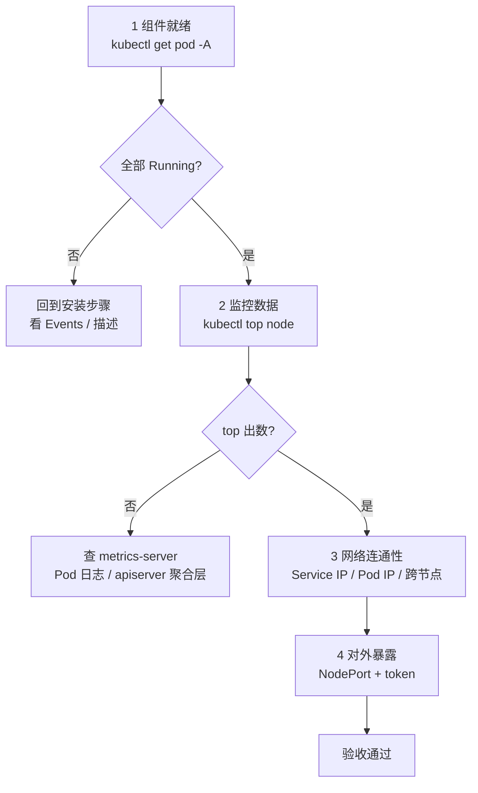

# Kubernetes 集群部署: 集群验证的网络连通性与组件就绪检查

集群装完、组件全起来之后，还有最后一步很多人跳过 —— **按顺序做一次验收**。跳过的结果往往是：一周后某天 Node 挂了，你才发现 Pod 跨节点网络根本不通，或者 metrics-server 从装上就没起来过。

这一篇把验收拆成一条固定顺序的清单：组件就绪 → 监控数据 → 三层网络连通 → 业务访问方式 → 一个带凭据的 UI。每一步都给出判据和失败时的定位方向。

## 纲要
- 验收的顺序为什么不能乱
- 组件就绪：所有 Pod 都 Running 才算过
- metrics-server：kubectl top 能不能出数
- 两个系统级 Service 与 ClusterIP 的分配规律
- 网络连通性的四个层次与验证矩阵
- 把 Dashboard 从 ClusterIP 改成 NodePort 对外暴露
- 创建超级管理员账号并取 token
- 浏览器证书报错的处理
- 验收脚本与失败排查

本次涉及的目录结构（验证清单的四层结构）：

```text
├── 节点连通性        # 跨节点 PodIP 互 ping，排查 vxlan/路由
├── 组件就绪          # kube-apiserver / controller-manager / scheduler
├── DNS 解析          # CoreDNS 就绪 + 业务 Pod 内 nslookup
└── 服务暴露          # ClusterIP / NodePort 可达性与端口占用
```


## 验收的顺序为什么不能乱

验收不是把命令随手敲一遍，是有先后依赖的：

1. **组件先就绪**：kube-system 下的 Pod 没跑起来，后面所有的连通性测试都会给出假阴性（"不通"其实是目标压根没起来）。
2. **监控数据能出**：metrics-server 起不来，`kubectl top` 报 `Metrics API not available`，但节点状态看似正常，容易误判。
3. **再测网络**：Service IP、Pod IP、跨节点 Pod 互访，按从"近"到"远"的顺序。
4. **最后才做对外暴露**：NodePort / UI / token 这类东西建立在前面都正常的基础之上。

反过来做会出现一种典型误判：先去 ping Pod IP 不通，然后花两小时查 Calico，最后发现是这个 Pod 一直在 `ContainerCreating`。



## 组件就绪：所有 Pod 都 Running 才算过

第一条命令永远是这个：

```bash
kubectl get pod -A -o wide
```

判据不是"有没有 Pod"，而是**没有非 Running 状态的 Pod**。常见的非 Running 状态与含义：

| 状态 | 含义 | 能否继续验收 |
| --- | --- | --- |
| `Running` | 正常 | 是 |
| `Pending` | 调度没成功 / CNI 没装导致没 IP | 否，卡在这一步 |
| `CrashLoopBackOff` | 容器起了一次就退，配置或镜像有问题 | 否 |
| `ImagePullBackOff` | 拉不到镜像（仓库地址错 / 版本没同步） | 否 |
| `ContainerCreating` | 长期卡住通常是 CNI 或存储有问题 | 否 |
| `Terminating` | 正常收尾，等它结束 | 可以 |

注意 `kube-system` 里 `coredns` 处于 `Running` 但 `Ready` 是 `0/1`，这不算致命 —— 但如果它一直是 `Pending`，整个集群的 Service 域名解析都是坏的，后面所有 `nslookup` 类验证一律失败，先修它。

## metrics-server：kubectl top 能不能出数

metrics-server 的作用是把 **Node / Pod 的 CPU、内存使用率** 通过 `metrics.k8s.io` 这个 API 暴露出来，`kubectl top` 读的就是它。

老的 `kube-state-metrics` + `heapster` 组合已经废弃，现在统一用 metrics-server。

验证：

```bash
kubectl top node
# NAME     CPU(cores)   CPU%   MEMORY(bytes)   MEMORY%
# master01   154m        7%     1187Mi         32%

kubectl top pod -A
```

出数，说明 `metrics.k8s.io` 聚合层（Aggregation Layer）工作正常，Dashboard 上的资源图表也能画出来。

出不来时的两个高频原因，按顺序查：

1. **metrics-server 的 `--kubelet-insecure-tls` 参数问题**：kubelet 的自签证书链 metrics-server 校验不过，Pod 会反复重启。二进制集群和 kubeadm 集群都遇到过。
2. **master 节点没有 kubelet 指标暴露权限**：RBAC 里 metrics-server 的 ClusterRole 没绑上。

```bash
kubectl logs -n kube-system deploy/metrics-server -f
kubectl describe pod -n kube-system -l k8s-app=metrics-server | tail -20
```

## 两个系统级 Service 与 ClusterIP 的分配规律

k8s 集群里有两个"来得特别早"的 Service，它们的 ClusterIP 是**写死在 apiserver 配置里的**，不是随机分配的：

| Service | 命名空间 | ClusterIP | 说明 |
| --- | --- | --- | --- |
| `kubernetes` | default | `10.96.0.1` | apiserver 自身的访问入口，取的是 serviceCIDR 的第一个 IP |
| `kube-dns` | kube-system | `10.96.0.10` | CoreDNS 的入口，取的是 serviceCIDR 的第十个 IP |

serviceCIDR 一般是 `10.96.0.0/16`（kubeadm 默认）。规律是：**第一个给 `kubernetes`，第十个给 `kube-dns`**，其余按创建顺序往后排。

所以这两条 Tail 指令可以直接写进验收脚本，作为"集群控制面活着 + DNS 活着"的判据：

```bash
kubectl get svc -n default
kubectl get svc -n kube-system kube-dns
```

## 网络连通性的四个层次与验证矩阵

这是整篇的重点。要验证的其实是**四层连通性**，任何一层不通，后续的微服务调用都会以不同形式炸掉：

| 层次 | 起点 → 终点 | 验证方式 | 依赖组件 |
| --- | --- | --- | --- |
| L1 宿主机 → Service IP | 任意节点 → ClusterIP | `ping`（ClusterIP 是虚 IP，需打端口才能通，实际用 curl / nc） | apiserver / kube-proxy iptables |
| L2 宿主机 → Pod IP | 任意节点 → Pod IP | `ping <pod-ip>` | Calico 等 CNI |
| L3 Pod → Pod（跨节点） | node01 容器 → node02 容器 | 进容器 `ping` 对方 Pod IP | CNI + BGP/IPIP |
| L4 Pod → Service | 容器 → ClusterIP:Port | 进容器 `curl` | kube-proxy + CoreDNS 解析 |

**L1 的正确测法**：ClusterIP 本身不响应 ICMP，直接 ping 会不通，别被骗了 —— 要打端口测：

```bash
curl -k https://10.96.0.1:6443/healthz
# ok
nc -zw3 10.96.0.10 53 && echo "dns port open"
```

**L3 的测法**（素材里就是这么做的）：在 master01 上的 Pod 里，ping node01 上某个 Pod 的 IP：

```bash
kubectl get pod -A -o wide | grep node01
# 找到 node01 上的目标 Pod，取其 IP，例如 172.30.64.x

MASTER_CONTAINER=node01
POD_IP=$(kubectl get pod -n default -o jsonpath='{.items[0].status.podIP}')
kubectl exec -it "$MASTER_CONTAINER" -- ping -c 3 "$POD_IP"
```

通，说明 CNI 的跨节点转发是好的。这一步也是判断"Calico 装没装对"最直接的手段。

**L4 顺带验证 DNS**：

```bash
# 下面命令中的变量按你的集群环境赋值后再执行
kubectl exec -it $POD -- nslookup kubernetes.default.svc.cluster.local
```

## 把 Dashboard 从 ClusterIP 改成 NodePort 对外暴露

装完 Dashboard 后，它的 Service 默认是 `ClusterIP` 类型 —— 集群外根本访问不到。改成 `NodePort` 就能在每个宿主机上开一个端口访问：

```bash
kubectl edit svc kubernetes-dashboard -n kubernetes-dashboard
# 把 type: ClusterIP 改成 type: NodePort
```

改完看端口：

```bash
kubectl get svc -n kubernetes-dashboard
# NAME                   TYPE       CLUSTER-IP      EXTERNAL-IP   PORT(S)         AGE
# kubernetes-dashboard   NodePort   10.96.135.87    <none>        443:32534/TCP   10m
```

这里的 `32534` 就是 NodePort —— **在任意 k8s 节点（8xxx 这种内网 IP）上都能访问**：

```bash
curl -k https://master01:32534
```

> 关于 NodePort 的细节（端口范围、安全组、生产该不该用）不在本篇展开，后续 Service 类型章节会专门讲。

## 创建超级管理员账号并取 token

Dashboard 装完默认**不会自动创建可用登录用户**，`kubectl get serviceaccount -A` 里找不到 Dashboard 相关的 ServiceAccount，这时候登录页只能看到空列表或直接被拒。

两条命令补上（先建账号，再绑到一个能管全集群的 Role）：

```bash
kubectl create serviceaccount dashboard-admin -n kubernetes-dashboard
kubectl create clusterrolebinding dashboard-admin \
  --clusterrole=cluster-admin \
  --serviceaccount=kubernetes-dashboard:dashboard-admin
```

取 token（token 存在 Secret 里）：

```bash
kubectl -n kubernetes-dashboard get secret \
  $(kubectl -n kubernetes-dashboard get sa dashboard-admin -o jsonpath='{.secrets[0].name}') \
  -o jsonpath='{.data.token}' | base64 -d
```

> 一个变更点：`k8s` 1.24 之后 ServiceAccount 不再自动创建带 token 的 Secret，上面这条链会拿到空。老版本（1.18/1.19）照抄可用；新版本要改成 `kubectl -n xxx create token dashboard-admin` 或者显式建 `Secret` 绑 `kubernetes.io/service-account.token`。

拿到 token 粘到登录页即可进控制台。

## 浏览器证书报错的处理

Dashboard v2 的默认证书是自签的，某些 Chrome / Edge 版本会直接拦掉这个页面（红色警告页进不去）。解决办法是**在浏览器启动时加一个忽略参数**：

```bash
# macOS 上从终端打开 Chrome，忽略证书错误
/Applications/Google\ Chrome.app/Contents/MacOS/Google\ Chrome \
  --user-data-dir=/tmp/chrome-unsafely \
  --unsafely-ignore-certificate-errors \
  https://master01:32534
```

关键说明：

- 这个参数作用在**浏览器进程**上，不是加给 Kubernetes 的，也不是加给 kubelet 的；
- `--user-data-dir` 必须给一个独立目录，否则会复用你日常的 profile，把忽略项写进常用配置；
- 这只是**本机开发/学习**环境的权宜之计，生产环境应该给 Dashboard 配合规证书（或走 Ingress + 可信证书链），不要长期靠这个参数。

## API 速览

| 命令 | 作用 | 常用变体 |
| --- | --- | --- |
| `kubectl get pod -A` | 全部命名空间下的 Pod | `-o wide` 看所在节点、IP |
| `kubectl top node` | 节点 CPU / 内存 | `top pod -A` 看容器 |
| `kubectl get svc -n <ns>` | 查 Service 与 ClusterIP | `kubectl get svc -A` |
| `kubectl edit svc <name> -n <ns>` | 改 Service（等价于在线改 yaml） | 改 `type: NodePort` |
| `kubectl exec -it <pod> -- <cmd>` | 进容器执行命令 | `-c <container>` 指定容器 |
| `kubectl logs -f deploy/x -n ns` | 看 Pod 日志 | `--tail -n 100` `--previous` 看上次崩溃日志 |
| `kubectl describe pod <pod>` | 看 Events，排障第一手 | `| tail -20` |
| `kubectl create clusterrolebinding` | 把账号绑到集群级角色 | `--clusterrole=cluster-admin` |
| `kubectl -n ns get secret ... \| base64 -d` | 解出 ServiceAccount token | 1.24+ 用 `create token` |

## Demo 示例

下面这个脚本把上面所有验证串成一条流水线，任何一步不过就停下来并打印原因。放在 control-plane 节点上跑即可。

```bash
#!/bin/bash
# verify-cluster.sh —— 集群安装完成后的顺序验收
set -euo pipefail

K8S_NODE_PORT=${K8S_NODE_PORT:-32534}
FAIL=0

step_ok()  { echo -e "\033[32m[OK]\033[0m   $*"; }
step_fail(){ echo -e "\033[31m[FAIL]\033[0m $*"; FAIL=1; }

echo "=== 1. 组件就绪检查 ==="
BAD=$(kubectl get pod -A --field-selector=status.phase!=Running \
        --no-headers -o custom-columns=:.metadata.name,:.status.phase 2>/dev/null || true)
if [ -z "$BAD" ]; then
  step_ok "所有 Pod 均为 Running"
else
  step_fail "存在非 Running 的 Pod："
  echo "$BAD"
# 下面命令中的变量按你的集群环境赋值后再执行
  echo "        -> kubectl describe pod $NAME -n $NS 看 Events；"
  echo "           ImagePullBackOff 查镜像仓库，ContainerCreating 查 CNI"
fi

echo
echo "=== 2. 系统级 Service 检查 ==="
kubectl get svc -n default kubernetes
kubectl get svc -n kube-system kube-dns
# 预期 ClusterIP: kubernetes=10.96.0.1, kube-dns=10.96.0.10

echo
echo "=== 3. metrics-server / kubectl top ==="
if kubectl top node >/dev/null 2>&1; then
  kubectl top node
  step_ok "metrics.k8s.io 可用"
else
  step_fail "kubectl top 无数据，检查 metrics-server："
  echo "        -> kubectl logs -n kube-system deploy/metrics-server"
  echo "        -> 常见原因：kubelet 自签证书校验失败，需要 --kubelet-insecure-tls"
fi

echo
echo "=== 4. 宿主机 -> Service IP（打端口，ClusterIP 不回 ICMP） ==="
if curl -k -s --connect-timeout 3 https://10.96.0.1:6443/healthz | grep -q ok; then
  step_ok "apiserver ClusterIP 10.96.0.1:6443 reachable"
else
  step_fail "10.96.0.1:6443 不通 -> 检查 kube-proxy iptables / haproxy 后端"
fi

echo
echo "=== 5. 跨节点 Pod -> Pod 连通性（L3） ==="
# 在 master01 上的 Pod 内，ping node01 上的一个 Pod IP
TEST_POD=$(kubectl get pod -A -o wide | awk '$8 ~ /node01$/ && $4 ~ /Running/ {print $1; exit}')
if [ -z "$TEST_POD" ]; then
  step_fail "没找到运行在 node01 上、状态 Running 的 Pod，无法测 L3"
else
  TARGET_IP=$(kubectl get pod -A -o wide | awk '$8 ~ /node01$/ && $4 ~ /Running/ {print $6; exit}')
  kubectl exec -it "$TEST_POD" -- ping -c 3 "$TARGET_IP" >/dev/null 2>&1 \
    && step_ok "Pod($TEST_POD) -> Pod($TARGET_IP) 通" \
    || step_fail "Pod -> Pod 不通 -> 查 Calico(BGP/IPIP) 与 ip_forward"
fi

echo
echo "=== 6. Dashboard NodePort 访问 ==="
NodePort=$(kubectl get svc -n kubernetes-dashboard kubernetes-dashboard \
            -o jsonpath='{.spec.ports[0].nodePort}' 2>/dev/null)
if [ -n "$NodePort" ]; then
  NODEIP=$(kubectl get node master01 -o jsonpath='{.status.addresses[?(@.type=="InternalIP")].address}')
  curl -k -s --connect-timeout 3 -o /dev/null -w "HTTP %{http_code}\n" "https://${NODEIP}:${NodePort}" \
    && step_ok "Dashboard NodePort $NodePort 可访问" \
    || step_fail "Dashboard 端口不通 -> 安全组 / firewalld 是否放行 $NodePort"
else
  step_fail "未找到 Dashboard NodePort，确认是否已 edit 成 type: NodePort"
fi

echo
echo "=== 7. 管理员账号与 token ==="
kubectl create serviceaccount dashboard-admin -n kubernetes-dashboard --dry-run=client -o yaml | kubectl apply -f -
kubectl create clusterrolebinding dashboard-admin \
  --clusterrole=cluster-admin \
  --serviceaccount=kubernetes-dashboard:dashboard-admin \
  --dry-run=client -o yaml | kubectl apply -f -

TOKEN=$(kubectl -n kubernetes-dashboard get secret \
          $(kubectl -n kubernetes-dashboard get sa dashboard-admin \
              -o jsonpath='{.secrets[0].name}') \
          -o jsonpath='{.data.token}' | base64 -d 2>/dev/null || true)
if [ -n "$TOKEN" ]; then
  step_ok "管理员 token 获取成功（粘贴到 Dashboard 登录页）"
  echo "$TOKEN" | head -c 40; echo "..."
else
  step_fail "取 token 失败（k8s 1.24+ 请改用：kubectl -n kubernetes-dashboard create token dashboard-admin）"
fi

echo
if [ "$FAIL" -eq 0 ]; then
  echo "=========== 集群验收通过 ==========="
else
  echo "=========== 存在失败项，按上面输出逐条处理 ==========="
  exit 1
fi
```

几点使用说明：

- 脚本全程 `set -e`，只有 `step_fail` 会自己软退出（`FAIL=1`），方便把失败收集完再统一判断；
- 第 5 步依赖 `kubectl get pod -A -o wide` 的第 6 列是 Pod IP —— 不同版本列序有差异，跑之前先 `kubectl get pod -A -o wide` 人工核一眼；
- 第 6/7 步是"可重复执行"的：`--dry-run=client -o yaml | kubectl apply -f -` 幂等，重跑不会报错。

## 总结

验收这一步看着冗余，实则是把安装期攒下的不确定性一次性清掉。

- **顺序不能反**：先确保 Pod 全 Running，再测网络，最后才动 UI / NodePort，否则拿到的是假阴性。
- **`kubernetes=10.96.0.1`、`kube-dns=10.96.0.10` 是固定规律**，可以直接当判据用。
- **ClusterIP 不回 ICMP**，测 L1 要打端口（`curl https://10.96.0.1:6443/healthz`），不要因为 ping 不通就误判网络坏了。
- **L3（跨节点 Pod 互访）是 CNI 的终极考卷**：通了，Calico 就装对了。
- **Dashboard 默认访问不到**：`edit` 成 NodePort + 手动建 ServiceAccount + clusterrolebinding + 取 token，四步缺一不可。
- **浏览器证书报错是本机浏览器的行为**，用 `--unsafely-ignore-certificate-errors` 加独立 `--user-data-dir` 绕过，生产环境应配合规证书。

