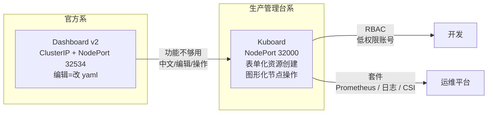
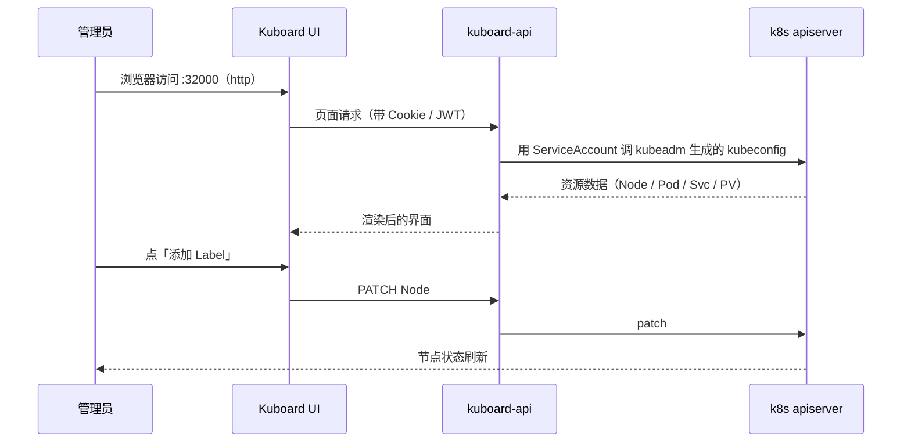

# Kubernetes 集群部署: Kuboard 安装与 Dashboard 的能力对比

Dashboard 装完点进去看几页，大多数人会得出同一个结论：**它只适合看，不适合用**。点"编辑"弹出的是一坨 yaml 文本，创建一个资源只有个"+"号后面跟文件编辑器，中文支持也一般。于是就有了换成 Kuboard 的需求。

这一篇对比两者，然后走一遍 Kuboard 的一条命令安装流程，重点讲它相对于 Dashboard 真正省事的地方（可视化加 label、排空节点、加污点、日志检索、文件浏览器、一键装监控套件）。

## 纲要
- Dashboard 的实际使用痛点
- Kuboard 是什么，和 Dashboard 的定位差异
- 安装：一条命令 + 一个 32000 端口的 Service
- 取 token 与登录
- 节点管理：label / 排空 / 暂停调度 / 污点 的图形化操作
- 资源创建：填字段而不是填 yaml
- 日志检索与文件浏览器
- 开箱套件：Prometheus / 日志聚合 / CSI 存储
- 两者能力对照表与选型建议

本次涉及的目录结构（两套面板的部署清单）：

```text
├── kuboard/
│   ├── kuboard.yaml        # 一条命令部署，默认 32567 端口
│   └── kuboard-sa.yaml     # 创建 SA 取登录 token
└── dashboard/
    ├── recommended.yaml    # v2.0.0 起分 namespace 安装
    └── admin-sa.yaml       # cluster-admin 绑定后取 token
```


## Dashboard 的实际使用痛点

先把问题写实，才知道换工具换的是什么：

| 痛点 | 具体表现 | 后果 |
| --- | --- | --- |
| 编辑走文件 | 点"编辑 YAML"弹出原始 yaml，改完保存 | 手敲容易写错缩进，格式校验弱 |
| 创建入口缺失 | Deployment / Service 这类常用资源没有表单入口，只有一个"+" | 都得切回 kubectl 手写 |
| 中文支持一般 | 资源描述、事件、错误提示很多是英文原文 | 新人看不懂报错 |
| 只有展示 | 没有节点级的操作入口 | 加 label、排空、打污点还得 kubectl 敲命令 |

所以 Dashboard 的定位更接近"**资源状态的可视化快照**"，而日常运维（尤其给开发发低权限账号、临时排障）确实需要一个更强的控制台。

## Kuboard 是什么，和 Dashboard 的定位差异

Kuboard 是一款国人开发的 Kubernetes 免费管理面板，它不只是"另一个 Dashboard"，而是把这些事一并做了：

- 集成代码仓库 / 镜像仓库 / CI/CD，方便搭一个生产可用的容器云平台；
- 开箱即用的组件：**节点管理、命名空间管理、存储类（StorageClass）管理**；
- 已经支持 CSI 存储接口，能识别并接入公司自有的存储；
- 诊断能力：**容器 CPU/内存、节点 CPU/内存、事件查看与事件清理**；
- 日志查看带**关键字检索**，还能转发；
- 支持**单点登录集成**（LDAP 等）；
- 提供 RBAC 管理，可以给开发 / 运维发低权限账号；
- 提供开箱套件：一键装 Prometheus 监控、一键装日志聚合工具；
- 支持中英文切换、自定义命名空间布局。

两者的定位差异，一句话：**Dashboard 是官方的只读控制台，Kuboard 是要当生产管理台来做的。**



## 安装：一条命令 + 一个 Service

Kuboard 官网（kuboard.cn，新域名为 kuboard.dev）提供了集群安装方式。因为我们已经有自己的集群，不需要它帮我们"从零搭集群"，直接用**已有集群安装**那一档，选稳定版（生产用稳定版，beta 版带新功能但有风险）。

安装本身就是一条命令：

```bash
kubectl apply -f https://addons.kuboard.cn/kuboard/kuboard-v3.yaml
# 或者指定版本
# kubectl apply -f https://addons.kuboard.cn/kuboard/kuboard-v3-v3.xxxx.x.yaml
```

装完看状态：

```bash
kubectl get pod -n kuboard
# NAME                              READY   STATUS    RESTARTS   AGE
# kuboard-api-7b8d9c5f4d-xxxxx      1/1     Running   0          1m
# kuboard-controller-xxxxx-xxxxx    1/1     Running   0          1m
# kuboard-ui-6f7c9b8d4-xxxxx        1/1     Running   0          1m
```

它会顺带暴露一个 Service，端口就是常见的 **32000**（NodePort 方式，跟 Dashboard 的 32534 一样是"每个宿主机都能访问"的模式）：

```bash
kubectl get svc -n kuboard
# NAME       TYPE       CLUSTER-IP     EXTERNAL-IP   PORT(S)          AGE
# kuboard    NodePort   10.96.201.77   <none>        80:32000/TCP     1m
```

访问 `http://<任意节点IP>:32000` 即可。注意它是 **http 不是 https**（Dashboard 是 443/NodePort）。

## 取 token 与登录

登录页下方有"获取 token"的入口，点开会给出一条创建账号并取 token 的命令，复制执行即可：

```bash
# Kuboard 会自动为该 token 创建对应的 ServiceAccount 与 ClusterRoleBinding，
# 取 token 的方式：
kubectl -n kuboard get secret --no-headers | grep kuboard-user | \
  awk '{print $1}' | xargs -I{} kubectl -n kuboard get secret {} -o jsonpath='{.data.token}' | base64 -d
```

> 注意版本差异：k8s 1.24 之后 ServiceAccount 不再自动生成带 token 的 Secret，取 token 的链路会变，需要改成 `kubectl -n kuboard create token <sa名>`。课程当时用的是 1.18/1.19 环境，上面的写法是通的。

拿到 token 粘进去就进控制台了。

## 节点管理：label / 排空 / 暂停调度 / 污点 的图形化操作

这一块是 Kuboard 最劝退 kubectl 的地方。举几个原来必须手敲命令、现在点几下的操作：

| 操作 | 原来的 kubectl 命令 | Kuboard 里的位置 |
| --- | --- | --- |
| 加 label | `kubectl label node node01 disk=ssd` | 节点详情页 → 添加 Label，直接写 key/value |
| 排空节点 | `kubectl drain node01 --ignore-daemonsets --delete-emptydir-data` | 节点页 → 排空（把节点上的容器赶走） |
| 暂停调度 | `kubectl cordon node01` | 节点页 → 暂停调度（节点要维护时用） |
| 恢复调度 | `kubectl uncordon node01` | 节点页 → 恢复 |
| 加污点 | `kubectl taint nodes node01 key=value:NoSchedule` | 节点页 → 添加污点 |

排空（drain）的含义是把节点上的 Pod 都驱逐到别的节点上，**节点维护前必做**；配合后面讲的污点（Taint）与容忍（Toleration）章节一起理解。

## 资源创建：填字段而不是填 yaml

这是和 Dashboard 最直观的差距。点"创建 Deployment"：

- Dashboard：跳到一个 yaml 编辑框，你得自己把 `apiVersion`、缩进、`replicas` 写对；
- Kuboard：**表单化填字段**（名字、镜像、副本数、端口、资源限制…），填完直接生成。

创建资源的时候也能顺手把关联资源一起建出来：创建 Service、创建 Ingress，都不用另开 yaml。

## 日志检索与文件浏览器

两个 Dashboard 没有、Kuboard 有的功能：

**日志检索**：进到某个容器的日志面板，可以直接搜关键字（比如异常堆栈里的关键词），在几百上千行日志里定位比 `kubectl logs | grep` 省事不少。

**文件浏览器**（原 Dashboard 没有）：可以直接在容器里以图形化方式操作文件 —— 上传文件、建目录、删文件。排障时想改个配置试试，不用 `kubectl cp` 来回倒。



## 开箱套件：Prometheus / 日志聚合 / CSI 存储

Kuboard 有个"套件"入口，把常用的中间件做成了一键安装：

| 套件 | 作用 | 说明 |
| --- | --- | --- |
| 监控 | 一键部署 Prometheus 全家桶 | 点"在线安装"，集群里直接多一套监控 |
| 日志聚合 | 日志收集工具（Loki 一类） | 比 ELK 更轻量，日志场景的主流方向之一 |
| 存储 | CSI 存储接入 | 能自动识别 CSI 版本，装完即可连公司自有存储仓库 |

这套东西省掉的是"自己写 Helm values、调镜像版本、配 PVC"的工作量。

## 两者能力对照表

| 能力 | Dashboard v2 | Kuboard v3 |
| --- | --- | --- |
| 安装成本 | 一条 `kubectl apply` | 一条 `kubectl apply` |
| 访问入口 | NodePort `32534`，https | NodePort `32000`，http |
| 资源编辑 | 改 yaml 文本 | 表单 + yaml 两种 |
| 资源创建 | 基本只有"+"加文件 | 表单化创建 |
| 中文支持 | 一般 | 支持中英文切换 |
| 节点操作（label/drain/taint） | 需 kubectl | 页面直接点 |
| 日志 | 单纯看到 | 带关键字检索、可转发 |
| 文件浏览器 | 无 | 有（上传/建目录/删文件） |
| 事件清理 | 无 | 有 |
| RBAC 低权限账号 | 需自己配 | 面板内支持 |
| SSO / LDAP | 需自己接 | 支持 |
| 一键监控 / 日志套件 | 无 | 有 |
| CSI 存储管理 | 无 | 有 |

## Demo 示例

下面把"装 Kuboard + 拿到访问地址 + 拿到 token"串成一条命令，装完直接能登录。

```bash
#!/bin/bash
# setup-kuboard.sh —— 已有集群上安装 Kuboard v3 并取登录 token
set -euo pipefail

NS="kuboard"

echo "==> 1. 安装 Kuboard（稳定版）"
kubectl apply -f https://addons.kuboard.cn/kuboard/kuboard-v3.yaml
# 如需固定版本，把上面的 URL 换成
# https://addons.kuboard.cn/kuboard/kuboard-v3-v3.<ver>.yaml

echo
echo "==> 2. 等待 Pod 就绪（别急着访问，API 没起来页面会白屏）"
kubectl wait --for=condition=Ready pod \
  -l app=kuboard -n "$NS" --timeout=180s \
  || kubectl get pod -n "$NS"
# 洞察：kuboard-api / kuboard-controller / kuboard-ui 三个都要 Running

echo
echo "==> 3. 查看暴露端口（默认 32000）"
kubectl get svc -n "$NS"
# 期望输出形如：kuboard   NodePort   10.96.x.x   <none>   80:32000/TCP

NODE_PORT=$(kubectl get svc -n "$NS" kuboard -o jsonpath='{.spec.ports[0].nodePort}')

echo
echo "==> 4. 取任意可访问节点的内网 IP"
NODE_IP=$(kubectl get node -o jsonpath='{.items[0].status.addresses[?(@.type=="InternalIP")].address}')
NODE_IP=$(echo "$NODE_IP" | awk '{print $1}')

echo
echo "==> 5. 获取管理员 token"
# 方式一：直接看 Kuboard 自己生成的 user 配置
if kubectl -n "$NS" get secret --no-headers 2>/dev/null | grep -q kuboard-user; then
  SA=$(kubectl -n "$NS" get secret --no-headers | grep kuboard-user | awk '{print $1}' | sed 's/-token.*$//')
  TOKEN=$(kubectl -n "$NS" get secret --no-headers | grep kuboard-user | awk '{print $1}' | \
    xargs -I{} kubectl -n "$NS" get secret {} -o jsonpath='{.data.token}' | base64 -d)
  echo "ServiceAccount: ${SA:-kuboard-user}"
  echo "Token: ${TOKEN}"
else
  echo "未找到 kuboard-user，手动创建（k8s 1.24-）："
  kubectl create serviceaccount kuboard-user -n "$NS"
  kubectl create clusterrolebinding kuboard-user \
    --clusterrole=cluster-admin \
    --serviceaccount="${NS}:kuboard-user"
  TOKEN=$(kubectl -n "$NS" get secret \
            $(kubectl -n "$NS" get sa kuboard-user -o jsonpath='{.secrets[0].name}') \
            -o jsonpath='{.data.token}' | base64 -d)
  echo "Token: ${TOKEN}"
fi

echo
echo "==> 6. 访问地址"
echo "   http://${NODE_IP}:${NODE_PORT}"
echo
echo "   提示："
echo "   - 是 http，不是 https（Dashboard 才是 https）"
echo "   - 32000 端口需要在安全组 / firewalld 放行"
echo "   - 浏览器打不开先在本机 curl 探一下："
echo "     curl -I http://${NODE_IP}:${NODE_PORT}"
echo "   - 页面白屏先看 API Pod：kubectl logs -n ${NS} deploy/kuboard-api"
```

排障速查：

| 现象 | 原因 | 处理 |
| --- | --- | --- |
| `curl` 不存在但页面白屏 | kuboard-api 没起 | `kubectl logs -n kuboard deploy/kuboard-api` |
| 端口连不上 | firewalld / 安全组没放行 32000 | 命令行放行或加安全组规则 |
| 登录一直转圈 | token 过期或 RBAC 没绑上 | 重新取 token，确认 clusterrolebinding 存在 |
| 装完 Pod 反复重启 | 集群版本与 Kuboard 版本不匹配 | 换稳定版、看官方兼容性说明 |
| 加完 label 页面不刷新 | 浏览器缓存 | 强制刷新（Cmd+Shift+R） |

## 总结

Dashboard 和 Kuboard 不是谁取代谁，而是覆盖的场景不同。

- **Dashboard 是官方标配**，装一条命令、看资源状态够用，但编辑、创建、节点操作都得回到 kubectl。
- **Kuboard 是国人开发的生产向管理台**：表单化创建资源、图形化加 label / 排空节点 / 打污点、日志带检索、自带文件浏览器，还带 RBAC 低权限账号和 SSO。
- **安装成本一样低**：都是一条 `kubectl apply`，Kuboard 暴露在 NodePort `32000`（http），Dashboard 在 `32534`（https）。
- **取 token 会踩版本坑**：k8s 1.24 前走 Secret 解 base64，1.24 后要用 `kubectl create token`。
- **要不要上 Kuboard，看用途**：个人学习 / 只看状态，Dashboard 够；真要给团队用（发低权限账号、加点标签、排空维护），Kuboard 省力得多。
- **NodePort 暴露 UI 适合内网环境**，公网暴露请务必配合规证书与登录鉴权，别让面板裸奔在 32000 端口上。

