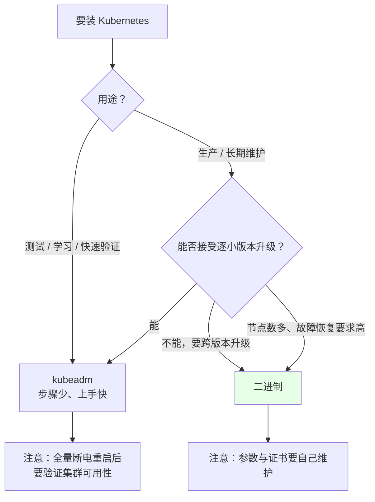
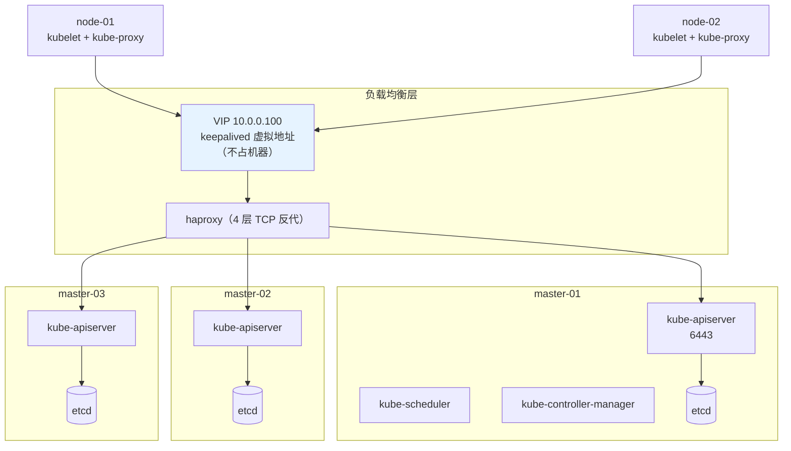
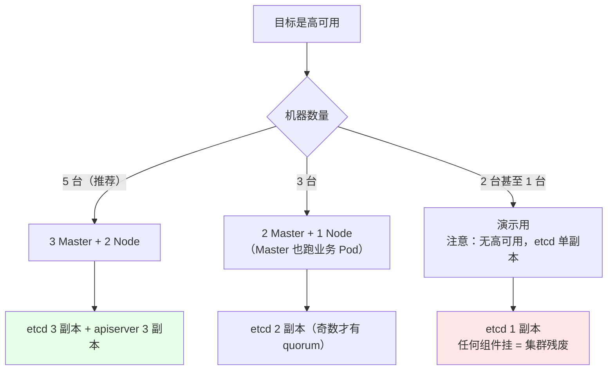
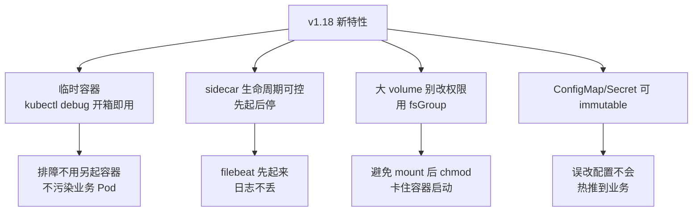
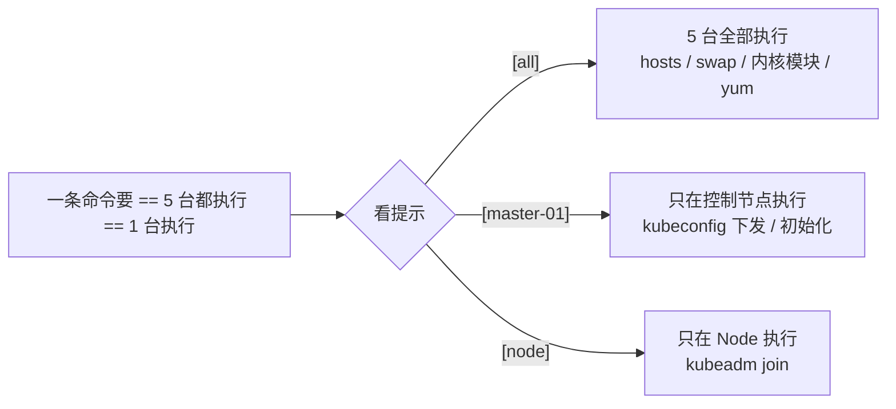
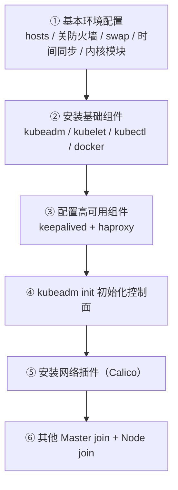

# Kubernetes 集群部署: kubeadm 高可用安装的整体规划与环境设计

动手装集群之前，先要把**机器怎么分、装哪个版本、为什么这么装**想清楚。装到一半发现机器不够、或者版本行为不一样，返工成本远高于现在多花十分钟规划。

这一节定三件事：kubeadm 与二进制该怎么选、高可用集群需要几台机器、以及演示环境的规格怎么配。

结论先给：

- **kubeadm 装测试/开发环境，二进制装生产**：kubeadm 封装好了每一步，上手快；但它把过程变黑盒，且**整机全断电重启后偶发集群不可用**，生产环境实测不如二进制稳；
- **高可用最少 5 台**：3 台 Master（含 etcd）+ 2 台 Node，外加一个**不占机器**的 VIP（由 keepalived 虚拟）；
- 演示可以用 3 台甚至 2 台（1 Master + 1 Node）跑通流程，但**生产不要省机器** —— etcd 必须与 Master 同机时至少 3 副本。

## 纲要

- 为什么先装集群再讲概念
- kubeadm 与二进制的选型判断
- 高可用架构的机器规划
- 环境规格建议（CPU / 内存 / 磁盘）
- v1.18 之后几个必须知道的变更
- 课程操作约定

## 为什么先装集群再讲概念

Kubernetes 的概念量很大：Pod、Service、Deployment、Volume、RBAC……**纯讲概念没有环境可看，学完就忘**。

先起一套能跑的集群，后面讲概念时可以边讲边操作：


安装过程本身就是一次组件扫盲：apiserver 起在哪、谁连 etcd、kubelet 怎么注册节点、CNI 什么时候介入 —— 装完一圈就都有画面了。

两种安装方式各讲一遍（kubeadm + 二进制）也是同一个理由：**只用过 kubeadm 的人，把它当黑盒，不知道里面干了什么**；手动装一遍才知道那几行 `kubeadm init` 背后做了什么。

## kubeadm 与二进制的选型判断

| 维度 | kubeadm | 二进制 |
| --- | --- | --- |
| 上手难度 | 低，`init` / `join` 几条命令 | 高，证书、配置、systemd 全要自己来 |
| 黑盒程度 | **高**（内部步骤封装） | 低（每一步都看得见） |
| 升级方式 | `kubeadm upgrade`，**只能逐小版本** | 换二进制，可跨版本 |
| 全集群断电恢复 | 实测**偶发不可用** | 实测恢复更快、更稳 |
| 生产推荐度 | 测试 / 小规模 | **生产首选** |
| 适合谁 | 想快速拿到可用集群 | 想搞懂每一层 |



**「kubeadm 装完集群全断电再上电会偶发不可用」**这一点值得单说。压力测试的做法：两套集群（kubeadm 一套、二进制一套），各 3 个 Master + 若干 Node，**全部机器同时关机再同时开机**，然后看谁能正常起来。结果是二进制那套恢复更快且没出现过不可用，kubeadm 那套出现过起不来的情况。

所以：**学、测、演示用 kubeadm；上生产用二进制**。

## 高可用架构的机器规划

一套标准的 5 节点高可用集群：

```text
机器规划（5 台实体/虚机 + 1 个虚拟 IP）
┌──────────────┬──────────────┬─────────────────────────────────────┐
│ 主机名        │ IP            │ 承载组件                              │
├──────────────┼──────────────┼─────────────────────────────────────┤
│ master-01    │ 10.0.0.101   │ etcd + apiserver + scheduler +      │
│              │              │ controller-manager + kubelet +      │
│              │              │ kube-proxy                          │
│ master-02    │ 10.0.0.102   │ 同上（三台角色完全对等）               │
│ master-03    │ 10.0.0.103   │ 同上                                 │
│ node-01      │ 10.0.0.106   │ kubelet + kube-proxy + 业务 Pod      │
│ node-02      │ 10.0.0.107   │ kubelet + kube-proxy + 业务 Pod      │
│ VIP          │ 10.0.0.100   │ **不占机器**，keepalived 虚拟出来      │
└──────────────┴──────────────┴─────────────────────────────────────┘
```

VIP 由 keepalived 绑到**当前存活 Master 的网卡**上，一个网卡同时挂真实 IP 和 VIP：



要点：

- **VIP 不占机器资源**，是 keepalived 虚拟出来的；
- 所有组件（scheduler、controller-manager、kubelet、kube-proxy）**都连 VIP 而不是某个具体 Master 的 IP** —— 否则某台 apiserver 挂了，连它的人就全断；
- etcd 只有 apiserver 直连，其他组件一律通过 apiserver，**没有组件直连 etcd**；
- **生产环境规模大时，etcd 建议独立部署**（跟 Master 分开），避免 apiserver 的高并发写把 etcd 拖垮；演示环境合在一起没问题。

## 环境规格建议

演示用的是 VMware / SVM 虚拟机，**统一 2 核 2G**。

| 场景 | CPU | 内存 | 磁盘 | 说明 |
| --- | --- | --- | --- | --- |
| 演示集群（5 台） | 2 核 | 2 G | 40 G+ | 能跑通全流程 |
| 演示 + 存储章节 | 2 核 | **4 G** | 60 G+ | 后面讲 Rook/Ceph 时内存需求明显上升 |
| 生产 Master | 4 核+ | 8 G+ | 100 G+（etcd 盘独立 SSD） | etcd 对磁盘 IOPS 敏感 |
| 生产 Node | 4 核+ | 16 G+ | 200 G+ | 按业务密度定 |

**机器不够怎么缩**：



注意：etcd 一定要**奇数个成员**（1 / 3 / 5），因为 quorum 是 `(n+1)/2`，2 个成员的 quorum 是 2，随便坏一个就没法定写。所以 2 台 Master 的「高可用」在 etcd 层面其实是伪高可用 —— 演示可以，生产不要。

## v1.18 之后必须知道的几个变更

课程以 v1.18 为主线，这几个点后面章节会反复用到：

| 变更 | 变化 | 影响 |
| --- | --- | --- |
| **临时容器（Ephemeral Container）内置** | v1.16 起 `kubectl debug` 可用；v1.18 起 `kubectl debug` 默认可用 | 不用再为了排障手写临时容器 yaml，也不用额外装 kubectl-debug 插件 |
| **sidecar 容器生命周期收敛** | v1.18 起 sidecar 支持「**先启动、最后停止**」 | 日志 sidecar（filebeat / fluentd）可以在业务容器之前就位，避免日志漏收 |
| **不再建议 chmod 大型 volume** | v1.18 起对 volume 权限自动修改做了限制 | 挂载 1PB/2PB 的 volume 时改权限会耗时极长导致容器起不来，应改用 fsGroup 等方式 |
| **ConfigMap / Secret 可设为不可变** | v1.18 起支持 `immutable: true` | 防止热更新把错误配置推给业务容器，提升安全性 |
| ConfigMap / Secret 热更新 | apply 后 kubelet 会轮询同步到容器 | 业务侧要有热加载能力，否则改错了直接把业务搞坏 |



## 课程操作约定

演示环境用 FinalShell / Xshell 的**「发送到所有会话」**同时操作 5 台服务器。使用时要留意一点：



- **主机通信统一用主机名**，不是 IP —— 主机名扩展性更好，换 IP 只改 `/etc/hosts`；
- 拿到文档后**统一替换 IP**：用编辑器的全局替换（Ctrl+H）一次改完，不要碰见一个改一个，否则极易漏；
- 哪一步在几台上执行，文档里会明确标注，别默认「全集群都跑一遍」。

## 安装步骤总览

kubeadm 高可用安装拆开其实就四步：



v1.14 之后 `kubeadm init` 已经简化到「一条命令 + 装 CNI」两下，所以别被「高可用」三个字吓到 —— 难的是**前面的环境准备**和**后面的多 master join**。

## API 速览

| 能力 | 命令 |
| --- | --- |
| 单台初始化控制面 | `kubeadm init --control-plane-endpoint=<VIP> --apiserver-advertise-address=<IP>` |
| 其他 Master 加入控制面 | `kubeadm join <VIP>:6443 --token <t> --discovery-token-ca-cert-hash sha256:<h> --control-plane` |
| Node 加入 | `kubeadm join <VIP>:6443 --token <t> --discovery-token-ca-cert-hash sha256:<h>` |
| 查看初始化默认参数 | `kubeadm config print init-defaults` |
| 生成初始化配置文件 | `kubeadm config print init-defaults > kubeadm.yaml` |
| 验证集群状态 | `kubectl get node` / `kubectl get pod -n kube-system` |
| 加入后查看 token | `kubeadm token list` / `kubeadm token create --print-join-command` |

## Demo 示例

安装前的**环境自检脚本**，把「基本环境配置」里那些容易忘的项一次性检查完（只读）。

```bash
#!/usr/bin/env bash
# env-precheck.sh —— kubeadm 安装前环境自检（只读，不改任何东西）
set -uo pipefail

HOST_IP="${HOST_IP:-10.0.0.101}"   # 改成本机的真实 IP
CLUSTER_DNS="${CLUSTER_DNS:-10.96.0.10}"
POD_CIDR="${POD_CIDR:-172.16.0.0/16}"

rc=0
hr() { printf '\n=== %s ===\n' "$*"; }
ok()  { printf '  [OK]   %s\n' "$*"; }
bad() { printf '  [FAIL] %s\n' "$*"; rc=1; }
warn(){ printf '  [WARN] %s\n' "$*"; }

hr "1. 主机名与解析"
echo "  hostname: $(hostname -s)"
grep -q " $(hostname -s) " /etc/hosts \
  && ok "/etc/hosts 已解析本机主机名" \
  || bad "/etc/hosts 缺少本机 $(hostname -s) 映射"

hr "2. 关闭防火墙 / firewalld"
systemctl is-active --quiet firewalld && bad "firewalld 在运行" || ok "firewalld 未运行"

hr "3. 关闭 swap"
SWAP=$(swapon --show 2>/dev/null | wc -l)
[ "$SWAP" -eq 0 ] && ok "swap 已关闭" || bad "swap 未关闭，请注释 /etc/fstab 里的 swap 行"
grep -q '^/dev/mapper/.*swap\|^UUID=.*swap' /etc/fstab && warn "/etc/fstab 里 swap 项未注释（重启会重新启用）"

hr "4. SELinux"
if getenforce 2>/dev/null | grep -q Disabled; then
  ok "SELinux 已关闭"
elif getenforce 2>/dev/null | grep -q Permissive; then
  warn "SELinux Permissive（不阻断，但非最佳实践）"
else
  bad "SELinux 处于 Enforcing"
  echo "    处理: sed -i 's/^SELINUX=enforcing/SELINUX=disabled/' /etc/selinux/config && reboot"
fi

hr "5. 内核参数模块（ip_vs / br_netfilter / overlay）"
for m in ip_vs ip_vs_rr ip_vs_wrr ip_vs_sh br_netfilter overlay; do
  lsmod | grep -q "^${m}" && ok "模块已加载: $m" || bad "模块未加载: $m（执行 modprobe $m）"
done

hr "6. sysctl 关键项"
for k in net.bridge.bridge-nf-call-iptables net.bridge.bridge-nf-call-ip6tables net.ipv4.ip_forward; do
  v=$(sysctl -n "$k" 2>/dev/null)
  printf '  %-46s = %s\n' "$k" "${v:-未设置}"
done

hr "7. 时间同步"
if systemctl is-active --quiet chronyd; then
  ok "chronyd 运行中"
  chronyc sources 2>/dev/null | head -3 | sed 's/^/  /'
elif systemctl is-active --quiet ntpd; then
  ok "ntpd 运行中"
else
  bad "未检测到 chronyd / ntpd，集群时间会漂移（影响 etcd 选举与证书校验）"
fi

hr "8. 资源限制（limits.conf）"
grep -E '^\* (soft|hard) (nofile|nproc)' /etc/security/limits.conf | sed 's/^/  /'
[ -n "$(grep -E '^\* soft nofile' /etc/security/limits.conf)" ] \
  && ok "已配置 nofile" || warn "建议 * soft nofile 65535 / * hard nofile 65535"

hr "9. 端口占用"
for p in 22 6443 2379 2380 10250 10256; do
  ss -lntup 2>/dev/null | grep -q ":$p " && printf '  [占用] %s\n' "$p" || printf '  [空闲] %s\n' "$p"
done

hr "10. 组件版本"
for c in docker kubelet kubeadm kubectl; do
  printf '  %-10s %s\n' "$c" "$(command -v $c >/dev/null && $c --version 2>/dev/null | head -1 || echo 未安装)"
done

hr "11. 网络连通性"
ip route | grep -q "^default" && ok "默认路由存在" || bad "无默认路由"
ping -c1 -W1 "$CLUSTER_DNS" >/dev/null 2>&1 && ok "可连通集群 DNS $CLUSTER_DNS" || warn "暂不能连通 $CLUSTER_DNS（初始化后才有）"

hr "12. 磁盘与内存"
echo "  内存: $(free -h | awk '/Mem:/{print $2}')   可用: $(free -h | awk '/Mem:/{print $7}')"
df -h / | awk 'NR==2{printf "  根分区: %s 剩余 %s\n", $1, $4}'
df -h /var/lib/docker 2>/dev/null | awk 'NR==2{printf "  容器存储: %s 剩余 %s\n", $1, $4}' || true

echo
if [ $rc -eq 0 ]; then echo "环境自检通过。"; else echo "存在 FAIL 项，先处理再装。"; fi
exit $rc
```

## 总结

规划阶段省下的时间，会在安装阶段成倍还回来。

- **kubeadm 适合测试/学习，二进制适合生产**：kubeadm 封装好但黑盒，实测全量断电后恢复不如二进制稳；两种都过一遍，才知道 `kubeadm init` 背后做了什么。
- **高可用最少 5 台**：3 Master（etcd 与 Master 同学） + 2 Node + 1 个不占机器的 VIP；**etcd 成员必须是奇数**，2 台 Master 的「高可用」在 etcd 层是假的。
- **所有组件连 VIP 不连具体 Master**：keepalived 提供 VIP，haproxy 做 4 层 TCP 反代到 3 台 apiserver；生产大集群建议把 etcd 独立出来。
- **演示 2 核 2G 够用，讲存储时加到 4G**：内存是后面 Rook/Ceph 章节的实际瓶颈。
- **v1.18 四个要点先记住**：kubectl debug 开箱即用、sidecar 先起后停、大 volume 别 chmod（用 fsGroup）、ConfigMap/Secret 可设 immutable。

