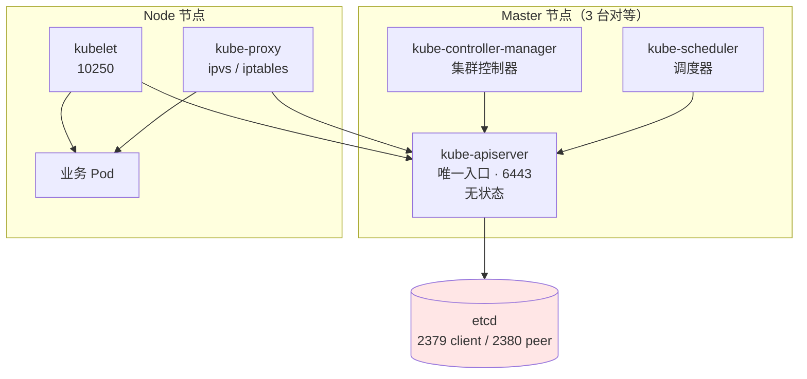
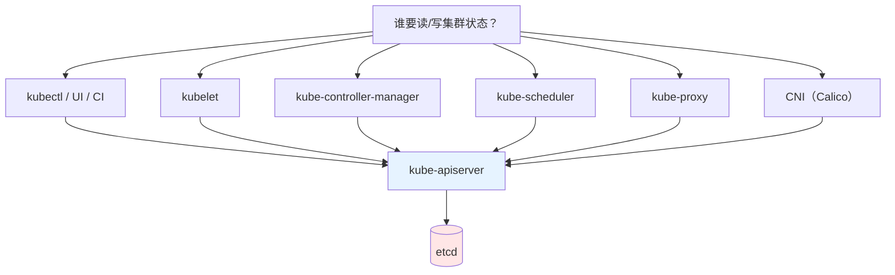
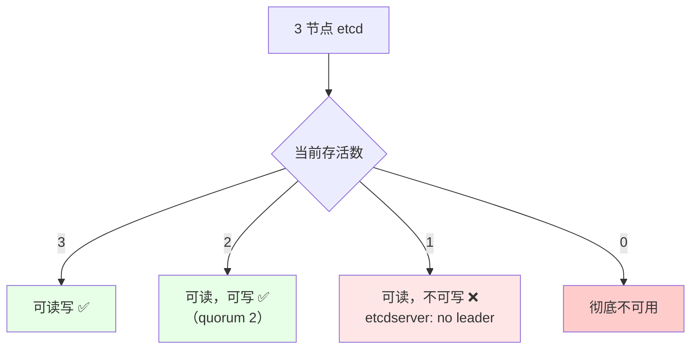
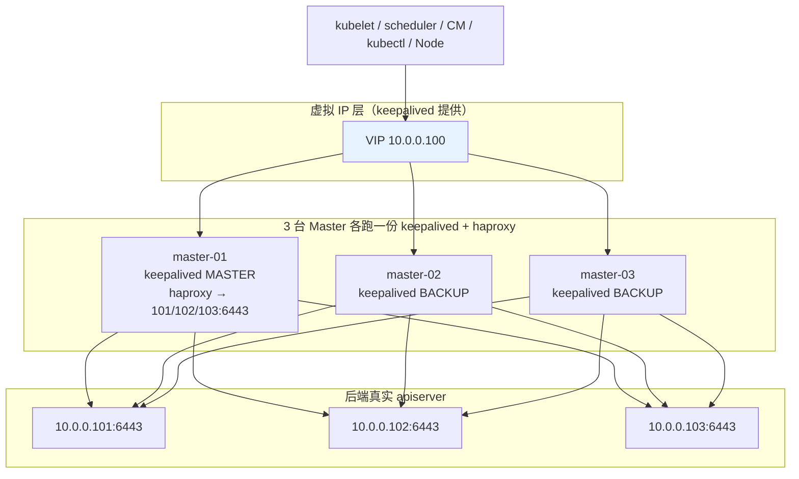
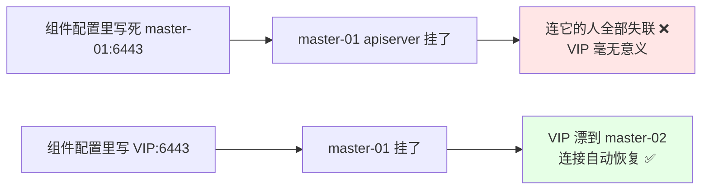
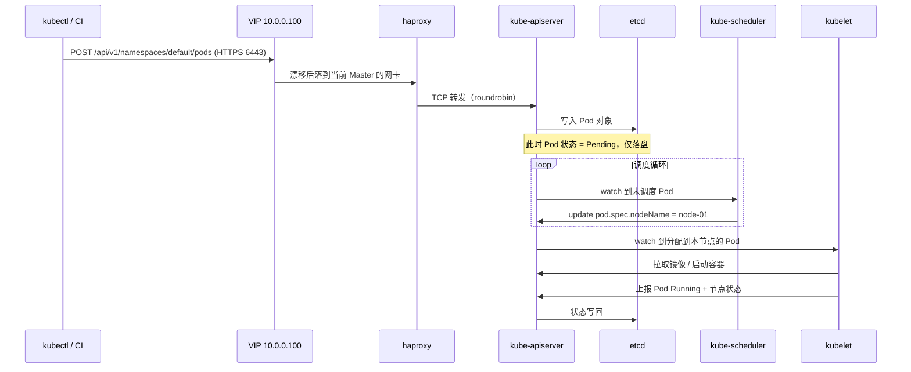
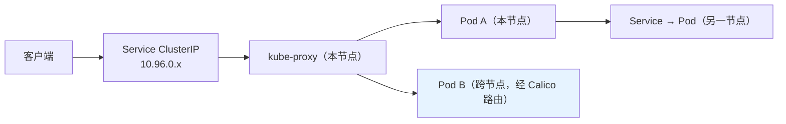
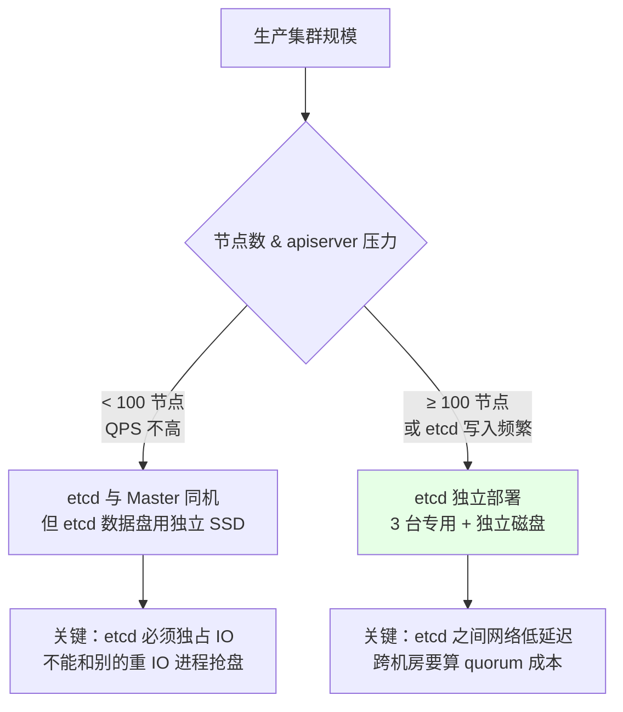

# Kubernetes 集群部署: Kubernetes 高可用架构解析与组件通信路径

装之前先看架构，这一步能省掉后面 80% 的「为什么这里要配 VIP」「为什么这个组件连不上」的困惑。

结论先给：

- 高可用靠的是**一条链**：**VIP（keepalived 漂移） → haproxy（4 层反代） → 3 台 kube-apiserver → etcd**；
- **所有组件连 VIP，不连某台 Master 的 IP**，这是高可用的关键；如果直连具体节点，那台 apiserver 一挂，连它的人就全断；
- **只有 apiserver 直连 etcd**，kubelet / kube-proxy / scheduler / controller-manager 都不碰 etcd。

## 纲要
- 控制面三件套：apiserver / controller-manager / scheduler
- 数据面：etcd 与它的 quorum
- 负载均衡层：VIP + keepalived + haproxy
- 完整通信路径拆解
- etcd 合部署还是独立部署
- 架构自检清单

本次涉及的目录结构（高可用集群的分层结构）：

```text
├── 负载均衡层
│   ├── keepalived          # VIP 漂移
│   └── haproxy             # 四层转发到 3 个 apiserver
├── 控制平面层
│   ├── kube-apiserver ×3   # 唯一写 etcd 的组件
│   ├── kube-controller-manager ×3
│   └── kube-scheduler ×3
└── 数据层
    └── etcd ×3             # 奇数节点，Raft 选主
```


## 控制面三件套

Master 上跑三个核心控制组件，外加每节点都有的 kubelet / kube-proxy：



| 组件 | 职责 | 状态 | 挂了的后果 |
| --- | --- | --- | --- |
| **kube-apiserver** | 全集群唯一数据入口，所有读写都过它 | 无状态（可水平扩容） | 整个集群不可用 |
| **kube-controller-manager** | 保证期望状态 == 实际状态（副本、节点、证书续期…） | 有 leader 选举 | Pod 不再自愈/扩缩容停摆，已跑的不受影响 |
| **kube-scheduler** | 决定 Pod 落在哪个 Node | 有 leader 选举 | 新 Pod 一直 Pending，已有 Pod 不受影响 |
| **kubelet** | 节点 Agent，管 Pod 生命周期 | 每节点一个 | 该节点变 NotReady，其上 Pod 被驱逐 |
| **kube-proxy** | Service 的 ClusterIP / NodePort 转发 | 每节点一个 | 该节点服务转发失效 |
| **etcd** | 唯一有状态存储 | 需 quorum | 写不可用 |

apiserver 是**唯一的收敛点**：



注意：**除 apiserver 外，没有任何组件直连 etcd**。所以 etcd 挂了，影响面是「apiserver 写不动」；而 etcd 恢复后，apiserver 能自动继续工作，不需要重启任何组件 —— 这是 apiserver 作为收敛点带来的最大好处。

## 数据面：etcd 与 quorum

etcd 用 Raft 保证一致性，**quorum（法定人数）= 成员数 / 2 + 1**：

| 成员数 | quorum | 允许坏几个 | 生产可用 |
| --- | --- | --- | --- |
| 1 | 1 | 0 | ❌ 单点 |
| 2 | 2 | **0** | ❌ 坏一个就写不了 |
| 3 | 2 | 1 | ✅ 最小可用 |
| 5 | 3 | 2 | ✅ 大规模 |



**2 个成员不等于高可用**：quorum 是 2，随便坏一个就写不了。所以高可用集群 etcd 必须 3（或 5）个成员。

## 负载均衡层：VIP + keepalived + haproxy

这是高可用架构里**唯一需要额外搭的一层**，也是最容易配错的一层。



关键概念：

| 概念 | 说明 |
| --- | --- |
| **VIP** | 一个虚拟 IP，不绑定具体机器，由 keepalived 在 Master 之间漂移 |
| **keepalived** | 通过 VRRP 协议决定 VIP 落在哪台；配了真实 IP 和 VIP 的**双 IP 网卡** |
| **haproxy** | 4 层 TCP 反代，把 VIP 上的 6443 转到 3 台 apiserver |
| **control-plane-endpoint** | `kubeadm init` 时传给 apiserver 的入口地址，就是 VIP |

**为什么必须是 VIP 而不是某一台 Master 的 IP**：



**为什么用 haproxy 而不是 nginx**：apiserver 是纯 TCP（HTTPS）服务，不需要 7 层解析。haproxy 配 tcp 模式反代极简单，性能也好；nginx 做 4 层（stream）也能干活，但配置略啰嗦。

**有的公司有 F5 硬件负载均衡**：那就**不用** keepalived 和 haproxy —— F5 自己提供 VIP，后端挂 3 台 apiserver 即可。省掉一层，反而更稳。

haproxy 配置（4 层反代）：

```bash
# /etc/haproxy/haproxy.cfg
global
    log /dev/log local0
    maxconn 20000
    daemon

defaults
    mode tcp                      # 关键：4 层 TCP，不做 7 层解析
    timeout connect 5s
    timeout client 1m
    timeout server 1m
    log global

frontend k8s-apiserver
    bind *:6443
    mode tcp
    option tcplog
    default_backend k8s-apiserver

backend k8s-apiserver
    mode tcp
    balance roundrobin
    option tcplog
    option tcp-check
    # 用 https 健康检查，确认 apiserver 真的活着
    tcp-check send GET\ /healthz\ HTTP/1.0\r\n
    tcp-check expect string ok
    server master-01 10.0.0.101:6443 check inter 3s fall 3 rise 2
    server master-02 10.0.0.102:6443 check inter 3s fall 3 rise 2
    server master-03 10.0.0.103:6443 check inter 3s fall 3 rise 2
```

keepalived 配置（VIP 漂移）：

```text
# /etc/keepalived/keepalived.conf
! Configuration File for keepalived

global_defs {
   router_id LVS_K8S
   script_user root
   enable_script_security
}

# 每 2 秒检查一次本地 haproxy 是否还活着，不活就降级让位
vrrp_script check_haproxy {
    script "/etc/keepalived/check_haproxy.sh"
    interval 2
    weight -20
    fall 2
    rise 2
}

vrrp_instance VI_1 {
    state MASTER            # 另两台配 BACKUP
    interface ens33         # VIP 绑的网卡（用 ip addr 看真实网卡名）
    virtual_router_id 51   # 同 VLAN 内唯一
    priority 150            # 另两台依次 140 / 130，主备优先级差要大
    advert_int 1
    authentication {
        auth_type PASS
        auth_pass 1111      # 同集群三台必须一致
    }
    virtual_ipaddress {
        10.0.0.100          # VIP
    }
    track_script {
        check_haproxy
    }
}
```

```bash
#!/usr/bin/env bash
# /etc/keepalived/check_haproxy.sh —— haproxy 存活探测
if [ "$(pgrep -c haproxy)" -lt 1 ]; then
  exit 1     # 返回非 0 = 不健康 → 降权 → VIP 漂走
fi
exit 0
```

**必须注意**：`check_haproxy` 这条脚本是**容易漏的一环**。没有它，haproxy 进程死了但 keepalived 还活着，VIP 不漂，流量全打到一个没有后端服务的节点上，表现为「集群完全连不上」而不是「切到另一台」。

## 完整通信路径拆解

把一次典型操作走一遍，看架构怎么串起来：



数据面（业务流量）路径：



Node 侧通信**也走 VIP**（Node 的 kubelet/kube-proxy 连 apiserver 用的是 control-plane-endpoint 也就是 VIP），而不是「直连某台 Master」。

## etcd 合部署还是独立部署

课程演示环境只有 5 台机器，etcd 与 3 台 Master 部署在一起。生产怎么选：

| 维度 | etcd 与 Master 同机（3 台） | etcd 独立部署（3 台专用） |
| --- | --- | --- |
| 机器成本 | 低（5 台就够） | 高（多 3 台） |
| apiserver 高并发时 | **etcd 受 apiserver 干扰** | 互不影响 |
| 扩容复杂度 | 简单 | 需要额外维护一套机器与网络 |
| 适用 | 演示、中小集群（< 100 节点） | **生产、大规模集群** |
| 故障域 | Master 挂 = etcd 也少一个成员 | 独立 |



即便同机部署，也要保证 **etcd 数据目录所在的磁盘不被别的进程抢占 IO** —— etcd 对 fsync 延迟极其敏感，延迟一高，选举就会抖动。

## 架构自检清单

| 检查项 | 验证方式 |
| --- | --- |
| VIP 能漂 | `ip addr | grep 10.0.0.100`，看它在哪台 |
| haproxy 后端全绿 | `echo "show stat" \| socat stdio /var/lib/haproxy/admin.sock \| grep apiserver` |
| apiserver 有多副本 | `kubectl get pod -n kube-system -o wide \| grep kube-apiserver` |
| etcd 成员正常 | `etcdctl endpoint health -w table` |
| 组件连的是 VIP | `kubectl -n kube-system get pod kube-apiserver-xxx -o yaml \| grep -i server` 或看 kubeconfig |
| scheduler / controller-manager 有主 | `kubectl get lease -n kube-system`（或老版本 `kubectl get endpoints kube-controller-manager`） |

```bash
# 模拟验证：停掉一台 Master 的 apiserver，看集群是否仍可用
systemctl stop kube-apiserver
kubectl get node          # 仍然成功 → VIP + LB 生效
TEST_POD=$(kubectl get pod -l app=test -o jsonpath='{.items[0].metadata.name}')
kubectl delete pod "$TEST_POD" # 成功 → 写链路正常

# 再把 VIP 手动漂走，验证 keepalived
ip addr del 10.0.0.100/24 dev ens33
# 观察 VIP 是否漂到另一台（/var/log/messages 看 VRRP 日志）
```

## API 速览

| 能力 | 命令 |
| --- | --- |
| 看 VIP 在哪台 | `ip addr \| grep <vip>` |
| 看 keepalived 状态 | `systemctl status keepalived` / `tail -f /var/log/messages \| grep VRRP` |
| 看 haproxy 后端 | `echo "show stat" \| socat stdio /var/lib/haproxy/admin.sock` |
| 看 apiserver 分布 | `kubectl get pod -n kube-system -o wide \| grep kube-apiserver` |
| 看 etcd 成员 | `etcdctl member list -w table` |
| 看 etcd 健康 | `etcdctl endpoint health -w table` |
| 看调度/控制面主节点 | `kubectl get lease -n kube-system` |
| 验证 apiserver  healthy | `curl -k https://<vip>:6443/healthz` |

## Demo 示例

一个**高可用链路验证脚本**：从 VIP 一路验到 etcd，任何一环断链就报 FAIL。

```bash
#!/usr/bin/env bash
# ha-topology-check.sh —— VIP → haproxy → apiserver → etcd 链路体检
set -uo pipefail

VIP="${VIP:-10.0.0.100}"
API_PORT="${API_PORT:-6443}"
ETCD_ENDPOINTS="${ETCD_ENDPOINTS:-https://10.0.0.11:2379,https://10.0.0.12:2379,https://10.0.0.13:2379}"
ETCD_CA="${ETCD_CA:-/etc/etcd/ssl/ca.pem}"
ETCD_CERT="${ETCD_CERT:-/etc/etcd/ssl/etcd-server.pem}"
ETCD_KEY="${ETCD_KEY:-/etc/etcd/ssl/etcd-server-key.pem}"

rc=0
hr() { printf '\n=== %s ===\n' "$*"; }
ok()  { printf '  [OK]   %s\n' "$*"; }
bad() { printf '  [FAIL] %s\n' "$*"; rc=1; }

hr "1. VIP 归属与连通性"
if ip addr | grep -q "$VIP"; then
  ok "VIP ${VIP} 在本机网卡上（当前持有者: $(hostname -s)）"
else
  echo "  VIP ${VIP} 不在本机（当前持有者应是另一台 Master）"
fi
curl -sk --connect-timeout 5 "https://${VIP}:${API_PORT}/healthz" | grep -q ok \
  && ok "VIP:${API_PORT} 返回 ok" \
  || bad "VIP:${API_PORT} 连不上 —— 检查 keepalived / haproxy / apiserver"

hr "2. haproxy 后端状态"
if [ -S /var/lib/haproxy/admin.sock ]; then
  echo "socat 未安装则用 ss 兜底"
  echo "show stat" | socat stdio /var/lib/haproxy/admin.sock 2>/dev/null \
    | awk -F, 'NR>1 && $1=="k8s-apiserver"{printf "  %-16s %s\n", $2, $18}' \
    | sed 's/^/  /' || true
else
  ss -lnt | grep ":$API_PORT" | sed 's/^/  /'
fi

hr "3. 各 Master apiserver 是否都在跑"
kubectl get pod -n kube-system -o wide 2>/dev/null | grep kube-apiserver | sed 's/^/  /' || bad "kubectl 不可用"

hr "4. etcd 成员与 quorum"
export ETCDCTL_API=3
export ETCDCTL_CA_CERT="$ETCD_CA" ETCDCTL_CERT="$ETCD_CERT" ETCDCTL_KEY="$ETCD_KEY"
etcdctl --endpoints="$ETCD_ENDPOINTS" member list -w table 2>/dev/null | sed 's/^/  /'
etcdctl --endpoints="$ETCD_ENDPOINTS" endpoint health -w table 2>/dev/null | sed 's/^/  /'
MEMBERS=$(etcdctl --endpoints="$ETCD_ENDPOINTS" member list 2>/dev/null | wc -l)
HEALTHY=$(etcdctl --endpoints="$ETCD_ENDPOINTS" endpoint health 2>/dev/null | grep -c true)
echo "  成员数 ${MEMBERS}，健康数 ${HEALTHY}"
[ "$MEMBERS" -ge 3 ] && [ "$HEALTHY" -ge 2 ] \
  && ok "etcd quorum 正常" || bad "etcd 不满足 quorum（成员奇数 + 至少 quorum 个健康）"

hr "5. 控制面双组件 leader 情况"
kubectl get lease -n kube-system 2>/dev/null | sed 's/^/  /' || true

hr "6. 客户端连接地址是否走 VIP"
KUBECONFIG=${KUBECONFIG:-/etc/kubernetes/admin.conf}
grep -o "server: https://[^:]*" "$KUBECONFIG" 2>/dev/null | head -1 | sed 's/^/  /'
grep -q "$VIP" "$KUBECONFIG" 2>/dev/null \
  && ok "kubeconfig 走 VIP（高可用生效）" \
  && bad "kubeconfig 写死了某台 Master IP，该节点故障会全断"
# 上面两行只能命中一个，重排一下
if grep -q "$VIP" "$KUBECONFIG" 2>/dev/null; then
  ok "kubeconfig 走 VIP（高可用生效）"
else
  bad "kubeconfig 未指向 VIP"
fi

hr "7. 模拟故障：故意连一个不存在的后端"
curl -sk --connect-timeout 3 "https://127.0.0.1:6443/healthz" >/dev/null 2>&1 \
  && bad "本机 6443 不应有服务（除非本机 apiserver）" \
  || ok "本机 6443 无直连服务（符合预期：只从 VIP 进）"

echo
if [ $rc -eq 0 ]; then echo "高可用链路正常。"; else echo "存在断链，逐项处理。"; fi
exit $rc
```

## 总结

高可用架构看着复杂，其实只有一句话：**让所有客户端连一个会漂的地址，而不是连某个具体节点**。

- **链路是 4 层**：VIP（keepalived 漂移） → haproxy（TCP 6443 反代） → 3 台 kube-apiserver → etcd；
- **组件一律连 VIP**：kubeadm 通过 `--control-plane-endpoint=<VIP>` 实现；写死某台 Master IP 的话，VIP 就白搭了；
- **只有 apiserver 直连 etcd**，其他组件全走 apiserver —— 这是 etcd 故障影响面能收敛的原因；
- **etcd 成员必须奇数**：2 台 etcd 的 quorum 是 2，坏一个就写不了；生产大规模建议 etcd 独立部署并独占磁盘 IO；
- **别漏 keepalived 的 haproxy 探测脚本**：没有它，haproxy 挂了 VIP 不漂，表现为「整个集群连不上」而不是「自动切换」。

