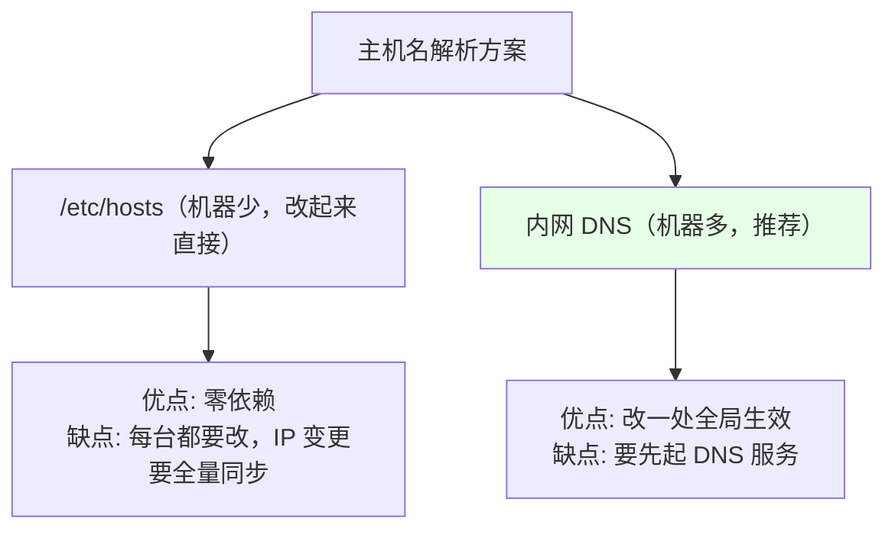
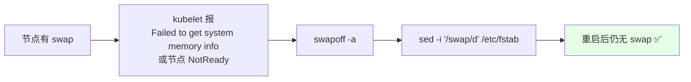
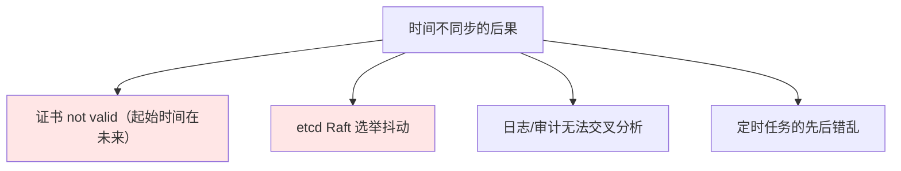
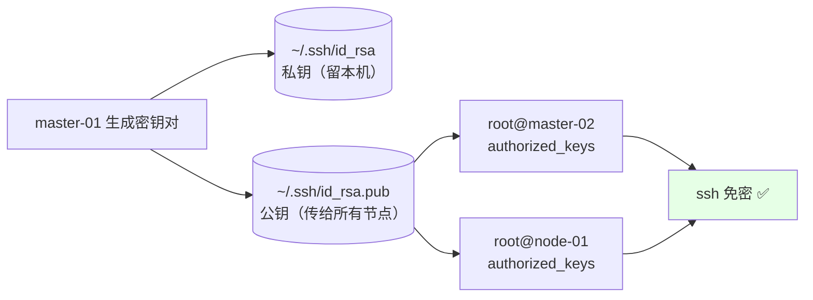
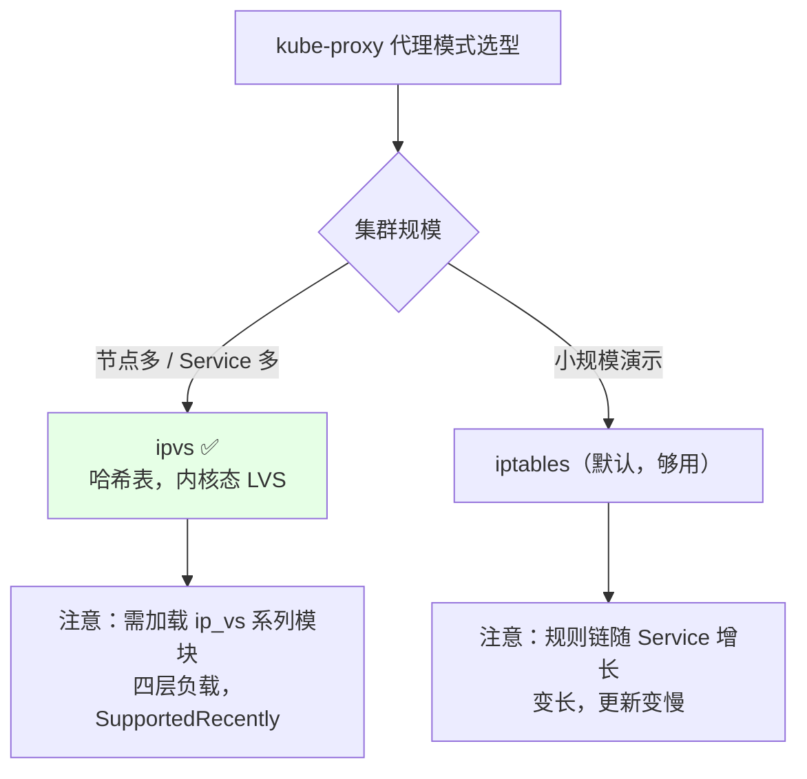
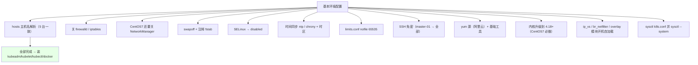

# Kubernetes 集群部署: kubeadm 安装前的基本环境配置清单

kubeadm 把装集群简化成了两条命令，但**它不会帮你配操作系统**。系统层没配好，`kubeadm init` 要么直接失败，要么装上了一个现在能跑、以后天天出事的集群。

结论先给：

- 环境准备分七项：**hosts / 关防火墙 / 关 swap / 关 SELinux / 时间同步 / 内核模块 + sysctl / SSH 免密**；
- **swap 必须关**，否则 kubelet 会在有 swap 的节点上不健康（`MemorySwap` 没显式配置）；
- **ipvs + br_netfilter 内核模块必须开机自加载**，否则大集群下 kube-proxy 用 iptables 模式性能塌方。

## 纲要

- 五台机器的分工与操作范围约定
- /etc/hosts 与主机名解析
- 关闭防火墙、firewalld、NetworkManager（CentOS 7）
- 关闭 swap 与 SELinux
- 时间同步（chrony / ntp）
- 资源限制与 SSH 免密
- yum 源与基础工具
- 内核升级与 ipvs 模块加载
- 内核参数 sysctl

## 五台机器的分工与操作范围

```text
/etc/hosts 规划（5 台一致）
┌──────────────┬──────────────┬────────────────────────────────┐
│ 主机名        │ IP            │ 角色                              │
├──────────────┼──────────────┼────────────────────────────────┤
│ master-01    │ 10.0.0.101   │ etcd + 控制面 + kubelet + proxy │
│ master-02    │ 10.0.0.102   │ 同上（对等）                      │
│ master-03    │ 10.0.0.103   │ 同上                              │
│ node-01      │ 10.0.0.106   │ kubelet + kube-proxy + Pod       │
│ node-02      │ 10.0.0.107   │ kubelet + kube-proxy + Pod       │
│ vip          │ 10.0.0.100   │ keepalived/haproxy 虚拟，不占机器  │
└──────────────┴──────────────┴────────────────────────────────┘
```

用 FinalShell / Xshell 的「发送到所有会话」能同时操作 5 台，但**要分清哪些命令是全跑、哪些只跑一台**：

| 范围 | 命令 |
| --- | --- |
| **全部 5 台** | hosts、关防火墙、swap、SELinux、时间同步、yum 源、内核模块、sysctl |
| **1 台（master-01）** | SSH 免密、kubeadm init、Calico 安装 |
| **其余 4 台** | `kubeadm join` |

**拿到文档先统一替换 IP**：用编辑器全局替换（Ctrl+H）一次改完，别碰见一个改一个 —— 遗漏一处的表现是「装到一半某台连不上」，排查起来很费时间。

## /etc/hosts 与主机名解析

集群内部**用主机名通信**，不用 IP —— 主机名扩展性更好，换 IP 只改 `/etc/hosts`。

```bash
cat >> /etc/hosts <<'EOF'
10.0.0.101 master-01
10.0.0.102 master-02
10.0.0.103 master-03
10.0.0.106 node-01
10.0.0.107 node-02
10.0.0.100 vip.k8s.local
EOF

# 逐台验证
ping -c 1 master-02
ping -c 1 node-01
```

如果机器多、IP 会变，用内网 DNS 替代 `/etc/hosts` 更省事：



## 关闭防火墙 / firewalld

```bash
systemctl stop firewalld
systemctl disable firewalld
# 老机器上没有 firewalld，报错无所谓
iptables -F && iptables -X && iptables -Z
```

**注意网络插件的例外**：有些 CNI（如 Calico 的部分模式）需要放行特定协议；但 Kubernetes 组件之间基本都在内网互通，直接关防火墙在演示环境是标准做法。**生产环境不要直接关**，用放行规则：

```bash
# 生产环境示例：只放行必要端口，不整体关防火墙
firewall-cmd --permanent --add-port=6443/tcp      # apiserver
firewall-cmd --permanent --add-port=2379-2380/tcp # etcd
firewall-cmd --permanent --add-port=10250-10256/tcp
firewall-cmd --permanent --add-port=179/tcp       # Calico BGP
firewall-cmd --reload
```

**CentOS 8 与 7 的区别**：CentOS 8 不需要关 NetworkManager；CentOS 7 必须关，否则 NetworkManager 与 network 脚本争抢网卡配置，会导致 IP 时有时无。

```bash
# CentOS 7 才需要
systemctl stop NetworkManager
systemctl disable NetworkManager
systemctl enable network
systemctl start network
```

## 关闭 swap

Kubernetes 1.8 之后，节点上**开启 swap 时 kubelet 默认不健康**。

```bash
# 1. 查看
swapon --show
free -h

# 2. 关闭当前
swapoff -a

# 3. 永久关闭：注释 /etc/fstab 里的 swap 行
sed -i '/swap/d' /etc/fstab
# 或更稳：把 swap 行前加 #
# /dev/mapper/centos-swap none swap defaults 0 0  →  #/dev/...

# 4. 确认
cat /etc/fstab | grep -v '^#'
swapon --show      # 输出为空即成功
```



**只 `swapoff -a` 不改 fstab 是常见翻车点** —— 重启后 swap 又回来了，下次开机 kubelet 又不健康。

如果业务确实要用 swap（内存紧张的老节点），kubelet 1.22+ 之后可以显式允许：

```yaml
apiVersion: kubelet.config.k8s.io/v1beta1
kind: KubeletConfiguration
memorySwap:
  swapBehavior: LimitedSwap   # 或 NoSwap / UnlimitedSwap
```

## 关闭 SELinux

```bash
# 临时
setenforce 0

# 永久（改完重启生效）
sed -i 's/^SELINUX=enforcing/SELINUX=disabled/' /etc/selinux/config
# 或 sed -i 's/^SELINUX=permissive/SELINUX=disabled/' /etc/selinux/config

grep SELINUX /etc/selinux/config
getenforce    # 期望 Disabled
```

| 状态 | 行为 | 建议 |
| --- | --- | --- |
| `Enforcing` | 拦截未授权访问 | ❌ 演示环境会让挂载、网络、容器运行权限问题层出不觉 |
| `Permissive` | 只记录不拦截 | ⚠️ 比 Enforcing 好，但不是目标状态 |
| `Disabled` | 完全关闭 | ✅ 演示/测试环境标准做法 |

生产环境一般也是 `Permissive` 起步，排障完再评估是否 `Enforcing`。

## 时间同步

**这一步绝对不能省**。服务器时间不一致会导致：证书校验失败、etcd 选举异常、日志时间线错乱、审计对不上。



CentOS 8 默认用 `chrony`，CentOS 7 用 `ntp`。课程习惯上还是装 `ntp`：

```bash
# 安装
yum install -y ntp

# 改时区
timedatectl set-timezone Asia/Shanghai
# 或老方式：cp /usr/share/zoneinfo/Asia/Shanghai /etc/localtime

# 指定时间服务器（示例用阿里云；公司有自有 NTP 就改成内网地址）
sed -i 's/^server.*/#&/' /etc/ntp.conf
cat >> /etc/ntp.conf <<'EOF'
server ntp.aliyun.com iburst
server ntp1.aliyun.com iburst
EOF

# 启动并开机自启
systemctl restart ntpd
systemctl enable ntpd

# 强制同步一次（刚装完时）
ntpdate -u ntp.aliyun.com

# 开机后 3~5 分钟自动再同步一次（写在 rc.local）
echo "*/5 * * * * /usr/sbin/ntpdate -u ntp.aliyun.com >/dev/null 2>&1" >> /etc/rc.local
chmod +x /etc/rc.local

# 验证
ntpstat            # 或 ntpq -p
date               # 五台时间应一致
timedatectl status
```

```bash
# 批量核对（在 master-01 上一次性对 5 台 date，比逐台敲快得多）
for h in master-01 master-02 master-03 node-01 node-02; do
  printf '%-12s %s\n' "$h" "$(ssh $h date '+%F %T')"
done
```

**云环境 / 私有云**一般自带时间同步服务，这步可以跳过，但仍建议验证一次五台时间是否一致。

## 资源限制与 SSH 免密

```bash
# 文件打开数上限
cat >> /etc/security/limits.conf <<'EOF'
* soft nofile 65535
* hard nofile 65535
* soft nproc  65535
* hard nproc  65535
EOF

# SSH 免密：master-01（当控制端）能无密登录其余 4 台
ssh-keygen -t rsa -b 2048 -N '' -f /root/.ssh/id_rsa -q
# 把公钥拷到所有节点（包括自己）
for h in master-01 master-02 master-03 node-01 node-02; do
  ssh-copy-id -i /root/.ssh/id_rsa.pub root@$h
done

# 验证
ssh master-02 "hostname; date"
```



私钥要留在控制端，公钥分发到所有节点。**生产环境更常见的做法是有一台独立的跳板机（堡垒机）持有这个 SSH 权限**，一个跳板机管所有集群，而不是每台集群都登 Master 去操作。机器多了可以用 sshpass 批量分发，或者直接走配置管理工具。

## yum 源与基础工具

国内环境用阿里云镜像源，官方源慢得让人怀疑人生：

```bash
# 基础工具
yum install -y conntrack-tools vim libtool-ltdl wget net-tools \
               nc telnet lsof ntpdate

# Kubernetes 源（阿里云）
cat > /etc/yum.repos.d/kubernetes.repo <<'EOF'
[kubernetes]
name=Kubernetes
baseurl=https://mirrors.aliyun.com/kubernetes/yum/repos/kubernetes-el7-x86_64
enabled=1
gpgcheck=1
repo_gpgcheck=1
gpgkey=https://mirrors.aliyun.com/kubernetes/yum/doc/yum-key.gpg
        https://mirrors.aliyun.com/kubernetes/yum/doc/rpm-package-key.gpg
EOF

# Docker 源（阿里云）
yum-config-manager --add-repo \
  https://mirrors.aliyun.com/docker-ce/linux/centos/docker-ce.repo
```

注意：阿里云镜像站上 **el8 的 kubernetes 源当时还缺失**，常用做法是先落 el7 源（不影响使用）。

```bash
#  ConnTrack 依赖：kubeadm 会用到 conntrack 命令
yum install -y conntrack-tools
```

## 内核升级与 ipvs 模块

CentOS 7 默认内核 3.10，跑 Kubernetes **必须升到 4.18+（推荐 4.19）**；CentOS 8 默认内核 4.18，一般够用。

```bash
# 导入 elrepo 源
yum install -y https://www.elrepo.org/elrepo-release-7.el7.elrepo.noarch.rpm

# 一键升到最新稳定内核
yum --enablerepo=elrepo-kernel install -y kernel-ml

# 确认新内核被加入 grub 默认项（这一步很多人漏）
grub2-set-default 0
 grub2-mkconfig -o /boot/grub2/grub.cfg

# 重启生效
reboot
uname -r     # 期望 4.19.x
```

`dnf` 是 yum 的下一代工具，语法基本一致（`dnf install -y xxx`），CentOS 8 默认带，CentOS 7 想用可以 `yum install -y dnf`。

### ipvs 内核模块

课程生产环境**全用 ipvs 代理模式**，不用 iptables —— 集群规模一大，iptables 的规则链长度是 O(n²) 的匹配开销，**几乎不可用**；ipvs 用哈希表，规模上来后性能差距是数量级的。

```bash
# 加载模块（CentOS 8 / 高版本 4.19+ 内核里 br_netfilter 等已改名或整合）
cat > /etc/sysconfig/modules/k8s.modules <<'EOF'
#!/bin/bash
# 开机自动加载 Kubernetes 必需内核模块
modprobe -- ip_vs
modprobe -- ip_vs_rr
modprobe -- ip_vs_wrr
modprobe -- ip_vs_sh
modprobe -- nf_conntrack_ipv4
modprobe -- br_netfilter
modprobe -- overlay
EOF

chmod +x /etc/sysconfig/modules/k8s.modules

# 立即加载一次
bash /etc/sysconfig/modules/k8s.modules

# 确认
lsmod | grep -E 'ip_vs|br_netfilter|overlay'
```



**模块加载失败的常见报错**：高版本内核（4.19+）里 `nf_conntrack_ipv4` 已并入 `nf_conntrack`，`modprobe` 会报 `unknown symbol` 或 `Unknown symbol in module`。这是**警告不是致命错误**，前面的 `ip_vs` 系列模块已经加载成功就够用；生产环境建议把所有可能报错的行加 `2>/dev/null || true` 兜底，或者按内核版本区分处理。

## 内核参数 sysctl

```bash
cat > /etc/sysctl.d/k8s.conf <<'EOF'
net.bridge.bridge-nf-call-iptables  = 1
net.bridge.bridge-nf-call-ip6tables = 1
net.ipv4.ip_forward                 = 1
net.ipv4.tcp_tw_reuse               = 1
net.ipv4.tcp_fin_timeout            = 60
net.ipv4.ip_local_port_range        = 1024 65535
net.core.somaxconn                  = 32768
net.core.netdev_max_backlog         = 32768
net.ipv4.tcp_max_syn_backlog        = 32768
fs.file-max                         = 1024000
vm.max_map_count                    = 262144
vm.swappiness                       = 0
EOF

# 生效
sysctl --system

# 验证
sysctl -p /etc/sysctl.d/k8s.conf
sysctl -a | grep -E 'bridge-nf-call|ip_forward'
```

几条的关键作用：

| 参数 | 为什么 |
| --- | --- |
| `net.bridge.bridge-nf-call-iptables=1` | **必配**。不配的话 Pod 网络跨节点访问 Service 时不走 iptables，流量不通 |
| `net.ipv4.ip_forward=1` | **必配**。不开启 kubelet 无法做 Pod 间的网络转发 |
| `net.ipv4.ip_local_port_range` | kube-proxy 用大量本地端口做 SNAT，默认范围不够会 `bind: cannot assign requested address` |
| `vm.swappiness=0` | 配合关 swap，尽量用物理内存 |
| `net.core.somaxconn` | apiserver 并发连接多，默认 128 偏小 |

## 环境配置清单总览



```bash
# 全部一次性的粘贴版（演示环境 direct 跑）
cat >> /etc/hosts <<'EOF'
10.0.0.101 master-01
10.0.0.102 master-02
10.0.0.103 master-03
10.0.0.106 node-01
10.0.0.107 node-02
EOF
systemctl stop firewalld && systemctl disable firewalld
swapoff -a && sed -i '/swap/d' /etc/fstab
setenforce 0 && sed -i 's/^SELINUX=.*/SELINUX=disabled/' /etc/selinux/config
yum install -y ntpdate && ntpdate -u ntp.aliyun.com
modprobe ip_vs ip_vs_rr ip_vs_wrr ip_vs_sh br_netfilter overlay
bash /etc/sysconfig/modules/k8s.modules
sysctl --system
echo "本机: $(hostname) $(ip addr | grep -oP 'inet \K10\.\d+\.\d+\.\d+' | head -1)"
```

## API 速览

| 能力 | 命令 |
| --- | --- |
| 看本机 IP | `ip addr` / `hostname -I` |
| 解析测试 | `ping master-02` / `getent hosts master-02` |
| 查 swap | `swapon --show` / `free -h` |
| 查 SELinux | `getenforce` / `sestatus` |
| 查时间同步 | `timedatectl status` / `ntpstat` / `ntpq -p` |
| 查内核模块 | `lsmod \| grep ip_vs` |
| 查内核参数 | `sysctl -a \| grep bridge-nf` |
| 查文件句柄上限 | `ulimit -n` / `ulimit -Hn` |
| 测试 SSH 免密 | `ssh master-02 uptime` |
| 查内存限制 | `cat /sys/fs/cgroup/memory.max 2>/dev/null \|\| cat /sys/fs/cgroup/memory/memory.limit_in_bytes` |

## Demo 示例

一个**只读**的环境配置体检脚本，把上面所有项一次查完，输出可直接当验收清单。

```bash
#!/usr/bin/env bash
# env-audit.sh —— kubeadm 安装前环境审计（只读）
set -uo pipefail

IP_REG='10\.[0-9]{1,3}\.[0-9]{1,3}\.[0-9]{1,3}'
rc=0
hr() { printf '\n=== %s ===\n' "$*"; }
ok()  { printf '  [OK]   %s\n' "$*"; }
bad() { printf '  [FAIL] %s\n' "$*"; rc=1; }
warn(){ printf '  [WARN] %s\n' "$*"; }

hr "1. 基本信息"
echo "  主机:      $(hostname -s)"
echo "  内核:      $(uname -r)"
echo "  系统:      $(cat /etc/redhat-release 2>/dev/null | head -1)"
echo "  本机 IP:   $(ip -4 addr show scope global 2>/dev/null | awk '/inet /{print $2}' | cut -d/ -f1 | tr '\n' ' ')"
echo "  CPU:       $(nproc) 核   内存: $(free -h | awk '/Mem:/{print $2}')"

hr "2. /etc/hosts 解析"
grep -vE '^\s*(#|$)' /etc/hosts | sed 's/^/  /'
for h in master-01 master-02 master-03 node-01 node-02; do
  if ping -c1 -W1 "$h" >/dev/null 2>&1; then ok "$h 可解析"; else bad "$h 无法解析"; fi
done

hr "3. 防火墙"
systemctl is-active --quiet firewalld && bad "firewalld 在运行" || ok "firewalld 已停"
iptables -L INPUT -n 2>/dev/null | tail -n +4 | wc -l | xargs -I{} echo "  INPUT 链规则数: {}"

hr "4. NetworkManager（仅 CentOS7 关注）"
if [ -f /etc/centos-release ] && grep -q 'CentOS release 7' /etc/centos-release 2>/dev/null; then
  systemctl is-active --quiet NetworkManager && bad "CentOS7 上 NetworkManager 在运行（与 network 冲突）" || ok "NetworkManager 未运行"
else
  warn "非 CentOS7，跳过 NetworkManager 检查"
fi

hr "5. swap"
if swapon --show | grep -q .; then
  bad "swap 未关闭"; swapon --show | sed 's/^/    /'
else
  ok "swap 已关闭"
fi
grep -q '^[^#]*swap' /etc/fstab && warn "/etc/fstab 仍有 swap 条目，重启后会重新启用" || ok "/etc/fstab 无 swap 条目"

hr "6. SELinux"
GET=$(getenforce 2>/dev/null)
case "$GET" in
  Disabled) ok "SELinux Disabled" ;;
  Permissive) warn "SELinux Permissive" ;;
  *) bad "SELinux $GET"; echo "    处理: sed -i 's/^SELINUX=.*/SELINUX=disabled/' /etc/selinux/config" ;;
esac

hr "7. 时间同步"
timedatectl 2>/dev/null | grep -E 'Local time|Timezone|NTP service|synchronized' | sed 's/^/  /'
systemctl is-active --quiet ntpd && ok "ntpd 运行中" || warn "ntpd 未运行（云环境通常自带 chrony）"
systemctl is-active --quiet chronyd && ok "chronyd 运行中" || true

hr "8. limits"
echo "  ulimit -n:      $(ulimit -n)"
echo "  ulimit -Hn:     $(ulimit -Hn)"
grep -E '^\* (soft|hard) nofile' /etc/security/limits.conf | sed 's/^/  /'
[ "$(ulimit -n)" -ge 65535 ] && ok "nofile 达到 65535" || warn "建议 * soft/hard nofile 65535"

hr "9. SSH 免密"
[ -f /root/.ssh/id_rsa ] && ok "已生成密钥对" || bad "未生成 SSH 密钥"
for h in master-02 master-03 node-01 node-02; do
  timeout 3 ssh -o BatchMode=yes -o StrictHostKeyChecking=no root@"$h" true 2>/dev/null \
    && ok "免密登录 $h" || warn "无法免密登录 $h（先 ssh-copy-id）"
done

hr "10. 内核模块"
for m in ip_vs ip_vs_rr ip_vs_wrr ip_vs_sh br_netfilter overlay; do
  lsmod | grep -q "^${m} " && ok "$m 已加载" || bad "$m 未加载（modprobe $m）"
done
[ -x /etc/sysconfig/modules/k8s.modules ] && ok "模块自加载脚本存在" || warn "缺 /etc/sysconfig/modules/k8s.modules"

hr "11. sysctl"
for k in net.bridge.bridge-nf-call-iptables net.bridge.bridge-nf-call-ip6tables net.ipv4.ip_forward; do
  v=$(sysctl -n "$k" 2>/dev/null)
  [ "$v" = "1" ] && ok "$k = 1" || bad "$k = ${v:-未设置}（应为 1）"
done

hr "12. 仓库与工具"
for c in conntrack kubeadm kubelet kubectl docker; do
  printf '  %-10s %s\n' "$c" "$(command -v $c >/dev/null && echo 已安装 || echo 未安装)"
done
[ -f /etc/yum.repos.d/kubernetes.repo ] && ok "kubernetes.repo 已配置" || warn "未配置 kubernetes 源"

hr "13. 磁盘"
df -h / /var 2>/dev/null | awk 'NR>1{printf "  %-16s 剩余 %s\n", $1, $4}'

echo
if [ $rc -eq 0 ]; then echo "环境审计通过，可以继续安装。"; else echo "存在 FAIL 项，先处理。"; fi
exit $rc
```

## 总结

环境配置这一节没有魔法，全是**把默认值改成集群能跑的值**。

- **hosts / 关防火墙 / 关 swap / 关 SELinux / 时间同步**这五项做漏任何一项，后面都会有阴魂不散的怪问题（节点 NotReady、证书 invalid、etcd 选举抖动）。
- **swap 必须同时 `swapoff -a` 和改 fstab**，只做前者重启就打回原形。
- **时间同步不能省**：五台时间一致是 etcd 与证书正常工作的基本前提。
- **内核升到 4.18+（CentOS 7 必做）+ ipvs 模块开机自加载**：大集群下 iptables 模式几乎是灾难，ipvs 是生产默认。
- **`bridge-nf-call-iptables` 和 `ip_forward` 这两条 sysctl 漏配 = Pod 网络直接不通**，写完记得 `sysctl --system` 并复核一遍。

