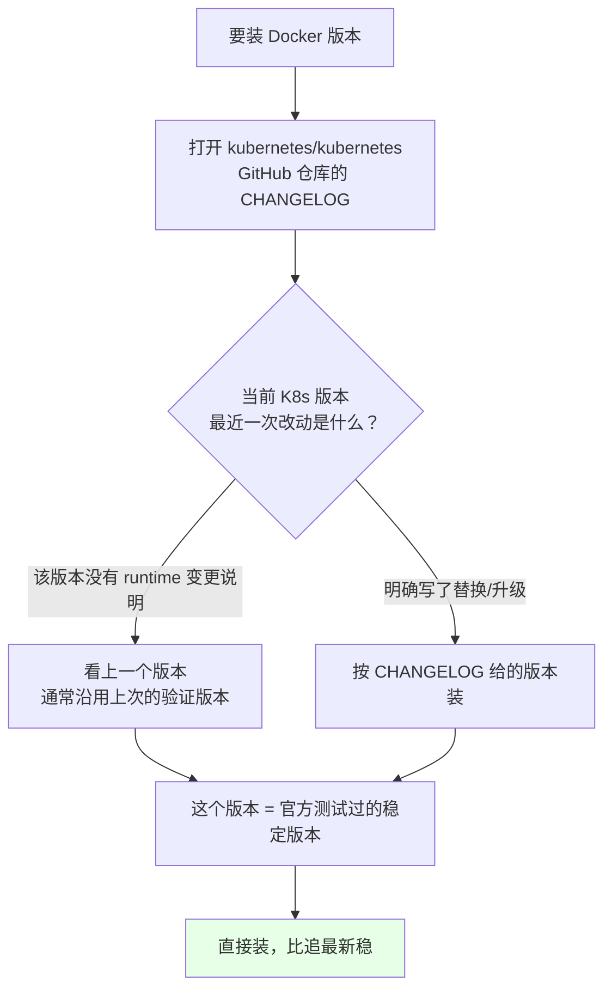
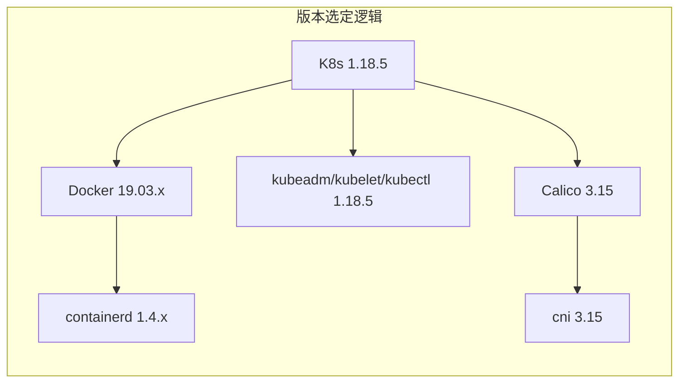
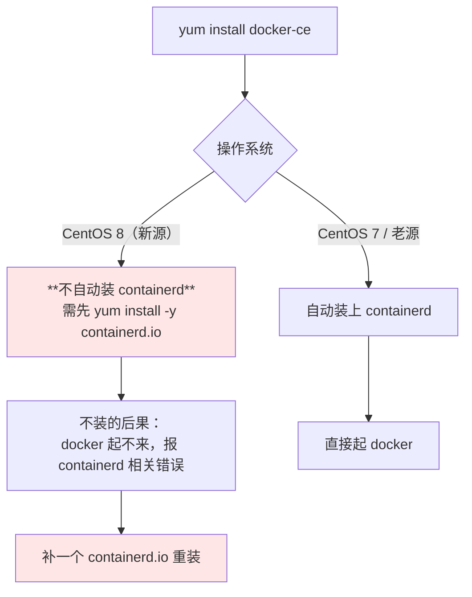
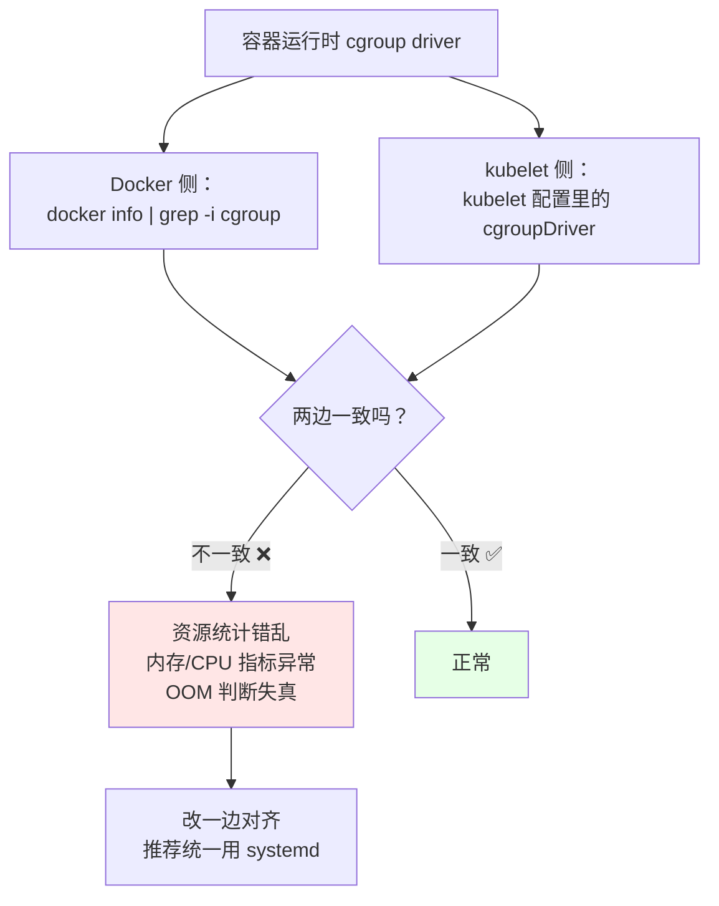
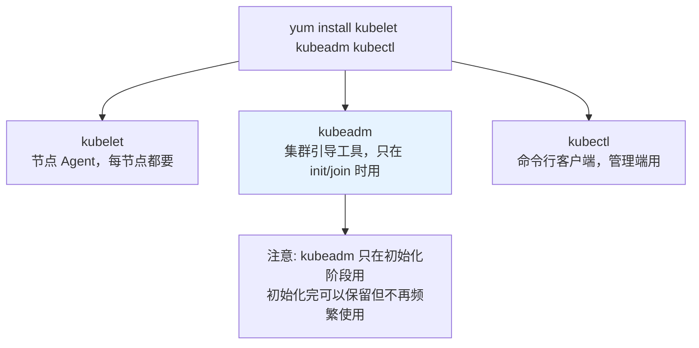
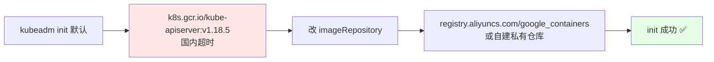

# Kubernetes 集群部署: Docker 与 kubeadm 组件的选定版本及容器运行时配置

环境配好了，接下来装运行时和 kubeadm 三件套。这一步只有一条原则：**版本别追最新，要追「官方测试过」的那版**。

结论先给：

- **Docker 版本要看 kubernetes 仓库的 CHANGELOG**，里面写明了每个 K8s 版本验证过的 runtime 版本（如 K8s 1.18 对应 Docker 19.03.x），不要凭感觉装最新的；
- **CentOS 8 上装 Docker 不会自动带 containerd**，要手动装 —— containerd 负责镜像传输、存储、容器执行与监控、网络；
- **cgroup driver 必须 Docker 与 kubelet 一致**（默认都是 cgroupfs），不一致会导致资源统计错乱、Pod 被误杀。

## 纲要
- 版本怎么定：看 CHANGELOG 而不是看最新版
- 安装 Docker 与 containerd
- cgroup driver 一致性校验
- 安装 kubeadm / kubelet / kubectl
- 镜像仓库改造（gcr 拉不动）
- 安装后的自检

本次涉及的目录结构（节点初始化涉及的配置文件）：

```text
├── /etc/docker/daemon.json     # registry-mirrors、exec-opts 的 cgroupdriver
├── /etc/sysctl.d/k8s.conf      # ip_forward、bridge-nf-call-iptables
├── /etc/yum.repos.d/
│   ├── docker-ce.repo
│   └── kubernetes.repo         # 注意 exclude=kube* 防止误升级
└── /etc/hosts                  # 各节点主机名解析
```


## 版本怎么定：看 CHANGELOG 而不是看最新版

「装最新版」是部署阶段最常见的翻车姿势。Docker 太新，K8s 未必验证过；太旧，新特性也用不上。



以 K8s 1.18 为例：CHANGELOG 显示最近一次 runtime 变更在 1.19.03，说明 **1.18 线验证过的稳定 Docker 版本是 19.03.x**。就装这个，不装 20.x / 24.x 的所谓「最新版」。

| 组件 | 选定版本 | 依据 |
| --- | --- | --- |
| Kubernetes | 1.18.x | 课程主线版本 |
| Docker | 19.03.x | K8s CHANGELOG 验证过的版本 |
| containerd | 1.4.x（随 Docker 一起） | CentOS 8 需手动装 |
| kubeadm / kubelet / kubectl | 1.18.5 | 官方最新稳定版（GA，看不到 beta） |
| Calico | 3.15 | 官方 requirements 里支持 K8s 1.16/1.17/1.18 |



## 安装 Docker 与 containerd

```bash
# 1. 看有哪些可用版本（别直接 yum install docker-ce 装最新）
yum list docker-ce --showduplicates | sort -r

# 2. 装指定版本（CentOS 8 上这一步往往不会自动带上 containerd）
 yum install -y yum-utils device-mapper-persistent-data lvm2
yum-config-manager --add-repo https://mirrors.aliyun.com/docker-ce/linux/centos/docker-ce.repo
yum install -y containerd.io
#   containerd 的作用：管理宿主机上容器的生命周期
#   —— 镜像传输、镜像存储、容器执行与监控、网络
yum install -y docker-ce-19.03.* docker-ce-cli-19.03.*

# 3. 启动 + 开机自启
systemctl enable docker
systemctl start docker
docker version
```



**containerd 是干什么的**：它跑在宿主机上，负责镜像的传输与存储、容器的执行与监控、以及容器网络。**Docker 只是个上层 CLI**，真正的运行时支撑是 containerd（CRI 的实现载体）。CentOS 7 时代装 Docker 会自动带上它，CentOS 8 的新源拆成了独立包，所以经常漏。

```bash
# containerd 单独装好后，手动生成一份默认配置（可选）
mkdir -p /etc/containerd
containerd config default > /etc/containerd/config.toml
# 国内环境通常要把 sandbox_image 里的 k8s.gcr.io 换成镜像仓库地址
sed -i 's#registry.k8s.io/pause#registry.aliyuncs.com/google_containers/pause#g' /etc/containerd/config.toml
systemctl restart containerd
```

## cgroup driver 一致性校验

这是**必查项**，也是「装完能跑但内存指标全是 0」的根源。



```bash
# 1. 看 Docker 用的是什么
docker info | grep -i "cgroup driver"
#   Cgroup Driver: cgroupfs

# 2. 看 kubelet 配置（/etc/systemd/system/kubelet.service.d/10-kubeadm.conf）
grep -i cgroup /var/lib/kubelet/config.yaml 2>/dev/null
#   （此时 config.yaml 可能还没有，等 init 完就有了）

# 3. 若不一致，改 Docker 侧对齐 kubelet（kubeadm 默认 cgroupfs）
cat > /etc/docker/daemon.json <<'EOF'
{
  "exec-opts": ["native.cgroupdriver=systemd"],
  "log-driver": "json-file",
  "log-opts": {
    "max-size": "100m",
    "max-file": "3"
  },
  "registry-mirrors": ["https://xxxx.mirror.aliyuncs.com"]
}
EOF
systemctl daemon-reload
systemctl restart docker
docker info | grep -i "cgroup driver"
```

`daemon.json` 里三块内容各自解决什么问题：

| 配置 | 作用 |
| --- | --- |
| `exec-opts: native.cgroupdriver=systemd` | **cgroup driver 对齐**，与 kubelet 保持一致 |
| `log-opts` | 限制容器日志单文件 100M、最多 3 个，**防止磁盘被日志写满** |
| `registry-mirrors` | 国内加速，可选 |

## 安装 kubeadm / kubelet / kubectl

```bash
# 1. 看可用版本
yum list kubeadm --showduplicates | sort -r

# 2. 指定版本装（稳定版只有 GA，beta 看不到）
 yum install -y kubelet-1.18.5 kubeadm-1.18.5 kubectl-1.18.5
#   或装最新：yum install -y kubelet kubeadm kubectl
#   装的时候会把依赖（kubectl / kubelet）一起带上，不用手动装

# 3. 设为开机自启
systemctl enable kubelet
#   注意：现在 kubelet 多半启动不成功 —— 还没有任何配置文件，
#         init 之后有了 /var/lib/kubelet/config.yaml 就能起来了，这属于正常
systemctl status kubelet
journalctl -u kubelet -n 20 --no-pager

# 4. 确认版本
kubeadm version
kubelet --version
kubectl version --client
```



**kubelet 启动失败是正常的**：`systemctl enable kubelet` 之后马上 `systemctl status kubelet` 大概率是 `active: failed`，日志里是「没有配置文件」。这是因为真正的工作配置由 `kubeadm init` 生成。别去手搓配置硬启它。

## 镜像仓库改造

`kubeadm init` 默认从 `k8s.gcr.io` 拉镜像，**国内环境直接拉不下来**。



两种改法（后面 init 那篇会详细用）：

```bash
# 方式一：init 时直接指定（一条命令）
kubeadm init --image-repository registry.aliyuncs.com/google_containers ...

# 方式二：写进配置文件（推荐，后续 join 也能复用）
kubeadm config print init-defaults > kubeadm.yaml
# 里面改 imageRepository / podSubnet / serviceSubnet / controlPlaneEndpoint
```

另外 `pause` 镜像（sandbox 容器）也在 gcr 里，如果 containerd 那步换了仓库地址，Docker 模式也要同步改：

```bash
# 手动同步一个 pause 镜像（可选）
docker pull registry.aliyuncs.com/google_containers/pause:3.2
# 或本机有镜像时打 tag
# 下面命令中的变量按你的集群环境赋值后再执行
docker tag $IMAGE registry.aliyuncs.com/google_containers/pause:3.2
```

## 安装后的自检

```bash
# 1. Docker 运行时
systemctl is-active docker containerd
docker version
docker info | grep -iE 'cgroup driver|registry mirror'

# 2. kubelet 三件套
rpm -qa | grep -E 'kubelet|kubeadm|kubectl'
kubeadm version

# 3. kubelet 开机自启（允许失败，但不能是 disabled）
systemctl is-enabled kubelet        # 期望 enabled

# 4. 容器日志不会撑爆盘（改了 daemon.json 才生效）
docker info | grep -A3 'Logging Driver'

# 5. 五台都要装！逐台核对
for h in master-01 master-02 master-03 node-01 node-02; do
  printf '%-12s %s\n' "$h" \
    "$(ssh $h 'rpm -qa | grep -E "^(docker-ce|kubelet|kubeadm)" | tr "\n" " "')"
done
```

## API 速览

| 能力 | 命令 |
| --- | --- |
| 看 Docker 版本列表 | `yum list docker-ce --showduplicates \| sort -r` |
| 看 K8s 验证过的 runtime 版本 | 读 kubernetes/kubernetes 仓库 CHANGELOG |
| 装 containerd | `yum install -y containerd.io` |
| 看 cgroup driver | `docker info \| grep -i cgroup` |
| 对齐 cgroup driver | `/etc/docker/daemon.json` → `exec-opts: native.cgroupdriver=systemd` |
| 看 kubeadm 版本 | `kubeadm version` |
| 导出 init 默认配置 | `kubeadm config print init-defaults > kubeadm.yaml` |
| 预拉镜像 | `kubeadm config images pull` |
| 看 kubelet 自启状态 | `systemctl is-enabled kubelet` |
| 看 kubelet 日志 | `journalctl -u kubelet -n 50 --no-pager` |

## Demo 示例

一个**运行时组件安装 + 校验**脚本：装 containerd / Docker / kubeadm 三件套，并做一致性检查（部分可重复执行）。

```bash
#!/usr/bin/env bash
# install-runtime.sh —— Docker + containerd + kubeadm 组件安装与校验
# 用法: ./install-runtime.sh <install|verify>
set -euo pipefail

MODE="${1:-verify}"
K8S_VER="${K8S_VER:-1.18.5}"
DOCKER_VER="${DOCKER_VER:-19.03}"
MIRROR="${MIRROR:-https://xxxx.mirror.aliyuncs.com}"

log() { printf '\n[runtime] %s\n' "$*"; }

if [ "$MODE" = "install" ]; then
  log "1. 基础依赖"
  yum install -y yum-utils device-mapper-persistent-data lvm2

  log "2. 添加阿里云仓库"
  yum-config-manager --add-repo https://mirrors.aliyun.com/docker-ce/linux/centos/docker-ce.repo
  [ -f /etc/yum.repos.d/kubernetes.repo ] || cat > /etc/yum.repos.d/kubernetes.repo <<'EOF'
[kubernetes]
name=Kubernetes
baseurl=https://mirrors.aliyun.com/kubernetes/yum/repos/kubernetes-el7-x86_64
enabled=1
gpgcheck=1
repo_gpgcheck=1
gpgkey=https://mirrors.aliyun.com/kubernetes/yum/doc/yum-key.gpg
        https://mirrors.aliyun.com/kubernetes/yum/doc/rpm-package-key.gpg
EOF

  log "3. containerd（CentOS8 必须手动装）"
  yum install -y containerd.io

  log "4. Docker（按 CHANGELOG 选定 ${DOCKER_VER} 线）"
  yum install -y "docker-ce-${DOCKER_VER}.*" "docker-ce-cli-${DOCKER_VER}.*"

  log "5. docker daemon.json：cgroup driver + 日志限额 + 镜像加速"
  mkdir -p /etc/docker
  cat > /etc/docker/daemon.json <<EOF
{
  "exec-opts": ["native.cgroupdriver=systemd"],
  "log-driver": "json-file",
  "log-opts": { "max-size": "100m", "max-file": "3" },
  "registry-mirrors": ["${MIRROR}"]
}
EOF
  systemctl daemon-reload
  systemctl enable --now docker

  log "6. kubeadm / kubelet / kubectl 锁定 ${K8S_VER}"
  yum install -y "kubelet-${K8S_VER}" "kubeadm-${K8S_VER}" "kubectl-${K8S_VER}"
  systemctl enable kubelet
  echo "  提示: kubelet 现在起不来属于正常（还没有配置文件），init 后自动恢复"

  log "7. 安装完成，跑 verify 自检"
  exit 0
fi

# ---------------------------------------------------------------- verify
rc=0
chk() { if eval "$2" >/dev/null 2>&1; then printf '  [OK]   %s\n' "$1"; else printf '  [FAIL] %s\n' "$1"; rc=1; fi; }

log "A. 服务状态"
systemctl is-active --quiet docker   && echo "  [OK]   docker 运行中"    || { echo "  [FAIL] docker 未运行"; rc=1; }
systemctl is-active --quiet containerd && echo "  [OK]   containerd 运行中" || { echo "  [FAIL] containerd 未运行"; rc=1; }
systemctl is-enabled --quiet kubelet && echo "  [OK]   kubelet 已开机自启" || { echo "  [FAIL] kubelet 未开机自启"; rc=1; }

log "B. 版本"
echo "  docker:   $(docker version --format '{{.Server.Version}}' 2>/dev/null || echo 无)"
echo "  containerd: $(containerd --version 2>/dev/null || echo 无)"
rpm -qa | grep -E '^kube[laem]{1,4}d?m?-?|^kubeadm' | sort | sed 's/^/  /'
kubeadm version 2>/dev/null | sed 's/^/  /'

log "C. cgroup driver 一致性（关键）"
D_DRV=$(docker info 2>/dev/null | awk -F': *' '/Cgroup Driver/{print $2}' | tr -d ' ')
echo "  Docker     cgroup driver = ${D_DRV:-未获取}"
K_DRV=$(grep -oE 'cgroupDriver: *[a-z]+' /var/lib/kubelet/config.yaml 2>/dev/null | awk '{print $2}' | tr -d '"')
echo "  kubelet    cgroup driver = ${K_DRV:-配置文件尚未生成(尚未 init)}"
if [ -n "$K_DRV" ]; then
  [ "$D_DRV" = "$K_DRV" ] \
    && echo "  [OK]   两者一致" \
    || { echo "  [FAIL] 不一致！改 /etc/docker/daemon.json 对齐 kubelet"; rc=1; }
else
  echo "  [WARN] init 后再复检"
fi

log "D. 日志与镜像配置"
docker info 2>/dev/null | grep -A2 'Registry Mirrors' | sed 's/^/  /' || true
grep -q 'max-size' /etc/docker/daemon.json \
  && echo "  [OK]   已配置日志轮转（100m × 3）" \
  || echo "  [WARN] 未配置 max-size，日志可能撑爆磁盘"

log "E. 三件套可执行"
for c in docker containerd kubeadm kubectl kubelet; do
  printf '  %-12s %s\n' "$c" "$(command -v $c || echo 未安装)"
done

echo
[ $rc -eq 0 ] && echo "运行时安装校验通过。" || echo "存在 FAIL 项。"
exit $rc
```

## 总结

这步的核心不是「装上去」，而是**选对版本并对齐配置**。

- **版本跟着 K8s CHANGELOG 走**：K8s 1.18 就配 Docker 19.03.x；追最新版不是稳，是赌。
- **CentOS 8 要手动装 containerd**：它是镜像存储、容器执行、网络、监控的实际管理者，漏了 Docker 直接起不来。
- **cgroup driver 两边必须一致**：Docker 用 `native.cgroupdriver=systemd`，kubelet 侧也要 `systemd`；不一致会造成资源统计错乱和 OOM 误判。
- **`log-opts` 限额必配**：不配的话容器日志能在一晚上写满根分区，这是生产最常见的「机器莫名失联」原因之一。
- **kubelet 现在起不来是正常的**：它等 `kubeadm init` 生成 `/var/lib/kubelet/config.yaml`，别手搓配置硬启。

