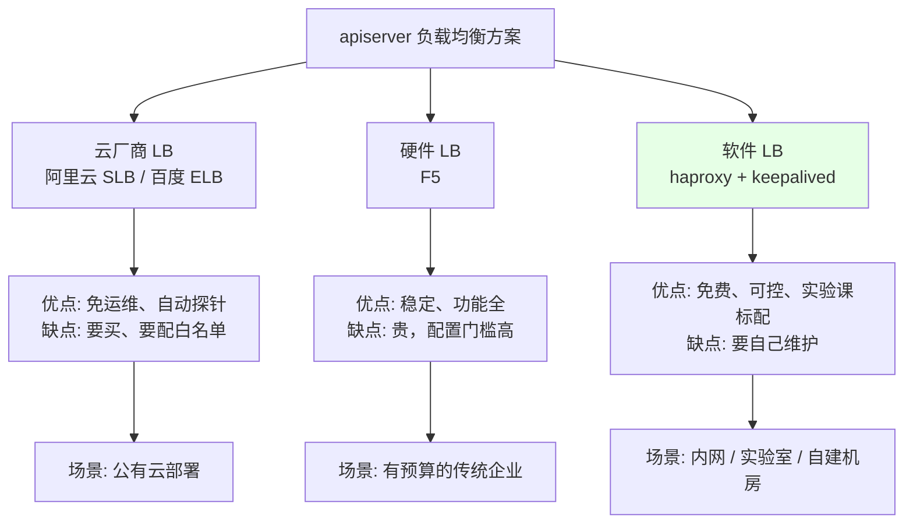
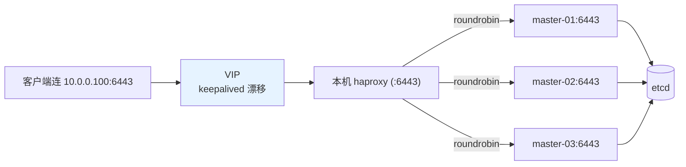
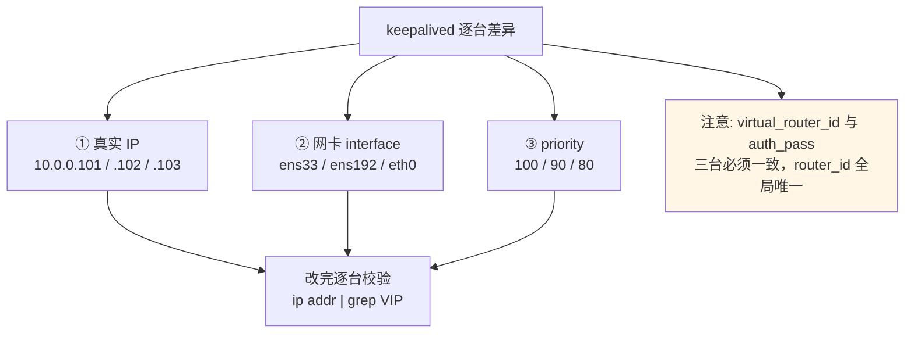
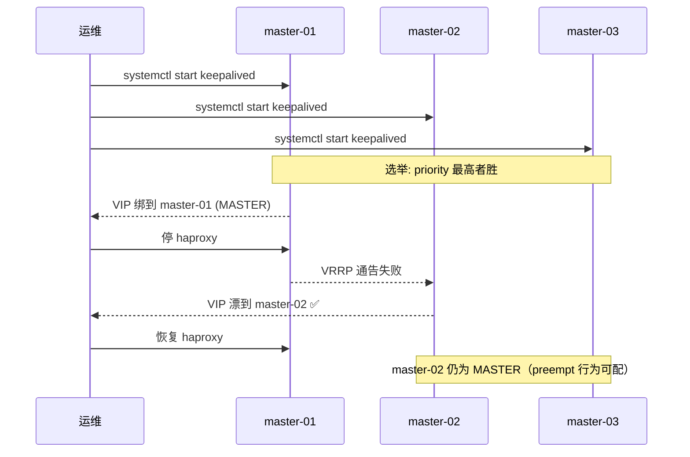
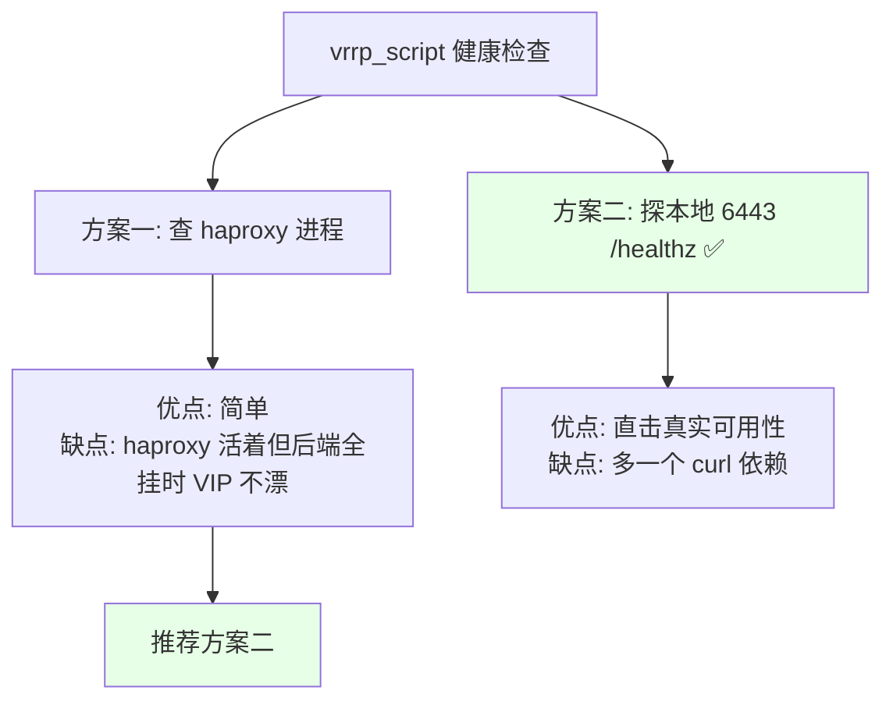

# Kubernetes 集群部署: haproxy 与 keepalived 搭建 apiserver 负载均衡

控制面组件的访问地址只有一个入口：**VIP**。这一节就是把 VIP 造出来，并让它 behind apiserver。

结论先给：

- **只在 3 台 Master 上装** haproxy + keepalived；Node 不需要（Node 连的是 VIP，不是装 LB）；
- haproxy 跑 **4 层 TCP 模式**（apiserver 是纯 HTTPS，不需要 7 层）；
- keepalived 用 VRRP 让 VIP 漂在 Master 之间，**每台都要改 IP、网卡名、router_id 三处**，router_id 不能和公司现有 VRRP 重复；
- **健康检查脚本别省**：配了它，VIP 才会跟着「真的活着」的节点走；不配的话 haproxy 挂了 VIP 也不漂，表现是「整个集群连接不上」。

## 纲要

- 三种负载均衡方案选型
- haproxy 配置（tcp 反代 + 健康探测）
- keepalived 配置（VRRP + VIP + 健康检查）
- 逐台差异点与改法
- 启动与验证
- 常见排错

## 三种负载均衡方案选型



课程用的是 **haproxy + keepalived** 这套最经典也最常见的组合，理由是 **haproxy 做 TCP 反代配置极简**。也可以换成 `pacemaker + nginx`，甚至用 **ipvs（LVS）** 直接做 —— ippv 本身就能承载 VIP，省掉 keepalived 一层，但配置更偏网络。

```text
3 台 Master 上各跑一份：
┌──────────────┬──────────────┬────────────────────────────────┐
│ 主机名        │ 真实 IP       │ 承载                             │
├──────────────┼──────────────┼────────────────────────────────┤
│ master-01    │ 10.0.0.101   │ haproxy + keepalived (priority) │
│ master-02    │ 10.0.0.102   │ haproxy + keepalived            │
│ master-03    │ 10.0.0.103   │ haproxy + keepalived            │
│ VIP          │ 10.0.0.100   │ keepalived 虚拟，漂在上面一台   │
└──────────────┴──────────────┴────────────────────────────────┘
```

**Node 与 Node 上的 kubelet/kube-proxy 都不装 LB**，它们只要能连上 VIP 就行。

## haproxy 配置

```bash
yum install -y haproxy keepalived

cat > /etc/haproxy/haproxy.cfg <<'EOF'
global
    log /dev/log local0
    maxconn 20000
    daemon
    pidfile /var/run/haproxy.pid

defaults
    mode tcp                      # 关键：4 层 TCP，不做 HTTP 解析
    log global
    option tcplog
    option dontlognull
    retries 3
    timeout connect 5s
    timeout client 1m
    timeout server 1m

# 前端：VIP 上的 6443 收进来
frontend k8s-apiserver
    bind *:6443
    mode tcp
    option tcplog
    default_backend k8s-apiserver

# 后端：三台 apiserver
backend k8s-apiserver
    mode tcp
    balance roundrobin
    option tcplog
    option tcp-check
    # 用 /healthz 探活，光看端口通不算数
    tcp-check send "GET /healthz HTTP/1.0\r\nHost: localhost\r\n\r\n"
    tcp-check expect string ok
    server master-01 10.0.0.101:6443 check inter 3s fall 3 rise 2
    server master-02 10.0.0.102:6443 check inter 3s fall 3 rise 2
    server master-03 10.0.0.103:6443 check inter 3s fall 3 rise 2

# 管理页面（可选，方便看后端状态）
frontend stats
    bind *:8081
    mode http
    stats enable
    stats uri /stats
    stats refresh 10s
    stats admin if TRUE
EOF
```

几个关键点：

| 配置 | 说明 |
| --- | --- |
| `mode tcp` | **必须**。apiserver 是 HTTPS，不需要 7 层解析；用 http 模式会失败 |
| `balance roundrobin` | 轮询打到三台 apiserver |
| `tcp-check send "GET /healthz"` | 用真实健康接口探活，比只开端口强 |
| `check inter 3s fall 3 rise 2` | 3 秒探一次，连续 3 次失败摘掉，连续 2 次成功加回 |
| `maxconn 20000` | 默认上限偏低，高apiserver 并发时会 `max connections` 报错 |



## keepalived 配置

```bash
cat > /etc/keepalived/keepalived.conf <<'EOF'
! Configuration File for keepalived

global_defs {
    router_id LVS_K8S              # 全公司唯一，别和已有的 VRRP 重复
    script_user root
    enable_script_security
}

# 检查本机的 apiserver 是否健康（比只查 haproxy 进程更准）
vrrp_script chk_apiserver {
    script "/etc/keepalived/check_apiserver.sh"
    interval 2
    weight -30
    fall 2
    rise 2
    timeout 2
}

vrrp_instance VI_1 {
    state BACKUP                   # 三台都配 BACKUP，靠 priority 选主
    interface ens33                # VIP 绑定的网卡名，按实际改
    virtual_router_id 51           # 同一 VRRP 组内唯一
    priority 100                   # 三台依次 100 / 90 / 80
    advert_int 1
    authentication {
        auth_type PASS
        auth_pass 1111             # 同组三台必须一致
    }
    virtual_ipaddress {
        10.0.0.100/24              # VIP
    }
    track_script {
        chk_apiserver
    }
}
EOF

cat > /etc/keepalived/check_apiserver.sh <<'EOF'
#!/usr/bin/env bash
# 真实健康探测：VIP 所在这台能不能连上本地 apiserver
curl -sk --connect-timeout 2 -m 3 https://127.0.0.1:6443/healthz 2>/dev/null | grep -q ok \
  && exit 0 || exit 1
EOF
chmod +x /etc/keepalived/check_apiserver.sh
```

### 三处必须逐台不同



```bash
# 查真实网卡名（别照抄 ens33）
ip addr
# 2: ens33: <BROADCAST,MULTICAST,UP,LOWER_UP> ...
```

| 项 | master-01 | master-02 | master-03 | 是否逐台不同 |
| --- | --- | --- | --- | --- |
| 本机 IP | 10.0.0.101 | 10.0.0.102 | 10.0.0.103 | ✅ |
| `interface` | ens33 | ens33 | ens33 | 按实际网卡 |
| `priority` | 100 | 90 | 80 | ✅ |
| `router_id` | LVS_K8S | LVS_K8S | LVS_K8S | ❌ 相同（组内一致） |
| `virtual_router_id` | 51 | 51 | 51 | ❌ 相同（组内一致） |
| `auth_pass` | 1111 | 1111 | 1111 | ❌ 相同 |
| `virtual_ipaddress` | 10.0.0.100/24 | 同 | 同 | ❌ 相同 |

**router_id 冲突是隐蔽事故**：如果公司网络里已经有别的服务在用 `virtual_router_id 51`（或相同的 `router_id`），会出现两个 VRRP 组抢 VIP，表现为「VIP 反复在两台之间跳」—— 而且日志里只在 `keepalived -D` 详细模式下才看得到。

## 启动与验证

```bash
# 1. 语法检查（错了先修，再启动）
haproxy -c -f /etc/haproxy/haproxy.cfg
keepalived -t -f /etc/keepalived/keepalived.conf

# 2. 启动
systemctl enable --now haproxy
systemctl enable --now keepalived
systemctl status haproxy keepalived

# 3. 看 VIP 漂到哪台
ip addr | grep 10.0.0.100
#   inet 10.0.0.100/24 scope global secondary ens33

# 4. 看 VRRP 状态
ip addr | grep -E '10\.(0\.)?0\.(1|2|3|100)'
tail -50 /var/log/messages | grep -i vrrp
#   VRRP_Instance(VI_1) Entering MASTER STATE

# 5. 连通性
ping -c 2 10.0.0.100
curl -k https://10.0.0.100:6443/version
```



**验证 VIP 真的能用**（这是最终检验）：

```bash
# 三台 apiserver 都起来之前，VIP 也能通（因为 haproxy 会把请求转发到已就绪的节点）
curl -k https://10.0.0.100:6443/healthz
# ok

# 模拟故障：停掉 master-01 的 apiserver
kubectl -n kube-system get pod   # 确认 apiserver Pod 在此节点
# 观察: haproxy 会在 ~9s 内把 master-01 摘掉，客户端无感知
```

## 常见排错

| 现象 | 原因 | 处理 |
| --- | --- | --- |
| haproxy 起不来，报 `Cannot bind socket [0.0.0.0:6443]` | 6443 被 apiserver 直绑 | 先别起 apiserver，或把 haproxy 监听改到别的端口再改回 |
| keepalived 起不来，报 `Error parsing config` | 网卡名 / 语法错误 | `keepalived -t -f /etc/keepalived/keepalived.conf` 先过一遍 |
| VIP 起不来，报 `RTNETLINK answers: File exists` | 同一网卡上 VIP 已存在（比如之前残留） | `ip addr del 10.0.0.100/24 dev ens33` 清掉 |
| VIP 漂来漂去 | `router_id` 或 `virtual_router_id` 与别处冲突；或 `nopreempt` 没配 | 查 `tail -f /var/log/messages \| grep VRRP`，改唯一 ID |
| VIP 在某台但那台 haproxy 是死的 | **健康检查脚本没配 / 没生效** | 配 `vrrp_script`，确认脚本有 `+x` |
| 客户端报 `connection refused` 但 VIP 能 ping 通 | 6443 不通 | 检查 apiserver 是否起来、`curl -k https://VIP:6443/healthz` |
| firewall 阻止 VRRP | firewalld 放行了 IP 但没放行 112（112 是 VRRP 协议号） | `firewall-cmd --permanent --add-protocol=vrrp && firewall-cmd --reload` |

VRRP 是**协议**（协议号 112），不是端口，firewalld 要用 `--add-protocol=vrrp`：

```bash
firewall-cmd --permanent --add-protocol=vrrp
firewall-cmd --permanent --add-port=6443/tcp
firewall-cmd --reload
```

## 与健康检查有关的一个取舍

课程里演示的是一个**只看进程在不在**的健康检查脚本：

```bash
#!/usr/bin/env bash
# 简单版：只看 haproxy 进程
pgrep -c haproxy > /dev/null && exit 0 || exit 1
```

它的问题很明显：**进程在 ≠ apiserver 能服务**。更准的做法是直接探 apiserver 的健康接口：



## Demo 示例

一个**逐台下发 + 校验**的脚本：自动探测网卡名，生成每台适用的 keepalived 配置，最后验证 VIP 归属。

```bash
#!/usr/bin/env bash
# setup-lb.sh —— 在单台 Master 上配置 haproxy + keepalived 并校验
# 用法: ./setup-lb.sh <真实IP> <优先级> <VIP> [router_id]
set -euo pipefail

# 下面命令中的变量按你的集群环境赋值后再执行
MY_IP="${1:?用法: $0 $RES_NAME <优先级:100|90|80> $VIP [router_id]}"
PRIORITY="${2:?priority}"
VIP="${3:?vip}"
ROUTER_ID="${4:-LVS_K8S}"

# 自动探测默认路由出口网卡（比手写 ens33 稳）
IFACE=$(ip route | awk '/^default/ {print $5}')
VIP_CIDR="${VIP}/24"

log() { printf '\n[lb] %s\n' "$*"; }
die() { printf '\n[lb] ERROR: %s\n' "$*" >&2; exit 1; }

log "0. 环境探测"
echo "  本机 IP:  $MY_IP"
echo "  优先级:   $PRIORITY"
echo "  VIP:      $VIP   ($VIP_CIDR)"
echo "  网卡:     $IFACE"
grep -q "$VIP_CIDR" /etc/hosts || echo "$VIP vip.k8s.local" >> /etc/hosts
[ -n "$IFACE" ] || die "探测不到默认路由网卡，请手动指定"

log "1. 装包"
yum install -y haproxy keepalived curl

log "2. 写 haproxy 配置"
cat > /etc/haproxy/haproxy.cfg <<EOF
global
    log /dev/log local0
    maxconn 20000
    daemon

defaults
    mode tcp
    log global
    option tcplog
    retries 3
    timeout connect 5s
    timeout client 1m
    timeout server 1m

frontend k8s-apiserver
    bind *:6443
    mode tcp
    option tcplog
    default_backend k8s-apiserver

backend k8s-apiserver
    mode tcp
    balance roundrobin
    option tcp-check
    tcp-check send "GET /healthz HTTP/1.0\\r\\nHost: localhost\\r\\n\\r\\n"
    tcp-check expect string ok
    server master-01 10.0.0.101:6443 check inter 3s fall 3 rise 2
    server master-02 10.0.0.102:6443 check inter 3s fall 3 rise 2
    server master-03 10.0.0.103:6443 check inter 3s fall 3 rise 2
EOF
haproxy -c -f /etc/haproxy/haproxy.cfg || die "haproxy 配置有误"

log "3. 写 keepalived 配置"
cat > /etc/keepalived/check_apiserver.sh <<'EOF'
#!/usr/bin/env bash
curl -sk --connect-timeout 2 -m 3 https://127.0.0.1:6443/healthz 2>/dev/null | grep -q ok \
  && exit 0 || exit 1
EOF
chmod +x /etc/keepalived/check_apiserver.sh

cat > /etc/keepalived/keepalived.conf <<EOF
global_defs {
    router_id ${ROUTER_ID}
    script_user root
    enable_script_security
}

vrrp_script chk_apiserver {
    script "/etc/keepalived/check_apiserver.sh"
    interval 2
    weight -30
    fall 2
    rise 2
    timeout 2
}

vrrp_instance VI_1 {
    state BACKUP
    interface ${IFACE}
    virtual_router_id 51
    priority ${PRIORITY}
    advert_int 1
    authentication {
        auth_type PASS
        auth_pass 1111
    }
    virtual_ipaddress {
        ${VIP_CIDR}
    }
    track_script {
        chk_apiserver
    }
}
EOF
keepalived -t -f /etc/keepalived/keepalived.conf || die "keepalived 配置有误"

log "4. 启动"
systemctl enable --now haproxy
systemctl enable --now keepalived
sleep 3
systemctl is-active haproxy keepalived | sed 's/^/  /'

log "5. 校验"
echo "  5.1 本机是否持有 VIP"
if ip addr | grep -q "$VIP"; then
  echo "    [OK] VIP ${VIP} 在本机 ${IFACE} 上（本机: $(hostname -s)）"
else
  echo "    VIP 不在本机（当前持有者是别人，正常）"
fi

echo "  5.2 VRRP 状态"
grep -iE 'Entering (MASTER|BACKUP) STATE' /var/log/messages 2>/dev/null | tail -3 | sed 's/^/    /'

echo "  5.3 haproxy 后端"
ss -lnt | grep ':6443' | sed 's/^/    /'
curl -sk --connect-timeout 3 "https://${VIP}:6443/version" | head -c 200 | sed 's/^/    /'
echo

log "6. 提示"
cat <<'TIP'
  下一台: 换 $RES_NAME/<优先级 递减>/$RES_NAME 再跑一次
  全部装完: 在 master-01 上 kubeadm init --control-plane-endpoint=$VIP:6443
  排障: tail -f /var/log/messages | grep -i vrrp
       haproxy 状态页: 浏览器打开 http://$RES_NAME:8081/stats
TIP
```

## 总结

LB 层是高可用架构里唯一要手工搭的部分，出问题往往不是配置写错，而是**逐台差异漏改**。

- **只在 3 台 Master 装 haproxy + keepalived**，Node 不用装；Node 只要能连上 VIP。
- **haproxy 用 `mode tcp`**：apiserver 是纯 HTTPS，不需要也不该做 7 层解析；用 `tcp-check send "GET /healthz"` 探活，比只看端口准。
- **keepalived 逐台改三处**：本机 IP（haproxy 后端里）、网卡 `interface`、`priority`；`virtual_router_id` / `auth_pass` / VIP 三台必须一致。
- **router_id 要全局唯一**：和公司现有 VRRP 冲突会导致 VIP 反复抖动，日志只在详细模式下才看得到。
- **健康检查脚本必须配**，而且建议探 `https://127.0.0.1:6443/healthz` 而不是只看进程 —— 「进程在」不等于「能服务」，这是 VIP 不漂移、集群整个连不上的经典原因。

