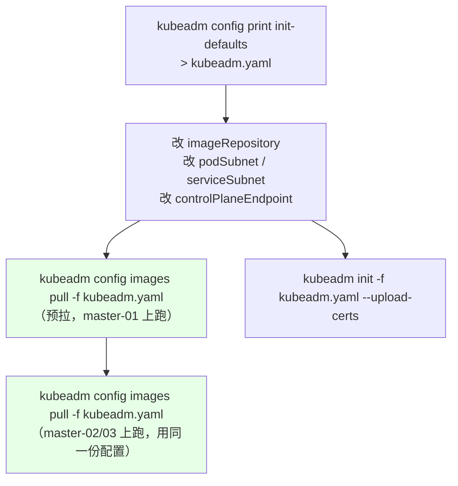
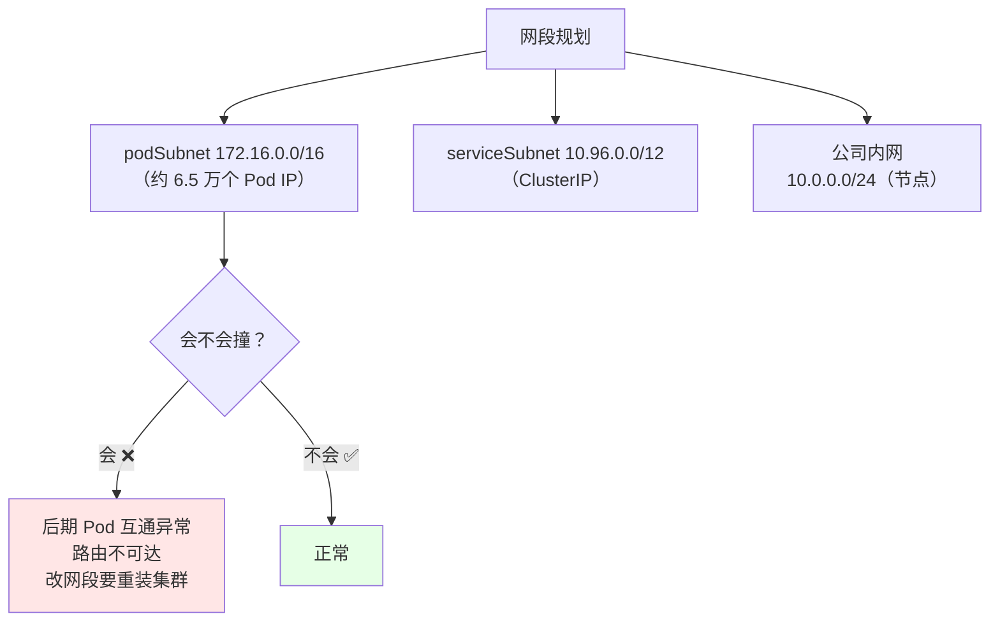
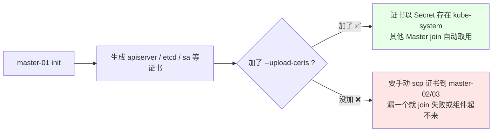
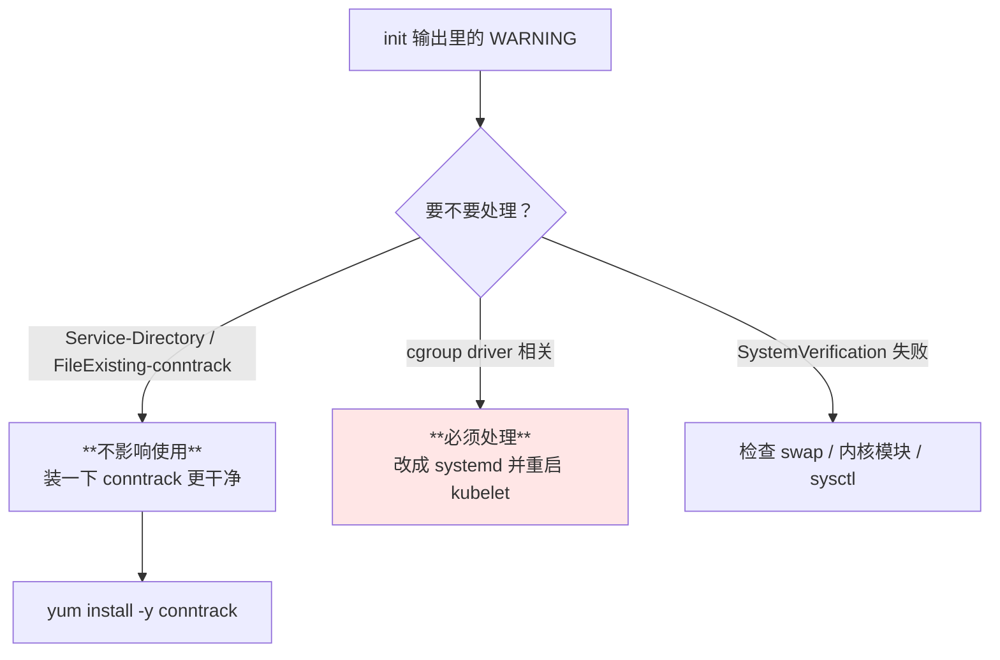
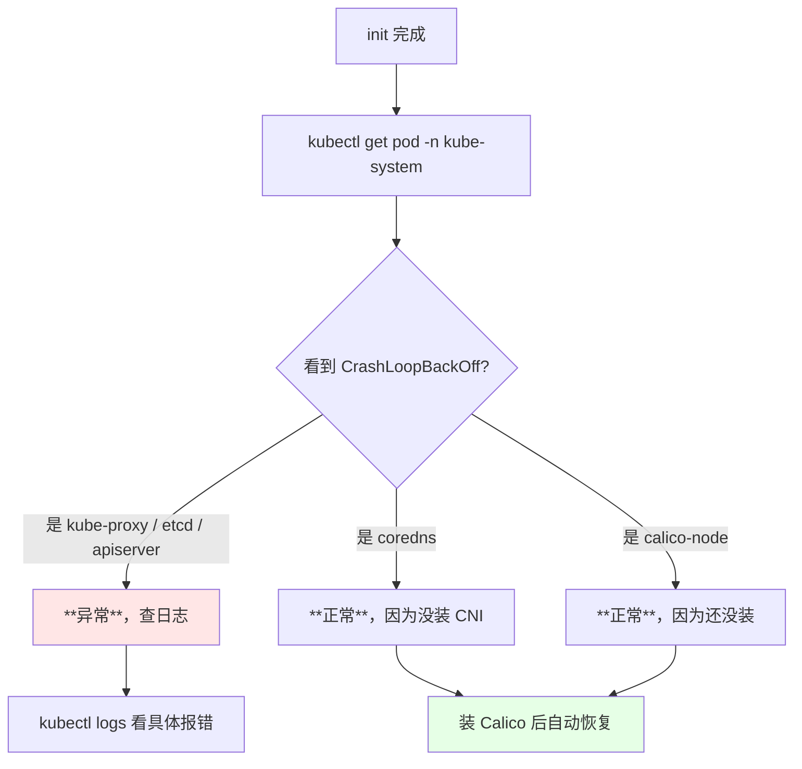
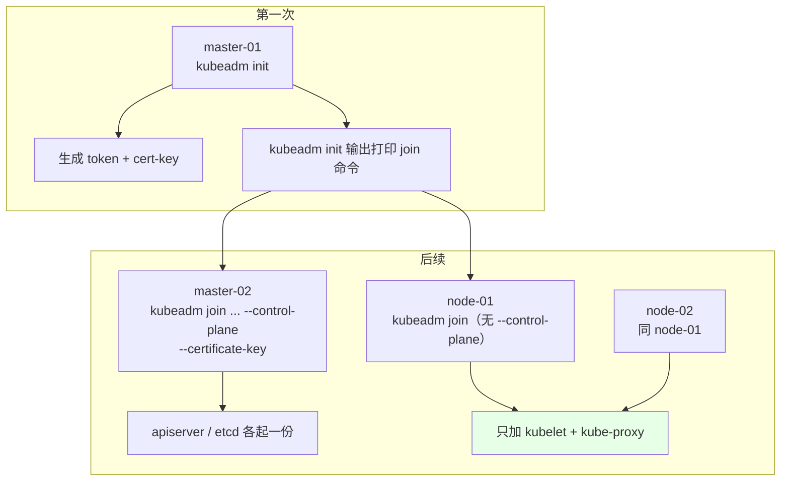
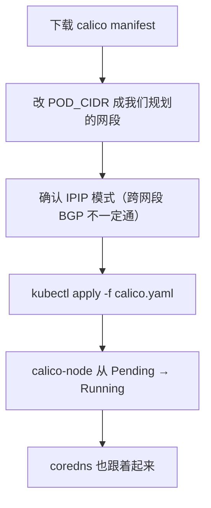
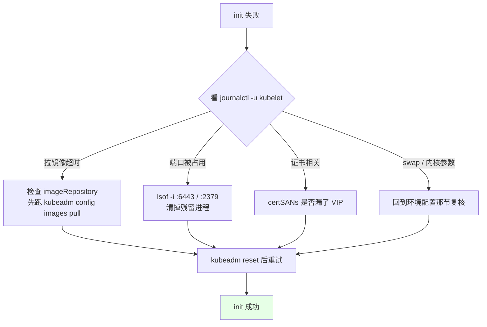

# Kubernetes 集群部署: kubeadm init 初始化高可用控制面与 Calico 网络插件安装

前面所有准备工作都是为了这三条命令：`init` → `join` → `apply CNI`。

结论先给：

- 初始化前**先用 `kubeadm config images pull` 把镜像预拉下来**，否则 `init` 会卡在拉镜像上十几分钟；
- **`--upload-certs` 必加**：加了之后其他 Master join 时会自动同步证书，不加就得手动拷证书，漏一个就 join 失败；
- **`--pod-subnet` 网段别和公司内网重叠**：Pod 网段需要的 IP 数量极大，跟公司网段撞了是后期最痛的坑；
- **`kube-system` 里有 Pod 处于 Pending/C CrashLoopBackOff 是正常的** —— 没装 CNI 时 coredns 必然起不来，装完 CNI 就好了。

## 纲要
- 初始化前的配置文件与镜像预拉取
- kubeadm.yaml 关键字段
- kubeadm init 执行与常见告警
- 配置 kubectl 管理员凭证
- 其他 Master 与 Node 的 join
- 安装 Calico 网络插件
- 初始化失败的处理

本次涉及的目录结构（初始化产出的关键文件）：

```text
├── kubeadm-config.yaml     # controlPlaneEndpoint 指向 VIP
├── /etc/kubernetes/
│   ├── admin.conf          # kubectl 用的 kubeconfig
│   ├── pki/                # CA 与各组件证书
│   └── manifests/          # 静态 Pod 清单
└── cni/
    └── calico.yaml         # CIDR 必须与 --pod-network-cidr 一致
```


## 初始化前的配置文件与镜像预拉取

`kubeadm init` 默认从 `k8s.gcr.io` 拉镜像，国内拉不动；而且拉镜像这一步很慢，`init` 期间会一直卡着。

正确做法：**先用配置文件把镜像仓库改掉，把镜像预先拉到本地**。



配置文件**只在初始化那台（master-01）和「用来预拉镜像」的那几台用得到**，Node 完全不需要；其他 Master 用同一份配置只是为了提前把镜像准备好，缩短自己的 join 时间。

```bash
# 导出默认配置
kubeadm config print init-defaults > kubeadm.yaml
```

## kubeadm.yaml 关键字段

```yaml
apiVersion: kubeadm.k8s.io/v1beta2
kind: InitConfiguration
localAPIEndpoint:
  advertiseAddress: 10.0.0.101      # 本机真实 IP，apiserver 对外宣告的地址
  bindPort: 6443
nodeRegistration:
  criSocket: /var/run/dockershim.sock
  name: master-01
---
apiVersion: kubeadm.k8s.io/v1beta2
kind: ClusterConfiguration
kubernetesVersion: v1.18.5
imageRepository: registry.aliyuncs.com/google_containers   # ★ 改：国内能拉
controlPlaneEndpoint: 10.0.0.100:6443                      # ★ 改：VIP，不是本机 IP
networking:
  podSubnet: 172.16.0.0/16                                 # ★ 改：Pod 网段
  serviceSubnet: 10.96.0.0/12                              # ★ 改：Service 网段
  dnsDomain: cluster.local
---
apiVersion: kubelet.config.k8s.io/v1beta1
kind: KubeletConfiguration
cgroupDriver: systemd                                      # ★ 与 Docker 侧对齐
---
apiVersion: kubeadm.k8s.io/v1beta2
kind: APIServer
certSANs:
  - 10.0.0.100                                             # ★ VIP 必须进证书 SAN
```

关键字段说明：

| 字段 | 作用 | 坑 |
| --- | --- | --- |
| `imageRepository` | 镜像仓库前缀 | 不改就是 `k8s.gcr.io`，国内直接超时 |
| `controlPlaneEndpoint` | 控制面入口 | **必须填 VIP**，填某台 Master 的 IP 等于白做高可用 |
| `podSubnet` | Pod IP 分配网段 | **不要和公司内网重叠**；Calico 要按它算 IPIP 池 |
| `serviceSubnet` | ClusterIP 网段 | 默认 10.96.0.0/12，也可按需改 |
| `advertiseAddress` | apiserver 宣告地址 | 一般填本机 IP |
| `certSANs` | 证书额外 SAN | 加了 VIP，否则用 VIP 访问会报证书不匹配 |
| `cgroupDriver` | kubelet cgroup 驱动 | 与 `docker info` 一致；不一致资源指标全错 |



**为什么 Pod 网段不能和公司内网重叠**：Pod IP 需要几万甚至十几万个地址，公司内网网段通常撑不住这么多，而且 VLAN/路由策略也不可能给你放这么宽。网段撞了后期几乎只能重装，所以这一步必须提前想清楚。

## kubeadm init 执行

```bash
# 先预拉镜像（这一步能省掉 init 时最长的等待）
kubeadm config images pull --config kubeadm.yaml

# 正式初始化
kubeadm init --config=kubeadm.yaml --upload-certs
```

`--upload-certs` 的作用：



初始化完成后输出类似：

```text
Your Kubernetes control-plane has initialized successfully!

To start using your cluster, you need to run kubectl as a regular user:

  mkdir -p $HOME/.kube
  sudo cp -i /etc/kubernetes/admin.conf $HOME/.kube/config
  sudo chown $(id -u):$(id -g) $HOME/.kube/config

You should now deploy the CNI network plugin to the cluster.

Then you can join any number of control-plane nodes by running:

  kubeadm join 10.0.0.100:6443 --token abcdef.0123456789abcdef \
    --discovery-token-ca-cert-hash sha256:xxxxxxxx \
    --control-plane --certificate-key yyyyyyyy

Then you can join any number of worker nodes by running:

  kubeadm join 10.0.0.100:6443 --token abcdef.0123456789abcdef \
    --discovery-token-ca-cert-hash sha256:xxxxxxxx
```

**输出的 token 和 certificate-key 一定要记下来**。`--control-plane` 那行是给其他 Master 的，Node 那行**不带**这个参数。丢了可以重新生成（见下节）。

### 常见告警（不是错误，别慌）

```bash
# 典型的两条：
# [WARNING Service-Directory]: kubelet 没装 service-node-allocator
# [WARNING FileExisting-conntrack]: 没有 conntrack 命令
```



```bash
# 顺手补上
yum install -y conntrack
```

### 配置 kubectl 管理员凭证

```bash
mkdir -p $HOME/.kube
cp -i /etc/kubernetes/admin.conf $HOME/.kube/config
chown $(id -u):$(id -g) $HOME/.kube/config

# 验证
kubectl get nodes
kubectl get pods -n kube-system
```

此时 `kube-system` 里会有 Pod 起不来 —— **这是正常的**：

| Pod | 状态 | 原因 |
| --- | --- | --- |
| `coredns-*` | `Pending` / `CrashLoopBackOff` | **没装 CNI，集群 DNS 无法解析自己的名字** |
| `kube-proxy-*` | `Running` | 正常 |
| `kube-apiserver` / `kube-controller-manager` / `kube-scheduler` | `Running` | 正常（master-01 上） |
| `calico-node-*` | `Pending` / `CrashLoopBackOff` | 还没装 |



判断标准：**Pod 名字里带 `coredns` 或 `calico` 的报错，都是因为没装网络插件，属预期**。

## 其他 Master 与 Node 的 join

```bash
# --- master-02 / master-03（多了 --control-plane 和 --certificate-key）---
kubeadm join 10.0.0.100:6443 --token abcdef.0123456789abcdef \
  --discovery-token-ca-cert-hash sha256:xxxxxxxx \
  --control-plane --certificate-key yyyyyyyy

# --- node-01 / node-02（不含 --control-plane）---
kubeadm join 10.0.0.100:6443 --token abcdef.0123456789abcdef \
  --discovery-token-ca-cert-hash sha256:xxxxxxxx

# --- 验证 ---
kubectl get nodes
kubectl get pods -n kube-system -o wide
```



如果 token 丢了：

```bash
# 在 master-01 上重新生成（node 用）
kubeadm token create --print-join-command

# 生成新的 certificate-key（Master join 用）
kubeadm init phase upload-certs --upload-certs --kubeconfig /etc/kubernetes/admin.conf
```

## 安装 Calico 网络插件

Calico 是 CNI 实现，装完 coredns 和 calico 才能起来。



```bash
# 1. 下载（版本按官方 requirements 选，如 3.15 支持 K8s 1.16/1.17/1.18）
curl -O https://docs.projectcalico.org/v3.15/manifests/calico.yaml

# 2. 改 Pod 网段（必须和 kubeadm.yaml 里 podSubnet 一致！）
sed -i 's#192\.168\.0\.0/16#172.16.0.0/16#g' calico.yaml

# 3. 确认 IPIP 模式（默认就是 IPIP，跨网段部署 BGP 模式不一定能通）
grep -n -A3 'CALICO_IPV4POOL_CIDR\|CALICO_IPV4POOL_IPIP' calico.yaml

# 4. 部署
kubectl apply -f calico.yaml

# 5. 观察
kubectl get pods -n kube-system -w
```

配置片段：

```yaml
- name: CALICO_IPV4POOL_CIDR
  value: "172.16.0.0/16"     # 与 kubeadm.yaml 的 podSubnet 一致
- name: CALICO_IPV4POOL_IPIP
  value: "Always"            # IPIP 模式，跨网段集群最稳
```

**IPIP vs BGP 怎么选**：

| 模式 | 适用 | 优点 | 缺点 |
| --- | --- | --- | --- |
| **IPIP（Always）** | 跨网段 / 跨机房 / 云上 | 不依赖 BGP 路由器，几乎必通 | 有少量隧道封装开销 |
| **BGP（none）** | 同二层网络、有 BGP 路由反射 | 无封装，性能最好 | 需要网络设备支持 BGP |

跨网段部署时 **BGP 模式不一定能支持**，所以默认用 IPIP 是最省事的选择。

## 初始化失败的处理

```bash
# 1. 看失败原因
journalctl -u kubelet -n 100 --no-pager
FAILED_POD=$(kubectl get pod -n kube-system --field-selector=status.phase!=Running -o jsonpath='{.items[0].metadata.name}')
kubectl logs -n kube-system "$FAILED_POD"

# 2. 清空重置（会删掉 etcd 数据，只能用于从未上过生产的集群）
kubeadm reset
# 如果是改过 hostname / 换过 IP：
#   kubeadm reset --force
systemctl stop kubelet docker
iptables -F && iptables -X && iptables -F -t nat && iptables -X -t nat

# 3. 改 kubeadm.yaml 后重来
kubeadm init --config=kubeadm.yaml --upload-certs
```



**`kubeadm reset` 会清空 etcd 数据**，所以只在「还没上过生产、没跑过业务」的节点上做。生产环境出问题不要 reset，要按前面 etcd 恢复那套流程走。

## API 速览

| 能力 | 命令 |
| --- | --- |
| 导出 init 默认配置 | `kubeadm config print init-defaults > kubeadm.yaml` |
| 预拉镜像 | `kubeadm config images pull --config kubeadm.yaml` |
| 初始化 | `kubeadm init --config kubeadm.yaml --upload-certs` |
| 初始化（纯命令行） | `kubeadm init --image-repository=... --pod-subnet=... --control-plane-endpoint=VIP:6443 --upload-certs` |
| 其他 Master 加入 | `kubeadm join ... --control-plane --certificate-key <key>` |
| Node 加入 | `kubeadm join ... ` （无 `--control-plane`） |
| 重新生成 node token | `kubeadm token create --print-join-command` |
| 重新生成 cert key | `kubeadm init phase upload-certs --upload-certs` |
| 重置集群 | `kubeadm reset` |
| 配 kubectl | `cp /etc/kubernetes/admin.conf ~/.kube/config` |
| 看 CNI 状态 | `kubectl get pod -n kube-system -o wide \| grep calico` |
| 看 Calico 网段 | `kubectl get pod -n kube-system -o yaml \| grep CALICO_IPV4POOL_CIDR` |

## Demo 示例

一个完整的**初始化 + join + 装 CNI** 全流程脚本，marster-01 跑第一半，其余节点跑第二半。

```bash
#!/usr/bin/env bash
# init-cluster.sh —— kubeadm init / join / 装 Calico
# 用法:
#   master-01: ./init-cluster.sh init      [配置文件 kubeadm.yaml]
#   其他节点:  ./init-cluster.sh join  <token> <ca-hash> [cert-key]
#             ./init-cluster.sh cni
set -euo pipefail

ACTION="${1:?用法: $0 init|join|cni ...}"
export PATH=/usr/local/bin:/usr/bin:/bin:$PATH

log() { printf '\n[kubeadm] %s\n' "$*"; }
die() { printf '\n[kubeadm] ERROR: %s\n' "$*" >&2; exit 1; }

case "$ACTION" in
  init)
    CONFIG="${2:-/root/kubeadm.yaml}"
    [ -f "$CONFIG" ] || die "缺少配置文件 $CONFIG"
    log "0. 预拉镜像（避免 init 卡在这里）"
    kubeadm config images pull --config "$CONFIG"

    log "1. 初始化控制面（--upload-certs 让后续 Master 自动同步证书）"
    kubeadm init --config "$CONFIG" --upload-certs 2>&1 | tee /tmp/init.log

    log "2. 保存 join 命令到文件（token 丢了可重查）"
    grep -E '^kubeadm join' /tmp/init.log > /tmp/join-cmd.txt
    cat /tmp/join-cmd.txt
    grep -i 'certificate-key' /tmp/init.log | tail -1 >> /tmp/join-cmd.txt

    log "3. 配置 kubectl admin"
    mkdir -p "$HOME/.kube"
    cp -i /etc/kubernetes/admin.conf "$HOME/.kube/config"
    chown "$(id -u):$(id -g)" "$HOME/.kube/config"

    log "4. 当前状态（coredns/calico 未就绪属正常）"
    kubectl get node
    kubectl get pod -n kube-system
# 下面命令中的变量按你的集群环境赋值后再执行
    # 执行前先给下面的占位变量赋值，如 NODE_NAME=node1，否则变量为空会导致命令行为不符合预期
    log "下一步: 其他节点跑 $0 join $TOKEN ${CA_HASH} [cert-key]"
    ;;

  join)
    TOKEN="$2"; CAHASH="$3"; CERTKEY="${4:-}"
    log "0. 预校验"
    curl -sk --connect-timeout 5 "https://10.0.0.100:6443/healthz" | grep -q ok \
      || die "连不上 VIP，检查 keepalived / haproxy / apiserver"
    [ -n "${TOKEN}" ] && [ -n "${CAHASH}" ] || die "token 与 ca-hash 都不能为空"

    if [ -n "$CERTKEY" ]; then
      log "1. 以控制面身份加入"
      kubeadm join 10.0.0.100:6443 --token "$TOKEN" \
        --discovery-token-ca-cert-hash "sha256:$CAHASH" \
        --control-plane --certificate-key "$CERTKEY"
    else
      log "1. 以 Worker 身份加入"
      kubeadm join 10.0.0.100:6443 --token "$TOKEN" \
        --discovery-token-ca-cert-hash "sha256:$CAHASH"
    fi

    log "2. 从 master-01 拷贝 admin.conf"
    mkdir -p "$HOME/.kube"
    scp master-01:/etc/kubernetes/admin.conf "$HOME/.kube/config" \
      && chown "$(id -u):$(id -g)" "$HOME/.kube/config" \
      && kubectl get node \
      || echo "  [WARN] 无免密，请在 master-01 上 ssh-copy-id 本节点后重跑"

    log "3. 下一步: $0 cni"
    ;;

  cni)
    log "1. 下载 Calico manifest（版本按官方 requirements 选）"
    [ -f calico.yaml ] || curl -O https://docs.projectcalico.org/v3.15/manifests/calico.yaml
    grep -q 'CALICO_IPV4POOL_CIDR' calico.yaml || die "calico.yaml 不含 CALICO_IPV4POOL_CIDR"

    log "2. 对齐 kubeadm.yaml 里的 podSubnet（172.16.0.0/16）"
    sed -i 's#192\.168\.0\.0/16#172.16.0.0/16#g' calico.yaml
    grep -A2 'CALICO_IPV4POOL_CIDR' calico.yaml | sed 's/^/  /'

    log "3. 部署并等待就绪"
    kubectl apply -f calico.yaml
    kubectl -n kube-system rollout status ds/calico-node --timeout=5m

    log "4. 全集群状态"
    kubectl get node -o wide
    kubectl get pod -A -o wide
    log "5. 校验 DNS"
    kubectl run dns-test --image=busybox:1.32 --rm -it --restart=Never -- \
      nslookup kubernetes 2>&1 | tail -5
    ;;

  *)
    die "未知动作: $ACTION（init / join / cni）"
    ;;
esac
```

## 总结

到这一步，集群就起来了：**init → join → apply CNI**，三条命令搞定一个高可用集群。

- **先预拉镜像再 init**：`kubeadm config images pull` 把最慢的一段提前做掉，init 会快很多。
- **配置文件里四个必改项**：`imageRepository`（国内能拉）、`controlPlaneEndpoint`（填 VIP）、`podSubnet`（别撞公司内网）、`certSANs`（VIP 要进证书）。
- **`--upload-certs` 必加**：其他 Master 的证书自动同步，不加就得手动 scp，漏一个 join 就卡住。
- **coredns / calico 起不来是预期的**：没装 CNI，它们必然 Pending，装完 Calico 就都好了。**只有 kube-proxy / etcd / apiserver 报错才算真故障**。
- **Calico 的 `CALICO_IPV4POOL_CIDR` 必须和 `podSubnet` 一致**；跨网段集群用 IPIP 模式，别默认上 BGP。

