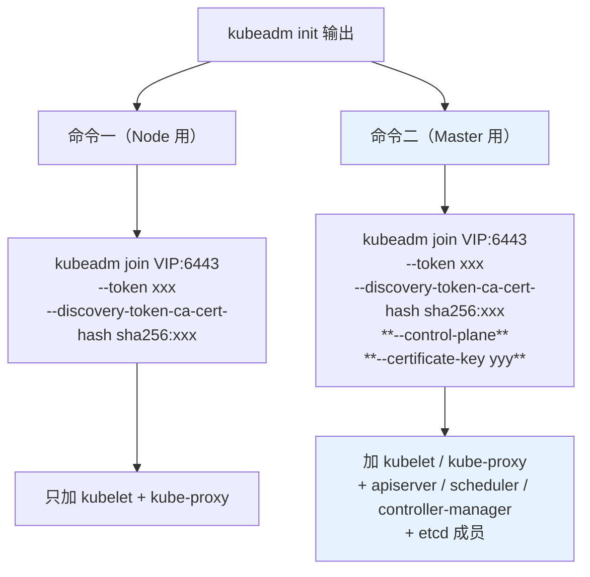
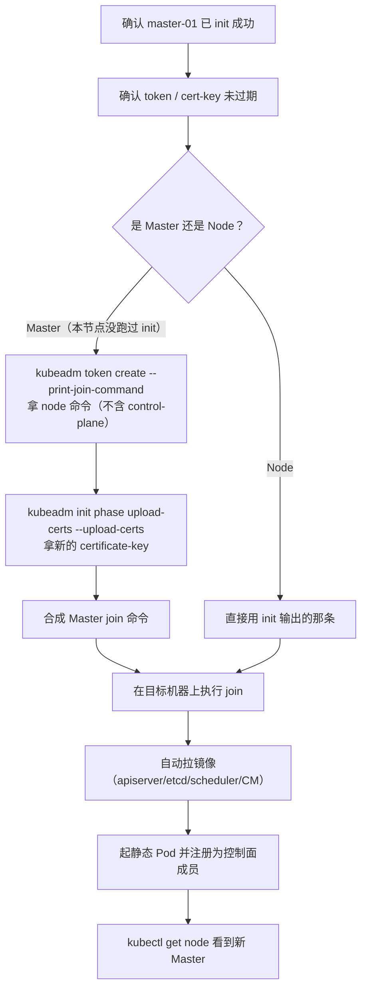
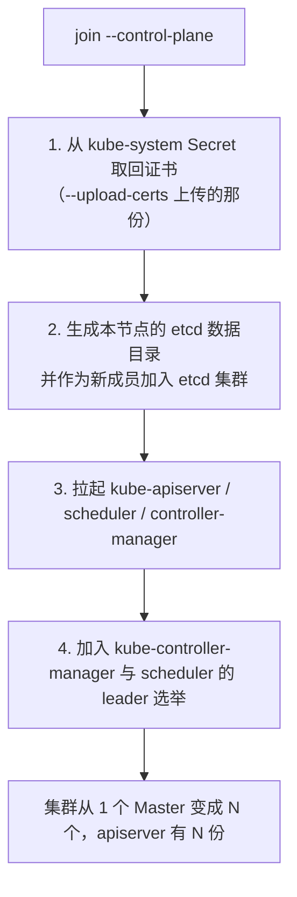
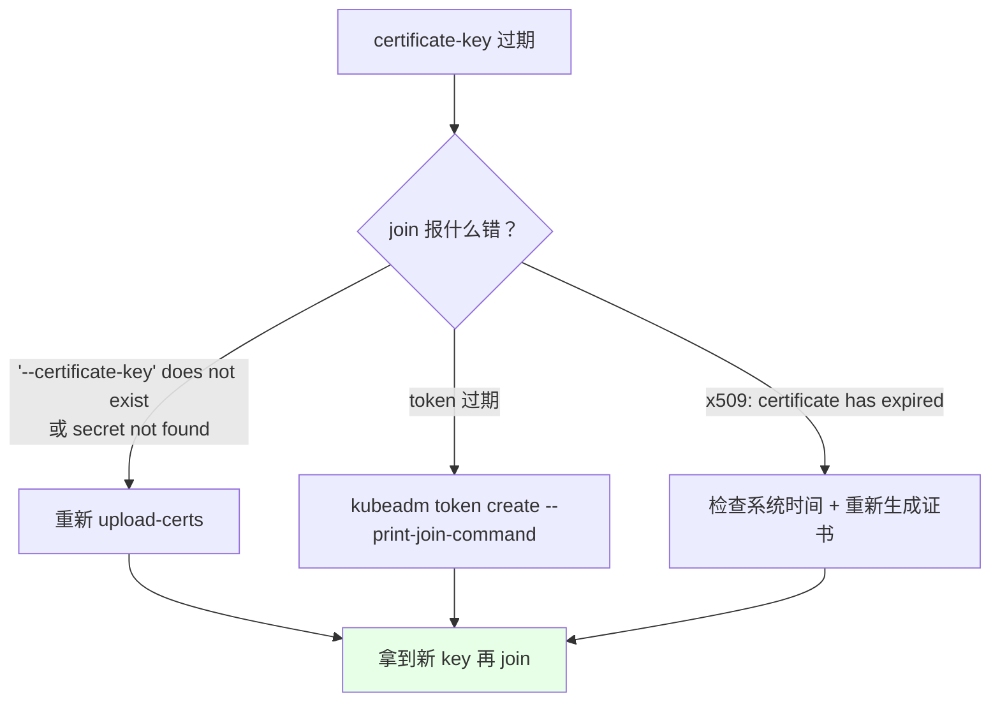
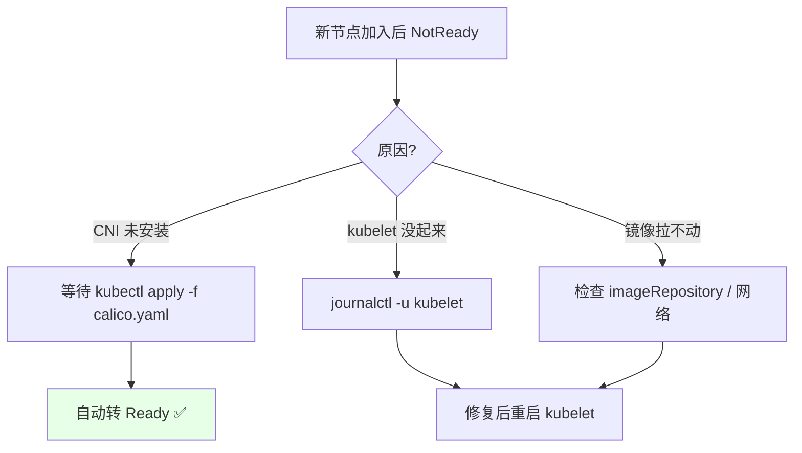
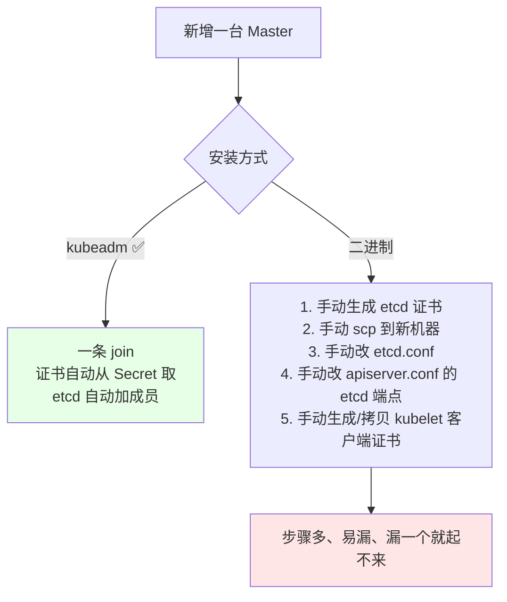

# Kubernetes 集群部署: 高可用 Master 扩容与 token 过期后的 join 处理

一条 `kubeadm join` 就能把新 Master 拉进高可用集群，前提是**你手上的 token 和 certificate-key 还没过期**。

结论先给：

- `kubeadm init` 会打印**两条** join 命令：一条带 `--control-plane --certificate-key`（给 Master），一条只有 token（给 Node）；
- **bootstrap token 默认 24 小时过期**，certificate-key 更短（约 2 小时）；
- 过期了不用慌：`kubeadm token create --print-join-command` 重发 Node 命令，`kubeadm init phase upload-certs --upload-certs` 重发 Master 的证书 key；
- 新 Master join 完**会自动拉 apiserver / etcd / scheduler / controller-manager 镜像**，第一次会慢，属正常。

## 纲要
- 两条 join 命令的差异
- bootstrap token 的存放与过期时间查看
- Master 扩容的完整流程
- certificate-key 过期与重新生成
- 扩容后的验证与常见问题

本次涉及的目录结构（控制平面扩容的凭证结构）：

```text
├── 加入凭据
│   ├── token                # kubeadm token create，默认 24h 过期
│   └── certificate-key      # upload-certs 生成，2h 内有效
├── 证书分发
│   ├── 自动：--upload-certs
│   └── 手动：拷贝 pki 下 CA 与控制平面证书
└── 加入命令
    └── kubeadm join <VIP>:6443 --control-plane
```


## 两条 join 命令的差异



差别只有两处：**`--control-plane`** 和 **`--certificate-key`**。

```text
kubeadm init 结束时打印的模板
├─ 给 Node:  kubeadm join 10.0.0.100:6443 --token <t> --discovery-token-ca-cert-hash sha256:<h>
└─ 给 Master: kubeadm join 10.0.0.100:6443 --token <t> --discovery-token-ca-cert-hash sha256:<h>
                 --control-plane --certificate-key <key>
```

## bootstrap token 存在哪、什么时候过期

init 之后，token 作为 Secret 存在 `kube-system` 里：

```bash
kubectl -n kube-system get secret | grep bootstrap
# bootstrap-token-abcdef      kubernetes.io/bootstrap-token   ...

kubectl -n kube-system get secret bootstrap-token-abcdef -o yaml
```

这个 Secret 里有个叫 `expiration` 的字段，**内容是 base64 编码**，解码就能看到过期时间：

```bash
kubectl -n kube-system get secret bootstrap-token-abcdef \
  -o jsonpath='{.data.expiration}' | base64 -d | xargs -I{} date -d @{}
# 2020-07-07 11:03:21 +0800
```


也可以直接看集群友好一点的写法：

```bash
kubectl -n kube-system get secret bootstrap-token-abcdef \
  -o jsonpath='{.metadata.name}{"\t"}{.data.expiration}{"\n"}' | while read n e; do
    echo "$n 过期于: $(echo $e | base64 -d | xargs -I{} date '+%F %T')"
  done
```

**默认有效期 24 小时**，所以演示环境隔几天再扩容就会撞上过期 —— 这不是你操作错了，是设计如此。

## Master 扩容的完整流程



完整命令：

```bash
# ---- 在 master-02 上（先确认能连上 VIP，否则 join 会卡在 discovery）----
curl -sk https://10.0.0.100:6443/version

# 1. 生成 Node 用的 join 命令（顺带看过期时间）
kubeadm token create --print-join-command
# kubeadm join 10.0.0.100:6443 --token xxxxxx.yyyyyyyy --discovery-token-ca-cert-hash sha256:zzzz

# 2. 生成新的 certificate-key（Master 用）
kubeadm init phase upload-certs --upload-certs \
  --kubeconfig /etc/kubernetes/admin.conf
# 输出会打印 certificate-key: <key>

# 3. 合成 Master join 命令并执行
kubeadm join 10.0.0.100:6443 \
  --token xxxxxx.yyyyyyyy \
  --discovery-token-ca-cert-hash sha256:zzzz \
  --control-plane \
  --certificate-key "$CERT_KEY"

# 4. 拷贝 admin.conf（否则本节点 kubectl 用不了）
mkdir -p $HOME/.kube
scp master-01:/etc/kubernetes/admin.conf $HOME/.kube/config
chown $(id -u):$(id -g) $HOME/.kube/config
```

**`--control-plane` 做了什么**：



**如果 init 时没加 `--upload-certs`**：join 会直接失败在拉证书那一步，这时只能手动 scp 证书过去 —— 漏一个文件就起不来，这是最容易出错的场景。

## certificate-key 过期与重新生成

```bash
# 查当前 certificate-key 的 Secret（init 时上传的那份）
kubectl -n kube-system get secret | grep -i 'cert-sans\|csr\|kubeadm'

# 重新生成一个（在任一已 init 的 Master 上）
kubeadm init phase upload-certs --upload-certs \
  --kubeconfig /etc/kubernetes/admin.conf
```



| 命令 | 有效期 | 用途 |
| --- | --- | --- |
| `kubeadm token create --print-join-command` | 默认 24h | 生成/重发 **Node** join 命令 |
| `kubeadm init phase upload-certs --upload-certs` | 约 2h（受控制面证书有效期约束） | 生成/重发 Master 的 **certificate-key** |

记不住参数就查帮助：

```bash
kubeadm token create --help
kubeadm init phase upload-certs --help
```

## 扩容后的验证

```bash
# 1. 节点进来
kubectl get node
# NAME         STATUS     ROLES    AGE   VERSION
# master-01    NotReady   master   10m   v1.18.5
# master-02    NotReady   master   30s   v1.18.5
# master-03    NotReady   master   20s   v1.18.5

# 2. 控制面组件在新 Master 上也起来了
kubectl get pod -n kube-system -o wide | grep -E 'apiserver|etcd|scheduler|controller-manager'

# 3. etcd 成员数变 3
export ETCDCTL_API=3
etcdctl --endpoints=https://127.0.0.1:2379 --cacert=... --cert=... --key=... \
  member list -w table

# 4. VIP 仍然可达
curl -sk https://10.0.0.100:6443/healthz    # ok
```

节点显示 `NotReady` 是**正常的** —— CNI（Calico）还没装，kubelet 上报不了就绪状态。装完 Calico 几分钟内自动转 Ready。



## 版本一致性要求

`kubeadm join` 会**严格校验版本**：新节点上的 `kubeadm` / `kubelet` 版本必须与控制面一致，否则直接拒绝。

| 场景 | 结果 |
| --- | --- |
| 新 Node kubelet 版本 == 控制面 | ✅ join 成功 |
| 新 Node kubelet 版本 != 控制面 | ❌ `error: kubelet version "v1.19.0" does not match control plane version` |
| 想混版本先扩容再升级 | 需先 `yum upgrade -y kubelet kubeadm` 到一致版本 |

```bash
# join 前先自检
kubeadm version
kubelet --version
# 在 master-01 上看控制面版本
kubectl version --short
```

这也是 **Node 扩容必须在 Master 升级之后** 的又一层原因。

## 与二进制安装的对比

kubeadm 扩容最大的价值就是**不用碰证书**：



## Demo 示例

一个**扩容前置检查 + 生成 join 命令 + 执行**的脚本，自动判断是否过期。

```bash
#!/usr/bin/env bash
# expand-master.sh —— 新增 Master / Node 加入集群（自动处理过期）
# 用法: ./expand-master.sh master|node [目标节点名]
set -euo pipefail

ROLE="${1:?用法: $0 master|node [node-name]}"
TARGET="${2:-}"
VIP="${VIP:-10.0.0.100}"
ADMIN_CONF="${ADMIN_CONF:-/etc/kubernetes/admin.conf}"

log() { printf '\n[expand] %s\n' "$*"; }
die() { printf '\n[expand] ERROR: %s\n' "$*" >&2; exit 1; }

log "0. 前置检查"
[ -f "$ADMIN_CONF" ] || die "本机不是已初始化的 Master（缺 $ADMIN_CONF）"
export KUBECONFIG="$ADMIN_CONF"
kubectl version --short 2>/dev/null | head -3 | sed 's/^/  /'
curl -sk --connect-timeout 5 -m 8 "https://${VIP}:6443/version" >/dev/null \
  || die "连不上 VIP ${VIP}，检查 keepalived / haproxy / apiserver"

log "1. 现有节点与控制面成员"
kubectl get node | sed 's/^/  /'
kubectl get pod -n kube-system -o wide 2>/dev/null \
  | grep -E "kube-apiserver|etcd-" | sed 's/^/  /'

log "2. 检查 bootstrap token 是否过期"
TOKEN_NAME=$(kubectl -n kube-system get secret 2>/dev/null \
  | awk '/bootstrap-token-/{print $1; exit}')
if [ -z "$TOKEN_NAME" ]; then
  log "  没有 bootstrap token（可能已过期或被清理），后面会重新生成"
else
  EXP=$(kubectl -n kube-system get secret "$TOKEN_NAME" -o jsonpath='{.data.expiration}' 2>/dev/null)
  if [ -n "$EXP" ]; then
    EXP_TS=$(echo "$EXP" | base64 -d 2>/dev/null)
    EXP_DATE=$(date -d "@${EXP_TS}" '+%F %T' 2>/dev/null || echo "$EXP_TS")
    NOW=$(date +%s)
    if [ "$EXP_TS" -gt "$NOW" ]; then
      echo "  [OK]   ${TOKEN_NAME} 有效至 ${EXP_DATE}"
    else
      echo "  [EXPIRED] ${TOKEN_NAME} 已于 ${EXP_DATE} 过期，将重新生成"
    fi
  fi
fi

log "3. 生成 join 命令"
if [ "$ROLE" = "node" ]; then
  CMD=$(kubeadm token create --print-join-command)
  log "4. Node join（无 --control-plane）"
  echo "  $CMD"
  [ -n "$TARGET" ] && log "  在 ${TARGET} 上执行上面这条命令"
else
  CMD=$(kubeadm token create --print-join-command)
  log "4. 重新上传 certificate-key（Master 用）"
  KEY_OUT=$(kubeadm init phase upload-certs --upload-certs \
              --kubeconfig "$ADMIN_CONF" 2>&1 || true)
  echo "$KEY_OUT" | grep -iE 'certificate-key' | sed 's/^/  /'
  KEY=$(echo "$KEY_OUT" | grep -oE '[a-f0-9]{64}' | tail -1)
  [ -n "$KEY" ] || die "没拿到 certificate-key，看上面报错"
  FULL="$CMD --control-plane --certificate-key ${KEY}"
  log "5. Master join（带 --control-plane）"
  echo "  $FULL"
  [ -n "$TARGET" ] && log "  在 ${TARGET} 上执行上面这条命令"
fi

log "6. 执行提示"
cat <<'TIP'
  执行前确认:
    1) 目标机器 kubeadm/kubelet 版本与控制面一致
    2) 目标机器 /etc/hosts 含全部节点与 VIP
    3) 目标机器已装 containerd.io 且 swap 已关
  执行后:
# 下面命令中的变量按你的集群环境赋值后再执行
    mkdir -p ~/.kube && scp $NODE:/etc/kubernetes/admin.conf ~/.kube/config
    kubectl get node    # 看到新节点
    kubectl get pod -n kube-system -o wide  # 控制面组件在新节点上也 Running
TIP
```

## 总结

Master 扩容是 kubeadm 最有价值的能力之一：**不碰证书、不手动改 etcd**，一条命令搞定。

- **`--control-plane` 和 `--certificate-key` 是 Master join 与 Node join 的唯一差别**；Node 那两条参数都不能有。
- **token 默认 24 小时过期**：过期后 `kubeadm token create --print-join-command` 重发；Master 还要额外 `kubeadm init phase upload-certs --upload-certs` 拿新的 certificate-key。
- **init 时加了 `--upload-certs`，join 才能自动取证书**；没加就只能手动 scp，这是 join 失败的头号原因。
- **新节点 kubelet 版本必须与控制面一致**，否则 join 直接被拒 —— 所以扩容永远排在升级之后。
- join 完节点 `NotReady` 别急：那是 CNI 还没装，装完 Calico 会自动转 Ready。

