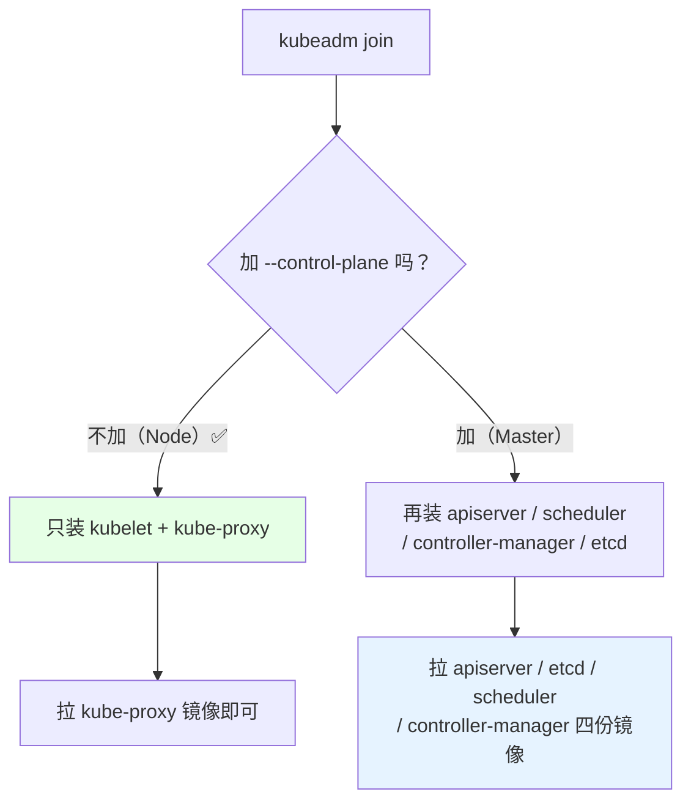
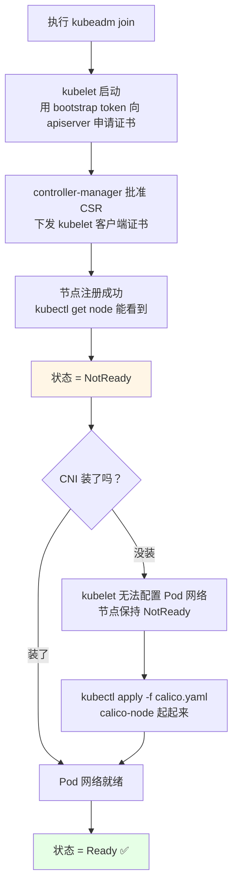
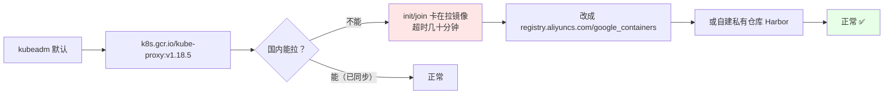
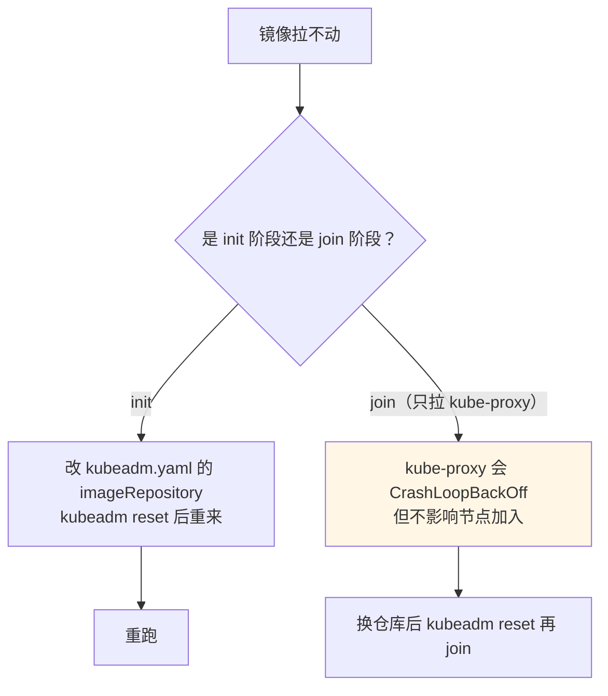
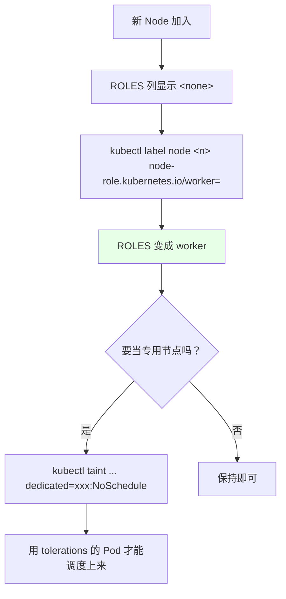

# Kubernetes 集群部署: Node 节点加入集群后的配置与就绪判定

Node 的 join 比 Master 简单得多：没有 `--control-plane`，没有 `--certificate-key`，只多了一条命令。但**加入完节点还是 NotReady** —— 这一点必须知道原因，否则会以为自己装错了。

结论先给：

- Node join 只需 `kubeadm join <VIP>:6443 --token ... --discovery-token-ca-cert-hash ...`，不带任何控制面参数；
- 加入后 `NotReady` 是**预期状态**，唯一原因通常是 **CNI 没装**（镜像还没拉下来）；
- join 会拉 `k8s.gcr.io` 的默认镜像，国内常失败 —— 镜像仓库要提前改成阿里云 / 自建仓库并同步好版本。

## 纲要
- Node join 与 Master join 的差别
- 加入后的状态机：从 NotReady 到 Ready
- 镜像仓库与版本同步问题
- Node 侧的补充配置（标签、不可调度、污点）
- 加入后验证

本次涉及的目录结构（Node 侧落盘与就绪判定路径）：

```text
├── /etc/kubernetes/
│   ├── kubelet.conf         # join 后由 kubeadm 写入
│   └── pki/ca.crt           # 集群 CA
├── /var/lib/kubelet/        # 数据目录，含 config.yaml
└── 就绪判定
    ├── kubectl get node     # STATUS 变 Ready
    ├── systemctl status kubelet
    └── 检查污点与 CNI 是否就绪
```


## Node join 与 Master join 的差别



没有别的差别了。命令长这样：

```bash
kubeadm join 10.0.0.100:6443 \
  --token xxxxxx.yyyyyyyy \
  --discovery-token-ca-cert-hash sha256:zzzz
```

**Node 上不需要 kubeadm.yaml 配置文件**，也不需要 admin.conf —— 它只是 kubelet 的一个成员。

## 加入后的状态机



为什么没 CNI 就是 NotReady：

- kubelet 启动时会等 CNI 插件就绪（`/etc/cni/net.d/` 下要有配置）；
- 没有 CNI，Pod 无法拿到 IP，节点上的 Pod 网络不通；
- kubelet 的节点状态上报因此判定节点未就绪。

```bash
# join 后观察（等 CNI 装完才转 Ready）
kubectl get node -w
# NAME      STATUS     ROLES    AGE   VERSION
# node-01   NotReady   <none>   10s   v1.18.5
# node-01   Ready      <none>   2m    v1.18.5
```

| 阶段 | 表现 | 是否正常 |
| --- | --- | --- |
| join 完 10 秒内 | `NotReady` | ✅ 正常 |
| join 后几分钟 | `Ready` | ✅ CNI 装完后自动 |
| join 后一直 NotReady | 状态卡住 | ❌ 查 kubelet 日志 / CNI 镜像 |
| join 后直接 ` approved / failed` | CSR 没批 | ❌ 查 controller-manager |

```bash
# 排查顺序
journalctl -u kubelet -n 100 --no-pager
kubectl get nodes
kubectl describe node "$NODE" | tail -20

# 看 kubelet 是不是在等 CNI
journalctl -u kubelet | grep -i 'cni\|network\|notready'
```

## 镜像仓库与版本同步问题

kubeadm 拉镜像时用的默认仓库是 `k8s.gcr.io`，国内经常超时。



**版本同步慢是常态**：Cloudflare 之类做镜像同步的官方源（如某加速器的 k8s 镜像代理）同步新版本往往要几天。课程里装 1.18.5 时阿里云仓库还没同步到，只能临时换源。

```bash
# 姿势一：init / join 时改仓库（Master 用）
kubeadm init --image-repository registry.aliyuncs.com/google_containers ...

# 姿势二：写进 kubeadm.yaml（推荐）
imageRepository: registry.aliyuncs.com/google_containers

# 姿势三：kube-proxy 已经跑起来之后才发现镜像不对，--pod-network-mode 之类改动需要重拉
#         最简单是重置 Node 再 join
kubeadm reset
rm -f /etc/cni/net.d/*  # 如果有残留
kubeadm join ...
```



判断是不是镜像问题：

```bash
kubectl get pod -n kube-system | grep kube-proxy
PROXY_POD=$(kubectl get pod -n kube-system -l k8s-app=kube-proxy -o jsonpath='{.items[0].metadata.name}')
kubectl logs -n kube-system "$PROXY_POD" | grep -i 'image\|pull\|Error'

# 直接在 Node 上手试
docker pull registry.aliyuncs.com/google_containers/kube-proxy:v1.18.5
```

## Node 侧的补充配置

join 完的 Node 默认只有 `kubelet` + `kube-proxy`，ROLES 列是空的（`<none>`）。常见的补充动作：

```bash
# 1. 打节点标签（方便调度器选择 / 给 Node 分类）
kubectl label node node-01 node-role.kubernetes.io/worker=
kubectl label node node-01 disk=ssd

# 2. 设为不可调度（维护前用，只挡新 Pod，不动已有的）
kubectl cordon node-01
kubectl uncordon node-01

# 3. 增加一个污点（让某类 Pod 不往这台跑）
kubectl taint nodes node-01 dedicated=game:NoSchedule
kubectl taint nodes node-01 dedicated-      # 去掉

# 4. 看节点资源
kubectl describe node node-01 | grep -A5 'Addresses\|Allocated resources'
```



Master 节点默认带 `node-role.kubernetes.io/master:NoSchedule` 污点，所以**业务 Pod 不会自动跑到 Master 上**。演示环境想让 Master 也跑业务：

```bash
# 去掉 Master 的 NoSchedule 污点（仅演示用）
kubectl taint nodes master-01 node-role.kubernetes.io/master:NoSchedule-
# 或给 Master 打 worker 标签当 Node 用
kubectl label node master-01 node-role.kubernetes.io/worker=
```

## 加入后验证

```bash
# 1. 节点进来且 Ready
kubectl get node -o wide

# 2. kube-proxy 在所有节点 Running
kubectl get pod -n kube-system -o wide | grep kube-proxy
# 期望 5 行（3 master + 2 node）

# 3. 业务 Pod 能调度到新节点
kubectl create deploy test-nginx --image=nginx:1.19 --replicas=3
kubectl get pod -o wide
kubectl scale deploy test-nginx --replicas=5     # 触发调度
kubectl delete deploy test-nginx

# 4. 网络通（Pod 跨节点访问）
kubectl exec "$POD_A" -- ping -c 2 "$POD_IP_B"
```

## Demo 示例

一个 **Node 加入 + 就绪等待 + 验收** 脚本，join 完自动等 Ready 并给出排查指引。

```bash
#!/usr/bin/env bash
# join-node.sh —— Node 加入集群并等待就绪
# 用法: ./join-node.sh $TOKEN_ARG $CA_HASH_ARG
set -euo pipefail

TOKEN="${1:?用法: $0 TOKEN_ARG CA_HASH_ARG}"
CAHASH="${2:?用法: $0 TOKEN_ARG CA_HASH_ARG}"
VIP="${VIP:-10.0.0.100}"

log() { printf '\n[join-node] %s\n' "$*"; }
die() { printf '\n[join-node] ERROR: %s\n' "$*" >&2; exit 1; }

log "0. 前置连通性"
curl -sk --connect-timeout 5 -m 8 "https://${VIP}:6443/healthz" | grep -q ok \
  || die "连不上 VIP ${VIP}"
echo "  VIP 可达"

[ -f /etc/containerd/config.toml ] || [ -f /etc/docker/daemon.json ] \
  || echo "  [WARN] 未见运行时配置，确认 imageRepository 已换成国内源"

log "1. 清掉可能残留的状态（重复 join 时必需）"
kubeadm reset --force >/dev/null 2>&1 || echo "  无残留状态，跳过"
systemctl stop kubelet >/dev/null 2>&1 || true
ip link del flannel.1 2>/dev/null || true
rm -rf /var/lib/cni 2>/dev/null || true

log "2. 执行 join"
kubeadm join "${VIP}:6443" \
  --token "${TOKEN}" \
  --discovery-token-ca-cert-hash "sha256:${CAHASH}" 2>&1 | tee /tmp/join.log

log "3. 等待节点注册（最多 120s）"
SELF=$(hostname -s)
for i in $(seq 1 24); do
  if kubectl get node "$SELF" >/dev/null 2>&1; then
    echo "  第 ${i} 次: 节点 ${SELF} 已注册"
    break
  fi
  sleep 5
done
kubectl get node "$SELF" 2>/dev/null || die "节点未注册，看 /tmp/join.log"

log "4. 等待状态变为 Ready（CNI 装完前会一直是 NotReady，属正常）"
for i in $(seq 1 30); do
  ST=$(kubectl get node "$SELF" -o custom-columns=:status.conditions 2>/dev/null | tail -n +2 | tr -d ' ')
  [ "$ST" = "Ready" ] && { echo "  第 ${i} 次: 节点 Ready ✅"; break; }
  sleep 10
done
kubectl get node -o wide

log "5. kube-proxy 状态"
kubectl get pod -n kube-system -o wide | grep kube-proxy | awk '{print "   ", $1, $3, $7}'

log "6. 验收"
PODS=$(kubectl get pod -n kube-system -o wide | grep -c kube-proxy)
echo "  kube-proxy 实例数: ${PODS}（应等于节点数）"
ST=$(kubectl get node "$SELF" -o custom-columns=:status.conditions 2>/dev/null | tail -n +2 | tr -d ' ')
if [ "$ST" = "Ready" ]; then
  echo "  [OK] 节点就绪"
else
  echo "  [WARN] 仍为 ${ST:-未知}"
  cat <<'TIP'
排查顺序:
  1) 还没装 CNI → kubectl apply -f calico.yaml（这是最常见原因）
  2) kubelet 日志: journalctl -u kubelet -n 100 --no-pager
  3) 镜像拉不动: docker pull $REGISTRY/kube-proxy:v1.18.5
  4) 证书问题: kubectl get csr
  5) 内核参数: sysctl -p /etc/sysctl.d/k8s.conf
TIP
fi

log "可选补充配置"
cat <<'TIP'
  kubectl label node ${SELF} node-role.kubernetes.io/worker=
  kubectl cordon ${SELF}      # 维护前挡新 Pod
  kubectl uncordon ${SELF}    # 恢复
  kubectl taint nodes ${SELF} dedicated=$NODE_TYPE:NoSchedule   # 专用节点
TIP
```

## 总结

Node 加入是整条安装链路里最简单的一步，但**验收不能只看 join 有没有回显成功**。

- **Node join 不带任何控制面参数**：`--control-plane` / `--certificate-key` 只给 Master 用。
- **`NotReady` 是 join 后的正常中间态**：没装 CNI，kubelet 无法让节点就绪；装完 Calico 自动转 Ready。
- **镜像仓库必须提前换**：`k8s.gcr.io` 在国内拉不动，换阿里云 / 私有仓库，并注意新版本同步往往滞后几天。
- **kube-proxy 的实例数 == 节点数**，这是「所有节点都加进来了」最直接的判据。
- join 前先 `kubeadm reset` 清残留（重复 join / 改过镜像仓库时必做），否则旧的 cni 目录和 kubeadm 状态会互相打架。

