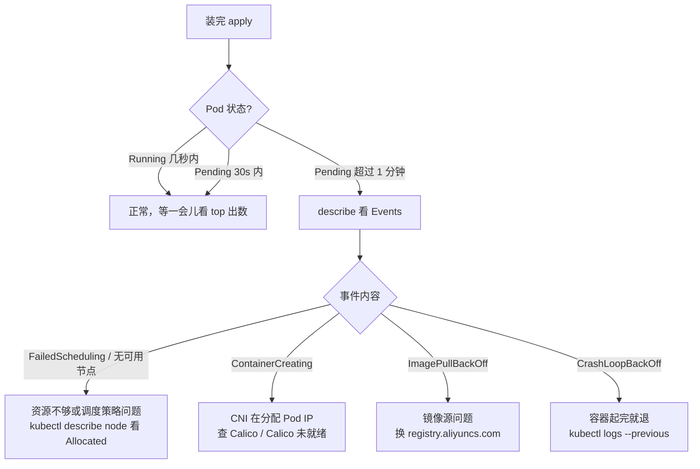
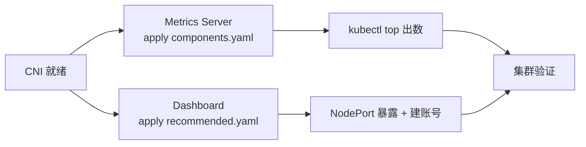

# Kubernetes 集群部署: Metrics Server 与 Dashboard 的安装

集群控制面跑起来之后，还剩两个"让人舒服"的组件：Metrics Server 和 Dashboard。一个负责把 CPU / 内存使用率喂给 `kubectl top` 和 HPA，一个负责给个图形界面看资源。这两个都不影响集群的可用性，但缺了它们，后面所有"看资源"的动作都得靠 `describe` 硬读。

这一篇讲两者的安装顺序、镜像源问题，以及刚装完 Pod 一直 `Pending` 到底卡在哪。

## 纲要
- 为什么现在只用 Metrics Server
- 安装 Metrics Server：从镜像仓库取 yaml 再 apply
- 镜像拉不下来的处理
- 安装 Dashboard：一条 apply 装最新版
- 装完 Pod 一直 Pending 怎么看
- 常见状态速查
- 安装顺序总览

本次涉及的目录结构（两个组件的部署清单）：

```text
├── metrics-server/
│   ├── components.yaml      # 需追加 --kubelet-insecure-tls
│   └── apiservice.yaml      # v1beta1.metrics.k8s.io 注册
└── dashboard/
    ├── recommended.yaml     # 官方清单
    └── admin-sa.yaml        # 取登录 token
```


## 为什么现在只用 Metrics Server

Metrics Server 的作用：**把集群里 Node 和 Pod 的 CPU、内存、磁盘、网络使用率，通过 `metrics.k8s.io` 这个 API 暴露出来**。

历史上还有一套更老的方案（Heapster + kube-state-metrics），现在已经**废弃**。两个版本的 Dashboard 分野也很清楚：

| Dashboard 版本 | 数据来源 | 状态 |
| --- | --- | --- |
| v1.x | Heapster 采集 | 已废弃 |
| v2.x | Metrics Server | 当前做法 |

所以这两年只要装 Metrics Server 就对了，不用再研究 Heapster 怎么配。

另一个大背景：现在 k8s 里推崇**一切皆容器**，所以 Metrics Server 和 Dashboard 都推荐以**容器（Deployment）方式部署**，而不是在宿主机上装二进制。这也是为什么整个安装过程只有 `kubectl apply`，没有 `yum install`。

## 安装 Metrics Server：从镜像仓库取 yaml 再 apply

Metrics Server 的 yaml 在 k8s 的仓库里有现成的。核心操作就三步：

```bash
# 1. 把 yaml 抓下来
kubectl apply -f https://github.com/kubernetes-sigs/metrics-server/releases/latest/download/components.yaml

# 国内环境更稳的写法：先下到本地再看一眼，确认镜像地址
curl -O https://github.com/kubernetes-sigs/metrics-server/releases/latest/download/components.yaml
grep -n "image:" components.yaml
```

镜像地址那一行在国内是高频踩点：

```yaml
# components.yaml 里长这样，注意默认指向 k8s.gcr.io
containers:
  - name: metrics-server
    image: k8s.gcr.io/metrics-server/metrics-server:v0.3.6
    imagePullPolicy: IfNotPresent
```

`k8s.gcr.io` 国内经常拉不动，两个处理办法：

**办法一：改镜像前缀（推荐）**，换成可访问的镜像源：

```bash
sed -i 's#k8s.gcr.io/metrics-server#registry.aliyuncs.com/google_containers/metrics-server#g' components.yaml
kubectl apply -f components.yaml
```

**办法二：自建镜像仓库并同步**：提前 `docker pull` → `docker tag` → `docker push` 到内网仓库，再把 yaml 里的前缀指向内网地址。

装完看状态：

```bash
kubectl get pod -n kube-system -l k8s-app=metrics-server
kubectl top node
```

顺利的话几秒后 `kubectl top` 就能出数。

## 镜像拉不下来的处理

`kubectl apply` 之后如果 Pod 一直 `ImagePullBackOff` / `ErrImagePull`，按这个顺序处理：

```bash
# 1. 看具体原因
kubectl describe pod -n kube-system -l k8s-app=metrics-server | tail -20
# 2. 确认镜像到底在不在
docker pull registry.aliyuncs.com/google_containers/metrics-server/metrics-server:v0.3.6
# 3. 在出问题的节点上确认（拉取是逐节点做的）
docker images | grep metrics-server
```

最常见的三个原因：

1. 镜像源没换，`k8s.gcr.io` 直连超时；
2. 换完源了，但**版本同步滞后** —— 新版 yaml 里写的是新版本号，镜像源还没推上去，此时把版本号钉在源上已有的版本；
3. 内网仓库没配 `insecure-registry`，需要 docker 的 `daemon.json` 加一段（k8s 1.18 时代用 Docker 作为运行时，这个配置还在用）。

## 安装 Dashboard：一条 apply 装最新版

Dashboard 的经历值得一提：v2.0.x 之前还是 RC（候选版），后来**正式 GA**。现在装就是一条命令。

```bash
# GitHub 上搜 kubernetes dashboard，在它的 docs 里的 Install 页面能找到最新版的安装命令
kubectl apply -f https://raw.githubusercontent.com/kubernetes/dashboard/v2.0.3/aio/deploy/recommended.yaml
```

实践建议：

- **别盲信"最新版"的说明**，先看一眼 yaml 里写的是哪个版本，确认你集群的 k8s 版本支持（Dashboard v2.0.x 对应 k8s 1.16+，1.18/1.19 用 v2.0.x 完全够）；
- 生产环境固定版本号，不要用 `latest` 或滚动的 URL，避免某天上游一改，安装脚本直接崩；
- 同样的国内问题：`recommended.yaml` 里 Dashboard 的镜像也是 `k8s.gcr.io`，必要时提前 `sed` 换源。

装完：

```bash
kubectl get pod -n kubernetes-dashboard
kubectl get svc -n kubernetes-dashboard
```

## 装完 Pod 一直 Pending 怎么看

素材里那个"开机口（Dashboard）一直在 pending"的场景，其实是刚装完的**正常中间态**：镜像在拉、CNI 在配 IP，Pod 要几十秒才转 Running。但如果**长时间**卡在 Pending / ContainerCreating，就要按下面的顺序查。

第一个看的地方永远是 Events：

```bash
kubectl describe pod -n kubernetes-dashboard -l k8s-app=kubernetes-dashboard
# 拉到输出末尾的 Events 段看最后几条
```



对应的几条命令：

```bash
# 调度侧：这个节点还剩多少资源
kubectl describe node "$NODE" | sed -n '/Allocated resources/,/Events/p'

# CNI 侧：Pod IP 到底分配成功没有
kubectl get pod -n kube-system -o wide | grep calico
kubectl get node

# 镜像侧
kubectl get events -n kubernetes-dashboard --sort-by=.metadata.creationTimestamp | tail -10
```

## 常见状态速查

| 状态 | 含义 | 第一件事 |
| --- | --- | --- |
| `Pending` | 还没拿到节点 / IP | `describe` 看 Events 前几行 |
| `ContainerCreating` | 正在建网络命名空间、拉镜像、配 CNI | 等 30s；超时长查 Calico |
| `ImagePullBackOff` | 镜像拉不到 | 换镜像源 / 内网仓库同步版本 |
| `CrashLoopBackOff` | 容器起完立刻退出 | `kubectl logs --previous` 看上次日志 |
| `Running` 但 `0/x Ready` | 进程起了一半（如 Dashboard 的 nginx 或证书问题） | `describe` 看 Readiness 探针失败原因 |

## 安装顺序总览

这一节的两个组件，在整个安装序列里的位置是固定的：

```
1 环境准备          (hosts / 防火墙 / swap / 内核 / sysctl)
2 容器运行时        (Docker / containerd，cgroup driver)
3 高可用组件        (haproxy / keepalived)
4 控制面初始化      (kubeadm init / join)
5 CNI 网络插件      (Calico —— 不装它节点永远 NotReady)
6 Metrics Server    (kubectl top / HPA 的数据源)
7 Dashboard         (图形界面)
8 集群验证          (组件 + 网络连通性)
```

Metric Server 和 Dashboard 是**并列且独立**的：谁先装都行，但都要在 CNI（Calico）之后 —— 因为没 CNI 的话新 Pod 连 IP 都拿不到，会一直 Pending，看起来像"组件装坏了"。



## API 速览

| 资源/命令 | 作用 |
| --- | --- |
| `kubectl apply -f <url>` | 直接从网上拉 yaml 并创建（装这两个组件的主入口） |
| `curl -O <url>` | 先把 yaml 下到本地，方便改镜像前缀再 apply |
| `sed -i 's#老源#新源#g' x.yaml` | 批量替换镜像仓库地址 |
| `kubectl top node / pod` | 读 `metrics.k8s.io` 出 CPU / 内存 |
| `kubectl describe pod` | 看 Events，Pending 的头号排查入口 |
| `kubectl get events --sort-by=` | 按时间排事件流 |
| `kubectl logs --previous` | 看容器上一次（崩溃前）的日志 |

## Demo 示例

一个"装完 + 等就绪 + 出数"的收尾脚本：

```bash
#!/bin/bash
# setup-addons.sh —— Metrics Server + Dashboard 安装与就绪等待
set -euo pipefail

# 镜像源可根据网络情况换：registry.aliyuncs.com/google_containers
MIRROR="registry.aliyuncs.com/google_containers"

echo "==> 1. 安装 Metrics Server"
curl -fsSL -o metrics-server.yaml \
  https://github.com/kubernetes-sigs/metrics-server/releases/latest/download/components.yaml
sed -i "s#k8s.gcr.io/metrics-server#${MIRROR}/metrics-server#g" metrics-server.yaml
kubectl apply -f metrics-server.yaml

echo
echo "==> 2. 安装 Dashboard（固定版本，不要用 latest）"
curl -fsSL -o dashboard.yaml \
  https://raw.githubusercontent.com/kubernetes/dashboard/v2.0.3/aio/deploy/recommended.yaml
sed -i "s#k8s.gcr.io/kubernetes-dashboard#${MIRROR}/kubernetes-dashboard#g" dashboard.yaml
kubectl apply -f dashboard.yaml

echo
echo "==> 3. 等两个组件就绪（CNI 没就绪会一直 Pending，别把超时调太短）"
kubectl wait --for=condition=Ready pod \
  -n kube-system -l k8s-app=metrics-server --timeout=180s || true
kubectl wait --for=condition=Ready pod \
  -n kubernetes-dashboard --all --timeout=180s || true

echo
echo "==> 4. 打印实际状态（状态不对就 diagnose）"
kubectl get pod -n kube-system -l k8s-app=metrics-server
kubectl get pod -n kubernetes-dashboard
kubectl get svc -n kubernetes-dashboard

echo
echo "==> 5. 验证 metrics 数据"
if kubectl top node >/dev/null 2>&1; then
  kubectl top node
  echo "[OK] metrics-server 工作正常"
else
  echo "[FAIL] kubectl top 无数据，开始诊断："
  echo "  - metrics-server Pod 日志：kubectl logs -n kube-system deploy/metrics-server"
  echo "  - 常见坑 1：kubelet 自签证书校验失败（需加 --kubelet-insecure-tls）"
  echo "  - 常见坑 2：镜像仓库没同步上，换老版本 tag"
  echo "  - 常见坑 3：master 节点没暴露 kubelet 指标，查 RBAC"
fi

echo
echo "==> 6. 若仍有 Pod 未就绪，输出诊断建议"
kubectl get pod -A --field-selector=status.phase!=Running --no-headers || true
cat <<'EOF'
  下一步建议：
# 下面命令中的变量按你的集群环境赋值后再执行
    kubectl describe pod -n $NS $POD      # 看 Events 末尾
    kubectl logs -n $NS $POD --previous   # 看崩溃前日志
    kubectl get node                        # 确认 NotReady 的根因是不是 CNI
EOF
```

## 总结

Metrics Server 和 Dashboard 是集群从"能跑"到"能看"的最后两块拼图。

- **Metrics Server 唯一正确解**：老方案（Heapster）已废弃，Dashboard v2.x 完全依赖 Metrics Server 取数。
- **都走容器化安装**：只有 `kubectl apply`，没有宿主机安装；yaml 从官方仓库取，改镜像前缀后 apply。
- **`k8s.gcr.io` 是国内头号坑**：换 `registry.aliyuncs.com/google_containers` 之类的镜像源，同时留意新版本在源上的同步滞后。
- **Dashboard 固定装 v2.0.3 这类明确版本**，别追 latest；官方 README 里的 Install 命令就是最新入口。
- **刚装完 Pending 是正常的**：镜像拉取 + CNI 分配 IP 都需要时间；超过一分钟再按 Events 分类查（调度 / 镜像 / CNI / 探针）。
- **两个组件必须排在 CNI 之后装**，不然 Pod 连 IP 都没有，看起来跟装坏了没区别。

