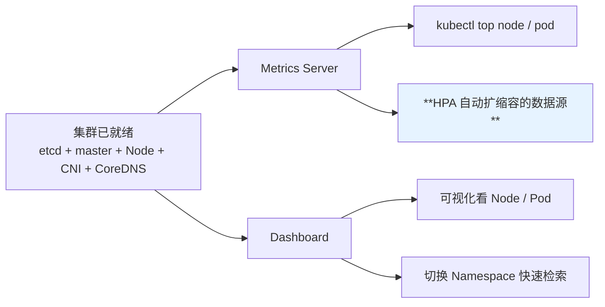
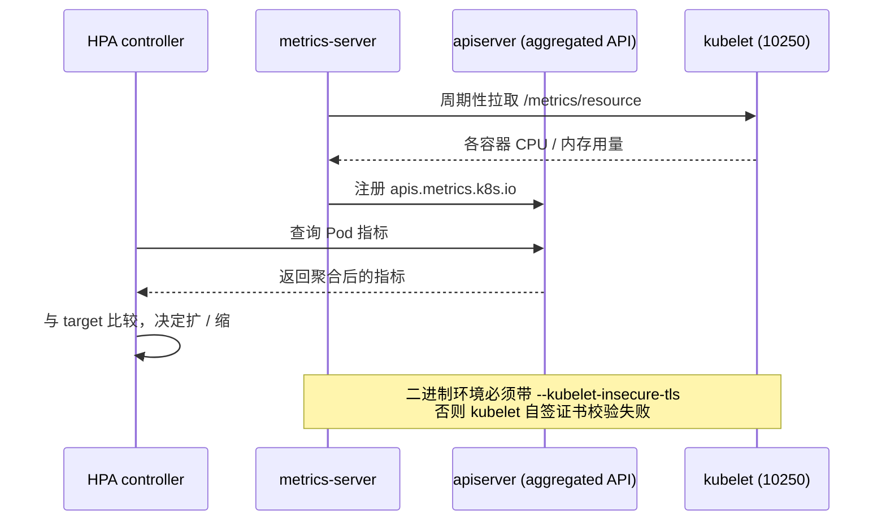
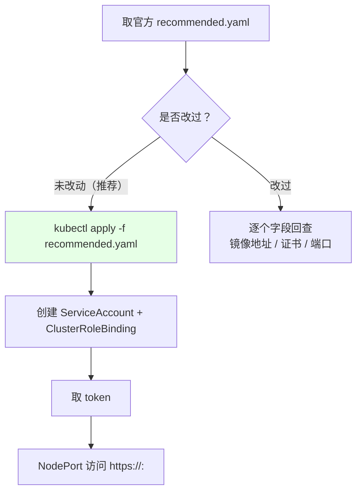

# Kubernetes 集群部署: 二进制集群安装 Metrics Server 与 Dashboard

二进制集群的控制面、Node、CNI、CoreDNS 都起来之后，集群「能跑」了，但还**看不见**：不知道 Pod 吃掉多少 CPU、也没地方一眼扫完节点状态。这一节补上最后两个常用组件 —— **Metrics Server**（采集 CPU / 内存指标）和 **Dashboard**（网页控制台）。

结论先给：

- **Metrics Server 是 HPA 的前置依赖**：没有它，`kubectl top` 用不了，自动扩缩容也无从谈起；
- **二进制集群装 metrics-server 要额外加两个参数**：`--kubelet-insecure-tls` 与 `--kubelet-preferred-address-types=InternalIP`，否则证书校验和地址解析会直接把它卡在 `CrashLoopBackOff`；
- **Dashboard 用 NodePort 暴露**，任意节点 IP + 端口即可访问，但**必须走 HTTPS**，且要用 ServiceAccount 的 token 登录。

## 纲要

- 为什么这两个组件是收尾必装项
- Metrics Server 0.3.7 的部署与二进制环境的两个额外参数
- `kubectl top` 的验证方式
- Dashboard v2.0.3 的部署与版本选择
- NodePort 暴露与 HTTPS 访问
- 创建管理员 ServiceAccount 并取 token 登录
- 常见未就绪原因排查

## 为什么是这两个



Metrics Server 与 kubeadm 那套没有本质区别，但**二进制集群的 kubelet 证书是自签的**，metrics-server 默认会去校验证书、默认优先用 hostname 解析 —— 这两点在二进制环境里都会失败，必须显式指定。

## 先看清组件在集群里的位置

```text
kube-system / kubernetes-dashboard 命名空间下的收尾组件
├── kube-system
│   ├── metrics-server-xxxx            # 采集指标，Deployment
│   ├── coredns-xxxx                   # 集群 DNS
│   ├── calico-node-xxxx               # CNI（DaemonSet）
│   └── kube-proxy-xxxx                # 服务转发
└── kubernetes-dashboard
    ├── kubernetes-dashboard-xxxx      # 控制台主体
    ├── dashboard-metrics-scraper-xxxx # 控制台内的指标插件
    └── dashboard-admin-sa             # 登录用的 ServiceAccount
```

## Metrics Server 0.3.7 部署

| 项 | 值 | 说明 |
| --- | --- | --- |
| 部署版本 | **v0.3.7** | 课程资料里 0.3.6 / 0.3.7 都有，两者差异很小，直接取新的 |
| 命名空间 | `kube-system` | 官方清单默认 |
| 镜像拉取 | 失败则 Pod 长时间 `ContainerCreating` | 国内环境常卡在这一步，见排查表 |
| 关键启动参数 | `--kubelet-insecure-tls` | 跳过 kubelet 自签证书校验 |
| 关键启动参数 | `--kubelet-preferred-address-types=InternalIP` | 优先用内网 IP 而非 hostname 解析 Node |



官方清单不用改别的，只需要在这两处打补丁：

```yaml
# metrics-server 部署清单的关键片段（节选，已 dedent 到顶层便于阅读）
spec:
  template:
    spec:
      containers:
        - name: metrics-server
          image: registry.aliyuncs.com/google_containers/metrics-server:v0.3.7
          args:
            - --cert-dir=/tmp
            - --secure-port=4443
            - --kubelet-insecure-tls
            - --kubelet-preferred-address-types=InternalIP
```

### 验证

```bash
kubectl -n kube-system get pod -l k8s-app=metrics-server
kubectl top node
kubectl top pod -A
```

`kubectl top` 能返回数值才算真就绪；只看到 Pod `Running` 但 top 报 `error: Metrics not available for pod` 的，多半是 apiserver 的聚合层没打通，或者 kubelet 的 10250 端口被安全组挡了。

## Dashboard v2.0.3 部署

版本选择的现实做法：

| 版本 | 状态 | 建议 |
| --- | --- | --- |
| v2.0.0-rc6 | 早期候选 | kubeadm 章节演示过的版本 |
| **v2.0.3** | **课程验证过** | 直接用，官方 recommended.yaml 原封不动 |
| v2.0.4 | 当时最新 | 与 2.0.3 差别很小；**装之前要自己先验证** |

原则：**用验证过的版本，不用「最新」的版本**。官方 `recommended.yaml` 从 GitHub 上拿下来不改任何字段，直接 apply。



## NodePort 暴露与 HTTPS 访问

Dashboard 官方 Service 默认就是 NodePort（也有的版本是 ClusterIP，需要自己改）。暴露后：

- **五台节点的任意一个 IP + 这个端口都能访问** —— 这是 NodePort 的特性，kube-proxy 在每台机器上都会开这个端口；
- **必须 HTTPS**：HTTP 打开会被拒绝，浏览器会报证书不受信，点「高级 → 继续前往」即可进登录页；
- 正式环境应换成 Ingress + 可信证书（后续 Ingress 章节会讲），NodePort 只适合内网直连。

```text
访问链路
浏览器 ──https──> node-01:30000 (NodePort)
                     │
                     ├─ kube-proxy (iptables/IPVS 规则)
                     │
                     └─> kubernetes-dashboard Pod :8443
                              │
                              └─> dashboard-metrics-scraper（控制台内指标）
```

## 创建管理员 ServiceAccount 并取 token

Dashboard 不支持匿名访问，也不接受用户名密码，**只能拿 ServiceAccount 的 token 登录**：

```yaml
# dashboard-admin.yaml —— 管理员账号 + 集群绑定
apiVersion: v1
kind: ServiceAccount
metadata:
  name: dashboard-admin
  namespace: kubernetes-dashboard
---
apiVersion: rbac.authorization.k8s.io/v1
kind: ClusterRoleBinding
metadata:
  name: dashboard-admin
roleRef:
  apiGroup: rbac.authorization.k8s.io
  kind: ClusterRole
  name: cluster-admin
subjects:
  - kind: ServiceAccount
    name: dashboard-admin
    namespace: kubernetes-dashboard
```

把整个目录一起 apply 是最省事的（`kubectl apply -f <dir>` 会把目录下所有清单都创建，包括管理员账号）。创建完取 token 登录即可。

## 常见未就绪原因排查

| 现象 | 原因 | 处理 |
| --- | --- | --- |
| `kubectl top` 报 metrics not available | 聚合 API 没注册 | `kubectl get apiservice v1beta1.metrics.k8s.io -o yaml` 看 `Available` |
| metrics-server 一直 `CrashLoopBackOff` | 缺 `--kubelet-insecure-tls` | 补参数 |
| metrics-server 报 no such host | 用 hostname 解析 Node 失败 | 补 `--kubelet-preferred-address-types=InternalIP`，或写 `/etc/hosts` |
| Pod 一直 `ContainerCreating` | **镜像拉不下来** | `kubectl describe pod` 看 Events，换镜像仓库地址 |
| Dashboard 打不开 | 用了 HTTP | 改成 `https://` |
| 登录页提示 token 无效 | ServiceAccount 没绑 cluster-admin | 补 ClusterRoleBinding |

## API 速览

| 能力 | 命令 |
| --- | --- |
| 部署 metrics-server | `kubectl apply -f metrics-server-0.3.7/` |
| 看指标 Pod | `kubectl -n kube-system get pod -l k8s-app=metrics-server` |
| 节点资源用量 | `kubectl top node` |
| 容器资源用量 | `kubectl top pod -A` |
| 部署 Dashboard | `kubectl apply -f recommended.yaml` |
| 看 Dashboard 端口 | `kubectl -n kubernetes-dashboard get svc` |
| 取管理员 token | `kubectl -n kubernetes-dashboard describe secret $(kubectl -n kubernetes-dashboard get secret \| grep dashboard-admin \| awk '{print $1}')` |
| 看聚合 API 状态 | `kubectl get apiservice` |

## Demo 示例

一键部署并把 token 打印出来：

```bash
#!/usr/bin/env bash
# install-metrics-dashboard.sh —— 二进制集群安装 metrics-server + Dashboard
set -euo pipefail

SRC_DIR="${SRC_DIR:-/opt/src/k8s-ha-install}"     # 课程资料目录
MS_DIR="${MS_DIR:-${SRC_DIR}/metrics-server-0.3.7}"
DASHBOARD_YAML="${DASHBOARD_YAML:-${SRC_DIR}/dashboard/recommended.yaml}"

echo "==> 1. 部署 metrics-server"
kubectl apply -f "${MS_DIR}"

echo "==> 2. 部署 Dashboard"
kubectl apply -f "${DASHBOARD_YAML}"

echo "==> 3. 创建管理员 ServiceAccount"
cat <<'YAML' | kubectl apply -f -
apiVersion: v1
kind: ServiceAccount
metadata:
  name: dashboard-admin
  namespace: kubernetes-dashboard
---
apiVersion: rbac.authorization.k8s.io/v1
kind: ClusterRoleBinding
metadata:
  name: dashboard-admin
roleRef:
  apiGroup: rbac.authorization.k8s.io
  kind: ClusterRole
  name: cluster-admin
subjects:
  - kind: ServiceAccount
    name: dashboard-admin
    namespace: kubernetes-dashboard
YAML

echo "==> 4. 等待就绪"
kubectl -n kube-system wait --for=condition=Ready pod -l k8s-app=metrics-server --timeout=180s || true
kubectl -n kubernetes-dashboard wait --for=condition=Ready pod -l k8s-app=kubernetes-dashboard --timeout=180s || true

echo "==> 5. NodePort 访问地址"
NODE_IP="${NODE_IP:-10.0.0.106}"
PORT=$(kubectl -n kubernetes-dashboard get svc kubernetes-dashboard -o jsonpath='{.spec.ports[0].nodePort}')
echo "    https://${NODE_IP}:${PORT}"

echo "==> 6. 登录 token"
SECRET=$(kubectl -n kubernetes-dashboard get secret | awk '/dashboard-admin-token/{print $1}' | head -1)
kubectl -n kubernetes-dashboard describe secret "${SECRET}" | awk '/^token:/{print $2}'
```

### 总结

Metrics Server 和 Dashboard 是二进制集群的收尾件，一个提供数据、一个提供视图，装完才算「可运维」。

- **Metrics Server 是 HPA 的前置依赖**：没有它 `kubectl top` 空转，自动扩缩容也没有数据源。
- **二进制环境必须补两个参数**：`--kubelet-insecure-tls` 跳过自签证书校验，`--kubelet-preferred-address-types=InternalIP` 避免 hostname 解析失败。
- **Dashboard 用验证过的版本**：官方 `recommended.yaml` 原样 apply，别为了追新版本去改字段。
- **NodePort 任意节点 IP 都能进，但只能 HTTPS**：浏览器证书告警走「高级 → 继续前往」；生产环境应换 Ingress + 可信证书。
- **登录只能用 ServiceAccount token**：建 `dashboard-admin` 并绑 `cluster-admin`，再 `describe secret` 取 token。
- **镜像拉不下来是最高频的卡顿点**：Pod 长时间 `ContainerCreating` 时先 `describe` 看 Events，别盲目等。

