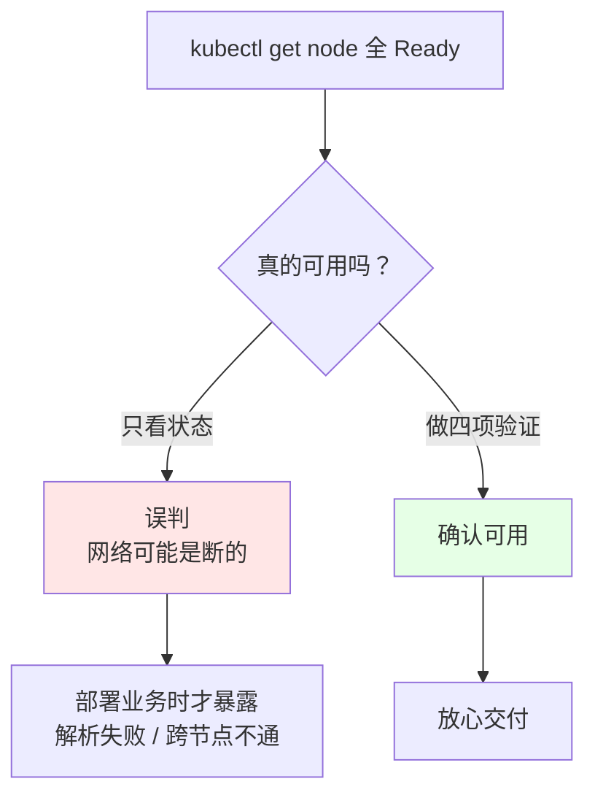
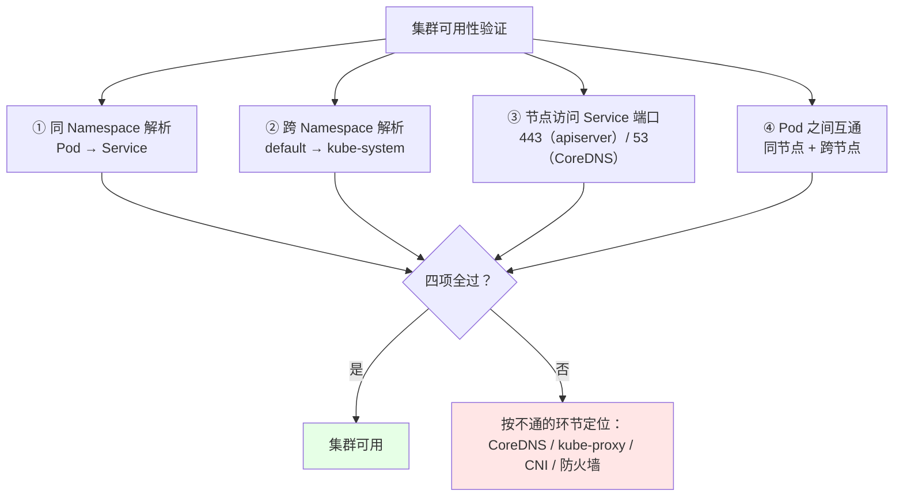
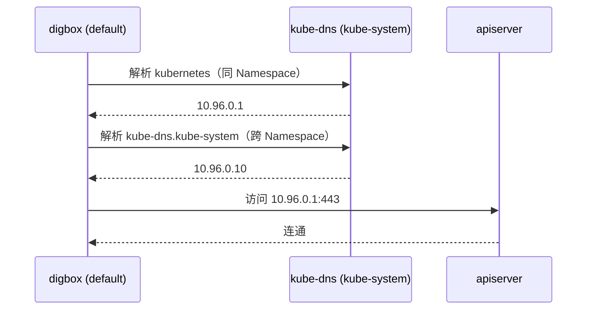
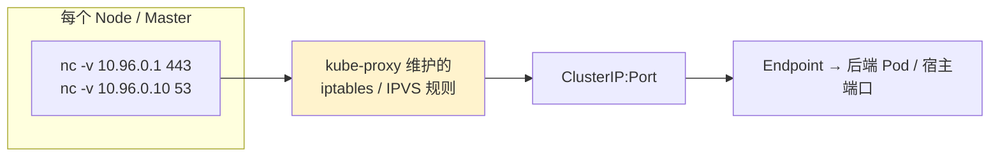

# Kubernetes 集群部署: 二进制高可用集群的可用性验证四步法

组件全部 `Running`、`kubectl get node` 全是 `Ready`，**并不等于集群可用**。真实踩过的坑是：状态看着全绿，但 Pod 解析不了 Service、跨节点 Pod 互相 ping 不通，等真正部署业务才发现。所以装完集群，**必须做一遍可用性验证**。

结论先给：验证就四步，全过才算能用：

1. **Pod 能解析同 Namespace 的 Service**；
2. **Pod 能解析跨 Namespace 的 Service**；
3. **每个节点都能连上 kubernetes Service 的 443 端口和 CoreDNS 的 53 端口**；
4. **Pod 之间能互通（同节点 + 跨节点）**。

## 纲要

- 为什么状态正常不等于集群可用
- 验证前的准备：一个带 shell 的调试 Pod
- 第一步：Pod 解析同命名空间 Service
- 第二步：Pod 解析跨命名空间 Service
- 第三步：每个节点访问 443 与 53
- 第四步：Pod 之间跨节点互通
- 验证完毕后的收尾清理

## 为什么状态正常不等于可用



组件状态只反映「进程活着」，反映不了「数据面通不通」。CoreDNS 起来了但 kube-proxy 规则没下发，Service IP 就是不可达的；CNI 起来了但路由没同步，跨节点 Pod 就是不通的。

## 验证前的准备：一个带 shell 的调试 Pod

验证需要一个能执行 `nslookup` / `ping` 的容器。**不要选业务镜像** —— 很多镜像是纯二进制（scratch / distroless），连 `sh` 都没有，`kubectl exec` 进去会直接报没有 shell。

```text
调试 Pod 的选择
├── busybox          ← 有 sh / nslookup / ping，验证首选
├── alpine           ← 也可以，nslookup 需要装 bind-tools
└── 业务镜像（如 nginx 精简版）← **没有 shell，exec 会失败**
```

```bash
kubectl run digbox --image=busybox:1.28 --command -- sleep 3600
kubectl get pod -o wide    # 确认它落在哪个节点
kubectl exec -it digbox -- sh
```

裸 Pod（没有 Deployment 管着）删掉不会重建，正适合做一次性验证。

## 四项验证一览



| 步骤 | 验证内容 | 不过的话问题出在哪 |
| --- | --- | --- |
| ① | Pod 解析**同 Namespace** 的 Service | CoreDNS 没起来 / Pod 的 `/etc/resolv.conf` 不对 |
| ② | Pod 解析**跨 Namespace** 的 Service | CoreDNS 正常但搜索域配置有问题 |
| ③ | 节点访问 kubernetes Service 的 **443** | kube-proxy 规则 / apiserver 未监听 |
| ③ | 节点访问 CoreDNS Service 的 **53** | CoreDNS Service 或 Endpoint 有问题 |
| ④ | Pod 跨节点互通 | **CNI 插件**（Calico）路由没打通 |

## 第一步与第二步：Service 域名解析

集群装好后有两个默认 Service 可以直接拿来测：

| Service | 命名空间 | ClusterIP | 端口 |
| --- | --- | --- | --- |
| `kubernetes` | `default` | `10.96.0.1` | 443 |
| `kube-dns` | `kube-system` | `10.96.0.10` | 53 |

调试 Pod 放在 `default`，所以：

- **解析 `kubernetes`** = 同 Namespace 解析；
- **解析 `kube-dns.kube-system`** = 跨 Namespace 解析（必须写全 `服务名.命名空间` 才能跨过去）。



跨 Namespace 能解析，才说明 CoreDNS 的**搜索域（`cluster.local`）配置是对的**，后面部署业务时按 `svc.ns` 访问才不会出问题。

## 第三步：每个节点访问 443 与 53

节点上用 `nc`（netcat）探测，比 ping 更准 —— **ClusterIP 是虚拟 IP，ping 不通不代表服务不通**，要看端口是否可连。

```bash
# 每个节点上都要执行
nc -v 10.96.0.1 443      # kubernetes Service，即 apiserver
nc -v 10.96.0.10 53      # CoreDNS Service
```

判据很直接：**命令不自动退出 / 显示 succeeded 就是通**；立刻返回、报 refused 就是不通。`nc` 没有的话用 `telnet` 或 `curl` 代替。



注意这一步要**逐台机器做**，不能只在一台上测 —— 某台机器的 kube-proxy 没起来，只有那台会失败，只测一台会漏。

## 第四步：Pod 之间跨节点互通

先确认两个 Pod 分别落在哪些节点上（`-o wide` 看 NODE 列），然后从其中一个 `ping` 另一个的 **Pod IP**：

```bash
TARGET_IP=10.244.1.5      # 换成另一个 Pod 的真实 IP（-o wide 看 IP 列）
kubectl exec -it digbox -- sh
ping -c 2 "$TARGET_IP"
```

- 两个 Pod **在同一节点** → 过的是宿主机网桥；
- 两个 Pod **在不同节点** → 过的是 CNI（Calico）的跨节点路由，**这条才是真正要测的**。

```text
Pod 跨节点互通路径
Pod A (node-01, 172.16.x.x)
   │
   ├─ veth pair → 宿主机网桥
   │
   ├─ 路由表（Calico 写入）
   │
   └─> 物理网卡 → 交换机 → node-02 物理网卡
                                │
                                └─> Pod B (node-02, 172.16.y.y)
```

跨节点通了，Calico 的 BGP / IPIP 隧道才是真工作；只同节点通，说明 CNI 只完成了一半。

补充一点：如果调试 Pod 用了 `hostNetwork: true`，它用的是宿主机网络栈，**ping 通不能证明 CNI 正常**，要挑一个普通 Pod 来测。

## 验证完毕后的收尾

```bash
kubectl delete pod digbox
APP=nginx
kubectl delete deployment "$APP"
```

顺手也可以拉一个有 3 副本的 Deployment 再删掉，确认调度器、ReplicaSet、CNI 整条链路都正常：

```bash
kubectl create deployment nginx --image=nginx --replicas=3
kubectl get pod -o wide     # 看是否分散到不同节点
kubectl delete deployment nginx
```

Master 节点默认也能被调度业务 Pod（没打污点时）。生产环境应该给 Master 打 taint，避免业务和控制面抢资源。

## API 速览

| 能力 | 命令 |
| --- | --- |
| 起一个调试 Pod | `kubectl run digbox --image=busybox:1.28 --command -- sleep 3600` |
| 进容器 | `kubectl exec -it digbox -- sh` |
| 同 Namespace 解析 | `nslookup kubernetes` |
| 跨 Namespace 解析 | `nslookup kube-dns.kube-system` |
| 节点上测端口 | `nc -v 10.96.0.1 443` / `nc -v 10.96.0.10 53` |
| 看 Pod 落在哪 | `kubectl get pod -o wide` |
| 看 Service 与 ClusterIP | `kubectl get svc -A` |
| 清理 | `kubectl delete pod digbox` |

## Demo 示例

把四步串成一个脚本，跑完直接给结论：

```bash
#!/usr/bin/env bash
# cluster-verify.sh —— 二进制高可用集群四项可用性验证
set -uo pipefail

DNS_SVC="${DNS_SVC:-10.96.0.10}"
API_SVC="${API_SVC:-10.96.0.1}"
POD="${POD:-digbox}"
rc=0

hr()  { printf '\n=== %s ===\n' "$*"; }
ok()  { printf '  [OK]   %s\n' "$*"; }
bad() { printf '  [FAIL] %s\n' "$*"; rc=1; }

hr "0. 准备调试 Pod"
kubectl get pod "${POD}" >/dev/null 2>&1 \
  && ok "调试 Pod ${POD} 已存在" \
  || { kubectl run "${POD}" --image=busybox:1.28 --command -- sleep 3600 >/dev/null && ok "已创建 ${POD}"; }
kubectl wait --for=condition=Ready "pod/${POD}" --timeout=120s >/dev/null 2>&1 \
  && ok "${POD} 已 Ready" || bad "${POD} 未就绪，检查镜像能否拉取"

hr "① 同 Namespace 解析 Service"
kubectl exec "${POD}" -- nslookup kubernetes >/dev/null 2>&1 \
  && ok "解析 kubernetes 成功" || bad "解析 kubernetes 失败：检查 CoreDNS Pod 与 /etc/resolv.conf"

hr "② 跨 Namespace 解析 Service"
kubectl exec "${POD}" -- nslookup kube-dns.kube-system >/dev/null 2>&1 \
  && ok "解析 kube-dns.kube-system 成功" || bad "跨 Namespace 解析失败：检查 CoreDNS 搜索域 cluster.local"

hr "③ 节点访问 Service 端口"
for target in "${API_SVC}:443" "${DNS_SVC}:53"; do
  ip="${target%:*}"; port="${target#*:}"
  nc -z -w 3 "$ip" "$port" >/dev/null 2>&1 \
    && ok "本机可连 ${ip}:${port}" \
    || bad "本机连不上 ${ip}:${port}：检查 kube-proxy 规则与 Endpoint"
done

hr "④ Pod 跨节点互通"
NODES=$(kubectl get node -o jsonpath='{range .items[*]}{.metadata.name}{"\n"}{end}')
echo "  集群节点:"; echo "$NODES" | sed 's/^/    /'
# 下面命令中的变量按你的集群环境赋值后再执行
POD_IPS=$(kubectl get pod -A -o wide --no-headers | awk '{print $6 " " $8}' | grep -v '$NONE' | head -5)
echo "  抽样 Pod IP / 所在节点:"; echo "$POD_IPS" | sed 's/^/    /'
TARGET=$(echo "$POD_IPS" | awk 'NR==1{print $1}')
if [ -n "$TARGET" ]; then
  kubectl exec "${POD}" -- ping -c 2 -W 2 "$TARGET" >/dev/null 2>&1 \
    && ok "Pod → Pod(${TARGET}) 互通" \
    || bad "Pod 之间不通：检查 CNI（Calico）路由与节点间物理网络"
fi

echo
if [ $rc -eq 0 ]; then echo "四项验证全部通过，集群可用。"; else echo "存在 FAIL 项，先修再交付。"; fi
exit $rc
```

### 总结

装完不等于可用，四项验证是交付前的最后一道关，缺任何一项都可能埋雷。

- **状态全绿不等于网络通**：`Ready` 只说明进程活着，数据面要单独验证。
- **验证四项**：同 Namespace 解析 Service、跨 Namespace 解析 Service、每个节点访问 443 与 53、Pod 跨节点互通。
- **调试 Pod 用 busybox**：业务镜像常没有 shell，`kubectl exec` 会直接失败。
- **测端口用 `nc` 而不是 ping**：ClusterIP 是虚拟 IP，ping 不通不代表服务不通。
- **跨节点 Pod 互通才是真验证**：同节点只过网桥，跨节点才走 CNI 路由；用了 `hostNetwork` 的 Pod 不能作为判据。
- **逐台机器都要测**：只测一台会漏掉单台 kube-proxy 未启动的情况。

