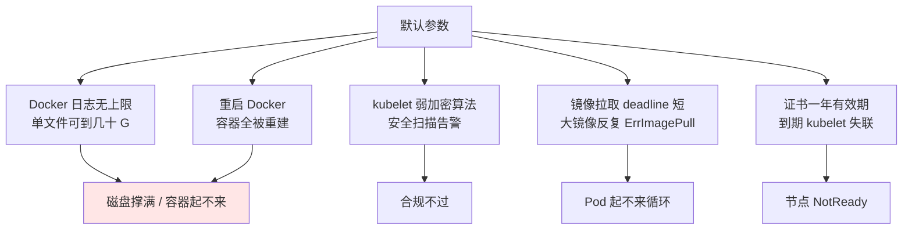
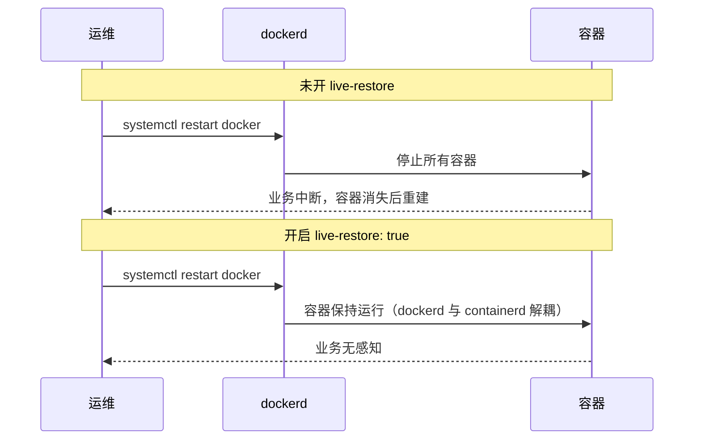
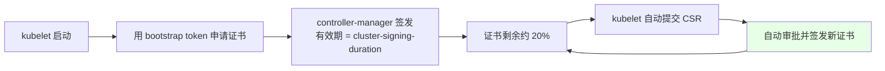
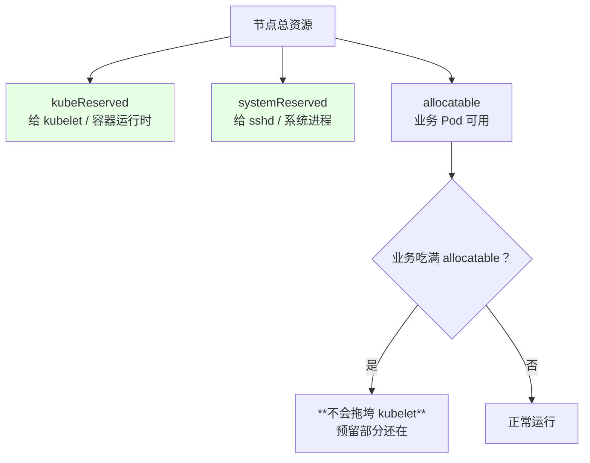
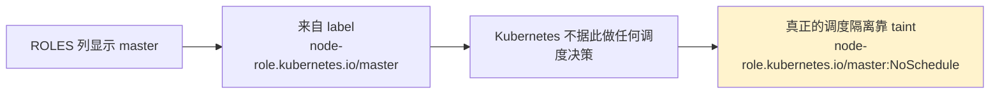
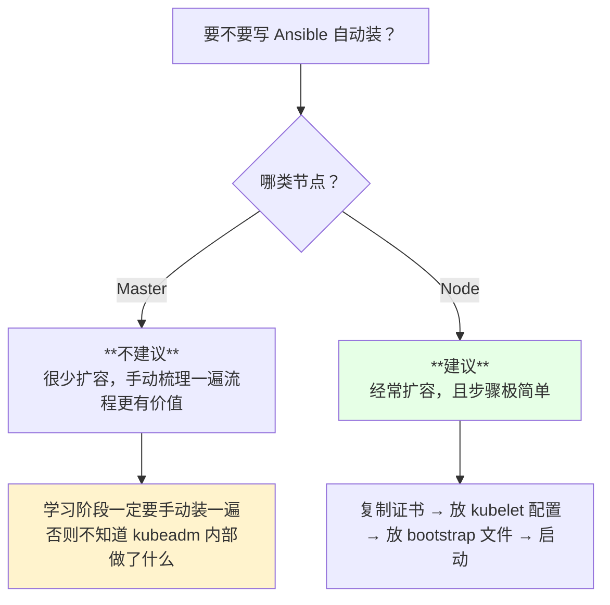

# Kubernetes 集群部署: 生产环境 Kubernetes 集群的关键性配置清单

集群装完、验证通过，只是「能用」。要上生产，还有一批**默认参数必须改**：Docker 的日志会把磁盘撑爆、重启 Docker 会把容器全部带走、kubelet 默认加密算法会被安全扫描扫出漏洞、kubelet 证书只有一年……

结论先给：

- **Docker 三项必改**：并发下载/上传线程数、`max-size` 日志切割、**`live-restore: true`**；
- **kubelet 两项必改**：TLS 加密算法升级、`serialize-image-pulls` 与镜像拉取 deadline，其余进 `kubelet.config`；
- **controller-manager 加证书有效期**参数，配合 Bootstrapping 自动续期；
- **etcd 必须独立部署 + SSD 盘**，Docker 数据盘必须与系统盘分离。

## 纲要

- 为什么装完还要改默认参数
- Docker 侧：并发拉取、日志切割、live-restore
- 控制面：controller-manager 的证书签发有效期
- kubelet 侧：加密算法、镜像拉取 deadline、新配置入口
- 内核参数放行与系统资源预留
- 节点角色标签的真相
- 磁盘与部署形态的硬性要求
- 自动化安装的边界：Node 值得做，Master 不必做

## 为什么装完还要改默认参数

默认值的目标是「能跑起来」，不是「长期稳定」。



## Docker 侧的三项配置

| 参数 | 作用 | 建议值 |
| --- | --- | --- |
| `max-concurrent-downloads` | **并发下载线程数** | 默认值偏小，节点上 Pod 多、同时拉镜像时会排队，调到 10 左右 |
| `max-concurrent-uploads` | **并发上传线程数** | 同上，推镜像场景受益 |
| `log-opts: max-size` | 单日志文件上限 | 300m ~ 500m，到量切割 |
| `log-opts: max-file` | 保留文件个数 | 2 ~ 3 个 |
| **`live-restore`** | 重启 Docker 守护进程不影响容器 | **必须 true** |

Docker 的容器控制台日志落在 `/var/lib/docker/containers/<容器ID>/` 下的 `*-json.log`。容器长期不重建，这个文件会一直涨 —— **不设上限就是定时炸弹**。

```text
Docker 日志与磁盘的关系（不设上限的后果）
/var/lib/docker/
├── containers/
│   └── <container-id>/
│       └── <container-id>-json.log   ← 不切割，长期运行可涨到几十 G
├── overlay2/                          ← 镜像与容器层
└── volumes/
```

`live-restore` 是最容易被忽略、也最容易酿事故的一条：



改完配置要重启 Docker 才生效，**顺序很重要**：先加 `live-restore: true` 并重启一次，之后再改别的参数重启就安全了。

```json
{
  "registry-mirrors": ["https://<mirror-host>"],
  "exec-opts": ["native.cgroupdriver=systemd"],
  "max-concurrent-downloads": 10,
  "max-concurrent-uploads": 5,
  "log-driver": "json-file",
  "log-opts": {
    "max-size": "300m",
    "max-file": "2"
  },
  "live-restore": true,
  "storage-driver": "overlay2"
}
```

## 控制面：controller-manager 的证书签发有效期

kubelet 的客户端证书由 controller-manager 通过 Bootstrapping 颁发，**默认有效期一年**。内部集群可以把它设长：

```bash
# kube-controller-manager 启动参数
--experimental-cluster-signing-duration=87600h   # 10 年（实际受 CA 证书与上游限制，通常上限 5 年）
```

注意两点：

1. **设了不一定生效到那么长**：实际签发有效期还会受 CA 证书自身有效期约束，通常上限就是 5 年；
2. **不设也没关系的前提是开了自动轮换**：kubelet 在证书剩余约 20% 有效期时会自动申请新证书（1.19 已 GA），有轮换兜底就不用纠结这个值。



## kubelet 侧的两项加固

| 配置项 | 默认值问题 | 建议 |
| --- | --- | --- |
| `tls-cipher-suites` | 默认包含弱加密套件，**安全扫描会报漏洞** | 显式指定 TLS 1.2 以上的强套件 |
| 镜像拉取 deadline | 默认很短，拉大镜像超时 → `ErrImagePull` 反复循环 | 适当放宽 |
| `serialize-image-pulls` | 并发拉镜像时的串行/并行控制 | 按节点带宽与磁盘决定 |

改加密算法**对集群功能没有任何影响**，纯合规收益 —— 有安全团队的公司这一步是必须做的。

新版本 Kubernetes 的 kubelet 配置**建议统一放到 `kubelet.config` 文件里**（通过 `--config` 指定），启动参数会逐步废弃、往配置文件迁移。同一个配置项，在它还是命令行参数时写命令行，转成配置文件字段后就写文件：

```text
kubelet 配置的两种载体
├── 命令行参数（--xxx，逐步废弃）
│   ├── --tls-cipher-suites
│   └── --image-pull-progress-deadline
└── kubelet.config 文件（--config=/var/lib/kubelet/config.yaml）
    ├── allowedUnsafeSysctls        ← 允许容器改内核参数
    ├── kubeReserved                ← 给 Kubernetes 组件预留
    ├── systemReserved              ← 给系统进程预留
    └── evictionHard                ← 硬驱逐阈值
```

## 内核参数放行与资源预留

容器有时需要调内核参数（比如最大并发连接数相关的 `net.core.somaxconn`），**默认不允许**。放开要用 `allowedUnsafeSysctls`，但这是**按需开启**的安全口子，不要默认全开：

```yaml
apiVersion: kubelet.config.k8s.io/v1beta1
kind: KubeletConfiguration
allowedUnsafeSysctls:
  - net.core.somaxconn
  - net.ipv4.tcp_max_syn_backlog
kubeReserved:
  cpu: 100m
  memory: 512Mi
systemReserved:
  cpu: 100m
  memory: 512Mi
evictionHard:
  memory.available: 500Mi
```

**资源预留是必须的**：不给 kubelet 与系统进程留资源，业务容器吃满 CPU / 内存后，节点会连 kubelet 都调度不动，直接 `NotReady`。



演示环境机器配置低（2 核 2G），预留要设小（如 CPU 10m），**生产环境一定按机器规格留足**，别照抄演示值。

## 节点角色标签的真相

`kubectl get node` 里 ROLES 列显示 `master` / `worker`，**纯粹是一个 label，Kubernetes 本身对「master 节点」没有任何感知**：

```bash
kubectl label node node-01 node-role.kubernetes.io/master=
kubectl label node node-01 node-role.kubernetes.io/worker=
```



Master 节点只是「多跑了几个组件」（apiserver / scheduler / controller-manager / etcd）而已。**想不让业务 Pod 落到 Master，靠的是污点（taint），不是标签**。

## 磁盘与部署形态的硬性要求

| 项 | 要求 | 原因 |
| --- | --- | --- |
| **etcd 盘** | **独立部署 + SSD，50~100G 足够** | etcd 对磁盘 IOPS 极敏感，机械盘会导致选举超时、集群抖动 |
| **Docker 数据盘** | **必须与系统盘分离**（改 `data-root`） | `/var/lib/docker` 在某些情况下会暴涨，撑满系统盘会直接搞挂 OS |
| Docker 数据盘介质 | 有条件也用 SSD | 一台机器上跑很多容器，磁盘慢影响面很大 |

```text
生产环境的磁盘划分
├── 系统盘（/）           ← 只装 OS 与 Kubernetes 二进制
├── etcd 数据盘（SSD）    ← 独立，50~100G
└── Docker 数据盘         ← /var/lib/docker 改到独立挂载点
        ├── overlay2/
        └── containers/
```

## 自动化安装的边界



Node 节点的安装步骤确实简单到可以一个 playbook 搞定，而 Master 一台一台手动装反而能保证你对每个组件的参数都过一遍。**学习的第一步是手动，不是自动化。**

另外重申选型：**生产用二进制**。断电恢复实测二进制更快更稳；kubeadm 用容器起控制面，全集群断电后有过起不来的情况。

## API 速览

| 能力 | 命令 / 位置 |
| --- | --- |
| 改 Docker 配置 | `/etc/docker/daemon.json`，改完 `systemctl restart docker` |
| 看 Docker 是否 live-restore | `docker info \| grep -i 'live restore'` |
| 看容器日志大小 | `ls -lh /var/lib/docker/containers/<id>/*.log` |
| controller-manager 证书时长 | 启动参数 `--experimental-cluster-signing-duration` |
| kubelet 配置文件 | `/var/lib/kubelet/config.yaml`（`--config` 指定） |
| 给节点打角色标签 | `kubectl label node <node> node-role.kubernetes.io/master=` |
| 给 Master 打污点 | `kubectl taint node <node> node-role.kubernetes.io/master:NoSchedule` |
| 看节点可分配资源 | `kubectl describe node <node> \| grep -A5 Allocatable` |
| 看 kubelet 证书到期 | `openssl x509 -in /var/lib/kubelet/pki/kubelet-client-current.pem -noout -dates` |

## Demo 示例

生产配置下发前先体检一遍，找出还没改的项：

```bash
#!/usr/bin/env bash
# prod-hardening-check.sh —— 生产环境关键配置体检（只读）
set -uo pipefail

rc=0
ok()  { printf '  [OK]   %s\n' "$*"; }
bad() { printf '  [FAIL] %s\n' "$*"; rc=1; }
warn(){ printf '  [WARN] %s\n' "$*"; }

echo "=== 1. Docker 配置 ==="
DAEMON=/etc/docker/daemon.json
if [ -f "$DAEMON" ]; then
  grep -q 'live-restore' "$DAEMON" \
    && grep -q '"live-restore": *true' "$DAEMON" && ok "已开启 live-restore" \
    || bad "live-restore 未开启：重启 docker 会重建所有容器"
  grep -q 'max-size' "$DAEMON" && ok "已配置日志切割 max-size" || bad "未配置 log-opts.max-size：日志会无限增长"
  grep -q 'max-concurrent-downloads' "$DAEMON" && ok "已配置并发下载" || warn "未配置 max-concurrent-downloads"
else
  bad "找不到 $DAEMON"
fi
docker info 2>/dev/null | grep -qi 'live restore.*true' && ok "dockerd 运行时已生效 live-restore"

echo "=== 2. 磁盘分离 ==="
DOCKER_ROOT=$(docker info 2>/dev/null | awk -F': ' '/Docker Root Dir/{print $2}')
echo "  Docker Root Dir: ${DOCKER_ROOT:-未知}"
DEV_D=$(df -P "${DOCKER_ROOT:-/var/lib/docker}" | awk 'NR==2{print $1}')
DEV_S=$(df -P / | awk 'NR==2{print $1}')
[ "$DEV_D" = "$DEV_S" ] && bad "Docker 数据盘与系统盘是同一块设备（$DEV_D）" || ok "Docker 数据盘已与系统盘分离（$DEV_D）"

echo "=== 3. etcd 盘介质 ==="
ETCD_DIR="${ETCD_DIR:-/var/lib/etcd}"
if [ -d "$ETCD_DIR" ]; then
  DEV_E=$(df -P "$ETCD_DIR" | awk 'NR==2{print $1}')
  ROTA=$(lsblk -no ROTA "$DEV_E" 2>/dev/null | head -1)
  [ "$ROTA" = "0" ] && ok "etcd 数据在 SSD（$DEV_E）" || bad "etcd 数据盘疑似机械盘（$DEV_E），生产必须换 SSD"
fi

echo "=== 4. kubelet 加密套件 ==="
if [ -f /var/lib/kubelet/config.yaml ]; then
  grep -q 'tlsCipherSuites' /var/lib/kubelet/config.yaml \
    && ok "已显式指定 tlsCipherSuites" || bad "未指定 tlsCipherSuites：默认含弱套件，安全扫描会告警"
  grep -q 'kubeReserved' /var/lib/kubelet/config.yaml \
    && ok "已配置 kubeReserved" || bad "未配置资源预留：业务吃满会导致节点 NotReady"
fi

echo "=== 5. Master 污点 ==="
for n in $(kubectl get node --no-headers -o custom-columns=NAME:.metadata.name 2>/dev/null); do
  t=$(kubectl describe node "$n" 2>/dev/null | awk -F': ' '/^Taints:/{print $2}')
  case "$n" in
    *master*) [ -n "$t" ] && ok "$n 已打污点: $t" || warn "$n 是 Master 但没有污点，业务 Pod 可能调度上来";;
  esac
done

echo
[ $rc -eq 0 ] && echo "生产配置体检通过。" || echo "存在 FAIL 项，上线前请处理。"
exit $rc
```

### 总结

装完只是起点，默认参数不改成产线就是隐患。这份清单可以按机器批量下发，改完再交付。

- **Docker 三项：并发拉取、日志切割、`live-restore: true`**。其中 `live-restore` 最关键，没开的话重启 dockerd 会重建全部容器。
- **controller-manager 证书有效期可以设长**，但有上限（通常 5 年）；真正的兜底是 kubelet 自动轮换（1.19 已 GA）。
- **kubelet 要显式指定 `tlsCipherSuites`**：默认弱套件会被安全扫描扫出来，改了不影响功能。
- **资源预留（kubeReserved / systemReserved）必须配**：否则业务吃满资源会连带 kubelet 一起拖垮。
- **etcd 独立 + SSD、Docker 数据盘与系统盘分离**：这两条是硬性要求，机械盘跑 etcd 会导致集群抖动。
- **ROLES 只是 label**：阻止业务调度到 Master 靠 taint，不靠标签。
- **自动化只做 Node**：Master 手动装一遍更有价值；生产优选二进制安装。

