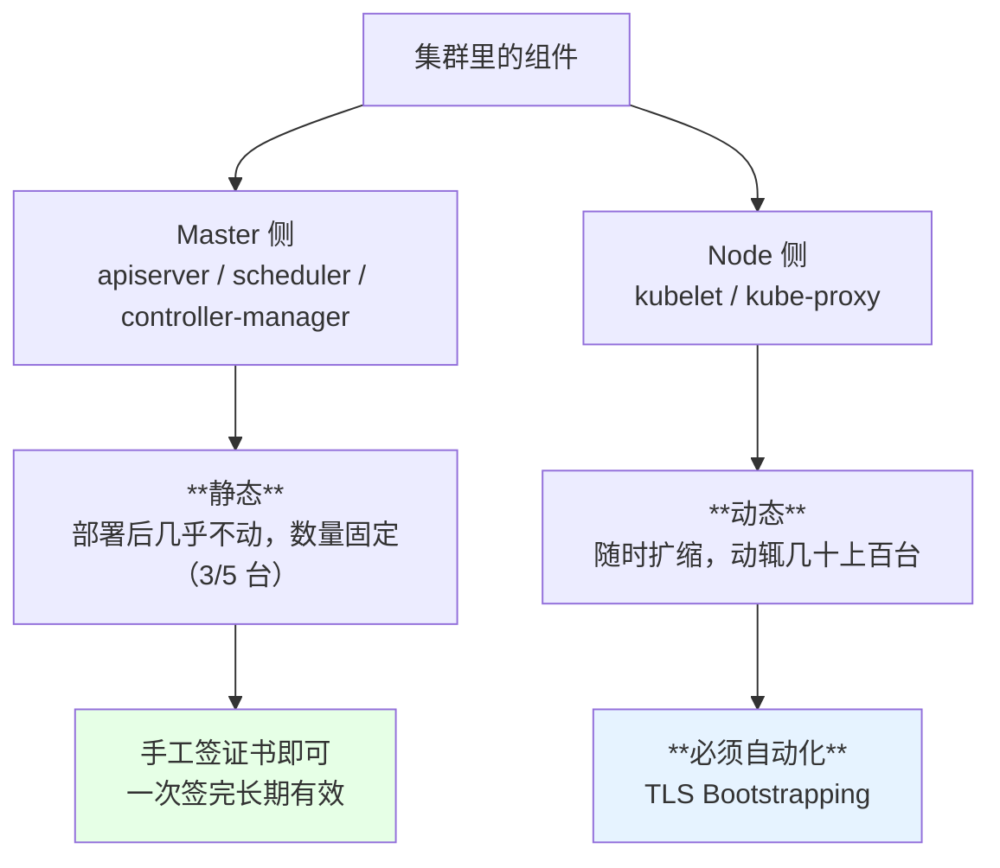
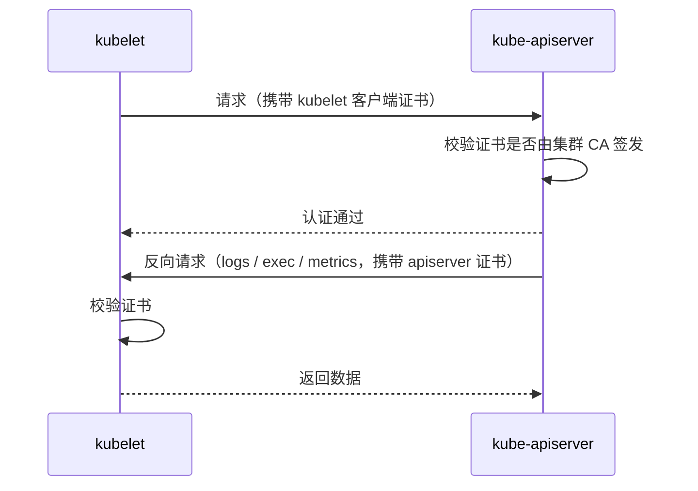
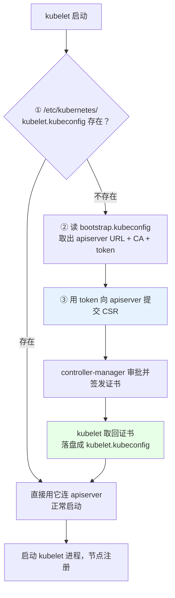
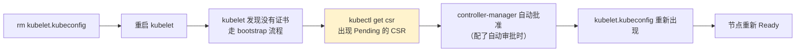
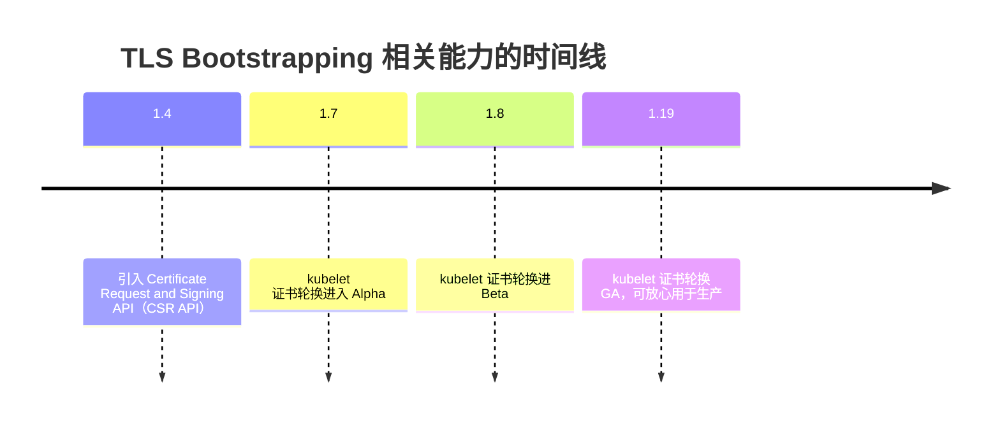

# Kubernetes 集群部署: TLS Bootstrapping 下 kubelet 的启动流程拆解

二进制安装里给 apiserver、scheduler、controller-manager 都手工签了证书、生成了各自的 `kubeconfig`。唯独 **kubelet 没有** —— 它靠 TLS Bootstrapping 自己去申请。为什么厚此薄彼？这一节把 kubelet 的启动过程逐步拆开，看完就明白这个设计。

结论先给：

- **Master 组件静态，Node 动态**：控制面组件部署后基本不动，Node 动辄上百台还会频繁扩缩，手工管证书不现实；
- **kubelet 证书与主机名绑定**，每台机器一份，几台还能手工，几百台就是灾难；
- kubelet 启动就是三步：**查 `kubelet.kubeconfig` → 没有就用 `bootstrap.kubeconfig` 去申请 → 拿到证书再连 apiserver**。

## 纲要

- 为什么只有 kubelet 用 Bootstrapping
- 双向认证：每个客户端都要有自己的证书
- kubeconfig 里装了什么
- kubelet 启动的三步流程
- 演示：删掉 kubelet.kubeconfig 让它重新申请
- 证书有效期怎么看、怎么调
- Bootstrapping 引入的版本背景

## 为什么只有 kubelet 用 Bootstrapping



还有一个关键点：**kubelet 的证书是和主机名绑定的**。每台 Node 的证书 CN 里带着自己的主机名，所以不能一份证书复制给所有机器 —— 那就只能每台单独签，机器一多就没法手工维护了。

证书过期时要重签、新增节点时要新签、节点重建主机名变了还要重签……几百台规模下这件事**必须用机制解决而不是用人解决**。

```text
两类节点的证书管理对比
├── Master（3~5 台，静态）
│   ├── kube-controller-manager.kubeconfig   ← 手工签发
│   ├── kube-scheduler.kubeconfig            ← 手工签发
│   └── admin.kubeconfig                     ← 手工签发
└── Node（几十~几百台，动态）
    ├── bootstrap.kubeconfig                 ← 手工只做一次（通用 token 文件）
    └── kubelet.kubeconfig                   ← **Bootstrapping 自动生成**
```

## 双向认证：每个客户端都要有自己的证书

Kubernetes 官方强烈建议**双向 TLS 认证**：

- 客户端（kubelet / scheduler / controller-manager）访问 apiserver 要带证书；
- apiserver 访问 kubelet（比如 `kubectl logs` / `exec`）也要带证书。



证书一般**自签**：不花钱、可以把有效期设得很长（五年甚至更久），避免频繁维护。商业 CA 证书通常只有一年有效期，对内部集群反而是负担。

> Kubernetes 从 **1.4** 起引入 Certificate Request and Signing API（CSR API），就是为了让这套证书管理自动化 —— 这正是 TLS Bootstrapping 的底座。

## kubeconfig 里装了什么

`kubeconfig` 不是「一个证书」，是**连接 apiserver 所需的全部信息**：

| 字段 | 内容 |
| --- | --- |
| `clusters[].server` | apiserver 的地址（通常是 VIP:6443） |
| `clusters[].certificate-authority-data` | **CA 证书**（base64 编码），用来校验服务端 |
| `users[].client-certificate-data` | 客户端证书（base64） |
| `users[].client-key-data` | 客户端私钥（base64） |
| `contexts` | 把 cluster + user 组合起来 |

```text
/etc/kubernetes/
├── bootstrap.kubeconfig        ← 只有一个 token，用来"敲门"
│   ├── server: https://10.0.0.100:6443
│   ├── certificate-authority-data: <CA 证书>
│   └── token: <bootstrap token>
└── kubelet.kubeconfig          ← Bootstrapping 产物，含真正的客户端证书
    ├── server: https://10.0.0.100:6443
    ├── client-certificate-data: <kubelet 证书>
    └── client-key-data: <kubelet 私钥>
```

想看证书什么时候过期，把 base64 解出来用 openssl 看：

```bash
grep 'client-certificate-data' /etc/kubernetes/kubelet.kubeconfig | awk '{print $2}' | base64 -d > /tmp/kubelet.crt
openssl x509 -in /tmp/kubelet.crt -noout -dates
```

## kubelet 启动的三步流程



逐步说明：

1. **查找 `kubelet.kubeconfig`**：默认路径 `/etc/kubernetes/kubelet.kubeconfig`（由启动参数 `--kubeconfig` 指定）。有就直接用；
2. **读 `bootstrap.kubeconfig`**：从中取出 apiserver 的 URL 和 CA 证书 —— 这一步只拿「去哪敲门」和「信谁」，不含身份；
3. **用 token 申请证书**：拿着 bootstrap token 向 apiserver 提交 CertificateSigningRequest，controller-manager 批准后签发，kubelet 写回本地文件，然后才真正开始工作。

关键在第二步：**bootstrap.kubeconfig 里没有客户端证书，只有一个 token**。它是个临时凭证，唯一用途就是换一张真证书。

## 演示：删掉 kubelet.kubeconfig 让它重新申请

这是理解整套机制最快的方式 —— 在任意一台 Node 上：

```bash
# 1. 确认 kubelet 启动参数指向的 kubeconfig 与 bootstrap 文件
systemctl cat kubelet | grep -E 'kubeconfig|bootstrap'

# 2. 删掉已生成的 kubelet.kubeconfig
rm -f /etc/kubernetes/kubelet.kubeconfig

# 3. 重启 kubelet
systemctl restart kubelet

# 4. 观察 CSR
kubectl get csr

# 5. 确认文件已重新生成
ls -l /etc/kubernetes/kubelet.kubeconfig
```



如果 CSR 停在 `Pending` 不动，说明**自动审批没配好**，需要手工 `kubectl certificate approve <csr>` —— 生产环境应该配成自动的，否则每次加节点都要人工点一下。

## 证书有效期怎么看、怎么调

| 环节 | 参数 / 命令 |
| --- | --- |
| 看 kubelet 证书到期时间 | `openssl x509 -in <crt> -noout -dates` |
| 签发有效期 | controller-manager 的 `--experimental-cluster-signing-duration`（见「生产关键性配置」一节） |
| 到期前自动续 | kubelet 证书轮换（1.19 已 GA），剩余约 20% 时自动申请 |
| 手工批准 CSR | `kubectl certificate approve <csr-name>` |

演示环境里常常能看到「5 年有效期」的证书，那是把 `cluster-signing-duration` 设长的结果。**有自动轮换兜底时，这个值的长短就没那么关键了。**

## Bootstrapping 引入的版本背景



（时间线基于官方 CHANGELOG 的公开演进，具体版本以官方文档为准。）

## API 速览

| 能力 | 命令 |
| --- | --- |
| 看 kubelet 启动参数 | `systemctl cat kubelet \| grep -E 'kubeconfig\|bootstrap'` |
| 看 CSR 列表 | `kubectl get csr` |
| 批准 CSR | `kubectl certificate approve <csr-name>` |
| 拒绝 CSR | `kubectl certificate deny <csr-name>` |
| 看 kubelet 证书到期 | `openssl x509 -in <kubelet-client.crt> -noout -dates` |
| 重新触发申请 | 删 `kubelet.kubeconfig` 后 `systemctl restart kubelet` |
| 看 bootstrap token | `kubectl get secret -n kube-system \| grep bootstrap` |
| 创建 bootstrap token | `kubeadm token create --print-join-command`（kubeadm 集群） |

## Demo 示例

在一台 Node 上完整走一遍「删证书 → 重新申请」：

```bash
#!/usr/bin/env bash
# bootstrap-replay.sh —— 重放 kubelet 的 Bootstrapping 申请过程
set -uo pipefail

KUBELET_KUBECONFIG="${KUBELET_KUBECONFIG:-/etc/kubernetes/kubelet.kubeconfig}"
BACKUP_DIR="${BACKUP_DIR:-/tmp/kubelet-bak}"

echo "==> 0. 记录当前 kubelet 证书到期时间"
if [ -f "$KUBELET_KUBECONFIG" ]; then
  CRT=$(mktemp)
  grep 'client-certificate-data' "$KUBELET_KUBECONFIG" | awk '{print $2}' | base64 -d > "$CRT" 2>/dev/null
  openssl x509 -in "$CRT" -noout -dates 2>/dev/null | sed 's/^/    /'
  rm -f "$CRT"
fi

echo "==> 1. 备份并删除 kubelet.kubeconfig"
mkdir -p "$BACKUP_DIR"
[ -f "$KUBELET_KUBECONFIG" ] && cp -a "$KUBELET_KUBECONFIG" "$BACKUP_DIR/"
rm -f "$KUBELET_KUBECONFIG"
echo "    已备份到 $BACKUP_DIR"

echo "==> 2. 重启 kubelet，触发重新申请"
systemctl restart kubelet
sleep 5

echo "==> 3. 观察 CSR（在 master 上执行）"
echo "    kubectl get csr"
    # 执行前先给下面的占位变量赋值，如 NODE_NAME=node1，否则变量为空会导致命令行为不符合预期
echo "    若停在 Pending，执行: kubectl certificate approve ${CSR_NAME}"

echo "==> 4. 检查文件是否重新生成"
for i in $(seq 1 12); do
  if [ -f "$KUBELET_KUBECONFIG" ]; then
    echo "    [OK] $(ls -l "$KUBELET_KUBECONFIG")"
    break
  fi
  sleep 5
done
[ -f "$KUBELET_KUBECONFIG" ] || echo "    [FAIL] 未生成，请检查 bootstrap token 是否有效、CSR 是否被批准"

echo "==> 5. 恢复提示"
echo "    如需还原: cp -a $BACKUP_DIR/kubelet.kubeconfig $(dirname "$KUBELET_KUBECONFIG")/ && systemctl restart kubelet"
```

### 总结

Bootstrapping 不是「省事的小技巧」，而是 Node 规模化的前提机制 —— 没有它，几百台机器的证书管理根本无法维护。

- **只有 kubelet 用 Bootstrapping**：Master 组件静态、Node 动态且证书与主机名绑定，前者手工签、后者必须自动。
- **Kubernetes 用双向 TLS**：客户端访问 apiserver 要证书，apiserver 回调 kubelet 也要证书；证书一般自签并设长有效期。
- **启动就三步**：查 `kubelet.kubeconfig` → 没有则读 `bootstrap.kubeconfig`（只有 token）→ 提交 CSR 换真证书后落盘。
- **`bootstrap.kubeconfig` 里没有客户端证书**，只有 URL、CA 和 token，它唯一的用途是敲门换证。
- **想理解就删一次**：`rm kubelet.kubeconfig && systemctl restart kubelet`，再用 `kubectl get csr` 看申请过程。
- **CSR 停在 Pending 说明自动审批没配**：生产应配成自动批准，否则每次扩容都要人工 approve。

