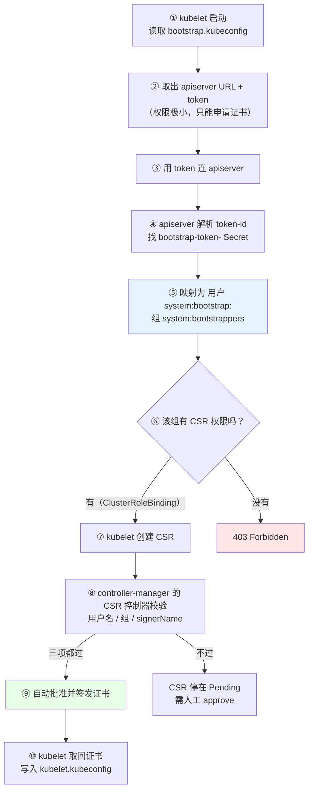
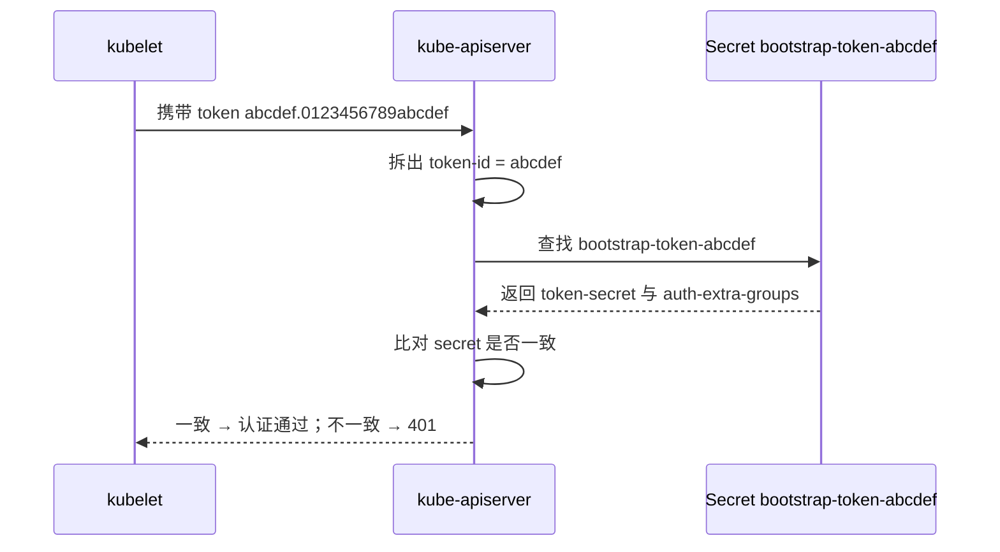
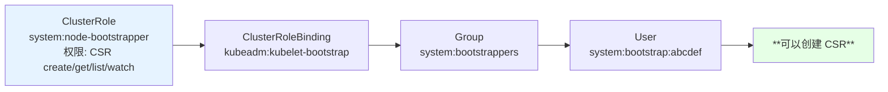
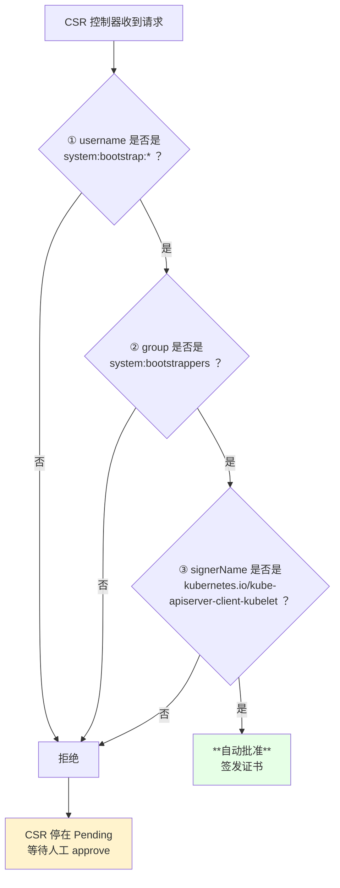
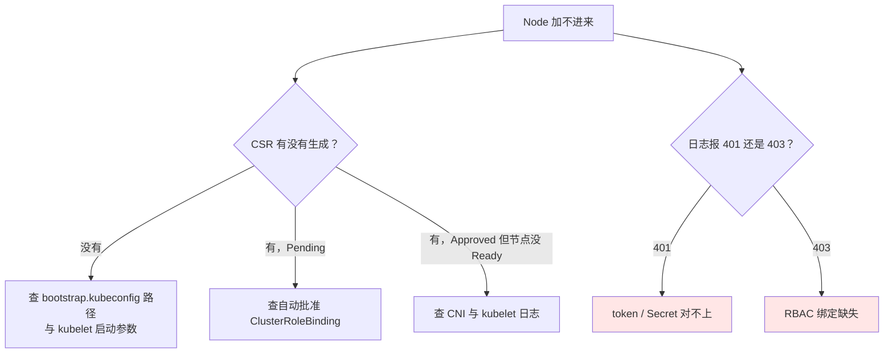

# Kubernetes 集群部署: Bootstrapping 的 CSR 申请与证书颁发原理

上一节说 kubelet 会「拿着 bootstrap token 去申请证书」，一句话带过。这一节把这句话拆开：**token 是怎么被认出来的、认出来之后凭什么有权限创建 CSR、controller-manager 又是凭什么同意签发的**。整条链路绕不开 RBAC，所以看着比启动流程复杂不少。

结论先给：

- **token 只是个用户名**：apiserver 收到 token 后，去找 `kube-system` 里名为 `bootstrap-token-<token-id>` 的 Secret，把 token 识别成用户 `system:bootstrap:<token-id>`，并归入组 `system:bootstrappers`；
- **权限来自 ClusterRoleBinding**：`system:node-bootstrapper` 这个 ClusterRole（能 create/get/list/watch CSR）被绑到 `system:bootstrappers` 组上，组里所有用户就有了申请 CSR 的权限；
- **自动批准是第二层 RBAC**：`node-client-auto-approve` 类的 ClusterRoleBinding 绑到 `system:bootstrappers` 组，controller-manager 的 CSR 控制器才敢自动签发。

## 纲要

- 整条链路的全景
- 第一步：apiserver 如何识别 token
- 第二步：token 被映射成哪个用户和组
- 第三步：组凭什么有创建 CSR 的权限
- 第四步：kubelet 创建 CSR
- 第五步：controller-manager 的三个校验条件
- 自动批准的两种做法
- 常见故障与排查顺序

## 整条链路全景



## 第一步：apiserver 怎么认出这个 token

bootstrap token 有**严格的格式**：`[a-z0-9]{6}.[a-z0-9]{16}`，前半段是 **token id**，后半段是 **token secret**。

```text
token 结构
abcdef.0123456789abcdef
  │         │
  │         └── token secret（相当于密钥）
  └──────────── token id（6 位，用来定位 Secret）
```

集群初始化时会在 `kube-system` 下建一个 Secret，名字必须是 **`bootstrap-token-<token-id>`**：

```yaml
apiVersion: v1
kind: Secret
metadata:
  name: bootstrap-token-abcdef
  namespace: kube-system
type: bootstrap.kubernetes.io/token
stringData:
  token-id: "abcdef"
  token-secret: "0123456789abcdef"
  usage-bootstrap-authentication: "true"
  usage-bootstrap-signing: "true"
  auth-extra-groups: "system:bootstrappers:default-node-token"
```

**名字对不上就找不到**：token id 是 `abcdef`，Secret 就必须叫 `bootstrap-token-abcdef`。这是二进制安装里最容易写错的一处 —— 写错了现象就是 kubelet 一直报认证失败，但看日志又看不出哪错了。



## 第二步：token 被映射成哪个用户和组

认证通过后，apiserver 把这个请求**身份化**：

| 项目 | 值 |
| --- | --- |
| username | `system:bootstrap:<token-id>`（例：`system:bootstrap:abcdef`） |
| group | Secret 里 `auth-extra-groups` 指定的组，通常是 `system:bootstrappers`（或 `system:bootstrappers:default-node-token`） |

**token 本质上就是一个用户名**，token secret 就是它的密码。这跟「给每个人建一个账号」是同一回事，只是 Kubernetes 把它自动化了。

## 第三步：组凭什么有创建 CSR 的权限

这就是 RBAC 的部分。三个对象的关系：

| 对象 | 作用范围 | 这里用到的名字 |
| --- | --- | --- |
| **ClusterRole** | 集群级别，定义「能做什么」 | `system:node-bootstrapper`：对 `certificatesigningrequests` 有 create / get / list / watch |
| **ClusterRoleBinding** | 把 Role 绑到人/组 | `kubeadm:kubelet-bootstrap`（把上面的 Role 绑到 `system:bootstrappers` 组） |
| **Subject（组）** | 被授权的对象 | `system:bootstrappers` |



逻辑链条：**我在这个组里 → 组有这个权限 → 我就有这个权限**。所以 kubelet 拿 token 去请求时，就有了创建 CSR 的资格。

> ClusterRole / ClusterRoleBinding 是**集群级资源，没有 Namespace 隔离**，`kubectl get clusterrole` 不用加 `-n`。

## 第四步：kubelet 创建 CSR

CSR（CertificateSigningRequest）通俗讲就是**一张证书申请表**：像去 CA 申请证书要填公司名、域名、地区一样，CSR 里带着「我是谁、我要什么样的证书」。

kubelet 为自己创建的 CSR，其 `signerName` 是：

```text
kubernetes.io/kube-apiserver-client-kubelet
```

这个名字很关键 —— 它声明「我要的是一张用于 kubelet 访问 apiserver 的客户端证书」，controller-manager 会校验它。

```yaml
apiVersion: certificates.k8s.io/v1
kind: CertificateSigningRequest
metadata:
  name: csr-xxxxx
spec:
  signerName: kubernetes.io/kube-apiserver-client-kubelet
  request: <base64 编码的 PKCS#10 申请>
  usages:
    - client auth
```

## 第五步：controller-manager 的三个校验条件

controller-manager 里有个专门的 **CSR 控制器**（CSR approving controller），它不会无条件签字，要同时校验三项：



## 自动批准的两种做法

| 做法 | 机制 | 适用 |
| --- | --- | --- |
| **人工批准** | `kubectl certificate approve <csr>` | 小规模、或需要人工审核的场景 |
| **自动批准** | 再加一层 ClusterRoleBinding，把「批准 CSR」的权限给 `system:bootstrappers` 组 | 生产必需，否则每次扩容都要人工点 |

自动批准靠的是另一条 ClusterRoleBinding（名字常见为 `node-client-auto-approve` 一类），把 `system:certificates.k8s.io:certificatesigningrequests:nodeclient` 这个 ClusterRole 绑到组上：

```yaml
apiVersion: rbac.authorization.k8s.io/v1
kind: ClusterRoleBinding
metadata:
  name: node-client-auto-approve
roleRef:
  apiGroup: rbac.authorization.k8s.io
  kind: ClusterRole
  name: system:certificates.k8s.io:certificatesigningrequests:nodeclient
subjects:
  - apiGroup: rbac.authorization.k8s.io
    kind: Group
    name: system:bootstrappers
```

注意：**不同安装文档里 ClusterRole / ClusterRoleBinding 的名字可能不一样**，照抄别人的文档前先 `kubectl get clusterrolebinding | grep -i boot` 确认自己集群里叫什么，名字对不上等于没配。

```text
Bootstrapping 相关的 RBAC 对象清单
├── Secret          bootstrap-token-<id>           # token 本体
├── ClusterRole     system:node-bootstrapper        # 能创建 CSR
├── ClusterRoleBinding  绑定上面两个到 system:bootstrappers 组
├── ClusterRole     system:certificates.k8s.io:certificatesigningrequests:nodeclient  # 能批准 CSR
└── ClusterRoleBinding  node-client-auto-approve     # 绑上面这个到组，实现自动批准
```

## 常见故障与排查顺序

| 现象 | 原因 | 排查命令 |
| --- | --- | --- |
| kubelet 报 401 / Unauthorized | **Secret 名字与 token id 对不上**，或 token secret 不一致 | `kubectl get secret -n kube-system \| grep bootstrap-token` |
| kubelet 报 403 Forbidden | ClusterRoleBinding 没绑到 `system:bootstrappers` | `kubectl get clusterrolebinding \| grep -i boot` |
| CSR 一直是 Pending | 没配自动批准的 ClusterRoleBinding | `kubectl get csr` 后手工 `approve` 验证 |
| CSR 根本没出现 | kubelet 的 bootstrap 文件路径写错 | `systemctl cat kubelet \| grep bootstrap` |
| token 过期 | bootstrap token 默认 24 小时有效 | `kubectl get secret -n kube-system <token> -o yaml` 看 expiration |



## API 速览

| 能力 | 命令 |
| --- | --- |
| 看 CSR | `kubectl get csr` |
| 看 CSR 详情 | `kubectl describe csr <name>` |
| 人工批准 | `kubectl certificate approve <csr-name>` |
| 看 bootstrap Secret | `kubectl get secret -n kube-system \| grep bootstrap-token` |
| 看 Secret 内容 | `kubectl get secret -n kube-system bootstrap-token-<id> -o yaml` |
| 看集群角色 | `kubectl get clusterrole \| grep -i boot` |
| 看集群角色绑定 | `kubectl get clusterrolebinding \| grep -iE 'boot\|auto-approve'` |
| 看某个绑定的细节 | `kubectl describe clusterrolebinding <name>` |
| 解码 token secret | `echo <base64> \| base64 -d` |

## Demo 示例

一次性把 Bootstrapping 的 RBAC 链路检查完：

```bash
#!/usr/bin/env bash
# bootstrap-rbac-audit.sh —— 检查 Bootstrapping 的 token / RBAC / CSR 链路
set -uo pipefail

rc=0
ok()  { printf '  [OK]   %s\n' "$*"; }
bad() { printf '  [FAIL] %s\n' "$*"; rc=1; }
warn(){ printf '  [WARN] %s\n' "$*"; }

echo "=== 1. bootstrap token Secret ==="
SECRETS=$(kubectl get secret -n kube-system --no-headers 2>/dev/null | awk '/bootstrap-token/{print $1}')
if [ -n "$SECRETS" ]; then
  echo "$SECRETS" | sed 's/^/    找到: /'
  for s in $SECRETS; do
    EXP=$(kubectl get secret -n kube-system "$s" -o jsonpath='{.data.expiration}' 2>/dev/null | base64 -d 2>/dev/null)
    echo "    $s 过期时间: ${EXP:-未设置}"
  done
else
  bad "kube-system 下没有 bootstrap-token Secret"
fi

echo "=== 2. CSR 权限的 ClusterRoleBinding ==="
if kubectl get clusterrolebinding --no-headers 2>/dev/null | grep -qi 'bootstrappers'; then
  kubectl get clusterrolebinding --no-headers | awk '/bootstrappers|bootstrap/{print "    "$1" → "$2}'
  ok "存在绑到 bootstrappers 组的 ClusterRoleBinding"
else
  bad "没有把权限绑到 system:bootstrappers 组，kubelet 会 403"
fi

echo "=== 3. 自动批准 ClusterRoleBinding ==="
if kubectl get clusterrolebinding --no-headers 2>/dev/null | grep -qi 'auto-approve\|autocert\|nodeclient'; then
  kubectl get clusterrolebinding --no-headers | awk '/auto-approve|nodeclient/{print "    "$1" → "$2}'
  ok "存在自动批准绑定"
else
  bad "缺少自动批准绑定，CSR 会停在 Pending，需人工 approve"
fi

echo "=== 4. 当前 CSR 状态 ==="
PENDING=$(kubectl get csr --no-headers 2>/dev/null | awk '$2=="Pending"{print $1}')
if [ -z "$PENDING" ]; then
  ok "没有 Pending 的 CSR"
else
  warn "以下 CSR 待批准（生产应配自动批准）:"
  echo "$PENDING" | sed 's/^/    /'
    # 执行前先给下面的占位变量赋值，如 NODE_NAME=node1，否则变量为空会导致命令行为不符合预期
  echo "    手工批准: kubectl certificate approve ${CSR_NAME}"
fi

echo "=== 5. 节点证书到期时间抽样 ==="
for n in $(kubectl get node --no-headers -o custom-columns=NAME:.metadata.name 2>/dev/null | head -3); do
  printf '    %s\n' "$n"
done

echo
[ $rc -eq 0 ] && echo "Bootstrapping 链路检查通过。" || echo "存在 FAIL 项。"
exit $rc
```

### 总结

Bootstrapping 看着是「一条命令的事」，底下是 token、Secret、Group、ClusterRole、ClusterRoleBinding 五个对象串成的链条，任何一环断掉都表现为「Node 加不进来」。

- **token = 用户名**：apiserver 用 token id 定位 `bootstrap-token-<id>` Secret，把请求映射成用户 `system:bootstrap:<id>` 并归入 `system:bootstrappers` 组。
- **Secret 名字必须严格匹配**：`bootstrap-token-<token-id>`，写错的现象是 401 且日志看不出原因。
- **权限靠组继承**：`system:node-bootstrapper`（能 create/get/list/watch CSR）经 ClusterRoleBinding 绑到组上，组里的用户就都有了权限。
- **CSR 的 signerName 是 `kubernetes.io/kube-apiserver-client-kubelet`**，controller-manager 要校验 username、group、signerName 三项才自动批准。
- **自动批准是第二层 RBAC**：少了 `auto-approve` 那一层，CSR 会一直 Pending，每次扩容都要人工点。
- **照抄文档前先查自己集群里的对象名**：不同安装文档的 ClusterRole / ClusterRoleBinding 命名可能不同。

