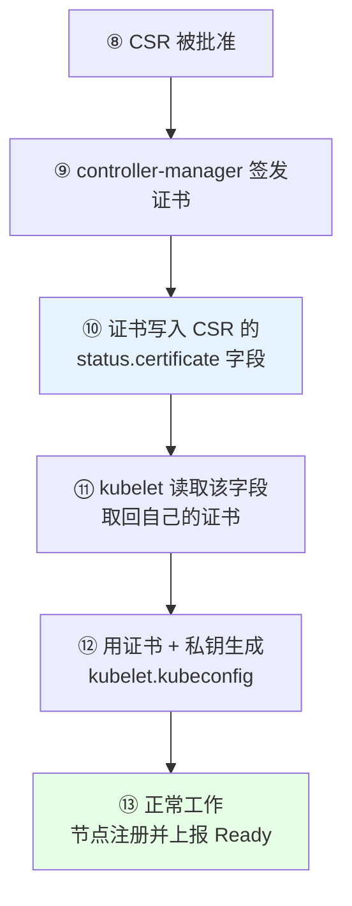
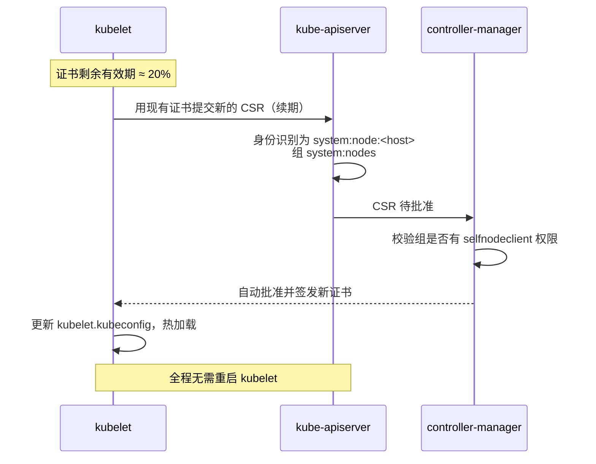
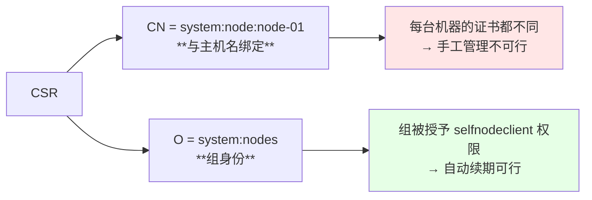
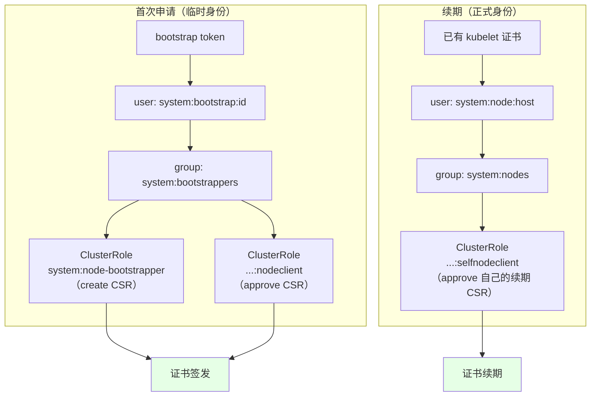
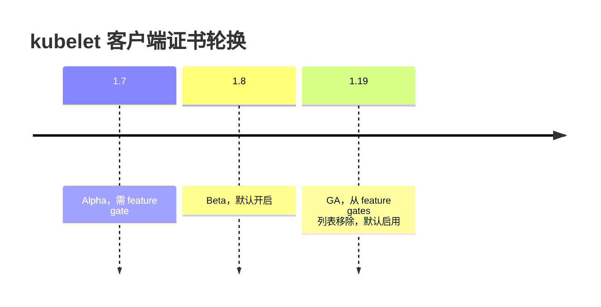
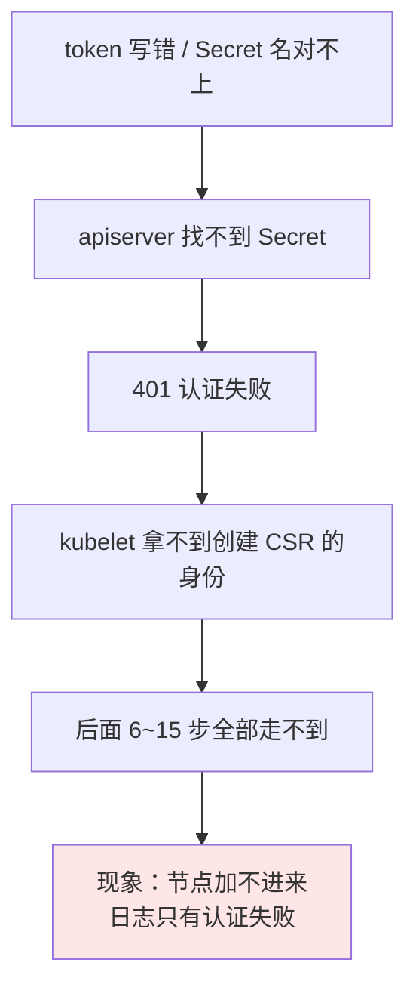

# Kubernetes 集群部署: Bootstrapping 证书自动续期原理与配置

上一节讲到 controller-manager 批准 CSR、签发证书为止。但签发完还有后半程：证书怎么回到 kubelet 手里、以及**证书快过期时怎么自动续**。后者是生产集群能不能「装完就不管」的关键。

结论先给：

- **签发之后还有四步**：证书写回 CSR 的 `status.certificate` → kubelet 取回 → 生成 `kubelet.kubeconfig` → 正常工作；
- **续期用的是另一套权限**：续期 CSR 属于 `system:nodes` 组，需要 `selfnodeclient` 类型的 ClusterRole 绑到这个组上才会被自动批准；
- **1.19 起轮换已 GA 且默认打开**，不用配 feature gate，也不用给 kubelet / controller-manager 加额外参数。

## 纲要

- 从批准到可用的后半程四步
- 证书续期：一次「持证续约」
- 续期 CSR 的身份：CN 与 O
- 续期权限：selfnodeclient 与 system:nodes 组
- 三层 RBAC 的分工对比
- 1.19 之后哪些参数不用再配
- token 写错是唯一的致命点

## 从批准到可用的后半程四步

批准不是终点，kubelet 还得把证书拿回来：



关键点：**证书是塞回 CSR 对象的 `status.certificate` 字段里交还给 kubelet 的**，不是 apiserver 主动推给 kubelet。所以 kubelet 侧要 watch 自己的 CSR，等 status 被填上再去取。

```text
CSR 对象的字段
├── spec
│   ├── signerName: kubernetes.io/kube-apiserver-client-kubelet
│   ├── request: <base64 的证书申请>
│   └── usages: [client auth]
└── status
    ├── conditions: [{type: Approved}]
    └── certificate: <base64 的签好名的证书>   ← kubelet 从这里取
```

## 证书续期：一次「持证续约」

证书快过期时，kubelet **用当前已有的 `kubelet.kubeconfig` 去申请一张新证书** —— 这跟给域名续费是同一件事：旧证还在有效期内，用它证明身份，换一张新的。



与首次申请的关键区别：**首次用 bootstrap token（临时身份），续期用已有证书（正式身份）**。身份不同，走的 RBAC 分支也不同 —— 这就是为什么首次申请的自动批准和续期的自动批准是两条独立的 ClusterRoleBinding。

## 续期 CSR 的身份：CN 与 O

kubelet 正式证书的标识：

| 字段 | 值 | 类比 |
| --- | --- | --- |
| **CN**（Common Name） | `system:node:<节点主机名>` | 相当于申请证书时填的域名，如 `www.baidu.com` |
| **O**（Organization） | `system:nodes` | 相当于所属组织 |



正因为 CN 里带主机名，**每台 Node 的证书都不一样**，这也从根上解释了为什么 Node 必须用 Bootstrapping 而不能手工签。

## 续期权限：selfnodeclient 与 system:nodes 组

续期的自动批准靠第三个 ClusterRole：

```yaml
apiVersion: rbac.authorization.k8s.io/v1
kind: ClusterRoleBinding
metadata:
  name: node-server-auto-approve   # 文档间命名可能不同，先确认本集群的名字
roleRef:
  apiGroup: rbac.authorization.k8s.io
  kind: ClusterRole
  name: system:certificates.k8s.io:certificatesigningrequests:selfnodeclient
subjects:
  - apiGroup: rbac.authorization.k8s.io
    kind: Group
    name: system:nodes
```

controller-manager 的 CSR 控制器收到续期请求时，检查「这个 CSR 的 O 是不是 `system:nodes`、这个组有没有 selfnodeclient 权限」，有就自动签。

## 三层 RBAC 的分工对比

Bootstrapping 全链路一共三张 ClusterRoleBinding，各管一段：

| 阶段 | 身份 | 需要的权限 | 绑定的组 |
| --- | --- | --- | --- |
| **首次申请** | `system:bootstrap:<id>` | 创建 CSR（node-bootstrapper） | `system:bootstrappers` |
| **首次批准** | `system:bootstrap:<id>` | 批准 CSR（nodeclient） | `system:bootstrappers` |
| **续期** | `system:node:<host>` | 批准自己的续期 CSR（**selfnodeclient**） | `system:nodes` |



**少了 selfnodeclient 那一层，现象是：首次加入一切正常，一年后续期 CSR 卡在 Pending。** 这种故障有延迟性，很容易被忽略，装集群时务必备齐。

## 1.19 之后哪些参数不用再配

| 项 | 1.18 及以前 | 1.19 |
| --- | --- | --- |
| kubelet 证书轮换 feature gate | `RotateKubeletClientCertificate=true`（Beta，需显式开） | **GA，默认 true，不用配** |
| controller-manager 的轮换相关参数 | 需要显式配置 | **默认打开，不用配** |
| `token.csv` 静态 token 文件 | 可用 | **改用 bootstrap token Secret**，文档里已移除 |



（演进节点以官方 CHANGELOG 为准。）

因为 GA 后参数从 feature gates 里移除了，**在 1.19 上按老文档去找 `--feature-gates=RotateKubeletClientCertificate=true` 会找不到** —— 这不是没配，是不用配了。同样，controller-manager 上注释掉的那些旧参数也是同理。

证书有效期（controller-manager 的 `--experimental-cluster-signing-duration`）仍然可以调，但**有自动续期兜底时，这个值的意义就没那么大了**。

## token 写错是唯一的致命点

整套链路里，唯一会让后面所有步骤全部失效的地方是 **bootstrap token 写错**：



排查顺序固定：先看 `kube-system` 下 `bootstrap-token-<id>` 的 Secret 是否存在、名字是否和 `bootstrap.kubeconfig` 里的 token id 一致，再看 token secret 是否匹配。

## API 速览

| 能力 | 命令 |
| --- | --- |
| 看 CSR 列表 | `kubectl get csr` |
| 看 CSR 的证书字段 | `kubectl get csr <name> -o jsonpath='{.status.certificate}'` |
| 看续期绑定的 ClusterRoleBinding | `kubectl get clusterrolebinding \| grep -i selfnode` |
| 看 selfnodeclient Role 详情 | `kubectl describe clusterrole system:certificates.k8s.io:certificatesigningrequests:selfnodeclient` |
| 看 kubelet 证书 CN/O | `openssl x509 -in <crt> -noout -subject` |
| 看 kubelet 证书到期 | `openssl x509 -in <crt> -noout -dates` |
| 手工批准续期 | `kubectl certificate approve <csr-name>` |
| 看 kubelet 轮换配置 | `grep -i rotateCertificates /var/lib/kubelet/config.yaml` |

## Demo 示例

检查续期链路是否完整（很多集群缺的就是这一层）：

```bash
#!/usr/bin/env bash
# bootstrap-renew-audit.sh —— 检查 kubelet 证书续期链路
set -uo pipefail

rc=0
ok()  { printf '  [OK]   %s\n' "$*"; }
bad() { printf '  [FAIL] %s\n' "$*"; rc=1; }
warn(){ printf '  [WARN] %s\n' "$*"; }

echo "=== 1. 续期所需的 ClusterRoleBinding ==="
if kubectl get clusterrolebinding --no-headers 2>/dev/null | grep -qi 'selfnodeclient\|selfnodeserver\|node-server'; then
  kubectl get clusterrolebinding --no-headers | awk '/selfnode|node-server/{print "    "$1" → "$2}'
  ok "存在 selfnodeclient 相关的自动续期绑定"
else
  bad "缺少 selfnodeclient 绑定：证书到期后续期 CSR 会卡在 Pending"
fi

echo "=== 2. 续期权限绑到哪个组 ==="
kubectl get clusterrolebinding --no-headers 2>/dev/null | awk '/selfnode|node-server/{print $1}' | while read -r b; do
  kubectl get clusterrolebinding "$b" -o jsonpath='{range .subjects[*]}{.kind}/{.name}{"\n"}{end}' 2>/dev/null | sed "s|^|    $b → |"
done

echo "=== 3. kubelet 轮换是否开启 ==="
CFG="${CFG:-/var/lib/kubelet/config.yaml}"
if [ -f "$CFG" ]; then
  grep -i 'rotateCertificates' "$CFG" | sed 's/^/    /'
  grep -qi 'rotateCertificates: *true' "$CFG" \
    && ok "kubelet 已开启 rotateCertificates" \
    || warn "未显式开启（1.19 起默认 true，可不配）"
fi

echo "=== 4. 各节点证书到期时间 ==="
for n in $(kubectl get node --no-headers -o custom-columns=NAME:.metadata.name 2>/dev/null); do
  printf '    %-16s 需到节点上用 openssl 查看 /var/lib/kubelet/pki/\n' "$n"
done
echo "    节点上执行: openssl x509 -in /var/lib/kubelet/pki/kubelet-client-current.pem -noout -dates -subject"

echo "=== 5. 当前 Pending 的 CSR ==="
P=$(kubectl get csr --no-headers 2>/dev/null | awk '$2=="Pending"{print $1}')
[ -z "$P" ] && ok "无 Pending CSR" || { warn "以下 CSR 待批准:"; echo "$P" | sed 's/^/    /'; }

echo
[ $rc -eq 0 ] && echo "续期链路检查通过。" || echo "存在 FAIL 项，证书到期后会出问题。"
exit $rc
```

### 总结

Bootstrapping 的价值不在「第一次把证书签出来」，而在「之后每年都能自动续上」—— 后者才是几百台规模下真正省事的地方。

- **签发后还有四步**：证书写进 CSR 的 `status.certificate` → kubelet 取回 → 生成 `kubelet.kubeconfig` → 正常工作。
- **续期是持证续约**：用现有证书（剩余约 20% 时）申请新证书，身份从 `system:bootstrap:*` 变成 `system:node:*`。
- **续期走另一套 RBAC**：`selfnodeclient` 权限绑到 `system:nodes` 组，缺了它就是「第一年正常、第二年卡住」。
- **CN 是 `system:node:<主机名>`、O 是 `system:nodes`**：CN 带主机名决定了 Node 证书必须一台一份，手工管理不可行。
- **1.19 起轮换已 GA 且默认开启**：不用配 feature gate，老文档里的 `--feature-gates=RotateKubeletClientCertificate=true` 在 1.19 上找不到是正常的。
- **token 写错会让后面所有步骤失效**：排查先查 `bootstrap-token-<id>` Secret 名与 token id 是否一致。

