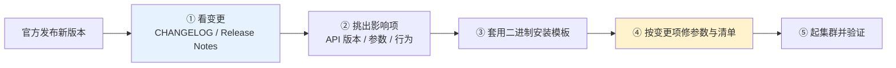
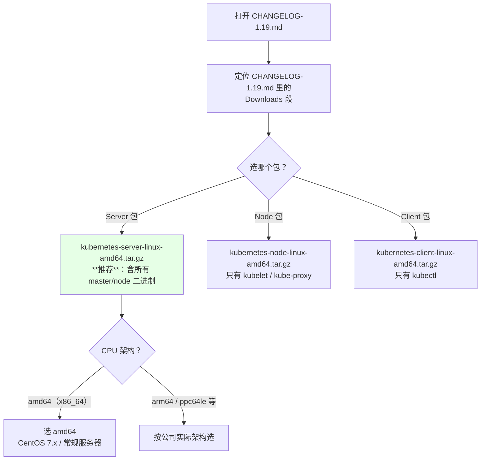
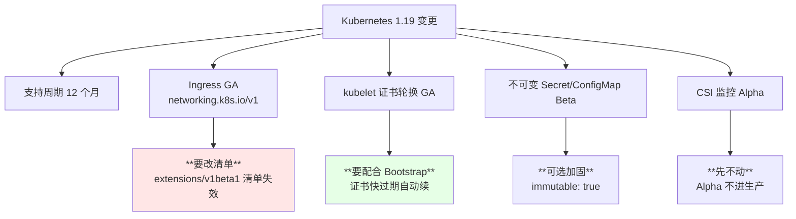
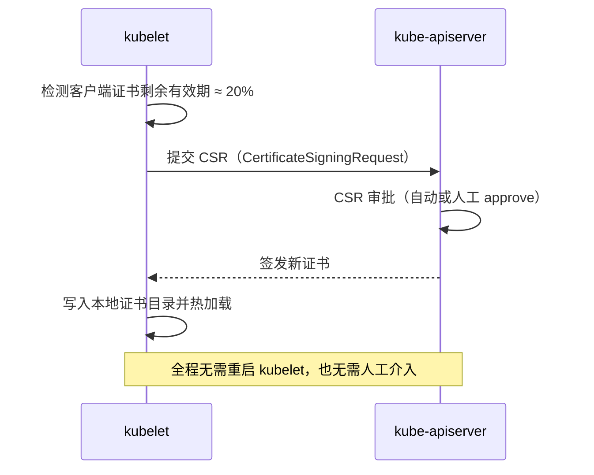
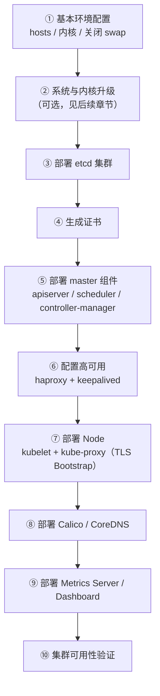

# Kubernetes 集群部署: 二进制安装 1.19 的版本说明与升级前变更评估

官方发了新版本，第一反应不应该是「赶紧装上」，而是「它改了什么、哪条会打到我」。二进制安装本身是一套**与版本无关的模板**：下载 server 二进制包、发证书、写 systemd、拉起组件，这套流程在 1.16 和 1.19 上几乎没有差别。真正随版本变化的，是**参数、API 版本和默认行为**。

结论先给：

- **二进制安装文档是模板，别把它和某个版本绑死**：学会这套流程，1.20、1.21 出来自己也能装；
- **装之前先看 CHANGELOG**，只挑影响面大的几项看，不用通读；
- 1.19 真正要记住的就四条：**支持周期延长到 12 个月、Ingress 升为 GA（`networking.k8s.io/v1`）、kubelet 证书轮换 GA、不可变 Secret/ConfigMap 进 Beta**。

## 纲要

- 二进制安装为什么与版本无关
- 升级前要看变更的两个官方入口
- 1.19 值得关注的四个变更点
- 下载二进制包时的架构与包型选择
- 变更评估落到安装文档的哪几处
- 安装顺序总览

## 二进制安装为什么与版本无关

二进制安装拆开就是固定的几件事，和版本号基本正交：

```text
二进制安装的固定骨架（与版本无关）
├── ① 下载 server 二进制包
│   ├── kubernetes-server-linux-amd64.tar.gz
│   └── 解出 kube-apiserver / kube-scheduler / kube-controller-manager
│       ├── kubelet / kube-proxy / kubectl
├── ② 准备证书（CA → 各组件证书）
├── ③ 写组件配置（kubeconfig + 启动参数）
├── ④ 写 systemd unit 并拉起
├── ⑤ 部署 CNI / CoreDNS
└── ⑥ Node 用 TLS Bootstrapping 接入
```

变的部分只有两块：**启动参数的增删**（新版本加 `--xxx`、废弃 `--yyy`）和 **API 版本**（`extensions/v1beta1` → `networking.k8s.io/v1`）。所以「学会一套流程」比「记住某个版本的命令」有价值得多。



## 变更信息的两个官方入口

同一个数据源，两个入口，任选其一：

| 入口 | 位置 | 特点 |
| --- | --- | --- |
| GitHub CHANGELOG | `github.com/kubernetes/kubernetes` → `CHANGELOG/` → `CHANGELOG-1.19.md` | **最全**，含每个 PR 级别的变化，同时提供二进制包下载链接 |
| 官网 Release Notes | `kubernetes.io` → Documentation → Getting started → Release notes | **跟着发布版本变**（下个版本就换成 1.20 release notes），排版更友好 |

两份内容同源，都是 `CHANGELOG` 生成的。英语吃力的话不必硬啃：**社区公众号 / 博客会摘重点**，搜「Kubernetes 1.19」即可。

## 下载二进制包时的两个坑



- **一律下 Server 包**：它包含 master 与 node 两侧的全部二进制，Node 包只有 kubelet / kube-proxy，master 组件还得另下；
- **架构别选错**：`uname -m` 看到 `x86_64` 就选 `amd64`，ARM 服务器选 `arm64`。选错的解包结果是「cannot execute binary file」。

## 1.19 值得关注的四个变更

Kubernetes 核心资源（Deployment、StatefulSet、Service）已经趋于稳定，每版本的改动集中在边缘能力上。1.19 里与安装/运维直接相关的有四条：

| 变更 | 状态变化 | 对安装与运维的影响 |
| --- | --- | --- |
| **支持周期延长到 12 个月** | 9 个月 → **12 个月** | 升级节奏可以放缓，但跨版本升级前仍要逐版本检查废弃项 |
| **Ingress 升为 GA** | `networking.k8s.io/v1beta1` → **`networking.k8s.io/v1`** | 老的 `extensions/v1beta1` 清单要重写；字段结构变了（`spec.rules[].http.paths[].backend` 改为 `service.name` + `service.port`） |
| **kubelet 证书轮换 GA** | 1.18 Beta → **1.19 GA** | 证书剩余有效期约 20% 时 kubelet 自动向 apiserver 申请新证书；配 TLS Bootstrapping 时直接受益 |
| **不可变 Secret / ConfigMap** | 1.18 Alpha → **1.19 Beta** | 可加 `immutable: true`，防止错误配置被热更新推给业务容器 |
| **CSI 存储监控** | Alpha | 只加监控能力，生产先别依赖 |



### Ingress 升 GA 的具体影响

这是四条里**唯一会直接让旧清单 apply 失败**的一条：

```text
Ingress API 版本演进
├── extensions/v1beta1              ← 1.19 之前常见，1.19 起废弃
├── networking.k8s.io/v1beta1       ← 过渡版本
└── networking.k8s.io/v1            ← 1.19 GA，新清单一律用它
        ├── spec.rules[].http.paths[].backend.service.name
        └── spec.rules[].http.paths[].backend.service.port.number
```

升级前后各写一份做对比，是最省事的验证方式：老集群上 `kubectl get ingress -o yaml` 导出，用新 API 重写后 apply 到 1.19 集群，看字段是否被接受。

### kubelet 证书轮换为什么重要

二进制安装里 kubelet 的客户端证书是自己签的，默认一年有效期。没有轮换就得人工在到期前重签、重启 kubelet，机器一多就是灾难。



配合 TLS Bootstrapping 的自动审批，整条链路就是「装一次，之后自动续」。

## 变更评估落到安装文档的哪几处

看完 CHANGELOG 之后，把这三条带回安装文档里改：

| 变更类型 | 落到文档的哪一步 | 例子 |
| --- | --- | --- |
| API 版本变更 | 资源清单（yaml） | Ingress 改成 `networking.k8s.io/v1` |
| 启动参数增删 | systemd unit / 配置文件 | 新参数加上，废弃参数删掉，否则组件起不来 |
| 默认行为变化 | kubelet 配置 / apiserver 授权 | 证书轮换要打开 `rotateCertificates: true` |

二进制安装的组件分布在固定的目录里，改参数时知道去哪找：

```text
/opt/kubernetes/            # 二进制与证书根目录（示例）
├── bin/
│   ├── kube-apiserver
│   ├── kube-controller-manager
│   ├── kube-scheduler
│   ├── kubelet
│   ├── kube-proxy
│   └── kubectl
├── cfg/
│   ├── kube-apiserver.conf
│   ├── kube-controller-manager.conf
│   ├── kube-scheduler.conf
│   ├── kubelet.conf
│   ├── kube-proxy.conf
│   ├── bootstrap.kubeconfig
│   └── kube-proxy.kubeconfig
├── ssl/
│   ├── ca.pem / ca-key.pem
│   └── 各组件证书
└── logs/
```

## 安装顺序总览



## API 速览

| 能力 | 命令 / 位置 |
| --- | --- |
| 看集群版本 | `kubectl version --short` |
| 看某资源的可用 API 版本 | `kubectl api-resources \| grep ingress` |
| 看当前集群支持哪些 API 组 | `kubectl api-versions \| grep networking` |
| 下载 server 二进制包 | CHANGELOG 页面 → `kubernetes-server-linux-amd64.tar.gz` |
| 确认 CPU 架构 | `uname -m`（`x86_64` → 选 `amd64`） |
| 看 kubelet 证书剩余有效期 | `openssl x509 -in /var/lib/kubelet/pki/kubelet-client-current.pem -noout -enddate` |
| 手动批准 CSR | `kubectl certificate approve <csr-name>` |

## Demo 示例

装之前先看变更，这个脚本把「下载 server 包 + 校验版本」自动化：

```bash
#!/usr/bin/env bash
# fetch-k8s-server.sh —— 拉取指定版本的 Kubernetes server 二进制包并解包
set -euo pipefail

K8S_VERSION="${K8S_VERSION:-v1.19.0}"
ARCH="${ARCH:-amd64}"
WORKDIR="${WORKDIR:-/opt/src}"

DL="https://dl.k8s.io/${K8S_VERSION}/kubernetes-server-linux-${ARCH}.tar.gz"
echo "==> 目标版本: ${K8S_VERSION}  架构: ${ARCH}"
echo "==> 下载地址: ${DL}"

mkdir -p "${WORKDIR}"
cd "${WORKDIR}"

if [ ! -f "kubernetes-server-linux-${ARCH}.tar.gz" ]; then
  curl -fSL -o "kubernetes-server-linux-${ARCH}.tar.gz" "${DL}"
fi

# 校验是真 tar.gz，而不是 404 页面
file "kubernetes-server-linux-${ARCH}.tar.gz" | grep -q 'gzip' \
  || { echo "下载失败：不是 gzip 文件，请检查版本号是否带 v 前缀"; exit 1; }

tar -zxf "kubernetes-server-linux-${ARCH}.tar.gz"
BIN="kubernetes/server/bin"
for b in kube-apiserver kube-controller-manager kube-scheduler kubelet kube-proxy kubectl; do
  [ -x "${BIN}/${b}" ] || { echo "缺少 ${b}"; exit 1; }
  printf '  %-26s %s\n' "${b}" "$("${BIN}/${b}" --version 2>/dev/null | head -1)"
done
echo "==> 解包完成，二进制位于 ${WORKDIR}/${BIN}"
```

看完变更再决定装不装，别反过来：

```bash
#!/usr/bin/env bash
# changelog-diff.sh —— 快速定位某版本 CHANGELOG 里的关键变更分类
set -euo pipefail

VER="${VER:-1.19}"
FILE="${FILE:-CHANGELOG-1.19.md}"

[ -f "${FILE}" ] || { echo "找不到 ${FILE}，先从 github.com/kubernetes/kubernetes 的 CHANGELOG 目录下载"; exit 1; }

echo "=== ${VER} 中被废弃（Deprecated）的项 ==="
grep -n -i 'deprecat' "${FILE}" | head -20

echo
echo "=== ${VER} 中被移除（Removed）的项 ==="
grep -n -i 'is removed\|has been removed\|no longer' "${FILE}" | head -20

echo
echo "=== ${VER} 中 API 版本变化的项 ==="
grep -n -E 'v1beta1|v1alpha1|promoted to|graduat' "${FILE}" | head -20

echo
echo "=== ${VER} 中 kubelet 相关变化 ==="
grep -n -i 'kubelet' "${FILE}" | head -20
```

### 总结

新版本出来先读变更、再动手装，这个顺序不能反 —— 二进制安装的步骤是模板，会变的只有参数、API 版本和默认行为。

- **二进制安装是模板能力**：下载 server 包、发证书、写 unit、起组件，这套流程跨版本通用，学会它比记住某个版本的命令值钱。
- **变更只看两个官方入口**：GitHub `CHANGELOG/` 目录最全，官网 Release Notes 排版更好，两者同源；英文吃力就看社区摘录。
- **下 Server 包、选对架构**：Server 包含 master + node 全部二进制；`uname -m` 是 `x86_64` 就选 `amd64`。
- **1.19 只记四条**：支持周期 12 个月、Ingress 升 `networking.k8s.io/v1`（旧清单要改）、kubelet 证书轮换 GA、不可变 Secret/ConfigMap 进 Beta。
- **Alpha 特性不要进生产**：CSI 监控这类 Alpha 能力看看就好，等转 Beta 再用。

