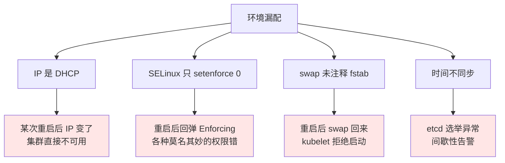
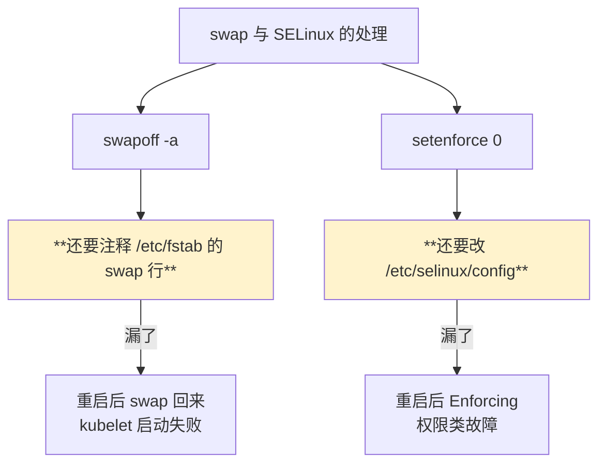
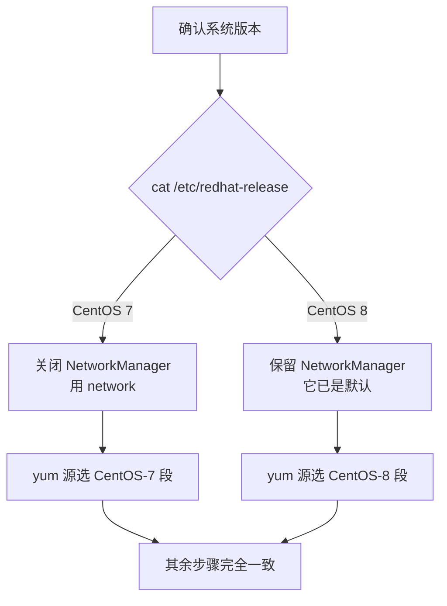
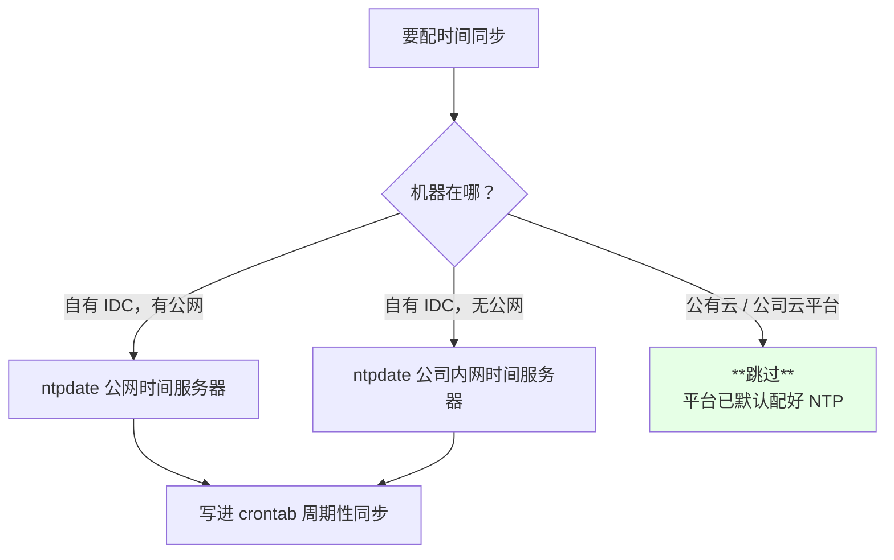
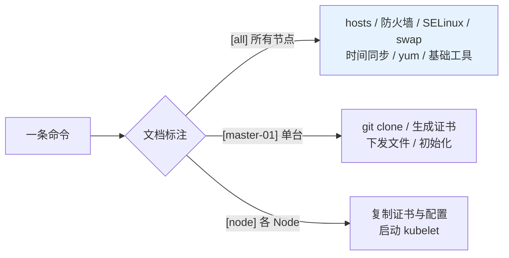

# Kubernetes 集群部署: 二进制安装前的基本环境配置清单

二进制安装文档很长，但**流程是固定的** —— 从 1.12 用到 1.19，变的只是个别配置文件和参数。真正会让人翻车的，往往是安装之前那些「谁都会、但总有人漏」的环境准备：IP 不是静态的、SELinux 没关、swap 没关、时间不同步。

结论先给：

- **IP 必须静态**：Master 绑定 IP，重启后 IP 变了集群直接散；
- **SELinux 必须 disabled 且改配置文件**，只 `setenforce 0` 重启就回弹；
- **swap 必须关 + 注释 fstab**，否则 kubelet 起不来；
- **时间必须同步**：etcd 对时间敏感，偏移会导致集群告警甚至故障；
- **文档里的 IP 要全局替换**，一个一个改必漏。

## 纲要

- 为什么基本环境比安装步骤更容易翻车
- 主机与网络：静态 IP、hosts、主机名通信
- 安全与内核：SELinux、防火墙、swap
- CentOS 7 与 CentOS 8 的差异点
- 时间同步：为什么必须做、怎么做
- 免密登录与基础工具
- yum 源与安装文件准备
- 操作约定：哪些命令在几台上执行

## 为什么基本环境比安装步骤更容易翻车

安装步骤是文档照抄的，错了现象明显（组件起不来）。基本环境的坑是**延迟发作**：



演示环境用的是 3 台（可扩到 5 台）虚拟机，**2 核 2G / 40G 磁盘**，网络用**桥接模式**（直接连家里的路由器拿 IP）。桥接的好处是宿主机能直接连，但**必须把 IP 配成静态** —— DHCP 会在重启后换 IP。

## 主机与网络：静态 IP、hosts、主机名通信

```text
/etc/hosts（所有节点一致）
10.0.0.101  master-01
10.0.0.102  master-02
10.0.0.103  master-03
10.0.0.106  node-01
10.0.0.107  node-02
10.0.0.100  master-lb      # VIP，keepalived 虚拟或 F5 地址
```

配 hosts 的好处：**不用记 IP，用主机名通信**。换 IP 时只改这一处，不用到每个配置文件里翻。

| 项 | 要求 | 说明 |
| --- | --- | --- |
| IP | **静态** | 不能 DHCP；Master 组件绑定 IP |
| 主机名 | 各机器唯一 | 二进制安装的证书与主机名绑定 |
| hosts | 所有节点一致 | 主机名互解析 |
| VIP | keepalived 虚拟或 F5 | **F5 时不会绑到某台机器的网卡**，但要保证节点与 F5 地址互通 |


**全局替换是硬性要求**：文档里同一个 IP 会出现很多次，逐个替换必然遗漏，而漏掉的那处往往要到最后验证阶段才暴露。

## 安全与内核：SELinux、防火墙、swap

```bash
# 所有节点
systemctl disable --now firewalld
systemctl disable --now dnsmasq     # 没有则忽略

# SELinux：必须改配置文件，只 setenforce 0 重启会回弹
setenforce 0
sed -i 's#^SELINUX=enforcing#SELINUX=disabled#' /etc/selinux/config

# swap：临时关 + 注释 fstab，否则重启后回来
swapoff -a
sed -i '/ swap / s/^/#/' /etc/fstab
```



swap 对 Kubernetes 的性能有影响（kubelet 默认要求关闭 swap 才能启动），关掉是标准做法。

## CentOS 7 与 CentOS 8 的差异

同一个文档要覆盖两个大版本，差异只有寥寥几处：

| 项 | CentOS 7 | CentOS 8 |
| --- | --- | --- |
| NetworkManager | **建议关闭**（多数人没配它，关了用 network） | **默认使用，不要关** |
| 时间同步组件 | ntp | chrony（但课程习惯装 ntp） |
| yum 源 | `CentOS-7` 源 | `CentOS-8` 源 |
| 内核升级包 | `kernel-lt` / `kernel-ml` 的 el7 版 | 对应的 el8 版 |



新加 Node 节点时，这几项**同样要做** —— 最容易忘的就是新节点的 SELinux。

## 时间同步：为什么必须做

etcd 的通信**对时间有要求**：节点间时间偏移过大会导致 etcd 集群告警、选举异常，严重的直接故障。

```bash
# 所有节点
yum install -y ntp
timedatectl set-timezone Asia/Shanghai
ntpdate time1.aliyun.com

# 写成计划任务，周期性同步
crontab -e
*/1 * * * * /usr/sbin/ntpdate time1.aliyun.com >/dev/null 2>&1
```

| 场景 | 做法 |
| --- | --- |
| 有公网 | 同步阿里云等公网时间服务器 |
| 无公网 | **同步公司自己的时间服务器** |
| 公司云平台 | **云平台已内置 NTP，跳过这步**（再执行 ntpdate 反而会失败） |



## 免密登录与基础工具

在 master-01 上生成密钥并分发到所有节点，**只是为了传文件方便**（证书、二进制要复制到各台）：

```bash
ssh-keygen -t rsa          # 一路回车
ssh-copy-id master-02
ssh-copy-id master-03
ssh-copy-id node-01
ssh-copy-id node-02
```

基础工具（`wget`、`curl`、`vim`、`net-tools`、`lsof`、`telnet`、`nc` 等）**所有节点都要装**，不然后面排查时连 `nc` 都没有。

## yum 源与安装文件准备

Docker 从官方源装非常慢，**换成阿里云源**：

```bash
# 所有节点
curl -o /etc/yum.repos.d/docker-ce.repo https://mirrors.aliyun.com/docker-ce/linux/centos/docker-ce.repo
yum makecache
```

安装文件（课程资料）在 **master-01** 上克隆下来即可：

```bash
git clone https://github.com/xxx/k8s-ha-install.git
cd k8s-ha-install
git branch -a            # 看远程分支：1.16 / 1.17 / 1.18 / 1.19
git checkout 1.19        # 切到对应版本分支
```

各分支内容**差别很小**，1.19 的分支和 1.18 的几乎一致 —— 这正印证了开头那句话：二进制安装是模板。

```text
master-01 上的目录结构（克隆后）
k8s-ha-install/
├── bootstrap/            # bootstrap.kubeconfig / token Secret
├── pki/                  # 证书生成脚本与 CSR 模板
│   └── kubelet-csr.json  # O=system:nodes, CN=system:node:<host>
├── metrics-server-0.3.7/
├── dashboard/
│   └── recommended.yaml
├── calico/
├── coredns/
└── systemd/              # 各组件的 service 文件
```

## 操作约定：哪些命令在几台上执行

用 Xshell / FinalShell 的「**发送到所有会话**」可以一次操作多台，但要看清文档标注：



用「发送到所有会话」时要留意**光标位置**，不同窗口的命令行位置可能不一致，容易敲错。

## API 速览

| 能力 | 命令 |
| --- | --- |
| 看系统版本 | `cat /etc/redhat-release` |
| 看 IP | `ip addr` / `nmcli device show` |
| 设时区 | `timedatectl set-timezone Asia/Shanghai` |
| 同步时间 | `ntpdate time1.aliyun.com` |
| 关 SELinux | `sed -i 's#^SELINUX=enforcing#SELINUX=disabled#' /etc/selinux/config` |
| 关 swap | `swapoff -a && sed -i '/ swap / s/^/#/' /etc/fstab` |
| 免密分发 | `ssh-copy-id <host>` |
| 换 Docker 源 | `curl -o /etc/yum.repos.d/docker-ce.repo https://mirrors.aliyun.com/docker-ce/linux/centos/docker-ce.repo` |
| 看资料分支 | `git branch -a` |
| 切分支 | `git checkout <branch>` |

## Demo 示例

把这一节的检查项做成脚本，装之前先跑一遍：

```bash
#!/usr/bin/env bash
# base-env-check.sh —— 二进制安装前的基本环境自检（只读）
set -uo pipefail

rc=0
ok()  { printf '  [OK]   %s\n' "$*"; }
bad() { printf '  [FAIL] %s\n' "$*"; rc=1; }
warn(){ printf '  [WARN] %s\n' "$*"; }

echo "=== 1. 系统版本 ==="
[ -f /etc/redhat-release ] && cat /etc/redhat-release | sed 's/^/    /'

echo "=== 2. 主机名与 hosts 解析 ==="
HN=$(hostname -s)
echo "    hostname: $HN"
grep -q "[[:space:]]${HN}[[:space:]]*$" /etc/hosts \
  && ok "/etc/hosts 已解析 $HN" || bad "/etc/hosts 缺少 $HN 映射"
for h in master-01 master-02 master-03 master-lb; do
  grep -q "[[:space:]]${h}[[:space:]]*$" /etc/hosts || warn "/etc/hosts 未定义 $h"
done

echo "=== 3. IP 是否静态 ==="
NMCON=$(nmcli -t -f ipv4.method con show --active 2>/dev/null | head -1)
echo "    NetworkManager ipv4.method: ${NMCON:-未知}"
echo "$NMCON" | grep -qi 'manual' && ok "IP 为静态（manual）" || bad "IP 可能为 DHCP，必须改成静态"
grep -Rqi 'BOOTPROTO=dhcp' /etc/sysconfig/network-scripts/ 2>/dev/null \
  && bad "网卡配置仍是 BOOTPROTO=dhcp" || ok "网卡配置非 dhcp"

echo "=== 4. 防火墙 ==="
systemctl is-active --quiet firewalld && bad "firewalld 在运行" || ok "firewalld 未运行"

echo "=== 5. SELinux ==="
CUR=$(getenforce 2>/dev/null)
CFG=$(awk -F= '/^SELINUX=/{print $2}' /etc/selinux/config 2>/dev/null)
echo "    当前: ${CUR}    配置: ${CFG}"
[ "$CFG" = "disabled" ] && ok "配置文件已 disabled" || bad "配置文件为 ${CFG}，重启会回弹"

echo "=== 6. swap ==="
SWAPN=$(swapon --show 2>/dev/null | wc -l | tr -d ' ')
[ "$SWAPN" = "0" ] && ok "swap 已关闭" || bad "swap 仍启用"
grep -E '^[^#].*[[:space:]]swap[[:space:]]' /etc/fstab \
  && bad "/etc/fstab 里 swap 未注释，重启会回来" || ok "/etc/fstab 已注释 swap"

echo "=== 7. 时间同步 ==="
echo "    当前时间: $(date '+%F %T %Z')"
echo "    时区: $(timedatectl 2>/dev/null | awk -F': ' '/Time zone/{print $2}')"
command -v ntpdate >/dev/null && ok "已安装 ntpdate" || warn "未安装 ntpdate（云平台可忽略）"
crontab -l 2>/dev/null | grep -q ntpdate && ok "已配置 crontab 周期同步" || warn "未配置周期性同步"

echo "=== 8. 基础工具 ==="
for c in wget curl vim nc lsof telnet tar git sshpass; do
  command -v "$c" >/dev/null || warn "缺少命令: $c"
done
ok "基础工具检查完成"

echo "=== 9. yum 源 ==="
ls /etc/yum.repos.d/ 2>/dev/null | sed 's/^/    /'
grep -rl 'mirrors.aliyun.com' /etc/yum.repos.d/ >/dev/null 2>&1 \
  && ok "已配置阿里云源" || warn "未发现阿里云源，装 docker 会很慢"

echo
[ $rc -eq 0 ] && echo "基本环境检查通过。" || echo "存在 FAIL 项，处理完再继续安装。"
exit $rc
```

### 总结

基本环境这节没有技术难度，但漏一项就要在后面付出十倍的排查成本 —— 而且多数是重启后才发作。

- **IP 必须静态**：Master 组件绑定 IP，DHCP 换 IP 等于集群散架。
- **hosts 全节点一致**：用主机名通信，换 IP 只改一处。
- **文档里的 IP 要全局替换（Ctrl+H）**，逐个改必漏。
- **SELinux 改配置文件、swap 注释 fstab**：只做运行时关闭，重启就回弹。
- **时间必须同步**：etcd 对时间敏感；云平台已内置 NTP 的可以跳过。
- **CentOS 7 关 NetworkManager，CentOS 8 保留**：这是两个版本在本文档里的主要差异。
- **master-01 配免密 + 克隆安装资料**：只是为了传文件方便，分支内容差别很小，印证了「二进制安装是模板」。

