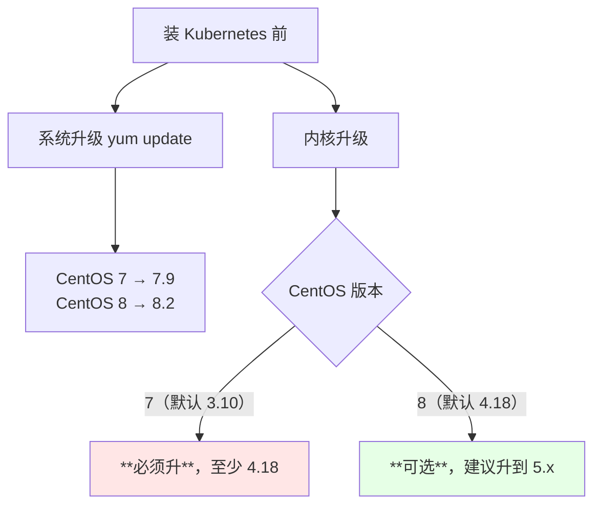
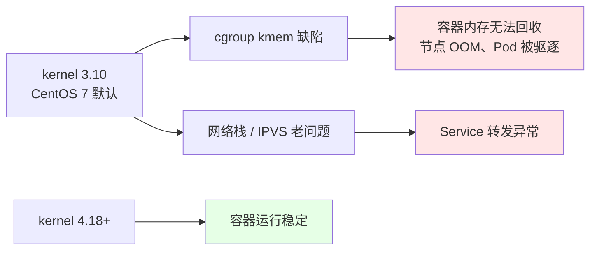
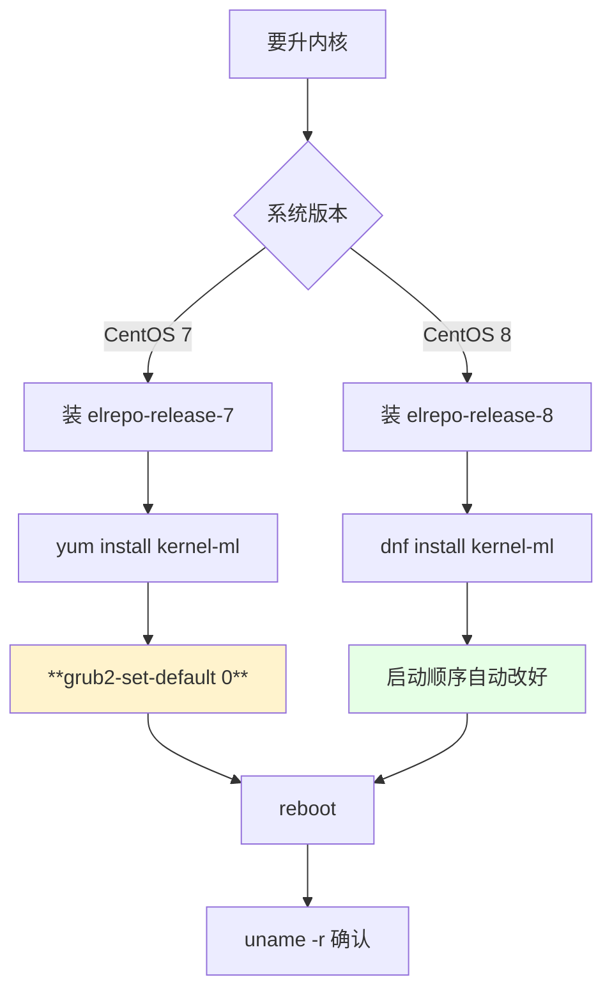

# Kubernetes 集群部署: 二进制安装前的系统与内核升级

基本环境配完，下一步是系统与内核升级。系统升级是**建议项**，内核升级在 CentOS 7 上是**必做项** —— 默认的 3.10 内核跑 Docker 和 Kubernetes 有实实在在的问题（cgroup 内存泄漏、网络栈缺陷等）。

结论先给：

- **CentOS 7 必须升内核**：默认 3.10 太低，**至少升到 4.18 以上**，一般直接上最新稳定版；
- **CentOS 8 可选升级**：默认内核就是 4.18，可以直接用，也建议升；
- **CentOS 7 用 yum，升级后要手动改内核启动顺序再重启；CentOS 8 用 dnf，会自动改启动顺序**。

## 纲要

- 系统升级与内核升级的区别
- 为什么 CentOS 7 必须升内核
- CentOS 7 的升级步骤
- CentOS 8 的升级步骤
- 两个版本的操作差异对比
- 重启后如何确认生效

## 系统升级与内核升级的区别

| 项 | 是否必须 | 作用 |
| --- | --- | --- |
| **系统升级**（`yum update`） | 建议，非必须 | 把系统包（openssl、glibc 等）升到小版本最新，修一些已知问题 |
| **内核升级** | **CentOS 7 必须；CentOS 8 可选** | 3.10 内核跑容器有缺陷，4.18+ 才稳 |



系统升级很耗时，可以选择性做；但**内核升级在 CentOS 7 上没得选**。

## 为什么 CentOS 7 必须升内核

CentOS 7 默认内核是 3.10。这个版本上跑 Docker 和 Kubernetes 会遇到：

- **cgroup 内存相关的问题**（kmem accounting 缺陷，导致容器无法回收内存、节点莫名 OOM）；
- 网络栈与 IPVS 模块的老问题；
- 部分内核特性缺失，导致 kube-proxy / CNI 行为异常。

所以**必须升到 4.18 以上**。想精确停在 4.18 也可以（旧课程 / 博客里有完整步骤），一般直接升到最新稳定版即可。



## CentOS 7 的升级步骤

```bash
# 1. 导入 ELRepo 的公钥并安装源（所有节点）
rpm --import https://www.elrepo.org/RPM-GPG-KEY-elrepo.org
yum install -y https://www.elrepo.org/elrepo-release-7.el7.elrepo.noarch.rpm

# 2. 查看可用内核版本
yum --disablerepo="*" --enablerepo="elrepo-kernel" list available

# 3. 安装最新主线内核（ml = mainline）或长期支持版（lt = long term）
yum --enablerepo=elrepo-kernel install -y kernel-ml

# 4. 查看已安装内核的启动顺序
awk -F\' '$1=="menuentry " {print i++ " : " $2}' /etc/grub2.cfg

# 5. 设置默认启动内核为刚装的那个（序号按上一条输出）
grub2-set-default 0

# 6. 重启
reboot

# 7. 确认
uname -r
```

> 装 `kernel-ml`（主线最新）还是 `kernel-lt`（长期支持）？生产环境倾向 `lt`，演示/跟随课程一般用 `ml`。

```text
CentOS 7 升级内核后的关键动作
├── yum --enablerepo=elrepo-kernel install kernel-ml
├── **grub2-set-default 0**        ← 手动改启动顺序，容易漏
├── grub2-mkconfig -o /boot/grub2/grub.cfg   （必要时重建）
└── reboot                          ← 必须重启才生效
```

## CentOS 8 的升级步骤

CentOS 8 默认内核已经是 4.18，**可以直接用，不升级也没问题**。要升就用 dnf（CentOS 8 推荐用 dnf 管理 rpm 包，yum 已经不推荐）：

```bash
# 1. 安装 ELRepo 源（所有节点）
rpm --import https://www.elrepo.org/RPM-GPG-KEY-elrepo.org
dnf install -y https://www.elrepo.org/elrepo-release-8.el8.elrepo.noarch.rpm

# 2. 查看可用内核
dnf --disablerepo="*" --enablerepo="elrepo-kernel" list available

# 3. 升级内核（dnf 会自动修改内核启动顺序）
dnf --enablerepo=elrepo-kernel install -y kernel-ml

# 4. 重启
reboot

# 5. 确认（示例输出为 5.x）
uname -r
```

**dnf 会自动帮你改内核启动顺序**，这是它比 yum 省事的地方 —— CentOS 7 上必须手动 `grub2-set-default`。

## 两个版本的操作差异对比

| 步骤 | CentOS 7 | CentOS 8 |
| --- | --- | --- |
| 默认内核 | 3.10（**必须升**） | 4.18（可直接使用） |
| 包管理器 | `yum` | **`dnf`**（推荐） |
| ELRepo 源包 | `elrepo-release-7.el7.elrepo.noarch.rpm` | `elrepo-release-8.el8.elrepo.noarch.rpm` |
| 内核启动顺序 | **手动 `grub2-set-default`** | **dnf 自动处理** |
| 重启 | 必须 | 必须 |
| 建议目标版本 | ≥ 4.18 | 5.x（可选） |



## 重启后如何确认生效

```bash
uname -r                      # 看当前内核版本
cat /etc/redhat-release       # 看系统版本
```

命中不了新内核的常见原因：

| 现象 | 原因 |
| --- | --- |
| 重启后还是老内核 | **忘了 `grub2-set-default`**（CentOS 7） |
| 启动菜单里看不到新内核 | `grub2-mkconfig` 没重建，或 GRUB 配置文件路径不对（UEFI 机器是 `/boot/efi/EFI/centos/grub.cfg`） |
| 装了但没重启 | 内核必须重启才生效 |

## API 速览

| 能力 | 命令 |
| --- | --- |
| 看当前内核 | `uname -r` |
| 看系统版本 | `cat /etc/redhat-release` |
| CentOS 7 装 ELRepo | `yum install -y https://www.elrepo.org/elrepo-release-7.el7.elrepo.noarch.rpm` |
| CentOS 8 装 ELRepo | `dnf install -y https://www.elrepo.org/elrepo-release-8.el8.elrepo.noarch.rpm` |
| 列出可用内核 | `yum --disablerepo="*" --enablerepo="elrepo-kernel" list available` |
| 装主线内核 | `yum --enablerepo=elrepo-kernel install -y kernel-ml` |
| 看启动项 | `awk -F\' '$1=="menuentry " {print i++ " : " $2}' /etc/grub2.cfg` |
| 设默认启动项 | `grub2-set-default 0` |
| 系统升级 | `yum update -y` / `dnf update -y` |

## Demo 示例

升级前先看看现状，再决定要不要升：

```bash
#!/usr/bin/env bash
# kernel-upgrade-check.sh —— 内核与系统版本检查（只读）
set -uo pipefail

MIN_OK="4.18"
rc=0
ok()  { printf '  [OK]   %s\n' "$*"; }
bad() { printf '  [FAIL] %s\n' "$*"; rc=1; }
warn(){ printf '  [WARN] %s\n' "$*"; }

CUR=$(uname -r)
echo "=== 当前内核 ==="
echo "    ${CUR}"
MAJOR=$(echo "$CUR" | awk -F. '{print $1}')
MINOR=$(echo "$CUR" | awk -F. '{print $2}')

if [ "$MAJOR" -gt 4 ]; then
  ok "内核 ${MAJOR}.${MINOR} 高于 4.18，可以跑 Kubernetes"
elif [ "$MAJOR" -eq 4 ] && [ "$MINOR" -ge 18 ]; then
  ok "内核 ${MAJOR}.${MINOR} 满足最低要求（>= 4.18）"
else
  bad "内核 ${MAJOR}.${MINOR} 低于 4.18，必须升级（CentOS 7 默认 3.10 会出问题）"
fi

echo "=== 系统版本 ==="
[ -f /etc/redhat-release ] && sed 's/^/    /' /etc/redhat-release
MAJVER=$(awk -F'release ' '{print $2}' /etc/redhat-release 2>/dev/null | cut -d. -f1)
echo "    大版本: ${MAJVER:-未知}"
case "${MAJVER:-}" in
  7) echo "    → CentOS 7：用 yum 升级，装完必须 grub2-set-default 再 reboot" ;;
  8) echo "    → CentOS 8：用 dnf 升级，dnf 会自动改启动顺序" ;;
  *) warn "未能识别的大版本" ;;
esac

echo "=== 已安装的内核包 ==="
rpm -qa 2>/dev/null | grep '^kernel' | sort | sed 's/^/    /'

echo "=== 当前默认启动项 ==="
if command -v grub2-editenv >/dev/null; then
  grub2-editenv list 2>/dev/null | sed 's/^/    /'
fi
if [ -f /etc/grub2.cfg ]; then
  awk -F\' '$1=="menuentry " {print "    " i++ " : " $2}' /etc/grub2.cfg
fi
[ -f /boot/efi/EFI/centos/grub.cfg ] && warn "UEFI 机器请检查 /boot/efi/EFI/centos/grub.cfg"

echo "=== 包管理器 ==="
command -v dnf >/dev/null && echo "    dnf: $(dnf --version 2>/dev/null | head -1)" || echo "    dnf: 未安装"
command -v yum >/dev/null && echo "    yum: $(yum --version 2>/dev/null | head -1)" || echo "    yum: 未安装"

echo
[ $rc -eq 0 ] && echo "内核满足要求。" || echo "请先升级内核再继续。"
exit $rc
```

### 总结

系统升级可以缓，内核升级不能省 —— 尤其在 CentOS 7 上，3.10 内核跑容器是有明确缺陷的。

- **CentOS 7 必须升内核，至少 4.18**：默认 3.10 有 cgroup 内存回收等缺陷，会导致节点 OOM、Service 转发异常。
- **CentOS 8 可选**：默认就是 4.18，可以直接用，想升就升到 5.x。
- **CentOS 7 用 yum 且必须手动改启动顺序**：`grub2-set-default 0` 后 reboot，漏了这步重启还是老内核。
- **CentOS 8 用 dnf，自动改启动顺序**，这是它最省事的一点。
- **`kernel-ml`（主线）与 `kernel-lt`（长期支持）**：生产倾向 `lt`，跟随课程一般用 `ml`。
- **UEFI 机器的 GRUB 配置路径不同**（`/boot/efi/EFI/centos/grub.cfg`），找不到启动项时先确认路径。

