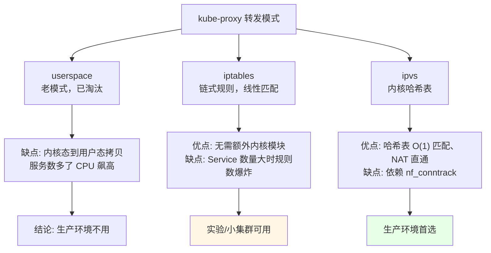
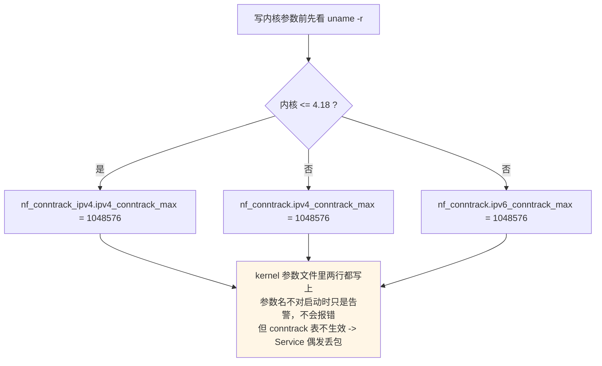

# Kubernetes 集群部署: 二进制基本组件安装（IPVS 内核模块 / 容器运行时 / kube 二进制）

系统内核升级完，接下来才是「装东西」。这一节回答一个问题：**二进制部署 k8s 1.19 之前，每台机器上必须先铺好哪些底层组件**。

结论先给：

- **kube-proxy 生产环境一律走 IPVS 模式**，iptables 只适合小集群；但 IPVS 不等于装了 ipvs 就完事，**内核模块 `ip_vs` / `nf_conntrack` 必须能加载**，否则 kube-proxy 起不来还找不到原因；
- IPVS 模式下 **conntrack 表必须存在**，CentOS 8 要把 Docker 剥离出去的 `conntrack` 单独装回来（最新版 1.2.13-3）；
- **Docker 的 cgroup driver 必须改成 `systemd`**（k8s 官方建议），默认的 `cgroupfs` 会和 kubelet 抢 cgroupfs，节点一忙就出现资源统计错乱；
- kube / etcd 二进制**解压即用**，不需要装包管理，最后靠 `/etc/hosts` 用主机名分发到全部节点。

## 纲要

- IPVS 与 iptables 两种转发模式的选型
- IPVS 依赖组件与内核模块的安装与开机加载
- conntrack 与系统内核调优参数
- 容器运行时 Docker 的安装与 cgroup driver 修正
- kube 与 etcd 二进制的下载、校验与分发
- 每步验证清单与常见排错

## IPVS 与 iptables 的选型



注意一个很容易被忽略的点：**选了 IPVS，并不代表只用 IPVS**。IPVS 负责做负载均衡的哈希表，但包过滤、SNAT、`ipset` 匹配这些**还是得靠 iptables**，所以课程里那句「IPVS 里面很多东西还是用到了 iptables」是准确的 —— **两个都得留着，不能因为「用 IPVS」就把 iptables 相关包卸了**。

```text
单台主机上和转发相关的组件分工：
├── 用户态
│   ├── kube-proxy        # 读 Service/Endpoint，生成内核规则
│   ├── ipvsadm           # 手动增删 LVS 规则，排障时用它看实际规则
│   └── iptables / ipset  # 包过滤 + NAT，IPVS 也要借它做 SNAT
└── 内核态
    ├── ip_vs 系列模块      # 五类调度算法、连接保持
    ├── nf_conntrack_ipv4  # 连接跟踪表（4.19 以下要带 ipv4 后缀）
    └── br_netfilter       # 网桥转发时是否走 iptables 规则
```

| 模式 | 匹配复杂度 | 适用规模 | 依赖内核模块 | 生产建议 |
| --- | --- | --- | --- | --- |
| userspace | 内核态 → 用户态拷贝 | 几乎不用 | 无 | 淘汰 |
| iptables | 链式线性遍历 | 几十个 Service 以内 | `iptable_*` | 测试 / 小集群 |
| ipvs | 哈希表 O(1) | 几百上千 Service | `ip_vs*` + `nf_conntrack` | **生产首选** |

## 安装 IPVS 依赖并加载内核模块

```bash
# 1. 装 IPVS 用的管理组件（ipvsadm 只是查询/排障用，核心是 kernel module）
yum install -y conntrack ipvsadm ipset jq iptables ipvs

# 2. 确认内核模块
uname -r
# 5.8.x- (CentOS 8 上课程演示的就是 5.8)
lsmod | grep -E 'ip_vs|nf_conntrack'
```

### 内核版本 ≤ 4.18 的坑

`nf_conntrack` 这个参数**在 4.19 之前必须写成 `nf_conntrack_ipv4`**，4.19 之后内核把 IPv4/IPv6 合并，才改成 `nf_conntrack`：



上面这个文件里：**上半部分是给 IPVS 用的，下半部分是给 kube-proxy 用的**（`net.bridge.bridge-nf-call-iptables` 这类参数是给桥接网络走 iptables 规则用的，Calico 强依赖它）。

```bash
cat > /etc/sysctl.d/k8s.conf <<'EOF'
# ---- IPVS 相关 ----
net.ipv4.ip_forward = 1
net.bridge.bridge-nf-call-ip6tables = 1
net.bridge.bridge-nf-call-iptables = 1

# conntrack 表：4.19 以下要带 _ipv4 后缀，带错了只是不生效
net.nf_conntrack_ipv4.ipv4_conntrack_max = 1048576
net.nf_conntrack_ipv4.ipv4_conntrack_buckets = 524288

# ---- kube-proxy / Calico 相关 ----
net.ipv4.ip_local_port_range = "32768 60999"
net.ipv4.tcp_tw_recycle = 0
net.ipv4.tcp_max_syn_backlog = 32768
fs.inotify.max_user_instances = 512
fs.inotify.max_user_watches = 1048576
kernel.pid_max = 4194304
EOF

# 立即生效
sysctl --system
```

### 开机自动加载模块

```bash
cat > /etc/modules-load.d/ipvs.conf <<'EOF'
ip_vs
ip_vs_rr
ip_vs_wrr
ip_vs_sh
ip_vs_dh
nf_conntrack
br_netfilter
EOF

# 校验：模块已经加载进来了
lsmod | grep -E 'ip_vs|nf_conntrack'
# nf_conntrack_ipv4       163840  0
# ip_vs                   143360  10 ip_vs_dh,ip_vs_sh,ip_vs_rr,ip_vs_wrr
```

| 检查项 | 命令 | 正常输出 |
| --- | --- | --- |
| 内核版本 | `uname -r` | 5.8.x（CentOS 8） |
| IPVS 模块 | `lsmod \| grep ip_vs` | 能看到 `ip_vs`、`ip_vs_rr` 等 |
| conntrack 模块 | `lsmod \| grep nf_conntrack` | 能看到 `nf_conntrack_ipv4` |
| 内核参数 | `sysctl -a \| grep conntrack_max` | 返回 1048576 |
| conntrack 工具 | `conntrack -L \| wc -l` | 数字 > 0（有连接时） |

## 容器运行时 Docker

CentOS 8 上要注意：**`conntrack` 已经被 Docker 拆出去单独维护了**，所以 yum 里默认不给你装，必须手动装；CentOS 7 反而是跟着依赖一起来的。

```bash
# 查最新版本（课程录制时是 1.2.13-3）
yum list --showduplicates conntrack 2>/dev/null | tail -3
conntrack.x86_64      1.2.13-3.el8    @System

# _install_conntrack 用 wget 直接从仓库拉，比配 epel 快
wget https://mirrors.aliyun.com/centos/8/BaseOS/x86_64/os/Packages/conntrack-1.2.13-3.el8.x86_64.rpm
yum install -y conntrack-1.2.13-3.el8.x86_64.rpm
```

### Docker 装最新版并改 cgroup driver

```bash
yum install -y yum-utils device-mapper-persistent-data lvm2
yum-config-manager --add-repo https://mirrors.aliyun.com/docker-ce/linux/centos/docker-ce.repo
yum install -y docker-ce docker-ce-cli containerd.io
docker version
# Server Engine: 19.03.12
```

关键一步：**改 cgroup driver**。k8s 官方从 1.14 起就建议 `systemd`，因为 `cgroupfs` 会和 systemd 管理的 cgroupfs 分层冲突。

```bash
mkdir -p /etc/docker

cat > /etc/docker/daemon.json <<'EOF'
{
  "exec-opts": ["native.cgroupdriver=systemd"],
  "registry-mirrors": [
    "https://docker.mirrors.ustc.edu.cn",
    "https://hub-mirror.c.163.com",
    "https://registry.docker-cn.com"
  ],
  "log-driver": "json-file",
  "log-opts": {
    "max-size": "100m",
    "max-file": "3"
  },
  "live-restore": true
}
EOF

mkdir -p /etc/systemd/system/docker.service.d
systemctl daemon-reload
systemctl enable --now docker
```

> `exec-opts` 里写 `native.cgroupdriver=systemd`，这个字段只对 **Docker Engine** 生效；containerd 作为运行时时要走 `SystemdCgroup = true`（config.toml）。本课程 1.19 用的是 Docker，所以走前者。

验证 driver 真的生效：

```bash
docker info | grep -i cgroup
# Cgroup Driver: systemd          <-- 必须是 systemd
docker info | grep -iE 'Kernel Version|Registry'
# Kernel Version: 5.8.x
# Registry: https://registry.docker-cn.com
```

| 项 | 默认值 | 课程做法 | 不改的后果 |
| --- | --- | --- | --- |
| `cgroup driver` | `cgroupfs` | `systemd` | 节点高负载时 `docker stats` 与 `kubectl top` 数据不一致，甚至 kubelet 起不来 |
| `registry-mirrors` | 无 | 配国内源 | 拉镜像慢到怀疑人生 |
| `log-opts` | 无限增长 | 单文件 100m / 最多 3 个 | 磁盘被日志吃满，Pod 莫名被驱逐 |
| `live-restore` | `false` | `true` | docker daemon 重启时已有容器跟着一起死 |

## 下载并分发 kube / etcd 二进制

```bash
# kube 1.19.0（k8s 官方下载页 → server → binary 拿链接）
wget https://dl.k8s.io/v1.19.0/kubernetes-server-linux-amd64.tar.gz

# etcd 3.4.12+
wget https://github.com/etcd-io/etcd/releases/download/v3.4.12/etcd-v3.4.12-linux-amd64.tar.gz
```

```text
/opt/k8s/bin 最终布局（解压后手工归位）：
├── k8s
│   ├── kube-apiserver        # 1.19.0
│   ├── kube-controller-manager
│   ├── kube-scheduler
│   ├── kubectl               # 客户端
│   └── kube-proxy
├── etcd
│   ├── etcd                  # 3.4.12
│   └── etcdctl
└── cni
    └── bin                   # /opt/cni/bin，CNI 二进制目录
```

**二进制文件 = Go 编译产物，解压出来就能跑，没有安装步骤**：

```bash
mkdir -p /opt/k8s/{bin,cfg,ssl,logs}
tar -xf kubernetes-server-linux-amd64.tar.gz
cp -r kubernetes/server/bin/* /opt/k8s/bin/
chmod +x /opt/k8s/bin/*

tar -xf etcd-v3.4.12-linux-amd64.tar.gz
cp etcd-v3.4.12-linux-amd64/etcd /opt/k8s/bin/
cp etcd-v3.4.12-linux-amd64/etcdctl /opt/k8s/bin/

# 版本号校验（版本号不对，后面一堆证书/参数对不上）
/opt/k8s/bin/kube-apiserver --version
# Kubernetes v1.19.0
/opt/k8s/bin/etcd --version
# etcd Version: 3.4.12
```

| 组件 | 课程版本 | 备注 |
| --- | --- | --- |
| Docker | 19.03.12 | 装的是最新版当时的稳定分支 |
| kubernetes | 1.19.0 | 后续可能发布 1.19.1 / 1.19.2，按官方 release 页取 |
| etcd | 3.4.12 | Certificate 相关参数在 3.4 已改成切片写法 |
| conntrack | 1.2.13-3.el8 | CentOS 8 需单独装 |
| CNI | 不单独装 | Calico 自带，**这一步可以省掉** |

### 分发到全部节点

因为 `/etc/hosts` 已经配好主机名互相可达，所以直接**用主机名 scp，不要用 IP**：

```bash
# 只在 master-01 上做一次，先把包推过去
for NODE in master-02 master-03 node-01 node-02 node-03; do
  scp -r /opt/k8s $NODE:/opt/
  scp /etc/modules-load.d/ipvs.conf $NODE:/etc/modules-load.d/ipvs.conf
  scp /etc/sysctl.d/k8s.conf $NODE:/etc/sysctl.d/k8s.conf
done

# 每台节点都建 CNI 目录
for NODE in master-01 master-02 master-03 node-01 node-02 node-03; do
  ssh $NODE 'mkdir -p /opt/cni/bin /opt/k8s/{cfg,ssl,logs}'
  ssh $NODE 'sysctl --system'
done
```

关于 **CNI 目录**：课程里原本要建 `/opt/cni/bin`，但**这一步现在可以省掉** —— Calico 自带 cni-plugin 二进制，安装时会自动落盘；flannel 也是同理。真正需要自己往 `/opt/cni/bin` 丢插件的场景只有「用自研/第三方 CNI 二进制」时才出现。

网络插件选型上课程以 **Calico** 为主讲，理由是 **Calico 支持 NetworkPolicy（网络策略）**，而 flannel 在当时的版本还不支持网络策略。

## API 速览

| 能力 | 做法 | 关键命令 / 字段 |
| --- | --- | --- |
| 让 IPVS 规则能被管理 | 装 `ipvsadm` + 加载 `ip_vs` 系列模块 | `modprobe ip_vs_rr`、`lsmod \| grep ip_vs` |
| 让 conntrack 表够大 | 内核参数放大 + 开机加载 | `net.nf_conntrack_ipv4.ipv4_conntrack_max` |
| 桥接流量走 iptables | 打开 bridge-nf 三项 | `net.bridge.bridge-nf-call-iptables=1` |
| 容器 cgroup 统一成 systemd | Docker `exec-opts` | `native.cgroupdriver=systemd` |
| 镜像加速 | 配镜像源列表 | `registry-mirrors` 数组 |
| 日志不撑爆磁盘 | 限制单文件大小与轮转 | `log-opts.max-size` / `max-file` |
| 免密钥分发二进制 | 主机名可解析 + scp | `scp /opt/k8s $NODE:/opt/` |
| 确认二进制版本可用 | 直接 `--version` | `kube-apiserver --version` |

## Demo 示例

一个**逐台铺底层组件**的脚本：探测内核版本 → 决定 conntrack 参数名 → 装依赖 → 写 docker 配置 → 分发二进制 → 校验。

```bash
#!/usr/bin/env bash
# bootstrap-node.sh —— 在单台节点上铺好 IPVS / conntrack / docker / kube 二进制
# 用法: ./bootstrap-node.sh [master-01 master-02 ...]
set -euo pipefail

NODES="${*:-master-01}"
K8S_VERSION="v1.19.0"
ETCD_VERSION="v3.4.12"

log() { printf '\n[boot] %s\n' "$*"; }
die() { printf '\n[boot] ERROR: %s\n' "$*" >&2; exit 1; }

log "0. 探测环境"
KERNEL=$(uname -r)
LOGICAL_CPUS=$(nproc)
MEM_GB=$(awk '/MemTotal/ {printf "%d", $2/1024/1024}' /proc/meminfo)
echo "  内核:   $KERNEL"
echo "  CPU:    $LOGICAL_CPUS 核"
echo "  内存:   ${MEM_GB}G"
major_minor="$(echo "$KERNEL" | cut -d. -f1,2)"
# 4.19 之前 conntrack 参数必须带 _ipv4 后缀，这是最常踩的坑
if [ "$major_minor" = "4.18" ] || [ "$major_minor" = "4.17" ] || [ "$major_minor" = "4.16" ]; then
  CONNTRACK_KEY="net.nf_conntrack_ipv4.ipv4_conntrack_max"
else
  CONNTRACK_KEY="net.nf_conntrack.ipv4_conntrack_max"
fi
echo "  conntrack 参数: $CONNTRACK_KEY"

log "1. 装 IPVS / conntrack 依赖"
yum install -y conntrack ipvsadm ipset jq iptables

log "2. 写内核模块与内核参数"
cat > /etc/modules-load.d/ipvs.conf <<'EOF'
ip_vs
ip_vs_rr
ip_vs_wrr
ip_vs_sh
ip_vs_dh
nf_conntrack
br_netfilter
EOF

cat > /etc/sysctl.d/k8s.conf <<EOF
net.ipv4.ip_forward = 1
net.bridge.bridge-nf-call-ip6tables = 1
net.bridge.bridge-nf-call-iptables = 1
${CONNTRACK_KEY} = 1048576
net.ipv4.ip_local_port_range = "32768 60999"
net.ipv4.tcp_max_syn_backlog = 32768
fs.inotify.max_user_instances = 512
fs.inotify.max_user_watches = 1048576
kernel.pid_max = 4194304
EOF
sysctl --system

log "3. 校验模块真的加载进来了"
for MOD in ip_vs ip_vs_rr nf_conntrack br_netfilter; do
  if lsmod | grep -q "$MOD"; then
    echo "  [OK] $MOD"
  else
    modprobe "$MOD" || die "模块 $MOD 加载失败，请检查内核是否编译了该模块"
    echo "  [OK] $MOD (modprobe)"
  fi
done

log "4. 装 Docker 并改 cgroup driver"
yum install -y docker-ce docker-ce-cli containerd.io
mkdir -p /etc/docker
cat > /etc/docker/daemon.json <<'EOF'
{
  "exec-opts": ["native.cgroupdriver=systemd"],
  "registry-mirrors": ["https://docker.mirrors.ustc.edu.cn"],
  "log-driver": "json-file",
  "log-opts": { "max-size": "100m", "max-file": "3" },
  "live-restore": true
}
EOF
systemctl daemon-reload
systemctl enable --now docker
for _ in $(seq 1 30); do
  docker info >/dev/null 2>&1 && break
  sleep 2
done
grep -i 'cgroup driver' <(docker info) | sed 's/^/  /'
docker info | grep -qi 'Cgroup Driver: systemd' || die "cgroup driver 不是 systemd，kubeadm 后期会报 cgroup mismatch"

log "5. 下载 kube / etcd 二进制"
mkdir -p /opt/k8s/{bin,cfg,ssl,logs} /opt/cni/bin
cd /opt/k8s
[ -f kubernetes-server-linux-amd64.tar.gz ] || \
  wget -q "https://dl.k8s.io/${K8S_VERSION}/kubernetes-server-linux-amd64.tar.gz"
[ -f etcd-v3.4.12-linux-amd64.tar.gz ] || \
  wget -q "https://github.com/etcd-io/etcd/releases/download/${ETCD_VERSION}/etcd-v3.4.12-linux-amd64.tar.gz"
tar -xf kubernetes-server-linux-amd64.tar.gz
cp -f kubernetes/server/bin/* /opt/k8s/bin/ && chmod +x /opt/k8s/bin/*
tar -xf etcd-v3.4.12-linux-amd64.tar.gz
cp -f etcd-v3.4.12-linux-amd64/etcd etcd-v3.4.12-linux-amd64/etcdctl /opt/k8s/bin/ && chmod +x /opt/k8s/bin/*

log "6. 版本校验"
/opt/k8s/bin/kube-apiserver --version | sed 's/^/  /'
/opt/k8s/bin/etcd --version | head -1 | sed 's/^/  /'

log "7. 分发到其余节点（依赖 /etc/hosts 主机名可达）"
for NODE in $NODES; do
  scp -r /opt/k8s "$NODE":/opt/
  scp /etc/modules-load.d/ipvs.conf "$NODE":/etc/modules-load.d/ipvs.conf
  scp /etc/sysctl.d/k8s.conf "$NODE":/etc/sysctl.d/k8s.conf
  ssh "$NODE" 'sysctl --system'
  echo "  [OK] $NODE"
done

log "8. 收尾提示"
cat <<'TIP'
  下一节: 生成所有组件的证书（ca/kube-apiserver/etcd/... 一套自签 CA）
  已经可以用 hostname 互访; 若 /etc/hosts 漏了节点, scp 分发会卡住
  排障: dmesg | grep -i conntrack
        journalctl -u docker -n 100 --no-pager
TIP
```

## 总结

二进制部署最难的不是命令，而是**顺序**和**每步都要验证**。

- **生产环境 kube-proxy 走 IPVS，但 iptables 不能卸**：IPVS 做负载均衡哈希表， iptables 做包过滤和 SNAT，两者是配合关系。
- **`nf_conntrack_ipv4` vs `nf_conntrack` 是内核版本分水岭**：≤ 4.18 必须带 `_ipv4` 后缀，4.19 之后才合并；写错不会报错，只会「conntrack 表没生效，Service 偶发丢包」。
- **conntrack 工具 CentOS 8 要单独装**（Docker 把它从依赖里摘出去了），用 wget 直接从仓库拉 1.2.13-3 即可。
- **Docker 的 cgroup driver 一定要改成 `systemd`**：`docker info | grep -i cgroup` 必须看到 `Cgroup Driver: systemd`，否则后期 kubelet 与容器运行时对 cgroup 的归属判断会打架。
- **kube / etcd 是解压即用的二进制**，靠 `--version` 校验版本即可；分发用主机名 scp（前提是 `/etc/hosts` 已配全）；`/opt/cni/bin` 现在可以省掉，Calico 会自己落盘 CNI 插件。

