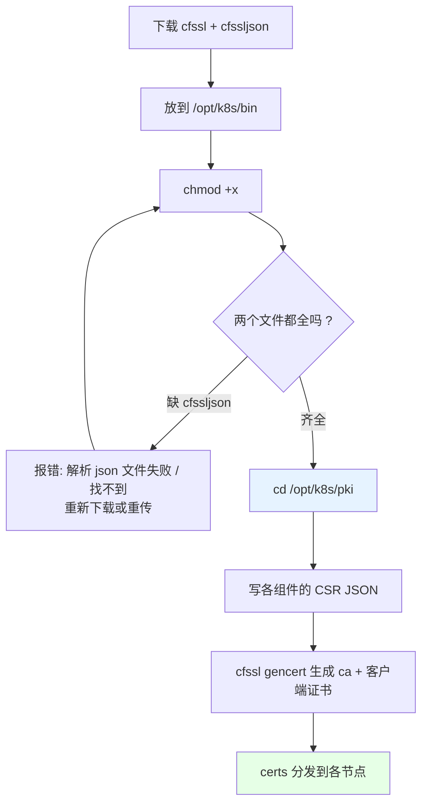
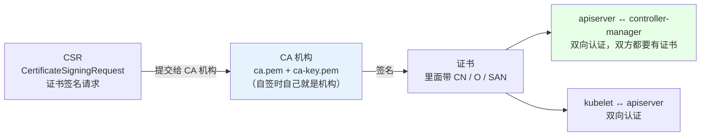
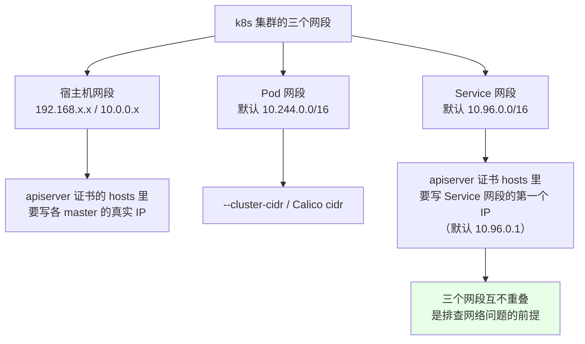
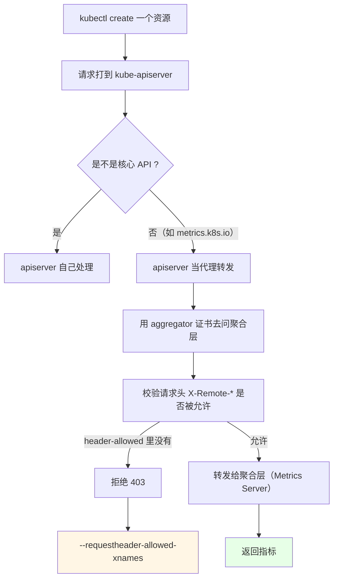
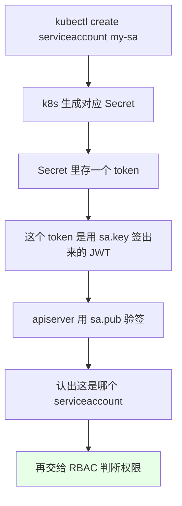

# Kubernetes 集群部署: 二进制生成证书详解（cfssl 自签 CA 与 etcd / apiserver 等组件证书）

二进制安装 k8s 最关键的一步在这里：**所有证书都在这一个节点上生成，再分发到其它节点**。证书错一步，整个集群起不来 —— 反过来讲，**证书生成对了，二进制安装就完成了百分之八十**。

结论先给：

- 用 **cfssl** 生成（不是 openssl，也可以用 openssl，原理一样）：下载 `cfssl` 和 `cfssljson` 两个文件到 `/opt/k8s/bin` 并**加执行权限**，缺一个就会报「解析 json 文件失败 / 找不到」；
- **etcd 证书和 k8s 证书完全隔离**，两套独立的 CA，互不影响；
- **所有 k8s 组件共用同一个根 CA（`ca.pem` / `ca-key.pem`）** 去颁发各自的客户端证书：apiserver、controller-manager、scheduler、admin、aggregator；
- **apiserver 一定要预留扩容 IP / 主机名**（多写几个 SAN），将来加 master 不用重签；
- **区分「谁」靠 CSR 里的 CN 和 O**：`CN=admin, O=system:masters` → 绑 `cluster-admin`；`CN=system:kube-scheduler` → 绑调度权限。CN/O 写错，组件起来也是没权限；
- CA 的 `expiry` 改成 **100 年**，自签证书一次性解决过期烦恼（公证书一年一换，自签没必要）。

## 纲要

- cfssl 工具的安装与目录规划
- CSR / CA / 双向认证的关系
- etcd 独立 CA 与客户端证书
- k8s 根 CA 与 apiserver 服务端证书
- 聚合证书（aggregator）的作用
- controller-manager / scheduler / admin 客户端证书与 CN/O 权限
- kubeconfig 的生成
- ServiceAccount 的 key 与 kubeconfig 分发
- 证书分发、有效期与排错

## cfssl 工具的安装与目录规划



```bash
# 在 master-01 上操作（所有证书都在这里生成，再分发）
mkdir -p /opt/k8s/{bin,pki/etcd,ssl,cfg}

# cfssl 官方仓库下载慢，也可以用镜像源；两个都要
wget https://github.com/cloudflare/cfssl/releases/download/v1.15.0/cfssl_1.15.0_linux_amd64
wget https://github.com/cloudflare/cfssl/releases/download/v1.15.0/cfssljson_1.15.0_linux_amd64

cp cfssl_1.15.0_linux_amd64 /opt/k8s/bin/cfssl
cp cfssljson_1.15.0_linux_amd64 /opt/k8s/bin/cfssljson
chmod +x /opt/k8s/bin/cfssl /opt/k8s/bin/cfssljson

# 校验工具可用（不如这步就往下写配置，后面全是莫名其妙的报错）
CFSSL=/opt/k8s/bin/cfssl
$CFSSL version 2>/dev/null | head -2 || /opt/k8s/bin/cfssl version
```

```text
/opt/k8s/pki 目录最终形态（每个服务器都要有）：
├── etcd
│   ├── ca-csr.json      # etcd 根 CA 的签名请求
│   ├── ca.json          # CA 配置（含 100 年有效期）
│   ├── server-csr.json  # etcd 服务端 / 客户端
│   ├── ca.pem / ca-key.pem
│   ├── server.pem / server-key.pem
│   └── (可选 client.pem / client-key.pem)
├── etcd-csr.json        # etcd 作为 k8s 客户端时的 CSR
├── ca-csr.json          # k8s 根 CA 的签名请求
├── ca-config.json       # k8s CA 策略（ profiles: server / client）
├── apiserver-csr.json   # 服务端证书 + SAN（VIP / 各 master IP / service IP）
├── aggregator-csr.json  # 聚合层代理证书
├── controller-manager-csr.json
├── scheduler-csr.json
├── admin-csr.json       # CN=admin, O=system:masters
└── sa.key / sa.pub      # ServiceAccount 的签发密钥
```

**每台服务器都要建这个目录**（证书生成完要往 every 节点拷），别只建 master-01 一个。

## CSR / CA / 双向认证

证书的整个过程可以类比「去证书机构买域名证书」：



```text
一个 CSR JSON 里装的东西（类比买证书时填的申请材料）：
├── CN      Common Name       # 类比域名：www.baidu.com；k8s 里它是「用户名」
├── O       Organization      # 类比公司/部门：system:masters
├── OU      Organizational Unit
├── L / ST / C  城市 / 省 / 国家
└── hosts   SAN 列表           # IP + 域名，apiserver 尤其重要
```

k8s 用的是**双向认证**：apiserver 连 controller-manager 要证书，controller-manager 连 apiserver 也要证书 —— 所以每个角色都得有「服务端证书」和「客户端证书」两种身份。

**关于 CN / O 与权限的关系**（这一节最容易听晕，先混个脸熟）：

| 组件 | CSR 里的 CN | CSR 里的 O | 对应的 ClusterRoleBinding | 实际权限 |
| --- | --- | --- | --- | --- |
| admin | `admin` | `system:masters` | `cluster-admin` | 集群最高管理员 |
| controller-manager | `system:kube-controller-manager` | — | 各 controller 专属 Role | 管理 Pod / Node / 证书 |
| scheduler | `system:kube-scheduler` | — | `system:kube-scheduler` | 只有调度相关权限 |
| kube-proxy | `system:kube-proxy` | `system:node-proxier` | Node 相关 Role | 只能改 Service / Endpoint |

流程是：**先建一个 ClusterRole（`cluster-admin` 这类），再用 ClusterRoleBinding 把它绑到某个「组（O）」上，凡是 CSR 里 O 属于这个组的证书，就继承这份权限**。所以 O 填错了，证书签下来了也是「能连上但没权限」。

## etcd 的独立 CA 与客户端证书

etcd 的证书**只用于 etcd 集群内部通信、以及 apiserver 调 etcd** ，和 k8s 的证书完全隔离，不需要花钱买公证书，自己签一个就行 —— 而且自签 CA 可以把有效期开到 **100 年**，直接不用管续期。

```bash
cd /opt/k8s/pki/etcd

cat > ca-config.json <<'EOF'
{
  "signing": {
    "default": {
      "expiry": "876000h"
    },
    "profiles": {
      "server": {
        "expiry": "876000h",
        "usages": ["signing", "key encipherment", "server auth", "client auth"]
      },
      "client": {
        "expiry": "876000h",
        "usages": ["signing", "key encipherment", "server auth", "client auth"]
      }
    }
  }
}
EOF
# expiry 876000h ≈ 100 年，一次签到位，不要一两年后又来一轮

cat > ca-csr.json <<'EOF'
{
  "CN": "etcd-ca",
  "key": {
    "algo": "rsa",
    "size": 4096
  },
  "names": [
    {
      "C": "CN",
      "L": "Beijing",
      "ST": "Beijing",
      "O": "etcd",
      "OU": "System"
    }
  ]
}
EOF

# 生成 etcd 根 CA
/opt/k8s/bin/cfssl gencert -initca ca-csr.json | /opt/k8s/bin/cfssljson -bare ca
# 得到: ca.csr  ca.pem  ca-key.pem
```

然后用这个 CA 去发 etcd 的客户端证书。**地址是这一节的重点**，前面已经把 hosts 里的地址统一替换过了，这里不要留错：

```bash
cat > server-csr.json <<'EOF'
{
  "CN": "etcd-server",
  "hosts": [
    "127.0.0.1",
    "10.0.0.201",
    "10.0.0.202",
    "10.0.0.203",
    "10.0.0.204",
    "10.0.0.205",
    "etcd-01",
    "etcd-02",
    "etcd-03",
    "localhost"
  ],
  "key": {
    "algo": "rsa",
    "size": 4096
  },
  "names": [
    {
      "C": "CN",
      "L": "Beijing",
      "ST": "Beijing",
      "O": "etcd",
      "OU": "System"
    }
  ]
}
EOF

# 用 etcd 的 CA 签出服务端证书
/opt/k8s/bin/cfssl gencert \
  -ca=ca.pem \
  -ca-key=ca-key.pem \
  -config=ca-config.json \
  -profile=server \
  server-csr.json | /opt/k8s/bin/cfssljson -bare server
# 得到: server.csr  server.pem  server-key.pem
```

> **hosts 里多写几个「预留 IP」（上面 `.204` `.205`）是很有价值的习惯**：etcd 和 apiserver 将来都可能扩容，与其重签一遍证书，不如现在多留两个地址。也可以用域名方式预留 `master-04` / `master-05`。

```bash
# etcd 侧还有一份「客户端证书」，给 apiserver 访问 etcd 用
cat > etcd-client-csr.json <<'EOF'
{
  "CN": "etcd-client",
  "hosts": ["127.0.0.1", "10.0.0.201", "10.0.0.202", "10.0.0.203"],
  "key": { "algo": "rsa", "size": 4096 },
  "names": [{ "C": "CN", "L": "Beijing", "ST": "Beijing", "O": "etcd", "OU": "System" }]
}
EOF
/opt/k8s/bin/cfssl gencert \
  -ca=ca.pem -ca-key=ca-key.pem \
  -config=ca-config.json -profile=client \
  etcd-client-csr.json | /opt/k8s/bin/cfssljson -bare client

# 把 etcd 证书拷到每台 master 的 /etc/etcd/ssl
for NODE in master-01 master-02 master-03; do
  ssh $NODE 'mkdir -p /etc/etcd/ssl'
  scp ca.pem server.pem server-key.pem client.pem client-key.pem $NODE:/etc/etcd/ssl/
done
```

**注意是 CA 禁用的组合**：`etcd` 的 CA 只签 etcd 自己的东西，**不要拿 etcd 的 `ca-key.pem` 去签 k8s 的组件证书**，两套体系必须分开（这也是「etcd 证书和 k8s 证书完全独立」的实际含义）。

| 文件 | 生成命令 | 去往 | 用途 |
| --- | --- | --- | --- |
| `ca.pem` / `ca-key.pem` | `cfssl gencert -initca ca-csr.json` | 各 master | etcd 根 CA |
| `server.pem` / `server-key.pem` | `gencert -profile=server` | 各 master | etcd 服务端身份 |
| `client.pem` / `client-key.pem` | `gencert -profile=client` | 各 master | apiserver 访问 etcd 的客户端身份 |
| `client.csr` | 中间产物 | — | 可删 |

```bash
# 每台都验一下
openssl x509 -in /etc/etcd/ssl/server.pem -noout -subject -dates
# subject=C = CN, ST = Beijing, O = etcd, OU = System
# notBefore=... notAfter=...（百年）
```

## k8s 根 CA 与 apiserver 服务端证书

k8s 涉及的**三个网段**在配证书时都要避开：



> 用默认的 `10.96` / `10.244` 就什么都不用改；**只要改过 Service 网段，apiserver 证书的 hosts 里就要加上新网段的第一个 IP**，漏了的表现是「kubectl 连上了但 `x509: cannot validate certificate for 10.96.0.1`」。

```bash
cd /opt/k8s/pki

cat > ca-config.json <<'EOF'
{
  "signing": {
    "default": { "expiry": "876000h" },
    "profiles": {
      "server": {
        "expiry": "876000h",
        "usages": ["signing", "key encipherment", "server auth", "client auth"]
      },
      "client": {
        "expiry": "876000h",
        "usages": ["signing", "key encipherment", "server auth", "client auth"]
      }
    }
  }
}
EOF

cat > ca-csr.json <<'EOF'
{
  "CN": "kubernetes",
  "key": { "algo": "rsa", "size": 4096 },
  "names": [
    { "C": "CN", "L": "Beijing", "ST": "Beijing", "O": "k8s", "OU": "System" }
  ]
}
EOF
/opt/k8s/bin/cfssl gencert -initca ca-csr.json | /opt/k8s/bin/cfssljson -bare ca
# 只生成两个: ca.csr（中间产物）/ ca.pem / ca-key.pem
```

apiserver 的证书是**服务端证书**，SAN 要写得最全：

```bash
cat > apiserver-csr.json <<'EOF'
{
  "CN": "kube-apiserver",
  "hosts": [
    "127.0.0.1",
    "10.0.0.201",
    "10.0.0.202",
    "10.0.0.203",
    "10.0.0.204",
    "10.0.0.205",
    "10.96.0.1",
    "10.0.0.211",
    "kubernetes",
    "kubernetes.default",
    "kubernetes.default.svc",
    "kubernetes.default.svc.cluster.local",
    "localhost"
  ],
  "key": { "algo": "rsa", "size": 4096 },
  "names": [
    { "C": "CN", "L": "Beijing", "ST": "Beijing", "O": "k8s", "OU": "System" }
  ]
}
EOF
/opt/k8s/bin/cfssl gencert \
  -ca=ca.pem -ca-key=ca-key.pem \
  -config=ca-config.json -profile=server \
  apiserver-csr.json | /opt/k8s/bin/cfssljson -bare apiserver
```

| hosts 里的条目 | 说明 |
| --- | --- |
| `10.0.0.201~205` | 各 master 真实 IP（预留了两个） |
| `10.0.0.211` | **VIP**，客户端就是通过它连的，必写 |
| `10.96.0.1` | Service 网段的第一个 IP，`kubernetes` 这个 Service 的地址 |
| `kubernetes.default.svc.cluster.local` | service account 的签发地址 `issuer` 里带的名字 |

## 聚合证书（aggregator）

聚合层解决的是 **Metrics Server 这类「扩展 API」怎么被 apiserver 信任**的问题：



```bash
cat > aggregator-csr.json <<'EOF'
{
  "CN": "aggregator",
  "hosts": ["10.0.0.201", "10.0.0.202", "10.0.0.203", "10.0.0.211"],
  "key": { "algo": "rsa", "size": 4096 },
  "names": [
    { "C": "CN", "L": "Beijing", "ST": "Beijing", "O": "k8s", "OU": "System" }
  ]
}
EOF
/opt/k8s/bin/cfssl gencert \
  -ca=ca.pem -ca-key=ca-key.pem \
  -config=ca-config.json -profile=client \
  aggregator-csr.json | /opt/k8s/bin/cfssljson -bare aggregator
```

apiserver 那边配 `--requestheader-client-ca-file`（用哪个 CA 验对方）+ `--proxy-client-cert-file`（我拿哪份证书去代理）+ `--requestheader-allowed-xnames`（哪些 Header 值被放行），三者一起生效，缺一个聚合层就是「403 且看不出原因」。

## controller-manager / scheduler / admin 客户端证书

这三个都是**客户端证书**，命令形式一样，只是 CSR 内容和 CN/O 不同：

```bash
# controller-manager
cat > controller-manager-csr.json <<'EOF'
{
  "CN": "system:kube-controller-manager",
  "key": { "algo": "rsa", "size": 4096 },
  "names": [
    { "C": "CN", "L": "Beijing", "ST": "Beijing", "O": "system:kube-controller-manager", "OU": "System" }
  ]
}
EOF
/opt/k8s/bin/cfssl gencert \
  -ca=ca.pem -ca-key=ca-key.pem \
  -config=ca-config.json -profile=client \
  controller-manager-csr.json | /opt/k8s/bin/cfssljson -bare controller-manager

# scheduler
cat > scheduler-csr.json <<'EOF'
{
  "CN": "system:kube-scheduler",
  "key": { "algo": "rsa", "size": 4096 },
  "names": [
    { "C": "CN", "L": "Beijing", "ST": "Beijing", "O": "system:kube-scheduler", "OU": "System" }
  ]
}
EOF
/opt/k8s/bin/cfssl gencert \
  -ca=ca.pem -ca-key=ca-key.pem \
  -config=ca-config.json -profile=client \
  scheduler-csr.json | /opt/k8s/bin/cfssljson -bare scheduler

# admin（注意 O 是 system:masters，这是拿到 cluster-admin 的那一步）
cat > admin-csr.json <<'EOF'
{
  "CN": "admin",
  "key": { "algo": "rsa", "size": 4096 },
  "names": [
    { "C": "CN", "L": "Beijing", "ST": "Beijing", "O": "system:masters", "OU": "System" }
  ]
}
EOF
/opt/k8s/bin/cfssl gencert \
  -ca=ca.pem -ca-key=ca-key.pem \
  -config=ca-config.json -profile=client \
  admin-csr.json | /opt/k8s/bin/cfssljson -bare admin
```

```text
admin 是怎么拿到集群最高权限的（一圈绑关系）：
├── CSR:  CN=admin, O=system:masters        # 证书里声明「我是 system:masters 组的 admin」
├── ClusterRole:   cluster-admin            # 预置的集群最高权限
├── ClusterRoleBinding: cluster-admin 绑定到 system:masters 组
└── 结果: 所有 O=system:masters 的证书，都继承 cluster-admin
```

scheduler 同理：`CN=system:kube-scheduler` 对应 `system:kube-scheduler` 这个 ClusterRoleBinding，拿到的是调度权限而不是管理员权限。**controller-manager 的 CN 也是 `system:kube-controller-manager`**，启动参数里指定这份证书，它就有了对应的权限。

## kubeconfig 的生成

组件的 kubeconfig 把「apiserver 地址 + 证书」打包成一个文件，谁引用它谁就连集群：

```bash
# 1. 设集群（名字可换，后面多集群场景靠它区分）
kubectl config set-cluster kubernetes \
  --certificate-authority=/opt/k8s/ssl/ca.pem \
  --embed-certs=true \
  --server=https://10.0.0.211:8443 \
  --kubeconfig=/opt/k8s/cfg/admin.kubeconfig

# 2. 设用户（带上 admin 的客户端证书）
kubectl config set-credentials admin \
  --client-certificate=/opt/k8s/ssl/admin.pem \
  --client-key=/opt/k8s/ssl/admin-key.pem \
  --embed-certs=true \
  --kubeconfig=/opt/k8s/cfg/admin.kubeconfig

# 3. 设上下文
kubectl config set-context admin@kubernetes \
  --cluster=kubernetes \
  --user=admin \
  --kubeconfig=/opt/k8s/cfg/admin.kubeconfig

# 4. 设默认上下文
kubectl config use-context admin@kubernetes \
  --kubeconfig=/opt/k8s/cfg/admin.kubeconfig

# 5. 放成 kubectl 默认读的位置
mkdir -p /root/.kube
cp /opt/k8s/cfg/admin.kubeconfig /root/.kube/config
kubectl get cs
```

controller-manager / scheduler / kube-proxy 的 kubeconfig 用**同样四步**，只是换掉 `--client-certificate` / `--client-key` 和用户名。**执行顺序无所谓，四步都做全就行**；`--embed-certs=true` 一定要加，否则运行时会去单独找证书文件。

## ServiceAccount 的 key

`--service-account-key-file` 用的是 `sa.pub` / `sa.key`，它和上面这些「组件证书」不是一类东西：



```bash
# 生成 SA 用的密钥对（放进 apiserver 的启动参数）
cd /opt/k8s/pki
openssl genrsa -out sa.key 2048
openssl rsa -in sa.key -pubout -out sa.pub

# apiserver 参数里配:
#   --service-account-key-file=/opt/k8s/ssl/sa.pub
#   --service-account-signing-key-file=/opt/k8s/ssl/sa.key
#   --service-account-issuer=https://kubernetes.default.svc.cluster.local
```

现在刚开始装，这里「听不懂也无所谓」，先按步骤生成出来，后面讲到 RBAC 和 ServiceAccount 时自然就串上了。

**kubelet 的证书不手动生成**：kubelet 推荐走 TLS Bootstrapping 自动签发（见后续章节），所以这一节**没有 kubelet 的 CSR**，步骤自然省略。

## 分发、有效期与排错

```bash
# 把 k8s 侧证书分发到所有 master / node
for NODE in master-01 master-02 master-03 node-01 node-02 node-03; do
  ssh $NODE 'mkdir -p /opt/k8s/ssl'
  scp /opt/k8s/pki/ca.pem /opt/k8s/ssl/$NODE:/opt/k8s/ssl/ 2>/dev/null || true
  scp /opt/k8s/pki/{ca.pem,apiserver.pem,apiserver-key.pem,aggregator.pem,aggregator-key.pem,controller-manager.pem,controller-manager-key.pem,scheduler.pem,scheduler-key.pem} $NODE:/opt/k8s/ssl/
done
```

| 现象 | 原因 | 处理 |
| --- | --- | --- |
| `failed to parse json` / `open ca.json: no such file` | **cfssljson 没装或没加执行权限** | `chmod +x /opt/k8s/bin/cfssljson`，重下完整包 |
| `x509: certificate is valid for X, not Y` | SAN 里漏了某个 IP / VIP | 改 hosts 重签该组件证书 |
| `x509: cannot validate certificate for 10.96.0.1` | Service 网段改动后没进 SAN | hosts 加上 Service 网段的第一个 IP |
| `certificate signed by unknown authority` | 对方用的是另一套 CA | 确认 etcd 证书没被 k8s CA 签（两套体系别混） |
| 组件起来了但 `Unauthorized` | CN / O 填错，RBAC 没绑上 | 核对 `CN=system:kube-scheduler` 这类，再查 ClusterRoleBinding |
| 聚合层返回 403 | `--requestheader-allowed-xnames` 没配全 | 补成 configmaps / services / secrets 等列表 |
| 刚签的证书一年后又来一轮 | ca-config 里 `expiry` 还是默认 | 改成 `876000h`（约 100 年）重签 |

## API 速览

| 能力 | 做法 | 关键文件 / 参数 |
| --- | --- | --- |
| 自签 CA | `cfssl gencert -initca` | `ca-csr.json` + `ca.pem` / `ca-key.pem` |
| 签组件服务端证书 | `gencert -profile=server` | `-config` + `-profile` |
| 签组件客户端证书 | `gencert -profile=client` | apiserver / controller-manager / admin |
| 让组件复用同一套信任 | 所有 CSR 都指向同一个 `ca.pem` | k8s 侧一个根 CA |
| etcd 与 k8s 隔离 | 两套独立 CA | `/opt/k8s/pki/etcd/ca.pem` vs `/opt/k8s/pki/ca.pem` |
| 预留扩容 | CSR `hosts` 多写几个 IP / 域名 | `.204` `.205` / `master-04` |
| 权限分组 | CSR 的 `O` 决定属于哪个组 | `O=system:masters` / `system:kube-scheduler` |
| 组件连集群 | kubeconfig 四步 | `set-cluster` / `set-credentials` / `set-context` / `use-context` |
| 服务账号签发 | `openssl genrsa` 出 sa.key | `--service-account-key-file` |
| 免过期烦恼 | `expiry: 876000h` | `ca-config.json` 的 `default.expiry` |

## Demo 示例

一个**全程自动**的证书生成脚本，把「写 CSR → 签 CA → 签组件 → 出 kubeconfig → 分发」串起来，方便重放和改 IP。

```bash
#!/usr/bin/env bash
# gen-certs.sh —— 在 master-01 上用 cfssl 生成全套证书并分发
# 用法: ./gen-certs.sh [VIP] [master-01 ...] [node-01 ...]
set -euo pipefail

# 下面命令中的变量按你的集群环境赋值后再执行
VIP="${1:?用法: $0 $VIP <master-01 ...> <node-01 ...>}"
shift
MASTERS=("$@")
[ ${#MASTERS[@]} -gt 0 ] || die "至少给一个 master 主机名"
shift ${#MASTERS[@]}
NODES=("$@")

BASE="/opt/k8s"
PKI="${BASE}/pki"
SSL="${BASE}/ssl"
CFSSL="${BASE}/bin/cfssl"
CFSSLJSON="${BASE}/bin/cfssljson"
YEAR_100="876000h"

log() { printf '\n[certs] %s\n' "$*"; }
die() { printf '\n[certs] ERROR: %s\n' "$*" >&2; exit 1; }

log "0. 校验 cfssl / cfssljson 都在"
[ -x "$CFSSL" ] || die "$CFSSL 不可执行（多半是没 chmod +x 或包没下全）"
[ -x "$CFSSLJSON" ] || die "$CFSSLJSON 不可执行（cfssljson 漏装是最高频的坑）"
log "  [OK] cfssl:     $CFSSL"
log "  [OK] cfssljson: $CFSSLJSON"

log "1. 建目录"
mkdir -p "$PKI/etcd" "$SSL" /etc/etcd/ssl
for N in "${MASTERS[@]}" "${NODES[@]}"; do ssh "$N" "mkdir -p ${SSL} /etc/etcd/ssl"; done

# ---- 公用的 CA 配置：expiry 给到 100 年 ----
CA_CFG='{
  "signing": {
    "default": { "expiry": "EXPIRY" },
    "profiles": {
      "server": { "expiry": "EXPIRY", "usages": ["signing", "key encipherment", "server auth", "client auth"] },
      "client": { "expiry": "EXPIRY", "usages": ["signing", "key encipherment", "server auth", "client auth"] }
    }
  }
}'
sign() { # sign $PROFILE <csr 名> $RES_NAME [是否嵌 hosts]
  local profile="$1" csr="$2" out="$3"; shift 3
  local args=(-ca="${PKI}/ca.pem" -ca-key="${PKI}/ca-key.pem" -config="${PKI}/ca-config.json" -profile="$profile")
  "$CFSSL" gencert "${args[@]}" "${PKI}/${csr}.json" | "$CFSSLJSON" -bare "${PKI}/${out}"
  log "  [OK] ${out}.pem"
}

log "2. etcd 独立 CA"
cd "${PKI}/etcd"
cat > ca-config.json <<EOF
$(printf '%s' "$CA_CFG" | sed "s/EXPIRY/${YEAR_100}/g")
EOF
cat > ca-csr.json <<'EOF'
{ "CN": "etcd-ca", "key": { "algo": "rsa", "size": 4096 },
  "names": [{ "C": "CN", "L": "Beijing", "ST": "Beijing", "O": "etcd", "OU": "System" }] }
EOF
"$CFSSL" gencert -initca ca-csr.json | "$CFSSLJSON" -bare ca

# etcd 的 hosts: 本机 + 所有 master + 预留两个
ETCD_HOSTS='"127.0.0.1"'
for N in "${MASTERS[@]}"; do ETCD_HOSTS="${ETCD_HOSTS}, \"${IP_OF[$N]:-127.0.0.1}\""; done
ETCD_HOSTS="${ETCD_HOSTS}, \"10.0.0.204\", \"10.0.0.205\", \"etcd-01\", \"localhost\""
cat > server-csr.json <<EOF
{ "CN": "etcd-server", "hosts": [${ETCD_HOSTS}], "key": { "algo": "rsa", "size": 4096 },
  "names": [{ "C": "CN", "L": "Beijing", "ST": "Beijing", "O": "etcd", "OU": "System" }] }
EOF
"$CFSSL" gencert -ca=ca.pem -ca-key=ca-key.pem -config=ca-config.json -profile=server \
  server-csr.json | "$CFSSLJSON" -bare server
cp ca.pem server.pem server-key.pem /etc/etcd/ssl/
for N in "${MASTERS[@]}"; do
  scp ca.pem server.pem server-key.pem "$N":/etc/etcd/ssl/ >/dev/null
  log "  [OK] 已分发 etcd 证书 -> $N"
done

log "3. k8s 根 CA"
cd "$PKI"
cat > ca-config.json <<EOF
$(printf '%s' "$CA_CFG" | sed "s/EXPIRY/${YEAR_100}/g")
EOF
cat > ca-csr.json <<'EOF'
{ "CN": "kubernetes", "key": { "algo": "rsa", "size": 4096 },
  "names": [{ "C": "CN", "L": "Beijing", "ST": "Beijing", "O": "k8s", "OU": "System" }] }
EOF
"$CFSSL" gencert -initca ca-csr.json | "$CFSSLJSON" -bare ca

log "4. apiserver 服务端证书（SAN 里含 VIP / 各 master / Service 首 IP）"
APISERVER_HOSTS='"127.0.0.1"'
for N in "${MASTERS[@]}"; do APISERVER_HOSTS="${APISERVER_HOSTS}, \"10.0.0.2${N##*-}\", \"${N}\""; done
APISERVER_HOSTS="${APISERVER_HOSTS}, \"${VIP}\", \"10.96.0.1\", \"kubernetes\", \"kubernetes.default\", \"kubernetes.default.svc\", \"kubernetes.default.svc.cluster.local\", \"localhost\""
printf '%s\n' "$APISERVER_HOSTS"

log "5. 聚合证书 / controller-manager / scheduler / admin"
sign client aggregator aggregator 0
sign client controller-manager controller-manager 0
sign client scheduler scheduler 0
sign client admin admin 0

log "6. ServiceAccount 密钥对"
openssl genrsa -out sa.key 2048 2>/dev/null
openssl rsa -in sa.key -pubout -out sa.pub 2>/dev/null

log "7. 收拢到 ${SSL}"
cp "$PKI"/{ca.pem,apiserver.pem,apiserver-key.pem,aggregator.pem,aggregator-key.pem,controller-manager.pem,controller-manager-key.pem,scheduler.pem,scheduler-key.pem,sa.pub,sa.key} "$SSL/"
for N in "${MASTERS[@]}" "${NODES[@]}"; do
  for F in ca.pem apiserver.pem apiserver-key.pem aggregator.pem aggregator-key.pem \
           controller-manager.pem controller-manager-key.pem scheduler.pem scheduler-key.pem sa.pub; do
    scp "${SSL}/${F}" "$N":${SSL}/ >/dev/null
  done
  log "  [OK] 已分发 k8s 证书 -> $N"
done

log "8. 有效期自检（应该是 100 年）"
openssl x509 -in "${SSL}/ca.pem" -noout -dates | sed 's/^/  /'
openssl x509 -in "${SSL}/apiserver.pem" -noout -subject -ext subjectAltName | head -5 | sed 's/^/  /'

log "9. 提示"
cat <<TIP
  下一步: 写 etcd.conf / kube-apiserver.conf，逐个组件 systemd unit 拉起
  别忘记 kubeconfig 四步（set-cluster/credentials/context/use-context）
  排障: x509 报错先看 SAN 里有没有那个 IP
       certificate signed by unknown authority => CA 用错（etcd 与 k8s 两套）
TIP
```

## 总结

证书是二进制部署里「看着简单、错了全盘皆输」的一环。

- **cfssl 的两个可执行文件（`cfssl` + `cfssljson`）都要 `chmod +x`**，`cfssljson` 漏装的表现是「解析 json 文件失败」，很容易被误判成自己的 CSR 写错了。
- **etcd 一套 CA、k8s 一套 CA，两套必须分开**：etcd 内部通信只认自己那套，绝不能拿 `etcd/ca-key.pem` 去签 k8s 组件。
- **所有 k8s 组件共用同一个根 CA**，apiserver / aggregator / controller-manager / scheduler / admin 各签各的客户端证书，互不影响。
- **SAN 里多写两个预留 IP 是最划算的习惯**：apiserver 和 etcd 迟早扩容，现在多留 `10.0.0.204` / `.205`，将来就省掉一轮重签证书。
- **权限是 CN/O 决定的**：`CN=admin, O=system:masters` 通过 `cluster-admin` 的 ClusterRoleBinding 拿到最高权限；`system:kube-scheduler` / `system:kube-controller-manager` 各自绑对应的 ClusterRole。certs 签得再对，O 填错也是「能连上、干不了活」。
- **CA 有效期直接开 100 年（`expiry: 876000h`）**，自签证书就是为了省掉续期这件事；`sa.key` / `sa.pub` 单独生成，留给 ServiceAccount 的 token 签发。

