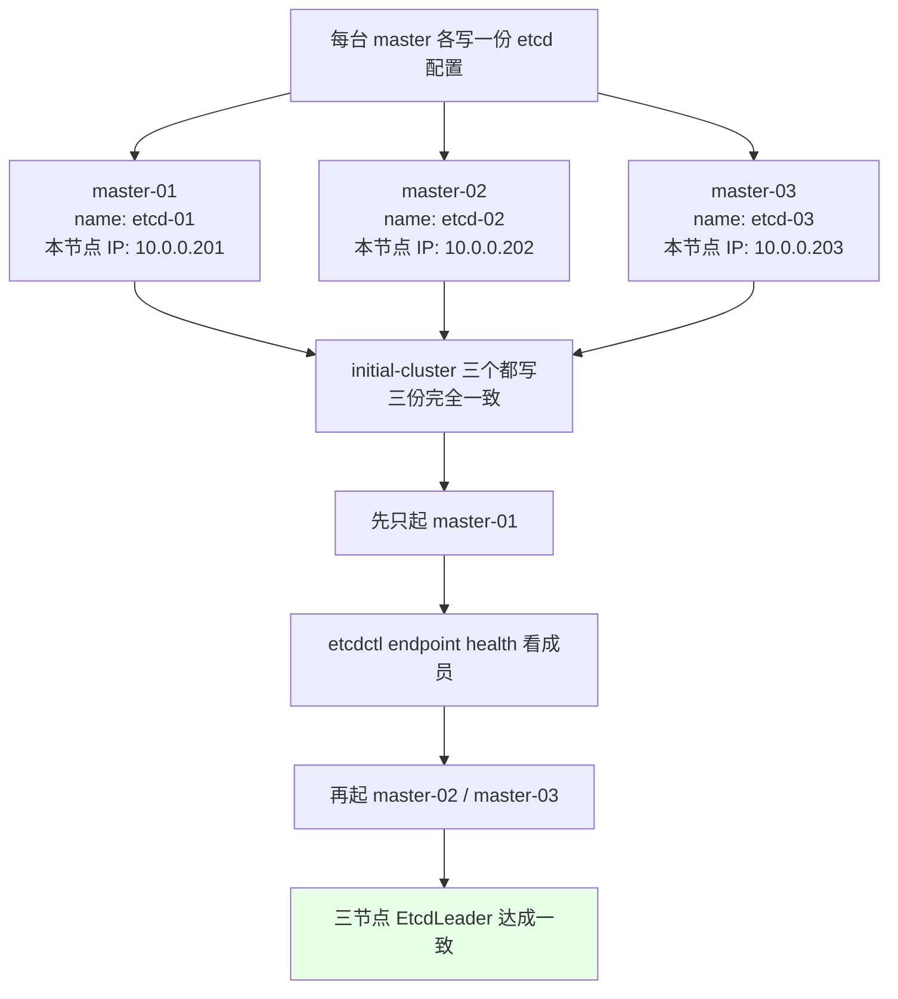
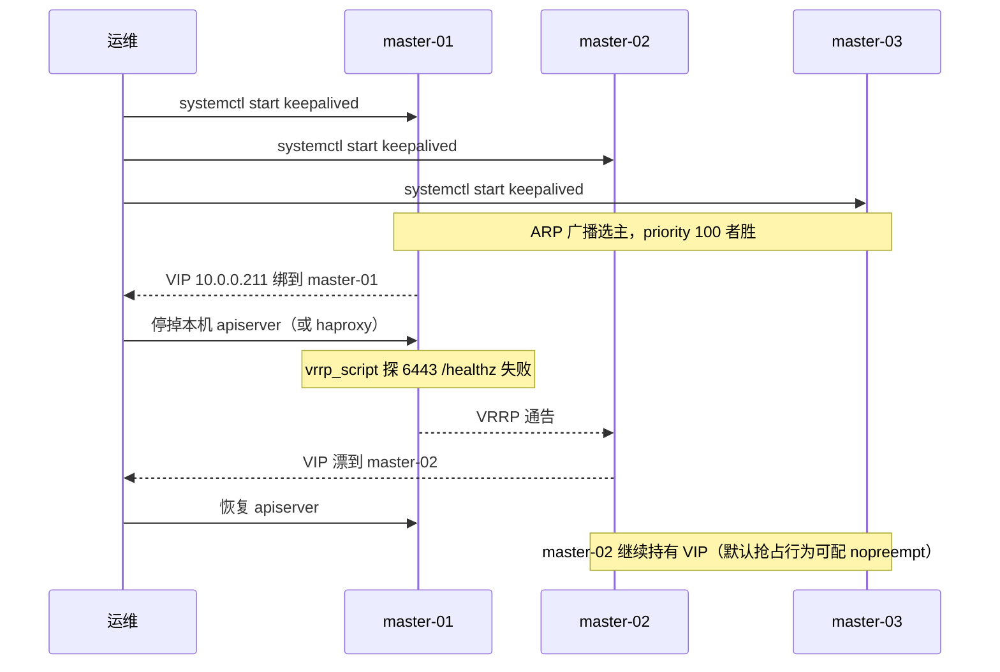

# Kubernetes 集群部署: 二进制高可用集群的 etcd 与 master 控制面组件配置

证书生成完，**集群骨架就基本成型了**；这一节把骨架填实：从 etcd 起，一路把 apiserver / controller-manager / scheduler 三个控制面组件逐个拉起来，并顺手把 VIP 的负载均衡搭好。

结论先给：

- **etcd 是三个 master 节点一起、但每台配置不同**：单台只操作「本机一份」，**集群状态只在一个节点上看**；
- **证书目录 `/etc/etcd/ssl` 建议软链到 `/etc/etcd/cert`**：证书生成位置不动，配置文件少改一层路径；
- **haproxy 监听 8443、证书里签的也是 8443、VIP 也是 8443 —— 三处必须一致**，这是二进制部署最高频的「证书通了但访问不通」；
- **apiserver 的 token 认证已经不用了**，1.19 走聚合证书 + CSR；controller-manager 的 `--pod` 网段默认 `10.244.0.0/16`，改过集群网段就必须同步改这里；
- **每起一个组件都要立刻验证**：`ps` + `tail 日志` + `etcdctl endpoint health`，二进制部署没有「装完自动恢复」这回事。

## 纲要

- etcd 集群配置与逐台差异
- etcd 的 systemd unit 与证书软链
- 启动 etcd 与集群状态查看
- haproxy + keepalived 的 VIP 负载均衡
- kube-apiserver 的启动与聚合证书校验
- kube-controller-manager 与 kube-scheduler
- 每步验证清单与常见排错

## etcd 集群配置与逐台差异

课程刻意**不给你一个「一键装完」的脚本**：第一次搭的人必须亲手走一遍，才知道哪几行是逐台不同、哪几行是全集群一致。等你明白流程，再写自己的自动化脚本才是安全的。



```text
/etc/etcd/ 目录布局：
├── etcd.conf       # 每台一份，逐台改 name / 本节点 IP
├── etcd.service    # systemd unit，三台完全相同
└── cert            # 软链 -> /etc/etcd/ssl（证书生成目录）
    └── ssl
        ├── ca.pem
        ├── etcd.pem
        └── etcd-key.pem
```

第一份配置（master-01）：

```bash
cat > /etc/etcd/etcd.conf <<'EOF'
#[Member]
ETCD_NAME="etcd-01"
ETCD_DATA_DIR="/opt/k8s/data/etcd"
ETCD_LISTEN_PEER_URLS="https://10.0.0.201:2380"
ETCD_LISTEN_CLIENT_URLS="https://10.0.0.201:2379,http://127.0.0.1:2379"
ETCD_INITIAL_ADVERTISE_PEER_URLS="https://10.0.0.201:2380"
ETCD_ADVERTISE_CLIENT_URLS="https://10.0.0.201:2379,http://127.0.0.1:2379"

#[Clustering]
ETCD_INITIAL_CLUSTER="etcd-01=https://10.0.0.201:2380,etcd-02=https://10.0.0.202:2380,etcd-03=https://10.0.0.203:2380"
ETCD_INITIAL_CLUSTER_TOKEN="etcd-ca-token"
ETCD_INITIAL_CLUSTER_STATE="new"

#[Security]
ETCD_CERT_FILE="/etc/etcd/cert/etcd.pem"
ETCD_KEY_FILE="/etc/etcd/cert/etcd-key.pem"
ETCD_TRUSTED_CA_FILE="/etc/etcd/cert/ca.pem"
ETCD_PEER_CERT_FILE="/etc/etcd/cert/etcd.pem"
ETCD_PEER_KEY_FILE="/etc/etcd/cert/etcd-key.pem"
ETCD_PEER_TRUSTED_CA_FILE="/etc/etcd/cert/ca.pem"
EOF
```

| 字段 | master-01 | master-02 | master-03 | 是否逐台不同 |
| --- | --- | --- | --- | --- |
| `ETCD_NAME` | `etcd-01` | `etcd-02` | `etcd-03` | ✅ 必须不同 |
| `*_URLS` 里的 IP | `.201` | `.202` | `.203` | ✅ 必须不同 |
| `ETCD_INITIAL_CLUSTER` | 三个成员全写 | 同左 | 同左 | ❌ 三份一致 |
| `ETCD_INITIAL_CLUSTER_TOKEN` | 一致 | 一致 | 一致 | ❌ 一致（不一致会形成双集群） |
| `ETCD_INITIAL_CLUSTER_STATE` | `new`（首次） | `new` → 已存在后改 `existing` | 同左 | 首次全部 `new` |
| 证书路径 | `/etc/etcd/cert/*` | 同 | 同 | ❌ 一致 |

> **3.3 → 3.4 的参数写法差异**：老版本里这个值是单项 `default`，3.4 起相关参数改成**切片写法（方括号里写 `default`）**，其余字段完全不用动。升级 3.3 到 3.4 时把这几行的新旧写法逐字段比对一遍即可，不要整份抄。

## etcd 的 systemd unit 与证书软链

```bash
# 四类组件（etcd / apiserver / controller-manager / scheduler）的 unit 写法是同一套模板
mkdir -p /usr/lib/systemd/system
cat > /usr/lib/systemd/system/etcd.service <<'EOF'
[Unit]
Description=Etcd Server
Documentation=https://github.com/coreos
After=network.target

[Service]
Type=notify
EnvironmentFile=/etc/etcd/etcd.conf
ExecStart=/opt/k8s/bin/etcd
Restart=always
RestartSec=5
LimitNOFILE=65536
LimitNPROC=65536
PrivateTmp=true
TasksMax=infinity
TimeoutStartSec=0

[Install]
WantedBy=multi-user.target
EOF
systemctl daemon-reload

# 证书生成在 /etc/etcd/ssl，做软链到 /etc/etcd/cert，配置文件里少写一层
ln -sf /etc/etcd/ssl /etc/etcd/cert
ls -l /etc/etcd/cert/etcd.pem
# /etc/etcd/cert/etcd.pem -> /etc/etcd/ssl/etcd.pem
```

软链只是**省事**，不是必须：你也可以让证书直接生成到 `/etc/etcd/cert`。课程选择「生成目录保持独立 + 软链」，是为了证书重签时不用改任何配置文件。

## 启动 etcd 与查看集群状态

```bash
mkdir -p /opt/k8s/data/etcd
systemctl enable --now etcd
systemctl status etcd

# 有报错先解决再往下走，不要带着错继续
tail -50 /var/log/messages | grep -i etcd
```

集群状态**只在一个节点上看就够了**：

```bash
export ETCDCTL_API=3
export ETCDCTL_CA=/etc/etcd/cert/ca.pem
export ETCDCTL_CERT=/etc/etcd/cert/etcd.pem
export ETCDCTL_KEY=/etc/etcd/cert/etcd-key.pem

# 成员健康
/opt/k8s/bin/etcdctl endpoint health --endpoints=https://10.0.0.201:2379,https://10.0.0.202:2379,https://10.0.0.203:2379
# https://10.0.0.201:2379 is healthy: successfully committed proposal

# 集群状态（会给出哪个是 leader）
/opt/k8s/bin/etcdctl endpoint status --write-out=table --endpoints=https://10.0.0.201:2379,https://10.0.0.202:2379,https://10.0.0.203:2379
# +----------------+------------------+---------+---------+-----------+
# | ENDPOINT       |        LEADER    | ...     | ...     | IS HEALTHY |
# +----------------+------------------+---------+---------+-----------+

# 集群成员列表
/opt/k8s/bin/etcdctl member list --endpoints=https://10.0.0.201:2379
```

启动后 master-01 会成为 leader，它挂了会自动切 —— 这就是 etcd 自带的选主，不需要额外配。

## haproxy + keepalived 搭 VIP

> 如果公司用的是 F5 这类硬件负载均衡，**这两步整个可以跳过**，直接把 apiserver 的地址填成 F5 的 VIP 即可。

```bash
# 每个 master 节点都装
yum install -y haproxy keepalived
```

### haproxy：后端写三个 master，前端监听 8443

```bash
cat > /etc/haproxy/haproxy.cfg <<'EOF'
global
    log /dev/log local0
    maxconn 20000
    daemon

defaults
    mode tcp
    log global
    option tcplog
    retries 3
    timeout connect 5s
    timeout client 1m
    timeout server 1m

frontend k8s-apiserver
    bind *:8443
    mode tcp
    option tcplog
    default_backend k8s-apiserver

backend k8s-apiserver
    mode tcp
    balance roundrobin
    option tcp-check
    tcp-check send "GET /healthz HTTP/1.0\r\nHost: localhost\r\n\r\n"
    tcp-check expect string ok
    server master-01 10.0.0.201:6443 check inter 3s fall 3 rise 2
    server master-02 10.0.0.202:6443 check inter 3s fall 3 rise 2
    server master-03 10.0.0.203:6443 check inter 3s fall 3 rise 2
EOF
haproxy -c -f /etc/haproxy/haproxy.cfg
```

**8443 这个端口贯穿整条链路**：haproxy 前端 → 生成证书时签的 `apiserver` SAN 里的 `VIP:8443` → kubelet 连的 `https://VIP:8443` → 生成 token/CSR 里的 server 名。任何一处写成 6443 而别处是 8443，症状都是「证书明明签了但 x509 报connection refused / unexpected EOF」。

### keepalived：网卡名、本机 IP、VIP

```bash
cat > /etc/keepalived/check_apiserver.sh <<'EOF'
#!/usr/bin/env bash
# 接口级健康检查：探 apiserver 的 6443 /healthz，返回 ok 才算健康
curl -sk --connect-timeout 2 -m 3 https://127.0.0.1:6443/healthz 2>/dev/null | grep -q ok \
  && exit 0 || exit 1
EOF
chmod +x /etc/keepalived/check_apiserver.sh

cat > /etc/keepalived/keepalived.conf <<'EOF'
global_defs {
    router_id LVS_K8S
    script_user root
    enable_script_security
}

vrrp_script chk_apiserver {
    script "/etc/keepalived/check_apiserver.sh"
    interval 2
    weight -30
    fall 2
    rise 2
    timeout 2
}

vrrp_instance VI_1 {
    state BACKUP
    interface ens33              # 逐台改成自己的网卡名
    virtual_router_id 51
    priority 100                # master-01/02/03 依次 100 / 90 / 80
    advert_int 1
    authentication {
        auth_type PASS
        auth_pass 1111
    }
    virtual_ipaddress {
        10.0.0.211/24            # VIP，与证书里签的一致
    }
    track_script {
        chk_apiserver
    }
}
EOF
systemctl enable --now haproxy keepalived
```

| 项 | master-01 | master-02 | master-03 | 说明 |
| --- | --- | --- | --- | --- |
| `priority` | 100 | 90 | 80 | ✅ 逐台不同，决定 VIP 归属 |
| `interface` | ens33 | ens33 | ens33 | 按实际网卡，`ip addr` 看 |
| `virtual_ipaddress` | 10.0.0.211/24 | 同 | 同 | 与证书 SAN 一致 |
| `router_id` / `virtual_router_id` / `auth_pass` | 相同 | 相同 | 相同 | ❌ 同组必须一致，但别和公司现有 VRRP 撞 |

**VIP 只是一个 IP，不占任何计算资源**，它靠 VRRP 的 ARP 广播宣称自己属于谁：



```bash
# 看 VIP 漂在哪台
ip addr | grep 10.0.0.211
#   inet 10.0.0.211/24 scope global secondary ens33
tail -50 /var/log/messages | grep -i vrrp
#   VRRP_Instance(VI_1) Entering MASTER STATE

# VIP 能不能通
curl -k https://10.0.0.211:8443/healthz
curl -k https://10.0.0.211:8443/version
```

「配置被忽略」这类 keepalived 告警可以忽略，但**健康检查脚本必须有 `+x`**：脚本没执行权限时 keepalived 静默降级成「不检查」，VIP 就永远不会漂。

## kube-apiserver

所有节点先建好目录，然后**每个 master 各写一份** apiserver 配置：

```bash
mkdir -p /opt/k8s/cfg /opt/k8s/logs /opt/k8s/ssl
```

```text
/opt/k8s/cfg 布局（每个 master 一份，IP 不同）：
├── kube-apiserver.conf      # 逐台改 --advertise-address / --etcd-servers
├── kube-controller-manager.conf   # 三个 master 一致
├── kube-scheduler.conf      # 三个 master 一致
├── token.csv                # 已废弃，1.19 不用它了
└── aggregation-cert 相关证书
```

```bash
cat > /opt/k8s/cfg/kube-apiserver.conf <<'EOF'
KUBE_APISERVER_OPTS="--logtostderr=true \
--v=2 \
--bind-address=10.0.0.201 \
--advertise-address=10.0.0.201 \
--secure-port=6443 \
--etcd-servers=https://10.0.0.201:2379,https://10.0.0.202:2379,https://10.0.0.203:2379 \
--etcd-cafile=/opt/k8s/ssl/ca.pem \
--etcd-certfile=/opt/k8s/ssl/apiserver.pem \
--etcd-keyfile=/opt/k8s/ssl/apiserver-key.pem \
--service-cluster-ip-range=10.96.0.0/16 \
--service-node-port-range=30000-32767 \
--enable-admission-plugins=NamespaceLifecycle,LimitRanger,ServiceAccount,DefaultStorageClass,DefaultTolerationSeconds,MutatingAdmissionWebhook,ValidatingAdmissionWebhook,ResourceQuota \
--authorization-mode=RBAC,Node \
--enable-priority-and-fairness=false \
--client-ca-file=/opt/k8s/ssl/ca.pem \
--service-account-key-file=/opt/k8s/ssl/sa.pub \
--service-account-signing-key-file=/opt/k8s/ssl/sa.key \
--service-account-issuer=https://kubernetes.default.svc.cluster.local \
--kubelet-client-certificate=/opt/k8s/ssl/apiserver.pem \
--kubelet-client-key=/opt/k8s/ssl/apiserver-key.pem \
--requestheader-client-ca-file=/opt/k8s/ssl/ca.pem \
--proxy-client-cert-file=/opt/k8s/ssl/aggregator.pem \
--proxy-client-key=/opt/k8s/ssl/aggregator-key.pem \
--requestheader-allowed-xnames=configmaps,extensions.googleapis.com,configmaps.autoscaling.k8s.io,secrets,services,services.k8s.io,rbac.authorization.k8s.io,authorization.k8s.io \
--requestheader-extra-headers-prefix=X-Remote-Extra- \
--requestheader-group-headers=X-Remote-Group \
--requestheader-username-headers=X-Remote-User \
--allow-privileged=true \
--audit-log-maxage=30 \
--audit-log-maxbackup=3 \
--audit-log-maxsize=100 \
--audit-log-path=/opt/k8s/logs/apiserver-audit.log"
EOF
```

这段配置里有两处要点：

1. **聚合证书（aggregation layer）**：`--requestheader-client-ca-file` + `--proxy-client-cert-file` 成对出现，只有带了这两个 Header 的请求才会被聚合层校验，`RequestHeader` 里的 X-Remote-* 被允许才放行，否则直接拒 —— 这是 **Metrics Server 能拿到指标的前提**；
2. **`token.csv` 已经不用了**：1.19 的 kubelet 走 TLS Bootstrapping，认证方式是「token 申请」+「CSR 文件校验」两种，不需要再维护一个 `token.csv`。

```bash
cat > /usr/lib/systemd/system/kube-apiserver.service <<'EOF'
[Unit]
Description=Kubernetes API Server
Documentation=https://github.com/kubernetes/kubernetes
After=etcd.service
Before=kube-controller-manager.service

[Service]
EnvironmentFile=/opt/k8s/cfg/kube-apiserver.conf
ExecStart=/opt/k8s/bin/kube-apiserver $KUBE_APISERVER_OPTS
Restart=on-failure
RestartSec=5
LimitNOFILE=65536

[Install]
WantedBy=multi-user.target
EOF
systemctl daemon-reload
systemctl enable --now kube-apiserver
systemctl status kube-apiserver
```

apiserver 启动会做一轮自初始化，报完错才继续；**有报错必须修完再往下**，apiserver 起不来后面全是白搭。

## kube-controller-manager

```bash
cat > /opt/k8s/cfg/kube-controller-manager.conf <<'EOF'
KUBE_CONTROLLER_MANAGER_OPTS="--logtostderr=true \
--v=2 \
--master=https://10.0.0.211:8443 \
--bind-address=127.0.0.1 \
--leader-elect=true \
--service-cluster-ip-range=10.96.0.0/16 \
--cluster-cidr=10.244.0.0/16 \
--cluster-name=kubernetes \
--service-account-private-key-file=/opt/k8s/ssl/sa.key \
--root-ca-file=/opt/k8s/ssl/ca.pem \
--kubeconfig=/opt/k8s/cfg/controller-manager.kubeconfig"
EOF
```

**`--service-cluster-ip-range` 是 Service 网段，`--cluster-cidr` 是 Pod 网段**：课程默认 Pod 用 **`10.244.0.0/16`**（Calico 的默认值）：课程默认用 **`10.244.0.0/16`**（Calico 的默认值），如果你改过 Pod 网段，这里必须同步改，否则 controller-manager 给 Pod 发地址、CNI 发的地址对不上，Pod 会一直 `ContainerCreating`。

```bash
cat > /usr/lib/systemd/system/kube-controller-manager.service <<'EOF'
[Unit]
Description=Kubernetes Controller Manager
Documentation=https://github.com/kubernetes/kubernetes

[Service]
EnvironmentFile=/opt/k8s/cfg/kube-controller-manager.conf
ExecStart=/opt/k8s/bin/kube-controller-manager $KUBE_CONTROLLER_MANAGER_OPTS
Restart=on-failure
RestartSec=5

[Install]
WantedBy=multi-user.target
EOF
systemctl daemon-reload
systemctl enable --now kube-controller-manager
systemctl status kube-controller-manager
```

三个 master 各跑一份，靠 `--leader-elect=true` 抢锁，**不需要人为决定哪台是主**。

## kube-scheduler

scheduler 最简单，没有什么可讲的参数：

```bash
cat > /opt/k8s/cfg/kube-scheduler.conf <<'EOF'
KUBE_SCHEDULER_OPTS="--logtostderr=true \
--v=2 \
--master=https://10.0.0.211:8443 \
--leader-elect=true \
--bind-address=127.0.0.1 \
--algorithm-provider=DefaultProvider"
EOF

cat > /usr/lib/systemd/system/kube-scheduler.service <<'EOF'
[Unit]
Description=Kubernetes Scheduler
Documentation=https://github.com/kubernetes/kubernetes

[Service]
EnvironmentFile=/opt/k8s/cfg/kube-scheduler.conf
ExecStart=/opt/k8s/bin/kube-scheduler $KUBE_SCHEDULER_OPTS
Restart=on-failure
RestartSec=5

[Install]
WantedBy=multi-user.target
EOF
systemctl daemon-reload
systemctl enable --now kube-scheduler
systemctl status kube-scheduler
```

## 每步验证清单

二进制部署**没有「装完自动恢复」**，每一步都靠人工确认：

```bash
# 1. 进程在不在
ps -ef | grep -E 'etcd|kube-apiserver|kube-controller-manager|kube-scheduler' | grep -v grep

# 2. 端口有没有起来
ss -lnt | grep -E ':(2379|2380|6443|8443)'
# LISTEN 0 128 10.0.0.201:2379
# LISTEN 0 128 10.0.0.201:6443

# 3. 日志有没有报错
tail -100 /var/log/messages | grep -iE 'etcd|kube-apiserver|etcdserver|refused'

# 4. 集群唯一入口通不通
curl -k https://10.0.0.211:8443/healthz
curl -k https://10.0.0.211:8443/version
```

| 现象 | 原因 | 处理 |
| --- | --- | --- |
| etcd 起不来，报 `connection refused to 10.0.0.202:2380` | 成员还没起来就先起了一个 | 先起 master-01 跑通，再加 02/03 |
| etcd 报 `member ... already exists` | `ETCD_INITIAL_CLUSTER_TOKEN` 和别人撞了 | 换一个 token 清数据重来 |
| apiserver 起不来，报 `x509: cannot validate certificate` | 证书里签的端口是 8443，配置里写成 6443（或反之） | 三处端口统一 |
| apiserver 报 `etcdserver: health check failed` | etcd 没起或证书路径软链断了 | `ls -l /etc/etcd/cert/etcd.pem` 确认软链 |
| keepalived 报「config ignored」 | 配置里有 ignore 级别的告警 | 忽略；但要确认 `check_apiserver.sh` 有 `+x` |
| VIP 在哪台但那台 apiserver 是死的 | 健康检查没生效 | 装 `vrrp_script`，用接口级 `/healthz` 探测 |
| controller-manager 报 `invalid CIDR address` | 改过 Pod 网段但 `--cluster-cidr` 没跟 | 改成实际 Pod 网段 |
| Node 一直 NotReady，日志有 CNI 报错 | 网络插件还没装 | 正常，装完 Calico 自愈 |

## API 速览

| 能力 | 做法 | 关键字段 / 命令 |
| --- | --- | --- |
| etcd 集群成员互通 | 每节点一份 conf，`initial-cluster` 写全 | `ETCD_INITIAL_CLUSTER` |
| etcd 启动守护 | systemd + `EnvironmentFile` | `ExecStart=/opt/k8s/bin/etcd`、`Type=notify` |
| 证书路径收敛 | 软链 `/etc/etcd/cert` -> `ssl` | `ln -sf /etc/etcd/ssl /etc/etcd/cert` |
| 集群健康检查 | 单节点看一次即可 | `etcdctl endpoint health` |
| 控制面唯一入口 | haproxy 8443 + keepalived VIP | `bind *:8443`、`virtual_ipaddress` |
| VIP 跟随真实可用性 | 接口级探测脚本 | `vrrp_script` + `curl /healthz` |
| 聚合层请求校验 | apiserver 聚合证书三件套 | `--requestheader-client-ca-file` / `--proxy-client-config` |
| kubelet 免手工发证书 | 弃用 token.csv，走 CSR | `TokenRequest` + `CSR` |
| 控制面选主 | 每 master 一份 + 抢锁 | `--leader-elect=true` |
| Pod 网段同步 | controller-manager 与 CNI 对齐 | `--cluster-cidr=10.244.0.0/16` |

## Demo 示例

一个**逐台生成 etcd 配置 + 批量起控制面**的脚本，把「逐台不同 / 全集群一致」这两类字段分开处理。

```bash
#!/usr/bin/env bash
# setup-master.sh —— 在单台 master 上生成 etcd 配置与控制面 unit 并启动
# 用法: ./setup-master.sh <本机名:master-01> <本机IP:10.0.0.201>
set -euo pipefail

# 下面命令中的变量按你的集群环境赋值后再执行
HOSTNAME_ARG="${1:?用法: $0 <master-01|master-02|master-03> $RES_NAME}"
NODE_IP="${2:?本机 IP}"
VIP="10.0.0.211"
LB_PORT="8443"
MASTER_IPS="10.0.0.201 10.0.0.202 10.0.0.203"
POD_CIDR="10.244.0.0/16"
SVC_CIDR="10.96.0.0/16"

# 从 etcd-01 推出本机 etcd name
ETCD_NAME="etcd-${NODE_IP##*.}"
log() { printf '\n[master] %s\n' "$*"; }
die() { printf '\n[master] ERROR: %s\n' "$*" >&2; exit 1; }

log "0. 环境确认"
echo "  节点:   $HOSTNAME_ARG"
echo "  本机IP: $NODE_IP"
echo "  VIP:    $VIP:$LB_PORT"
echo "  etcd:   $ETCD_NAME"

# etcd.conf: 逐台不同的一律用 $NODE_IP / $ETCD_NAME 替换
log "1. 生成 etcd.conf"
ETCD_SERVERS=$(for IP in $MASTER_IPS; do printf 'https://%s:2379,' "$IP"; done | sed 's/,$//')
ETCD_PEERS=$(for IP in $MASTER_IPS; do printf 'etcd-%s=https://%s:2380,' "${IP##*.}" "$IP"; done | sed 's/,$//')
mkdir -p /etc/etcd /opt/k8s/data/etcd
cat > /etc/etcd/etcd.conf <<EOF
#[Member]
ETCD_NAME="${ETCD_NAME}"
ETCD_DATA_DIR="/opt/k8s/data/etcd"
ETCD_LISTEN_PEER_URLS="https://${NODE_IP}:2380"
ETCD_LISTEN_CLIENT_URLS="https://${NODE_IP}:2379,http://127.0.0.1:2379"
ETCD_INITIAL_ADVERTISE_PEER_URLS="https://${NODE_IP}:2380"
ETCD_ADVERTISE_CLIENT_URLS="https://${NODE_IP}:2379,http://127.0.0.1:2379"

#[Clustering]
ETCD_INITIAL_CLUSTER="${ETCD_PEERS}"
ETCD_INITIAL_CLUSTER_TOKEN="etcd-ca-token"
ETCD_INITIAL_CLUSTER_STATE="new"

#[Security]
ETCD_CERT_FILE="/etc/etcd/cert/etcd.pem"
ETCD_KEY_FILE="/etc/etcd/cert/etcd-key.pem"
ETCD_TRUSTED_CA_FILE="/etc/etcd/cert/ca.pem"
ETCD_PEER_CERT_FILE="/etc/etcd/cert/etcd.pem"
ETCD_PEER_KEY_FILE="/etc/etcd/cert/etcd-key.pem"
ETCD_PEER_TRUSTED_CA_FILE="/etc/etcd/cert/ca.pem"
EOF
ln -sfn /etc/etcd/ssl /etc/etcd/cert

log "2. etcd systemd unit"
cat > /usr/lib/systemd/system/etcd.service <<'EOF'
[Unit]
Description=Etcd Server
After=network.target
[Service]
Type=notify
EnvironmentFile=/etc/etcd/etcd.conf
ExecStart=/opt/k8s/bin/etcd
Restart=always
RestartSec=5
LimitNOFILE=65536
PrivateTmp=true
TimeoutStartSec=0
[Install]
WantedBy=multi-user.target
EOF
systemctl daemon-reload
systemctl enable --now etcd
sleep 3
systemctl is-active etcd | sed 's/^/  etcd: /'

log "3. 起 etcd 集群（当前节点 + 其余节点）"
for IP in $MASTER_IPS; do ssh -o BatchMode=yes "$IP" 'systemctl is-active etcd' 2>/dev/null | sed "s/^/  $IP: /"; done

export ETCDCTL_API=3
export ETCDCTL_CA=/etc/etcd/cert/ca.pem
export ETCDCTL_CERT=/etc/etcd/cert/etcd.pem
export ETCDCTL_KEY=/etc/etcd/cert/etcd-key.pem
/opt/k8s/bin/etcdctl endpoint health --endpoints="${ETCD_SERVERS}" | sed 's/^/  /'
/opt/k8s/bin/etcdctl endpoint status --write-out=table --endpoints="${ETCD_SERVERS}"

log "4. haproxy + keepalived"
yum install -y haproxy keepalived
cat > /etc/haproxy/haproxy.cfg <<EOF
global
    log /dev/log local0
    maxconn 20000
    daemon
defaults
    mode tcp
    log global
    option tcplog
    retries 3
    timeout connect 5s
    timeout client 1m
    timeout server 1m
frontend k8s-apiserver
    bind *:${LB_PORT}
    mode tcp
    option tcplog
    default_backend k8s-apiserver
backend k8s-apiserver
    mode tcp
    balance roundrobin
    option tcp-check
    tcp-check send "GET /healthz HTTP/1.0\\\\r\\\\nHost: localhost\\\\r\\\\n\\\\r\\\\n"
    tcp-check expect string ok
$(for IP in $MASTER_IPS; do printf '    server master-%s %s:6443 check inter 3s fall 3 rise 2\n' "${IP##*.}" "$IP"; done)
EOF
haproxy -c -f /etc/haproxy/haproxy.cfg || die "haproxy 配置有误"

IFACE=$(ip route | awk '/^default/ {print $5}')
cat > /etc/keepalived/check_apiserver.sh <<'EOF'
#!/usr/bin/env bash
curl -sk --connect-timeout 2 -m 3 https://127.0.0.1:6443/healthz 2>/dev/null | grep -q ok \
  && exit 0 || exit 1
EOF
chmod +x /etc/keepalived/check_apiserver.sh
cat > /etc/keepalived/keepalived.conf <<EOF
global_defs {
    router_id LVS_K8S
    script_user root
    enable_script_security
}
vrrp_script chk_apiserver {
    script "/etc/keepalived/check_apiserver.sh"
    interval 2
    weight -30
    fall 2
    rise 2
    timeout 2
}
vrrp_instance VI_1 {
    state BACKUP
    interface ${IFACE}
    virtual_router_id 51
    priority 100
    advert_int 1
    authentication { auth_type PASS; auth_pass 1111 }
    virtual_ipaddress { ${VIP}/24 }
    track_script { chk_apiserver }
}
EOF
systemctl enable --now haproxy keepalived

log "5. apiserver / controller-manager / scheduler"
mkdir -p /opt/k8s/cfg /opt/k8s/logs
cat > /opt/k8s/cfg/kube-apiserver.conf <<EOF
KUBE_APISERVER_OPTS="--logtostderr=true --v=2 \
--bind-address=${NODE_IP} \
--advertise-address=${NODE_IP} \
--secure-port=6443 \
--etcd-servers=${ETCD_SERVERS} \
--etcd-cafile=/opt/k8s/ssl/ca.pem \
--etcd-certfile=/opt/k8s/ssl/apiserver.pem \
--etcd-keyfile=/opt/k8s/ssl/apiserver-key.pem \
--service-cluster-ip-range=${SVC_CIDR} \
--service-node-port-range=30000-32767 \
--authorization-mode=RBAC,Node \
--client-ca-file=/opt/k8s/ssl/ca.pem \
--service-account-key-file=/opt/k8s/ssl/sa.pub \
--service-account-signing-key-file=/opt/k8s/ssl/sa.key \
--service-account-issuer=https://kubernetes.default.svc.cluster.local \
--requestheader-client-ca-file=/opt/k8s/ssl/ca.pem \
--proxy-client-cert-file=/opt/k8s/ssl/aggregator.pem \
--proxy-client-key=/opt/k8s/ssl/aggregator-key.pem \
--requestheader-allowed-xnames=configmaps,extensions.googleapis.com,configmaps.autoscaling.k8s.io,secrets,services,services.k8s.io \
--requestheader-extra-headers-prefix=X-Remote-Extra- \
--requestheader-group-headers=X-Remote-Group \
--requestheader-username-headers=X-Remote-User \
--allow-privileged=true"
EOF

cat > /opt/k8s/cfg/kube-controller-manager.conf <<EOF
KUBE_CONTROLLER_MANAGER_OPTS="--logtostderr=true --v=2 \
--master=https://${VIP}:${LB_PORT} \
--bind-address=127.0.0.1 \
--leader-elect=true \
--service-cluster-ip-range=${SVC_CIDR} \
--cluster-cidr=${POD_CIDR} \
--cluster-name=kubernetes \
--root-ca-file=/opt/k8s/ssl/ca.pem \
--kubeconfig=/opt/k8s/cfg/controller-manager.kubeconfig"
EOF

cat > /opt/k8s/cfg/kube-scheduler.conf <<EOF
KUBE_SCHEDULER_OPTS="--logtostderr=true --v=2 \
--master=https://${VIP}:${LB_PORT} \
--leader-elect=true \
--bind-address=127.0.0.1"
EOF
for COMP in apiserver controller-manager scheduler; do
  case "$COMP" in
    apiserver)               OPT_VAR="KUBE_APISERVER_OPTS" ;;
    controller-manager)      OPT_VAR="KUBE_CONTROLLER_MANAGER_OPTS" ;;
    scheduler)               OPT_VAR="KUBE_SCHEDULER_OPTS" ;;
  esac
  cat > "/usr/lib/systemd/system/kube-${COMP}.service" <<EOF
[Unit]
Description=Kubernetes ${COMP}
After=network.target
[Service]
EnvironmentFile=/opt/k8s/cfg/kube-${COMP}.conf
ExecStart=/opt/k8s/bin/kube-${COMP} \$${OPT_VAR}
Restart=on-failure
RestartSec=5
[Install]
WantedBy=multi-user.target
EOF
  systemctl daemon-reload
  systemctl enable --now "kube-${COMP}"
  sleep 2
  echo "  kube-${COMP}: $(systemctl is-active kube-${COMP})"
done

log "6. 验证"
ss -lnt | grep -E ':(2379|2380|6443|8443)' | sed 's/^/  /'
ip addr | grep -q "$VIP" && echo "  [OK] VIP ${VIP} 在本机" || echo "  VIP 不在本机（被其他 master 持有，正常）"
curl -sk "https://${VIP}:${LB_PORT}/version" | head -c 200 | sed 's/^/  /'
echo

log "7. 提示"
cat <<'TIP'
  下一节: TLS Bootstrapping 自动颁发 kubelet 客户端证书
  别忘记 controller-manager 的 --cluster-cidr 要和新装的 Pod 网段一致
  排障: journalctl -u kube-apiserver -n 200 --no-pager
        tail -f /var/log/messages | grep -i vrrp
TIP
```

## 总结

这一节的产出是「一个能连上的控制面」，成败取决于三件事。

- **etcd 是「逐台不同 + 全集群一致」的混合体**：`ETCD_NAME` 和所有 URL 里的 IP 逐台改，`ETCD_INITIAL_CLUSTER` / `TOKEN` 三份完全一样，token 撞了会直接形成双集群。
- **软链证书目录只是省事**：`/etc/etcd/ssl` 生成、`/etc/etcd/cert` 软链过去，配置文件路径统一，将来重签证书不用动任何 conf。
- **8443 是这一节的灵魂**：haproxy 前端、证书 SAN、keepalived VIP、controller-manager/scheduler 的 `--master` 四处必须指向同一个「VIP:8443」，写岔了症状是证书有效但连不上。
- **apiserver 的 token.csv 已被 TLS Bootstrapping 取代**，1.19 用聚合证书 + CSR 两条路；controller-manager 的 `--cluster-cidr` 必须和你实际的 Pod 网段（默认 10.244.0.0/16）一致。
- **每起一个组件就验证一次**：`ps` / `ss -lnt` / `tail 日志` / `etcdctl endpoint health`，二进制部署没有自愈，带着错往下走只会把错误堆成一片。

