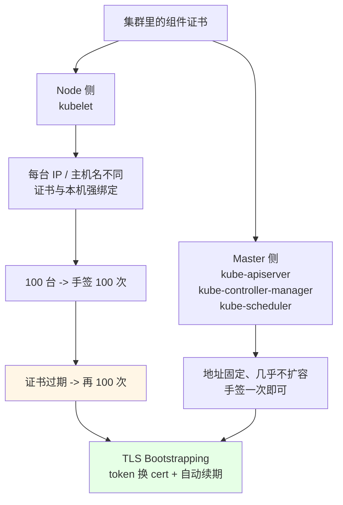
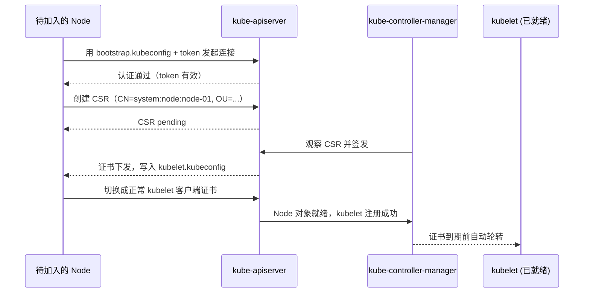

# Kubernetes 集群部署: 二进制安装 TLS Bootstrapping 自动颁发 kubelet 证书

Master 侧组件（apiserver / controller-manager / scheduler）的证书是**固定且很少变**的，手签一次就够；Node 侧只有一个 kubelet，但**kubelet 的证书和本机的 IP / 主机名强绑定**。这一节解决的就是「几百个节点要不要人手签五百次证书」这个问题。

结论先给：

- **kubelet 的证书不能通用**：它和本节点 IP、域名绑定，手写签发意味着每加一台 Node 就要签一次，证书快过期时还得逐台重签，几十台以上完全不可维护；
- **TLS Bootstrapping 用 bootstrap token 换客户端证书**：kubelet 拿一个「临时 kubeconfig」连 apiserver 申请 CSR，controller-manager 自动签发，全程不需要人手碰证书；
- **token 与 secret 是成对的**，生成后必须记下来（后面 join 节点、排查都不止用一次），但**格式不能错**；
- 这一节**先跑通安装流程，原理（CSR 申请 → 自动批准 → 自动续期）留到后面专门讲**；
- 同时把管理员 kubeconfig 放到 `~/.kube/config`，**这一步之后你才有 `kubectl` 可用**。

## 纲要

- 为什么 master 手签、node 必须自动
- 生成 kubelet 用的 kubeconfig
- 放置管理员 kubeconfig 并验证集群
- 创建 bootstrap token 的 Secret
- 初始化与验证
- 常见排错

## 为什么 master 手签、node 必须自动



```text
Node 加入时的两种证照路径对比：
├── 手工签发（不用 Bootstrapping）
│   ├── 每台 node: 生成 csr -> 提交 -> kubectl 批准
│   ├── 需要把 CA / kubelet 证书 scp 到每台
│   └── 证书续期: 逐台重跑，人工跟踪过期时间
└── TLS Bootstrapping（本节做法）
    ├── master 上只准备一份 bootstrap token
    ├── node 的 kubelet 自带 bootstrap.kubeconfig 连 apiserver
    └── CSR 自动签发 + 自动续期
```

| 维度 | 手工签发 | TLS Bootstrapping |
| --- | --- | --- |
| 加一台 Node 的操作 | 生成 CSR + 提交 + 批准 + 下发证书 | 拷一份 bootstrap.kubeconfig 即可 |
| 证书与本机绑定 | 要手写 SAN | 由 CSR 的 CN/OU 决定，天然带本机身份 |
| 到期续期 | 人工逐台重签 | kubelet 自动续，controller-manager 负责轮转 |
| 规模化 | 百台级别不可维护 | 千台也只改一处 |
| 排障可见性 | 盯证书文件 | `kubectl get csr` 全程可见 |

## 生成 kubelet 的 kubeconfig

kubelet 启动时会指定一个 kubeconfig，用它连 apiserver 并**声明「我是来要证书的」**。

```text
/opt/k8s/cfg 下新增两个 kubeconfig：
├── bootstrap.kubeconfig   # kubelet 启动参数 --bootstrap-kubeconfig，指向 token
└── kubelet.kubeconfig     # 证书签发后由 controller-manager 写入，kubelet 正常运行时用
```

生成方式和其他组件的 kubeconfig 一样，用 `kubectl config` 拼：

```bash
cd /opt/k8s/cfg

# 用 CA 证书组成 cluster 条目
kubectl config set-cluster kubernetes \
  --certificate-authority=/opt/k8s/ssl/ca.pem \
  --embed-certs=true \
  --server=https://10.0.0.211:8443 \
  --kubeconfig=bootstrap.kubeconfig

# 用 bootstrap 的 token 组成 user 条目
kubectl config set-credentials tls-bootstrap-token-user \
  --token="$BOOTSTRAP_TOKEN" \
  --kubeconfig=bootstrap.kubeconfig

kubectl config set-context tls-bootstrap-token-user@kubernetes \
  --cluster=kubernetes \
  --user=tls-bootstrap-token-user \
  --kubeconfig=bootstrap.kubeconfig

kubectl config use-context tls-bootstrap-token-user@kubernetes \
  --kubeconfig=bootstrap.kubeconfig
```

> token 从哪里来：先用 `head -c 16 /dev/urandom | od -An -tx1 | tr -d ' '` 生成一串，**前 6 位当 token、后 10 位当 secret**（课程里用的就是这种「六位 + 十六位」的格式，长度无所谓、但格式必须一致）。生成完**立刻记下来**，后面 join 节点和排障都要用。

## 放置管理员 kubeconfig 并验证集群

```bash
# 把证书和 kubeconfig 放到当前用户家目录，kubectl 默认读这里
mkdir -p /root/.kube
cp /opt/k8s/ssl/ca.pem /root/.kube/
cp /opt/k8s/cfg/admin.kubeconfig /root/.kube/config

# 立刻就有 kubectl 了
kubectl get cs
# NAME                 STATUS    MESSAGE             ERROR
# scheduler            Healthy   ok
# controller-manager   Healthy   ok
# etcd-0               Healthy   {"health":"true"}
```

此刻 Node 还没装 kubelet，所以 `kubectl get nodes` 看不到任何节点，这是正常的 —— 它验证的是**控制面本身已经活着**。

## 创建 bootstrap token 的 Secret

```bash
# 一条命令就把 bootstrap secret 装进去了
kubectl -n kube-system create secret generic bootstrap-token-$BOOTSTRAP_TOKEN \
  --from-literal=token-id="$TOKEN_ID" \
  --from-literal=token-secret="$TOKEN_SECRET" \
  --from-literal=usage-bootstrap-signing=true \
  --from-literal=usage-bootstrap-authentication=true
```

```text
kube-system 里和 bootstrap 相关的资源：
├── secret/bootstrap-token-<token-id>
│   ├── token-id           # 前 6 位
│   ├── token-secret      # 后 10~16 位
│   ├── usage-bootstrap-signing       # 允许用它签证书
│   └── usage-bootstrap-authentication # 允许用它做身份认证
└── （后续章节）ClusterRoleBinding/system:node-bootstrappers
    └── ClusterRoleBinding/system:node-autoapprove
```

| 字段 | 取值 | 说明 |
| --- | --- | --- |
| `token-id` | 6 位左右的可打印字符 | >public 的部分，放在 ID 里给 kubelet 认 |
| `token-secret` | 16 位左右 | 保密部分，**必须自己记下来** |
| `usage-bootstrap-signing` | `true` | 允许该 token 作为签名用途 |
| `usage-bootstrap-authentication` | `true` | 允许该 token 做 bearer 认证 |
| namespace | 固定 `kube-system` | kubelet 只在这个 namespace 里找 bootstrap secret |

> Secret 的 `data` / `stringData` 值都是 base64 编码，直接用 kubectl 生成即可，**不要手敲 base64**，一个字符错位就是「kubelet 永远拿不到 token」。

## 初始化与验证

同理，controller-manager 要打开对应的启动参数（1.19 形态），让它会去批 CSR：

```bash
# 确认 controller-manager 拉起来了、没报错
systemctl is-active kube-controller-manager
tail -50 /var/log/messages | grep -i controllerserver

# 集群唯一入口还在工作
curl -sk https://10.0.0.211:8443/healthz
```



**验证顺序**：

```bash
# 1. 控制面组件状态（现在三条 Healthy）
kubectl get cs

# 2. apiserver 与 etcd 都健康
curl -sk https://10.0.0.211:8443/healthz
/opt/k8s/bin/etcdctl endpoint health --endpoints=https://10.0.0.201:2379

# 3. 节点还没进来是正常的
kubectl get nodes
# No resources found / 只有已登记的少量节点
```

## 常见排错

| 现象 | 原因 | 处理 |
| --- | --- | --- |
| `kubectl get cs` 里 etcd 是 `Unhealthy` | etcd 没起或证书路径错 | 先看 etcd 日志再往下走 |
| kubelet 报 `failed to bootstrap` | bootstrap secret 还没建 | 先在 master 上建 Secret，再启 kubelet |
| kubelet 报 `authentication handshake failed` | token 格式不对 / 大小写被改 | 重新生成一对 token-secret，并同步改 kubeconfig 与 Secret |
| CSR 一直 `Pending` 不签发 | controller-manager 没开 bootstrap 参数 | 检查 `--controllers` 里含 `certificate-approver`（或 `tokens` / `csrsigning`） |
| Node 注册了但 `kubectl get csr` 是空的 | kubelet 根本没连上 apiserver | `ss -lnt \| grep 8443` + 检查 VIP |
| `kubectl` 报 `Unauthorized` | `~/.kube/config` 指向的不是当前 apiserver 端口 | 三处端口（apiserver / VIP / kubeconfig）必须同一个 |

## API 速览

| 能力 | 做法 | 关键命令 / 字段 |
| --- | --- | --- |
| 让 kubectl 直连集群 | 放管理员 kubeconfig | `~/.kube/config` |
| kubelet 申报身份 | 给它一份 bootstrap kubeconfig | `--bootstrap-kubeconfig` |
| kubelet 拿到正式配置 | controller-manager 签发后写入 | `--kubelet-config` 指向的 kubeconfig |
| 下发临时令牌 | 建 kube-system 下的 Secret | `usage-bootstrap-signing` / `usage-bootstrap-authentication` |
| 观察证书申请 | 看 CSR 列表 | `kubectl get csr` |
| 控制面自检 | 一条命令看三条健康状态 | `kubectl get cs` |
| apiserver 探活 | 走 VIP 打健康接口 | `curl -sk https://`<VIP>`:8443/healthz` |
| 集群成员健康 | etcd 侧确认 | `etcdctl endpoint health` |

## Demo 示例

一个**生成 token、写 bootstrap Secret 并产出 kubelet 启动配置**的脚本：

```bash
#!/usr/bin/env bash
# setup-bootstrapping.sh —— 在 master-01 上准备 TLS Bootstrapping 的令牌与 kubeconfig
# 用法: ./setup-bootstrapping.sh [VIP]
set -euo pipefail

VIP="${1:-10.0.0.211}"
LB_PORT="8443"
CLUSTER_NAME="kubernetes"
CFG_DIR="/opt/k8s/cfg"
SSL_DIR="/opt/k8s/ssl"

log() { printf '\n[boot-strap] %s\n' "$*"; }
die() { printf '\n[boot-strap] ERROR: %s\n' "$*" >&2; exit 1; }

log "0. 生成 token-id / token-secret"
# 六位 token-id + 十六位 token-secret，格式固定、内容可换
TOKEN_ID=$(head -c 6 /dev/urandom | od -An -tx1 | tr -d ' \n')
TOKEN_SECRET=$(head -c 16 /dev/urandom | od -An -tx1 | tr -d ' \n')
BOOTSTRAP_TOKEN="${TOKEN_ID}.${TOKEN_SECRET}"
echo "  token-id:       $TOKEN_ID"
echo "  token-secret:   $TOKEN_SECRET"
echo "  bootstrap token: $BOOTSTRAP_TOKEN"
cat <<TIP
  ⚠ 请立刻把这个 token 记到自己手里:
    - master 上的 bootstrap.kubeconfig
    - 后面 node 节点 join 时要用到
TIP

log "1. 生成 bootstrap.kubeconfig"
mkdir -p "$CFG_DIR" /root/.kube
kubectl config set-cluster "${CLUSTER_NAME}" \
  --certificate-authority="${SSL_DIR}/ca.pem" \
  --embed-certs=true \
  --server="https://${VIP}:${LB_PORT}" \
  --kubeconfig="${CFG_DIR}/bootstrap.kubeconfig"
kubectl config set-credentials "tls-bootstrap-token-user" \
  --token="${BOOTSTRAP_TOKEN}" \
  --kubeconfig="${CFG_DIR}/bootstrap.kubeconfig"
kubectl config set-context "tls-bootstrap-token-user@${CLUSTER_NAME}" \
  --cluster="${CLUSTER_NAME}" \
  --user="tls-bootstrap-token-user" \
  --kubeconfig="${CFG_DIR}/bootstrap.kubeconfig"
kubectl config use-context "tls-bootstrap-token-user@${CLUSTER_NAME}" \
  --kubeconfig="${CFG_DIR}/bootstrap.kubeconfig"

log "2. 放管理员 kubeconfig"
cp "${SSL_DIR}/ca.pem" /root/.kube/ca.pem
cp "${CFG_DIR}/admin.kubeconfig" /root/.kube/config

log "3. 建 bootstrap secret"
kubectl -n kube-system create secret generic "bootstrap-token-${TOKEN_ID}" \
  --from-literal="token-id=${TOKEN_ID}" \
  --from-literal="token-secret=${TOKEN_SECRET}" \
  --from-literal="usage-bootstrap-signing=true" \
  --from-literal="usage-bootstrap-authentication=true" \
  --dry-run=client -o yaml | kubectl apply -f -

log "4. 验证控制面"
kubectl get cs | sed 's/^/  /'
kubectl -n kube-system get secret | grep bootstrap | sed 's/^/  /'

log "5. 校验 token 与 secret 一致"
SVC_TOKEN=$(kubectl -n kube-system get secret "bootstrap-token-${TOKEN_ID}" \
  -o jsonpath='{.data.token-secret}' | base64 -d)
[ "$SVC_TOKEN" = "$TOKEN_SECRET" ] || die "Secret 里的 token-secret 与本地不一致"
echo "  [OK] token-secret 一致"

log "6. 提示"
cat <<TIP
  下一节: node 节点装 kubelet，用 --bootstrap-kubeconfig 拉起
  注意 apiserver / VIP / kubeconfig server 三处端口要一致
  排障: kubectl get csr          看有没有 CSR 产生
# 下面命令中的变量按你的集群环境赋值后再执行
        kubectl describe csr $NAME 看被拒原因
TIP
```

## 总结

TLS Bootstrapping 只换掉了一件事：**Node 的客户端证书不再人手签**，其余流程（CA、apiserver、etcd）都不变。

- **kubelet 证书和本机 IP / 主机名绑定，天生不能复用**，规模一上来手签就不可维护；TLS Bootstrapping 用 token 换证书 + 自动续期把这件事彻底自动化。
- **token 和 secret 成对存在**，生成后必须自己记下来；改了 token 就要同步改 kubeconfig 和 Secret 两处，否则 kubelet 会卡在认证阶段。
- **Secret 建在 `kube-system`**，靠 `usage-bootstrap-signing` / `usage-bootstrap-authentication` 两个开关决定它能干哪两件事。
- **先把管理员 kubeconfig 放好**，这一步之后 `kubectl get cs` 能回来三条 Healthy，才说明你前面 etcd / apiserver 的活儿干对了。
- **这一节只解决「怎么装」，CSR 申请、自动批准、证书轮转的完整原理在后续章节展开** —— 先看流程图，再看原理，比一上来啃原理省劲得多。

