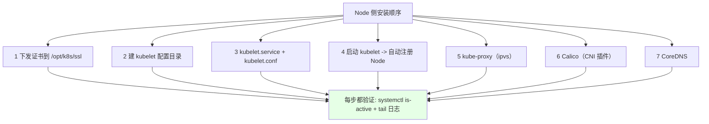
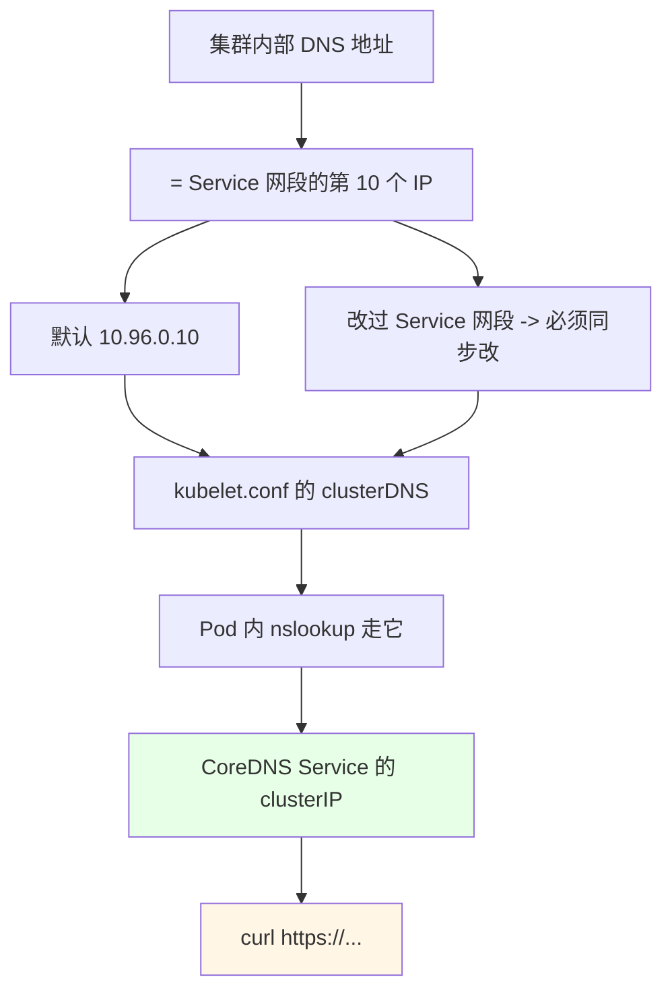
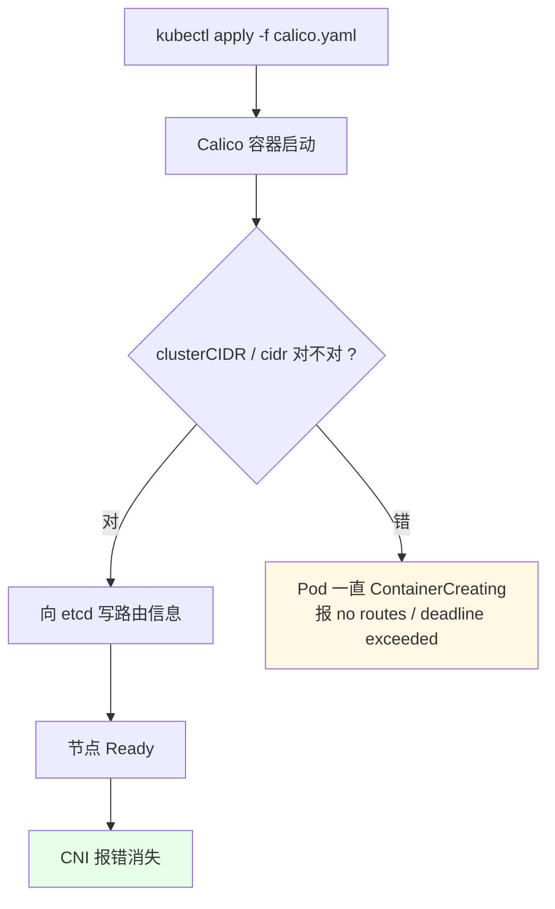
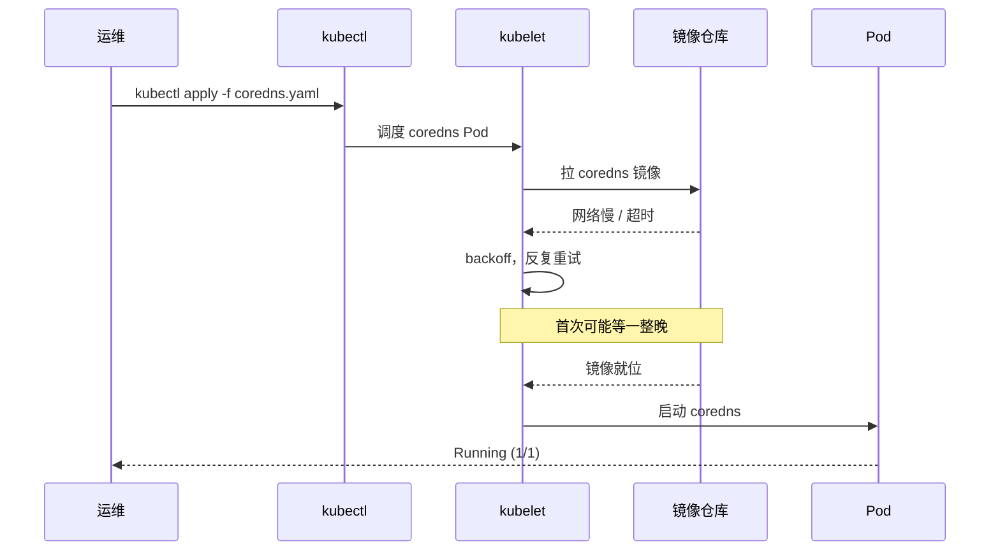

# Kubernetes 集群部署: 二进制集群的 Node 节点配置与 kubelet / kube-proxy / Calico / CoreDNS 安装

控制面齐了，最后一块拼图是 **Node**。这一节把证书发过去、把 kubelet 和 kube-proxy 拉起、装上 Calico 网络插件和 CoreDNS，集群才算「能用」。

结论先给：

- **生产环境不该在 Master 上跑业务 Pod**，所以 master 上也装 kubelet 但**后面要打污点（taint）**把它挡住；测试环境为了榨干机器可以不管；
- **kubelet 的配置文件单独拆一个文件**，因为它的配置项远多于 apiserver / scheduler —— 这是唯一一个「配置与参数分开」的组件；
- **`--cluster-dns` 必须指向 Service 网段的第 10 个 IP（默认 10.96.0.10）**：_clusterIP 改过网段却忘了改这里，Pod 里 `nslookup` 全部超时；
- **CNI 找不到插件的报错在装网络插件之前是正常的**，装完 Calico 自愈；
- 系统组件（Calico、CoreDNS、Metrics、Dashboard）**都在 `kube-system` 里**，生产环境必须把镜像地址换成内网仓库，否则夜里拉不下来就是明早的故障。

## 纲要

- Node 侧要铺的东西与证书下发
- kubelet 的 service、配置与 cgroup driver
- clusterDNS 与 Service 网段的对应关系
- 启动 kubelet 与常见的 CNI 报错
- kube-proxy（IPVS 模式）
- Calico 网络插件
- CoreDNS
- 验证与排错清单

## Node 侧要铺的东西与证书下发



```text
单台 node 上的目录布局：
├── /opt/k8s
│   ├── bin               # kubelet / kube-proxy（从 master scp 过来）
│   ├── cfg
│   │   ├── kubelet.conf      # KubeletConfiguration（单独一个文件）
│   │   └── kube-proxy.conf
│   ├── ssl               # ca.pem / kubelet 相关证书
│   └── logs
└── /usr/lib/systemd/system
    ├── kubelet.service
    └── kube-proxy.service
```

> **Master 上也装 kubelet**：教学/测试环境让 master 顺带跑业务 Pod 能省机器；生产环境不建议，标准做法是给 master 打上 `node-role.kubernetes.io/master:NoSchedule` 这类污点，业务 Pod 就调度不上来了（污点/容忍的机制在后面章节展开）。

```bash
# 只在 master-01 上执行一次，把证书和二进制推给所有 Node
for NODE in node-01 node-02 node-03; do
  scp -r /opt/k8s/ssl $NODE:/opt/k8s/
  scp -r /opt/k8s/bin $NODE:/opt/k8s/
  ssh $NODE 'mkdir -p /opt/k8s/{cfg,logs} /var/lib/kubelet /var/lib/kube-proxy /var/log/pods'
done
```

日志策略：课程里**没有给这几个组件单独配置日志文件**，统一走系统日志（journald / `/var/log/messages`），排查时按组件名 grep；有自定义日志需求的可以按组件改 `StandardOutput` 路径。

## kubelet 的 service 与配置

kubelet 的 unit 写法和 apiserver / scheduler 完全同模板：

```bash
cat > /usr/lib/systemd/system/kubelet.service <<'EOF'
[Unit]
Description=Kubernetes Kubelet
Documentation=https://github.com/kubernetes/kubernetes
After=containerd.service docker.service
Requires=containerd.service docker.service

[Service]
ExecStart=/opt/k8s/bin/kubelet \
  --config=/opt/k8s/cfg/kubelet.conf \
  --bootstrap-kubeconfig=/opt/k8s/cfg/bootstrap.kubeconfig \
  --kubelet-config=/opt/k8s/cfg/kubelet.kubeconfig \
  --logtostderr=true \
  --v=2 \
  --hostname-override=node-01
Restart=always
RestartSec=5
LimitNOFILE=65536
LimitNPROC=65536
PrivateTmp=true
TimeoutStartSec=0

[Install]
WantedBy=multi-user.target
EOF
systemctl daemon-reload
systemctl enable --now kubelet
```

**两个 kubeconfig 的分工**是这一节的关键：


| 参数 | 值 | 作用 |
| --- | --- | --- |
| `--bootstrap-kubeconfig` | `bootstrap.kubeconfig` | **首次启动**用来申报「我要证书」 |
| `--kubelet-config` | `kubelet.kubeconfig` | 证书签发后由 controller-manager 写回，之后跑业务用 |
| `--config` | `kubelet.conf` | KubeletConfiguration，配置项多所以单独一个文件 |
| `--hostname-override` | 本机主机名 | 注册进 etcd 的 Node 名，必须和证书里的一致 |
| `--pod-infra-container-image` | pause 镜像 | 每个 Pod 都会起一个 pause 容器兜住网络命名空间 |

kubelet 的配置单独拆文件是因为**它的可调项实在太多**（其余组件塞在一行 flags 里就够了）：

```bash
cat > /opt/k8s/cfg/kubelet.conf <<'EOF'
kind: KubeletConfiguration
apiVersion: kubelet.config.k8s.io/v1beta1
address: 0.0.0.0
port: 10250
readOnlyPort: 10255
cgroupDriver: systemd
clusterDNS:
  - 10.96.0.10
clusterDomain: cluster.local
failSwapOn: false
maxPods: 512
evictionHard:
  imagefs.available: 5%
  nodefs.available: 5%
EOF
```

> 这份 `kubelet.conf` 里最要紧的是 `cgroupDriver: systemd`（与 Docker 的 `native.cgroupdriver=systemd` 必须一致）和 `clusterDNS`；字段写错 kubelet 会直接报 `failed to load Kubelet Configuration`，unit 起不来。用 `kubelet --config /opt/k8s/cfg/kubelet.conf --dry-run` 可以先校验不落盘。

暂停容器（pause）镜像现在到 3.2 了，和 3.1 差别不大，按需换；这个镜像容器平时用不上，但**每个 Pod 都隐含跑一个它**（负责持有 Pod 的 network namespace）。

## clusterDNS 与 Service 网段的对应



用 kubectl 确认真实地址，别靠推算：

```bash
kubectl get svc -n kube-system
# NAME      TYPE        CLUSTER-IP   PORT(S)     AGE
# coredns   ClusterIP   10.96.0.10   53/UDP,53/TCP  3d

kubectl get svc
# kubernetes   ClusterIP   10.96.0.1   443/TCP   3d
```

- **第一个** ClusterIP 是 `kubernetes` 这个 Service 本身（10.96.0.1）；
- **第 10 个**一般就是 CoreDNS 的地址（10.96.0.10）。

**只要你把 `10.96.0.0/16` 改成了别的网段，`kubelet.conf` 里的 `clusterDNS`、`kube-proxy` 的 `clusterCIDR`、CoreDNS 部署文件里的 `clusterIP`、`--service-cluster-ip-range` 四处都要跟着改** —— 忘一处，症状就是 Pod 里 DNS 解析全超时，但 `kubectl get pods` 一片正常，很容易误判。

同理，**Pod 网段 `10.244.0.0/16` 改过的话**，Calico 配置里的 `cidr` 也要跟着改。

## 启动 kubelet 与 CNI 报错

```bash
systemctl restart kubelet
systemctl status kubelet
tail -100 /var/log/messages | grep -i kubelet
```

**「找不到 CNI」这类报错在装网络插件之前是预期的**：

```text
kubelet 启动后的典型日志（装 Calico 之前）：
├── 正常打印的部分
│   └── "Starting kubelet" / "Starting HTTP Server" / "Node ... registered"
└── 预期内的报错
    └── "Didn't find network plugin installable under ..."
        "CNI failed to retrieve network plugin version"
```

这个报错**不是故障**，后面装上 Calico 就会消失。真正要盯的是「Node 注册了但没有 Ready」以外的硬报错（比如 `failed to load kubelet configuration`、`certificate has expired`）。

```bash
# 看节点有没有登记进来
kubectl get nodes
# NAME      STATUS     ROLES    AGE   VERSION
# master-01 Ready      <none>   20m   v1.19.0
# node-01   NotReady   <none>   10s   v1.19.0

# 看 kubelet 自己报了什么
journalctl -u kubelet -n 100 --no-pager | grep -iE 'error|failed'
```

## kube-proxy（IPVS 模式）

```bash
# 在 master-01 上生成 kube-proxy 的 kubeconfig，再推给所有节点
kubectl config set-cluster kubernetes \
  --certificate-authority=/opt/k8s/ssl/ca.pem \
  --embed-certs=true \
  --server=https://10.0.0.211:8443 \
  --kubeconfig=/opt/k8s/cfg/kube-proxy.kubeconfig

kubectl config set-credentials kube-proxy \
  --client-certificate=/opt/k8s/ssl/kube-proxy.pem \
  --client-key=/opt/k8s/ssl/kube-proxy-key.pem \
  --embed-certs=true \
  --kubeconfig=/opt/k8s/cfg/kube-proxy.kubeconfig

kubectl config set-context kube-proxy@kubernetes \
  --cluster=kubernetes --user=kube-proxy \
  --kubeconfig=/opt/k8s/cfg/kube-proxy.kubeconfig

kubectl config use-context kube-proxy@kubernetes \
  --kubeconfig=/opt/k8s/cfg/kube-proxy.kubeconfig

for NODE in master-01 master-02 master-03 node-01 node-02 node-03; do
  scp /opt/k8s/cfg/kube-proxy.kubeconfig $NODE:/opt/k8s/cfg/
done
```

```text
kube-proxy 的启动形态：
├── --config=/opt/k8s/cfg/kube-proxy.conf   # KubeProxyConfiguration
├── --cluster-cidr=10.244.0.0/16            # 必须和 Calico 的 cidr 一致
└── 模式: ipvs                                # 依赖前面配好的 ip_vs 内核模块
```

```bash
cat > /usr/lib/systemd/system/kube-proxy.service <<'EOF'
[Unit]
Description=Kubernetes Kube-Proxy
Documentation=https://github.com/kubernetes/kubernetes

[Service]
ExecStart=/opt/k8s/bin/kube-proxy \
  --config=/opt/k8s/cfg/kube-proxy.conf \
  --logtostderr=true \
  --v=2
Restart=always
RestartSec=5
LimitNOFILE=65536

[Install]
WantedBy=multi-user.target
EOF
systemctl daemon-reload

# 所有节点都启动
for NODE in master-01 master-02 master-03 node-01 node-02 node-03; do
  ssh $NODE 'systemctl enable --now kube-proxy && systemctl is-active kube-proxy'
done
```

| 项 | 取值 | 说明 |
| --- | --- | --- |
| `--cluster-cidr` | 10.244.0.0/16 | 决定 SNAT 范围，和 Calico `cidr` 必须一致 |
| proxy mode | `ipvs` | 前面装过 IPVS 内核模块，这里才敢用 |
| `clusterCIDR`（conf 内） | 10.244.0.0/16 | 同上，conf 文件里写 |
| 逐台不同 | 无 | kube-proxy 只有 kubeconfig 里的证书不同 |

## Calico 网络插件

Calico 会把**每个 Node 当成一个路由器**，给 Pod 分一个全集群唯一的 IP，这份信息存在 etcd 里。

```bash
# 只改两处网段（和前面改动保持一致即可，默认不用动）
sed -i 's#10.244.0.0/16#10.244.0.0/16#g' calico.yaml
sed -i 's#10.96.0.0/16#10.96.0.0/16#g' calico.yaml

kubectl apply -f calico.yaml
kubectl get pod -n kube-system
```

> **改过 Pod 网段（`10.244`）要改 Calico 配置里的 `cidr`；改过 Service 网段（`10.96`）要改 Calico 配置里对应的变量**。`10.244` / `10.96` 跟你们公司内网不冲突的话，这两处都不用动，直接用。



**系统组件都在 `kube-system` 这个 namespace 下**做隔离：Calico、CoreDNS，以及后面要装的 Metrics Server / Dashboard，全部在这里。

```bash
kubectl get pod -n kube-system
kubectl describe pod calico-node-xxxxx -n kube-system
kubectl logs -f calico-node-xxxxx -n kube-system
```

| 步骤 | 命令 | 预期 |
| --- | --- | --- |
| 创建 | `kubectl apply -f calico.yaml` | `daemonset.apps/calico-node created` |
| 看状态 | `kubectl get pod -n kube-system` | `Running` |
| 看详情 | `kubectl describe pod -n kube-system` | Events 里无 Error |
| 看日志 | `kubectl logs -f -n kube-system` | 无 panic / conn refused |
| 节点就绪 | `kubectl get nodes` | 全部 `Ready` |
| CNI 报错 | `journalctl -u kubelet` | 之前的 CNI 报错消失 |

**容器的日志按 Pod 看**：`kubectl describe` 拿到 Pod 名再 `kubectl logs`，describe 能看到 Events（比如 `FailedScheduling` / `BackOff` 拉取镜像失败），logs 能看到容器自己打了什么。

Calico 装完，节点的 `NotReady` 和 kubelet 的 CNI 报错一起消失 —— **到这里集群主体就搭完了**。

> 生产环境里这些镜像**一定要推到公司内网 hub 并改掉 `image:` 前缀**，否则外网一断、镜像一过期，`ImagePullBackOff` 就是第二天早上的事故。

## CoreDNS

```bash
# 下载官方部署清单（课程提前下好了）
curl -sk https://raw.githubusercontent.com/coredns/deployment/master/misc/k8s-deploy.yaml -o coredns.yaml

# clusterIP 要填 Service 网段的第 10 个 IP，填错了所有 Pod 的解析都废
sed -i 's#10.96.0.10#10.96.0.10#' coredns.yaml
kubectl apply -f coredns.yaml
```

```text
kube-system 下最终的系统组件清单：
├── pod/calico-node-xxxxx      # DaemonSet，每节点一个
├── pod/coredns-xxxxxxxxxx     # Deployment，ClusterIP 指向 10.96.0.10
├── pod/metrics-server-xxxxx   # 资源指标（后续章节）
├── service/kube-dns           # 名字可能不同，看实际
│   └── clusterIP: 10.96.0.10
└── service/kubernetes         # clusterIP: 10.96.0.1
```

首次 apply 会有一个**很慢的拉镜像过程**，新环境等一晚上也正常：

```bash
kubectl get pod -n kube-system -w
# coredns-6cd6ff9dbd-xxxxx  0/1   Pending / ContainerCreating / ImagePullBackOff
```

- 刚 apply 时是 `Pending` → `ContainerCreating` → `ErrImagePull` / `ImagePullBackOff`；
- CoreDNS 的镜像在 Docker 官方（国外）仓库，**国内环境下载慢是常态**；生产环境同样要先推到内网仓库再改 `image:` 地址。



## 常见排错

| 现象 | 原因 | 处理 |
| --- | --- | --- |
| Node 一直 `NotReady`，kubelet 报 CNI | 网络插件还没装 | 装 Calico，重启 kubelet |
| Pod 一直 `ContainerCreating` | Pod / Service 网段与 CNI 不一致 | 对齐 Calico `cidr` 与 `--cluster-cidr` |
| Pod 里 `nslookup` 超时但 Pod 全 Running | `clusterDNS` 没跟上 Service 网段改动 | 改 `kubelet.conf` 的 `clusterDNS` 并重启 kubelet |
| `ImagePullBackOff` | 镜像在国内拉不动 | 推内网仓库，改 `image:` 前缀 |
| Pod 起一下就 `CrashLoopBackOff` | 应用自身或配置错 | `kubectl logs` 看应用日志 |
| 拉镜像时等太久 | 首次冷启动 | 耐心等；生产提前预热镜像 |
| `kubectl describe` 看不到 Events | 用错了 namespace | 加 `-n kube-system` |

## API 速览

| 能力 | 做法 | 关键对象 / 参数 |
| --- | --- | --- |
| 节点自动注册 | kubelet 带 bootstrap kubeconfig 启动 | `--bootstrap-kubeconfig` |
| Pod 网络兜底容器 | 指定 pause 镜像 | `--pod-infra-container-image` |
| Pod 内 DNS 解析 | kubelet 指向 CoreDNS 地址 | `clusterDNS: [10.96.0.10]` |
| Service VIP 转发 | kube-proxy IPVS 模式 | `--cluster-cidr` / proxy mode |
| 每台节点跑一个 | Calico 用 DaemonSet | `calico-node` |
| 集群域名解析 | CoreDNS Deployment | `clusterIP` = Service 网段第 10 个 IP |
| 系统组件隔离 | 全部放一个 namespace | `-n kube-system` |
| Pod 排障三板斧 | describe / logs / get | `kubectl describe pod`、`kubectl logs -f` |
| 镜像加速 | 推内网仓库改前缀 | `image: <内网hub>/coredns:1.7.0` |

## Demo 示例

一个**批量把 Node 拉起来并校验**的脚本：下发 → 起 kubelet → 起 kube-proxy → 装 Calico → 装 CoreDNS → 汇总检查。

```bash
#!/usr/bin/env bash
# setup-node.sh —— 在单台 node 上装 kubelet / kube-proxy，并校验注册结果
# 用法: ./setup-node.sh <node-01|node-02|node-03> [master-01]
set -euo pipefail

# 下面命令中的变量按你的集群环境赋值后再执行
NODE_NAME="${1:?用法: $0 $RES_NAME <master 主机名，可选>}"
MASTER="${2:-master-01}"
VIP="10.0.0.211"
LB_PORT="8443"
POD_CIDR="10.244.0.0/16"
CLUSTER_DNS="10.96.0.10"

log() { printf '\n[node] %s\n' "$*"; }
die() { printf '\n[node] ERROR: %s\n' "$*" >&2; exit 1; }

log "0. 从 ${MASTER} 拉二进制与证书"
mkdir -p /opt/k8s/{bin,cfg,ssl,logs} /var/lib/kubelet /var/log/pods
rsync -av --exclude=data "${MASTER}":/opt/k8s/bin/ /opt/k8s/bin/
rsync -av "${MASTER}":/opt/k8s/ssl/ /opt/k8s/ssl/
rsync -av "${MASTER}":/opt/k8s/cfg/ /opt/k8s/cfg/

log "1. 写 kubelet 配置（cgroup driver 用 systemd）"
cat > /opt/k8s/cfg/kubelet.conf <<EOF
kind: KubeletConfiguration
apiVersion: kubelet.config.k8s.io/v1beta1
address: 0.0.0.0
port: 10250
readOnlyPort: 10255
cgroupDriver: systemd
clusterDNS:
  - ${CLUSTER_DNS}
clusterDomain: cluster.local
failSwapOn: false
maxPods: 512
EOF

cat > /usr/lib/systemd/system/kubelet.service <<EOF
[Unit]
Description=Kubernetes Kubelet
After=containerd.service docker.service
Requires=containerd.service docker.service
[Service]
ExecStart=/opt/k8s/bin/kubelet \\
  --config=/opt/k8s/cfg/kubelet.conf \\
  --bootstrap-kubeconfig=/opt/k8s/cfg/bootstrap.kubeconfig \\
  --kubelet-config=/opt/k8s/cfg/kubelet.kubeconfig \\
  --hostname-override=${NODE_NAME} \\
  --pod-infra-container-image=registry.aliyuncs.com/k8spod/pause:3.2 \\
  --logtostderr=true --v=2
Restart=always
RestartSec=5
LimitNOFILE=65536
PrivateTmp=true
TimeoutStartSec=0
[Install]
WantedBy=multi-user.target
EOF
systemctl daemon-reload
systemctl enable --now kubelet
sleep 5
systemctl is-active kubelet | sed 's/^/  kubelet: /'

log "2. 起 kube-proxy（ipvs）"
cat > /opt/k8s/cfg/kube-proxy.conf <<EOF
apiVersion: kubeproxy.config.k8s.io/v1alpha1
kind: KubeProxyConfiguration
clusterCIDR: ${POD_CIDR}
mode: ipvs
EOF
cat > /usr/lib/systemd/system/kube-proxy.service <<'EOF'
[Unit]
Description=Kubernetes Kube-Proxy
After=network.target
[Service]
ExecStart=/opt/k8s/bin/kube-proxy --config=/opt/k8s/cfg/kube-proxy.conf --logtostderr=true --v=2
Restart=always
RestartSec=5
LimitNOFILE=65536
[Install]
WantedBy=multi-user.target
EOF
systemctl daemon-reload
systemctl enable --now kube-proxy
sleep 3
systemctl is-active kube-proxy | sed 's/^/  kube-proxy: /'

log "3. 注册结果"
kubectl get nodes 2>/dev/null | grep "$NODE_NAME" | sed 's/^/  /' \
  || echo "  (kubelet 已启动但还没注册上，等几秒再看)"

log "4. 校验 kubelet 是否真的连上 apiserver"
grep -q "x509: certificate has expired\|Unauthorized" <(journalctl -u kubelet -n 200 --no-pager) \
  && die "kubelet 认证失败：核对 bootstrap.kubeconfig 与 master 上的 token" \
  || echo "  [OK] 无认证类报错"

log "5. 校验 IPVS 规则有没有生成"
if command -v ipvsadm >/dev/null 2>&1; then
  ipvsadm -Ln -t "10.0.0.211:${LB_PORT}" | sed 's/^/  /'
else
  echo "  本机没 ipvsadm，跳过（kube-proxy 装 ipvs 模块那一节已统一装过）"
fi

log "6. 提示"
cat <<TIP
  下一步: 在 master-01 上 kubectl apply -f calico.yaml
          kubectl apply -f coredns.yaml
  装完 Calico 后节点会变 Ready，kubelet 的 CNI 报错同步消失
  排障: journalctl -u kubelet -n 200 --no-pager
        kubectl describe pod -n kube-system
TIP
```

## 总结

Node 这一节把「能连上的控制面」变成「能跑业务的集群」。

- **Master 上也装 kubelet 是为了教学/压榨单机资源，生产要给 master 打污点**，别让业务 Pod 上来。
- **kubelet 是唯一把配置和参数拆开的组件**：`kubelet.conf` 放 KubeletConfiguration、`bootstrap.kubeconfig` 换证书、`kubelet.kubeconfig` 跑业务，三者各司其职。
- **`clusterDNS` 就是 Service 网段的第 10 个 IP（默认 10.96.0.10）**：`kubectl get svc` 核对；改过 `10.96` 网段四处都要同步改，漏一处就是「Pod 全绿但 DNS 全挂」。
- **Calico 装完之前，`Didn't find network plugin` 这类 CNI 报错是预期的**，不是故障；装完节点转 Ready，报错自动消失。
- **系统组件全在 `kube-system` 下**，镜像先推内网 hub 再改 `image:` 前缀 —— 首次 apply 拉镜像慢到等一晚上是常态，别急，用 `kubectl describe` + `kubectl logs` 盯。

