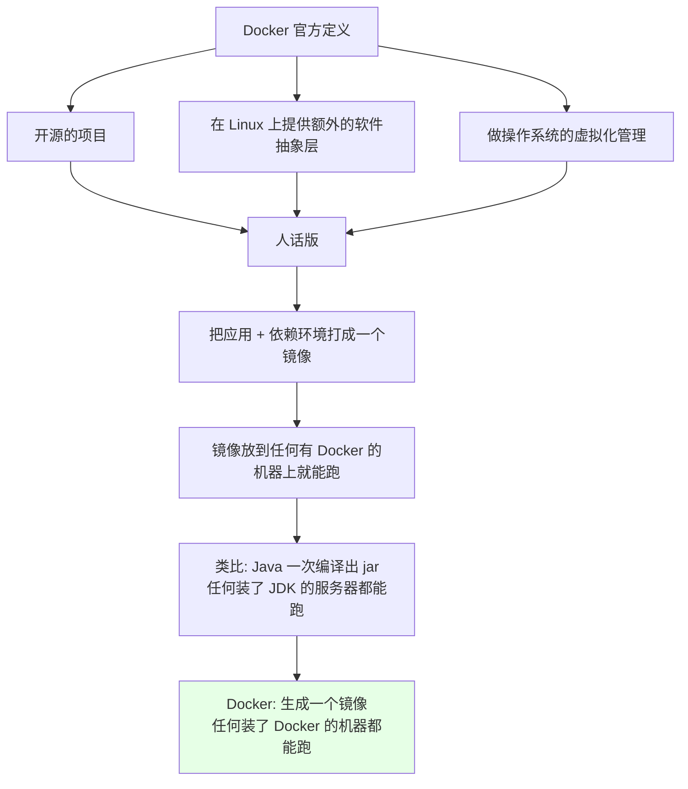
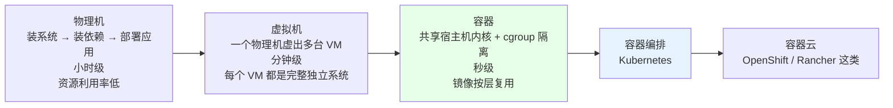
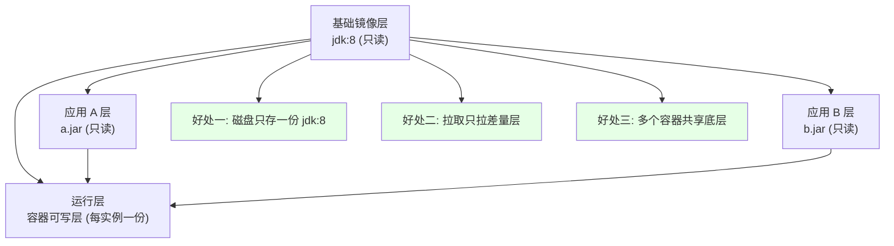
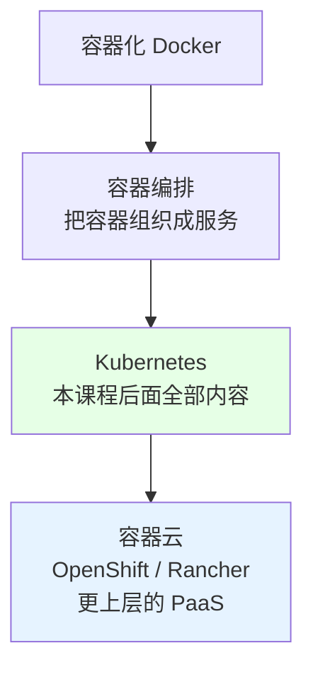

# Kubernetes 集群部署: Docker 基础 —— 容器化是什么、镜像为什么按层存

用 k8s 的时候，**Docker 其实被封装在 k8s 里了**，日常对着敲的命令很少。但作为后面写 Dockerfile、做小镜像、理解 Pod 排障的前提，这一节要把「Docker 到底是什么」讲清楚。

结论先给：

- **Docker 是一个开源项目，在 Linux 上提供额外的软件抽象层来做操作系统虚拟化** —— 官方定义很绕，落地就是一句：**把自己写的应用 + 依赖环境打成一个镜像，这个镜像能在任何装有 Docker 的机器上跑**；
- **部署方式的演进是「物理机 → 虚拟机 → 容器」**：物理机要装系统 / 装依赖 / 部署应用，小时级；虚拟机分钟级但**每个 VM 都是独立完整系统，很吃资源**；容器**共享宿主机内核**，秒级启动；
- **镜像是按层存储的**：两个都基于 `JDK 1.8` 基础镜像的 Java 应用，**共享同一个基础层**，只多出自己的那一层代码 —— 既省磁盘，也让分发变得极快；
- 容器不是起了一台完整 Linux，而是**借 cgroup 做了隔离的进程**；
- 这一节是「Docker 基本命令」和「Dockerfile 编写」的共同前提。

## 纲要

- Docker 的官方定义与人话版
- 部署演进：物理机 / 虚拟机 / 容器
- 镜像分层到底省了什么
- 容器的启动开销与隔离机制
- 从容器化到容器编排再到容器云
- 与 k8s 的关系和学习路线

## Docker 的官方定义与人话版



把官方那三句话拆开就是：

| 官方用词 | 说人话 |
| --- | --- |
| 开源项目 | 源码公开、可自己编译的社区工具链 |
| 额外的软件抽象层 | 在内核之上再包一层，让进程以为自己拥有一台机器 |
| 操作系统虚拟化管理 | 比虚拟机更轻的那种「虚拟化」 |

> Java 那句类比值得记牢：**Java 是「一次编译到处运行」（字节码 + JVM）；Docker 是「一次构建到处运行」（镜像 + Docker 运行时）**。前者要求目标机器有 JDK，后者要求目标机器有 Docker —— 后面「制作小镜像」那几节能一直吃到这个类比。

## 部署演进：物理机 → 虚拟机 → 容器



```text
三种部署形态的对比：
├── 物理机年代
│   ├── 1 台机器装 1 个应用
│   ├── 扩容 = 加物理机 + 重装一遍依赖 + 再部署
│   ├── 问题: 配置繁琐、资源利用率不高、重复劳动
│   └── 时间量级: 小时
├── 虚拟机年代（KVM / VMware 那类）
│   ├── 1 台物理机虚成多台 VM
│   ├── 依赖环境做成系统模板，从模板起虚拟机
│   ├── 好处: 装依赖这步省了，资源利用率上去
│   ├── 问题: 做镜像/起机器很吃系统资源，启动慢
│   └── 时间量级: 分钟
└── 容器年代（Docker）
    ├── 基础镜像里已经有依赖环境
    ├── 把自己的代码/包放进去 → 一个新镜像
    ├── 镜像到哪台机器都能起（集装箱概念）
    └── 时间量级: 秒
```

关键取舍：

| 维度 | 物理机 | 虚拟机 | 容器 |
| --- | --- | --- | --- |
| 是否独立完整系统 | 是 | 是 | **否，共享宿主机内核** |
| 启动耗时 | 小时级 | 分钟级 | **秒级** |
| 内存/磁盘开销 | 无额外开销 | 每个 VM 都要装一套系统 | **只多一个进程 + 只读层** |
| 资源利用率 | 低（通常 10%~30%） | 中 | 高 |
| 依赖环境复用 | 不能 | 靠模板 | **靠镜像分层共享** |
| 隔离性 | 最强 | 强 | 中（namespace + cgroup） |

物理机的老路是：**一台机器扛不住 → 加物理机 → 再装一遍依赖 + 再部署一次**，纯重复劳动；虚拟机的老路是：**做系统模板 → 起 VM → 装应用**，省了依赖但模板和起机都慢。容器直接把「依赖环境」做成可复用镜像层，应用只负责最上面那层。

## 镜像分层到底省了什么



举个课程里的具体例子：

```text
两个 Java 应用，都用同一个 jdk:8 基础镜像：
├── 应用 A: 基础层 jdk:8 + 上层 a.jar     -> 镜像 A
├── 应用 B: 基础层 jdk:8 + 上层 b.jar     -> 镜像 B
└── jdk:8 这一层物理上只存一份，A 和 B 共用

结果:
├── 磁盘: 只多付 b.jar 的空间，jdk:8 不重复
├── 网络: 拉镜像 B 时 jdk:8 层已经在本地，只传差量
└── 启动: 两个容器共享底层页缓存，冷启动几乎无额外读盘
```

这就是为什么**「做一个 java 基础镜像」这件事本身是有复利的**：所有人Product都从同一个 `jdk:8` 起，公司里所有 Java 镜像的第一层完全一样。

按层存储带来的三个直接收益：

1. **省空间** —— 同基础镜像的 N 个应用只存一份基础层；
2. **省带宽** —— 拉取镜像只下载缺失的层，私有registry 里层还能跨镜像去重；
3. **快启动** —— 容器启动时不需要复制整个系统，只要挂上去一个可写层。

## 容器的启动开销与隔离机制

```text
起一个 Docker 容器 ≈ 起一个受限制的 Linux 进程：
├── namespace  : PID / Mount / Network / UTS / IPC / User 隔离
├── cgroup     : CPU / Memory / Pids / Blkio 限制（前面装 kubelet 时改 systemd driver 就是它）
└── rootfs     : 镜像的只读层叠加出来的根文件视图
```

所以课程里那句「起了个 Docker 相当于起了个 Linux 环境，但这个 Linux 依赖宿主机内核，只是用 cgroup 做了隔离」是准确的 —— **容器里没有内核，起得比虚拟机快就是因为这个**。

| 观察项 | 物理机 | 虚拟机 | 容器 |
| --- | --- | --- | --- |
| 有没有自己的内核 | 有 | 有 | **没有** |
| 依赖宿主机内核 | — | — | ✅ 强依赖 |
| Windows 容器跑在 Linux 宿主机 | — | 可以 | **不行** |
| 单进程即可占用 | 完整机器 | 几百 MB 起 | 几 MB 起 |

## 从容器化到容器编排再到容器云



技术趋势线是：**物理机 → 虚拟机 → 云计算（阿里云 / 百度云这种）→ 容器化 → 容器编排（k8s）→ 容器云（OpenShift、Rancher 这类）**。你现在站在「容器化 → 容器编排」这个交接点上：这一节和后面几节（Docker 基本命令、Dockerfile、小镜像）负责下面那半截，k8s 那几节负责上面那半截。

## 与 k8s 的关系

```text
k8s 里的 Docker 位置：
├── Node
│   └── kubelet
│       ├── CRI 接口
│       └── 容器运行时 (Docker / containerd)
│           └── 容器 (你的应用)
└── 平时你要敲的命令其实只有这几类
    ├── docker build / push      # 做镜像、推仓库
    ├── docker pull / images      # 拉镜像、看本地镜像
    └── docker ps / logs / exec   # 看容器、看日志、进容器
```

**用 k8s 的时候对 Docker 的直接操作很少**，但三件事绕不开：

1. **Dockerfile 要会写** —— 持续集成/持续部署里天天写，镜像质量直接决定集群资源占用；
2. **镜像要会瘦身** —— 后面「制作小镜像」「多阶段构建」「scratch 镜像」三节就是把这件事做到极致；
3. **容器的日志和状态要会看** —— Pod 排障最终都会落到 `docker logs` / `kubectl logs` 这一层。

## API 速览

| 能力 | 做法 | 关键概念 |
| --- | --- | --- |
| olang理解 Docker 是什么 | 官方定义 + 人话版对照 | 软件抽象层 / 操作系统虚拟化 |
| 依赖环境复用 | 做语言级基础镜像 | `jdk:8` / `php:7` 这类 base image |
| 空间与启动优化 | 镜像按层存储 | 联合文件系统（overlayfs / aufs） |
| 秒级启动 | 共享宿主机内核 + namespace/cgroup | 不是完整虚拟机的替代 |
| 镜像到处能跑 | 一次构建到处运行 | 类比 Java 的「一次编译到处运行」 |
| 应用打包 | 基础镜像 + 自己的包/代码 → 新镜像 | Dockerfile 的产物 |
| 集群化管理 | 容器编排 | Kubernetes |
| 更上层封装 | 容器云 | OpenShift / Rancher |

## Demo 示例

先把「分层」这件事**用命令看到**，再谈优化：

```bash
#!/usr/bin/env bash
# demo-layers.sh —— 直观感受镜像分层与共享基础层
set -euo pipefail

log() { printf '\n[docker] %s\n' "$*"; }

log "0. 看 Docker 是否在跑"
docker version --format '  Server: {{.Server.Version}}'

log "1. 拉一个语言级基础镜像（所有 Java 应用的第一层）"
docker pull openjdk:8-jdk-alpine

log "2. 基于它做两个应用镜像，只改最上面那层"
printf 'public class A { public static void main(String[] a) { System.out.println("app-A"); } }\n' > A.java
printf 'public class B { public static void main(String[] a) { System.out.println("app-B"); } }\n' > B.java

cat > Dockerfile.A <<'EOF'
FROM openjdk:8-jdk-alpine
COPY A.java /app/A.java
WORKDIR /app
RUN javac A.java && rm -f A.java
ENTRYPOINT ["java", "-cp", "/app", "A"]
EOF

cat > Dockerfile.B <<'EOF'
FROM openjdk:8-jdk-alpine
COPY B.java /app/B.java
WORKDIR /app
RUN javac B.java && rm -f B.java
ENTRYPOINT ["java", "-cp", "/app", "B"]
EOF

docker build -f Dockerfile.A -t demo-app-a:1.0 .
docker build -f Dockerfile.B -t demo-app-b:1.0 .

log "3. 看两个镜像有多少层是共享的"
docker history openjdk:8-jdk-alpine --human --format '  {{.Size}}\t{{.CreatedBy}}' | head -5
echo "  ---- 应用 A 独有层 ----"
docker images demo-app-a:1.0 --format '  {{.ID}}  {{.Size}}'

log "4. 起两个容器，看启动耗时"
for APP in a b; do
  /usr/bin/time -f "  [${APP}] 启动耗时 %e 秒" \
    docker run --rm "demo-app-${APP}:1.0"
done

log "5. 对比一下：虚拟机/物理机要花的时间量级"
cat <<'TIP'
  物理机: 装系统 + 装依赖 + 部署  => 小时级
  虚拟机: 用模板起 VM + 部署     => 分钟级
  容器:   镜像直接起              => 秒级
TIP
```

```bash
# 一条命令就能看到分层（第一行是最新的层，最后一行是基础层）
docker history demo-app-a:1.0 --human
# IMAGE          CREATED        SIZE      CREATED BY
# <none>         5 seconds ago  4.21MB    /bin/sh -c javac A.java
# <none>         2 minutes ago  0B        /bin/sh -c #(nop) COPY file:xxx in /app
# ...
# openjdk        3 days ago     97.6MB    /docker-entrypoint.sh ...
```

## 总结

Docker 这一节的价值不在于背定义，而在于建立一条完整的因果链。

- **Docker = 把应用 + 依赖打成一个镜像，这个镜像可以在任何装了 Docker 的机器上跑** —— 类比 Java「一次编译到处运行」，Docker 是「一次构建到处运行」。
- **演进路线是物理机 → 虚拟机 → 容器**：物理机小时级且重复装依赖，虚拟机省了依赖但每个都是完整系统、很吃资源，容器共享内核 + cgroup 隔离，做到秒级启动和高利用率。
- **镜像按层存储是核心机制**：同 `jdk:8` 基础的两个应用共享底层，省磁盘、省带宽、启动快 —— 这也是「先做一个语言级基础镜像」的复利来源。
- **容器不是轻量虚拟机**：它没有自己的内核，靠 namespace + cgroup 隔离，所以**容器必须跑在和宿主机同构的内核上**。
- **用 k8s 时 Docker 操作很少**，但 Dockerfile 怎么写、镜像怎么瘦下来、容器日志怎么看，这三件事是后面所有 k8s 排障的地基。

